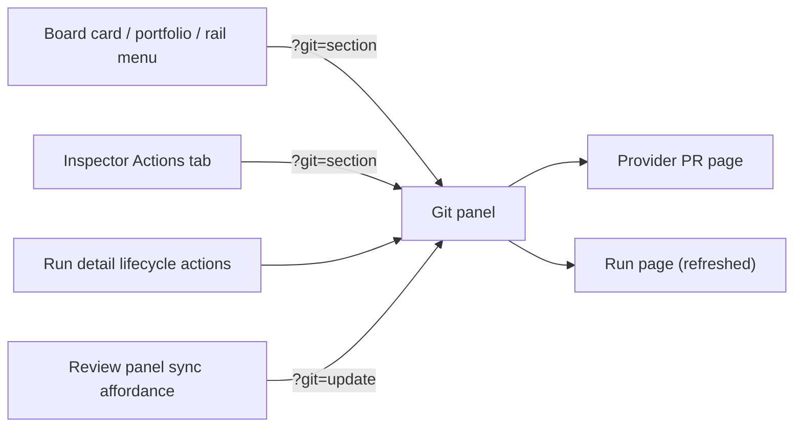
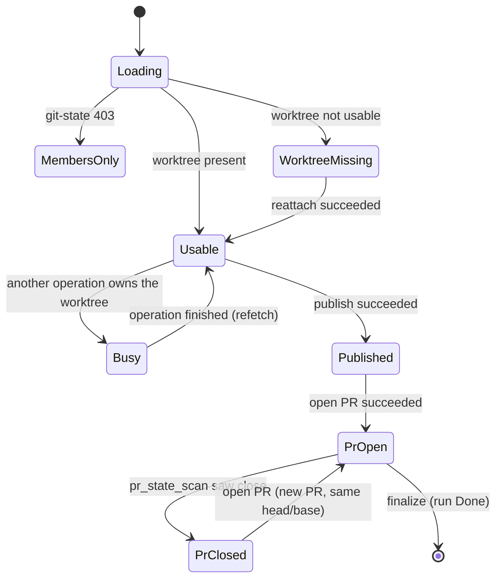

# Run git panel

- **Type:** block (a dialog opened from the run's lifecycle actions).
- **Routes:** shared by `/runs/{runId}` (flow and agent runs) and
  `/scratch-runs/{runId}`; deep-linked with `?git=<section>`.
- **Status:** Implemented (ADR-181).
- **Source:** `web/components/workbench/git-panel.tsx`, hosted by
  `web/components/workbench/lifecycle-actions.tsx` (`variant="detail"`).

## JTBD

When a run has stopped writing to its worktree — in review, crashed, failed,
done or abandoned — I want every git action for that worktree in one place,
so I can commit or discard what is there, publish it under a name a reviewer
recognises, bring in the base, the target or my own pushes, and open or
finalize a PR, without a shell on the server.

When the worktree is gone, I want to re-create it from wherever the branch
still lives, so the run's work is never a dead end.

## Roles & capabilities

| Role | Sees / does |
| --- | --- |
| Project viewer | Sees the lifecycle actions; opening the panel shows a localized members-only state (`git-state` answers 403). |
| Project member | Reads `git-state`; commits, discards, publishes, updates, opens and finalizes PRs, re-attaches, archives and drops, as the workbench git policy enables. |
| Open rework-claim owner (`HumanWorking`) | The full git set on the run detail except `archive`, `drop`, `stop` and `finalizePr`, which stay `human-owned`. Cards and the rail offer nothing while the claim is open. |
| Project admin / owner, global admin | Member capabilities. |

Every button is enabled from the `actions[]` the server returns; a disabled
button carries its localized reason as a tooltip. The server routes stay the
authority (`requireProjectAction("promoteRun")` for mutations,
`recoverRun` for `git-state` and reattach).

## Navigation

- **Entry:** the run detail's lifecycle actions (the entry that used to open
  the Export dialog); the review panel's sync affordances (`review-sync-open`,
  the drift card's Sync branch) open the Update section; board card, portfolio
  and left-rail menus and the inspector Actions tab link to
  `/runs/{runId}?git=<section>` — never a blind mutation from a card.
- **Within:** sections are anchored; `?git=` selects one on open.
- **Exit:** closing the panel keeps the run page; a published branch or an
  opened PR links out to the provider; Finalize returns the run page in `Done`.

| `git=` value | Section | Actions it hosts |
| --- | --- | --- |
| `tree` | Tree (default when usable) | `snapshotCommit`, `discardChanges` |
| `publish` | Publish | `exportBranch` (+ the handoff-branch form) |
| `update` | Update | `update` |
| `pr` | PR | `openPr`, `finalizePr` |
| `reattach` | Reattach (default when the worktree is not usable) | `reattach` |

An unknown value opens the default section.

## Layout & regions

1. **Header** — the internal branch (the run's identity), the public-name chip
   (`<remote>/<branch>`; which rule chose the name — `upstream` / `request` /
   `template` — is the publish response's `nameSource`), the PR chip
   (`open` / `merged` / `closed`, or "open (not tracked)" for a scratch run,
   whose PRs `pr_state_scan` does not track), and a busy chip naming the
   operation that owns the worktree.
2. **Tree** — dirty counts (tracked / untracked). **Commit** opens the existing
   snapshot-commit form. **Discard** opens the shared destructive confirmation,
   which says every change is saved to a rescue ref first; after success the
   section names that ref and shows the copyable restore command. Rescue refs
   already written are listed newest first.
3. **Publish** — a remote select (from `remotes`), and a name field pre-filled
   from the project template. The field is hidden when an upstream already
   fixes the name, and the chip says so. A force checkbox appears only after a
   `non_fast_forward` refusal; the forced retry is the explicit-SHA lease. A
   secondary **Handoff branch…** action opens the existing handoff form (remote
   + handoff branch name), unchanged.
4. **Update** — an `onto` choice (`target` / `base` / `published`), each option
   showing its ahead/behind counts; the rebase/merge strategy; a push toggle
   defaulting to "published"; and the AI-resolver toggle with its runner,
   rendered ONLY for a `Review` run. A "the remote moved" hint appears when
   `publishedRemoteHead` differs from `publishedTrackingHead`. A conflict result lists the conflicted paths,
   and the tree is back where it started.
5. **PR** — once the branch is published, the section is the Open PR form:
   title, body, target and a draft checkbox, pre-filled by the server
   (`prDefaults`: the task key and title, the run link); before that it says
   to publish first. A `reused` answer says the existing PR was returned
   untouched and nothing was applied. **Finalize** is shown while a PR is
   recorded and disabled with a reason when the PR is closed or the run is not
   finalizable. From `Review` it sends the target head the panel rendered, and
   a drift refusal offers **Finalize anyway**; outside `Review` it opens the
   shared destructive confirmation first, since no readiness is asserted
   there.
6. **Reattach** — rendered INSTEAD of Tree / Publish / Update / PR when the
   worktree is not usable; lists which sources resolve (local branch,
   published branch, archive ref) and re-creates the worktree from the first.
7. **Commands** — copyable checkout lines for the published branch and the
   restore line for the newest rescue ref.

Typed input — the Open PR form, the publish name, the commit message — is
rendered outside the `git-state` refresh boundary and survives a refetch tick.
Every completed mutation reports through the shared feedback provider, then
re-fetches `git-state` and refreshes the route. Errors resolve from
`MaisterError.code` + `details.reason` to EN/RU copy; no raw server message is
rendered.

The Archive and Drop confirmations (still owned by `lifecycle-actions.tsx`)
fetch `git-state` on open and show the unpushed commits and dirty files that
exist on no remote. They offer **Publish, then archive/drop** (the destructive
op runs only after the publish succeeded) or **Archive/drop anyway**.

## States

The panel's meaningful states; `git-state` drives every transition.

## Data & APIs

- `GET /api/runs/{runId}/git-state` — the read model; fetched on open, after
  every action and debounced on the run's SSE tick (never in a page RSC).
- `POST /api/runs/{runId}/snapshot-commit`, `POST /api/runs/{runId}/discard-changes`,
  `POST /api/runs/{runId}/export-branch`, `POST /api/runs/{runId}/sync`,
  `POST /api/runs/{runId}/pr`, `POST /api/runs/{runId}/pr/finalize`,
  `POST /api/runs/{runId}/reattach`; the handoff form keeps
  `GET /api/runs/{runId}/handoff-metadata` + `POST /api/runs/{runId}/handoff-branch`.
- Contracts: [`../../api/web.openapi.yaml`](../../api/web.openapi.yaml).
- Behavior (policy, publish, update, discard, PR, reattach — R7):
  [`../../system-analytics/workbench-git.md`](../../system-analytics/workbench-git.md).

## i18n

Action labels extend `workbenchLifecycle.action.*` (one copy of the closed
action set). Panel-only copy — section titles, dialog fields, disabled
reasons, error copy under `workbenchGit.errors.*`, command labels and PR chip
states — lives under `workbenchGit`. EN + RU parity required.

## Linked artifacts

- ADR: [ADR-181](../../decisions.md#adr-181-run-git-panel-status-independent-worktree-git-operations-public-branch-names-and-pr-before-promotion);
  builds on [ADR-141](../../decisions.md#adr-141-branch-sync-with-ai-conflict-resolver-and-reopen),
  [ADR-160](../../decisions.md#adr-160-review-run-rework-claim-with-fast-forward-only-handoff-round-trip).
- Behavior: [`../../system-analytics/workbench-git.md`](../../system-analytics/workbench-git.md),
  [`../../system-analytics/workbench-lifecycle.md`](../../system-analytics/workbench-lifecycle.md),
  [`../../system-analytics/branch-sync.md`](../../system-analytics/branch-sync.md).
- Screens: [`flow-run.md`](flow-run.md), [`scratch-run.md`](scratch-run.md),
  [`run-inspector.md`](run-inspector.md), [`workbench.md`](workbench.md),
  [`../projects/project-board.md`](../projects/project-board.md).
- Source (Designed): `web/components/workbench/git-panel.tsx`,
  `web/lib/workbench-git/{policy,facts,read-model,service,public-branch-name}.ts`.
