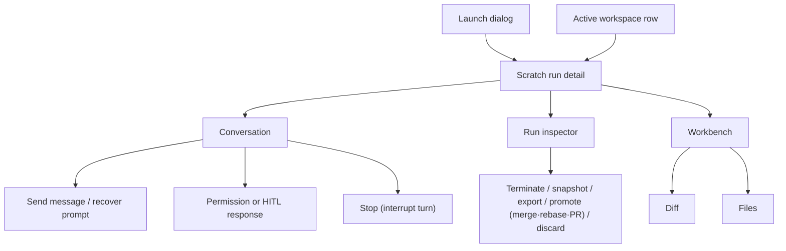
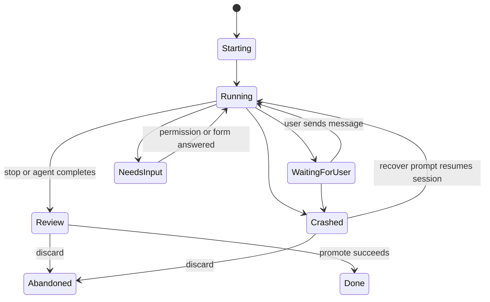

# Scratch run detail

## ADR-140 target state (Designed)

After Discard removes the workspace, the scratch detail remains a retained
history view. Composer recovery and workspace-backed panels are unavailable;
the UI does not issue Git/file requests for the removed path. The action result
uses the same lifecycle outcome vocabulary as flow workbenches.

- **Type:** screen.
- **Route:** `/scratch-runs/{runId}` (session-required).
- **Status:** Implemented. Scratch run detail is on the shared run shell: the
  conversation center plus the shared inspector and Files/Diff workbench.
- **Source:** persistent layout `web/app/(app)/scratch-runs/[runId]/layout.tsx`
  with the `?file=` pane `web/app/(app)/scratch-runs/[runId]/page.tsx`;
  conversation components `web/components/scratch/scratch-conversation.tsx`,
  `web/components/scratch/scratch-composer.tsx`,
  `web/components/scratch/scratch-permission-panel.tsx`, and
  `web/components/scratch/scratch-transcript.tsx`; shared chrome per
  [`run-inspector.md`](run-inspector.md) and [`workbench.md`](workbench.md).

## JTBD

When I open a scratch run, I want the conversation with the coding agent to own
the screen, so I can continue the session, inspect tool calls, answer permission
requests, and steer the branch without switching contexts.

When the scratch run produces changes, I want branch actions and change size
visible beside the conversation, so I can stop, snapshot, export or hand off
the branch, promote through review, or discard the workspace at the right
moment.

## Roles & capabilities

| Role | Sees / does |
| --- | --- |
| Project viewer | Sees scratch run metadata and run-scoped diff where project membership permits run visibility. |
| Project member | Sends follow-up messages, attaches context, answers pending permission/HITL prompts, browses repo files through `readRepoFiles`, and uses allowed lifecycle actions. |
| Project admin / owner | Has member capabilities plus project-level delivery actions where configured. |
| Global admin | Bypasses project role checks as owner-equivalent. |

While a turn runs the composer stays editable and **Send** stays the
primary action (Implemented — ADR-182): the message is either steered into the
running turn or queued for the next one, and the response says which — an
inline notice under the composer, shown only while that turn runs, and a badge
on the row ("Steered" / "Queued"). **Stop** is a secondary button beside Send;
it interrupts the current turn (ACP `session/cancel`) while keeping the session
live; the interrupted turn's end then dispatches any queued message, as any
turn end does — a queued message cannot be withdrawn. There is no client-side
queue: queued messages live on the server, so a reload loses nothing, and they
are dispatched oldest first when the turn ends. While the dialog is `Starting`
there is no session yet: only Stop is offered. A queued row on a dialog that
ended (Review, Done, Abandoned) reads "Not sent". A
crashed run may expose a recover composer that sends the resume prompt instead
of a normal message.

## Navigation

- **Entry:** global launch dialog success, active workspace row, project
  scratch `+`, or direct link.
- **Primary landing:** conversation transcript.
- **Within:** inspector tabs show run info, changes, and actions; secondary
  workbench tabs open Timeline/Evidence, while Files and Diff sit in one
  collapsed-by-default disclosure.
- **Deep links:** workbench, file, diff, inspector, and source/preview state
  follow the shared URL contract in [`workbench.md`](workbench.md).
- **Exit:** project board, promoted branch/PR link, or archive/drop flow.

## Layout & regions

The scratch screen uses the conversation as the primary center:

1. **Run header** - scratch name or branch, status, branch, base branch, work
   mode, reasoning effort, and token/context meter.
2. **Conversation transcript** - user and assistant turns, Markdown rendering,
   tool-call groups, thought blocks, permission prompts, copied assistant output,
   message-level attachments, raw legacy events behind disclosure controls, and
   a collapsed **cleared history** block when the latest exact `/clear` command
   moves earlier transcript entries out of the current view without deleting
   them from the audit trail.
3. **Composer** - fixed at the bottom of the conversation. It sends a normal
   message while the run waits for the user, and a recover prompt when the run
   is crashed and resumable. The editor is multi-line: `Cmd+Enter` on macOS and
   `Ctrl+Enter` on Windows/Linux submit (also while the agent is busy); a plain
   `Enter` inserts a newline. It stays editable while the agent is busy: **Send**
   stays primary (the message is steered into the running turn or queued —
   ADR-182) and a secondary **Stop** button interrupts the current turn. A queued
   row carries a "Queued" badge until it is dispatched ("Not sent" once the
   dialog ended without sending it); a steered row carries "Steered". It
   supports structured attachments and uploaded
   files. Slash suggestions include package skills plus the live ACP session's
   available commands; native runner commands are inserted as their exact raw
   command text rather than converted into capability chips.
4. **Inline HITL** - permission/form/human responses appear in the conversation
   path instead of a separate workflow page.
5. **Run inspector** - a collapsible right sidebar documented in
   [`run-inspector.md`](run-inspector.md). It shows branch/base/target,
   worktree, change size, a live token usage breakdown and wall-clock session
   time (both refresh during a live run), action shortcuts including the merge-
   mode promote selector and a red terminate (Stop) action, attachments,
   capability profile, and promotion state. Base/target branch fall back to the
   scratch metadata when the workspace row's columns are null. (ADR-181 —
   Implemented) The same lifecycle actions open the run git panel
   ([`git-panel.md`](git-panel.md)); a scratch PR's chip reads "open (not
   tracked)" because `pr_state_scan` skips scratch runs.
6. **Secondary workbench** - Timeline and Evidence are available as lightweight
   secondary tabs. Files and Diff are grouped inside one collapsed-by-default
   **Files / Diff** disclosure below the run interaction surface, and deep links
   open it directly. They do not replace the conversation as the scratch landing
   surface.

On mobile, the inspector collapses behind a button in the run header, and the
composer remains reachable after the transcript.

### UI completion contract (Implemented)

The conversation shows the existing stream's liveness as accessible
`connecting`, `live`, `reconnecting`, or `disconnected` presentation. It keeps
the retained `lastEventId` for the existing replay path and offers a manual
reconnect action. The conversation is the single scratch-stream owner; terminal
state, unmount, and run replacement cancel retry work. This does not change
`runs.status`, `scratch_runs.dialog_status`, or message/prompt behavior.

## States

**Stored permission answer (P0-4 — Implemented).** A scratch HITL card with
`answerState: "answer_stored"` shows the selected answer and the localized
“Answer saved — delivery pending” status, disables fresh choices and
offers an identical-payload “Retry delivery” only to an authorized operator.
Structured saved values appear under “Saved response” in a bounded, formatted
view; viewers cannot submit a new answer or retry delivery.
The state survives a detail refresh and a 202 response. The scratch panel
uses the shared `(code, details.reason)` EN/RU copy, not a generic error; a
terminal 410 says the agent session ended and directs the operator to Recover
or relaunch. Its feedback persists after the pending card disappears. An
unknown reason uses the localized per-code fallback; prompt-owner `causeCode`
appears only as a monospaced diagnostic. A refusal from an older permission
request does not appear beside a newer request on the same run.

| State | Main focus |
| --- | --- |
| `Starting` | Transcript; composer editable for drafting, Stop only (no session to send to yet) |
| `Running` | Transcript with latest tool group expanded; composer editable with Send primary (steer or queue) and a secondary Stop button to interrupt the turn |
| `WaitingForUser` | Transcript plus enabled composer and live slash-command suggestions |
| `NeedsInput` | Pending permission/HITL prompt in the conversation |
| `Review` | Transcript plus inspector action shortcuts and change size |
| `Crashed` | Transcript plus recover composer and failure context |
| `Done` / `Abandoned` | Frozen transcript with Diff, Timeline, and Evidence available |

## Data & APIs

- `GET /api/scratch-runs/{runId}` loads run metadata, scratch metadata,
  workspace, messages, attachments, pending HITL, capability profile, and the
  latest live available-command snapshot extracted from the run event log.
- `GET /api/runs/{runId}/stream` triggers live transcript refreshes.
- `POST /api/scratch-runs/{runId}/messages` sends follow-up messages and
  message attachments; while the agent is busy it answers at acceptance with
  `delivery: "steered" | "queued"` (ADR-182), and the detail route returns each
  user row's `delivery` for the badges. Exact slash commands are forwarded as prompt text; the UI
  may collapse local transcript history after `/clear`, but it does not filter
  the command or delete stored messages.
- `POST /api/scratch-runs/{runId}/recover` resumes a crashed scratch session
  with a user prompt; with messages still queued from before the crash it
  queues the prompt behind them and answers `delivery: "queued"`, so the
  oldest is sent first.
- `POST /api/scratch-runs/{runId}/interrupt` interrupts the agent's in-flight
  turn (composer Stop) without ending the session; the dialog returns to
  `WaitingForUser` on its own.
- `POST /api/scratch-runs/{runId}/stop` ends the run and closes its session
  (the terminate action in the inspector, distinct from the composer Stop),
  moving it to review.
- `POST /api/scratch-runs/{runId}/discard` abandons a scratch workspace.
- `POST /api/runs/{runId}/promote` promotes the branch; the inspector exposes a
  merge-mode selector — `local_merge` (`--no-ff`), `rebase_merge`, or
  `pull_request`. (ADR-181 — Implemented) The server honours all three,
  target-locked to `scratch_runs.target_branch ?? base_branch` (another target
  is `PRECONDITION`): a rebase lands by fast-forward (no merge commit), and a PR
  goes through the workspace run's publish and open cores and settles the
  dialog `Done`.
- (ADR-181 — Implemented) The git panel's routes (`git-state`, `discard-changes`,
  `export-branch`, `pr`, `pr/finalize`, `reattach`) serve scratch runs too; see
  [`git-panel.md`](git-panel.md).
- `GET /api/runs/{runId}/diff` and `GET /api/runs/{runId}/change-summary` render
  the scratch changes as base commit → working tree (committed, uncommitted, and
  untracked files), since a scratch agent edits files without committing.
- `POST /api/runs/{runId}/hitl/{hitlRequestId}/respond` answers permission,
  form, or human prompts.
- Workbench routes are listed in [`workbench.md`](workbench.md).

Behavior lives in
[`../../system-analytics/scratch-runs.md`](../../system-analytics/scratch-runs.md)
and [`../../system-analytics/hitl.md`](../../system-analytics/hitl.md).

## i18n

`scratch`, plus shared `workbench` labels for the secondary workbench and
lifecycle actions.

## Linked artifacts

- Blocks: [`run-inspector.md`](run-inspector.md), [`workbench.md`](workbench.md),
  [`../chrome/launch-dialog.md`](../chrome/launch-dialog.md).
- Behavior: [`../../system-analytics/scratch-runs.md`](../../system-analytics/scratch-runs.md),
  [`../../system-analytics/hitl.md`](../../system-analytics/hitl.md).
- ADRs: [ADR-053](../../decisions.md#adr-053-workbench-file-tree-git-tracked-only-member-gated-reads),
  [ADR-066](../../decisions.md#adr-066-editor-and-diff-rendering-stack-shiki-git-diff-view-codemirror),
  [ADR-082](../../decisions.md#adr-082-review-diff-completeness-with-dirty-state-protocol-and-scope-switcher).
- Source: `web/app/(app)/scratch-runs/[runId]/page.tsx`,
  `web/components/scratch/scratch-dialog.tsx`,
  `web/components/scratch/scratch-transcript.tsx`,
  `web/components/workbench/lifecycle-actions.tsx`.
