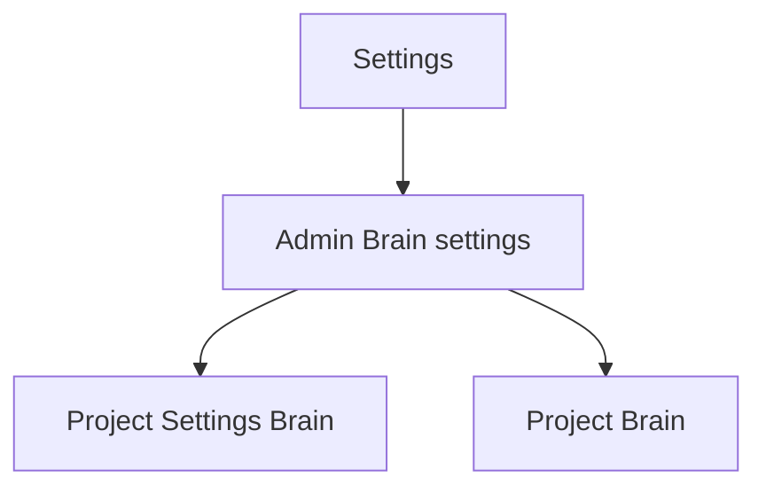
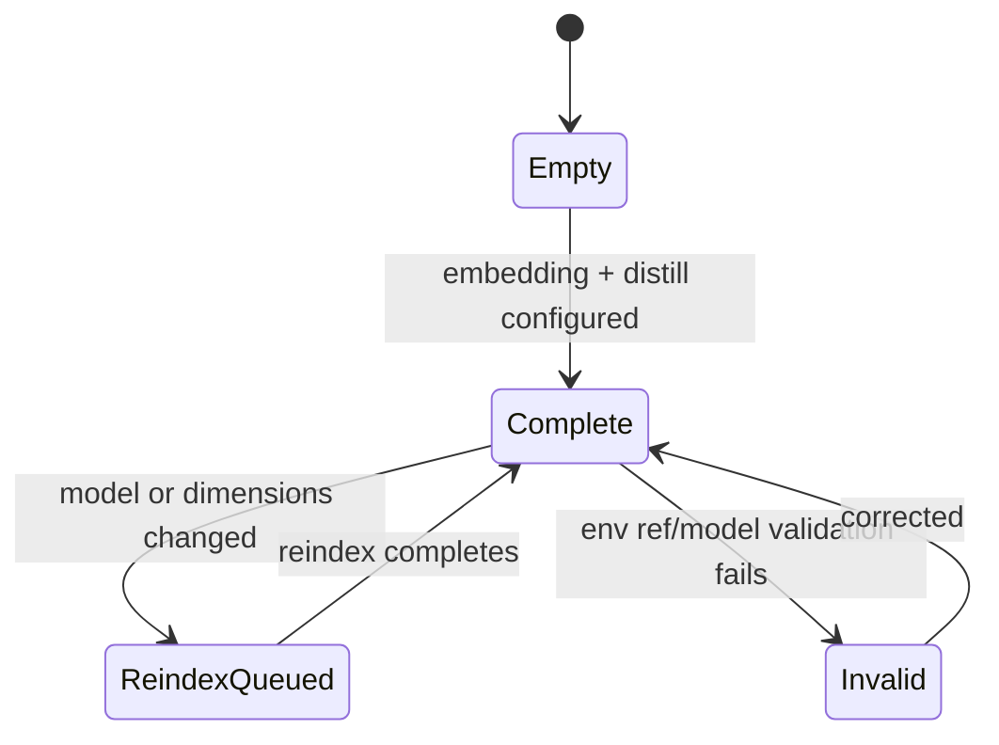

# Admin Brain Settings

Route: `/settings` or `/api/admin/brain-settings` backed settings panel
Status: Implemented for A embedding/distill config; Designed for C autonomy
defaults
Source components: `web/components/settings/*`, `web/app/api/admin/brain-settings`

## JTBD

When I administer the MAIster instance, I want to configure the embedding and
distill providers plus safe autonomy defaults, so projects can enable Brain
without each project carrying provider secrets or unsafe publish policy.

## Roles & capabilities

| Role | Can see | Can act |
| --- | --- | --- |
| Global admin | Embedding/distill provider refs, model/dimensions, autonomy defaults | Edit settings |
| Non-admin | Nothing | Nothing |

All fields that reference secrets use `env:NAME` refs only. Raw secret values are
never returned or accepted.

## Navigation

Entry points: Settings left rail, Project Settings Brain when platform config is
missing. Exits: Project Settings Brain and Project Brain.

## Layout & regions

- Embedding provider: base URL, model, dimensions, API key ref.
- Distillation: model used by harvest.
- Autonomy defaults: matrix by proposal kind/blast radius. Values are `manual`
  or `auto_draft`; `auto_publish` is not a control.
- Reindex notice: model/dimension changes enqueue non-destructive reindex jobs.

## States

## Data & APIs

- `GET /api/admin/brain-settings`
- `PATCH /api/admin/brain-settings`

## i18n

Namespace: `settings.brain.*`.

## Linked artifacts

- ADR-122, ADR-128
- [`system-analytics/project-brain.md`](../system-analytics/project-brain.md)
- [`api/web.openapi.yaml`](../api/web.openapi.yaml)
