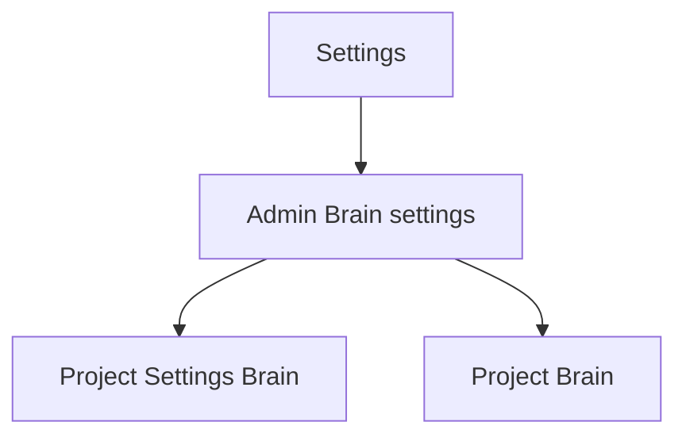
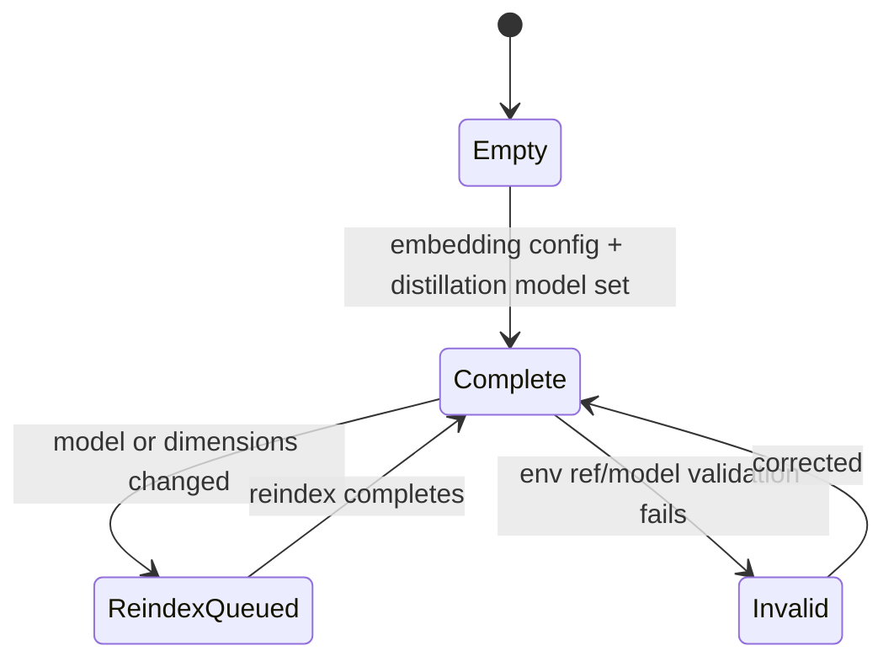

# Admin Brain Settings

Route: `/settings` or `/api/admin/brain-settings` backed settings panel
Status: Implemented for platform embedding/distill config. Project-level C
autonomy controls live in each project's Settings tab.
Source components: `web/components/settings/*`, `web/app/api/admin/brain-settings`

## JTBD

When I administer the MAIster instance, I want to configure the embedding and
distill providers, so projects can enable Brain without each project carrying
provider secrets.

## Roles & capabilities

| Role | Can see | Can act |
| --- | --- | --- |
| Global admin | Embedding/distill provider refs, model/dimensions | Edit settings |
| Non-admin | Nothing | Nothing |

All fields that reference secrets use `env:NAME` refs only. Raw secret values are
never returned or accepted.

## Navigation

Entry points: Settings left rail, Project Settings Brain when platform config is
missing. Exits: Project Settings Brain and Project Brain.

## Layout & regions

- Embedding provider: base URL, model, dimensions, API key ref.
- Distillation provider: base URL, model used by harvest, API key ref. If the
  distillation base/key fields are empty, distillation falls back to the
  embedding provider for compatibility.
- Reindex notice: model/dimension changes enqueue non-destructive reindex jobs.

## States

## Data & APIs

- `GET /api/admin/brain-settings`
- `PATCH /api/admin/brain-settings`

Project autonomy controls are in the project Settings tab via
`PATCH /api/projects/{slug}/settings`. The implemented UI exposes compact
selectors for `rule.low`, `skill.low`, and `flow.low` with only `manual` and
`auto_draft` values; `auto_publish` is not a schema value, API value, or UI
control.

## i18n

Namespace: flat `settings.brain...` message keys loaded through
`useTranslations("settings")`.

## Linked artifacts

- ADR-122, ADR-128
- [`system-analytics/project-brain.md`](../system-analytics/project-brain.md)
- [`api/web.openapi.yaml`](../api/web.openapi.yaml)
