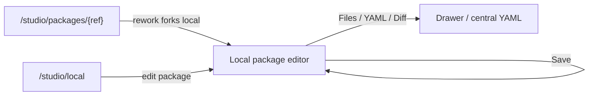
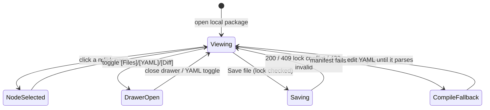

# Flow editor (Studio)

## M43 local Flow compatibility state (Implemented)

Raw YAML containing steps[] remains open for manual rewriting. A visible
blocking validation panel carries the exact reason: the engine-3 remediation,
malformed-manifest guidance, or the declared engine-range mismatch. The
affected graph canvas is unavailable and **Commit state** and **Publish** are
disabled while any package Flow is incompatible. **Cut version** is offered by
the Studio overview and local-workspace rows, where the full package receives
the same compatibility check. No automatic conversion action exists.

- **Type:** screen (artifact editor).
- **Route(s):** `/studio/edit/{localPackageId}/[[...path]]` (implemented local
  package editor over a git-backed working dir, ADR-096). The legacy
  `/flows/{projectSlug}/{capId}` project-authored-cap route remains the older
  authored-flow editor path. Git packages are NOT edited in place — package
  detail **Rework** forks to a local package and then opens this route.
- **Status:** Implemented for local package editing. Supersedes the tabs-in-a-form
  editor; the read-only twin is the shared `FlowGraphView` (package viewer + run
  workbench), which inherits the node visual scheme and node tooltips.
- **Source:** `web/app/(app)/flows/[projectSlug]/[capId]/page.tsx`,
  `web/components/flows/flow-editor-tabs.tsx`,
  `web/components/flows/editor/editor-top-bar.tsx`,
  `web/components/flows/flow-graph-editor.tsx`,
  `web/components/flows/node-form/node-side-form.tsx`,
  `web/components/board/flow-graph-view.tsx` (shared node body),
  `web/lib/flows/node-visuals.ts`,
  `web/lib/flows/editor/node-form.ts` (`validateDecideDraft`),
  `web/lib/flows/edge-style.ts` (outcome edge roles).

## JTBD

When I am authoring or reworking a flow, I want a big editing canvas with
readable, color-coded node cards, named outcome handles, and a focused properties
panel — so I can build and understand the graph without fighting cramped tabs or a
narrow viewport.

When I add a consensus node, I want participants, material axes, rounds,
synthesizer, and mandatory outputs to be edited in the same right-panel pattern
as every other node — so I can author a multi-agent agreement point without
dropping into raw YAML for routine changes.

## Roles & capabilities

| Role | Sees | Notes |
| --- | --- | --- |
| Authenticated viewer without the local package edit lock | Read-only canvas + files/YAML/diff | lock state explains who holds the package |
| Member holding the edit lock | Full edit: canvas, properties, file save, Commit state, Publish | writes go through local-package file APIs; version cutting is a local-workspace / Studio-overview action |

The route resolves the local package server-side and reads the current lock state;
write routes enforce member authorization and the edit lock.

## Navigation

- **Entry:** the package detail **Rework** affordance (forks installed package to
  local, then opens this editor), the `/studio/local` package row, or a direct
  URL.
- **Exit:** back to Studio/local package detail; drawer/toggle state changes in
  place. **Cut version** is available from the local-workspace and Studio
  overview rows and creates a local digest install there.

## Layout & regions

A 3-pane shell (top bar + canvas + right properties), with toggled drawers and a
collapsible app rail ([`../chrome/left-rail.md`](../chrome/left-rail.md)):

1. **Top bar (compact)** — identity (package · selected artifact · kind) · lock
   state · **Commit state** · **Publish** · AI toggle · end-edit action.
   Per-file Save lives in the Files / YAML editor; the visible blocking
   validation panel disables Commit state and Publish for an incompatible Flow.
2. **Canvas (dominant, full height)** — the `FlowEditorToolbar` palette (Add
   node ×6 after M41 `consensus` / Add gate ×6 / Remove), color-coded node cards (icon chip + status
   chip), named-outcome handles, dashed amber rework edges, `<MiniMap>` +
   `<Controls>`. Drag persists `presentation` x/y (ADR-064).
3. **Right properties panel (collapsible, ~440–500 px on desktop)** — grouped
   under **Identity · Behavior · Runner · Gates · Routing · Transitions ·
   Presentation** + `EditorValidationSummary`. Selecting a node happens on the
   canvas; nothing selected → flow/package-level settings. The **Routing** group
   is the M38 `decide` sub-panel (below).
4. **Drawers / toggles** — `[Files]` and `[Diff]` use the existing package-file
   and diff surfaces. `[YAML]` replaces the center canvas with the selected
   flow.yaml in CodeEditor. Invalid YAML does not blank the canvas; the last valid
   compiled graph remains available until the YAML parses again.

### Node visual language

Each node/gate carries a colored icon chip + a type-tinted card; the canonical
scheme (icon + hue → `--cv-*` canvas-palette token) lives in
[`../../system-analytics/flow-studio.md`](../../system-analytics/flow-studio.md)
§"Node visual language" and is implemented in `web/lib/flows/node-visuals.ts`. The
icon shape is the primary type signal; the status chip (run/preview only) composes
with it. Blocking gates render a solid chip, advisory an outline; rework /
back-edges render dashed + amber.

### Dynamic routing — `decide` sub-panel (M38 — Implemented)

The **Routing** group in the properties panel edits the node's `decide` table
(ADR-103). It is offered when the node can produce a routable signal — it declares
`output.result` **or** carries a verdict-producing gate (`ai_judgment`/`skill_check`).

- **Source select** — `none` (plain routing) · `output` · `verdict`.
  - `output` reveals a **nested dot-path** text field (e.g. `output.triage.outcome`).
  - `verdict` reveals the **cases table**.
- **Cases table** (verdict only) — an ordered, add/remove list of rows, each a
  `when` predicate (`<field> <op> <number>`, e.g. `confidence >= 0.8`) → **target
  outcome**; plus exactly one **default → target** row. Rows mirror the transitions
  table affordances (icon add/remove, danger-toned remove glyph per the
  `web/CLAUDE.md` UI-affordance conventions).
- **`on_mismatch` control** — offered when the node declares `output.result`:
  `none` (hard `CONFIG`-fail) · `retry` (self re-run) · a transition outcome →
  target. Inline help notes `retry`/`<outcome>` requires a `rework` block.
- **Validation** — `validateDecideDraft` surfaces issues (bad dot-path, missing
  default, duplicate default, target ∉ transitions, `on_mismatch` without `rework`)
  in `EditorValidationSummary`, mapped to the node id.

**Canvas rendering.** A node with **no** `decide` (plain routing) renders its single
`success` edge as today. A node **with** `decide` renders **outcome-labeled edges** —
one labeled edge per producible outcome (the verdict cases/default targets, or the
declared `output` transition keys; these are already transition keys, compile-enforced)
— styled via `edge-style.ts` / `topology.ts` outcome roles (forward green-gray,
rework amber-dashed, a `deny`/`fail` verdict branch red). The read-only
`FlowGraphView` twin inherits the same outcome-labeled edges.

### Package authoring IA (M39 Stream A — Implemented; Canonical Create Flow — Designed)

Stream A reworks the `/studio/edit/{id}/{path}` local-package editor for
correctness and first-class kinds (behavior SSOT:
[`../../system-analytics/local-packages.md`](../../system-analytics/local-packages.md)
§"M39 Stream A"). Deltas over the Phase B/C editor above:

- **Package-home landing.** With no flow file selected, the editor shows a package
  **overview** — the `PackageManifestForm` (`maister-package.yaml`, new `manifest`
  kind, + raw-YAML toggle) + the file tree + orientation — instead of an empty flow
  canvas. This removes the spurious "YAML is invalid" banner (and the
  rework→empty-yaml symptom) that fired when `syncYamlToCanvas("")` ran on a
  pathless open.
- **Real ownership + End edit.** `heldByMe` is computed from real lock ownership
  (no read-only flash), and a **Done / End edit** action releases the session lock
  and navigates back to `/studio/local`.
- **Commit state.** A top-bar **"Commit state"** action + dirty indicator opens the
  shared `ChangeReviewDialog` (diff + prefilled commit message); the commit
  **validates the changed artifacts and hard-blocks on invalid** (see
  local-packages §"Commit is the validation gate").
- **Canvas selection + node tooltip.** The read-only `FlowGraphView` gains
  click-to-select (canvas → inspector, with the node picker as the a11y fallback)
  and a node property tooltip/popover (type · prompt/model summary · transitions ·
  gates) sourced from `FlowNodeData`, mirrored in the editor.
- **First-class kinds.** Each of the four authorable kinds
  (flows / platform agents / subagents / skills) gets a per-kind form editor + a
  raw-file view, dispatched by inferred kind. Platform agents live at
  package-root `maister-agents/`; subagents at `capability/<id>/agents/` (lenient
  schema) — see [`../../system-analytics/agents.md`](../../system-analytics/agents.md).
  Platform-agent validation surfaces strict `capability_profile` issues inline:
  only `{ mcps?: string[] }` is accepted, legacy `skills`, `mcp_servers`, or
  `restrictions` keys are saved as invalid work-in-progress but hard-block the
  top-bar Commit and Publish actions plus server-side commit/cut-version/publish.
  The editor writes invalid JSON/schema values into the canonical artifact, so
  the inline message and lifecycle gates never disagree about draft state.
  Issue copy identifies the exact field path and keeps the compact structural
  editor; this hardening adds no package-skill selector or new authoring IA.
  **Canonical Create Flow (Designed).** Studio Packages and Local Packages open
  one accessible dialog for package name (new package only), Flow ID, display
  title, `metadata.summary`, and `metadata.route_when`, with optional labels,
  links, and sources. Copy calls this Flow metadata, never frontmatter. Success
  opens `flows/<flow-id>/flow.yaml` directly in this existing editor; no narrow
  second editor is introduced. From package home, **Add Flow** uses the same
  dialog with package identity fixed and may be repeated for any additional
  Flow. Generic Add File remains for non-Flow artifacts.

  Existing zero-Flow packages show a localized **No Flow yet** explanation and
  Add Flow CTA; they remain otherwise supported. Pending or recovery-required
  create operations show localized read-only remediation and disable normal
  writers. Viewers, inactive users, and users who must change their password
  never receive an enabled creation/mutation action; routes remain authoritative.

### Fork ↔ upstream surface (ADR-132)

For a local package **with fork lineage** (`source_install_id` set), the
breadcrumb action cluster (next to Commit-state / Publish) gains two entries;
neither renders for lineage-less packages:

- **Compare with upstream** — opens a read-only `UpstreamDivergenceDrawer`
  (pattern: the diff drawer minus the commit/discard bar) rendering the shared
  `DiffView` of the fork against its lineage source install. A header
  **cut picker** selects "ours": the working dir (default) or any cut of this
  package. The composition view's element cards add a per-element "compare"
  entry only where element lineage exists (silently absent otherwise).
  Drawer states: loading · empty (no divergence) · diff · **degraded** — the
  lineage source install is missing/GC'd (`MaisterError("CONFIG")` "source
  install unavailable") renders an explanatory panel, never a crash.
- **Update fork from upstream** — the sync entry: an upstream **tag picker**
  fed from the lineage source's discovered tags; "install & sync" installs
  the chosen tag through the normal install path, then runs the ADR-132
  synthetic 3-way merge.

**Sync banner.** While `local_packages.sync_state` is pending, the editor
shows a persistent banner with two shapes:

- **Pending (clean tree)** — a sync started but no merge output landed
  (crash-window 1): offers **Resume** (idempotent re-merge) and **Abort**.
- **Conflicted** — lists `sync_state.conflictedFiles` (the invalid-artifact
  list idiom); each entry opens the file in the editor showing standard
  conflict markers. Actions: **Resolve** (validates markers gone + committed,
  then completes) and **Abort** (`git reset --hard HEAD`).

Refusal surfaces render through the localized error surface: dirty tree →
"commit or discard first" (`PRECONDITION`); a pending sync for a different
target → `CONFLICT`; lineage/source bytes missing → the degraded `CONFIG`
panel; Resolve with markers still present in a listed or dirty file →
`PRECONDITION` naming the file; Resolve with nothing to resolve
(crash-window 1) → `PRECONDITION` pointing at Resume.
Behavior SSOT:
[`../../system-analytics/local-packages.md`](../../system-analytics/local-packages.md)
§"Fork ↔ upstream loop".

**Publish refusal (ADR-132).** When publish is rejected non-fast-forward, the
`PublishDialog` renders the typed "upstream moved — sync first" refusal: with
fork lineage (`details.canSync`) it offers a **Sync from upstream** CTA
linking the sync entry above; without lineage it shows manual-reconcile
guidance (inspect/delete the remote `maister/<slug>` branch). Publish never
offers force.

### Consensus node properties (M41 — Implemented)

The `consensus` node is authorable through the same canvas and right-panel
surface, not a bespoke wizard. The toolbar adds one consensus node type with the
canonical node visual from `node-visuals.ts`; the read-only `FlowGraphView`
uses the same icon, hue, tooltip, handles, and compact node body.

- **Canvas card** — shows node label, `consensus` type chip, participant count,
  round mode/max, and a concise `WaitingOnChildren`/HITL state when previewing a
  run. Tooltips name the node as "Consensus", explain read-only draft fan-out,
  and list the first few material axes with a capped "+N more" suffix.
- **Properties / Identity** — node id, label, prompt, description, and
  transitions follow existing node controls.
- **Properties / Consensus** — participant rows (`id`, **Participant source**,
  read-only workspace mode), material axes add/remove list, rounds segmented
  control (`single_pass`/`iterate`) with a numeric max, `on_no_consensus`
  fixed to `escalate`, and **Synthesizer source**. The source pickers are
  grouped as **Runners** (existing member runner route) and **Agents**
  (package-local `maister-agents/*.md` files); unmatched free text remains
  available with an `as runner` / `as agent` toggle.
- **Properties / Schema refs (Implemented)** — `settings.form_schema` and
  `output.result.schema` use schema reference pickers over package-local
  root `schemas/*.json` files (not nested or arbitrary package-relative files).
  The picker can create, paste, or edit schema JSON through the shared package
  draft; the saved manifest stores
  `./schemas/<name>.json`, while the package file path remains
  `schemas/<name>.json`. Package install copies this root directory into every
  member flow revision before runtime schema resolution.
- **Properties / Outputs** — the default fills must create
  `consensus_plan` (`kind: plan`, current) and `debate_log`
  (`kind: human_note`, current). Validation blocks deletion or kind drift for
  these mandatory outputs.
- **Validation summary** — surfaces participant count, duplicate ids, missing
  axes, missing synthesizer, unsupported workspace mode, over-fanout, and
  engine-floor errors against the selected node.

**Acceptance criteria.**

- Adding a consensus node from the palette creates valid default YAML that still
  renders on the canvas and in `FlowGraphView`.
- The right properties panel can fill in every required consensus field without
  raw YAML editing.
- Schema reference fields can select, create, paste, and edit root
  `schemas/*.json` files without leaving the existing Save path; there is no
  new API or DB contract, and package installation materializes the same root
  schema bytes into each member flow revision for runtime use.
- Draft schema WIP remains editable, but the lifecycle controls derive
  references from every current draft flow: missing, escaping, malformed, or
  referenced grammar-invalid documents disable Commit and Publish before the
  server gate. A changed unreferenced schema grammar issue stays advisory;
  Cut/Publish revalidate the full committed baseline.
- Tooltip and canvas text remain clipped/capped rather than resizing the node or
  overlapping handles on dense graphs.
- EN and RU labels exist for every consensus control, validation message,
  source picker, schema reference control, tooltip, and artifact-kind label.

### Structured node-form controls + assistant `/`-autosuggest (Implemented)

The properties panel replaces comma-separated text fields with structured
controls; the persisted `flow.yaml` shapes are unchanged.

- **MultiSelectField** — `skills` and `mcps` render as removable chips + an
  add-combobox over a package-derived catalog (free-add allowed for forward
  refs); `rework.workspacePolicies` is a fixed-enum multiselect (no free-add).
- **StringListField** — `restrictions`, `roles`, `assignees`, `decisions`,
  `material_axes`, `rework.allowedTargets`, and `hooks.pathGuard.allowedPaths`
  render as one text row per item with a per-row danger trash button and an
  add-row affordance; an empty list omits the field.
- **`/`-autosuggest `action.prompt` composer** — the node prompt is the shared
  `CapabilityComposer`; typing `/` offers package skills and inserts a canonical
  `@skill:<slug>` token (the runtime adapts the wire form per runner). A package
  viewer with no catalog degrades to a plain read-only textarea.
- **`{{ }}` variable assists (Implemented)** — editable coding-node prompts open a
  variable picker when the author types `{{` or uses the compact `{}` affordance.
  Suggestions are scoped to the selected node and show static globals, previous
  step output/vars, structured-output/form-schema fields, rework comments vars,
  and upstream artifacts. Each row distinguishes availability (`definite` /
  `conditional`) from value presence (`required` / `optional`); optional or
  conditional values insert the guarded `{{ path ?? '' }}` form. Unknown paths
  and bare optional references render non-blocking warnings in the prompt
  surface. This slice adds no route, DB migration, or new error code.

The **AI assistant** (a right-hand drawer opened by the top-bar "AI" toggle,
mutually exclusive with the node-properties inspector) mirrors this: its
first-prompt input is the same `/`-autosuggest composer, and the follow-up
composer's **Send** is overlaid bottom-right over the input (attachment/busy
chips bottom-left); Enter sends, Shift+Enter adds a newline. The assistant
receives the complete, drift-guarded Flow DSL grammar on **every** turn (launch
and follow-up; the heavier per-package flow dump is launch-only), so `consensus`
is authored as a first-class node — see
[`../../system-analytics/flow-studio.md`](../../system-analytics/flow-studio.md)
§"Assistant grammar + structured node-form controls".

**Acceptance criteria.**

- Skills/mcps render as chips with an add affordance; workspace policies accept
  only the three enum values; list fields add and remove rows.
- The node prompt composer stores `@skill:<slug>`; an existing plain-text prompt
  renders unchanged until a token is inserted.
- Implemented prompt-variable insertion uses `{{ path }}` only for
  definite-required values; conditional or optional suggestions insert
  `{{ path ?? '' }}`.
- Read-only viewer mounts degrade to text/chips with no fetch.
- EN and RU labels exist for every new multiselect, string-list, and composer
  control.

## States

## Data & APIs

The local editor works against the local-package working-dir seam:

- Page load reads `local_packages`, lists files from the confined working dir,
  and server-compiles the selected flow manifest for the initial canvas.
- Save writes through `PUT /api/studio/local-packages/{id}/files/{path}` (or
  `DELETE` for removed files), with path confinement, atomic writes, and edit-lock
  enforcement.
- Lock refresh/release routes keep a single editing session writable; a second
  session is read-only until it acquires the lock.
- The local-workspace and Studio-overview **Cut version** controls use
  `POST /api/studio/local-packages/{id}/cut-version` to install the working dir
  as a `local-<digest>` `package_installs` revision a member can then attach;
  its dialog offers the ADR-132 multi-select "adopt in attached projects now"
  (only projects already on a cut of THIS package are listed).
- Divergence reads `GET /api/studio/local-packages/{id}/divergence`
  (`?cutInstallId=`, `?element=`); sync uses
  `POST /api/studio/local-packages/{id}/sync`, `POST .../sync/resolve`, and
  `POST .../sync/abort` (ADR-132).

Behavior SSOT: [`../../system-analytics/flow-studio.md`](../../system-analytics/flow-studio.md)
(authored-flow lifecycle, hard-gate, CAS) — not restated here (R7).

## i18n

`flowEditor` (top-bar labels, drawer labels, rail toggle, node/gate visual
labels, the existing node-form / toolbar / validation keys, the M38
`flowEditor.nodeForm.decide*` routing-panel keys, and M41
`flowEditor.nodeForm.consensus*` participant/axis/round/synthesizer/output keys,
reference-picker keys under `flowEditor.nodeForm.schemaRef*`, and the
`flowEditor.nodeForm.{promptComposer,multiSelect,stringList}*` structured-control
keys),
`flows` (page header + save hint), and the ADR-132 `studio.divergence.*` +
`studio.sync.*` namespaces (drawer, banner, conflict list, refusals). EN + RU
parity required.

## Linked artifacts

- ADRs: [#adr-064](../../decisions.md#adr-064) (authored `presentation` layout),
  [#adr-092](../../decisions.md#adr-092) (unified Studio + editable-local-package
  direction),
  [#adr-103](../../decisions.md#adr-103-output-driven-dynamic-routing-decide--onmismatch-rework--engine-170)
  (M38 `decide` routing panel + outcome-labeled edges),
  [#adr-109](../../decisions.md#adr-109-consensus-flow-graph-node--engine-owned-unanimous-draft-verification-and-human-resolution)
  (M41 consensus node),
  [#adr-132](../../decisions.md#adr-132-forked-package-loop--ephemeral-pins-package-experiment-axis-local-sources-upstream-sync)
  (divergence drawer, sync banner, publish sync-first refusal).
- Spec: [`../../../.ai-factory/specs/feature-flow-studio-editor.md`](../../../.ai-factory/specs/feature-flow-studio-editor.md).
- Spec: [`../../../.ai-factory/specs/feature-flow-studio-reference-pickers.md`](../../../.ai-factory/specs/feature-flow-studio-reference-pickers.md)
  (Implemented reference picker polish).
- Behavior: [`../../system-analytics/flow-studio.md`](../../system-analytics/flow-studio.md),
  [`../../system-analytics/consensus.md`](../../system-analytics/consensus.md).
- Area: [`README.md`](README.md).
- Source: see the Header.
