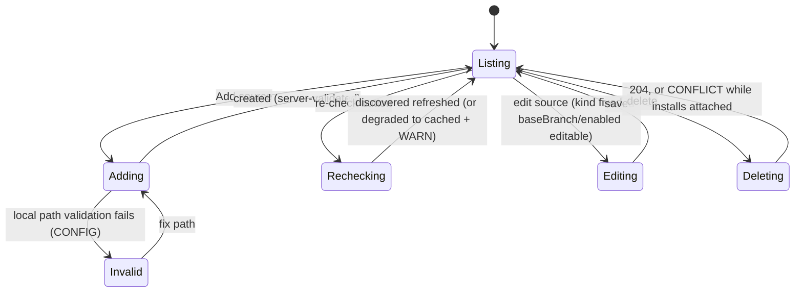

# Package sources — `/studio/sources`

- **Type:** screen (admin).
- **Route:** `/studio/sources`.
- **Status:** Implemented (Phase A relocated panel); source kinds
  (`git | local`), local-path validation surface, per-source base branch, and
  the per-source re-check button are ADR-129.
- **Source:** `web/app/(app)/studio/sources/page.tsx`,
  `web/components/settings/package-sources-panel.tsx`,
  `web/components/settings/package-source-modal.tsx`.
- **Behavior SSOT:**
  [`../../system-analytics/packages.md`](../../system-analytics/packages.md)
  (discovery, install, kinds, digest-as-version).

## JTBD

When I administer the instance, I want to register package sources — git
monorepos AND local host directories — discover their packages, re-check them
on demand, and install a version, so every package the platform consumes has
one auditable origin. When a source backs fork publishing, I want to configure
the PR base branch per source so contributions target the right branch.

## Roles & Capabilities

| Role | Can see | Can do |
| --- | --- | --- |
| Global admin | Sources table, discovered packages, install state | Add/edit/delete sources (both kinds), refresh/re-check, install a version, set per-source base branch |
| Everyone else | nothing (no nav entry) | — |

All routes are `requireGlobalRole("admin")`-gated. Admin-only registration is
the trust boundary for `kind: 'local'` sources (they resolve
`trusted_by_policy` — ADR-129 §c).

## Navigation

- **Entry:** Studio overview Sources card (admin only), left-rail Studio
  section.
- **Exit:** Studio packages list (after install), Studio overview.

## Layout & Regions

- **Sources table** — one row per `package_sources` row: URL/path, a **kind
  badge** (`git` | `local`), enabled state, `last_checked_at`, discovered
  package count, and per-row icon actions: **re-check** (refresh/re-digest),
  edit, delete (usage-guarded).
- **Add/edit modal** (`package-source-modal.tsx`) — a **kind toggle**
  (`git` | `local`):
  - `git`: URL field + optional **base branch** field (the publish PR base;
    empty = auto-detect the remote default branch, fallback `main`).
  - `local`: an **absolute path** field. Server validation errors surface
    inline via the existing `apiErrors` idiom: relative path, missing
    directory, no `maister-package.yaml` at the root nor any
    `packages/*/maister-package.yaml`.
- **Discovered packages list** — per source: package name + versions. Git
  sources list tags; local sources list exactly one digest-derived version
  `local-<digest12>` (digest-as-version — installing an older digest is not
  possible; re-check surfaces drift instead).
- **Install action** — tag picker for git sources; the current digest for
  local sources.

## States

Re-check on a local source with unchanged bytes is idempotent (digest
stable → no `updateAvailable` flips). Discovery failure degrades to the cached
snapshot with a WARN — it never blocks the page.

## Data & APIs

- `GET/POST /api/admin/package-sources` — create body carries
  `kind` (`git` default) and, for git sources, optional `baseBranch`;
  `kind: 'local'` requires `url` to be an absolute host path validated
  server-side BEFORE persistence (`MaisterError("CONFIG")` naming the failed
  check).
- `PATCH/DELETE /api/admin/package-sources/{id}` — update accepts
  `baseBranch`; delete is usage-guarded (`CONFLICT`).
- `POST /api/admin/package-sources/{id}/refresh` — git: `ls-remote` + manifest
  scan; local: directory walk + re-digest (`kind: local` re-digest semantics,
  ADR-129).
- `GET/POST /api/admin/package-installs` — install a discovered version.

## i18n

`studio.sources.*` (kind toggle, path field, validation errors, base-branch
field + hint, re-check) plus the existing `settings` package-sources keys and
`apiErrors`. EN + RU parity required.

## Linked Artifacts

- ADR:
  [#adr-129](../../decisions.md#adr-129-forked-package-loop--ephemeral-pins-package-experiment-axis-local-sources-upstream-sync)
  §c (local sources, digest-as-version, base branch);
  [#adr-088](../../decisions.md#adr-088-multi-flow-package-management)
  (sources substrate).
- Behavior: [`../../system-analytics/packages.md`](../../system-analytics/packages.md).
- API: [`../../api/web.openapi.yaml`](../../api/web.openapi.yaml)
  (`/api/admin/package-sources*`).
- Area: [`README.md`](README.md) §2.
