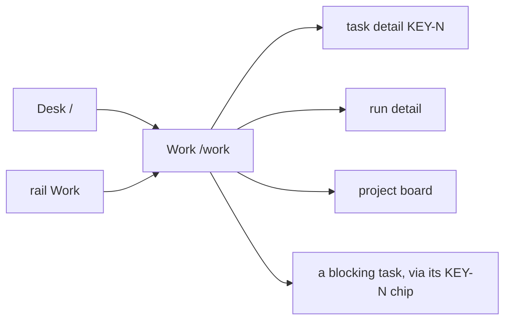
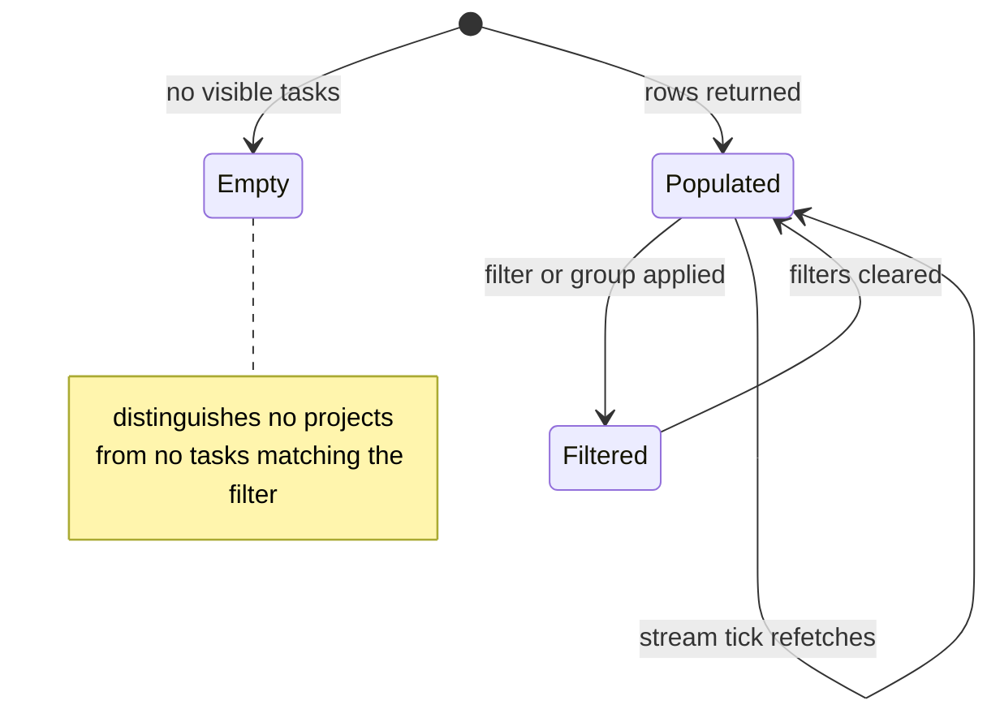

# Work

**Route:** `/work` · **Status:** Designed (ADR-169) · **Source:** `web/app/(app)/work/page.tsx`

The cross-project work table: every task the reader can see, in one comparable
list, whether or not it has ever launched a run.

## JTBD

- When I own work across several repositories, I want one table of everything in
  flight, so I can see load and blockage without opening each board.
- When I am asked "where is X", I want to filter to it and read one stage value,
  so I can answer without reconstructing run history.
- When a set of filters is useful repeatedly, I want to save and re-open it, so I
  do not rebuild it every morning.

## Roles & capabilities

| Role | Sees | Does |
| --- | --- | --- |
| Global `admin` | Tasks from every non-archived project | Filter, group, save views; rows are view-only |
| Global `member` | Tasks from their own projects only | Same |
| Global `viewer` | Tasks from their own projects only | Same |

Scoping is `getVisibleProjectIds` (`STG-09`). A filter naming a project the
reader cannot see is **dropped silently** rather than refused, matching the
existence-hiding convention on the external surfaces. This is the default landing
route for `member` and `viewer` (`NAV-02`).

## Navigation

## Layout & regions

Full-width data-management layout: no centered max-width, a horizontal scroll
container owned by the table rather than the page, and responsive column
behaviour. Rows are **view-only** — the table is for seeing, and every action
lives on the surface that owns it.

Columns: `KEY-N` · title · project · stage (with the progress spine) · run dot ·
readiness · waiting-on (role or "you", with age) · blockers (`KEY-N` chips) ·
tokens · last activity · next action.

Filter and group state is **URL-synchronized** and deep-linkable, submitted by a
plain `<form action="/work">`. Only the *named saved-view list* (label →
querystring) lives in `localStorage`; nothing filter-shaped is localStorage-only.

## States

## Data & APIs

- `getWorkTable` — one batched read model; its query count is independent of row
  count (`STG-08`). Behavior in
  [`system-analytics/work-stages.md`](../system-analytics/work-stages.md).
- Liveness — `GET /api/attention/stream`, refetch-on-tick, no client timer.

## i18n

`work` namespace (EN + RU), plus `workStage` for the stage labels. Token totals
render through `Intl.NumberFormat(locale)`; count-bearing client templates use
`$count`.

## Linked artifacts

- [ADR-169](../decisions.md#adr-169) · [ADR-171](../decisions.md#adr-171) · [ADR-170](../decisions.md#adr-170)
- [`system-analytics/work-stages.md`](../system-analytics/work-stages.md)
- [`desk.md`](desk.md) · [`activity.md`](activity.md)
