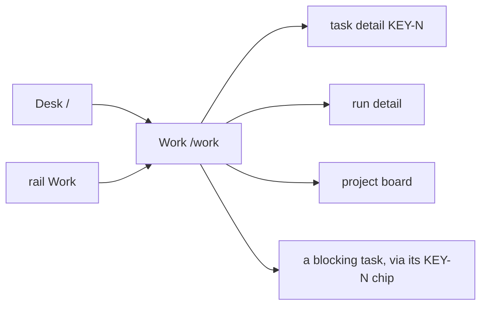
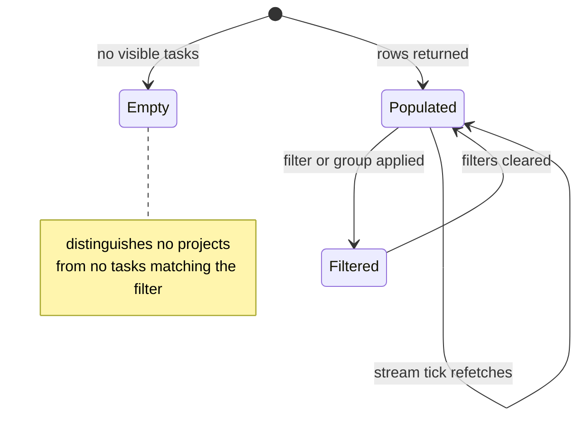

# Work

**Route:** `/work` · **Status:** Implemented (ADR-169) · **Source:** `web/app/(app)/work/page.tsx`

The cross-project work table: every task the reader can see, in one comparable
list, whether or not it has ever launched a run.

## JTBD

- When I own work across several repositories, I want one table of everything in
  flight, so I can see load and blockage without opening each board.
- When I am asked "where is X", I want to filter to it and read one stage value,
  so I can answer without reconstructing run history.
- When a set of filters is useful repeatedly, I want to save and re-open it, so I
  do not rebuild it every morning.

## Roles & capabilities

| Role | Sees | Does |
| --- | --- | --- |
| Global `admin` | Tasks from every non-archived project | Filter, group, save views; rows are view-only |
| Global `member` | Tasks from their own projects only | Same |
| Global `viewer` | Tasks from their own projects only | Same |

Scoping is `getVisibleProjectIds` (`STG-09`). A filter naming a project the
reader cannot see is **dropped silently** rather than refused, matching the
existence-hiding convention on the external surfaces. This is the default landing
route for `member` and `viewer` (`NAV-02`).

## Navigation

## Layout & regions

Full-width data-management layout: no centered max-width, a horizontal scroll
container owned by the table rather than the page, and responsive column
behaviour. Rows are **view-only** — the table is for seeing, and every action
lives on the surface that owns it.

Columns: `KEY-N` · title · project · stage (with the progress spine) · run dot ·
readiness · waiting-on (with age) · blockers (`KEY-N` chips) · tokens ·
last activity · next action.

**Waiting-on resolves to a person, not a role.** The flow DSL has no role
concept to read one from, so the column answers with what the data actually
knows: `you` when the open HITL request is assigned to an actor identity that is
the reader (or the reader holds the takeover claim), the assignee's label when it
is someone else, and `anyone` when the request is open and unassigned. An age
rides alongside it.

**Next action** is a pure function of the stage — the table names the action and
links to the surface that owns it, and never performs one.

Grouping is `nothing | project | stage | waiting on me`. Stage groups follow the
declared lifecycle order and project groups are alphabetical, so the same query
string always renders the same order.

Filter and group state is **URL-synchronized** and deep-linkable, submitted by a
plain `<form action="/work">`. Only the *named saved-view list* (label →
querystring, under `maister.work.savedViews`) lives in `localStorage`; nothing
filter-shaped is localStorage-only.

Filters narrow the loaded table in memory rather than in SQL — `getWorkTable`
takes no filter arguments at all. A filter is a view over the one comparable
list, which is also what keeps its statement count flat under every combination
of them (`STG-08`).

## States

## Data & APIs

- `getWorkTable` — one batched read model in `web/lib/queries/work-table.ts`; its
  query count is independent of row count (`STG-08`). Filtering and grouping are
  pure functions in `web/lib/work/work-table-view.ts`. Behavior in
  [`system-analytics/work-stages.md`](../system-analytics/work-stages.md).
- Liveness — `GET /api/attention/stream`, refetch-on-tick, no client timer.

## i18n

`work` namespace (EN + RU), plus `workStage` for the stage labels. Token totals
render through `Intl.NumberFormat(locale)`; count-bearing client templates use
`$count`.

## Linked artifacts

- [ADR-169](../decisions.md#adr-169) · [ADR-171](../decisions.md#adr-171) · [ADR-170](../decisions.md#adr-170)
- [`system-analytics/work-stages.md`](../system-analytics/work-stages.md)
- [`desk.md`](desk.md) · [`activity.md`](activity.md)
