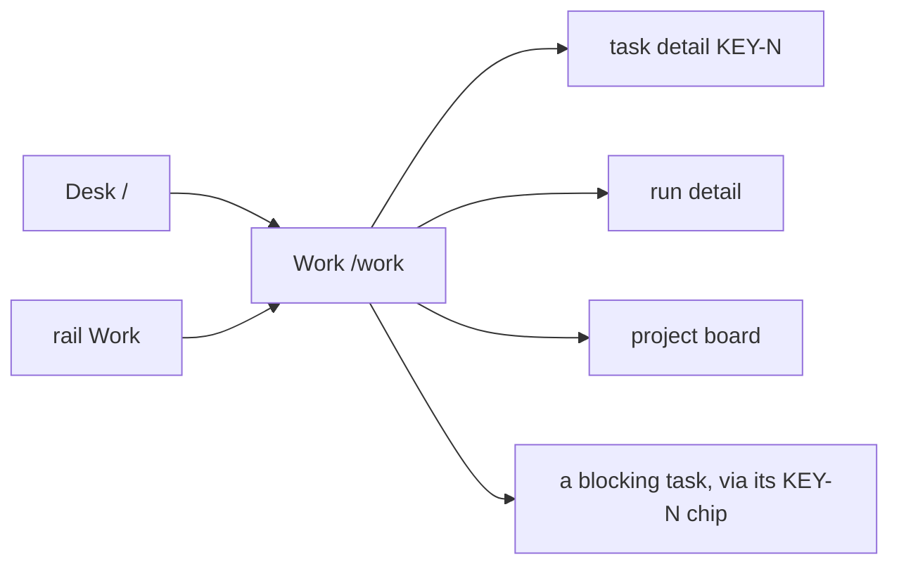
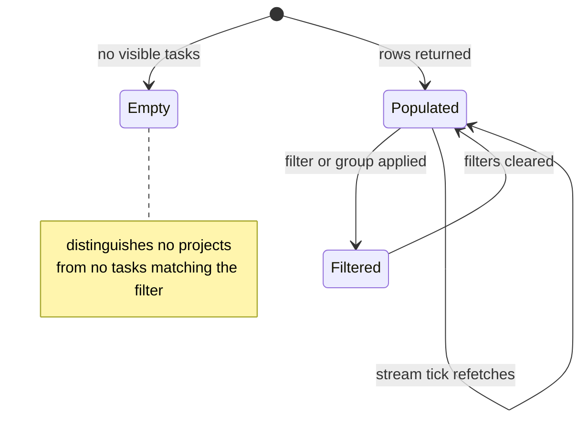

# Work

**Route:** `/work` · **Status:** Implemented (ADR-170, ADR-174) · **Source:** `web/app/(app)/work/page.tsx`

The cross-project work table: every task the reader can see, in one comparable
list, whether or not it has ever launched a run.

## JTBD

- When I own work across several repositories, I want one table of everything in
  flight, so I can see load and blockage without opening each board.
- When I am asked "where is X", I want to filter to it and read one stage value,
  so I can answer without reconstructing run history.
- When a set of filters is useful repeatedly, I want to save and re-open it, so I
  do not rebuild it every morning.

## Roles & capabilities

| Role | Sees | Does |
| --- | --- | --- |
| Global `admin` | Tasks from every non-archived project | Filter, group, save views; rows are view-only **on this surface** |
| Global `member` | Tasks from their own projects only | Same |
| Global `viewer` | Tasks from their own projects only | Same |

Scoping is `getVisibleProjectIds` (`STG-09`). A filter naming a project the
reader cannot see is **dropped silently** rather than refused, matching the
existence-hiding convention on the external surfaces. This is the default landing
route for `member` and `viewer` (`NAV-02`).

## Navigation

## Layout & regions

Full-width data-management layout: no centered max-width and responsive column
behaviour. Narrow viewports drop columns by priority (`tokens` and `readiness`
first) rather than scrolling the table sideways (`REQ-D11`, Implemented).

Rows are **view-only on `/work`** — this surface is for seeing, and every action
lives on the surface that owns it. The rule is this screen's, not the row
component's: the Desk renders the same rows with an opt-in expansion panel behind
a prop defaulting to **off**, and `/work` does not pass it (`REQ-D12`, ADR-174 D5).
Turning it on here — and deciding what a backlog or settled row expands into, which
the Desk never has to answer — is a later increment.

Columns: `KEY-N` · title · project · stage (with the progress spine) · readiness ·
waiting-on (with age) · blockers (`KEY-N` chips) · tokens · last activity ·
next action.

The **project** column is hidden when and only when grouping is `project` — the
group header already names it — at both surfaces, because the rule is
grouping-derived rather than surface-derived (`REQ-D7`, Implemented).

**The run-status column is removed** (`REQ-D8`, Implemented), and its distinction moves
into the stage chip. This also closes a pre-existing drift: this document specified a
compact "run dot" while the code shipped the raw `runStatus` enum as text.
`STAGE_BY_RUN_STATUS` is many-to-one, so `NeedsInput` / `NeedsInputIdle` /
`HumanWorking` — a live session, a checkpoint, a manual takeover — collapse into one
chip, as do `Running` / `WaitingOnChildren`; the chip carries that refinement in its
accessible name instead. A chip given no run status renders exactly as before, which
is what keeps `decision-card.tsx` and `hitl-card.tsx` unchanged.

**Waiting-on resolves to a person, not a role.** The flow DSL has no role
concept to read one from, so the column answers with what the data actually
knows: `you` when the open HITL request is assigned to an actor identity that is
the reader (or the reader holds the takeover claim), the assignee's label when it
is someone else, and `anyone` when the request is open and unassigned. An age
rides alongside it.

**Next action** is a pure function of the stage — on `/work` the table names the
action and links to the surface that owns it, and never performs one. It stays a pure
function of the stage wherever the rows render; a `none` action renders an em dash
rather than a sentence (`REQ-D10`, Implemented). The Desk's expansion panel is the one
place an action can be taken from a row, and it adds no mutation path of its own —
every action posts to the route `/inbox` already uses (`REQ-D14`, `REQ-D18`).

Grouping is `nothing | project | stage | waiting on me`. Stage groups follow the
declared lifecycle order and project groups are alphabetical, so the same query
string always renders the same order.

Filter and group state is **URL-synchronized** and deep-linkable, submitted by a
plain `<form action="/work">`. Only the *named saved-view list* (label →
querystring, under `maister.work.savedViews`) lives in `localStorage`; nothing
filter-shaped is localStorage-only.

Filters narrow the loaded table in memory rather than in SQL — `getWorkTable`
takes no filter arguments at all. A filter is a view over the one comparable
list, which is also what keeps its statement count flat under every combination
of them (`STG-08`).

## States

## Data & APIs

- `getWorkTable` — one batched read model in `web/lib/queries/work-table.ts`; its
  query count is independent of row count (`STG-08`). Filtering and grouping are
  pure functions in `web/lib/work/work-table-view.ts`. Behavior in
  [`system-analytics/work-stages.md`](../system-analytics/work-stages.md).
- Liveness — `GET /api/attention/stream`, refetch-on-tick, no client timer.

## i18n

`work` namespace (EN + RU), plus `workStage` for the stage labels. Token totals
render through `Intl.NumberFormat(locale)`; count-bearing client templates use
`$count`.

### Shared with the Desk

The table's ROWS live in `web/components/work/work-rows-table.tsx`
(`WorkRowsTable`) and its row labels in `web/lib/work/work-row-labels.ts`, both
shared with the Desk (ADR-172 D1). This surface keeps the filter form, the saved
views and the row count; the Desk renders rows only. `WorkTableLabels extends
WorkRowsLabels`, so a new column is a compile error on both surfaces rather than
a blank header on one.

`WORK_IN_FLIGHT_STAGES` (`lib/work/stage.ts`) names the stages the Desk calls
"work in flight"; it is one third of a spelled-out partition of `WORK_STAGES`
checked by `UT-STG-11`.

The component is **not forked** to give the Desk its expansion (ADR-174 D5): a fork
would trade the compile-error guarantee above for a prop default, and the prop default
is available either way. Every column change therefore still lands on both surfaces at
once.

## Linked artifacts

- [ADR-170](../decisions.md#adr-170) · [ADR-172](../decisions.md#adr-172) · [ADR-174](../decisions.md#adr-174-the-desk-renders-one-object-per-work-item) · [ADR-171](../decisions.md#adr-171)
- [`system-analytics/work-stages.md`](../system-analytics/work-stages.md)
- [`desk.md`](desk.md) · [`activity.md`](activity.md)
