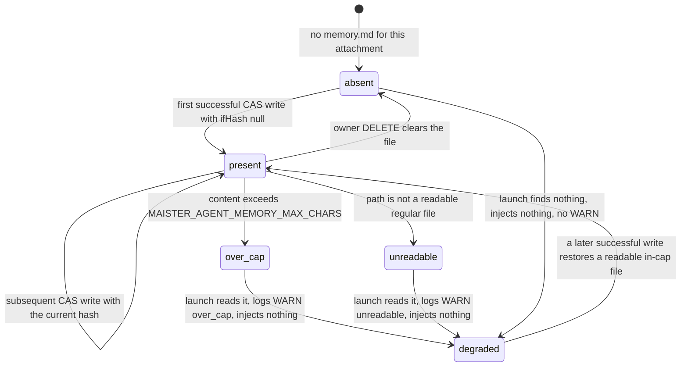
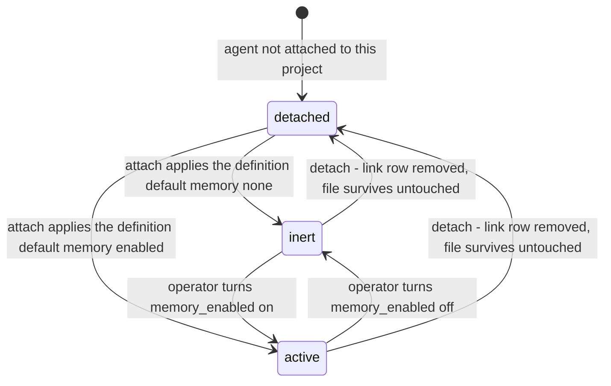
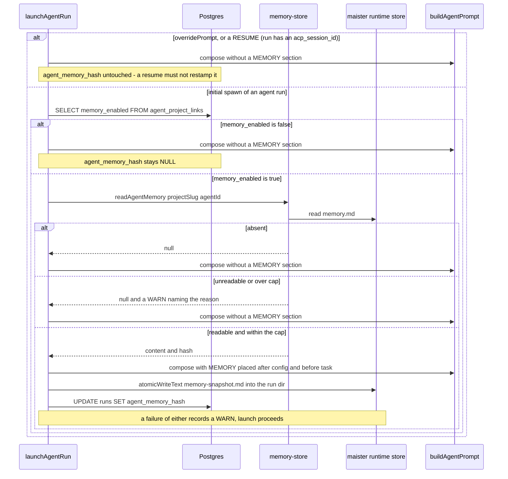
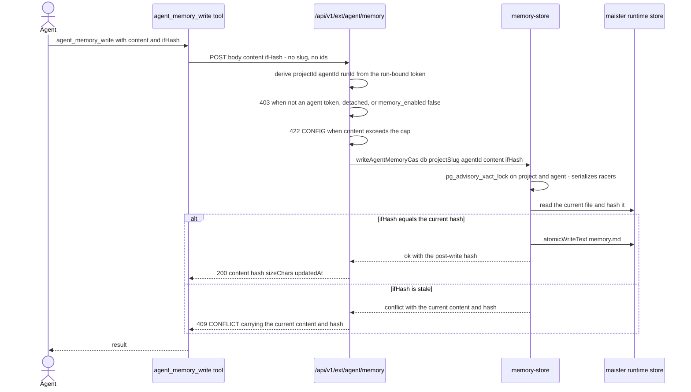
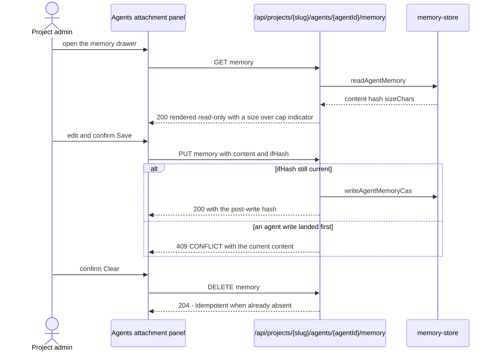

# Agent memory domain

## Purpose

**Agent memory** is a single small markdown file per `(agent, project)`
attachment that a platform agent may read at launch and rewrite during a run.
It is the agent's own durable cross-run scratch note — "what I learned about
this project last time" — and it exists so a summoned agent
([`agent-mentions.md`](agent-mentions.md)) does not start cold on every run.
This file owns the memory axis on the attachment, the on-disk store and its
path derivation, launch-time injection and its provenance record, the
content-hash CAS write path, and the owner's view/edit/clear surface. It does
NOT own agent launch mechanics ([`agents.md`](agents.md)) or Project Brain
([`project-brain.md`](project-brain.md)) — those are a different store with a
different owner, and the two axes never imply each other. (Implemented — ADR-152)

## Domain entities

- **Memory axis** — `agent_project_links.memory_enabled boolean NOT NULL
  DEFAULT false`. The per-attachment operator switch. Independent of
  `can_read_brain` / `can_write_brain`. See
  [`../db/agents-domain.md`](../db/agents-domain.md). (Implemented)
- **Definition memory field** — `memory: none | enabled` in the agent
  definition frontmatter (`agentDefinitionFrontmatterSchema`), default `none`.
  It is the package author's *recommendation*; `attachAgent` applies it once as
  the server-side default for a new attachment. The stored link value is
  effective thereafter — a package upgrade never re-enables memory an operator
  turned off. (Implemented)
- **Memory file** — `memory.md` at
  `.maister/<project-slug>/agents/<enc(packageName)>/<enc(stem)>/memory.md`
  under `runtimeRoot()`. Keyed by the qualified agent id
  (`<packageName>:<stem>`), never by package revision. (Implemented)
- **Component encoder `enc`** — keeps `[A-Za-z0-9._-]` verbatim and rewrites
  every other byte as `%XX` (uppercase hex). A component that encodes to `.` or
  `..` is refused. Because an encoded component can never contain `/`, the
  `(packageName, stem)` → path map is injective. (Implemented)
- **Content hash** — `hashAgentMemory(content)`, sha256 hex over the exact
  content bytes. An absent file hashes to `null`. It is both the CAS token and
  the provenance stamp. (Implemented)
- **CAS lock** — a per-`(project, agent)` `pg_advisory_xact_lock` held across the
  whole read-compare-write in `writeAgentMemoryCas`. The filesystem offers no
  compare-and-swap, so without it two callers observing the same hash would both
  pass the comparison and both write, and the loser would be discarded with a
  `200`. (Implemented)
- **Memory snapshot** — `memory-snapshot.md`, written into the run dir
  (`runDirPath(runtimeRoot(), projectSlug, runId)`) on every launch that
  actually injected memory. Human-readable evidence, GC'd with the run dir
  after 7 days. (Implemented)
- **Provenance stamp** — `runs.agent_memory_hash text` (nullable). The durable
  half of the provenance pair: it survives the run-dir GC and is queryable.
  `NULL` means "this run injected no memory". (Implemented)
- **Cap** — `MAISTER_AGENT_MEMORY_MAX_CHARS`, default `32768` characters, read
  through `agentMemoryMaxChars()`. Host/service env only per ADR-023; see
  [`../configuration.md`](../configuration.md). (Implemented)

## State machine

The memory **file** as seen by a launch. `degraded` is a read-time verdict,
not a stored state: the file on disk is unchanged, the launch simply carries no
MEMORY section. (Implemented)

The **attachment** axis, which gates every read and write regardless of the
file's own state. Detach never touches the file. (Implemented)

In `inert` and `detached` the file may exist and is simply not used: no
injection at launch, and `POST /api/v1/ext/agent/memory` refuses with 403.

## Process flows

### Launch injection and provenance (Implemented)

Resolution happens at the **launch site**, not inside `buildAgentPrompt`,
because the launch site's `opts.overridePrompt ?? …` discards the composed
base prompt wholesale — resolving inside the builder would stamp provenance for
a prompt that carried no memory. The whole path is gated on
`runs.run_kind = 'agent'` and on the run having **no** `acp_session_id`:
`startAgentSession` is also the resume entry point, and a resumed session
already carries the original prompt in restored context.

### Agent write through the content-hash CAS (Implemented)

The losing branch is the interesting one: it returns the current content so the
agent can merge and retry rather than blindly clobber.

### Owner view, edit, and clear (Implemented)

CAS applies to the human too — a blind Save must not clobber a concurrent
agent write.

## Expectations

- `agent_project_links.memory_enabled` MUST be the only switch for the memory
  axis; no code path MUST let `can_read_brain` / `can_write_brain` imply it or
  be implied by it, and a write MUST require BOTH the `agent_memory:write`
  token scope and `memory_enabled = true`. (REQ-C1, Implemented)
- `agentDefinitionFrontmatterSchema` MUST accept `memory: none | enabled`
  defaulting to `none`, `renderAgentDefinition()` MUST round-trip it
  byte-identically, and `attachAgent` MUST apply the effective definition's
  value server-side so a bare attach with no follow-up `PATCH` lands the right
  value; a definition-resolution failure MUST fail the attach, never land
  `false` silently. (REQ-C2, Implemented)
- The memory path MUST be
  `.maister/<project-slug>/agents/<enc(packageName)>/<enc(stem)>/memory.md`,
  split on the qualified id's first `:`; no two distinct qualified ids MUST
  ever map to the same path, every derived path MUST stay inside the project's
  `agents/` subtree, a component encoding to `.` or `..` MUST be refused, an id
  with no `:` MUST raise `MaisterError("CONFIG")` rather than fall back to a
  single level, and the path MUST NEVER include a package revision.
  (REQ-C3, Implemented)
- Memory MUST be injected only for `runs.run_kind = 'agent'`, only at initial
  spawn, and only into the composed base prompt — positioned after the config
  block and before the task block, and carrying the maintenance instruction.
  (REQ-C4, Implemented)
- A disabled axis, an absent file, an unreadable file, or an over-cap file MUST
  each produce no MEMORY section and MUST NOT block or fail the launch;
  unreadable and over-cap MUST each emit a `log.warn` naming which failure
  occurred. (REQ-C5, Implemented)
- Every launch that injects memory MUST write `memory-snapshot.md` into the run
  dir via `atomicWriteText` AND stamp `runs.agent_memory_hash`; a launch taking
  the `overridePrompt` branch MUST write neither, a RESUME MUST write neither
  (it injects nothing), and a failure to record either one MUST degrade to a
  `log.warn` rather than fail the launch. (REQ-C6, Implemented)
- A write MUST be a content-hash CAS: `ifHash === null` is the first-writer
  form, ordering MUST be read-current → compare → atomic write → return the
  post-write hash, a stale `ifHash` MUST return `MaisterError("CONFLICT")` with
  the current `{content, hash}`, and the read-compare-write MUST be serialized
  per `(project, agent)` by a `pg_advisory_xact_lock` so that of two concurrent
  writers holding the same `ifHash` exactly ONE wins and the other is refused —
  never both admitted with one silently discarded. (REQ-C7, Implemented)
- `POST /api/v1/ext/agent/memory` MUST take no body-controlled identifier —
  `projectId`, `agentId` and the audit `runId` come from the token binding and
  `projectSlug` from a `projects` lookup — MUST map its scope to a named
  `ProjectAction` (`writeAgentMemory`, minimum `member`) rather than falling into
  `resolveProjectAction`'s `readBoard` default, and MUST target
  `.maister/<slug>/agents/…` rather than the worktree so it works in every
  workspace mode including `none`. (The mapping is a guard for the slug-bearing
  user-token path; this route's own authorization is agent-token kind + link row
  + `memory_enabled` + scope.) (REQ-C8, Implemented)
- The owner MUST be able to read, replace and clear the file through
  `GET | PUT | DELETE /api/projects/{slug}/agents/{agentId}/memory` with
  `PUT` carrying `ifHash` and `DELETE` idempotent, and `memoryEnabled` MUST
  flow through the existing aggregating
  `PATCH /api/projects/{slug}/agents/{agentId}` rather than a new per-field
  route. (REQ-C9, Implemented)
- Detach MUST make memory inert — no injection, write refused — while leaving
  the file untouched; re-attach MUST revive the file and re-apply the
  definition default; a package re-pin or upgrade MUST preserve the file.
  (REQ-C10, Implemented)
- `MAISTER_AGENT_MEMORY_MAX_CHARS` MUST be character-denominated with default
  `32768`, MUST fall back to the default with one WARN on an invalid or
  non-positive value, MUST refuse an over-cap **write** with
  `MaisterError("CONFIG")`, and MUST remain host/service env only — never a
  compose variable. (REQ-C11, Implemented)
- No assistant pulse block MUST carry memory content, size, or hash.
  (REQ-C12, Implemented)

## Edge cases

| Edge case | Behavior |
|---|---|
| File larger than the cap at launch | No MEMORY section, `log.warn` with `reason: "over_cap"`, launch proceeds. The file is NOT truncated or rewritten — only a write refuses. |
| Path exists but is not a readable regular file (a directory, a bad mode) | No MEMORY section, `log.warn` with `reason: "unreadable"`, launch proceeds. Nothing throws. |
| CAS loss | 409 `MaisterError("CONFLICT")` whose body carries the current `{content, hash}` so the agent can merge and retry. The agent's bytes are discarded, never partially merged. |
| Two genuinely concurrent writers | The advisory lock serializes them: the second observes the first's committed bytes, loses the hash comparison, and gets the 409 with the winner's content. The atomic tmp+rename additionally guarantees the file is never a partial or interleaved write. Both halves are required — without the lock the compare-then-write is a check-then-act and BOTH writers succeed. |
| A flow-bound agent whose definition says `memory: enabled` | `attachAgent` lands `memory_enabled = false` and `updateAgentLink` refuses an explicit `true` with `MaisterError("CONFIG")`. The axis can never be switched on for an attachment that structurally cannot use it, from the UI or from a direct `PATCH`. |
| Owner `DELETE` racing an agent write | `DELETE` is deliberately NOT CAS-guarded: it is an explicit, confirmed operator action on an admin-only route, and the documented contract is idempotency. An agent write landing in the same instant may therefore survive the clear; the operator sees the surviving content on the next open. |
| A directory (or any non-file) at the memory path on `DELETE` | Surfaces as an error rather than a `204`. Only `ENOENT`/`ENOTDIR` mean "already absent"; answering "cleared" while the path survives would be the same lie the read path already reports as `unreadable`. |
| Workspace mode `none` | Memory works normally — the store lives under `.maister/<slug>/agents/…`, never in a worktree, so the L1–L3 read-only enforcement contour is untouched. |
| Detach | Memory becomes inert immediately (no injection, write 403) and the file survives untouched on disk. |
| Re-attach of an agent whose definition says `memory: none` | The surviving file is revived but the attachment lands `memory_enabled = false`, so it stays inert. Correct by construction and deliberately surprising — the definition default is re-applied, not the previous operator choice. |
| Package re-pin or upgrade | The file is preserved: the path is keyed by qualified agent id, never by revision. |
| Launch using `opts.overridePrompt` | Injects nothing and records nothing — no MEMORY section, no `memory-snapshot.md`, no `runs.agent_memory_hash`. The override discards the composed base prompt, so claiming provenance would be a lie. |
| Session resume | Memory is injected at initial spawn only. `startAgentSession` is ALSO the resume entry point (hook_trip and idle-permission resumes call it), so the gate is explicit: a run with an `acp_session_id` resolves no memory, re-injects nothing, and — crucially — does NOT re-write `memory-snapshot.md` or re-stamp `runs.agent_memory_hash`, which would otherwise describe the last resume instead of what the agent started from. |
| Provenance write fails (full disk, unwritable run dir, DB error) | The launch PROCEEDS with memory injected; the failure degrades to a `log.warn` carrying `reason: "provenance_write_failed"`. Memory must never block a launch, and the snapshot/stamp are evidence, not a precondition. |
| Flow-bound agent | An effective definition declaring `flow:` diverts to the agent-driven flow path and produces a `run_kind='flow'` run that never reaches the prompt seam, so it carries no memory. The owner's Memory toggle renders disabled with that reason rather than hidden. |
| Agent id with no `:` reaching the store | `MaisterError("CONFIG")` — never a silent single-level path, which would let two different agents share a file. |
| Run dir GC'd after 7 days | `memory-snapshot.md` is gone but `runs.agent_memory_hash` remains, so "what did this agent remember when it acted" stays answerable. |
| Agent token revoked (link disabled or detached) | The write fails at the token layer as well as the memory gate — `revokeAgentProjectTokens` fires on both disable and detach. |

## Non-goals

Embeddings, vector search, or any Project Brain ledger involvement —
`memory_recall` / `memory_propose` are untouched · cross-project or
cross-agent sharing · encryption · an autonomous consolidation job · memory for
flow `ai_coding` nodes or scratch runs (`run_kind = 'agent'` only) · exposing
memory in the assistant pulse · package-shipped seed templates · a
`memory_read` MCP tool.

## Linked artifacts

- ADR: [ADR-152](../decisions.md#adr-152-assistant-pulse-promotion-readiness--summonable-agent-metadata-and-per-attachment-agent-memory-files),
  building on [ADR-089](../decisions.md#adr-089-platform-agent-catalog-with-per-agent-runner-and-a-five-source-trigger-model)
  (platform agents), [ADR-106](../decisions.md#adr-106-package-based-platform-agents--package-identity-attachment-gating-optional-flow-enrichment-and-per-agent-runner-policy)
  (package-based agents) and [ADR-151](../decisions.md#adr-151-agent-mentions-in-task-comments-as-directed-summons)
  (directed summons).
- Sibling domains: [`agents.md`](agents.md) (catalog, launch gates, workspace
  axis), [`agent-mentions.md`](agent-mentions.md) (the summon path this memory
  serves), [`project-brain.md`](project-brain.md) (the *other* memory store —
  project-owned, shared, indexed), [`assistant-activity.md`](assistant-activity.md)
  (the pulse that must never carry memory content),
  [`external-operations.md`](external-operations.md) (ext surface + MCP facade).
- API: [`../api/external/operations.openapi.yaml`](../api/external/operations.openapi.yaml)
  (`extAgentMemoryGet`, `extAgentMemoryWrite`),
  [`../api/web.openapi.yaml`](../api/web.openapi.yaml)
  (`patchProjectAgentLink`, the three `/memory` owner routes).
- ERD: [`../db/agents-domain.md`](../db/agents-domain.md)
  (`agent_project_links.memory_enabled`, `runs.agent_memory_hash`).
- Narrative schema: [`../database-schema.md`](../database-schema.md).
- Configuration: [`../configuration.md`](../configuration.md)
  (`MAISTER_AGENT_MEMORY_MAX_CHARS`).
- Screens: [`../screens/projects/project-settings-agents.md`](../screens/projects/project-settings-agents.md)
  (`mem` chip, memory drawer, Memory toggle).
- Source (Implemented): `web/lib/agents/memory-store.ts`,
  `web/lib/agents/launch.ts`, `web/lib/agents/project-links.ts`,
  `web/lib/agents/definition.ts`, `web/lib/instance-config.ts`,
  `web/app/api/v1/ext/agent/memory/route.ts`,
  `web/app/api/projects/[slug]/agents/[agentId]/memory/route.ts`,
  `mcp/src/tools.ts`.
