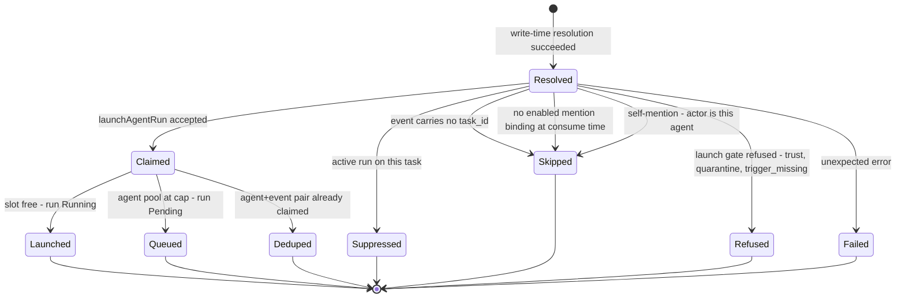
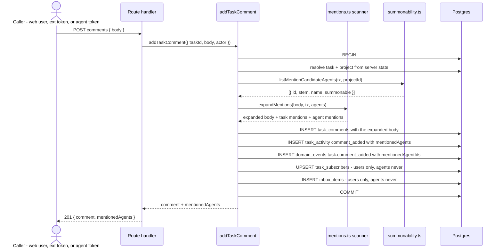
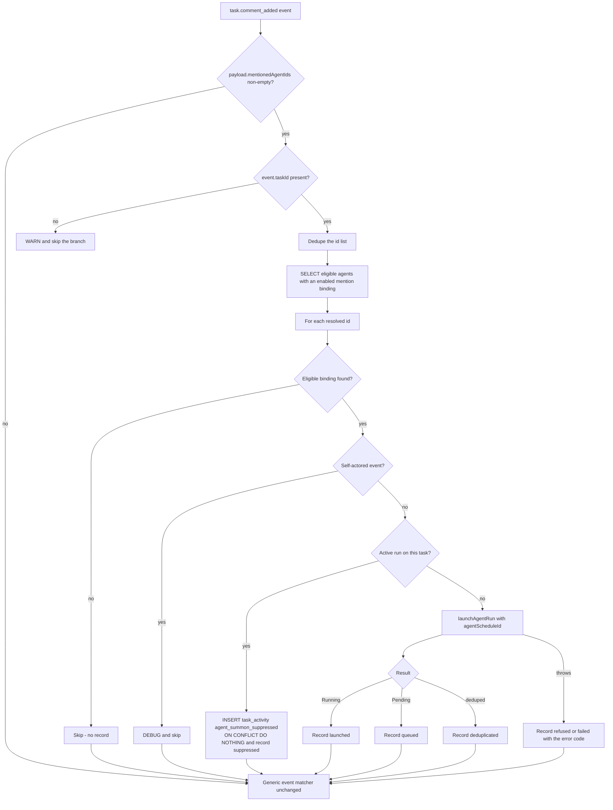

# Agent mentions domain

## Purpose

An **agent mention** is an `@<agentId>` handle inside a task comment that
summons a platform agent to that task. It joins the social-board comment
substrate ([`social-board.md`](social-board.md)) to the platform-agent
substrate ([`agents.md`](agents.md)) through the ADR-086 domain-event bus
([`domain-events.md`](domain-events.md)): the comment write resolves and
expands handles, the `task.comment_added` event carries the resolved ids, and
the `agent_triggers` consumer turns each id into at most one directed agent
run. This file owns the mention scanning/resolution rules, the summonability
predicate, and the per-agent summon decision. It does NOT own comment
plumbing (social-board), agent launch mechanics (agents), or `@user`
notification — see Non-goals. (Implemented — ADR-151)

## Domain entities

- **Agent handle** — the literal token in a comment body: canonical
  `@<packageName>:<stem>` or bare `@<stem>`. Charset per
  `AGENT_ID_PATTERN` / `AGENT_STEM_PATTERN`
  (`web/lib/agents/definition.ts`); the token must end on an alphanumeric.
- **Agent mention** — a handle that RESOLVED at write time to an agent id
  within the commented task's project. Unresolved handles are not mentions.
- **Mention binding** — an `agent_schedules` row with
  `trigger_type = 'mention'` for `(agent_id, project_id)`. It carries no
  cron and no `event_match` columns, and it is the operator's grant of
  summon authority (created/enabled only by a project `admin` through
  `editSettings`). See [`../db/agents-domain.md`](../db/agents-domain.md).
- **Summonable(agent, project)** — the write-time and consume-time
  eligibility predicate:
  attachment exists ∧ `agent_project_links.enabled` ∧ `agents.enabled` ∧
  `agents.quarantined_at IS NULL` ∧ the effective definition declares
  `domain_event` in `triggers` ∧ an enabled mention binding exists.
- **Summon** — a directed agent run caused by a mention:
  `runs.run_kind = 'agent'` with `trigger_source = 'domain_event'`,
  `trigger_event_id` = the `task.comment_added` event id, and
  `task_id` = the commented task.
- **Suppressed summon** — a mention that resolved and was summonable but did
  not launch because that agent already holds an active run on that task;
  recorded as a `task_activity` row of kind `agent_summon_suppressed`.

## State machine

Per mentioned agent id, evaluated in this order by the consumer. The frozen
decision table below is the contract; every terminal state is observable
either as a `runs` row, a `task_activity` row, or an `agent_schedules`
outcome. (Implemented)

### Frozen decision table

| # | Condition | Write-time record | Consume-time outcome | Persisted evidence |
|---|---|---|---|---|
| 0 | Handle unresolved — unknown id, or ambiguous bare stem | not a mention; body keeps literal text | n/a | none |
| 1 | `event.taskId` empty or null | n/a | skip the whole branch | WARN log |
| 2 | Resolved, `summonable = false` at write time | `mentionedAgents[].summonable = false` | re-checked; no binding → skip | comment footnote, from the activity payload |
| 3 | Self-mention — `event.actorType = 'agent'` and `event.actorId = agentId` | recorded as resolved | skip | DEBUG log only |
| 4 | No eligible enabled mention binding at consume time | any | skip | none — the write-time footnote already explains |
| 5 | Active run on this task in `MENTION_SUPPRESSION_STATUSES` | `summonable = true` | **suppressed** | `task_activity.agent_summon_suppressed` + binding `last_outcome = 'suppressed'` |
| 6 | Launch accepted, slot free | `summonable = true` | **launched** | `runs` row `Running` + binding `last_outcome = 'launched'`, `last_run_id` |
| 7 | Launch accepted, agent pool at cap | `summonable = true` | **queued** | `runs` row `Pending` + binding `last_outcome = 'queued'` |
| 8 | Redelivery of an already-claimed `(agent, event)` pair | — | **deduped** | no new run; binding `last_outcome = 'deduplicated'` |
| 9 | Launch refused — trust, quarantine, `trigger_missing`, destructive, subagent, pin divergence | `summonable = true` | **refused** | binding `last_outcome = 'refused'` + `last_error_code` |
| 10 | Unexpected error | any | **failed** | binding `last_outcome = 'failed'`, `last_error_code = 'CRASH'` |

`MENTION_SUPPRESSION_STATUSES = { Pending, Running, NeedsInput,
NeedsInputIdle, HumanWorking, WaitingOnChildren }` is a per-concern
predicate, deliberately NOT `ACTIVE_RUN_STATUSES` (a portfolio-display set).
`Pending` is included so a queued summon is not double-queued; `Review` and
`Crashed` are excluded because re-mentioning after a finished or dead attempt
is the intended rework loop.

`mentionedAgentIds` carries **all** resolved ids, including currently
non-summonable ones: the consumer is authoritative at consume time, so
enabling a binding during the dispatch window still summons, and revoking one
still refuses.

## Process flows

### Write-time resolution and expansion (Implemented)

Runs inside the ONE `addTaskComment` transaction, beside the existing `KEY-N`
expansion. No launch happens here — the comment write only records what was
resolved.

### Consume-time summon decision (Implemented)

The `agent_triggers` consumer runs the mention branch BEFORE the generic
event matcher and does NOT `continue` — mention summons are additive to
existing `eventMatch.kinds` subscriptions.

## Expectations

- An agent handle MUST resolve only from a plain-text markdown segment
  (never inside a fenced block, an inline code span, or an existing markdown
  link), only within the commented task's project, and only when it is a
  canonical `<packageName>:<stem>` id or a bare stem matching exactly one
  eligible in-project candidate; anything else MUST stay literal text.
  (Implemented)
- A resolved mention MUST be stored expanded as
  `[@<agentId>](/agents/<agentId>)` — the leading `/` is required so no agent
  id is parsed as a URL scheme by the renderer's `urlTransform` — and
  renderers MUST NEVER re-resolve handles at read time. (Implemented)
- `domain_events.payload.mentionedAgentIds` MUST be deduplicated and MUST be
  omitted entirely when no handle resolved. (Implemented)
- The whole comment write (resolution, expansion, insert, activity, event,
  subscriptions, fanout) MUST remain ONE `db.transaction`; a failure at any
  step MUST leave no partial writes. (Implemented)
- Agent mentions MUST NEVER create `inbox_items` or `task_subscribers` rows;
  `recipient_type` MUST stay `'user'` across this feature. (Implemented)
- At most one run MUST exist per `(agent, comment event)` pair under any
  number of redeliveries, and that run MUST carry `runs.task_id`,
  `runs.trigger_event_id`, and a `trigger_payload` whose `{kind, payload}`
  core keeps `taskCommentTriggerContextBlock` working unchanged. (Implemented)
- A mention MUST NOT launch an agent that has no enabled
  `agent_schedules` row with `trigger_type = 'mention'` on that project
  attachment, and creating or enabling that row MUST require project `admin`
  (`editSettings`) — the binding IS the authorization. (Implemented)
- An agent MUST NEVER summon itself through a comment it authored.
  (Implemented)
- A mentioned agent holding a run on the same task in
  `MENTION_SUPPRESSION_STATUSES` MUST NOT be **summoned** again and MUST
  record exactly one `agent_summon_suppressed` row per `(task, agent,
  triggerEventId)`, under any number of redeliveries. The guarantee is scoped
  to this branch and rests on the dispatcher being a singleton
  (`domainEventDispatch: 1` + the per-consumer CAS lease), so no two summons
  evaluate it concurrently. It is NOT a global mutual exclusion: `launchRun`,
  the cron tick and flow bindings have never gated on "this agent is busy on
  this task", so a launch from one of those paths can still land beside a
  summon. (Implemented)
- Mention summons MUST be additive: generic `eventMatch.kinds` subscribers to
  `task.comment_added` MUST keep firing exactly as before (including the
  lowest-`scheduleId`-wins single-owner rule), and `trigger_type = 'mention'`
  rows MUST NEVER be picked up by the cron tick or the generic event matcher.
  (Implemented)
- A summon over `MAISTER_MAX_CONCURRENT_AGENTS` MUST queue as `Pending` and
  MUST NEVER be dropped or throw; the consumer MUST NEVER throw out of
  `handle`, and one agent's failure MUST NOT block the other agents
  mentioned in the same event. (Implemented)
- The comment POST response (web and ext) MUST report each resolved mention
  with its write-time summonability. `summonable: true` MUST be read as "this
  handle resolved and the operator grant was in place when the comment was
  written" — NEVER as "a run was accepted": the consumer re-evaluates the
  decision table afterwards and can still skip (self-mention), suppress
  (busy task), or refuse (trust, quarantine, `trigger_missing`, destructive,
  subagent, pin divergence). `summonable: false` is the stronger signal — it
  MUST mean nothing will launch. (Implemented)

## Edge cases

| Edge case | Behavior |
|---|---|
| `user@example.com` in a comment | Not a mention — `@` must sit at a word boundary. No error. |
| `@triager.` / `@triager,` (trailing punctuation) | The token ends at the last alphanumeric; `triager` resolves and the punctuation stays outside the link. |
| Same agent mentioned twice in one body | Both occurrences expand; ONE id in the event payload; one run. |
| Two different agents mentioned | Two runs, each its own `agent_id` against the same `trigger_event_id`; over-cap ones queue as `Pending`. |
| Agent detached or disabled between write and consume | The consumer skips silently; the comment keeps its chip as historical record. |
| Agent deleted after the comment | The chip still renders (the body is immutable history); no summon. |
| Hand-typed `[@fake](/agents/fake)` in a comment | Renders as a chip but has NO activity entry and NO run — the authoritative signals are the activity payload and the run, never the chip. Accepted, identical to today's hand-typed `KEY-N` links. |
| Expanded body exceeds the 10 000-character input cap | Pre-existing property of `KEY-N` expansion (validation is on input, expansion follows). No change, no error. |
| Zero summonable agents in the project | The composer `@` popover never opens; a hand-typed `@x` still expands only if `x` resolves to an eligible agent, else stays literal. |
| Mention on a `Done` or `Abandoned` task | Allowed by design — nothing in the summon path branches on task status; the agent's own workspace axis governs cost. |
| Binding exists but the definition lacks `domain_event` | `summonable = false` at write time (footnote); if launched anyway through drift, `loadAgentContext` refuses with `trigger_missing` → decision row 9. |
| Trust revoked between binding and consume | `resolveEffectiveAgentDefinition` throws → decision row 9 (`refused`, `MaisterError("PRECONDITION")`). |
| Comment posted by an ownerless project token | The actor is `('system', NULL)`; mentions summon normally — no self-exclusion applies. |
| A manual/cron/flow launch of the same agent races the summon | Both can end up active on the task. The busy check is a read-then-launch inside the singleton dispatcher, which serializes summon-vs-summon but cannot serialize summon-vs-other-path — no launch path has ever enforced one-active-run-per-`(agent, task)`. Accepted, not silently: making it an invariant would need a DB claim shared by every launch path and would block legitimate manual relaunches. The cost ceiling stays `MAISTER_MAX_CONCURRENT_AGENTS`. |
| Comment write succeeds but the dispatcher is down | The event stays in `domain_events`; the summon fires when the dispatcher next ticks (at-least-once, no expiry). |

## Non-goals

`@user` mentions and human-notification changes · mentions in task title or
description · agent inbox rows or agent chat surfaces · cooldown frameworks
beyond suppression and dedup · cross-project mentions · widening
`inbox_items_event_kind_check` (tracked separately).

## Linked artifacts

- ADR: [ADR-151](../decisions.md#adr-151-agent-mentions-in-task-comments-as-directed-summons),
  building on [ADR-083](../decisions.md#adr-083-social-board-substrate--per-project-task-numbering-typed-relations-polymorphic-actor)
  (social board), [ADR-086](../decisions.md#adr-086-domain-event-outbox-as-the-shared-trigger-bus)
  (event bus) and [ADR-089](../decisions.md#adr-089-platform-agent-catalog-with-per-agent-runner-and-a-five-source-trigger-model)
  (platform agents).
- Sibling domains: [`social-board.md`](social-board.md) (comment pipeline,
  `KEY-N` mentions, inbox), [`agents.md`](agents.md) (agent catalog,
  triggers, launch gates, budget), [`domain-events.md`](domain-events.md)
  (outbox + dispatcher), [`external-operations.md`](external-operations.md)
  (ext comment route + MCP `comment_create`).
- ERD: [`../db/agents-domain.md`](../db/agents-domain.md) (`agent_schedules`
  trigger types), [`../db/runs-domain.md`](../db/runs-domain.md)
  (`task_activity` kinds + the summon unique index).
- Narrative schema: [`../database-schema.md`](../database-schema.md).
- API: [`../api/web.openapi.yaml`](../api/web.openapi.yaml)
  (`postTaskComment`), [`../api/external/operations.openapi.yaml`](../api/external/operations.openapi.yaml)
  (`extCreateTaskComment`).
- Screens: [`../screens/projects/project-board.md`](../screens/projects/project-board.md)
  (composer + timeline), [`../screens/projects/project-settings-agents.md`](../screens/projects/project-settings-agents.md)
  (mention binding row).
- Source (Implemented): `web/lib/social/mentions.ts`,
  `web/lib/social/comments.ts`, `web/lib/agents/summonability.ts`,
  `web/lib/agents/triggers.ts`, `web/components/social/comment-composer.tsx`,
  `web/components/social/markdown-body.tsx`.
