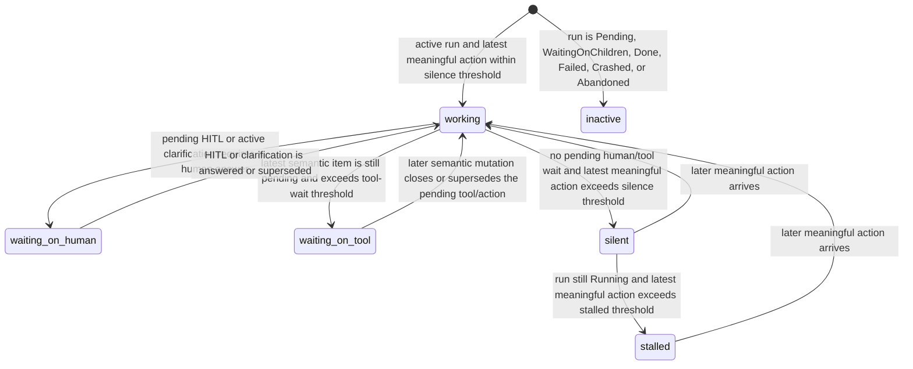
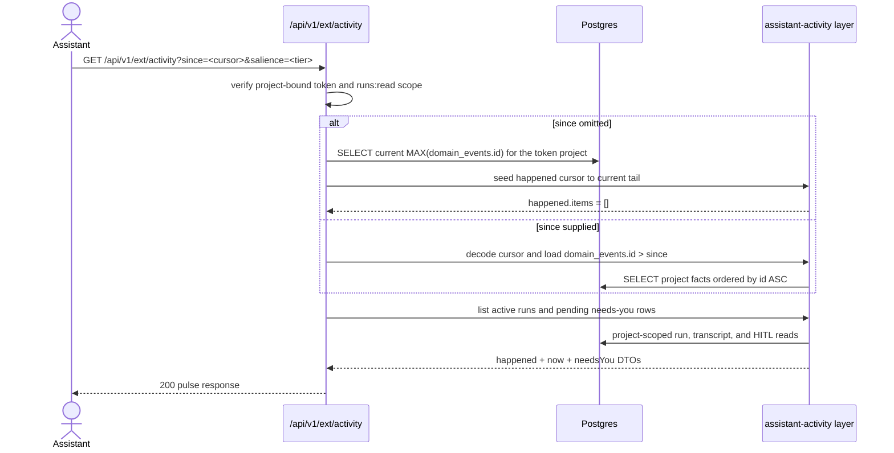
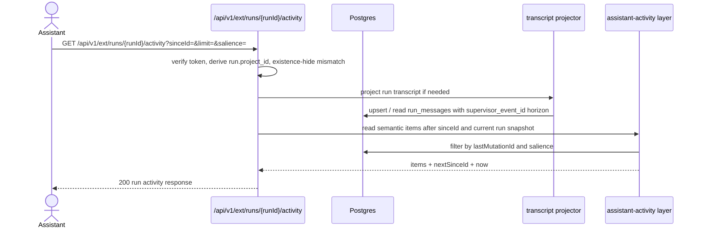

# Assistant activity domain

## Status: Designed (v1 contract frozen on 2026-07-26)

## Purpose

This domain defines the assistant-facing "what happened / what is happening"
surface exposed through `GET /api/v1/ext/activity`,
`GET /api/v1/ext/runs/{runId}/activity`, and the matching MCP tools. It
reduces existing MAIster state into a client-safe semantic feed: persisted
facts come from `domain_events`, per-run semantic actions come from the
transcript projector over `run.events.jsonl` and `run_messages`, and
"needs you" / liveness come from existing run + HITL read models. Boundary:
DTOs, salience filtering, cursor semantics, liveness truth table, and project
isolation for assistant clients. Out of scope: new runtime collection,
supervisor protocol changes, raw ACP passthrough, and any new platform-wide
token model.

## Domain entities

- **Assistant pulse** — the project-scoped ext/MCP response with three blocks:
  `happened`, `now`, and `needsYou`. `happened` is persisted fact replay;
  `now` and `needsYou` are synthesized read models evaluated at request time.
- **Per-run activity feed** — the run-scoped ext/MCP response returning
  semantic items for one run plus the same synthesized `now` snapshot.
- **`domain_events`** — the append-only fact log backing `happened`. Cursor
  ordering is `domain_events.id`; no dispatcher consumer row is created for
  the pulse. See [domain-events.md](domain-events.md).
- **`run_messages`** — the persisted semantic transcript rows for flow and
  scratch/agent projection, keyed by stable item identity plus the monotonic
  `supervisor_event_id` mutation horizon. See [runs.md](runs.md) and
  [`../database-schema.md`](../database-schema.md).
- **Semantic activity item** — one assistant-safe verb/object/outcome action
  such as "edited `web/lib/foo.ts`", "ran tests", or "asked human". Items are
  adapter-agnostic, coalesced, and may mutate in place as more transcript data
  arrives.
- **Mutation horizon** — the monotonic replay boundary used by
  `GET /api/v1/ext/runs/{runId}/activity`. One stable item id may reappear on a
  later poll if its `lastMutationId` advanced after the caller's `sinceId`.
- **Salience** — deterministic item importance class:
  `high | normal | low | suppressed`. `suppressed` is internal-only and never
  crosses the external contract.
- **Liveness state** — synthesized snapshot status:
  `working | silent | waiting_on_tool | waiting_on_human | stalled | inactive`.
- **Needs-you item** — a project-scoped pending human-attention projection over
  active HITL / clarification rows. It is NOT the same contract as the global
  personal-token inbox route `GET /api/v1/ext/hitl`.
- **Liveness thresholds** — host configuration read at request time:
  `MAISTER_ASSISTANT_ACTIVITY_WAITING_TOOL_AFTER_SECONDS` (default `90`),
  `MAISTER_ASSISTANT_ACTIVITY_SILENT_AFTER_SECONDS` (default `180`), and
  `MAISTER_ASSISTANT_ACTIVITY_STALLED_AFTER_SECONDS` (default `900`).

## State machine

The run row remains the source of truth for lifecycle state; assistant
liveness is a synthesized read-model overlay. The project pulse reports only
active runs, while the per-run route may return a non-active current status
with `liveness.state = inactive` and a status-specific summary.

Precedence is deterministic:

1. `waiting_on_human`
2. `waiting_on_tool`
3. `stalled`
4. `silent`
5. `working`

## Process flows

### Project pulse poll

`GET /api/v1/ext/activity` is the assistant entry point for one project-bound
token. The route never accepts a project slug or filesystem locator from the
caller.

Contract choices frozen for v1:

- `happened` is the only cursor-replayed block.
- `now` is always a full snapshot of current active runs.
- `needsYou` is always a full snapshot of pending project-scoped human asks.
- Omitting `since` bootstraps polling at the current fact-log tail instead of
  replaying historical backlog.

### Per-run semantic replay

`GET /api/v1/ext/runs/{runId}/activity` drills into one run. The run's project
is derived server-side from the run row and re-validated through the same ext
authorization boundary as other run-scoped routes.

Replay rules:

- `sinceId` is a forward-only mutation horizon over semantic item changes.
- A stable `id` may reappear if its `lastMutationId` advanced after the
  caller's `sinceId`.
- When `sinceId` is omitted, replay starts from the beginning of the run's
  semantic history and returns up to the `limit` window.
- There is no backward pagination API in v1.

## Expectations

- `GET /api/v1/ext/activity` MUST require a project-bound token and
  `runs:read`; a global personal token without an explicit project binding MUST
  return 403.
- `GET /api/v1/ext/runs/{runId}/activity` MUST derive `projectId` from the run
  row, require the token's bound `projectId` to match it, existence-hide
  cross-project access with 404, honor the same `runs:read` scope as
  `GET /api/v1/ext/runs/{runId}`, and return the run's current status even
  when it is no longer active.
- Pulse `since` cursors are client-held only. The route MUST NOT create or
  advance a `domain_event_consumers` row.
- Pulse `happened` ordering MUST be `domain_events.id ASC`, filtered strictly
  to the token-bound project.
- Omitting `since` on the pulse MUST return `happened.items = []` and seed
  `happened.nextCursor` to the current project tail. This call still MUST
  compute `now` and `needsYou`.
- Per-run replay MUST use stable item ids plus monotonic `lastMutationId`
  values so in-place item mutations resurface on later polls.
- The current design assumes the existing schema is sufficient:
  `domain_events.id` for pulse replay, `run_messages.supervisor_event_id` for
  flow-run mutation replay, and the same semantic horizon exposed through the
  whole-run coalescer for scratch / standalone agent runs. If a run cannot be
  replayed honestly with those persisted identifiers, the implementation MUST
  fail closed or add an explicit additive migration; it MUST NOT invent a
  best-effort cursor.
- `salience` query filtering is minimum-threshold, not exact-match:
  `high` returns `high`; `normal` returns `high` + `normal`; `low` returns all
  emitted items. `suppressed` is never emitted.
- `needsYou` MUST include pending HITL and active agent clarification asks in
  the token-bound project, with no duplication between the same unanswered ask
  and its projection.
- Project-less scratch runs (`runs.project_id IS NULL`) MUST NOT appear in the
  pulse because the external surface is project-scoped.
- The assistant contract MUST NOT expose raw ACP JSON-RPC frames, transport
  method names, absolute worktree paths, diff bodies, or token/supervisor
  internals. Message text is allowed; file paths and bounded stats are
  allowed; file contents and diff bodies are not.
- `waiting_on_human` MUST outrank every other liveness label. A run with a
  pending ask is never reported as merely `silent` or `waiting_on_tool`.
- Every response MUST make the persisted-vs-synthesized distinction obvious by
  section boundary: `happened` is persisted fact replay, `now` and `needsYou`
  are synthesized snapshots.

## Edge cases

- **Invalid pulse cursor** — malformed or unsupported `since` returns 422
  `CONFIG`; the route does not silently reset to the current tail.
- **Invalid per-run mutation horizon** — malformed or negative `sinceId`
  values, or a `limit` outside the declared bounds return 422
  `CONFIG`.
- **Projectless token on the pulse** — a global personal token calling
  `GET /api/v1/ext/activity` returns 403 because there is no server-derived
  project target.
- **Cross-project run lookup** — `GET /api/v1/ext/runs/{runId}/activity`
  returns 404 if the run belongs to a different project than the token can
  access.
- **No domain events yet** — bootstrap pulse returns empty `happened.items`,
  `nextCursor = "0"` (or the encoded zero horizon), and still reports `now`
  plus `needsYou`.
- **No active runs** — `now.runs` is `[]`, not omitted, and does not imply
  anything about `happened` or `needsYou`.
- **No pending human attention** — `needsYou.items` is `[]`, not omitted, and
  does not imply anything about active-run liveness.
- **Quiet active run** — a run with no new meaningful action after the silence
  threshold is reported as `silent` or `stalled` according to age and run
  status; silence is synthesized information, not an absent item.
- **Pending tool never resolves** — once the tool-wait threshold is exceeded
  and no later semantic mutation closes the action, liveness becomes
  `waiting_on_tool`; once the stalled threshold is exceeded with no human/tool
  wait, the same run becomes `stalled`.
- **Transcript shape cannot be classified semantically** — the item degrades to
  a truthful `generic` semantic item with bounded detail; the route must not
  invent file edits, tests, or tool outcomes it cannot prove.

## Linked artifacts

- API contract: [`../api/external/operations.openapi.yaml`](../api/external/operations.openapi.yaml)
  (`GET /api/v1/ext/activity`, `GET /api/v1/ext/runs/{runId}/activity`).
- Related domains: [external-operations.md](external-operations.md),
  [runs.md](runs.md), [hitl.md](hitl.md), [domain-events.md](domain-events.md).
- DB narrative: [`../database-schema.md`](../database-schema.md)
  (`domain_events`, `run_messages`, `hitl_requests`).
- Source files (planned v1 implementation): `web/lib/ext-activity/*`,
  `web/lib/run-transcript/*`, `web/lib/runs/run-transcript-projector.ts`,
  `web/lib/services/runs.ts`, `web/lib/queries/hitl.ts`,
  `web/app/api/v1/ext/activity/route.ts`,
  `web/app/api/v1/ext/runs/[runId]/activity/route.ts`,
  `mcp/src/tools.ts`.
