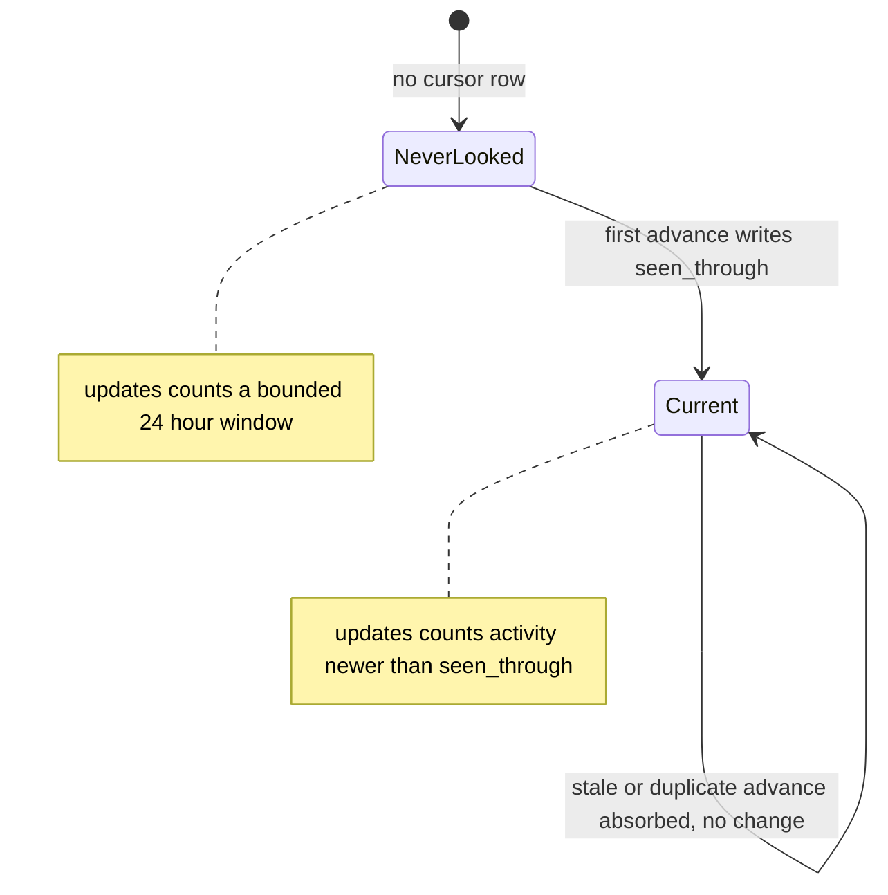
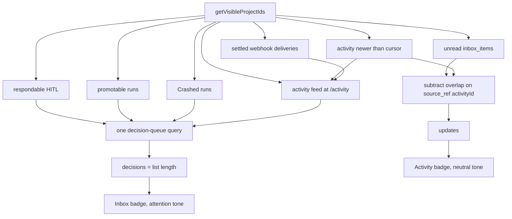
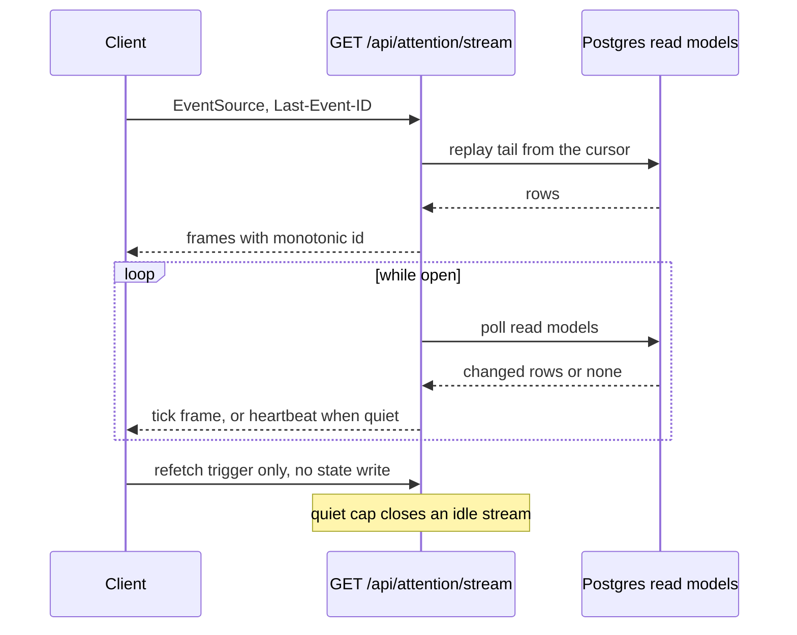

# Attention

## Purpose

The **attention plane**: the two canonical counters a reader is shown
(`decisions` and `updates`), the cross-project decision queue behind the first of
them, the cross-project activity feed and per-user read cursor behind the second,
the deterministic digest, and the user-scoped SSE stream that keeps all of it
fresh. The domain answers exactly two questions — *what is blocked on me* and
*what happened that I have not seen* — and keeps them separate populations.
It owns no state machine of its own: it reads run, task, HITL and activity state
and never writes any of it. The counters' definitions are locked by
[ADR-168](../decisions.md#adr-168-two-canonical-attention-counters-decisions-and-updates);
the stream by [ADR-170](../decisions.md#adr-170-user-scoped-attention-sse-stream).
Both are **Implemented**.

## Domain entities

- **`decisions`** — the count of work blocked on the reader: respondable
  cross-project HITL, mechanically promotable runs, `Crashed` runs owing
  recover/discard, and triage-flagged (`Held`) tasks.
- **`updates`** — the count of unseen activity: unread `inbox_items` plus
  activity newer than the reader's cursor, minus the overlap between them.
- **`user_activity_cursors`** (persisted) — one row per user,
  `seen_through timestamptz`. An absent row means "never looked".
  See the [ERD](../db/erd.dbml).
- **`inbox_items`** (persisted) — per-recipient rows whose
  `source_ref->>'activityId'` is the join key that de-duplicates `updates`.
- **`task_activity`**, **`domain_events`**, **`webhook_deliveries`**
  (persisted) — the three sources the activity feed unions. `domain_events` is
  read through **`ATTENTION_EVENT_KINDS`**: the taxonomy minus the three kinds
  emitted in the SAME transaction as a `task_activity` row carrying the same
  fact (`task.created`, `task.comment_added`, `task.triage_requeued`). Both the
  counter and the feed read that one list, so a fact counted is a fact shown.
  Webhooks contribute settled DELIVERY OUTCOMES only — never a payload, an error
  body or a target URL.
- **Decision-queue item** — a projected DTO carrying kind, criticality, age and
  a next action. Never a database row.
- **Digest** — a deterministic sentence over a bounded window: promoted,
  crashed, new decisions, new events, tokens spent.

## State machine

The only stateful entity is the per-user read cursor. Its advance is a monotonic
single-row upsert (`GREATEST(excluded.seen_through, …)`), so it has no
backward edge — a replayed or out-of-order request is absorbed, never applied.

## Process flows

How the two counters are computed, and where the subtraction happens.

Liveness. The stream polls durable read models and pushes a tick; the client
refetches. It is never a state-transition trigger.

## As built

- **Every source of the queue takes the scope, including the one that resolves
  its own visibility.** Three of the four sources accept a project set as their
  first argument; `getCrossProjectHitlInbox` resolves `getVisibleProjectIds`
  itself and so takes a narrowing `scope` instead, intersected with visibility
  and never widening it. Passing it nothing is what made the project page's
  `decisions` count report every other visible project's HITL, so
  `DecisionsScope` is now an alias of that source's own scope type — the two
  cannot drift apart again (`IT-ATN-05`).
- **The stream's frame is wider than any consumer.** `AttentionTickEvent`
  carries both counters and the moved `projectIds` because ADR-170 D3 fixes that
  shape, but the client hook returns only `tick`, `changed`, `liveness` and
  `reconnect`: the surfaces it serves are server-rendered, a tick becomes
  `router.refresh()`, and re-exposing the counters client-side would be a second
  source for a number ADR-168 D8 says has exactly one.
- **One cursor spelling, three readers.** The route that parses
  `Last-Event-ID`, the client that decides whether a received id is usable, and
  the AsyncAPI `pattern` all have to agree; the regex therefore lives in
  `lib/sse/frame.ts`. The client's own copy used to reject `0`, which the route
  accepts.
- **The HTTP half of the stream is in the OpenAPI, the frames in the AsyncAPI.**
  Both SSE precedents document the handshake — auth, resume parameters, close
  semantics — as an OpenAPI path and the event schemas as an AsyncAPI channel.
  No gate enumerates routes against paths, so the pairing is a convention a
  reviewer has to hold.

## Expectations

- **ATN-01:** `decisions` MUST come from one query covering respondable HITL, promotable runs, `Crashed` runs and triage-flagged tasks, scoped to the projects the reader can ACT in (all four populations require project `member`; `readBoard` does not), and its count MUST equal the length of the list it labels.
- **ATN-02:** `updates` MUST subtract the inbox/activity overlap using `inbox_items.source_ref->>'activityId'`, so one mention counts exactly once. The same rule binds one table over: a `domain_events` kind with a `task_activity` twin MUST NOT be counted, which is what `ATTENTION_EVENT_KINDS` enforces.
- **ATN-03:** With no `user_activity_cursors` row, `updates` MUST count a bounded 24-hour window, never all history.
- **ATN-04:** A task blocked by a relation MUST count in neither `decisions` nor `updates`.
- **ATN-05:** Every surface MUST render one layout-level `decisions` value; no surface may recompute its own.
- **ATN-06:** The external pulse's `needsYouCount` MUST keep its HITL-only semantics unchanged; the reader's own counters are served by `GET /api/v1/ext/decisions` instead, because a project-scoped pulse has no reader to compute them for (ADR-168 amendment).
- **ATN-07:** The decision queue MUST order by HITL criticality then age, with non-HITL kinds ranked `crashed` above `promotable` above `flagged`, and MUST NEVER consult `tasks.priority`.
- **ATN-08:** A `decision_request` HITL row MUST NOT appear on any external surface.
- **ATN-09:** The activity feed MUST NEVER expose a worktree path, a diff body, or a raw ACP frame.
- **ATN-10:** A cursor advance MUST be monotonic and idempotent; a stale or out-of-order request MUST NOT move `seen_through` backwards, and a future timestamp MUST be refused `PRECONDITION`.
- **ATN-11:** The attention stream MUST emit no frame referencing a project outside the reader's visibility, MUST re-read the reader's ROLE and account status on every poll rather than trusting the connect-time session, and MUST NEVER mutate persisted run state.
- **ATN-12:** The digest MUST be deterministic — the same clock and the same rows MUST produce byte-identical output.

## Edge cases

- **EDGE-ATN-01:** No cursor row — `updates` falls back to the bounded 24-hour window (ATN-03) and the activity feed renders no "your last visit" divider.
- **EDGE-ATN-02:** Project membership gained or lost after the cursor was written — activity is filtered by **current** visibility and the cursor is never rewound, so a new member sees that project's activity from joining forward and a removed member stops seeing it immediately.
- **EDGE-ATN-03:** A stale or out-of-order cursor POST is absorbed by the `GREATEST` upsert with no change; a `seen_through` later than `now()` is refused with `MaisterError("PRECONDITION")`.
- **EDGE-ATN-04:** Reconnect with `Last-Event-ID` replays the tail from durable rows without duplicating already-delivered frames; an unparseable id is clamped to a full replay rather than an error.
- **EDGE-ATN-05:** A project VIEWER MUST receive an empty decision queue for a project full of decisions: they can read the board and can perform none of the four actions the queue asks for, so an entry would be a badge over an action that answers 403. A global admin, who acts everywhere by role, MUST still receive them.
- **EDGE-ATN-06:** Revocation MUST reach a stream that is already open. Demoting a connected admin ends the see-every-project bypass on the next poll, and an account that stops being active closes the stream with `attention.stream_timeout` / `access_revoked` — neither is bounded by the quiet cap while events keep arriving.

## Linked artifacts

- [ADR-168 — two canonical attention counters](../decisions.md#adr-168-two-canonical-attention-counters-decisions-and-updates)
- [ADR-170 — user-scoped attention SSE stream](../decisions.md#adr-170-user-scoped-attention-sse-stream)
- [M51 requirement traceability](m51-traceability.md)
- [Social board — inbox, mentions, subscriptions](social-board.md)
- [HITL](hitl.md)
- [Domain events](domain-events.md)
- [Screen reference — `/activity`](../screens/activity.md)
