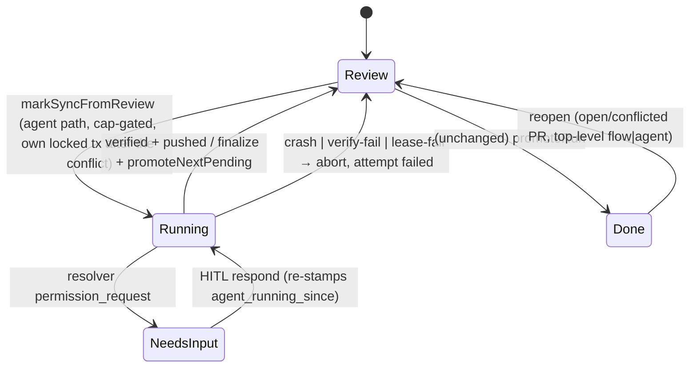
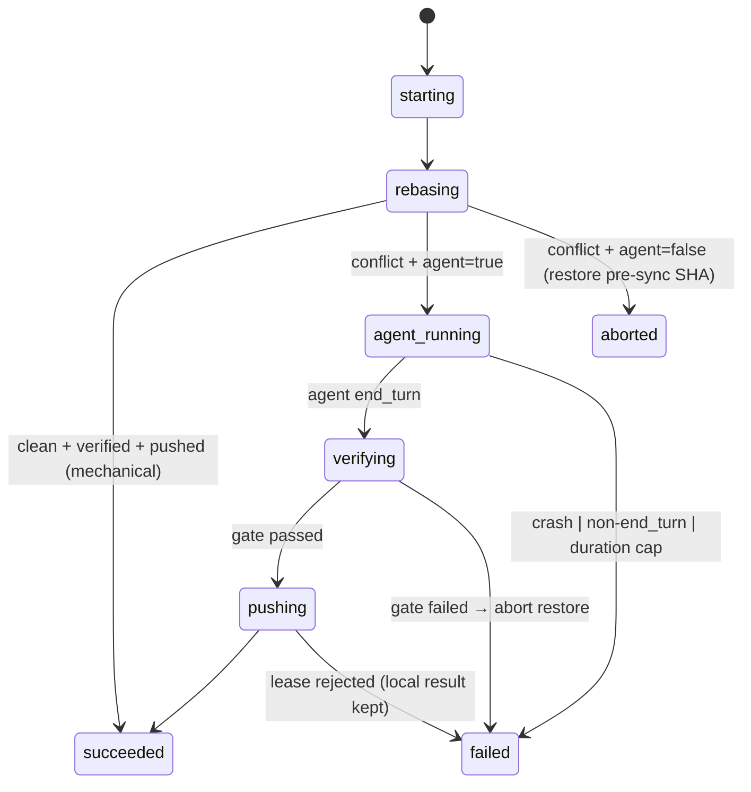
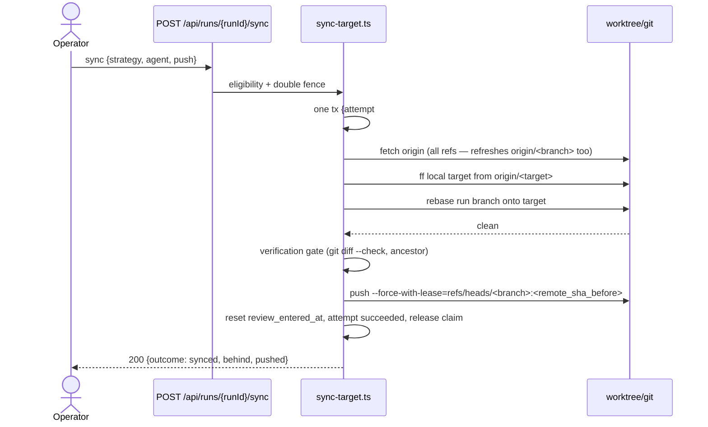
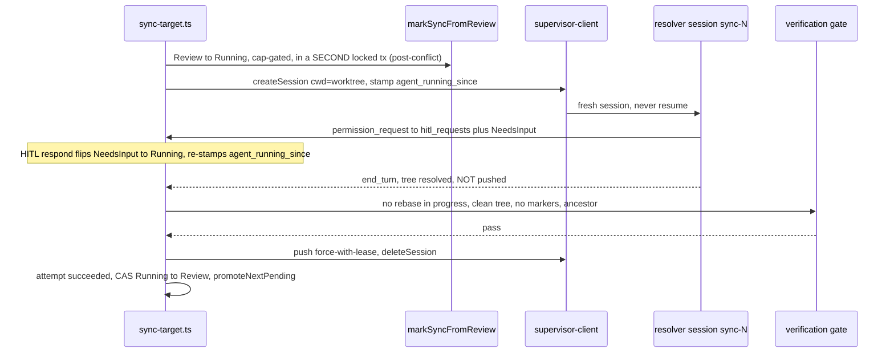
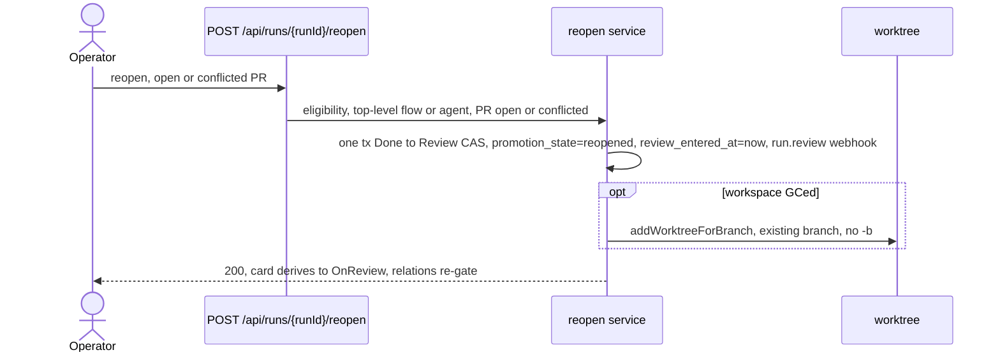
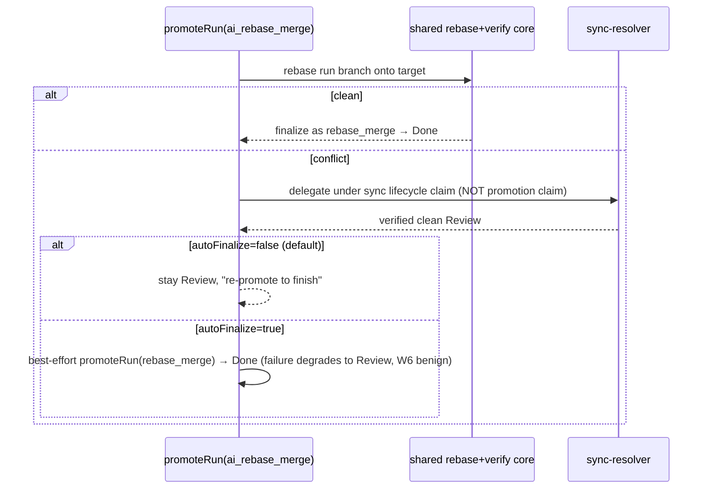

# Branch sync + AI conflict resolver

> Status: **Implemented** (ADR-140).

## Purpose

This domain owns the operator-driven **"sync with target"** operation for a
`Review` run whose branch has fallen behind its promotion target, the
**AI conflict resolver** that finishes a conflicted rebase/merge inside the run
worktree, the **reopen** path that pulls a `Done` run back to `Review` when its
PR conflicts, and the **resolver-backed `ai_rebase_merge`** promotion mode. The
boundary is the run-finishing path built on the shipped promotion substrate
(ADR-049/058/087) and delivery scanner (ADR-134); it does **not** cover PR-state
polling (that is [PR lifecycle tracking](../decisions.md#adr-139-pr-lifecycle-tracking),
ADR-139) beyond consuming the
conflict signal, and it explicitly excludes scratch runs, shared-tree runs
(`runs.workspace_mode='shared'`), experiment members, and orchestrator children
(`parent_run_id` set) in v1.

## Domain entities

- **`run_sync_attempts`** — append-only per-attempt ledger (`node_attempts`-shaped:
  single plain-`text` `phase` column, no DB CHECK), UNIQUE `(run_id, attempt)`. Persisted;
  see [runs-domain ERD](../db/runs-domain.md).
- **`workspaces` PR + claim columns** — `pr_state`/`pr_has_conflicts`/`pr_merged_at`/
  `pr_merge_commit_sha`/`pr_state_checked_at` (ADR-139) and the shared
  `lifecycle_operation_name='sync'` claim slot (ADR-140), plus
  `promotion_state='reopened'` (app-level value, no CHECK).
- **`projects.sync_strategy_default`** (`rebase`|`merge`, default `rebase`) and
  **`projects.sync_runner_id`** (nullable `text` FK → `platform_acp_runners`, ON
  DELETE SET NULL) — the resolver runner default.
- **`run_sessions` `sync-<attempt>` row** — the fresh resolver ACP session identity
  (`runs` has no session column; dropped in M42, ADR-114). Unique
  `(run_id, session_name)`.
- **`LifecycleOperationName='sync'`** — TS-only 6th lifecycle op, mutually exclusive
  with `archive|drop|exportBranch|snapshotCommit|handoffBranch`.

## State machine

Run status across an **agent-path** sync (mechanical sync never changes status).
`Review→Running` is cap-gated; the resolver may park in `NeedsInput` for HITL.



The attempt `phase` machine (durable, written **before** each side effect):



## Process flows

**Mechanical sync** (clean rebase, no agent):



**Agent resolver** (conflict path):



**Reopen** (`Done → Review`):



**Resolver-backed `ai_rebase_merge`** (decision 19):



## Expectations

- Mechanical sync on a clean-rebase branch MUST complete synchronously, update the
  behind indicator, clear the drift warning, push with `--force-with-lease` iff
  published, and leave `runs.status='Review'`.
- The local target MUST fast-forward from `origin/<target>` when FF-able; any
  divergence MUST refuse with `PRECONDITION` naming both SHAs.
- The attempt-number allocation, the `starting` row, and the `"sync"` lifecycle
  claim MUST be exactly ONE `FOR UPDATE` transaction; a concurrent double-launch
  MUST yield exactly one attempt row and a `CONFLICT` for the loser.
- The agent path's `Review→Running` CAS MUST be a SECOND locked transaction, taken
  only after the rebase has conflicted. It cannot join the claim tx: which path a
  sync takes is unknowable until the rebase runs, and a mechanical sync MUST never
  flip the run to `Running`. That tx re-checks the cap and the promotion fence
  under the same lock, so the split costs no serialization.
- While a `"sync"` claim is active, `promote/archive/drop/exportBranch/snapshotCommit/
  handoffBranch` MUST refuse, and `promoteRun` MUST refuse while a sync claim is
  active (double fence, both directions).
- The resolver session MUST be fresh (never resume), work inside the run worktree,
  and be recorded as a `run_sessions` `sync-<attempt>` row. It is **instructed** not
  to push (prompt-level, not seam-enforced in v1 — the resolver is read-write in the
  worktree); the ENFORCED push safety net is the web-side verification gate + the
  explicit-SHA `--force-with-lease`. A resolver self-push can only touch its OWN run
  branch (never the target); the bounded blast radius is documented in ADR-140.
- The verification gate MUST require: no rebase/merge in progress, clean tree,
  zero `git diff --check` conflict markers across the whole worktree, and target is
  an ancestor of the new HEAD — before any push or finalize.
- `agent=false` + conflict MUST abort cleanly, restore the pre-sync SHA, and return
  `outcome:'conflict'` with no change.
- `--force-with-lease` MUST use the run branch's remote SHA obtained via
  `git ls-remote origin refs/heads/<branch>` captured **before** the fetch (NOT
  the local `refs/remotes/origin/<branch>` tracking ref). The fetch is
  `git fetch origin` with no refspec, so it refreshes EVERY ref including
  `origin/<branch>` — a bare `--force-with-lease` issued after it would lease
  against the just-refreshed ref and pass even though the branch moved. The
  ordering (capture, THEN fetch) is the whole safety property: it is not
  incidental and must not be "optimized away". If that SHA is indeterminate while
  `pr_url` is set the push MUST refuse (never fall back to a bare lease). A lease
  rejection MUST fail the attempt (`CONFLICT`) and keep the local rebase result.
- Every sync attempt MUST be a durable `run_sync_attempts` row whose `phase` advances
  before each side effect; crash windows W1–W6 MUST each recover to a stable state by
  reconcile/sweep (W6 is a benign clean-`Review` degradation).
- The agent path MUST hold its run-kind slot while `Running` or `NeedsInput`, MUST be
  cap-gated on `Review→Running` (refuse `CONFLICT` at cap, no queue), and MUST call
  `promoteNextPending` on finalize.
- The active-time duration cap (`SYNC_ATTEMPT_MAX_MINUTES=30`) MUST measure only
  continuous `Running` time from `agent_running_since` (re-stamped on every HITL
  resume); `NeedsInput` human-wait time MUST NOT count.
- Reopen MUST flip exactly `Done→Review` for eligible top-level `flow|agent` runs with
  an open/conflicted PR, set `promotion_state='reopened'`, exclude auto-promotion, and
  re-promotion MUST reuse the SAME provider PR.

## Edge cases

- **Non-FF local target divergence** → `PRECONDITION` (both SHAs). The attempt row
  EXISTS and settles `aborted`: the claim tx mints the `starting` row before the
  fetch, and the fast-forward is what fails.
- **Dirty worktree** → `PRECONDITION` with a snapshot-commit hint — and no attempt
  row, since the dirty check runs BEFORE the claim.
- **Ineligible run** (scratch / shared / experiment member / orchestrator child /
  wrong status/kind) → `PRECONDITION`.
- **Claim lost** (promotion claiming/done, lifecycle busy, cap reached) → `CONFLICT`.
- **Supervisor down / spawn fails** → `EXECUTOR_UNAVAILABLE`; conflicted state aborted
  first; every catch after `createSession` MUST `deleteSession`.
- **Agent turn crash / non-`end_turn` stop** → `CRASH`/attempt `failed`; abort restore.
- **Verification failure** (markers, incomplete rebase, non-ancestor) → attempt
  `failed`; deterministic abort.
- **Push lease rejected** (branch moved remotely) → `CONFLICT`; local result kept.
- **W1–W6 crash windows** → recovered by reconcile/sweep per the predicate table in
  ADR-140; a sync row never enters the flow reattach/redispatch arms.
- **Duration runaway** (30 min continuous `Running`) → W5 sweep kills session, aborts,
  `failed`, returns to `Review`.

## Linked artifacts

- ADRs: [ADR-139](../decisions.md#adr-139-pr-lifecycle-tracking),
  [ADR-140](../decisions.md#adr-140-branch-sync-with-ai-conflict-resolver-and-reopen).
- API: [`web.openapi.yaml`](../api/web.openapi.yaml) (`/api/runs/{runId}/sync`,
  `/reopen`), [`operations.openapi.yaml`](../api/external/operations.openapi.yaml)
  (ext sync/reopen + run DTO fields),
  [`outbound-webhooks.asyncapi.yaml`](../api/async/outbound-webhooks.asyncapi.yaml)
  (`run.pr_merged`/`run.pr_closed`/`run.pr_conflicts`).
- ERDs: [runs-domain](../db/runs-domain.md), [scheduler-domain](../db/scheduler-domain.md).
- Related: [workspaces](workspaces.md), [git-integration](git-integration.md),
  [scheduler](scheduler.md), [workbench-lifecycle](workbench-lifecycle.md),
  [tasks](tasks.md), [external-operations](external-operations.md),
  [error taxonomy](../error-taxonomy.md).
- Source: `web/lib/runs/sync-target.ts`, `web/lib/runs/pr-adapter.ts`,
  `web/lib/runs/state-transitions.ts`, `web/lib/reconcile.ts`,
  `web/lib/scheduler/handlers/pr-state-scan.ts`, `web/lib/worktree.ts`.
```