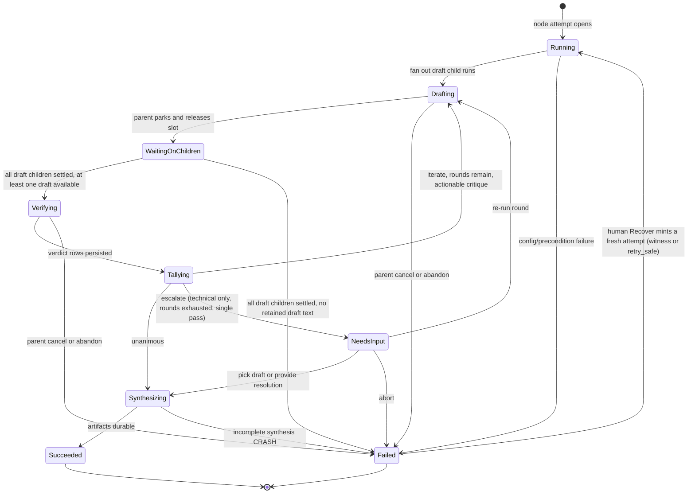
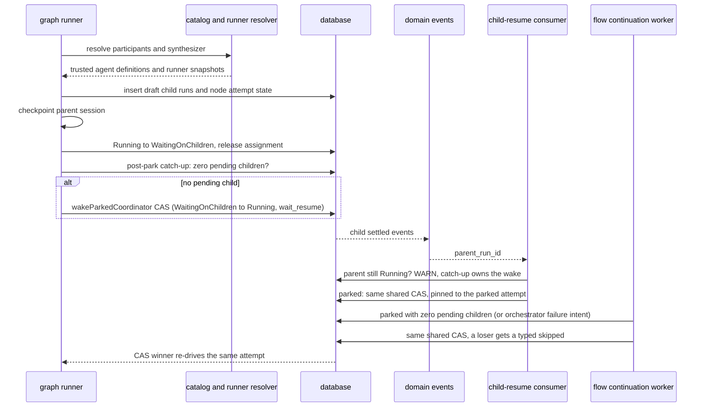
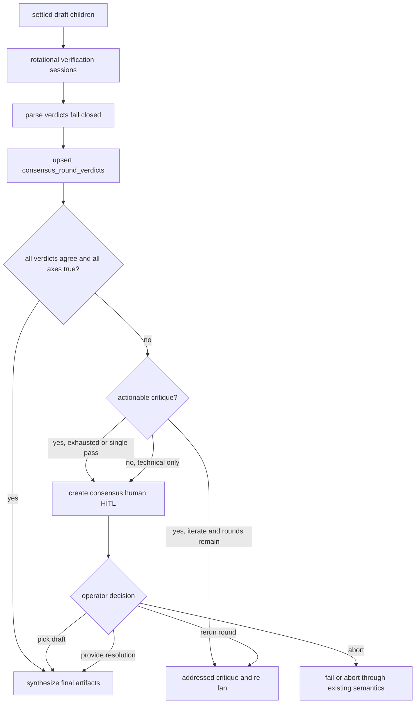
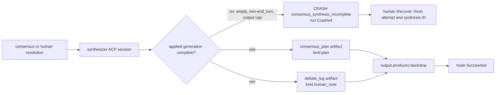

# Consensus node domain

> **Status: Implemented.** Frozen SSOT:
> [`../../.ai-factory/specs/feature-m41-consensus-node.md`](../../.ai-factory/specs/feature-m41-consensus-node.md).
> **Superseded in part (2026-09-23, P0-5 v2):** the frozen spec's "failed drafts
> are settled unavailable evidence" and "rounds re-fan with union disagreements"
> clauses (its lines on draft failure and AC5) no longer describe the engine.
> The current contract is
> [P0-5 v2 execution contract](#p0-5-v2-execution-contract-implemented) below:
> a failed draft with retained text is **partial** evidence, and a round
> re-fans only with actionable critique. Where the two disagree, this page wins.
> Decision: [ADR-109](../decisions.md#adr-109-consensus-flow-graph-node--engine-owned-unanimous-draft-verification-and-human-resolution).
>
> **ADR-114 (Implemented):** participant/synthesizer `runner` uses the unified
> `flowRunnerConfigSchema` and resolves through portable per-slot bindings
> (`consensus:<nodeId>:<participantId>` / `consensus:<nodeId>:synthesizer`), not a
> direct `platform_acp_runners.id`; identical-intent participants stay distinct
> slots. See [`sessions.md`](sessions.md) /
> [ADR-114](../decisions.md#adr-114-unified-flow-runner-config-first-class-sessions-per-project-connect-time-bindings-and-run_sessions-as-the-sole-run-runner-source-of-truth).

## Purpose

The consensus node domain owns the `consensus` flow-graph node lifecycle: fan
out read-only draft child runs, park the parent while children execute, verify
drafts through rotational in-node ACP sessions, tally unanimous agreement over
author-declared material axes, escalate no-consensus cases to human HITL, and
synthesize the final answer artifacts. It does not own the base run state
machine ([runs.md](runs.md)), generic graph traversal ([flow-graph.md](flow-graph.md)),
or the orchestrator delegation MCP toolset ([orchestrator.md](orchestrator.md)).

## Domain entities

Runner-bearing participants and the synthesizer are resolved during parent-run
admission, before its run/workspace rows or Git worktree are created. Admission
and runtime share the same resolver: explicit slot binding or concrete runner
reference, then a compatible parent-run, project, or platform default, then
intent matching. A default cannot substitute a different agent capability.
An unresolved role refuses admission with its stable slot key; the launch
preview inspects every ordinary session and consensus runner role with the same
inputs and precedence as admission, and blocks both normal and force
launch until the missing choice is resolved. Project administrators can assign
or clear each role's binding in the launch dialog; the binding is scoped to the
project and Flow revision. Agent-bound roles continue through the agent launch
resolver. Inherited parent-run choices are recorded as `runDefault` in the
child session's resolution provenance.

- **Consensus node** (Implemented) — a `type: consensus` graph node requiring
  `engine_min >= "1.9.0"`, recorded as `node_attempts.node_type = consensus`.
- **Participant** (Implemented) — ordered config entry with stable `id` and exactly
  one of `agent` or `runner`; resolved at launch through agent definition or
  runner resolution.
- **Draft child run** (Implemented) — governed `run_kind = agent` child row with
  `parent_run_id`, `root_run_id`, `delegation_snapshot`, `runner_snapshot`, and
  `launch_mode` populated by server code. Its draft prompt is one owned
  `consensus_draft` agent turn, so the draft artifact and the child's completion
  are applied from the durable command output rather than a live consumer stack
  (see [prompt lifecycle](execution-prompt-lifecycle.md#consensus-draft-agent-turn-implemented)).
- **Consensus round** (Implemented) — one draft fan-out plus one rotational
  cross-verification pass.
- **Consensus verdict** (Implemented) — parsed verifier output for one
  verifier-target pair in one round.
- **`consensus_round_verdicts`** (Implemented) — verdict ledger table keyed by
  `(node_attempt_id, round, verifier_key, target_key)`.
- **Consensus HITL** (Implemented) — existing `human` HITL kind with a consensus
  schema discriminator and server-derived decision allow-list.
- **Consensus artifacts** (Implemented) — current `consensus_plan` (`kind = plan`)
  and current `debate_log` (`kind = human_note`).
- **Engine evidence artifacts** (Implemented, P0-5 v2) — agent output:
  drafts (`default:consensus-draft`), raw verifier output
  (`default:consensus-verdict`) and synthesis generations
  (`default:consensus-synthesis`), served only with `readRepoFiles`
  (`consensus/artifact-defs.ts`); HITL evidence: the round debate
  (`consensus-round-debate`, `human_note`, never `requiredFor`); bookkeeping:
  input evidence (`default:consensus-input`) and rerun intent/applied markers
  (`consensus-human-intent`, `consensus-human-intent-applied`), all `kind = log`.
  Every id is deterministic and written insert-if-absent with a compare on
  replay; see [database schema](../database-schema.md).

## State machine

The consensus execution axis lives inside a normal graph node attempt and uses
the existing parent run statuses.

## Process flows

### Fan out, park, and resume

### Verify, tally, and escalate

### Synthesis and artifacts

## Expectations

- A `consensus` node MUST require `engine_min >= "1.9.0"` and MUST fail load
  with `MaisterError("CONFIG")` when the floor is missing.
- `participants[]` MUST contain at least 2 and at most
  `MAISTER_MAX_ORCHESTRATOR_FANOUT` entries, each with exactly one of `agent` or
  `runner`.
- The node `prompt` MUST be rendered against the parent run's template
  context (strict, as `action.prompt`, including `{{ artifacts.<id>.content }}`
  bodies) before any draft child is launched; an unknown variable MUST fail
  the node with `MaisterError("CONFIG")` without creating a draft child
  (engine `3.8.0`; earlier engines forwarded the prompt literally).
- Verifier and synthesizer prompts MUST carry agent-authored text — draft
  excerpts, verdict claims, the debate ledger, a human resolution — and the
  rendered node prompt as template values (`consensus.*`), never spliced into
  the template string, so Mustache braces inside a draft cannot fail the node.
  Enforcement: `verifierPrompt()` and `synthesisPrompt()` take no arguments,
  and `FlowContext.consensus` is the reserved value namespace.
- Consensus draft children MUST be durable read-only child runs before the
  parent enters `WaitingOnChildren`.
- A consensus parent MUST wake only after every draft child in the current round
  reaches a settled state.
- A failed draft child with retained text MUST be treated as settled partial
  evidence; without retained text it is unavailable. Parent cancellation or
  abandon prevents further round work. A settled round with no draft text at
  all MUST fail the node attempt with `MaisterError("CRASH")`
  (`details.reason = "consensus_no_draft_available"`, carrying each child's
  status and terminal reason) instead of verifying fail-closed over nothing,
  iterating, or escalating to a human.
- Draft children MUST be dispatched on the root database handle, never the
  parent's traversal handle: the parent releases its execution assignment when
  it parks, after which every traversal-scoped statement refuses with
  `flow_driver_claim_lost` — before the child's session exists. Only the
  fan-out's own rows (child `runs`/`run_sessions`, `tryStartRun`) stay on the
  traversal handle. A consensus graph is an owned-prompt graph and takes the
  fenced driver path like `ai_coding`/`judge`/`orchestrator` graphs.
- Cross-verification MUST rotate as `i audits (i + 1) mod N` and MUST persist
  one idempotent verdict row per verifier-target pair, owned by the matrix cell
  it was paid for
  (see [prompt lifecycle](execution-prompt-lifecycle.md#consensus-verifier-matrix-cell-implemented)).
- A settled verification or synthesis turn whose owner application is deferred
  MUST yield with `flow_prompt_continuation_pending`. If the owned wait returns
  before its applied generation is visible, `consensus_generation_pending`
  MUST also yield. Neither case is a fail-closed disagreement or empty plan.
- Malformed verifier output MUST fail closed into a persisted disagree verdict,
  not throw away the node lifecycle.
- A draft child MUST publish its artifact and settle only from its own verified
  command output; an incomplete or empty draft turn MUST fail the child instead
  of recording an empty successful draft.
- The tally MUST be unanimous over every verifier verdict and every declared
  `material_axes` boolean.
- No-consensus v1 MUST escalate through the existing HITL respond route with
  server-derived decisions and bounded context.
- Synthesis MUST write current `consensus_plan` and `debate_log` artifacts
  before the node transitions success, from its own applied generation output.
- Consensus UI surfaces MUST use the existing Flow Studio, read-only graph,
  inbox, run-detail, and workbench patterns with EN/RU parity.
- Consensus runtime logs MUST use structured fields and MUST NOT include prompt
  bodies, draft bodies, free-form human resolution text, or artifact bodies.

### P0-5 v2 execution contract (Implemented)

Each item names what enforces it (code under `web/lib/flows/graph/consensus/`
unless stated) and the test that proves it (`consensus-prompt-owners` =
`web/lib/flows/graph/__tests__/consensus-prompt-owners.integration.test.ts`,
`orchestrator-park` = `web/lib/flows/graph/__tests__/orchestrator-park.integration.test.ts`).

1. Draft owner retains at most 1,048,576 UTF-8 bytes. A successful non-`end_turn`
   turn with non-empty text is a **partial** draft artifact with `partial: true`,
   actual `stopReason` and `consensus_draft_incomplete` child failure. Output-cap
   loss is partial even when the host says `end_turn`
   (`reason: output_cap_exceeded` plus `truncated`/`textBounds`). No text is
   **unavailable**; a successful `end_turn` with non-empty, unlost text is
   **complete**. Historical successful non-empty artifacts remain complete;
   missing historical text is unavailable. A partial is never verified or
   counted as agreeing. Enforcement: `draft-prompt-owner.ts`
   (`prepareConsensusDraftPrompt`), classification in `ledger.ts`
   (`loadConsensusDraftEvidence` via `locator-meta.ts`). Test:
   consensus-prompt-owners "max_tokens drafts remain partial evidence…".
2. A partial or unavailable target gets an immutable, unpaid fail-closed cell
   `draft_partial` or `draft_unavailable`; the verifier is never admitted.
   `runVerifier` refuses a non-complete target as a `CRASH` invariant
   (`consensus_verifier_target_not_complete`) before taking capacity. A round
   of only partial drafts iterates or escalates; only a round with **no text**
   crashes `consensus_no_draft_available`. Cancellation or abandon stops both
   through the fenced driver. Enforcement: `runtime.ts` `verifyConsensusRound`
   / `noDraftAvailableError`. Tests: consensus-prompt-owners "max_tokens
   drafts…" (zero verifier commands), "all-partial drafts spend a drafter
   round…".
3. The engine appends this fixed trailer after rendering the author prompt:
   “Return the complete draft as your final message text. File writes are
   refused in this workspace. Do not reference files as the deliverable.
   Include the full draft in the final message, even when revising a previous
   draft.” Agent text, previous text and the trailer enter static engine
   templates as `consensus.*` values, never as template source. Enforcement:
   `critique.ts` `consensusDraftTrailer`, `runtime.ts` `draftPrompt` /
   `withConsensusVars`. Test: `consensus/__tests__/runtime.test.ts` trailer and
   literal-brace cases.
4. Full retained draft text is read from its artifact. One named
   `CONSENSUS_PROMPT_TEXT_CAP_BYTES = 65,536` UTF-8-byte bound covers each
   verifier `target_draft`, synthesis `selected_text`, published `planText`,
   and participant prior draft, each bounded exactly once. It includes the
   marker `\n[consensus text truncated: dropped <N> UTF-8 bytes; cap <C> bytes]`,
   reports exact dropped original bytes, cuts on a Unicode code-point boundary,
   and carries a structured `truncated` flag and artifact ref beside the text.
   A structured WARN `consensus-text-truncated` records `runId`,
   `nodeAttemptId`, role, participantId, round, generation id where one
   exists, original bytes, cap and dropped bytes; no body is logged. This is an
   engine allocation, not a guarantee for arbitrary configurable models or
   unbounded author base prompts. HITL excerpts remain bounded (32,000 bytes)
   and labeled under ADR-109, with a resolvable full-text artifact ref.
   Enforcement: `text.ts` `boundConsensusText`, `bounded-log.ts`
   `boundLoggedConsensusText`. Tests: `consensus/__tests__/text.test.ts`
   (cap−1/cap/cap+1 table, forged marker), consensus-prompt-owners
   "over-bound target is labeled…".
5. Verifier and synthesis output accumulate up to 1 MiB before parsing. A
   verifier whose complete final JSON follows >32,000 bytes of reasoning is
   parsed from the retained whole. Output-cap overflow is technical fail-closed
   `output_cap_exceeded`, even if the retained prefix contains valid
   agreement. Raw-output artifacts hold 32,000-byte excerpts, marked as such;
   their `textBounds` also count bytes lost past the 1 MiB budget. A debate log
   bounds its **fields** before JSON serialization; serialized JSON is never
   sliced. Enforcement: `prompt-owner.ts` `consensusTurnVerdict`, `ledger.ts`
   `writeConsensusVerdict`, `runtime.ts` `compactDebateLogText`. Tests:
   `consensus/__tests__/turn-verdict.test.ts` (a valid prefix still fails
   closed), consensus-prompt-owners "full 60 kB drafts…", "verifier output
   past 1 MiB…".
6. Round N+1 gives each participant, after the once-rendered base prompt:
   (a) the verdict addressed to its own prior draft, including parsed material
   rows and each false declared axis with verifier identity, or a drafter-side
   partial/unavailable engine reason; (b) its own prior draft in its **own**
   65,536-byte slot; (c) union parsed rows (12 displayed) and failed declared
   axes (12 displayed, manifest order); (d) separately labeled technical
   verifier notes; (e) the fixed trailer. Sections (a), (c) and (d) share
   **one** 65,536-byte budget spent in that order, so a long union can never
   crowd out the verdict a participant must answer; a section left below 512
   bytes reads "Omitted to fit the prompt budget". Row fields are cut at 1,024
   bytes and labels at 256. Omitted counts and ledger refs preserve full
   evidence. No other participant's draft body appears in this prompt.
   Enforcement: `critique.ts` `composeConsensusRoundCritique` / `budgeted`.
   Test: `consensus/__tests__/critique.test.ts`.
7. `hasActionableCritique` is computed from the **full parsed** round before
   display bounds: a non-empty material row, a false declared axis in a parsed
   verdict, or a drafter-side partial/unavailable reason. Synthetic false axes
   from fail-closed verifier cells are not content critique. When disagreement
   has no actionable critique, all failure is verifier-side technical: escalate
   directly to HITL with `technicalFailures[]` and
   `escalationReason: technical_only`, regardless of rounds remaining (WARN
   `consensus-technical-only-escalation`). Drafter-side reasons alone can
   re-fan. A parsed `disagree` with all true axes and no rows is
   `invalid_schema/empty_disagreement`. Cells remain immutable; there is no
   in-place re-verification. Enforcement: `critique.ts`
   `hasActionableConsensusCritique`, `verdict.ts` `parseConsensusVerdict`,
   `runtime.ts` `runConsensusNode`. Tests: `critique.test.ts`,
   `verdict.test.ts`, consensus-prompt-owners "verifier-only invalid JSON
   escalates…".
8. A human `re-run-round` explicitly spends a new round with the addressed
   verdict, own prior draft, union and technical notes from the **pinned source
   HITL request round**, not an empty critique or a guessed latest round. Only a
   rerun resolves the delivered request (`resolveConsensusHumanRequest`); a
   legacy request without `nodeAttemptId` counts only if it was created during
   the current attempt's lifetime. A pick or resolution acts on the latest
   round, which is the pending HITL's round. The rerun freezes an intent
   artifact (`run:<attempt>:consensus-human-intent:<hitl>`) before fan-out and
   an applied marker (`…:applied`) after it; repeat delivery and crash replay
   adopt the same deterministic target-round children, including a partial
   fan-out, and never create N+2. Enforcement: `human-decision.ts`,
   `drafts.ts` `launchConsensusDraftRuns` (existing-child adoption). Test:
   consensus-prompt-owners "a rerun that dies before its applied marker adopts
   its round on replay" (real process death).
9. HITL preserves every participant slot and its `pick-draft-N` index; each
   draft carries `slot`, `classification`, optional `stopReason`/`reason`, an
   `excerpt` only when text exists (with `excerptBounds` when cut) and
   `artifactRef`/`artifactRunId` only when the artifact exists. The server sends
   no English `label` or "unavailable" text; the card localizes both. The
   schema also carries `nodeAttemptId`, `escalationReason`
   (`technical_only | rounds_exhausted | single_pass`), `technicalFailures[]`
   (verifier/target/parse status/error code plus the target's `targetSlot`),
   disagreement `axis`/`summary` bounded to 256/1,024 bytes, and a debate
   excerpt with `excerptBounds`. Complete and partial drafts are pickable, with
   partial cause; unavailable slots are disabled. Draft payload links use child
   run IDs and require `readRepoFiles` (inline consensus agent output — see
   `artifact-defs.ts` — is repository-class data); the card hides the draft
   link from readers without it. Debate payload links use the parent run ID and
   stay `readBoard`. The server rejects a pick whose stored classification is
   `unavailable`, including a legacy choice without its own `decision` (matched
   by position); `partial` and legacy unclassified choices remain pickable.
   The writer, the validator and the card share one decoder,
   `web/lib/flows/consensus-resolution.ts`. The HITL request id is derived
   from `(attempt, round)` and created with `createHitlRequestIfAbsent`, so a
   replay after the HITL transaction committed adopts the same request; the
   round-debate artifact is compared on replay and is HITL evidence, never
   `requiredFor: review`. Enforcement: `runtime.ts` `hitlSchema` /
   `createConsensusHitl`, `web/lib/flows/hitl-validate.ts`, the payload route
   `web/app/api/runs/[runId]/artifacts/[artifactId]/payload/route.ts`. Tests:
   consensus-prompt-owners "a HITL creation replayed after its commit adopts
   the same request and evidence", "HITL disagreement summaries stay
   bounded…", `web/lib/flows/__tests__/hitl-validate.test.ts`,
   `web/lib/flows/__tests__/consensus-resolution.test.ts`, the payload route
   test.
10. Once a verifier or synthesis turn has settled, a deferred owner application
    makes its dedicated owned prompt wait return a pending outcome. The driver
    yields with `flow_prompt_continuation_pending` while the node stays Running.
    If the consensus runtime returns without the applied cell/generation,
    `ConsensusGenerationPending` also passes both graph catches as a yield.
    A **superseded** command is settled, not pending (its immutable result
    already exists under another writer) and the runtime reads that result; a
    poisoned command keeps yielding and ADR-177 reconcile crashes the run.
    Re-entry adopts the existing logical prompt command, never buys another
    turn, and closes its exact applied host session before consuming the cached
    cell or synthesis. The runtime's own unpaid fail-closed verdict write loses
    to an already-applied cell and returns the stored cell. Enforcement:
    `web/lib/flows/graph/prompt-owner.ts` `waitForConsensusApplication`,
    `web/lib/flows/runner-agent.ts` `reattachConsensusPrompt`, `ledger.ts`
    `recordConsensusVerdict`. Tests:
    `web/lib/flows/graph/__tests__/consensus-application-wait.test.ts`,
    consensus-prompt-owners "delayed verifier/synthesis application…",
    "poisoned verifier application…", "a recorded cell cannot be rewritten or
    re-applied" (layer 3), `web/lib/workers/__tests__/production-registry.test.ts`
    (boot serves these exact owners).
11. After either coordinator kind parks, one shared pending-child predicate and
    CAS wake checks for child settlement that arrived before the park. A failed
    orchestrator child arms `runs.failed_child_wake_at` in its terminal-event
    transaction when the parent is `Running`, `NeedsInput`, `NeedsInputIdle` or
    `WaitingOnChildren` on an orchestrator node, so the parent wakes even with
    a pending sibling; consensus still waits for every child. The intent is
    cleared when the coordinator's turn starts (a resumed orchestrator attempt
    or a new node attempt), so a rolled-back wake keeps it. It is **not**
    `resume_requested_at`, which C3 admission reads as "HITL answered" and
    which keeps only its capacity-deferral meaning here. A Running parent on an
    early settled-child event emits a WARN. The continuation worker selects a
    parked coordinator with this intent or zero pending children and calls the
    same wake helper; event, catch-up and worker race to a single CAS winner,
    losers get a typed `skipped`, and a stale attempt or terminal parent is a
    no-op. Enforcement: `web/lib/domain-events/coordinator-wake-intent.ts`,
    `web/lib/domain-events/outbox.ts`, `web/lib/flows/graph/coordinator-wake.ts`,
    `web/lib/flows/runner.ts`, `web/lib/flows/graph/continuation-worker.ts`,
    `markResumedFromWait` (`expectedCoordinator`). Tests: orchestrator-park
    (failed-child intent while the coordinator waits on its own HITL; kept out
    of C3 admission; early and late settlement; single CAS winner; rebound
    orchestrator and consensus; stale attempt and terminal parent),
    `web/lib/domain-events/__tests__/orchestrator-resume-early-settle.test.ts`.
12. Applied empty or non-`end_turn` synthesis retains partial generation text
    and its stop reason and fails the node as `CRASH` with
    `details.reason = consensus_synthesis_incomplete`, `stopReason` and
    `synthesisId`. The stop reason is the host's own value; the engine writes
    `host_failure` for a failed host turn and `stop_reason_unavailable` when the
    host settled without one (`text.ts` `consensusTurnStopReason`, shared by
    the draft and synthesis owners). Recover follows `classifyRecover`
    (`web/lib/runs/recover-classify.ts`): a quarantined terminal conflict on the
    latest attempt's consensus commands refuses any re-run; the latest
    attempt's matching applied incomplete-synthesis witness redispatches even
    with `retry_safe: false`; otherwise the node keeps the session-less
    `retry_safe` rule. Redispatch creates a fresh attempt and synthesis ID. No
    run-level error column is added. Enforcement: `runtime.ts`
    `completedSynthesisText` (both paths), `recovery-evidence.ts`,
    `recover-classify.ts`. Tests: consensus-prompt-owners "incomplete synthesis
    keeps its text and Recover mints a fresh generation" (mismatched, missing,
    quarantined and stale witness controls), "an empty end_turn synthesis…",
    `web/lib/runs/__tests__/recover-classify.test.ts`.
13. All new flags ride existing versioned JSON and legacy readers; verdict
    rows retain their `(attempt, round, verifier, target)` uniqueness. The one
    schema change is the nullable `runs.failed_child_wake_at` (migration 0175,
    item 11). No owner-ref key, supervisor contract, DSL version or table is
    added. Text-bound metadata is pinned before prompt enqueue. Its UTF-16 value
    span is the slot's own position, located by rendering the static template
    with a sentinel in that slot; owner application checks that slice's digest,
    prompt digest and byte/marker accounting on replay without storing a second
    full draft. Stored locator metadata is decoded by `locator-meta.ts`
    (malformed bounds are dropped, never trusted); a version-1 disagreement
    envelope is validated field by field. Enforcement: `input-evidence.ts`,
    `locator-meta.ts`, `ledger.ts` `normalizeDisagreements`. Tests:
    consensus-prompt-owners "over-bound target…",
    `consensus/__tests__/locator-meta.test.ts`,
    `web/lib/db/__tests__/schema.integration.test.ts`.

## Edge cases

- **Invalid config** — too few participants, too many participants, empty axes,
  missing synthesizer, missing mandatory outputs, writable draft workspace, or
  engine floor below `1.9.0` fail as `MaisterError("CONFIG")`.
- **Stale participant or synthesizer** — a ref that parses but is no longer
  trusted or resolvable at launch fails as `MaisterError("PRECONDITION")`.
- **Draft child failure** — a failed child with retained partial text remains
  partial evidence; a child without retained text is unavailable. The parent
  waits for sibling drafts before iterate/escalate. When every draft of the
  round is unavailable the node fails `CRASH` with the children's terminal
  reasons (read from their `run.failed` / `run.crashed` / `run.abandoned`
  domain events); nothing is verified and no HITL is created.
- **Verifier malformed output** — invalid JSON, unknown axes, missing axes, and
  invalid disagreement rows persist as failed-closed disagree verdicts.
- **Capacity unavailable** — participant, verifier, or synthesizer admission
  failure uses existing queue/admission behavior or
  `MaisterError("EXECUTOR_UNAVAILABLE")`.
- **Duplicate HITL response** — a repeated or already-delivered response is
  idempotent; if the run remains `NeedsInput`, the response path schedules
  runner re-drive.
- **Resume race** — a child-settled event, the post-park catch-up and the
  continuation worker racing to wake the parent converge on one
  `markResumedFromWait` CAS pinned to the parked attempt; losers return a typed
  `{ kind: "skipped" }`, never an error and never a second re-drive.
- **HITL replay** — a driver that dies after the consensus HITL transaction
  committed but before the node parked re-enters, re-derives the same request
  id and debate text, and adopts the existing request; a debate that differs
  refuses `CONFLICT` (`consensus_round_debate_changed`).
- **Partial artifact write** — a failure after writing only one required artifact
  leaves the node resumable and not successful.

## Linked artifacts

- Decision: [ADR-109](../decisions.md#adr-109-consensus-flow-graph-node--engine-owned-unanimous-draft-verification-and-human-resolution).
- Spec: [`../../.ai-factory/specs/feature-m41-consensus-node.md`](../../.ai-factory/specs/feature-m41-consensus-node.md).
- DSL/config: [`../flow-dsl.md`](../flow-dsl.md), [`../configuration.md`](../configuration.md).
- Graph/runtime domains: [`flow-graph.md`](flow-graph.md), [`orchestrator.md`](orchestrator.md),
  [`hitl.md`](hitl.md), [`runs.md`](runs.md), [`scheduler.md`](scheduler.md),
  [`artifacts.md`](artifacts.md).
- DB docs: [`../database-schema.md`](../database-schema.md),
  [`../db/runs-domain.md`](../db/runs-domain.md).
- Screen docs: [`../screens/studio/editor.md`](../screens/studio/editor.md),
  [`../screens/runs/flow-run.md`](../screens/runs/flow-run.md),
  [`../screens/inbox.md`](../screens/inbox.md),
  [`../screens/runs/workbench.md`](../screens/runs/workbench.md).
- Source: `web/lib/flows/graph/runner-graph.ts`,
  `web/lib/flows/graph/consensus/*` (`runtime.ts`, `ledger.ts`, `drafts.ts`,
  `prompt-owner.ts`, `draft-prompt-owner.ts`, `text.ts`, `critique.ts`,
  `bounded-log.ts`, `locator-meta.ts`, `digest.ts`, `artifact-defs.ts`,
  `input-evidence.ts`, `human-decision.ts`, `recovery-evidence.ts`,
  `verdict.ts`, `tally.ts`), `web/lib/flows/graph/coordinator-wake.ts`,
  `web/lib/domain-events/coordinator-wake-intent.ts`,
  `web/lib/domain-events/orchestrator-resume.ts`,
  `web/lib/flows/graph/continuation-worker.ts`,
  `web/lib/flows/consensus-resolution.ts`, `web/lib/services/hitl.ts`,
  `web/lib/flows/hitl-validate.ts`, `web/lib/runs/recover-classify.ts`,
  `web/lib/db/schema.ts`.
