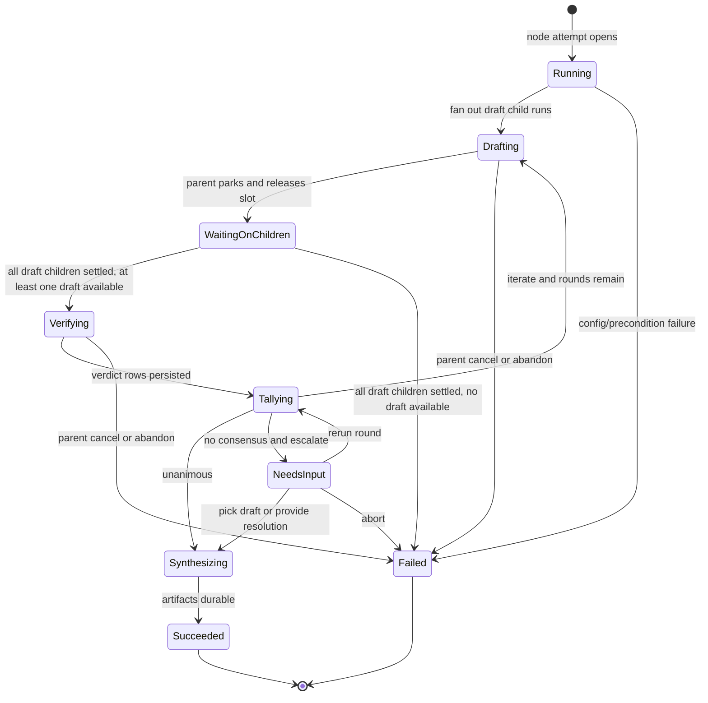
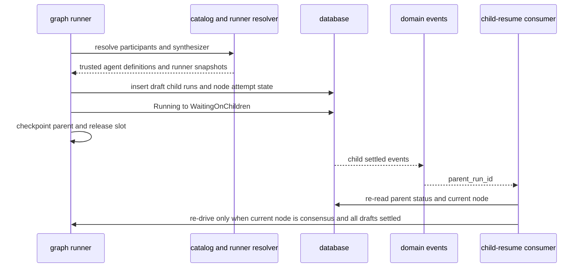
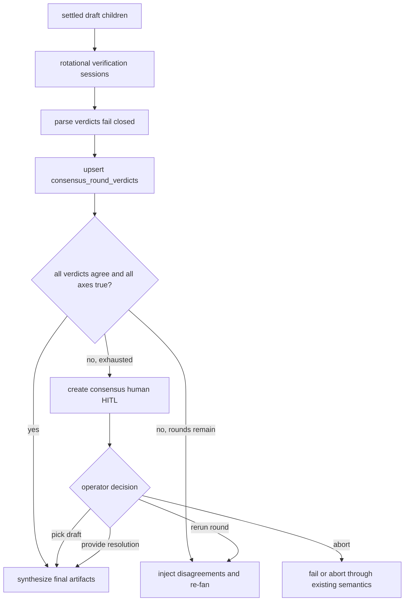
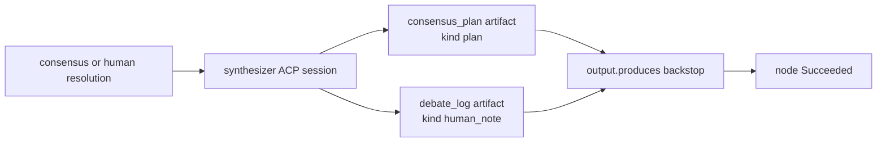

# Consensus node domain

> **Status: Implemented.** Frozen SSOT:
> [`../../.ai-factory/specs/feature-m41-consensus-node.md`](../../.ai-factory/specs/feature-m41-consensus-node.md).
> Decision: [ADR-109](../decisions.md#adr-109-consensus-flow-graph-node--engine-owned-unanimous-draft-verification-and-human-resolution).
>
> **ADR-114 (Implemented):** participant/synthesizer `runner` uses the unified
> `flowRunnerConfigSchema` and resolves through portable per-slot bindings
> (`consensus:<nodeId>:<participantId>` / `consensus:<nodeId>:synthesizer`), not a
> direct `platform_acp_runners.id`; identical-intent participants stay distinct
> slots. See [`sessions.md`](sessions.md) /
> [ADR-114](../decisions.md#adr-114-unified-flow-runner-config-first-class-sessions-per-project-connect-time-bindings-and-run_sessions-as-the-sole-run-runner-source-of-truth).

## Purpose

The consensus node domain owns the `consensus` flow-graph node lifecycle: fan
out read-only draft child runs, park the parent while children execute, verify
drafts through rotational in-node ACP sessions, tally unanimous agreement over
author-declared material axes, escalate no-consensus cases to human HITL, and
synthesize the final answer artifacts. It does not own the base run state
machine ([runs.md](runs.md)), generic graph traversal ([flow-graph.md](flow-graph.md)),
or the orchestrator delegation MCP toolset ([orchestrator.md](orchestrator.md)).

## Domain entities

Runner-bearing participants and the synthesizer are resolved during parent-run
admission, before its run/workspace rows or Git worktree are created. Admission
and runtime share the same resolver: explicit slot binding or concrete runner
reference, then a compatible parent-run, project, or platform default, then
intent matching. A default cannot substitute a different agent capability.
An unresolved role refuses admission with its stable slot key; the launch
preview inspects every ordinary session and consensus runner role with the same
inputs and precedence as admission, and blocks both normal and force
launch until the missing choice is resolved. Project administrators can assign
or clear each role's binding in the launch dialog; the binding is scoped to the
project and Flow revision. Agent-bound roles continue through the agent launch
resolver. Inherited parent-run choices are recorded as `runDefault` in the
child session's resolution provenance.

- **Consensus node** (Implemented) — a `type: consensus` graph node requiring
  `engine_min >= "1.9.0"`, recorded as `node_attempts.node_type = consensus`.
- **Participant** (Implemented) — ordered config entry with stable `id` and exactly
  one of `agent` or `runner`; resolved at launch through agent definition or
  runner resolution.
- **Draft child run** (Implemented) — governed `run_kind = agent` child row with
  `parent_run_id`, `root_run_id`, `delegation_snapshot`, `runner_snapshot`, and
  `launch_mode` populated by server code. Its draft prompt is one owned
  `consensus_draft` agent turn, so the draft artifact and the child's completion
  are applied from the durable command output rather than a live consumer stack
  (see [prompt lifecycle](execution-prompt-lifecycle.md#consensus-draft-agent-turn-implemented)).
- **Consensus round** (Implemented) — one draft fan-out plus one rotational
  cross-verification pass.
- **Consensus verdict** (Implemented) — parsed verifier output for one
  verifier-target pair in one round.
- **`consensus_round_verdicts`** (Implemented) — verdict ledger table keyed by
  `(node_attempt_id, round, verifier_key, target_key)`.
- **Consensus HITL** (Implemented) — existing `human` HITL kind with a consensus
  schema discriminator and server-derived decision allow-list.
- **Consensus artifacts** (Implemented) — current `consensus_plan` (`kind = plan`)
  and current `debate_log` (`kind = human_note`).

## State machine

The consensus execution axis lives inside a normal graph node attempt and uses
the existing parent run statuses.

## Process flows

### Fan out, park, and resume

### Verify, tally, and escalate

### Synthesis and artifacts

## Expectations

- A `consensus` node MUST require `engine_min >= "1.9.0"` and MUST fail load
  with `MaisterError("CONFIG")` when the floor is missing.
- `participants[]` MUST contain at least 2 and at most
  `MAISTER_MAX_ORCHESTRATOR_FANOUT` entries, each with exactly one of `agent` or
  `runner`.
- The node `prompt` MUST be rendered against the parent run's template
  context (strict, as `action.prompt`, including `{{ artifacts.<id>.content }}`
  bodies) before any draft child is launched; an unknown variable MUST fail
  the node with `MaisterError("CONFIG")` without creating a draft child
  (engine `3.8.0`; earlier engines forwarded the prompt literally).
- Verifier and synthesizer prompts MUST carry agent-authored text — draft
  excerpts, verdict claims, the debate ledger, a human resolution — and the
  rendered node prompt as template values (`consensus.*`), never spliced into
  the template string, so Mustache braces inside a draft cannot fail the node.
  Enforcement: `verifierPrompt()` and `synthesisPrompt()` take no arguments,
  and `FlowContext.consensus` is the reserved value namespace.
- Consensus draft children MUST be durable read-only child runs before the
  parent enters `WaitingOnChildren`.
- A consensus parent MUST wake only after every draft child in the current round
  reaches a settled state.
- A failed draft child MUST be treated as settled unavailable evidence unless
  parent cancellation or abandon is active. A settled round with NO available
  draft (no `Done` child with draft text) MUST fail the node attempt with
  `MaisterError("CRASH")` (`details.reason = "consensus_no_draft_available"`,
  carrying each child's status and terminal reason) instead of verifying
  fail-closed over nothing, iterating, or escalating to a human.
- Draft children MUST be dispatched on the root database handle, never the
  parent's traversal handle: the parent releases its execution assignment when
  it parks, after which every traversal-scoped statement refuses with
  `flow_driver_claim_lost` — before the child's session exists. Only the
  fan-out's own rows (child `runs`/`run_sessions`, `tryStartRun`) stay on the
  traversal handle. A consensus graph is an owned-prompt graph and takes the
  fenced driver path like `ai_coding`/`judge`/`orchestrator` graphs.
- Cross-verification MUST rotate as `i audits (i + 1) mod N` and MUST persist
  one idempotent verdict row per verifier-target pair, owned by the matrix cell
  it was paid for
  (see [prompt lifecycle](execution-prompt-lifecycle.md#consensus-verifier-matrix-cell-implemented)).
- A verification or synthesis turn whose owner application is still pending MUST
  refuse with `consensus_generation_pending`; it MUST NOT be recorded as a
  fail-closed disagreement or an empty plan.
- Malformed verifier output MUST fail closed into a persisted disagree verdict,
  not throw away the node lifecycle.
- A draft child MUST publish its artifact and settle only from its own verified
  command output; an incomplete or empty draft turn MUST fail the child instead
  of recording an empty successful draft.
- The tally MUST be unanimous over every verifier verdict and every declared
  `material_axes` boolean.
- No-consensus v1 MUST escalate through the existing HITL respond route with
  server-derived decisions and bounded context.
- Synthesis MUST write current `consensus_plan` and `debate_log` artifacts
  before the node transitions success, from its own applied generation output.
- Consensus UI surfaces MUST use the existing Flow Studio, read-only graph,
  inbox, run-detail, and workbench patterns with EN/RU parity.
- Consensus runtime logs MUST use structured fields and MUST NOT include prompt
  bodies, draft bodies, free-form human resolution text, or artifact bodies.

### P0-5 v2 execution contract (Designed; acceptance before Implemented)

1. Draft owner retains at most 1,048,576 UTF-8 bytes. A successful non-`end_turn`
   turn with non-empty text is a **partial** draft artifact with `partial: true`,
   actual `stopReason` and `consensus_draft_incomplete` child failure. Output-cap
   loss is partial even when the host says `end_turn`. No text is **unavailable**;
   a successful `end_turn` with non-empty, unlost text is **complete**. Historical
   successful non-empty artifacts remain complete; missing historical text is
   unavailable. A partial is never verified or counted as agreeing.
2. A partial or unavailable target gets an immutable, unpaid fail-closed cell
   `draft_partial` or `draft_unavailable`. The verifier is not admitted. A round
   of only partial drafts iterates or escalates; only a round with **no text**
   crashes `consensus_no_draft_available`. Cancellation or abandon stops both.
3. The engine appends this fixed trailer after rendering the author prompt:
   “Return the complete draft as your final message text. File writes are
   refused in this workspace. Do not reference files as the deliverable.
   Include the full draft in the final message, even when revising a previous
   draft.” Agent text, previous text and the trailer enter static engine
   templates as `consensus.*` values, never as template source.
4. Full retained draft text is read from its artifact. One named
   `CONSENSUS_PROMPT_TEXT_CAP_BYTES = 65,536` UTF-8-byte bound covers each
   verifier `target_draft`, synthesis `selected_text` and published `planText`,
   and participant prior draft. It includes the marker:
   `\n[consensus text truncated: dropped <N> UTF-8 bytes; cap <C> bytes]`.
   The marker reports exact dropped original bytes, cuts on a Unicode code-point
   boundary, and carries a structured `truncated` flag and artifact ref beside
   the text. A structured WARN `consensus-text-truncated` records role,
   participantId, round, original bytes, cap and dropped bytes; no body is logged.
   This is an engine allocation, not a guarantee for arbitrary configurable
   models or unbounded author base prompts. The qualified runner context must
   be checked against the rendered prompt. HITL excerpts remain bounded and
   labeled under ADR-109, with a resolvable full-text artifact ref.
5. Verifier and synthesis output accumulate up to 1 MiB before parsing. A
   verifier whose complete final JSON follows >32,000 bytes of reasoning is
   parsed from the retained whole. Output-cap overflow is technical fail-closed,
   even if the prefix contains valid agreement. Raw-output artifacts may hold
   excerpts, marked as such. A debate log bounds its **fields** before JSON
   serialization; serialized JSON is never sliced.
6. Round N+1 gives each participant, after the once-rendered base prompt:
   (a) the verdict addressed to its own prior draft, including parsed material
   rows and each false declared axis with verifier identity, or a drafter-side
   partial/unavailable engine reason; (b) its own prior draft under the same
   65,536-byte bound; (c) union parsed rows (12 displayed) and failed declared
   axes (12 displayed, manifest order); (d) separately labeled technical
   verifier notes; (e) the fixed trailer. Addressed rows/axes use the same
   bounds. Omitted counts and ledger refs preserve full evidence. No other
   participant's draft body appears in this prompt.
7. `hasActionableCritique` is computed from the **full parsed** round before
   display bounds: a non-empty material row, a false declared axis in a parsed
   verdict, or a drafter-side partial/unavailable reason. Synthetic false axes
   from fail-closed verifier cells are not content critique. When disagreement
   has no actionable critique, all failure is verifier-side technical: escalate
   directly to HITL with `technicalFailures[]`, regardless of rounds remaining.
   Drafter-side reasons alone can re-fan. A parsed `disagree` with all true axes
   and no rows is `invalid_schema/empty_disagreement`. Cells remain immutable;
   there is no in-place re-verification.
8. A human `re-run-round` explicitly spends a new round with the addressed
   verdict, own prior draft, union and technical notes from the **pinned source
   HITL request round**, not an empty critique or a guessed latest round.
   Repeat delivery and crash replay adopt the same deterministic target-round
   children, including a partial fan-out, never create N+2 by accident.
9. HITL preserves every participant slot and its `pick-draft-N` index. Complete
   and partial drafts are pickable, with partial label/stop reason; unavailable
   slots are disabled. `technicalFailures` lists verifier/target/parse status/
   error code separately from content disagreements. The round debate artifact
   exists when its reference is published. Draft payload links use child run
   IDs; debate payload links use the parent run ID. Existing decisions and
   response validation remain unchanged.
10. A pending verifier or synthesis owner application raises
    `ConsensusGenerationPending` as a **yield** in both graph catches; the node
    remains Running. The production owner worker applies or poisons the command,
    and the continuation worker re-drives; ADR-177 poisoning remains a finite
    owner-poisoned crash. No coordinator auto-retry policy changes.
11. After either coordinator kind parks, one shared zero-pending query and CAS
    wake checks for child settlement that arrived before the park. Event
    consumer and catch-up race to a single winner. A Running parent on an
    early settled-child event emits a WARN; capacity deferral and successful
    wake intent remain durable through the existing assignment and worker.
    A process death strictly between park commit and catch-up remains an
    acknowledged reconcile window.
12. Applied empty or non-`end_turn` synthesis retains partial generation text
    and real stop reason and fails the node as `CRASH` with
    `details.reason = consensus_synthesis_incomplete` and `synthesisId`.
    The latest attempt's matching, non-quarantined applied evidence enables
    explicit Recover under ADR-175, which creates a fresh attempt and synthesis
    ID. A missing, stale or terminal-conflicted witness cannot admit another
    paid generation. No run-level error column is added.
13. All new flags ride existing versioned JSON and legacy readers; verdict
    rows retain their `(attempt, round, verifier, target)` uniqueness. No new
    migration, owner-ref key, supervisor contract, DSL version or table is
    required. The source of text-bound metadata is pinned before prompt enqueue
    and checked against the immutable delivered command on replay.

## Edge cases

- **Invalid config** — too few participants, too many participants, empty axes,
  missing synthesizer, missing mandatory outputs, writable draft workspace, or
  engine floor below `1.9.0` fail as `MaisterError("CONFIG")`.
- **Stale participant or synthesizer** — a ref that parses but is no longer
  trusted or resolvable at launch fails as `MaisterError("PRECONDITION")`.
- **Draft child failure** — a failed child is settled unavailable evidence; the
  parent waits for sibling drafts before iterate/escalate. When every draft of
  the round is unavailable the node fails `CRASH` with the children's terminal
  reasons (read from their `run.failed` / `run.crashed` / `run.abandoned`
  domain events); nothing is verified and no HITL is created.
- **Verifier malformed output** — invalid JSON, unknown axes, missing axes, and
  invalid disagreement rows persist as failed-closed disagree verdicts.
- **Capacity unavailable** — participant, verifier, or synthesizer admission
  failure uses existing queue/admission behavior or
  `MaisterError("EXECUTOR_UNAVAILABLE")`.
- **Duplicate HITL response** — a repeated or already-delivered response is
  idempotent; if the run remains `NeedsInput`, the response path schedules
  runner re-drive.
- **Resume race** — a child-settled event and a manual recovery racing to wake
  the parent converge through status/current-node guards; losers surface
  `MaisterError("CONFLICT")`.
- **Partial artifact write** — a failure after writing only one required artifact
  leaves the node resumable and not successful.

## Linked artifacts

- Decision: [ADR-109](../decisions.md#adr-109-consensus-flow-graph-node--engine-owned-unanimous-draft-verification-and-human-resolution).
- Spec: [`../../.ai-factory/specs/feature-m41-consensus-node.md`](../../.ai-factory/specs/feature-m41-consensus-node.md).
- DSL/config: [`../flow-dsl.md`](../flow-dsl.md), [`../configuration.md`](../configuration.md).
- Graph/runtime domains: [`flow-graph.md`](flow-graph.md), [`orchestrator.md`](orchestrator.md),
  [`hitl.md`](hitl.md), [`runs.md`](runs.md), [`scheduler.md`](scheduler.md),
  [`artifacts.md`](artifacts.md).
- DB docs: [`../database-schema.md`](../database-schema.md),
  [`../db/runs-domain.md`](../db/runs-domain.md).
- Screen docs: [`../screens/studio/editor.md`](../screens/studio/editor.md),
  [`../screens/runs/flow-run.md`](../screens/runs/flow-run.md),
  [`../screens/inbox.md`](../screens/inbox.md),
  [`../screens/runs/workbench.md`](../screens/runs/workbench.md).
- Source: `web/lib/flows/graph/runner-graph.ts`,
  `web/lib/flows/graph/consensus/*`, `web/lib/domain-events/orchestrator-resume.ts`
  or the generalized child-resume consumer, `web/lib/services/hitl.ts`,
  `web/lib/flows/hitl-validate.ts`, `web/lib/db/schema.ts`.
