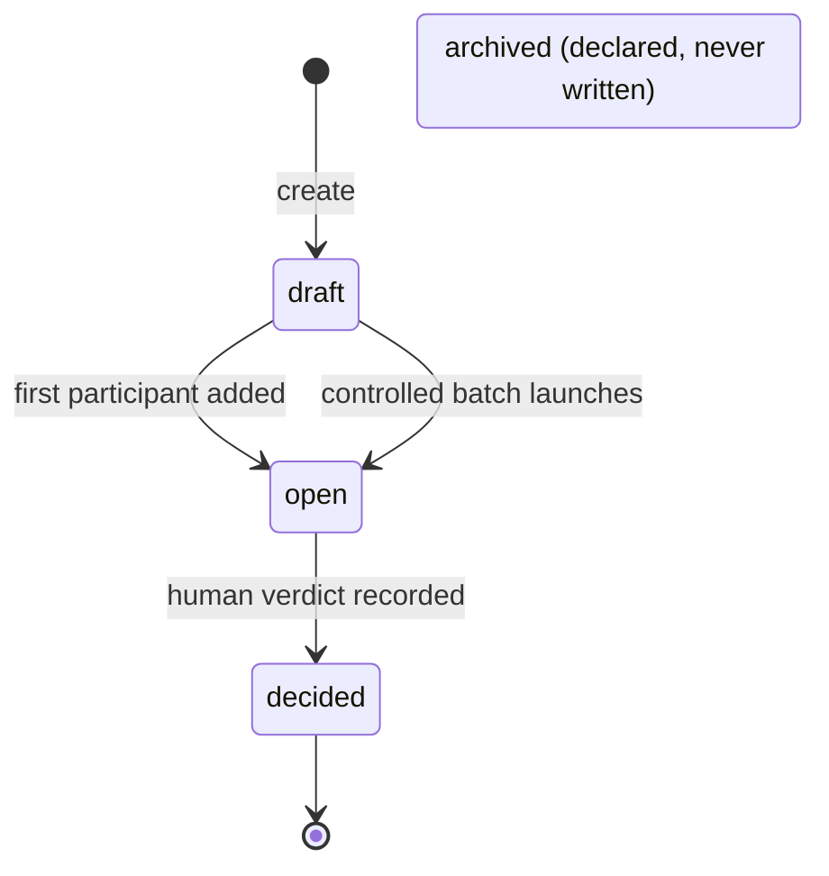
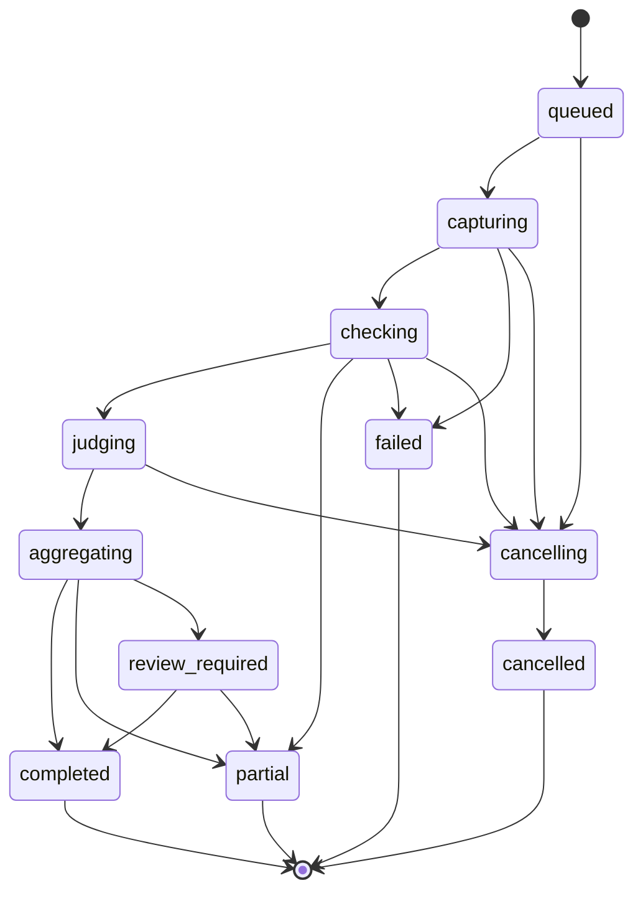
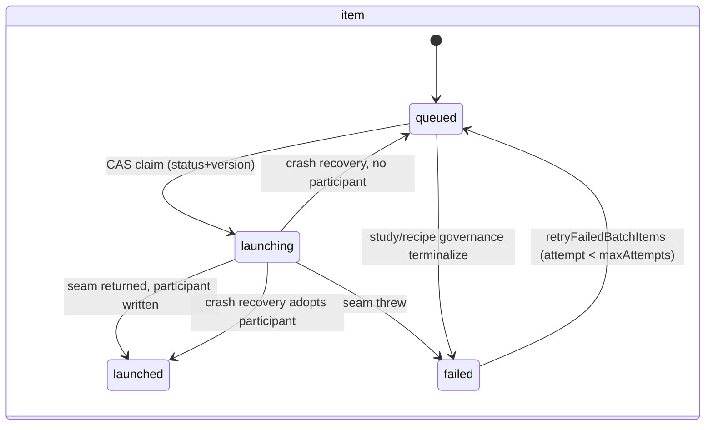
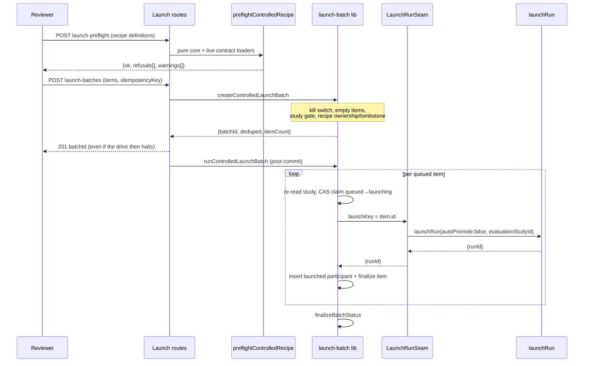
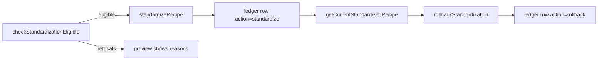

# Evaluations domain

## Purpose

This domain (**ADR-142..ADR-147 + [ADR-149](../decisions.md#adr-149-experiments-cut-over-completion)**)
covers the Evaluation Lab: the one surface that compares Runs for a task and
records a conclusive human verdict. A **Study** is scoped to exactly one
project and one task. Its **participants** are either *observed* (an existing
Run selected for comparison) or *launched* (a Run this domain created from an
immutable **recipe**). An **execution** seals immutable evidence, runs
objective checks, fans out independent judge attempts, aggregates them
deterministically, and may escalate to a human **review**; a human **verdict**
concludes the Study. The boundary includes controlled-launch recipes,
preflight, launch batches, judge panels/profiles, evidence snapshots,
aggregation (scalar and pairwise), and human-approved recipe standardization.

It **excludes**: automatic promotion of a winner (no machine standardizes or
promotes — ADR-147), a second scheduler clock (suites reuse the M24 tick), new
execution runtimes, and the retired Experiment surface (ADR-149; the legacy
`experiments` tables and `/experiments` routes are removed, and the former
`experiments.md` doc is deleted with them).

Implementation status is per-section. Unless a heading says otherwise,
everything below is **Implemented**.

## Domain entities

Persisted in Postgres; ERD in [`../db/evaluations-domain.md`](../db/evaluations-domain.md).
23 tables, grouped by lifecycle.

**Study core**

- **`evaluation_studies`** — the Study root (one project + one task).
  Carries `status`, optimistic `version`, and the ADR-149 provenance columns
  `legacy_experiment_id` (UNIQUE) + `legacy_snapshot` that survive the legacy
  table drop and back the `migratedBadge`.
- **`evaluation_participants`** — one compared Run. `source_type` decides
  everything: `observed` participants never gain launch semantics, `launched`
  ones carry `recipe_id`, `replicate_ordinal`, `launch_reason`, `batch_item_id`,
  and a `run_identity` snapshot.
- **`evaluation_recipes`** — the immutable "variant passport" (flow +
  package pin + slot-keyed runner/model + capability overlay + execution
  policy), content-addressed by `definition_digest`. Corrections tombstone
  (`tombstoned_at`) rather than rewrite.
- **`evaluation_events`** — the replayable per-Study log backing SSE, with a
  per-Study monotonic `sequence`.

**Controlled launch**

- **`evaluation_launch_batches`** — the durable batch *intent*, persisted
  before any launch side effect, keyed by `(study_id, idempotency_key)`.
- **`evaluation_launch_batch_items`** — one durable row per
  (recipe × replicate); the crash-recovery and CAS unit. Its `id` is the
  `launchKey`.

**Method configuration**

- **`evaluation_method_revisions`** — an immutable Evaluation Method
  projected from a package install. (There is no `evaluation_methods` table.)
- **`evaluation_judge_panels`** — mutable admin panel mapping a logical role
  to platform agents.
- **`evaluation_profiles`** — one method revision + one panel + defaults,
  hard limits, and an override allow-list.
- **`evaluation_project_profile_overrides`** — per-project override values,
  bounded by that allow-list.

**Evidence**

- **`evaluation_evidence_snapshots`** — an immutable sealed snapshot, reusable
  across executions, with its own GC lifecycle
  (`preparing → sealed → pending_delete → deleted`).
- **`evaluation_evidence_items`** — one bounded manifest item. `locator` is
  logical, never a filesystem path; `blob_key` is server-only.

**Execution**

- **`evaluation_executions`** — the execution identity and lifecycle, holding
  the snapshotted effective profile and policy so a later catalog edit cannot
  retroactively change what ran.
- **`evaluation_objective_check_runs`** / **`evaluation_metric_results`** —
  objective check attempts and their normalized metrics.
- **`evaluation_judge_attempts`** — one independent judge attempt, each with
  its own agent Run and attempt-bound token.
- **`evaluation_criterion_results`** — the per-criterion cell inside a sealed
  attempt.
- **`evaluation_aggregate_results`** — the deterministic aggregate, appended
  as sequential revisions.
- **`evaluation_reviews`** — the durable disagreement/escalation ledger.

**Conclusion and reuse**

- **`evaluation_human_verdicts`** — append-only, human-only. A correction is a
  superseding row via `supersedes_id`, never an update.
- **`evaluation_standardized_recipes`** — the append-only audit ledger of
  human-approved standardizations and rollbacks.
- **`evaluation_suites`** / **`evaluation_suite_studies`** — versioned
  benchmark/regression suite parents and their immutable links to generated
  Studies.

## State machines

### Study status

Authority: CHECK `evaluation_studies_status_check` (`schema.ts:2121-2124`) —
`draft | open | decided | archived`. Default `draft`.

There is **no transition allow-list** for Study status (unlike executions).
Transitions are ad-hoc CAS `UPDATE … WHERE status = <expected>` at four
writers only: insert as `draft` (`studies.ts:66`); `draft → open` on first
participant (`studies.ts:291-296`) or on batch launch
(`launch-batch.ts:601-605`); `open → decided` on verdict
(`verdicts.ts:218-230`).

`archived` is **declared but never written** — no writer sets
`status='archived'`, `archived_at`, or `archived_reason`, and the `[studyId]`
route exports only `GET` and `PATCH`. Code that *reads* `archived` (the launch
gates below) is correct and defensive; code that claims to produce it is not.

### Participant

`evaluation_participants` has **no `status` column**. Lifecycle is two nullable
timestamps: `frozen_at` and the `removed_at` tombstone.

`source_type` is CHECK-enforced (`schema.ts:2223-2226`): `observed | launched`.
Two further CHECKs hold the shape: an observed participant must have null
`recipe_id`/`launch_reason`/`replicate_ordinal` (`:2229-2233`), and
`replicate_ordinal` must be `>= 1` when present (`:2234-2236`).

`launch_reason` (`initial | manual_relaunch | replicate`) is a **Drizzle TS
enum hint only — there is no DB CHECK**; the column is bare `text` in
migration `0107`. Do not rely on the database to reject an unknown value.

### Execution status

Authority: CHECK `evaluation_executions_status_check` (`schema.ts:2631-2634`),
11 values. Terminal set (4) is `completed | partial | failed | cancelled`
(`types.ts:162-167`). The real FSM authority is the transition allow-list
`EVALUATION_TRANSITIONS` (`dispatcher/fsm.ts:14-29`); an illegal transition
throws `MaisterError("CONFIG")`, never a silent no-op (`fsm.ts:46-56`).

Exactly as coded: `aggregating` is **not** cancellable (a short computational
state, ADR-145 D4); `capturing` cannot reach `partial`; `judging` cannot reach
`failed` or `partial` directly.

Every edge emits a durable event (`fsm.ts:61-102`), so a client observing the
SSE replay never has to poll:

| Transition | Event |
| ---------- | ----- |
| `queued → capturing` | `evidence.capture_started` |
| `capturing → checking` | `evidence.snapshot_sealed` |
| `capturing → failed` | `evidence.capture_failed` |
| `checking → judging` | `objective_check.completed` |
| `checking → partial`, `review_required → partial` | `evaluation.partial` |
| `checking → failed` | `evaluation.failed` |
| `judging → aggregating` | `panel.quorum_reached` |
| `aggregating → completed` | `evaluation.completed` |
| `aggregating → partial` | `panel.partial` |
| `aggregating → review_required` | `review.required` |
| `review_required → completed` | `review.resolved` |
| `* → cancelling` | `evaluation.cancelling` |
| `cancelling → cancelled` | `evaluation.cancelled` |
| unmapped | `evaluation.transition` |

Additionally `evaluation.queued` is emitted on execution insert and retry
(`dispatcher/start.ts:304,376`, `advance.ts:243`) and `verdict.recorded` on
verdict (`verdicts.ts:233`).

### Judge attempt status

Authority: CHECK `evaluation_judge_attempts_status_check`
(`schema.ts:2819-2822`) — `queued | running | completed | invalid | timed_out |
cancelled | error`. There is **no transition allow-list**; movement is enforced
by targeted CAS only (`queued → running` at `judges/launch.ts:309-321`;
`→ timed_out` by the reaper at `dispatcher/tick.ts:481`). A slot counts as live
while `queued` or `running` (`judges/facade.ts:39`).

### Launch batch and batch item

These are **two different state sets** — neither is a superset of the other.

- Batch: CHECK `evaluation_launch_batches_status_check` (`schema.ts:3092-3095`)
  — `queued | launching | completed | partial | failed`.
- Item: CHECK `evaluation_launch_batch_items_status_check`
  (`schema.ts:3148-3151`) — `queued | launching | launched | failed`.

Batch status after the initial insert is **derived**, never set directly
(`finalizeBatchStatus`, `launch-batch.ts:664-691`): any item still
`queued`/`launching` → `launching`; else launched-and-failed → `partial`; else
any launched → `completed`; else → `failed`. `queued` is therefore only ever
the insert-time value and is never re-derived.

### Verdict and review

`evaluation_human_verdicts` has **no status** — it is append-only, and a
correction supersedes via `supersedes_id`. `outcome` is CHECK-enforced
(`schema.ts:3003-3006`): `winner | tie | inconclusive`. A second CHECK
(`:3008-3011`) requires either at least one cited execution or an explicit
`no_evaluation_evidence_ack = true`.

`evaluation_reviews` carries `kind` (`disagreement | escalation`) and `status`
(`required | resolved`), both CHECK-enforced (`schema.ts:2955-2962`).

`evaluation_aggregate_results` has **no status column and no CHECK at all**;
its only structural invariant is `UNIQUE(execution_id, revision)`. The
aggregate's outcome is not a status but the terminal it drives —
`quorumMet ? "completed" : "partial"` with `terminal_reason:
"quorum_not_met"` (`aggregation/worker.ts:432,450`).

## Process flows

### Controlled launch (recipes → preflight → batch → runs)

Lib **Implemented**; routes and Study Lab UI **Designed (ADR-149, Phase 1)**.

The batch FSM does **not** enforce the launch chain. `launch-batch.ts` imports
neither `preflight.ts` nor `materialization.ts` — its only recipe validation is
`parseControlledRecipe`. Contract-drift, trust, and slot-resolvability
refusals are enforced by the **preflight route** before submit and by the
**seam** at launch; the batch owns durability, idempotency, CAS, and recovery.

Preconditions run in this exact order (`launch-batch.ts:78-273`). The kill
switch and the empty-items check fire **outside** the transaction; everything
else inside:

1. `controlledRecipesEnabled()` false → `CONFIG`.
2. `items.length === 0` → `CONFIG`.
3. Study missing or not in this project → `PRECONDITION`.
4. Study `archived | decided` → `CONFLICT`.
5. Idempotency replay lookup → same digest returns `deduped: true`, a
   different digest for the same key → `CONFLICT`.
6. Per item: recipe missing or not in this study → `PRECONDITION`.
7. Recipe `tombstoned_at` set → `CONFLICT`.
8. Strict parse of the stored definition → `CONFIG`.

Two orderings are load-bearing. The **study gate precedes the idempotency
replay**, so replaying a batch into a since-`decided` Study raises `CONFLICT`
rather than returning `deduped: true`. And the whole recipe loop completes
before any insert, so a bad item B refuses the entire batch with no partial
write.

The request digest covers **only the items array** (`contentDigest` over
`[{recipeId, replicateCount}]`) — not `studyId`, `projectId`, or the user.
Study scoping comes from the partial unique index on
`(study_id, idempotency_key)`. Because `stableStringify` sorts object keys but
**preserves array order**, resubmitting the same key with reordered items is a
`CONFLICT`.

### Preflight refusals

`preflightControlledRecipe` is a **pure** core: given a parsed recipe and the
resolved live contracts it returns every refusal and warning with no side
effect. The route assembles the live contracts and calls it before submit; the
same core runs again before the first worktree side effect, so an incompatible
recipe never forks a branch. M47's scope allows exact-compatible contracts
only — every check is exact-or-superset, never a lossy coercion.

`PREFLIGHT_REFUSAL_CODES` (`preflight.ts:64-80`) is exactly 15 values:

| Code | Refuses when |
| ---- | ------------ |
| `ownership_mismatch` | the Flow revision or study belongs to another project |
| `flow_untrusted` | the Flow revision is not trusted |
| `flow_not_launchable` | enablement does not permit launch |
| `engine_incompatible` | the Flow's engine floor exceeds this platform |
| `schema_version_unsupported` | the manifest schema version is unsupported |
| `input_contract_drift` | the recipe's input-contract digest no longer matches the Flow |
| `artifact_contract_drift` | the artifact-contract digest no longer matches |
| `form_field_unknown` | a form value names a field the Flow does not declare |
| `form_required_missing` | a required form field has no value |
| `artifact_requirement_uncovered` | the Method requires an artifact kind the Flow never produces |
| `slot_unknown` | a binding names a slot the Flow does not declare |
| `slot_unbound` | a required slot has no binding and no default-chain resolution |
| `slot_runner_unavailable` | a bound runner is absent from the catalog |
| `slot_intent_unsatisfiable` | a runner *intent* matches no catalog candidate |
| `overlay_ref_unknown` | a capability overlay names an unknown rule/skill/mcp/subagent |

There is exactly one warning code, `slot_intent_soft_mismatch`
(`preflight.ts:88-92`) — an intent resolved to a candidate that is not its
first preference. Warnings never block.

A missing catalog MUST surface as a refusal, never a fabricated pass: absence
of evidence is not evidence of compatibility.

### Crash recovery for a stuck `launching` item

Runs unconditionally at the top of every drive, **before** the queued select
and **before** the kill-switch check (`launch-batch.ts:365-432`). It matches
any item in `launching` with no age, lease, or heartbeat filter, so it cannot
distinguish a crashed drive from a live concurrent one.

- A participant row exists for `batch_item_id` → adopt: item → `launched`,
  reusing the participant's `run_id`. The seam is **never** re-invoked.
- No participant → re-queue: item → `queued`, picked up by the very next
  select and driven in the same pass.

Convergence therefore rests on the seam honoring `launchKey`: a re-driven item
calls the seam with the same key and must receive the **same** run back.
Nothing in the batch lib verifies this — it is a contract on the adapter.

The adapter cannot satisfy that contract by re-reading the
`batch_item_id → run_id` binding, because the batch lib writes that binding
only *after* the seam returns. Two reachable interleavings leave nothing to
find — process death between the run INSERT and the participant commit, and
two lease-free drives inside the seam for the same item — and both would mint
a second run. The binding is therefore persisted **inside the run INSERT** as
`runs.evaluation_batch_item_id` under a partial UNIQUE (the same shape as
`runs.scheduled_launch_id`), so the conflict resolves in the statement that
creates the run and a loser re-selects the winner (ADR-149, migration `0118`).

### Pairwise execution (Designed, ADR-149 — Phase 1.5)

For a method whose aggregation is `pairwise_tournament@1`, judge attempts are
provisioned per unordered **pair** of participants rather than per participant:
`N·(N−1)/2` matches, with a bye for an odd count. Each attempt carries its
match identity in `match_a` / `match_b`; a judge submits a `winner` pick of
`a | b | tie` validated against that identity. Aggregation routes through
`computeTournament`, never the scalar registry.

Scoring is exactly `points = wins × 1 + ties × 0.5`
(`aggregation/tournament.ts:230`); byes contribute **zero** points. A match
resolves only on a strict plurality for `a` or `b` — an equal tally, or `tie`
itself winning the plurality, all yield `outcome: "tie"`. Below quorum the
match is `unresolved`, which changes no standing but increments
`unresolvedMatchCount`. Ranking is standard-competition ("1224"): equal
`(points, wins)` share the prior rank.

### Recipe standardization

Lib **Implemented**; routes and UI **Designed (ADR-149, Phase 1.5)**.
Human-approved and non-automatic, per ADR-147. Two phases over
`standardization.ts`, both scoped to a `(project, slot)` pair that defaults to
`"default"`:

Eligibility refuses with `no_conclusive_winner`, `winner_not_launched_recipe`,
`recipe_unavailable`, or a prefixed `preflight:<code>` passthrough of any
preflight refusal. Two conditions throw instead of refusing: a missing study is
`PRECONDITION`, and a verdict citing a participant outside its own study is
`CONFIG`. `standardizeRecipe` re-runs the full eligibility check **inside** its
write transaction, so drift between preview and confirm refuses with
`CONFLICT`.

Serialization is a per-`(project, slot)` advisory transaction lock
(`pg_advisory_xact_lock`, namespace `0x65767374`) plus a
`UNIQUE(project_id, slot, revision)` backstop — an advisory lock rather than a
row lock because the first-ever revision has no row to lock. Rollback never
rewrites history: it appends a **new** row at `max(revision) + 1` with
`action: "rollback"` that copies the prior definition and records
`rolled_back_to_revision`.

Standardization changes **no Run status** and performs no promotion — the
`runs` table is never touched.

### Study SSE stream

`GET /api/projects/{slug}/evaluations/studies/{studyId}/stream` is a
server-side poll of the durable `evaluation_events` log, not a state-transition
trigger. Frames are `id: <sequence>`, `event: <eventType>`,
`data: {executionId, sequence, payload}`. A client reconnects with
`Last-Event-ID` (or a `lastEventId` query param) and the server replays the
tail from the DB — there is no in-memory replay state.

Timings: poll every `1000 ms`; a `: heartbeat` comment frame after `15 s` of
silence, which deliberately does **not** advance `Last-Event-ID`; and a
terminal `stream_timeout` event once the connection exceeds `5 min`. Note the
constant bounding that ceiling is named `MAX_QUIET_MS` but is compared against
`startedAt`, so it caps **total stream duration**, not quiet time.

## Authorization

Project-scoped actions are declared in `web/lib/authz.ts:64-71`; role ordering
is `viewer(0) < member(1) < admin(2) < owner(3)`.

| Action | Min role | Guards |
| ------ | -------- | ------ |
| `readEvaluationStudies` | `viewer` | study list/detail, participants list, verdict history, SSE stream |
| `manageEvaluationStudies` | `member` | create/patch study, add/remove participants |
| `launchEvaluationRuns` | `member` | start an execution; **and** (ADR-149) launch-preflight, launch-batches create/read/retry, pin-options |
| `concludeEvaluationStudy` | `member` | record a human verdict |
| `resolveEvaluationReview` | `admin` | resolve a disagreement/escalation review |
| `manageProjectEvaluationOverrides` | `admin` | project profile overrides; **and** (ADR-149) standardization eligibility/standardize/rollback/current |
| `readEvaluationEvidence` | `member` | declared, unused — evidence reads run on the ext token scope `evaluations:evidence:read` instead |
| `runEvaluations` | `member` | declared, unused — reserved |

Two naming caveats worth stating rather than silently reproducing:

- `launchEvaluationRuns` reads as "launch runs" but its pre-ADR-149 consumer
  guards *starting an execution*. ADR-149 adds the controlled-launch routes
  under the same action — the name finally matches one of its two uses, and
  both are `member`, so no privilege boundary moves.
- `manageEvaluationConfig` is **not** a declared action. It appears only in
  comments; the admin evaluation-config routes enforce
  `requireGlobalRole("admin")` directly. Treat it as a label for the
  global-admin gate, never as an entry in `PROJECT_ACTION_MIN`.

Standardization is project-scoped configuration, so it reuses the existing
project-admin action rather than introducing a new one: a standardized recipe
*is* a project evaluation default, which is what
`manageProjectEvaluationOverrides` already governs.

## Expectations

- A Study MUST belong to exactly one project and one task, and every
  `studyId` reaching a route MUST be re-scoped by `getStudyForProject` so a
  cross-project id is 404, never 403.
- An `observed` participant MUST NEVER gain launch semantics: its `recipe_id`,
  `launch_reason`, and `replicate_ordinal` are null by CHECK, and selecting a
  Run for comparison MUST NOT change that Run's behavior.
- Every Run launched THROUGH THIS DOMAIN MUST carry a `promotion_hold` with
  `source: "evaluation_study"`, and that hold MUST NOT be clearable while a
  `draft`/`open` Study owns it (`CONFLICT`). *(Participants created by the
  `0110` legacy backfill are the documented exception — that migration writes
  participant rows but no hold; they are protected by the lineage predicate
  below, not by a hold.)*
- `isLaunchedLineageRun` MUST exclude launched participants — and never
  observed ones — from auto-promotion, auto-delivery, and branch sync, and
  MUST keep excluding a participant whose `removed_at` is set. *(This protects
  the participant Run itself. It does NOT reach a SUCCESSOR run minted by a
  relaunch lane that declares no inheritance source — see Edge cases.)*
- A controlled-launch batch MUST persist its durable intent before any launch
  side effect, and the create route MUST return `201` with the `batchId` even
  when the drive loop then halts. *(route: Phase 1)*
- Re-invoking `LaunchRunSeam` with an already-used `launchKey` MUST adopt the
  existing Run and MUST NEVER create a second one; a launch that lands at the
  concurrency cap MUST record the item `launched` with the Run `Pending`,
  never `failed`. *(default adapter: Phase 1)*
- Resubmitting a batch with the same `idempotencyKey` and an identical item
  digest MUST return `deduped: true`; the same key with any different digest —
  including a reordering of `items` — MUST be `CONFLICT`.
- A recipe MUST be immutable: no code path may rewrite a stored `definition`
  in place, and a `tombstoned_at` recipe MUST refuse launch with `CONFLICT` at
  create, per-item admission, and retry alike. *(The tombstone is enforced at
  all three read sites but has no production writer yet, so "correct by
  tombstoning" is currently a contract without a caller — see Edge cases.)*
- An execution MUST only follow `EVALUATION_TRANSITIONS`; any other transition
  MUST throw `MaisterError("CONFIG")` rather than no-op, and every edge MUST
  append a durable event so no client needs to poll.
- A conclusive verdict MUST be human-authored and append-only: corrections
  supersede via `supersedes_id`, and no machine may record a verdict,
  standardize a recipe, or promote a winner.
- Standardization MUST re-verify eligibility inside its write transaction,
  MUST serialize on the `(project, slot)` advisory lock, and MUST NEVER change
  a Run status.
- Setting `MAISTER_CONTROLLED_RECIPES_ENABLED=false` MUST refuse new batch
  creation with `CONFIG` and halt an in-flight drive leaving items `queued`,
  while leaving observed comparison and already-launched Runs untouched.

## Edge cases

- **Kill switch mid-drive** — the loop `break`s and remaining items stay
  `queued`; the batch is re-derived to `launching`, not to a distinct "frozen"
  state. `retryFailedBatchItems` also refuses (returns `{requeued: 0}` with a
  warning) rather than throwing. The check is hoisted to the entry of the
  drive: read only inside per-item admission, it sat *after* the stuck-recovery
  loop, so a frozen platform still mutated item rows and could move one to
  `launched`. No run ever escaped the freeze — the `break` precedes every seam
  call — but the state mutation contradicted the documented contract.
- **Study decided mid-batch** — every remaining item is *terminalized* to
  `failed` with `STUDY_NOT_LAUNCHABLE`, not left queued. This is the opposite
  of the kill-switch behavior, and it is deliberate: a decided Study must not
  keep acquiring participants.
- **Three different study-status predicates** — create uses a deny-list
  (`archived | decided`), while drive and retry use an allow-list
  (`draft | open`). They agree only because the enum is exactly those four
  values; adding a fifth status makes create permissive and drive restrictive.
  A missing Study is `PRECONDITION` at create but a terminalize at drive.
- **Governance-terminalized items never consume retry budget** — `attempt` is
  incremented in exactly one place (the seam-failure path). A Study flipped
  `open → decided → open` can therefore be retried indefinitely; the only
  brake is the study/tombstone gate inside retry.
- **Retry exhaustion is silent** — at `attempt >= maxAttempts` the item simply
  falls out of the `WHERE`, with no distinct status, marker, or log. It stays
  `failed` forever.
- **`retryFailedBatchItems` never re-finalizes the batch** — the batch row
  keeps a stale `status` and a stale `completed_at` until the next drive.
- **`completed_at` is re-stamped** on every non-pending finalize and never
  cleared, so a completed → retried → re-driven batch overwrites it.
- **The `{launched, failed, skipped}` counters are per-pass, not cumulative**,
  and exclude adopted stuck items entirely. `failed` is incremented
  unconditionally even though its UPDATE is status-guarded without a
  `.returning()` check, so a stale concurrent drive can overstate it.
- **Duplicate `recipeId` entries in one request** fan out to colliding item
  rows and surface a raw Postgres `23505`, not a typed `MaisterError`.
- **Stuck-recovery has no lease** — two concurrent drives can both act on the
  same `launching` item. Safety rests entirely on the seam's `launchKey`
  idempotency, which the batch lib does not verify.
- **`archived` Studies cannot be produced** — the status is read by the launch
  gates but no code path writes it, and there is no `DELETE` handler despite
  a schema comment implying one.
- **`launch_reason` is not DB-enforced** — the column is bare `text`; only
  application code constrains it.
- **Quorum shortfall** is not a failure: the execution lands `partial` with
  `terminal_reason: "quorum_not_met"`, and in a tournament the affected match
  is `unresolved` while every other match still scores.
- **A judge attempt is never reaped** when its policy snapshot carries no
  positive `timeoutMs` — the reaper skips it rather than applying a default.
- **Evidence snapshots outlive executions** — an orphaned `preparing` snapshot
  is collected after `1 h` and a `pending_delete` one after a `24 h` grace,
  both overridable per call.
- **Workspace GC holds a launched participant's worktree** while its Study is
  neither `decided` nor `archived` (`gc/workspace-gc.ts:245-260`), so evidence
  captured later still has a tree to read. The predicate matches on
  `source_type = 'launched'` and deliberately does **not** filter `removed_at`.
  The GC horizon is `DEFAULT_GC_AGE_DAYS = 14` (`instance-config.ts:109`),
  overridable via `MAISTER_GC_AGE_DAYS` and floored at 1 — note a neighbouring
  comment calling `168 h` "the GC horizon" is stale, since 168 h is 7 days.
- **The evaluation GC hold only covers backfilled legacy rows.** It matches
  `evaluation_participants`, so an `experiment_runs` row created *after*
  migration `0110` had no participant until the backfill re-ran. This is why
  ADR-149 removes the legacy write path before deleting the legacy GC
  predicate, and re-runs `evaluation_backfill_from_experiments()` inside the
  drop migration — which executes before the app accepts traffic, closing the
  window.

## Known lineage gaps (pre-existing; not introduced or worsened by ADR-149)

An adversarial pass over the launched-lineage invariants found four gaps that
predate this cut-over. They are recorded here because this document is where a
reviewer will look for the guarantee, and a silent omission would read as a
guarantee that holds.

- **A relaunch lane that declares no inheritance source produces an unheld
  successor.** `membershipSourceForLaunch` recognizes exactly two signals —
  `relaunchOfRunId` and a `budget_restart` trigger payload — while `launchRun`
  has many production callers that mint a successor run. The budget-breach
  fork declares its source correctly and is the model to copy. The ralph-loop
  `run.failed` consumer does not: its replacement inherits the dead run's
  execution policy (the `unattended` preset arms `crashRetry: "ralph_loop"`
  **and** `promotion: "auto_on_ready"` together) but inherits no participation
  and no hold, so it can auto-deliver mid-Study. Any NEW relaunch lane is an
  escape hatch by default rather than by mistake.
- **The ADR-119 force-relaunch UI never sends `relaunchOfRunId`.**
  `buildLaunchBody` emits `allowConcurrent` only, so the `manual_relaunch`
  branch of the inheritance helper is unreachable from the product surface and
  is exercised only by tests.
- **The `0110` backfill writes participants but no promotion hold**, so
  backfilled legacy runs are not excluded by the `promotion_hold IS NULL`
  candidate prefilter. They remain protected by the lineage predicate at the
  apply site — defense in depth minus one layer.
- **Workbench lifecycle operations carry no lineage guard.** Their allow-list
  is derived from run kind, run status, and workspace flags only, so
  `export-branch` (which force-pushes), `snapshot-commit`, `handoff-branch`,
  and `drop` all act freely on a launched participant's tree — mutating the
  tip that later evidence captures read, which is exactly what branch sync
  refuses to do. A manual `drop` also bypasses the GC evidence hold, which
  gates only the sweep.

## Linked artifacts

- **ADRs** — [ADR-142](../decisions.md#adr-142-evaluation-study-domain-and-legacy-experiment-compatibility)
  (Study domain), [ADR-143](../decisions.md#adr-143-package-sourced-evaluation-methods-and-trust-compatibility)
  (methods), [ADR-144](../decisions.md#adr-144-immutable-private-evidence-and-bounded-evaluator-retrieval)
  (evidence), [ADR-145](../decisions.md#adr-145-multi-judge-execution-aggregation-disagreement-and-human-verdict)
  (aggregation/verdict), [ADR-146](../decisions.md#adr-146-controlled-evaluation-recipes-and-slot-keyed-execution-profiles)
  (recipes), [ADR-147](../decisions.md#adr-147-advanced-evaluation-suites-calibration-and-recipe-standardization)
  (suites/standardization), [ADR-149](../decisions.md#adr-149-experiments-cut-over-completion)
  (cut-over completion).
- **API** — [`../api/web.openapi.yaml`](../api/web.openapi.yaml) (studies,
  participants, verdicts, executions, launch batches, standardization),
  [`../api/external/operations.openapi.yaml`](../api/external/operations.openapi.yaml)
  (judge-facing `evaluation_*` ops),
  [`../api/async/web-evaluations.asyncapi.yaml`](../api/async/web-evaluations.asyncapi.yaml)
  (Study SSE channel).
- **DB** — [`../db/evaluations-domain.md`](../db/evaluations-domain.md) (ERD),
  [`../database-schema.md`](../database-schema.md) (narrative reference).
- **Screens** — [`../screens/projects/project-evaluations.md`](../screens/projects/project-evaluations.md).
- **Source** — `web/lib/evaluations/**` (`launch-batch.ts`, `preflight.ts`,
  `recipe-schema.ts`, `materialization.ts`, `standardization.ts`,
  `dispatcher/fsm.ts`, `aggregation/tournament.ts`, `membership.ts`),
  `web/lib/db/schema.ts:2067-3305`.

## Known documentation debt

Not introduced by ADR-149 and deliberately out of its scope:

- [`../db/erd.md`](../db/erd.md) does not carry entity blocks for the 18
  evaluation tables added after it was written; only the domain ERD does.
- [`../db/README.md`](../db/README.md)'s index is stale with respect to the
  evaluation domain files.
