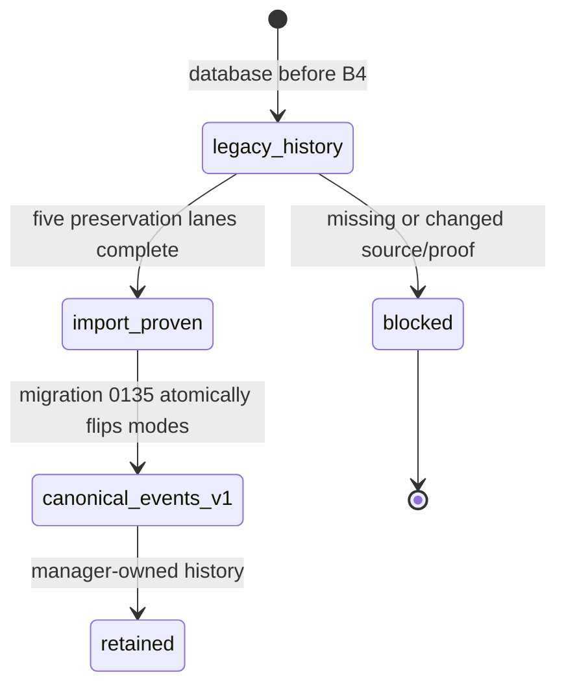
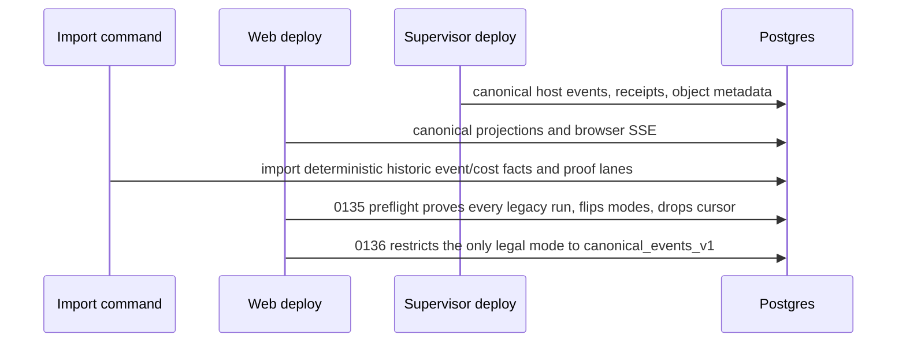

# Execution data-plane cutover

**Status:** Implemented — B4 completed the bounded import-and-proof cutover.
Every admitted run now uses `canonical_events_v1`; no manager reader has a
runtime-file fallback and Stage B does not introduce multi-host placement.

## Purpose

Define incremental deployment, historical import, active-run safety, and
destructive removal of filesystem-affine manager readers. Every intermediate
release remains operable in the default one-host compose installation.

## Domain entities

- `runs.execution_data_plane_mode` is immutable `canonical_events_v1` after
  migration `0136`; a pre-cutover database is not eligible for a partial B4
  migration.
- `execution_data_plane_imports` records five preservation lanes per historic
  run, including deterministic source fingerprint, position, terminal state,
  and bounded error.
- `run_session_incarnations` is the canonical historical association replacing
  `scratch_runs.supervisor_session_id` after proof.
- `artifact_projection_cursors` and legacy file locators were removed by
  migration `0135` only after import proof.
- A host that does not advertise the complete canonical data plane is rejected
  for new admission; there is no legacy selection path.

## State machine

## Process flows

## Expectations

- **CUT-01:** Each current run is admitted only in immutable canonical data-plane mode with no per-call fallback.
- **CUT-02:** The bounded deployment order is supervisor capability → web canonical projection → historic import → `0135`/`0136`; a mixed version never silently selects legacy behavior.
- **CUT-03:** Historical legacy runs are imported idempotently with deterministic fingerprints or retain explicit failed proof and block the destructive migration.
- **CUT-04:** `0135` starts only when its preflight proves every legacy run has all five completed preservation lanes.
- **CUT-05:** Scratch mirrors and artifact cursors are removed only after canonical association/preservation proof, otherwise migration aborts.
- **CUT-06:** Compatibility reader/writer authority is removed in a bounded release and canonical runs never consult legacy files.
- **CUT-07:** Import, projection, and object migration record durable resume state after any partial failure; a completed import verifies the same fingerprints on re-entry.
- **CUT-08:** Reconciliation is idempotent after database/transport/host/manager failure and never infers terminal success from absence.
- **CUT-09:** Final web startup and history, SSE, prompt completion, cost, and artifact access require no host runtime-data mount.
- **CUT-10:** Default compose needs no enrollment, relay, object store, or additional operator setup.
- **CUT-11:** Stage A fencing, receipt recovery, checkpoint, HITL resume, cancellation, completion, and deferred release remain non-regressing.
- **CUT-12:** Repository/Git/worktree authority, multiple placement, remote trust, and cross-host ACP resume remain Stage C/D boundaries.

## Edge cases

- **EDGE-CUT-01:** A malformed legacy line or conflicting association sets failed import state with source position/fingerprint and blocks B4 (`IT-CUT-07-MALFORMED`).
- **EDGE-CUT-02:** A uniquely provable legacy scratch mirror creates a canonical legacy incarnation with provenance, but ambiguity aborts (`IT-CUT-05-SCRATCH`).
- A supervisor-first rollout emits canonical host outbox data; a web-first rollout only admits a host whose complete canonical capability is advertised. If the supervisor is unavailable at web boot, the next lazy host resolution and each periodic system sweep repeat the idempotent registration-plus-consumer activation, so active outbox data cannot remain disconnected until another web restart. The final migration is intentionally blocked until historical import proof is present.
- Assignment expiry, epoch supersession, host restart, or manager restart resumes durable reconciliation without a mode switch.

## Linked artifacts

- [ADR-167](../decisions/adr-167.md) fixes the compatibility strategy and deferred boundaries.
- [Execution event plane](execution-event-plane.md), [prompt lifecycle](execution-prompt-lifecycle.md), and [runtime objects](execution-runtime-objects.md) own the migrated domains.
- [Reconciliation and GC](reconciliation-gc.md), [scratch runs](scratch-runs.md), and [runs](runs.md) own existing recovery callers.
- [Database schema](../database-schema.md) and [execution-host domain](../db/execution-hosts-domain.md) document additive/import/destructive records.
- Primary B4 proofs are `IT-CUT-01` through `IT-CUT-08`, with B0 migration guards `IT-CUT-01` through `IT-CUT-03`.

### Stage B implementation traceability

The tables below map the approved requirements to their implemented contracts,
enforcement points, and primary verification identifiers. B4 verification is
recorded by the real Postgres cutover and legacy-import integration suites, the
canonical projection suites, and the supervisor receipt/fence suites named in
the implementation plan.

| Requirement | Contract/schema          | Enforcement/task                  | Primary test | Status   |
| ----------- | ------------------------ | --------------------------------- | ------------ | -------- |
| EVT-01      | web-runs AsyncAPI        | canonical query T2.2/T2.3         | IT-EVT-01    | Implemented |
| EVT-02      | host AsyncAPI/outbox     | atomic append T1.1                | IT-EVT-02    | Implemented |
| EVT-03      | event unique constraints | ingest T0.4/T1.3                  | IT-EVT-03    | Implemented |
| EVT-04      | decimal/run counter      | allocator/lock T1.1/T1.3          | IT-EVT-04    | Implemented |
| EVT-05      | stale disposition        | ingest/projectors T1.3/T2.1       | IT-EVT-05    | Implemented |
| EVT-06      | replay/ACK/gap schema    | consumer T1.2/T1.3                | IT-EVT-06    | Implemented |
| EVT-07      | SSE/ACK cursors          | host/manager recovery T1.1–T1.3   | IT-EVT-07    | Implemented |
| EVT-08      | payload/error schema     | redactors T0.3/T1.1/T1.3          | CT-EVT-08    | Implemented |
| EVT-09      | capability limits        | outbox pressure T1.1              | IT-EVT-09    | Implemented |
| EVT-10      | consumer schema          | projector CAS T1.4                | IT-EVT-10    | Implemented |
| EVT-11      | web-runs AsyncAPI        | browser mapper T2.2               | IT-EVT-11    | Implemented |
| EVT-12      | ADR/retention spec       | outbox prune T1.1/T4.4            | IT-EVT-12    | Implemented |
| PRM-01      | prompt contract          | host admission T3.1               | IT-PRM-01    | Implemented |
| PRM-02      | command idempotency      | receipt invariant T3.1            | IT-PRM-02    | Implemented |
| PRM-03      | prompt spec              | async host/drivers T3.1/T3.3      | IT-PRM-03    | Implemented |
| PRM-04      | owner schema/index       | continuation T0.4/T3.2            | IT-PRM-04    | Implemented |
| PRM-05      | turn_lost schema         | startup repair T3.1               | IT-PRM-05    | Implemented |
| PRM-06      | terminal errors          | reconciliation T1.4/T3.2          | IT-PRM-06    | Implemented |
| PRM-07      | terminal schemas         | heartbeat reducer T3.1            | IT-PRM-07    | Implemented |
| PRM-08      | HITL/checkpoint schema   | host/owners T2.1/T3.3             | IT-PRM-08    | Implemented |
| PRM-09      | cancel contract          | Stage A ledger T3.1/T3.3          | IT-PRM-09    | Implemented |
| PRM-10      | fenced receipt/event     | pre-ACP fence T3.1                | IT-PRM-10    | Implemented |
| PRM-11      | PromptHandle contract    | DB query T3.2                     | IT-PRM-11    | Implemented |
| PRM-12      | retention spec           | command prune T3.2/T4.4           | IT-PRM-12    | Implemented |
| OBJ-01      | object/locator schema    | catalog/transport T3.4/T3.5       | CT-OBJ-01    | Implemented |
| OBJ-02      | web object API           | server-derived auth T3.5          | IT-OBJ-02    | Implemented |
| OBJ-03      | command kinds/checks     | Stage A ledger T3.4               | IT-OBJ-03    | Implemented |
| OBJ-04      | metadata checks          | seal validator T3.4               | IT-OBJ-04    | Implemented |
| OBJ-05      | upload contract          | atomic rename T3.4                | IT-OBJ-05    | Implemented |
| OBJ-06      | range contract           | host/web stream T3.4/T3.5         | IT-OBJ-06    | Implemented |
| OBJ-07      | object errors/states     | catalog resolver T3.4/T3.5        | IT-OBJ-07    | Implemented |
| OBJ-08      | redaction taxonomy       | allowlists T3.4/T4.4              | IT-OBJ-08    | Implemented |
| OBJ-09      | ownership spec           | catalog boundary T3.5             | IT-OBJ-09    | Implemented |
| OBJ-10      | artifact spec            | output/evidence adapter T3.5      | IT-OBJ-10    | Implemented |
| OBJ-11      | delete contract          | tombstone/unlink T3.4             | IT-OBJ-11    | Implemented |
| OBJ-12      | retention/catalog        | GC/payload route T3.5/T4.4        | IT-OBJ-12    | Implemented |
| CUT-01      | run-mode/trigger         | admission/writers T0.4/T0.5       | IT-CUT-01    | Implemented |
| CUT-02      | compatibility spec       | capability decision T0.5          | IT-CUT-02    | Implemented |
| CUT-03      | import schema            | importer/views T4.1               | IT-CUT-03    | Implemented |
| CUT-04      | cutover spec             | B4 preflight T4.1                 | IT-CUT-04    | Implemented |
| CUT-05      | destructive migration    | preserve guards T4.1/T4.3         | IT-CUT-05    | Implemented |
| CUT-06      | source guard/ADR         | deletion gate T4.2/T4.3           | ST-CUT-06    | Implemented |
| CUT-07      | import state             | resumable import T4.1             | IT-CUT-07    | Implemented |
| CUT-08      | reconciliation spec      | recovery sweeps T1.4/T4.1         | IT-CUT-08    | Implemented |
| CUT-09      | deployment contract      | mount-free harness T2.5/T3.6/T4.2 | E2E-CUT-09   | Implemented |
| CUT-10      | compose/config           | default deployment T0.5/T4.4      | SM-CUT-10    | Implemented |
| CUT-11      | Stage A suite            | lifecycle regressions T2.5/T3.6   | E2E-CUT-11   | Implemented |
| CUT-12      | ADR/inventory            | scope gate T0.1/T4.4              | ST-CUT-12    | Implemented |

| Edge case   | Contract/schema           | Enforcement/task              | Primary test        | Status   |
| ----------- | ------------------------- | ----------------------------- | ------------------- | -------- |
| EDGE-EVT-01 | event constraints         | duplicate classifier T1.3     | IT-EVT-03           | Implemented |
| EDGE-EVT-02 | event constraints         | conflict classifier T1.3      | IT-EVT-03-CONFLICT  | Implemented |
| EDGE-EVT-03 | replay floor error        | recovery T1.2/T1.3            | IT-EVT-06-FLOOR     | Implemented |
| EDGE-EVT-04 | stream-bound ACK          | ACK endpoint T1.2             | IT-EVT-07-ACK-RACE  | Implemented |
| EDGE-EVT-05 | sequence/timestamp schema | boundary parser T0.3/T1.3     | CT-EVT-05           | Implemented |
| EDGE-EVT-06 | quarantine schema         | ingest T0.3/T1.3              | CT-EVT-08           | Implemented |
| EDGE-EVT-07 | command/assignment fence  | ingest/projector T1.3/T1.4    | IT-EVT-05           | Implemented |
| EDGE-PRM-01 | receipt/event contract    | prompt reconcile T3.1/T3.2    | IT-PRM-02-ACK-LOSS  | Implemented |
| EDGE-PRM-02 | turn_lost schema          | startup repair T3.1           | IT-PRM-05           | Implemented |
| EDGE-PRM-03 | terminal conflict error   | reconciliation T1.4/T3.2      | IT-PRM-06           | Implemented |
| EDGE-PRM-04 | receipt event linkage     | reconciliation T1.4/T3.2      | IT-PRM-06           | Implemented |
| EDGE-OBJ-01 | object auth errors        | host/web validation T3.4/T3.5 | IT-OBJ-02-PATH      | Implemented |
| EDGE-OBJ-02 | range contract            | range parser T3.4             | IT-OBJ-06           | Implemented |
| EDGE-OBJ-03 | immutable metadata        | conflict validator T3.4       | IT-OBJ-04-CONFLICT  | Implemented |
| EDGE-CUT-01 | import state              | importer T4.1                 | IT-CUT-07-MALFORMED | Implemented |
| EDGE-CUT-02 | mirror preserve rule      | migration T4.3                | IT-CUT-05-SCRATCH   | Implemented |
