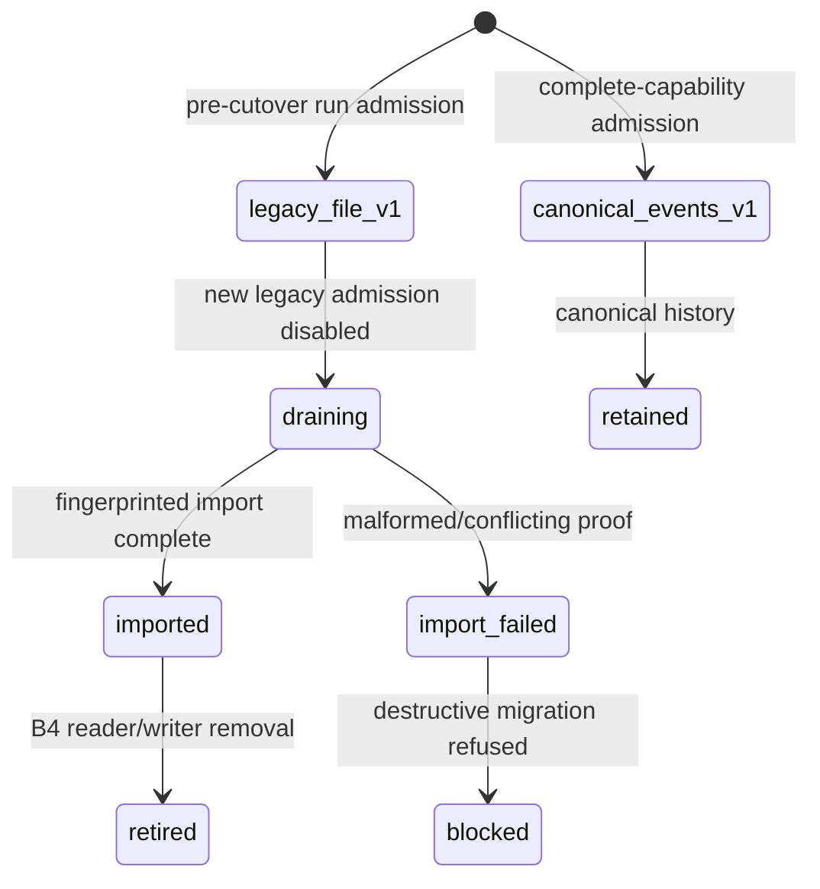
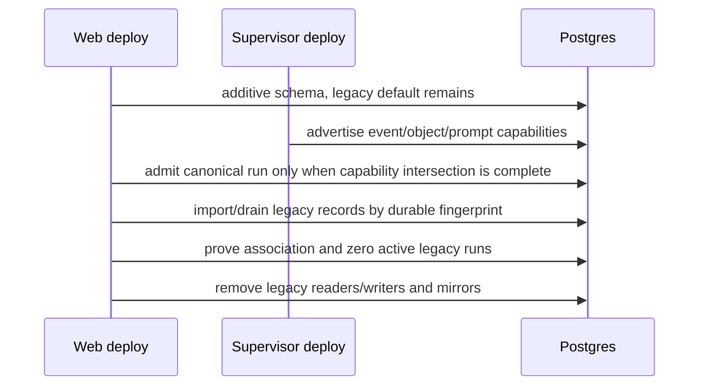

# Execution data-plane cutover

**Status:** Designed — Stage B uses a bounded immutable per-run compatibility
mode; it does not retain permanent dual event/file authority or introduce
multi-host placement.

## Purpose

Define incremental deployment, historical import, active-run safety, and
destructive removal of filesystem-affine manager readers. Every intermediate
release remains operable in the default one-host compose installation.

## Domain entities

- `runs.execution_data_plane_mode` is immutable `legacy_file_v1` or
  `canonical_events_v1` selected at admission.
- `execution_data_plane_imports` records per-run source fingerprint, position,
  attempts, terminal import state, and bounded error.
- `run_session_incarnations` is the canonical historical association replacing
  `scratch_runs.supervisor_session_id` after proof.
- `artifact_projection_cursors` and legacy file locators are compatibility
  state that B4 removes only after import/drain verification.
- Execution host capability negotiation determines whether a new canonical run
  may be admitted during a rolling upgrade.

## State machine

## Process flows

## Expectations

- **CUT-01:** Each run is admitted once in immutable legacy or canonical data-plane mode with no per-call fallback.
- **CUT-02:** Supervisor-first and web-first upgrades preserve legacy active runs while canonical admission requires complete advertised capability.
- **CUT-03:** Historical legacy runs are imported idempotently or retain explicit missing/failed import status and remain viewable.
- **CUT-04:** B4 starts only after new legacy admission is disabled and every active legacy run has drained.
- **CUT-05:** Scratch mirrors and file locators are removed only after a unique canonical association is proven, otherwise migration aborts.
- **CUT-06:** Compatibility reader/writer authority is removed in a bounded release and canonical runs never consult legacy files.
- **CUT-07:** Import, projection, and object migration record durable resume state after any partial failure.
- **CUT-08:** Reconciliation is idempotent after database/transport/host/manager failure and never infers terminal success from absence.
- **CUT-09:** Final web startup and history, SSE, prompt completion, cost, and artifact access require no host runtime-data mount.
- **CUT-10:** Default compose needs no enrollment, relay, object store, or additional operator setup.
- **CUT-11:** Stage A fencing, receipt recovery, checkpoint, HITL resume, cancellation, completion, and deferred release remain non-regressing.
- **CUT-12:** Repository/Git/worktree authority, multiple placement, remote trust, and cross-host ACP resume remain Stage C/D boundaries.

## Edge cases

- **EDGE-CUT-01:** A malformed legacy line or conflicting association sets failed import state with source position/fingerprint and blocks B4 (`IT-CUT-07-MALFORMED`).
- **EDGE-CUT-02:** A uniquely provable legacy scratch mirror creates a canonical legacy incarnation with provenance, but ambiguity aborts (`IT-CUT-05-SCRATCH`).
- A web-first rollout retains legacy behavior until host capability is complete, and a supervisor-first rollout only records additive event/outbox state until web ingest is available.
- Assignment expiry, epoch supersession, host restart, or manager restart resumes durable reconciliation rather than switching a run's frozen mode.

## Linked artifacts

- [ADR-167](../decisions/adr-167.md) fixes the compatibility strategy and deferred boundaries.
- [Execution event plane](execution-event-plane.md), [prompt lifecycle](execution-prompt-lifecycle.md), and [runtime objects](execution-runtime-objects.md) own the migrated domains.
- [Reconciliation and GC](reconciliation-gc.md), [scratch runs](scratch-runs.md), and [runs](runs.md) own existing recovery callers.
- [Database schema](../database-schema.md) and [execution-host domain](../db/execution-hosts-domain.md) document additive/import/destructive records.
- Primary B4 proofs are `IT-CUT-01` through `IT-CUT-08`, with B0 migration guards `IT-CUT-01` through `IT-CUT-03`.

### Stage B traceability

Each row has one primary RED→GREEN proof; broader regression suites are
supporting evidence only. Status remains `Designed` until the named test is
green in the implementing increment.

| Requirement | Contract/schema | Enforcement/task | Primary test | Status |
| --- | --- | --- | --- | --- |
| EVT-01 | web-runs AsyncAPI | canonical query T2.2/T2.3 | IT-EVT-01 | Designed |
| EVT-02 | host AsyncAPI/outbox | atomic append T1.1 | IT-EVT-02 | Designed |
| EVT-03 | event unique constraints | ingest T0.4/T1.3 | IT-EVT-03 | Designed |
| EVT-04 | decimal/run counter | allocator/lock T1.1/T1.3 | IT-EVT-04 | Designed |
| EVT-05 | stale disposition | ingest/projectors T1.3/T2.1 | IT-EVT-05 | Designed |
| EVT-06 | replay/ACK/gap schema | consumer T1.2/T1.3 | IT-EVT-06 | Designed |
| EVT-07 | SSE/ACK cursors | host/manager recovery T1.1–T1.3 | IT-EVT-07 | Designed |
| EVT-08 | payload/error schema | redactors T0.3/T1.1/T1.3 | CT-EVT-08 | Designed |
| EVT-09 | capability limits | outbox pressure T1.1 | IT-EVT-09 | Designed |
| EVT-10 | consumer schema | projector CAS T1.4 | IT-EVT-10 | Designed |
| EVT-11 | web-runs AsyncAPI | browser mapper T2.2 | IT-EVT-11 | Designed |
| EVT-12 | ADR/retention spec | outbox prune T1.1/T4.4 | IT-EVT-12 | Designed |
| PRM-01 | prompt contract | host admission T3.1 | IT-PRM-01 | Designed |
| PRM-02 | command idempotency | receipt invariant T3.1 | IT-PRM-02 | Designed |
| PRM-03 | prompt spec | async host/drivers T3.1/T3.3 | IT-PRM-03 | Designed |
| PRM-04 | owner schema/index | continuation T0.4/T3.2 | IT-PRM-04 | Designed |
| PRM-05 | turn_lost schema | startup repair T3.1 | IT-PRM-05 | Designed |
| PRM-06 | terminal errors | reconciliation T1.4/T3.2 | IT-PRM-06 | Designed |
| PRM-07 | terminal schemas | heartbeat reducer T3.1 | IT-PRM-07 | Designed |
| PRM-08 | HITL/checkpoint schema | host/owners T2.1/T3.3 | IT-PRM-08 | Designed |
| PRM-09 | cancel contract | Stage A ledger T3.1/T3.3 | IT-PRM-09 | Designed |
| PRM-10 | fenced receipt/event | pre-ACP fence T3.1 | IT-PRM-10 | Designed |
| PRM-11 | PromptHandle contract | DB query T3.2 | IT-PRM-11 | Designed |
| PRM-12 | retention spec | command prune T3.2/T4.4 | IT-PRM-12 | Designed |
| OBJ-01 | object/locator schema | catalog/transport T3.4/T3.5 | CT-OBJ-01 | Designed |
| OBJ-02 | web object API | server-derived auth T3.5 | IT-OBJ-02 | Designed |
| OBJ-03 | command kinds/checks | Stage A ledger T3.4 | IT-OBJ-03 | Designed |
| OBJ-04 | metadata checks | seal validator T3.4 | IT-OBJ-04 | Designed |
| OBJ-05 | upload contract | atomic rename T3.4 | IT-OBJ-05 | Designed |
| OBJ-06 | range contract | host/web stream T3.4/T3.5 | IT-OBJ-06 | Designed |
| OBJ-07 | object errors/states | catalog resolver T3.4/T3.5 | IT-OBJ-07 | Designed |
| OBJ-08 | redaction taxonomy | allowlists T3.4/T4.4 | IT-OBJ-08 | Designed |
| OBJ-09 | ownership spec | catalog boundary T3.5 | IT-OBJ-09 | Designed |
| OBJ-10 | artifact spec | output/evidence adapter T3.5 | IT-OBJ-10 | Designed |
| OBJ-11 | delete contract | tombstone/unlink T3.4 | IT-OBJ-11 | Designed |
| OBJ-12 | retention/catalog | GC/payload route T3.5/T4.4 | IT-OBJ-12 | Designed |
| CUT-01 | run-mode/trigger | admission/writers T0.4/T0.5 | IT-CUT-01 | Designed |
| CUT-02 | compatibility spec | capability decision T0.5 | IT-CUT-02 | Designed |
| CUT-03 | import schema | importer/views T4.1 | IT-CUT-03 | Designed |
| CUT-04 | cutover spec | B4 preflight T4.1 | IT-CUT-04 | Designed |
| CUT-05 | destructive migration | preserve guards T4.1/T4.3 | IT-CUT-05 | Designed |
| CUT-06 | source guard/ADR | deletion gate T4.2/T4.3 | ST-CUT-06 | Designed |
| CUT-07 | import state | resumable import T4.1 | IT-CUT-07 | Designed |
| CUT-08 | reconciliation spec | recovery sweeps T1.4/T4.1 | IT-CUT-08 | Designed |
| CUT-09 | deployment contract | mount-free harness T2.5/T3.6/T4.2 | E2E-CUT-09 | Designed |
| CUT-10 | compose/config | default deployment T0.5/T4.4 | SM-CUT-10 | Designed |
| CUT-11 | Stage A suite | lifecycle regressions T2.5/T3.6 | E2E-CUT-11 | Designed |
| CUT-12 | ADR/inventory | scope gate T0.1/T4.4 | ST-CUT-12 | Designed |

| Edge case | Contract/schema | Enforcement/task | Primary test | Status |
| --- | --- | --- | --- | --- |
| EDGE-EVT-01 | event constraints | duplicate classifier T1.3 | IT-EVT-03 | Designed |
| EDGE-EVT-02 | event constraints | conflict classifier T1.3 | IT-EVT-03-CONFLICT | Designed |
| EDGE-EVT-03 | replay floor error | recovery T1.2/T1.3 | IT-EVT-06-FLOOR | Designed |
| EDGE-EVT-04 | stream-bound ACK | ACK endpoint T1.2 | IT-EVT-07-ACK-RACE | Designed |
| EDGE-EVT-05 | sequence/timestamp schema | boundary parser T0.3/T1.3 | CT-EVT-05 | Designed |
| EDGE-EVT-06 | quarantine schema | ingest T0.3/T1.3 | CT-EVT-08 | Designed |
| EDGE-PRM-01 | receipt/event contract | prompt reconcile T3.1/T3.2 | IT-PRM-02-ACK-LOSS | Designed |
| EDGE-PRM-02 | turn_lost schema | startup repair T3.1 | IT-PRM-05 | Designed |
| EDGE-PRM-03 | terminal conflict error | reconciliation T1.4/T3.2 | IT-PRM-06 | Designed |
| EDGE-OBJ-01 | object auth errors | host/web validation T3.4/T3.5 | IT-OBJ-02-PATH | Designed |
| EDGE-OBJ-02 | range contract | range parser T3.4 | IT-OBJ-06 | Designed |
| EDGE-OBJ-03 | immutable metadata | conflict validator T3.4 | IT-OBJ-04-CONFLICT | Designed |
| EDGE-CUT-01 | import state | importer T4.1 | IT-CUT-07-MALFORMED | Designed |
| EDGE-CUT-02 | mirror preserve rule | migration T4.3 | IT-CUT-05-SCRATCH | Designed |
