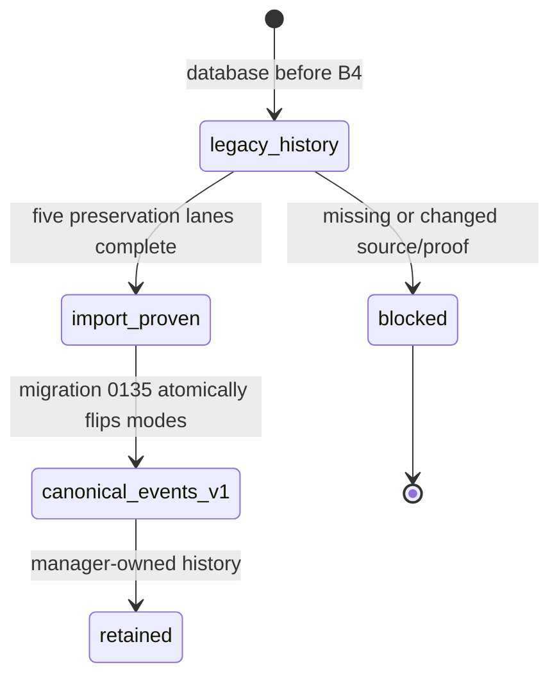
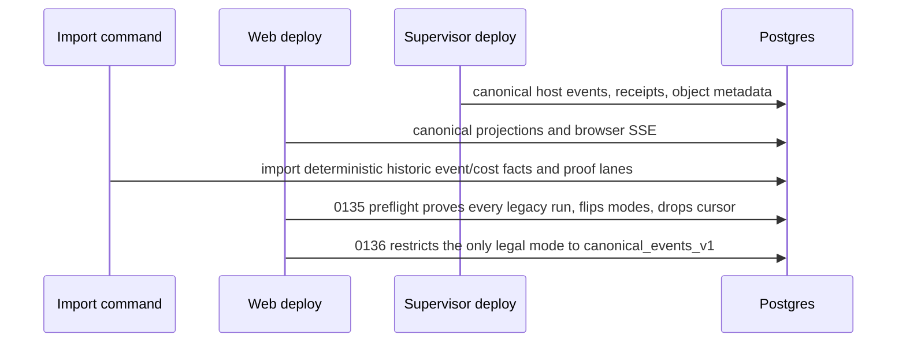

# Execution data-plane cutover

**Status:** Implemented canonical-only schema and destructive preflight guards, plus the staged operator migrator and the upgrade maintenance fence (S4.1); **Designed** complete historical byte/association import and isolated lifecycle qualification (AB-11/16). The current importer refuses ordinary Stage A logs and file locators, so an ordinary-history upgrade is not qualified.

## Purpose

Define incremental deployment, historical import, active-run safety, and
destructive removal of filesystem-affine manager readers. Every intermediate
release remains operable in the default one-host installation (host web/supervisor processes and Postgres-only compose).

## Domain entities

- `runs.execution_data_plane_mode` is immutable `canonical_events_v1` after
  migration `0136`; a pre-cutover database is not eligible for a partial B4
  migration.
- `execution_data_plane_imports` records five preservation lanes per historic
  run, including deterministic source fingerprint, position, terminal state,
  and bounded error.
- `run_session_incarnations` is the canonical historical association replacing
  `scratch_runs.supervisor_session_id` after proof.
- `artifact_projection_cursors` and legacy file locators were removed by
  migration `0135` only after import proof.
- A host that does not advertise the complete canonical data plane is rejected
  for new admission; there is no legacy selection path.

## State machine

## Process flows

## Historical import and guarded upgrade protocol (Designed)

The operator procedure is bounded and executable after S4. Normal web startup never mounts/reads the old runtime root. Choose a **maintenance-only HTTP listener on a local Unix socket inside the existing supervisor process**, reached by the operator CLI through an `ExecutionHostsAdmin` transport adapter. This adds no daemon, public authentication or TCP import route. The socket lives in an operator-owned 0700 directory with 0600 socket permissions; deployment must keep the normal web process outside that OS authority and qualification proves it cannot connect. The CLI temporarily reads approved historical sources. The supervisor loads an operator-selected frozen manifest locally, enables its exact import ID/generation/digest, and accepts only corresponding opaque item/chunk identities. Source paths never enter protocol bodies, logs or ordinary web services. Shutdown disables admission; restart requires explicit re-enablement of the same manifest and resumes its durable ledger.

The administrative protocol consists of `GET /imports/{importId}` for bounded progress, `PUT /imports/{importId}/items/{itemId}/chunks/{chunkIndex}` for an exact length/hash-bound chunk, `POST /imports/{importId}/items/{itemId}/seal`, and `DELETE /imports/{importId}/admission` to revoke further writes while retaining proof. Each request carries the enabled import generation and manifest digest; the host compares every item, offset, destination identity and declared size/hash with its manifest. Seal returns the ordinary object identity/full-representation digest and a durable import receipt. Same chunk/seal identity replays; conflicting bytes or generation returns a typed conflict. Readback uses the existing bounded object-read contract through the administrative adapter. A revoked generation cannot be reopened by an HTTP request. Use bounded request deadlines and same-ID reconciliation on timeout; none of these calls create an active assignment or bypass normal session authorization.

**Pre-cutover persistence:** use existing `execution_data_plane_imports` from 0131 for all five lanes and bounded progress. `last_source_position` carries a strict versioned compact cursor including manifest hash/position; `source_fingerprint` is the full lane manifest digest — both are **Implemented (S4.2)**: inventory commits every lane `pending` with `v1:phase=inventory:manifest=<lane digest>:items=<count>`. A supervisor-private SQLite import session/item/chunk ledger records detailed manifests and byte progress. It is operational import state, not another command or Flow ledger, so **S4.2 gives it its own maintenance database** (`import-<importId>.sqlite`, mode 0600, `user_version 1`) inside the operator-owned manifest directory rather than a table in the committed host-state lineage; it holds the manifest sessions, runs, lanes, items and blocks, is the ONLY place a raw source path is written, and is removed with the import authority. S4.3 adds its chunk/byte progress. New Postgres constraints/columns remain forward migrations after 0136; the pre-0134 importer must work without them.

**Inventory and deterministic mapping:**

| Source class at Stage A main | Discovery / mapping | Destination and proof |
| --- | --- | --- |
| `run.events.jsonl` | Incremental byte/line offsets; sessionName/nodeAttemptId/command/fence attribution from line and authoritative rows | Deterministic imported event IDs, full event count/fingerprint plus the complete original file as a raw-transcript object; canonical ordering/provenance without synthesizing native host live events. |
| `cost.jsonl` | Preserve session/run/step/attempt identity, token/cost facts and source positions | Canonical cost facts + rollup equality and the complete original file preserved as a cost-diagnostic object. Normalized facts alone are not byte-preservation proof. |
| `<step>.log` and nested raw logs | Actual main workspace registry/spawn producer; default file artifact locators are rooted under legacy run directory, not worktree | Immutable log segments/manifest, full bytes/read ranges, equivalent artifact locator and transcript association. Empty/large ordinary logs are valid. |
| Scratch `uploads/<scope>/<safeName>` and attachments | Persisted `storagePath`, declared MIME/name/size/hash; realpath confined to approved legacy root | Object-backed attachment preserving message/scope association and bytes. No guessed filename-only matching. |
| File artifact/evidence locators | Derive from artifact's original run root, kind, node attempt, evidence role and locator; include files discovered recursively | Exact object locator, validity/producer/required-evidence associations retained; any missing required payload blocks lane. |
| Session/incarnation/checkpoint metadata | DB sessions/assignments/ACP IDs, receipts and event provenance; preserve `session.json`/checkpoint files **if discovered** | Canonical historical associations plus preserved metadata bytes. No current main producer was found for those two filenames; do not fabricate them as routine outputs. |
| Transcript and manager-owned inline/gate/HITL artifacts | Existing durable DB content and deterministic event/log reconstruction | Preserve manager authority; compare exact message/role/order/content and associations. Do not move manager-authored state to host objects just because it is JSON. |
| Unknown/duplicate/discovered source | Classify each file and reference, including duplicate references to one file | Same bytes may share content chunks; distinct logical source/association IDs remain. Unclassified or conflicting source blocks completion. |

Item identity is a deterministic digest of manifest version, frozen source identity, run/association identity, relative-path identity digest, byte size and SHA-256. Raw paths remain only in the host-private manifest/operator source map; manager proof carries opaque IDs and hashes. Include exact old row fingerprints/locator values in the protected preservation record so resumed CAS can prove it is replacing the same association. Hash source before and after copy; open no-follow where appropriate and compare file identity; a mutable/changed source invalidates the manifest and lane. Never silently switch to the new bytes under the same key.

The host import path accepts a registered manifest, file/chunk index and declared content identity. Copy streams in ≤8 MiB chunks, stores offsets and hashes durably, verifies complete ordered file/segment manifest, and seals through the same runtime-object lifecycle. Logs larger than 25 MiB are segmented/chunked and remain fully readable as a typed historical representation. Do not impose the ordinary whole-upload limit on existing log history. Retry at chunk boundaries, distinguish an identical duplicate from a conflicting chunk, and never mark uploaded just because bytes were sent.

**Procedure and crash-safe checkpoints:**

1. Take a preliminary Postgres/host/source/adapter backup before maintenance. The rollback anchor is a **second, final coordinated snapshot after the drain/source freeze in step 2**, covering Postgres, host identity/SQLite/outbox/receipts/object roots, legacy runtime and relevant adapter journals. Record backup digests, software revisions and migration high-water. Prove restore to disposable storage before cutover. Do not restore only one side of a split checkpoint.
2. Enable maintenance/drain using the existing admission boundary plus an explicit upgrade maintenance fence (`MAISTER_UPGRADE_MAINTENANCE=1` on every web process, **Implemented (S4.1)**: it admits no run through the concurrency budget, starts no new prompt turn, claims no scheduler job and runs no system sweep, while cancel, checkpoint and HITL delivery stay open). Stop scheduler launches, resumes, new scratch/gate/agent turns, destructive GC and package postprocessing that can mutate inventoried sources. Drain active work or checkpoint/stop through accepted domain controls; `Review`, `NeedsInput*`, waiting children and active sync/package claims require explicit treatment. Satisfy the unchanged 0134 active-legacy status guard; do not merely relabel live runs terminal. Stop old web binaries before source freeze. Capture final associations, close writers and fsync/freeze source bytes. Now create the final coordinated backup set from step 1 and restore-test that exact post-drain set before proceeding.
3. Run the staged migrator through **0133 only**, using the existing filtered migration-root technique and verified journal hashes. Install/start the stabilization supervisor in restricted import mode. Pre-0134 manager CLI uses the compatibility projection of existing schema, not runtime services requiring forward columns.
4. Inventory all legacy runs, all five lanes, every source file/reference and owner association with paged scanning (**Implemented (S4.2)**: `execution-data-plane:import-legacy inventory --import-id <id> --manifest-dir <dir> [--batch-size N]`). Register the immutable host manifest; commit lane `state=pending` with manifest digest and `phase=inventory|copy|verify` in the versioned cursor (the pre-0134 state enum is `pending|complete|missing|failed`). No missing source counts as an empty lane. A genuinely absent lane gets an explicit inspected-empty proof with zero expected items, not a blanket zero — the lane digest binds that zero to the inspected directory listing, so a lane that was never walked cannot report the same proof as one walked and found empty. The phase refuses instead of guessing: `unclassified_source` and `non_regular_source` block a run before any lane row is written, `missing_association_payload` blocks the lane an artifact or attachment belongs to, `source_fingerprint_changed` refuses a run whose bytes moved since an earlier inventory, and `lane_already_complete` refuses to run out of phase order over a completed import.
5. Copy chunks through the authorized import path; host verifies/seals, manager performs real object metadata and byte readback and hash comparison. Persist progress after each committed chunk/item/page. A stopped invocation exits with resumable position and bounded unresolved counts; retry uses the same import session and manifest.
6. In bounded DB transactions, replace locators/attachment references and historical session associations only after verified destination bytes; compare exact original row fingerprint and owner identity. Commit source→object association proof with the locator change. Do not discard artifact validity, kind, nodeAttemptId, message association, or delivery hold. A completed lane revalidates its full fingerprint on rerun.
7. Scratch with one provable assignment follows 0134's existing preservation. For a nonnull mirror with multiple historical assignments, derive a **unique exact session/command/event binding**, preserve the original mirror and row digests in the durable manifest, materialize matching canonical session/incarnation rows, verify the round-trip, then CAS-clear only that proven migrated mirror before unmodified 0134. Never delete assignments or clear an unproven mirror. Truly ambiguous/conflicting histories refuse with remediation; preserve sources/backup for explicit source mapping repair. A user-supplied mapping must be evidence-bound and audited, not a force-success flag.
8. Apply **0134 only** with all its original guards. Reverify canonical associations against the **original** frozen manifest afterward; 0134 may rewrite the scratch lane to a no-mirror proof, which alone is insufficient. Restore/complete the lane's verified original source counts and association fingerprint through the importer before proceeding.
9. Verify all five lanes: `events`, `transcript`, `cost`, `runtime_objects`, `scratch_session`; compare expected/imported counts and bytes, hashes, metadata, locators, association multiplicities and no unresolved items. Verify backups and source freeze again. Persist complete only when every lane's real proof holds. Keep 0135's existing five-lane preflight intact; add stronger orchestrator checks, never relax its SQL to accommodate broken input.
10. Run unmodified **0135–0136**, then apply the new forward correction migrations. Enforce an application/schema capability gate that refuses old writer binaries after cutover; use a DB backstop for newly mandatory immutable owner/request invariants so stale writers cannot silently create invalid rows. `db:generate` must report no schema changes at the final schema. No hand-adjusted migration ledger/hashes.
11. Start current web with host runtime root/source snapshot inaccessible. Run history/transcript/cost/artifact/HITL/resume qualification and reconcile sealed orphan items/tombstones from every partial upload. Turn off import mode and remove its one-time authority after success. Source/backup deletion is a separate operator retention action after confirmed acceptance, never part of generating proof.

**Operator CLI contract.** The staged migrator is **Implemented (S4.1)**: `db:migrate --stage execution-ab-additive` applies everything through `0133` and proves `0134` onward is still pending, `--stage execution-ab-associations` applies `0134` alone, and `--stage execution-ab-finalize` applies `0135` onward. Each stage refuses instead of guessing — `stage_out_of_order` when an earlier stage is still pending, `ledger_high_water_drift` when a planned migration sits at or below the ledger high-water that drizzle would silently skip, and `active_legacy_work` (with a bounded count and the run identifiers) before either destructive stage. A stage whose migrations are already committed reports satisfied and exits zero, so a retry is safe. Each run logs the stage, the planned tags with their committed ledger hashes, the withheld tags and the remaining unresolved count; `db:migrate` with no `--stage` keeps its existing single-chain behaviour and its committed guards unchanged. The importer reads its own window from the schema the database actually carries and refuses `additive_stage_missing` before the additive stage or `already_canonical` once `0135` has run; it stamps every line with its `--import-id` (generated when absent), the stage and the unresolved run count. The `inventory` subcommand and `--batch-size` are **Implemented (S4.2)**: one CLI mode does one operation, it copies nothing and completes nothing, and it prints opaque lane/source identities, sizes, counts and hash state — never a raw source path, which stays in the host-private manifest. **Planned (S4.3-S4.5):** the remaining `copy`, `verify` and `finalize-proof` subcommands with `--max-bytes` and `--resume`. The operator source root is a local CLI/environment input confined to inventory/import; API bodies use manifest item IDs. Commands print opaque IDs, bounded counts and remediation codes, not raw source paths. A dry inventory emits no complete proofs. One CLI mode does one operation; implement separate functions instead of boolean multimode helpers.

Executable qualification invokes these commands individually against a restored real Stage A database, interrupts each phase, restarts supervisor/CLI, completes guarded cutover, and compares readback to the untouched original snapshot. Include already-canonical databases, stopped pre-0134 databases and fresh installs. If an already-cut-over database lacks byte/association proof, inventory the retained source/backup and repair forward; if sources are unavailable, report unrecoverable evidence and do not invent successful preservation.

## Expectations

- **CUT-01:** Each current run is admitted only in immutable canonical data-plane mode with no per-call fallback.
- **CUT-02 (Designed correction):** The bounded deployment order is supervisor capability → web canonical projection → historic import → `0135`/`0136`; a mixed version never silently selects legacy behavior.
- **CUT-03 (Designed correction):** Historical legacy runs are imported idempotently with deterministic fingerprints or retain explicit failed proof and block the destructive migration.
- **CUT-04:** `0135` starts only when its preflight proves every legacy run has all five completed preservation lanes.
- **CUT-05 (Designed correction):** Scratch mirrors and artifact cursors are removed only after canonical association/preservation proof, otherwise migration aborts.
- **CUT-06:** Compatibility reader/writer authority is removed in a bounded release and canonical runs never consult legacy files.
- **CUT-07 (Designed correction):** Import, projection, and object migration record durable resume state after any partial failure; a completed import verifies the same fingerprints on re-entry.
- **CUT-08 (Designed correction):** Reconciliation is idempotent after database/transport/host/manager failure and never infers terminal success from absence.
- **CUT-09 (Designed correction):** Final web startup and history, SSE, prompt completion, cost, and artifact access require no host runtime-data mount.
- **CUT-10:** Default one-host operation needs no enrollment, relay or object store; historical upgrade uses the bounded operator maintenance procedure.
- **CUT-11 (Designed correction):** Stage A fencing, receipt recovery, checkpoint, HITL resume, cancellation, completion, and deferred release remain non-regressing.
- **CUT-12:** Repository/Git/worktree authority, multiple placement, remote trust, and cross-host ACP resume remain Stage C/D boundaries.

## Edge cases

- **EDGE-CUT-01:** A malformed legacy line or conflicting association sets failed import state with source position/fingerprint and blocks B4 (`IT-CUT-07-MALFORMED`).
- **EDGE-CUT-02:** A uniquely provable legacy scratch mirror creates a canonical legacy incarnation with provenance, but ambiguity aborts (`IT-CUT-05-SCRATCH`).
- A supervisor-first rollout emits canonical host outbox data; a web-first rollout only admits a host whose complete canonical capability is advertised. If the supervisor is unavailable at web boot, the next lazy host resolution and each periodic system sweep repeat the idempotent registration-plus-consumer activation, so active outbox data cannot remain disconnected until another web restart. The final migration is intentionally blocked until historical import proof is present.
- Assignment expiry, epoch supersession, host restart, or manager restart resumes durable reconciliation without a mode switch.

## Linked artifacts

- [ADR-167](../decisions/adr-167.md) fixes the compatibility strategy and deferred boundaries.
- [Execution event plane](execution-event-plane.md), [prompt lifecycle](execution-prompt-lifecycle.md), and [runtime objects](execution-runtime-objects.md) own the migrated domains.
- [Reconciliation and GC](reconciliation-gc.md), [scratch runs](scratch-runs.md), and [runs](runs.md) own existing recovery callers.
- [Database schema](../database-schema.md) and [execution-host domain](../db/execution-hosts-domain.md) document additive/import/destructive records.
- `IT-*` and `CT-*` labels name specification scenarios. Complete-history import and real isolation require AT-11/16; passing the existing limited fixtures does not establish them.

### Stage B requirement traceability

The retained identifiers below are historical scenario aliases, not executed test names. Enforcement task IDs refer to the original Stage B plan. All rows require current qualification; the [A/B requirement matrix](execution-hosts.md#ab-stabilization-requirements) assigns correction tasks and primary AT cases, and the [test lanes](test-infrastructure.md#ab-stabilization-test-lanes-designed) identify actual runners and files.

| Requirement | Contract/schema          | Enforcement/task                  | Primary test | Status   |
| ----------- | ------------------------ | --------------------------------- | ------------ | -------- |
| EVT-01      | web-runs AsyncAPI        | canonical query T2.2/T2.3         | IT-EVT-01    | Acceptance unverified |
| EVT-02      | host AsyncAPI/outbox     | atomic append T1.1                | IT-EVT-02    | Acceptance unverified |
| EVT-03      | event unique constraints | ingest T0.4/T1.3                  | IT-EVT-03    | Acceptance unverified |
| EVT-04      | decimal/run counter      | allocator/lock T1.1/T1.3          | IT-EVT-04    | Acceptance unverified |
| EVT-05      | stale disposition        | ingest/projectors T1.3/T2.1       | IT-EVT-05    | Acceptance unverified |
| EVT-06      | replay/ACK/gap schema    | consumer T1.2/T1.3                | IT-EVT-06    | Acceptance unverified |
| EVT-07      | SSE/ACK cursors          | host/manager recovery T1.1–T1.3   | IT-EVT-07    | Acceptance unverified |
| EVT-08      | payload/error schema     | redactors T0.3/T1.1/T1.3          | CT-EVT-08    | Acceptance unverified |
| EVT-09      | capability limits        | outbox pressure T1.1              | IT-EVT-09    | Acceptance unverified |
| EVT-10      | consumer schema          | projector CAS T1.4                | IT-EVT-10    | Acceptance unverified |
| EVT-11      | web-runs AsyncAPI        | browser mapper T2.2               | IT-EVT-11    | Acceptance unverified |
| EVT-12      | ADR/retention spec       | outbox prune T1.1/T4.4            | IT-EVT-12    | Acceptance unverified |
| PRM-01      | prompt contract          | host admission T3.1               | IT-PRM-01    | Acceptance unverified |
| PRM-02      | command idempotency      | receipt invariant T3.1            | IT-PRM-02    | Acceptance unverified |
| PRM-03      | prompt spec              | async host/drivers T3.1/T3.3      | IT-PRM-03    | Acceptance unverified |
| PRM-04      | owner schema/index       | continuation T0.4/T3.2            | IT-PRM-04    | Acceptance unverified |
| PRM-05      | turn_lost schema         | startup repair T3.1               | IT-PRM-05    | Acceptance unverified |
| PRM-06      | terminal errors          | reconciliation T1.4/T3.2          | IT-PRM-06    | Acceptance unverified |
| PRM-07      | terminal schemas         | heartbeat reducer T3.1            | IT-PRM-07    | Acceptance unverified |
| PRM-08      | HITL/checkpoint schema   | host/owners T2.1/T3.3             | IT-PRM-08    | Acceptance unverified |
| PRM-09      | cancel contract          | Stage A ledger T3.1/T3.3          | IT-PRM-09    | Acceptance unverified |
| PRM-10      | fenced receipt/event     | pre-ACP fence T3.1                | IT-PRM-10    | Acceptance unverified |
| PRM-11      | PromptHandle contract    | DB query T3.2                     | IT-PRM-11    | Acceptance unverified |
| PRM-12      | retention spec           | command prune T3.2/T4.4           | IT-PRM-12    | Acceptance unverified |
| OBJ-01      | object/locator schema    | catalog/transport T3.4/T3.5       | CT-OBJ-01    | Acceptance unverified |
| OBJ-02      | web object API           | server-derived auth T3.5          | IT-OBJ-02    | Acceptance unverified |
| OBJ-03      | command kinds/checks     | Stage A ledger T3.4               | IT-OBJ-03    | Acceptance unverified |
| OBJ-04      | metadata checks          | seal validator T3.4               | IT-OBJ-04    | Acceptance unverified |
| OBJ-05      | upload contract          | atomic rename T3.4                | IT-OBJ-05    | Acceptance unverified |
| OBJ-06      | range contract           | host/web stream T3.4/T3.5         | IT-OBJ-06    | Acceptance unverified |
| OBJ-07      | object errors/states     | catalog resolver T3.4/T3.5        | IT-OBJ-07    | Acceptance unverified |
| OBJ-08      | redaction taxonomy       | allowlists T3.4/T4.4              | IT-OBJ-08    | Acceptance unverified |
| OBJ-09      | ownership spec           | catalog boundary T3.5             | IT-OBJ-09    | Acceptance unverified |
| OBJ-10      | artifact spec            | output/evidence adapter T3.5      | IT-OBJ-10    | Acceptance unverified |
| OBJ-11      | delete contract          | tombstone/unlink T3.4             | IT-OBJ-11    | Acceptance unverified |
| OBJ-12      | retention/catalog        | GC/payload route T3.5/T4.4        | IT-OBJ-12    | Acceptance unverified |
| CUT-01      | run-mode/trigger         | admission/writers T0.4/T0.5       | IT-CUT-01    | Acceptance unverified |
| CUT-02      | compatibility spec       | capability decision T0.5          | IT-CUT-02    | Acceptance unverified |
| CUT-03      | import schema            | importer/views T4.1               | IT-CUT-03    | Acceptance unverified |
| CUT-04      | cutover spec             | B4 preflight T4.1                 | IT-CUT-04    | Acceptance unverified |
| CUT-05      | destructive migration    | preserve guards T4.1/T4.3         | IT-CUT-05    | Acceptance unverified |
| CUT-06      | source guard/ADR         | deletion gate T4.2/T4.3           | ST-CUT-06    | Acceptance unverified |
| CUT-07      | import state             | resumable import T4.1             | IT-CUT-07    | Acceptance unverified |
| CUT-08      | reconciliation spec      | recovery sweeps T1.4/T4.1         | IT-CUT-08    | Acceptance unverified |
| CUT-09      | deployment contract      | mount-free harness T2.5/T3.6/T4.2 | E2E-CUT-09   | Acceptance unverified |
| CUT-10      | compose/config           | default deployment T0.5/T4.4      | SM-CUT-10    | Acceptance unverified |
| CUT-11      | Stage A suite            | lifecycle regressions T2.5/T3.6   | E2E-CUT-11   | Acceptance unverified |
| CUT-12      | ADR/inventory            | scope gate T0.1/T4.4              | ST-CUT-12    | Acceptance unverified |

| Edge case   | Contract/schema           | Enforcement/task              | Primary test        | Status   |
| ----------- | ------------------------- | ----------------------------- | ------------------- | -------- |
| EDGE-EVT-01 | event constraints         | duplicate classifier T1.3     | IT-EVT-03           | Acceptance unverified |
| EDGE-EVT-02 | event constraints         | conflict classifier T1.3      | IT-EVT-03-CONFLICT  | Acceptance unverified |
| EDGE-EVT-03 | replay floor error        | recovery T1.2/T1.3            | IT-EVT-06-FLOOR     | Acceptance unverified |
| EDGE-EVT-04 | stream-bound ACK          | ACK endpoint T1.2             | IT-EVT-07-ACK-RACE  | Acceptance unverified |
| EDGE-EVT-05 | sequence/timestamp schema | boundary parser T0.3/T1.3     | CT-EVT-05           | Acceptance unverified |
| EDGE-EVT-06 | quarantine schema         | ingest T0.3/T1.3              | CT-EVT-08           | Acceptance unverified |
| EDGE-EVT-07 | command/assignment fence  | ingest/projector T1.3/T1.4    | IT-EVT-05           | Acceptance unverified |
| EDGE-PRM-01 | receipt/event contract    | prompt reconcile T3.1/T3.2    | IT-PRM-02-ACK-LOSS  | Acceptance unverified |
| EDGE-PRM-02 | turn_lost schema          | startup repair T3.1           | IT-PRM-05           | Acceptance unverified |
| EDGE-PRM-03 | terminal conflict error   | reconciliation T1.4/T3.2      | IT-PRM-06           | Acceptance unverified |
| EDGE-PRM-04 | receipt event linkage     | reconciliation T1.4/T3.2      | IT-PRM-06           | Acceptance unverified |
| EDGE-OBJ-01 | object auth errors        | host/web validation T3.4/T3.5 | IT-OBJ-02-PATH      | Acceptance unverified |
| EDGE-OBJ-02 | range contract            | range parser T3.4             | IT-OBJ-06           | Acceptance unverified |
| EDGE-OBJ-03 | immutable metadata        | conflict validator T3.4       | IT-OBJ-04-CONFLICT  | Acceptance unverified |
| EDGE-CUT-01 | import state              | importer T4.1                 | IT-CUT-07-MALFORMED | Acceptance unverified |
| EDGE-CUT-02 | mirror preserve rule      | migration T4.3                | IT-CUT-05-SCRATCH   | Acceptance unverified |
