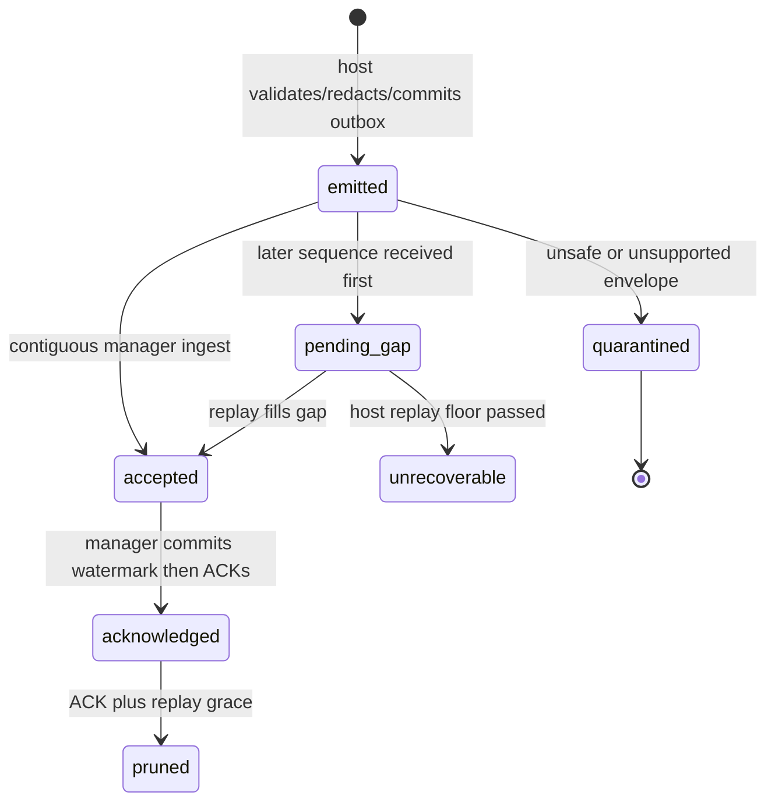
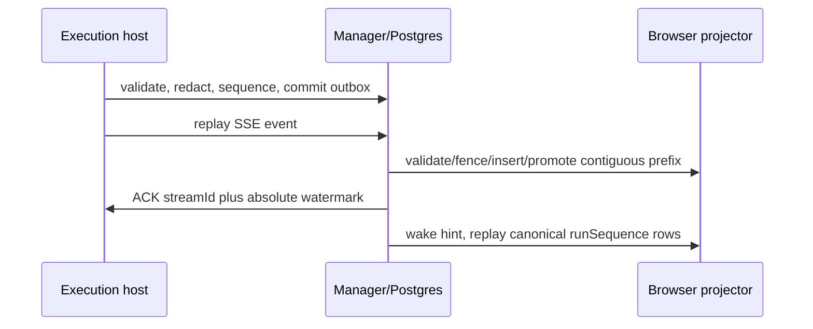

# Execution event plane

**Status:** Implemented — B4 makes this the only manager event authority.
Execution hosts retain private outbox/runtime files, but neither browser nor
manager projection reads a host runtime path.

## Purpose

Define the durable, transport-neutral event plane between an execution host and
the manager so that event delivery, replay, and browser state no longer depend
on a supervisor runtime filesystem. The manager owns canonical redacted event
metadata; the host owns ACP processes, private SQLite outbox state, and private
files.

## Domain entities

- `RuntimeEventEnvelope` is the closed v1 spine with open negotiated payload.
- `event_stream` and `event_outbox` are host-private SQLite durability records.
- [`execution_event_streams`](../database-schema.md) records host stream
  watermarks, gap state, replay floor, and claims in Postgres.
- `execution_events` is the manager canonical event log with host,
  manager-originated, and legacy-import source shapes.
- `execution_event_consumers` records one durable projector cursor per run.
- `execution_event_ingest_failures` retains bounded malformed/quarantine
  metadata without retaining untrusted payload content.

## State machine

## Process flows

The local-direct SSE adapter uses `Last-Event-ID` as an exclusive decimal host
cursor and binds every ACK to `streamId`. A future trusted relay may implement
the same event-source and ACK contracts; it may not change event ownership or
ordering semantics.

## Expectations

- **EVT-01:** Postgres is canonical for browser and projector event reads, never supervisor memory or runtime files.
- **EVT-02:** The host commits each validated redacted event to SQLite before publication or terminal acknowledgement.
- **EVT-03:** At-least-once delivery creates one canonical event and conflicting ID or stream-position reuse is a typed protocol failure.
- **EVT-04:** Host order is `(streamId, sequence)` and run order is manager-allocated `runSequence`, never occurrence timestamp.
- **EVT-05:** A stale assignment epoch remains ACKable audit evidence but has no current-run sequence or state mutation.
- **EVT-06:** A persisted gap blocks ACK/projection past the contiguous prefix and replays or fails explicitly at the replay floor.
- **EVT-07:** Host and manager restarts resume from durable outbox/watermark state, and lost ACKs cause harmless replay.
- **EVT-08:** Only negotiated type/schema pairs persist after deterministic redaction, and unsafe raw payloads are neither stored nor logged.
- **EVT-09:** Bounded outbox pressure rejects new mutating admissions before existing session events are lost.
- **EVT-10:** Each projector owns a durable per-run cursor and poison state independent of accepted ingest.
- **EVT-11:** Browser replay is authorized, exclusive-after-cursor, bounded, and sourced only from canonical user-safe rows.
- **EVT-12:** Canonical events retain with the run while host outbox rows prune only after confirmed ACK and grace.

## Edge cases

- **EDGE-EVT-01:** An identical duplicate is a no-op insert and repeats the current contiguous ACK (`IT-EVT-03`).
- **EDGE-EVT-02:** A conflicting event ID or stream position degrades the stream without ACKing past it (`IT-EVT-03-CONFLICT`).
- **EDGE-EVT-03:** A missing sequence below replay floor produces `event_gap_unrecoverable` and explicit recovery work (`IT-EVT-06-FLOOR`).
- **EDGE-EVT-04:** An ACK for a replaced stream fails with `event_stream_mismatch` (`IT-EVT-07-ACK-RACE`).
- **EDGE-EVT-05:** Invalid decimal sequences fail with `invalid_event_sequence`; valid skew is metadata and increments a metric (`CT-EVT-05`).
- **EDGE-EVT-06:** Unknown schema or redaction failure retains only bounded spine/error metadata (`CT-EVT-08`, `IT-EVT-08-QUARANTINE`).

## Linked artifacts

- [ADR-167](../decisions/adr-167.md) records ownership, transport, and deferred trust boundaries.
- [Execution-host contract](execution-hosts.md) supplies host identity and assignment fencing.
- [Host event AsyncAPI](../api/async/execution-host-events.asyncapi.yaml) and [web run AsyncAPI](../api/async/web-runs.asyncapi.yaml) define the wire and browser surfaces.
- [Database schema](../database-schema.md) and [execution-host ERD domain](../db/execution-hosts-domain.md) define durable records.
- Primary implementation tests are `IT-EVT-01` through `IT-EVT-08` in B1/B2, with contract tests `CT-EVT-01` through `CT-EVT-08` in B0.
