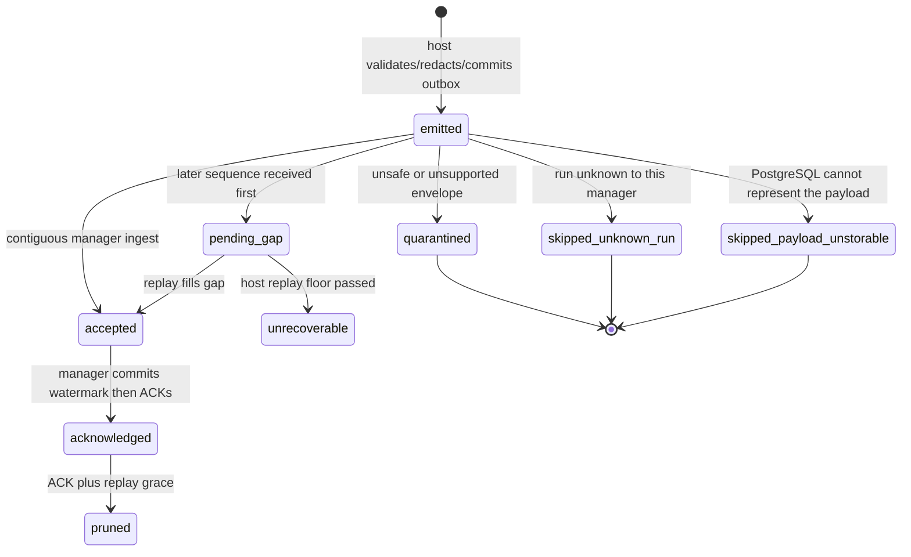
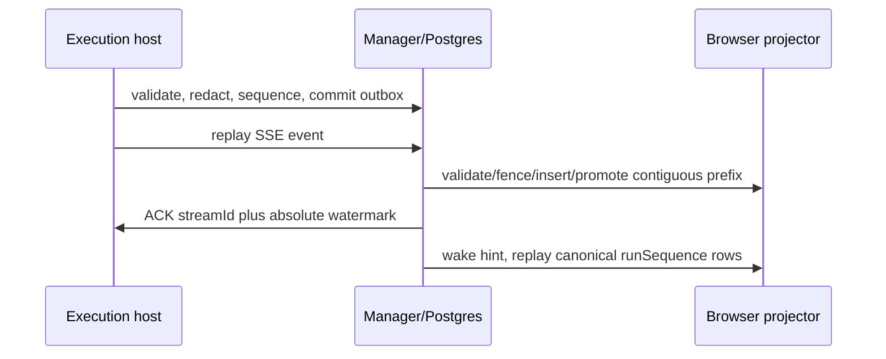

# Execution event plane

**Status:** Implemented canonical Postgres authority, bounded referenced output, retained outbox/file accounting and autonomous projection (AB-01–04). The S1 release gate is in progress; durable command-owner reconciliation is Implemented — the prompt-owner recovery worker and the two continuation workers run in the production web boot (ADR-176).

## Purpose

Define the durable, transport-neutral event plane between an execution host and
the manager so that event delivery, replay, and browser state no longer depend
on a supervisor runtime filesystem. The manager owns canonical redacted event
metadata; the host owns ACP processes, private SQLite outbox state, and private
files.

## Domain entities

- `RuntimeEventEnvelope` is the closed v1 spine with open negotiated payload.
- `event_stream` and `event_outbox` are host-private SQLite durability records.
- [`execution_event_streams`](../database-schema.md) records host stream
  watermarks, gap state, replay floor, and claims in Postgres.
- `execution_events` is the manager canonical event log with host,
  manager-originated, and legacy-import source shapes.
- `execution_event_consumers` records one durable projector cursor per run.
- `execution_event_ingest_failures` retains bounded malformed/quarantine
  metadata without retaining untrusted payload content.
- `execution_event_skips` records a sequence this manager deliberately dropped:
  stream, host sequence, event id, run id, event type, reason, occurred-at. Its
  `run_id` is plain text, not a foreign key — the run it names does not exist
  here, which is the whole reason the row exists. Its `reason` is
  `unknown_run` or `payload_unstorable`.

## State machine

## An event for a run this manager does not own

`execution_events.run_id` is a real foreign key, so an event naming a run this
database has never seen cannot be stored — and it can never become storable,
because a run id is never created retroactively. Refusing it therefore has no
retry that could succeed.

Refusing it used to abort the ingest transaction. The consumer recorded the
failure, reconnected, and the replay handed back the same event, permanently.
The cost was not the dropped event but everything behind it: the contiguity
walk stops at the first missing sequence, so the stream never advanced past the
offending position. Measured on a dev host, four foreign events held 689 later
events of a LIVE run hostage and prompt admission stopped host-wide, while
`execution_hosts.readiness` still reported `ready` and the affected nodes failed
with the unrelated-looking `EXECUTOR_UNAVAILABLE`.

Such an event is now recorded in `execution_event_skips` and the contiguity walk
steps over that sequence. A redelivery resolves as a duplicate. The drop is
logged at warn — an event for a run this manager does not own is never routine,
and the ledger is what makes it answerable later.

Reachable without any misconfiguration: `execution_events.run_id` cascades on
delete, so deleting a run with events in flight lands in the same place.

## An event PostgreSQL cannot store

`execution_events.payload` is `jsonb`, and `jsonb` cannot represent `U+0000` or
an unpaired surrogate: the insert raises `22P05`. Agent output contains both —
a coding agent editing a string literal that spells a NUL escape is the case
that stopped ingest host-wide for 15 h on 2026-09-16. The failing insert was
retried forever, so the contiguity walk never passed that sequence and every
later event of every run stayed behind it, while the stream still reported
`state=active` and the host `readiness=ready`.

Two independent guarantees now apply, in this order.

**The payload is made storable.** Ingest escapes those characters reversibly
into the Private Use Area before the payload, its digest and its byte count are
computed, so all three describe the same stored value. The escape is a storage
representation only: the transcript reader decodes it, so what the agent wrote
is what a person reads. Escaping the *stringified* form would be a no-op —
`JSON.stringify` has already turned a NUL into a six-character escape, and that
escape is what later breaks a `::jsonb` cast.

**An event PostgreSQL still refuses never holds the stream.** A deterministic
write failure (`22P05`, `22P02`, `22021`) is recorded in
`execution_event_skips` as `payload_unstorable`, the watermark advances past
that sequence and the walk continues — the same terms an event for an unknown
run already gets, and for the same reason: no retry could ever succeed. It is
logged at warn; it is never routine.

## Stream liveness

Nothing read `execution_event_streams.last_seen_at` before this: it, the gap
columns, `last_error` and `next_retry_at` were all write-only, and the `lost`
and `closed` states were unreachable. That is why a dead stream reported
healthy for 15 hours.

A stall CANNOT be defined as elapsed silence. There is no heartbeat event type
— every runtime event is session- or runtime-object-scoped — and one stream row
serves a whole host, so a quiet stand legitimately emits nothing. The stall is
the conjunction: `last_seen_at` older than `MAISTER_EVENT_STREAM_STALL_SECONDS`
(default 300) **and** the host `ready` **and** at least one `delivering` or
`accepted` command that ought to be producing events.

The response is repair first. The `system_sweep` pass restarts the stream's
consumer loop and records that it tried; if the restarted loop makes progress
`last_seen_at` moves and nothing is marked. Only a stream a restarted consumer
still cannot advance is degraded to `state='lost'`. Degrading is the admission
that automatic repair failed, never the first move. A `lost` stream is what the
command-impasse signal reads.

Two supporting corrections make that predicate honest: a `duplicate` ingest now
advances `last_seen_at` (it proves the stream is alive even though no watermark
moves, so a replay loop is no longer indistinguishable from an idle host), and
the consumer's two silent reconnect paths — a failed post-ACK watermark record,
and a lost or changed claim — now log and record instead of retrying every 2 s
in complete silence.

### Lag versus stall (Implemented — P0-7, 2026-09-22)

Lag is computed observability and is never an `execution_event_streams.state`
or a reason to degrade a stream. Stall/lost retains the repair-first authority
above. Duplicate traffic may advance `last_seen_at`, so no lag formula uses
silence as progress. With a known empty cursor represented as `-1` internally,
all sequence arithmetic uses bigint and serializes as canonical decimal strings:

- ingest distance = `hostHead - last_received_sequence`;
- manager gap distance = `last_received_sequence - last_contiguous_sequence`;
- ACK-confirmation distance = `last_contiguous_sequence - last_ack_confirmed_sequence`;
- projection backlog = `max(accepted run_sequence) - consumer.last_run_sequence`.

The accepted horizon filters `ingest_disposition='accepted' AND run_sequence IS
NOT NULL`, matching projector work. A first event at sequence zero behind a null
cursor is backlog one. Distances describe sequence positions rather than an
exact missing-row count when a sequence gap exists. Missing host telemetry,
inconsistent manager watermarks, a cached host head behind the manager, and
identity replacement are `unknown`, never zero or a clamped healthy value.

Projection candidates are all non-terminal runs with registered consumers,
including parked runs. Their horizons use the `(run_id, run_sequence)` index;
the read model orders the complete eligible population by backlog with stable
run/consumer tie-breakers before returning top 20 and exact totals. Current
host attribution comes only from the active execution assignment. Unassigned
runs remain visible as unattributed; historical ownership is not guessed.
Poisoned consumers are queried separately, including terminal runs, with stable
20-row pagination and the event/cursor/error-generation needed by the existing
rearm command.

The default warning threshold is backlog greater than 100 for at least 120 s
(`MAISTER_EVENT_STREAM_LAG_SECONDS`) while a manager watermark advances in
three consecutive, fresh `system_sweep` observations for the same
host/stream/boot identity. `last_served_at` is informational only because a
claim updates it. Projection age tracks whether the maximum attributed backlog
over the full population remained above threshold; it does not claim that the
same consumer was behind throughout. At streak three one
`runtime-event-stream-lagging` WARN opens an incident. A complete sample with
both host and projection lanes at or below 100 clears it and emits one
`runtime-event-stream-lag-recovered` INFO. No sequence progress while backlog
remains is `not_advancing`, not recovery. Missing/stale sources reset the streak
and preserve an open incident; lost/closed or identity replacement resets it
without a recovered claim.

The observer persists bounded versioned evidence inside the existing terminal
`system_sweep` attempt summary. It does not write stream error/state/readiness
or run state. Observer failures are diagnostic errors only: they do not enter
the sweep's failure bundle, increment consecutive scheduler failures, or
disable recovery work. The admin read is read-only and cannot advance a streak
or emit transitions.

Qualification uses the real supervisor outbox and real PostgreSQL. It creates
more than 100 host events through ordinary checkpoint commands, advances the
production consumer in bounded passes, holds and releases a real projection
cursor, and then invokes the unchanged two-pass stall detector. The collector
test includes 50,000 accepted events, requires the indexed horizon plan, and
caps the complete read below two seconds on the qualification host.

## Process flows

The local-direct SSE adapter uses `Last-Event-ID` as an exclusive decimal host
cursor and binds every ACK to `streamId`. A future trusted relay may implement
the same event-source and ACK contracts; it may not change event ownership or
ordering semantics.

## Referenced session content (Implemented, S1.2)

The bounded segment path is qualified on Node 24.15 and 24.19. Real manager
readback covers exact frame/text/tool boundaries and historical assignment
release. A 20-producer heap-profile gate exercises escaped maximum-size frames,
gate-chat capacity and producer-local failure, then verifies complete buffer
release. The full S1 release still requires saturated-outbox wallets and
compatibility/deployment qualification; complete durable owner output is S2.

A session payload that cannot be represented exactly within the canonical
metadata limits uses `contentRef` instead of inline content. The event type and
v1 envelope stay unchanged; the payload version is `maister.session.content.v2`.
Old managers reject that unknown version before ACK. The payload is closed:
`sourceMonotonicId`, `sessionName`, optional `nodeAttemptId` and `contentRef`.
The reference is a closed `maister.session-content.v2` descriptor containing
`commandId`, `hostSessionId`, `source`, `firstFrame`, `frameCount`
and ordinary sealed runtime-object metadata (`objectId`, generation, size,
SHA-256, kind, logical name, MIME, retention, state and seal/expiry timestamps).
The envelope supplies the run, host and assignment fence. This same event is
the object's availability evidence; a separate availability event is not
required. The referenced UTF-8 JSON contains the complete original session
payload, without truncation or redaction. It is limited to 2 MiB (a 1-MiB raw
JSON line can require additional escaping in its containing JSON string).
The host writes an exclusive private inode, fsyncs and renames it before
committing the reference. A failed capture cannot produce a successful empty
payload. Current prompt identity, or the creating command outside a prompt,
binds each segment; these segments do not replace command-terminal output.
`firstFrame` equals the source monotonic ID and `frameCount` is one. `source`
is `raw_stdout` for a line, `terminal_output` for command/session terminal
content and `session_update` for other session events. Multi-frame pressure
segments use the separate raw-object format described below.

The output pool accounts for accumulated gate-chat text at its UTF-16 storage
size before concatenation (at most 2 MiB per producer and within the shared
10-MiB pool). Capacity failure produces `required_output_incomplete` with
`outputFailure=producer_retained_limit`; it cannot manufacture a successful
empty reply. Already committed chunks remain readable. S2 supplies the durable
command-wide output continuation. Permission dispatch retains its decoder
permit through asynchronous guard evaluation; only the bounded RPC identity
remains pending across HITL. IDs are at most 128 UTF-8 bytes, with at most 32
pending permission replies per producer.

`boundedAcpStream` requires the object-mode output of `captureAcpFrames`, with
exactly one complete newline-terminated ACP frame per iterator value; a byte-mode
source is refused at construction with `ACP_PROTOCOL`, reason
`required_output_incomplete` and `outputFailure=producer_frame_invalid`.

Metadata subscriptions expose the reference. Trusted projection/owner readers
and content-authorized session/browser readers verify the run/fence, catalogue
generation, length and actual byte digest before decoding. Accepted historical
content can materialize its catalogue row after assignment release by joining
the exact source command and original assignment; this grants no current owner
mutation authority. Preparation happens
outside domain projection transactions, within a bounded quantum; the domain
write and cursor still commit together. Unavailable content is retryable and
cannot advance the cursor. Full raw payloads never enter the canonical event
table or a general metadata DTO. A browser read of reconstructed output uses
the same repository-content permission as the corresponding object download.

## Outbox partitions and producer pressure (Implemented)

Logical admission and append accounting use the same transactional row/byte
counters. ACKed rows continue to count until replay grace expires and pruning
removes them. SQLite v8 records ACK timestamps in compact contiguous ranges
without updating payload rows; duplicate ACKs preserve the original grace
start. Existing v7 row timestamps remain readable. Pruning removes only an
eligible contiguous prefix, bounded to 100 rows and 1 MiB per transaction,
then yields before the next page. A backward clock cannot skip a protected
range and advance the replay floor over retained evidence. Low/soft/hard hysteresis prevents repeated admission at the soft
boundary. Regular storage is separate from control and the emergency floor;
the exact validated defaults are owned by [configuration](../configuration.md).

Accepting a session create reserves `(18 + output binding count)` control rows
with its receipt, before spawning. Each control row is at most 16 KiB. A
producer owns at most one accepted prompt; duplicate command IDs reattach.
Checkpoint/cancel/delete reserve their acceptance and completion credits and
serialize against another live teardown. Under pressure, a new ID cannot
repeat an already accepted step. The existing ID replays without another spend.
Committed control rows remain charged after unused wallet credits return.

Before decoding a complete ACP frame, the producer reserves four regular event
rows and 4 MiB for its raw line, optional cost, semantic notification and one
guardrail event. Captured partial frames stay on disk; capacity waits hold no
decoder permit. Commit-driven notifications wake paused readers after capacity
returns below the low watermark. This does not poll runtime files.

An independent checkpoint/delete can stop a producer whose shared stdout pipe
is paused. Before its terminal evidence, the host seals the captured unsequenced
bytes into one immutable `raw_transcript` object named `stdout-overflow.ndjson`,
MIME `application/x-ndjson`, at most 2 MiB. A wallet-funded
`runtime_object.available` event carries ordinary metadata plus a closed
`stdoutSegment` descriptor: source `commandId`, `firstLogByteOffset`,
`capturedBytes`, `completeFrames` and `trailingFrameBytes`. The envelope binds
the host session and assignment. Each incarnation creates its own exclusive raw log. Offsets are bytes in that log;
newline boundaries in the exact object delimit complete frames. A captured
prefix is retained even when draining exceeds its bound or ends mid-frame.
The interrupted prompt fails with `required_output_incomplete`; raw preservation
does not claim that skipped semantic callbacks completed successfully.

SQLite admission measures DB/WAL/SHM size, page/free-page counters and disk free space. Pending object copies, logs, spools and producer/frame promises are durably charged before host-managed writes; startup inventories retained files before admission. Native storage failures latch unavailable readiness and preserve evidence. Host, pressure/restart, pinned-reader, maximum-output and 20-producer memory tests exercise these paths. Exact defaults and physical headroom arithmetic live in [configuration](../configuration.md#ab-stabilization-resource-budget-designed). These are application admission bounds; arbitrary same-UID agent writes are not an operating-system disk quota. Immutable sealing and retirement of agent output writers remain S3 work.

## Durable bounded projection and reconciliation workers

Canonical projection scheduling is implemented: the complete six-consumer
registry starts from web instrumentation, drains durable backlog with two
slots, and resumes expired claims. Integration qualification uses Node
24.15 and 24.19 with real PostgreSQL, including a killed production worker process,
actual lease expiry, a terminal event after position 200, first-batch failure,
stale failure recording, cumulative/blocked-query deadlines, connection loss,
gap promotion across runs, paged backfill and cursor-bound rearm. Production image/systemd shutdown stops admission, drains or rolls back owned work, preserves unconfirmed claims and closes database pools. S1 is qualified locally with the evidence tracked in the implementation plan; durable prompt-owner reconciliation below belongs to S2.

The runtime-event stream consumer checks cancellation again after its PostgreSQL
claim completes: attaching an abort listener does not replay cancellation received
while waiting for that claim. A cancelled consumer refuses to open SSE with typed
`EXECUTOR_UNAVAILABLE` / `aborted` and expires only its own claim through the
existing failure recorder. A stopped consumer releases its own claim when its loop exits, whether the last pass ended in an error or the host closed the stream, so a successor claims at once instead of replaying from the floor for the 30 s lease (S3.6 gate finding). A real row-lock barrier test verifies both refusal and
immediate acquisition by a successor without waiting for lease expiry.

The worker uses `execution_event_consumers`, indexed `last_served_at` ordering and a unique token for each claim. Register prompt, lifecycle, runtime-object, transcript, artifact and cost projection responsibilities explicitly: wire every current canonical consumer into its owning worker or document and test its equivalent autonomous existing job. Do not assume fixing the three one-shot wrappers proves all read models.

The transcript v2 consumer replays existing canonical history into the same
message sequence keys while persisting only fixed-size coalescing pointers per
run/attempt in `run_transcript_states`. A tool-key index resolves one prior tool
message. Text/result concatenation occurs in PostgreSQL, so applying a chunk
does not download an ever-growing message into the worker.

S5.2 P1 amendment (implemented; hosted CI qualification pending): scratch reply content also belongs
to this durable consumer. A request-local stream must not write the same reply.
Scratch user/notice appends take the same allocator lock, bootstrap above existing
message positions, and reset coalescing at user-turn boundaries. Scratch prompt
completion is deferred until the transcript cursor covers its terminal evidence;
only then may the next user turn be admitted. Replay commits content and cursor
atomically, including after a web SIGKILL. Existing messages are retained; this
change does not rewind an already committed consumer cursor or claim to repair
reply content omitted by older binaries. Such existing missing content requires
an explicit, run-scoped projection repair, never an automatic history rewrite.
No persistent column or wire contract is added.

`run_messages` now has a SECOND, non-projector writer: the flow dispatcher
records each dispatched prompt as a `user` row (TRC-05). Sequence allocation is
therefore no longer safe by virtue of being alone — both writers take the same
`SELECT ... FOR UPDATE` on the scope's `run_transcript_states` row, or two
readers of one `next_sequence` collide on
`run_messages_run_node_attempt_sequence_uq`. Prompt rows are additionally keyed
by a nullable `prompt_dispatch_key` under a partial unique index; the
projector's own rows leave it NULL and stay outside that index.
See [`run-trace.md`](run-trace.md).

The cost consumer applies each accepted usage event with its cursor in the
same transaction. Existing rollups are rebuilt per touched aggregate key using
the `canonical-worker:v1:` source-cursor version, so replay starts each old
aggregate from zero exactly once. SQL updates merge one model/runner bucket;
the worker does not download the full event history or existing bucket maps.
The terminal-cost sweep remains an advisory bounded-quantum caller; canonical
backlog has no terminal-status, lookback or reader-presence requirement.

After repairing a poisoned event or its projection code, an operator may run
`pnpm --dir web execution:projection:rearm --consumer <name> --run <run-id>
--event <event-id> --cursor <decimal-or-null> --error-generation <uuid>`.
Use the consumer's current `last_run_sequence`, `last_error.eventId` and
`last_error.errorGeneration`. The command refuses a newer failure, a changed
cursor or a live claim. A successful rearm wakes durable work and logs those
identifiers; it does not skip the event or advance the cursor.

1. Ingest commits canonical rows and contiguous promotion in Postgres. In the same transaction, seed/wake consumer rows for **every distinct run promoted**, including runs released by filling another run's stream gap. ACK follows this commit, regardless of projector success. Duplicate ingest may hint; hints carry no authority.
2. Boot/restart performs bounded keyset backfill of missing registered consumer/run rows from canonical events. Persist the scan cursor. Cursor initialization commits separately from first application; no unbounded all-runs boot transaction.
3. Candidate predicate: registered consumer, nonpoison state, due `next_retry_at`, no live claim, and canonical accepted events beyond cursor. Order by `last_served_at NULLS FIRST`, due/creation time and stable run/consumer key. Claim with `FOR UPDATE SKIP LOCKED`; unique token and DB-clock expiry. Claim **at processing time**, up to two simultaneous workers; do not preclaim eight items then spend their leases waiting in a local queue.
4. One quantum is ≤100 events, ≤1 MiB aggregate payload (including hydrated reference content) and ~1 s soft work time; allow one legal maximum-envelope event so byte limit cannot starve it. Each DB apply transaction has a 5 s hard budget enforced by a monotonic client deadline, remaining-budget per-query statement/lock timeouts and explicit in-flight query cancellation. PostgreSQL 16 statement_timeout alone is not a transaction deadline. On deadline/shutdown await rollback before reusing the connection; if cancellation/rollback cannot be confirmed, discard that connection, retain the durable claim and surface service failure. Set a bounded idle-in-transaction timeout as a server backstop. Never commit after the deadline; token/cursor fencing remains mandatory. Test multiple slow statements and a blocked statement, not only one fast apply. Apply pure/domain DB writes and cursor under the same transaction and matching claim token/cursor. No HTTP, file hashing, prompt wait or Git inside that transaction.
5. Commit claim first. Inside apply use an event/batch savepoint; rollback failing effects without losing the outer consumer record. Commit original sanitized error, event, attempts and retry/poison fields. If failure recording is separate, CAS exact claim generation and starting cursor, and require failure sequence > current cursor; stale recorder is a no-op.
6. One quantum per pair then release claim/update `last_served_at`, yielding to other due pairs. Backlog remains due immediately. A 30 s lease exceeds the 5 s transaction budget; no external work runs under it. If an owner sub-operation needs longer, renew its separate 30 s lease at 10 s and fence every persistence boundary.
7. Use postcommit wake hints plus an abortable due timer (at most 1 s idle latency, or next retry deadline) and durable candidate selection. This schedules already committed DB work; it does not poll the runtime filesystem or infer state from a timer. A completed SSE stream or a new event is never required.
8. Deterministic protocol/identity failures poison immediately. An ACP frame a
   projector does not classify is NOT one of them: adapters keep adding
   telemetry shapes (`model_advisory`, `session_info_update`), and poisoning
   over an unknown discriminant stops every later event in the run — the
   artifact projector warns with the discriminant and advances instead. Transient item failures retry after 1, 2, 4, 8 s; fifth failure poisons. Backoff helper cap is 300 s for explicitly rearmed extended policies, not a claim that a five-attempt run reaches five minutes. Preserve attempts per intent/rearm generation. Service/DB unavailability records service health and reconnects; it does not poison every event based on failed reads.
9. Poison never advances cursor or silently skips evidence. A bounded operator repair/rearm command must name consumer/run/event/expected cursor/error generation; it clears a repaired failure under CAS and logs audit metadata. Recovery remains visibly degraded until cleared.
10. Shutdown stops new claims, aborts transport waits, finishes/rolls back ≤5 s DB work, releases only owned tokens and closes pools/timers in order. SIGKILL needs no cleanup: after lease expiry another instance claims from durable cursor. Two web instances cannot double-apply or strand another run.

### Durable worker boot, quiesce and health (Implemented)

Three durable workers share the projection worker's lifecycle and start beside
it: **prompt-owner recovery**, **flow continuation** and **agent continuation**.
`startDurableWorkers()` is the fifth step of the instrumentation isolated-step
loop, immediately after `startCanonicalProjectionWorker`, reached through a
dynamic `await import("@/lib/workers/runtime")` so a composition failure is
logged into the same per-step try/catch and never aborts boot. Slot counts come
from `projectionLimitsFromEnv().concurrency` for the prompt-owner and flow
workers (2, env-capped at 2); the agent worker is a single loop. No environment
variable gates any of the three — a half-activated owner is exactly the state the
gate existed to prevent, so activation is all-or-nothing.

Each worker occupies one `Symbol.for("maister.durable-workers.<name>.v1")`
process slot. The interned-symbol key is load-bearing rather than stylistic:
Next bundles instrumentation separately from the production server entrypoint,
so `web/lib/workers/runtime.ts` (the writer) and `web/lib/workers/health.ts`
(the reader, imported from the scheduler bundle) resolve different module
instances of the same file and cannot share a module-scoped variable. Start is
`??=` on the slot and refuses outright while `isApplicationStopping()`; stop
clears a slot only while this process still owns it, so a double start yields
the same three handles and a stop with nothing started resolves quietly.

`stopDurableWorkers()` joins the existing boot quiesce `Promise.allSettled`
**before** `drain` closes the database pool. The arithmetic matters: the server
drains within 25 s, systemd allows 30 s, all three `stop()` calls run
concurrently so the budget is the maximum and not the sum — and a prompt-owner
slot mid-application holds a renewed 30 s lease, strictly longer than the drain.
The overrun branch is therefore reachable by construction. It is also the
correct branch: a claim release the worker cannot confirm MUST fail shutdown
(`AggregateError: web workers could not drain`) and leave the durable claim to
expire, never be dropped as if released.

`durableWorkersHealth()` in `web/lib/workers/health.ts` reads the three slots and
reports each worker's `health()` or `{state:'stopped', reason:null}` for an empty
one. It imports no domain module — the composition root imports the health
module, never the reverse — which is what lets `lib/scheduler/system-sweeps.ts`
emit one structured line per `system_sweep` tick without dragging the flow runner
into its import graph. This is local worker health and is deliberately distinct
from `platform-status`, which reports the remote supervisor's.

**The boot reconcile sweep overlaps every worker arm, by design.**
`startDurableWorkers` lands in the isolated-step loop; `runReconcileSweep()` runs
unconditionally afterwards, so on every boot both scan the same crash-recover
state. That is not a correctness problem — the shared routing decision and
`claimFlowDriver` pick exactly one winner — but it makes any *timing* argument
about authorship false. The workers give ~1 s idle latency and the sweep remains
a ≤ 60 s backstop; a test that must attribute an action to one of them
discriminates by **evidence written only by that actor** (a
`prompt-owner-worker:%` claim owner, or the worker's `workerId` on its re-entry
log line), never by "the sweep has not ticked yet".

Use the same scheduling primitives for command evidence reconciliation and owner application, with separate predicates and fairness indexes; do not conflate their status sets with event consumers. A transport retry budget may enter `reconciliation_required`, but canonical evidence arriving later still wakes reconciliation automatically. Manual rearm is needed for another exhausted outbound dispatch cycle, never to apply already durable successful evidence.

## Expectations

- **EVT-01:** Postgres is canonical for browser and projector event reads, never supervisor memory or runtime files.
- **EVT-02:** The host commits each validated redacted event to SQLite before publication or terminal acknowledgement.
- **EVT-03:** At-least-once delivery creates one canonical event and conflicting ID or stream-position reuse is a typed protocol failure.
- **EVT-04:** Host order is `(streamId, sequence)` and run order is manager-allocated `runSequence`, never occurrence timestamp.
- **EVT-05:** A stale assignment epoch remains ACKable audit evidence but ordinarily has no current-run sequence or state mutation. Only an exact late terminal `session.command` match may receive ordering and settle its already-accepted historical command row; it cannot mutate current run/session, cost, artifact, HITL, or prompt-owner state.
- **EVT-06:** A persisted gap blocks ACK/projection past the contiguous prefix and replays or fails explicitly at the replay floor.
- **EVT-07:** Host and manager restarts resume from durable outbox/watermark state, and lost ACKs cause harmless replay.
- **EVT-08:** Only negotiated type/schema pairs persist after deterministic redaction, and unsafe raw payloads are neither stored nor logged.
- **EVT-09:** Bounded outbox pressure rejects new mutating admissions before existing session events are lost.
- **EVT-10:** Each projector owns a durable per-run cursor and poison state independent of accepted ingest.
- **EVT-11:** Browser replay is authorized, exclusive-after-cursor, bounded, and sourced only from canonical user-safe rows.
- **EVT-12:** Canonical events retain with the run while host outbox rows prune only after confirmed ACK and grace.

## Edge cases

- **EDGE-EVT-01:** An identical duplicate is a no-op insert and repeats the current contiguous ACK (`IT-EVT-03`).
- **EDGE-EVT-02:** A conflicting event ID or stream position degrades the stream without ACKing past it (`IT-EVT-03-CONFLICT`).
- **EDGE-EVT-03:** A missing sequence below replay floor produces `event_gap_unrecoverable` and explicit recovery work (`IT-EVT-06-FLOOR`). An ABSENT cursor is not a lost cursor: omission starts at the retained floor, as the route contract states. Conflating the two refused every cursor-less consumer against any host that had ever pruned.
- **EDGE-EVT-08:** A payload PostgreSQL cannot represent is escaped losslessly at ingest; one it still refuses is skipped as `payload_unstorable` and the walk advances.
- **EDGE-EVT-04:** An ACK for a replaced stream fails with `event_stream_mismatch` (`IT-EVT-07-ACK-RACE`).
- **EDGE-EVT-05:** Invalid decimal sequences fail with `invalid_event_sequence`; valid skew is metadata and increments a metric (`CT-EVT-05`).
- **EDGE-EVT-06:** Unknown schema or redaction failure retains only bounded spine/error metadata (`CT-EVT-08`, `IT-EVT-08-QUARANTINE`).
- **EDGE-EVT-07:** Release or checkpoint may race terminal publication; the manager accepts the late event only when all durable command and fence fields match, and continues to quarantine an unrelated stale event (`IT-EVT-05`).

## Linked artifacts

- [ADR-167](../decisions/adr-167.md) records ownership, transport, and deferred trust boundaries.
- [Execution-host contract](execution-hosts.md) supplies host identity and assignment fencing.
- [Host event AsyncAPI](../api/async/execution-host-events.asyncapi.yaml) and [web run AsyncAPI](../api/async/web-runs.asyncapi.yaml) define the wire and browser surfaces.
- [Database schema](../database-schema.md) and [execution-host ERD domain](../db/execution-hosts-domain.md) define durable records.
- `IT-*` and `CT-*` labels are specification scenario IDs, not proof of test collection or execution. The [stabilization acceptance matrix](../../.ai-factory/plans/stage-ab-stabilization.md#sddtdd-and-validation-topology) records required executable qualification.
