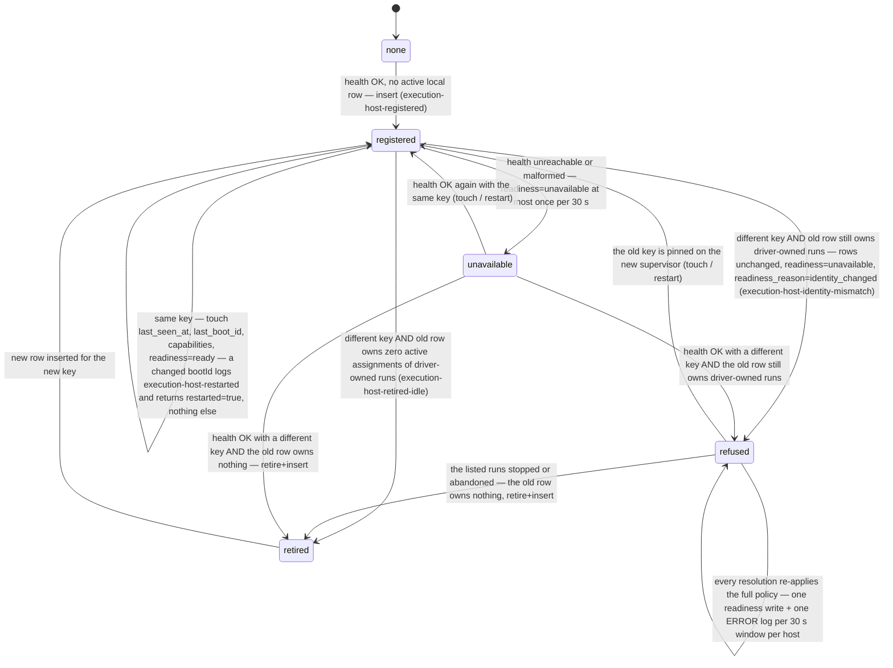
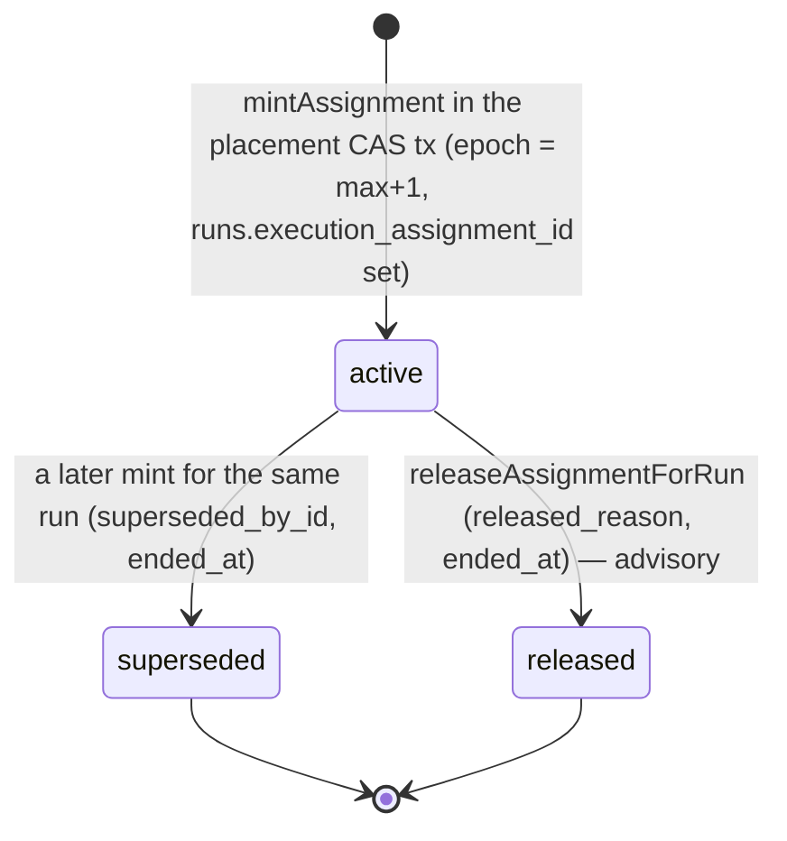
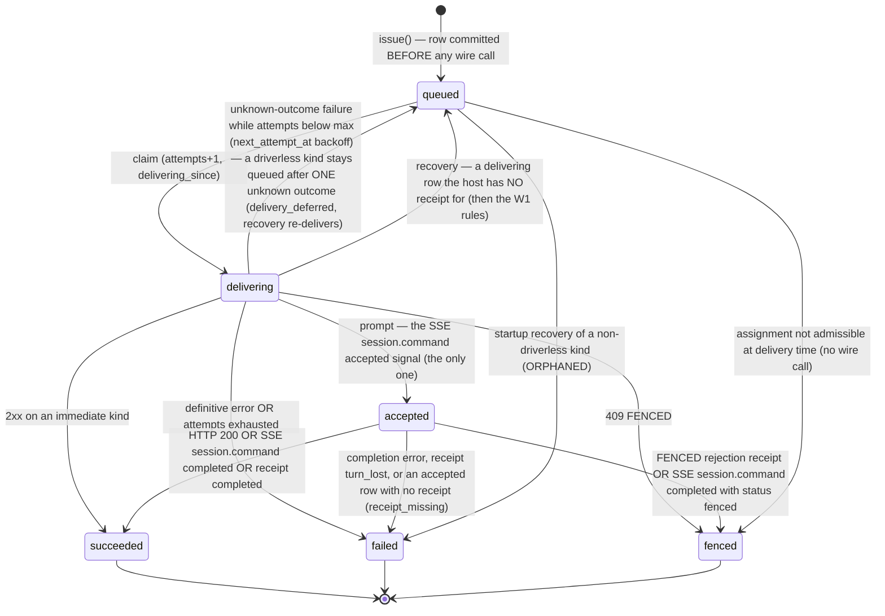
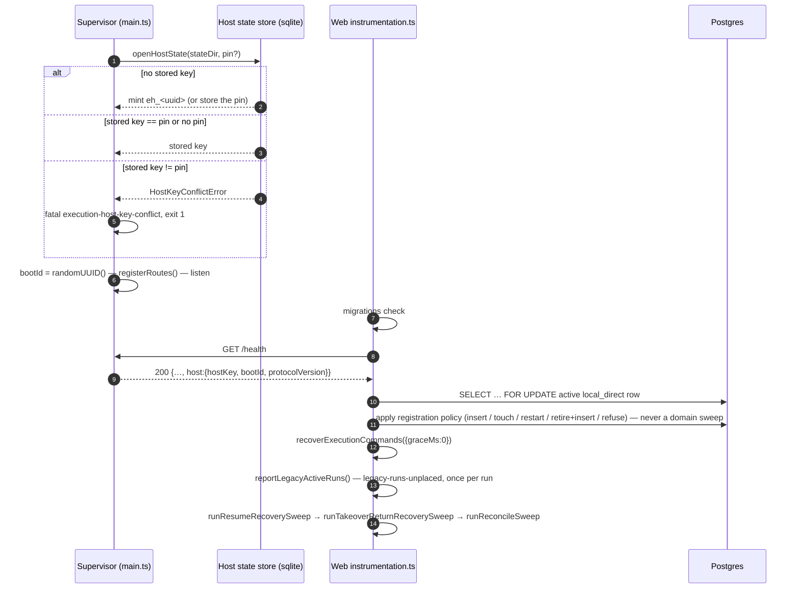
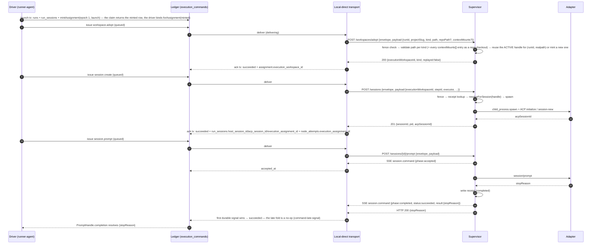
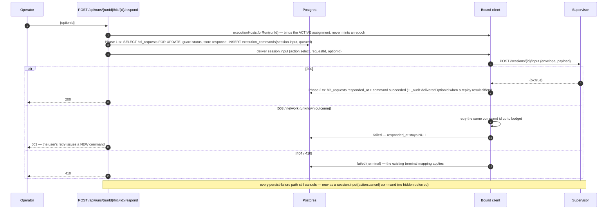
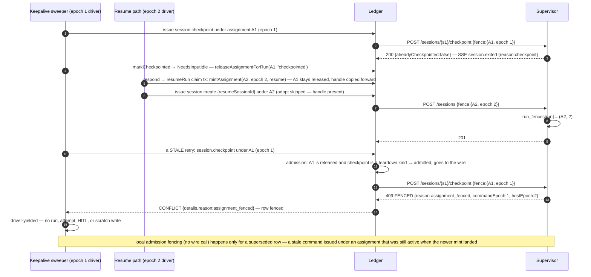
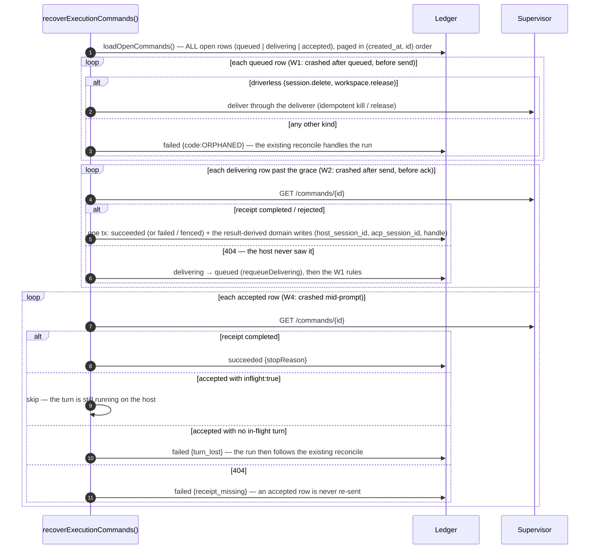
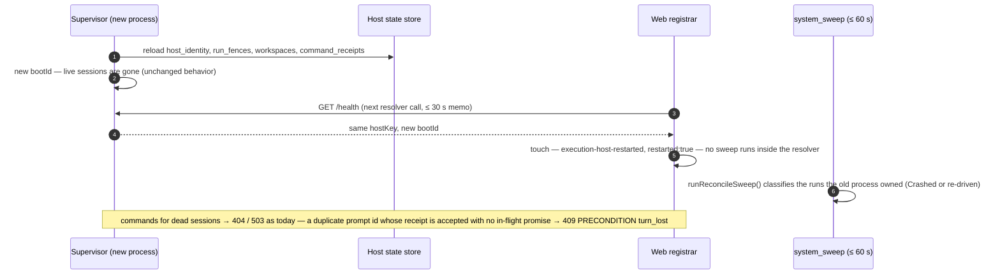
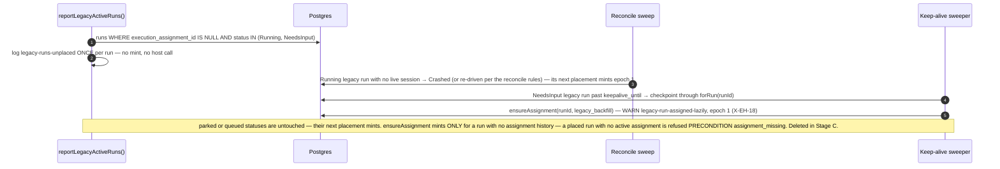

# Execution hosts domain

> **Status: Implemented** (Stage A). Decision:
> [ADR-166](../decisions.md#adr-166-local-execution-host-contract--durable-host-identity-epoch-fenced-assignments-command-ledger-opaque-adopted-workspaces).
> Working plan:
> [`../../.ai-factory/plans/claude-stage-a-execution-host-plan-6d70f9.md`](../../.ai-factory/plans/claude-stage-a-execution-host-plan-6d70f9.md).
> As-built: every surface in this file is `Implemented` (Stage A shipped in
> full; the `Designed` tags flipped at the branch's as-built checkpoint).

## Purpose

This domain owns how Web Core **addresses execution**: the durable identity of
the local **execution host** (the supervisor daemon), the durable per-run
**execution assignment** whose monotonically increasing **epoch** names the
driver-ownership generation, the **command envelope** and **command ledger**
that carry every host-bound command with a unique id and a fence, the host-side
**receipts** that make duplicate delivery safe, and the opaque
**execution workspace** handle that replaces raw paths on every session route.
It answers: who is allowed to drive a run right now, how a stale driver is
rejected at the execution boundary, what survives a web crash or a supervisor
restart, and how a pre-Stage-A run is folded in. It does **not** own the run
state machine ([runs.md](runs.md)), HITL semantics ([hitl.md](hitl.md)),
crash classification ([reconciliation-gc.md](reconciliation-gc.md)),
worktree creation and promotion ([workspaces.md](workspaces.md)), or the
runner/session model ([sessions.md](sessions.md)). Stage A keeps one host,
loopback HTTP, and the shared filesystem: no remote transport, no multiple
simultaneous hosts, no placement, no host UI (ADR-166 §D12).

**Stage B transition (Designed):** the assignment, command, receipt, and
opaque workspace contracts remain this domain's authority, but runtime event
and file metadata move to the manager-owned [execution event plane](execution-event-plane.md),
[prompt lifecycle](execution-prompt-lifecycle.md), and [runtime-object plane](execution-runtime-objects.md).
The shared filesystem remains an as-built legacy-mode limitation only through
the bounded [data-plane cutover](execution-data-cutover.md), never a remote-host
claim.

## Domain entities

- **Execution host** — one row in `execution_hosts` per registered host.
  Stage A has exactly one non-retired `kind='local_direct'` row (partial
  unique index `execution_hosts_local_active_uq`). Identity is `host_key`
  (`eh_<uuid>`, supervisor-minted, or the `MAISTER_EXECUTION_HOST_KEY` pin);
  `last_boot_id` marks the supervisor process incarnation; `readiness ∈
{unknown, ready, unavailable}` + `readiness_reason`; `capabilities =
{protocolVersion, supervisorVersion, adapters[]}`. The supervisor URL is
  transport configuration (`MAISTER_SUPERVISOR_URL`) read at call time by the
  local-direct transport — never stored on the row.
- **Host state store** — the supervisor-private `node:sqlite` file
  `<MAISTER_EXECUTION_HOST_STATE_DIR>/state.sqlite` (default
  `<MAISTER_RUNTIME_ROOT>/.maister/execution-host/`) holding
  `host_identity`, `run_fences`, `workspaces`, and `command_receipts`
  (schema `user_version` 1 — an older store is rebuilt in place at open). The
  web tier never reads it.
- **Execution assignment** — one row in `execution_assignments` per
  `(run, epoch)`: `state ∈ {active, superseded, released}`,
  `placement_reason` (ten tokens), the optional `execution_workspace_id` +
  `workspace_adopted_at` handle, `superseded_by_id`, `released_reason`,
  `ended_at`. `runs.execution_assignment_id` points at the LATEST minted
  assignment — it may be `released`; only `execution_assignments.state` says
  which one is active. `run_sessions.execution_assignment_id` (updated per
  spawn) and
  `node_attempts.execution_assignment_id` (stamped at attempt start,
  immutable) attribute sessions and attempts. ERD:
  [`../db/execution-hosts-domain.md`](../db/execution-hosts-domain.md).
- **Epoch** — `execution_assignments.epoch ≥ 1`, strictly increasing per
  run, minted in the same transaction as the placement CAS. It is the
  driver-ownership generation: session switches inside one `runFlow`,
  gate chat on a live session, and prompt turns reuse the current epoch.
- **Fence** — `{hostKey, assignmentId, assignmentEpoch, runId}` on every
  enveloped command. The host keeps the per-run high-water in
  `run_fences(run_id, assignment_id, epoch)` and rejects `epoch <
high-water` with 409 `FENCED`. Rules in order: `host_mismatch` →
  `run_mismatch` → `assignment_fenced` → `assignment_mismatch` — the run
  binding is checked BEFORE the epoch, so a wrong-run fence can never advance
  or evict another run.
- **Command** — one row in `execution_commands` (the wire `command.id`):
  `kind` (eight tokens), `assignment_epoch`, `target_session_id?`, a
  `payload` projected through a per-kind ALLOW-list (ids, names, adapter/
  model, counts, `has*` flags — nothing else is stored), `state ∈ {queued,
delivering, accepted, succeeded,
failed, fenced}`, `attempts` / `max_attempts` / `next_attempt_at`,
  `delivering_since`, `accepted_at`, `completed_at`, `result`, `last_error`,
  `driverless`.
- **Command envelope** — `{ command: {id, kind, issuedAt}, fence: {…},
payload: {…} }`, the JSON body of every host-bound mutating route; the
  session id stays in the URL. Wire schema: `CommandEnvelope` in
  [`../api/supervisor.openapi.yaml`](../api/supervisor.openapi.yaml).
- **Receipt** — a host-side `command_receipts` row `(command_id, run_id,
kind, epoch, phase ∈ {accepted, completed, rejected}, http_status,
body_json, received_at, completed_at)`; readable through
  `GET /commands/{commandId}` (which adds the process-memory `inflight`
  flag — `accepted` + `inflight:false` is the restart-mid-turn signature the
  web folds as `turn_lost` without re-sending) and replayed verbatim on a
  duplicate id with `X-Maister-Command-Replayed: true`.
- **Execution workspace handle** — `executionWorkspaceId = "ws_<uuid>"`,
  host-scoped, keyed `(runId, realpath)` among ACTIVE rows of the host's
  `workspaces` table (partial unique index `workspaces_active_uq WHERE
released_at IS NULL`; a released row stays as history) with `kind ∈
{git_worktree, repo_checkout, directory}`, `path`, `repo_path?`, `run_dir`,
  `context_mounts?`, `adopted_at`, `released_at?`. Minted by
  `POST /workspaces/adopt` — the ONLY path-bearing route.
- **Bound client** — the web-side `BoundClient` returned by
  `executionHosts.forAssignment(assignment)` / `executionFor(runId,
{assignmentId})`: every method is a thin wrapper over one `issue()` that
  writes the ledger row, delivers through the `ExecutionHostTransport`, and
  acknowledges. Drivers bind by assignment: every claim transition returns
  the assignment it minted and the driver binds THAT row; the graph runner
  reads `runs.execution_assignment_id` at entry and binds that id lazily at
  the first agent-kind need. `forRun(runId)` (no id) is for non-driver
  callers (HITL respond, sweeper, node interrupt): it binds the ACTIVE
  assignment; with `teardown:true` the newest one even if `released`; for a
  run that was NEVER placed (no assignment history) it mints lazily
  (`legacy_backfill`, WARN); for a placed run with no active assignment it
  REFUSES `PRECONDITION {reason:"assignment_missing"}` — a re-entry must mint
  inside its own claim. That re-check runs under the run row lock, so two
  concurrent lazy mints reuse one row instead of superseding.
  `HostAdminClient` (`executionHosts.local()`) serves health/diagnostics/
  admin surfaces.

## State machine — host registration

The registrar (`ensureLocalExecutionHost()` at web startup, then lazily with
a 30 s memo) reads `GET /health` and applies this policy under a
`SELECT … FOR UPDATE` of the single non-retired local row. Transitions carry
the log marker they emit.

The resolver (`localHost()`) is a pure lookup — one health call per 30 s
window, single-flight under concurrency — and never awaits a domain sweep: a
`restarted:true` registration is only logged, and the periodic `system_sweep`
reconcile (≤ 60 s) classifies the runs the old process owned. "Owns" means an
`active` assignment of a run in a driver-owned status (`Pending | Running |
NeedsInput`) — the same set the sweep backstop never releases. While
`refused` or `unavailable`, every command issue fails `EXECUTOR_UNAVAILABLE`
(`details.reason="host_identity_mismatch"` for the refused case, else the
readiness reason); launches keep today's 503 behavior. The `refuse` branch is
throttled exactly like `unavailable`: one readiness write and one
`execution-host-identity-mismatch` ERROR log per 30 s window per host.

## State machine — execution assignment

A later mint supersedes only the ACTIVE row; a `released` row stays
`released`, its `released_reason` (`checkpointed`, `crashed`, `abandoned`,
`run_terminal`, `sweep`, …) kept as history, so a run's assignment chain
reads as a sequence of generations. `released` is advisory for fencing: the
host fences by epoch, not by state. The `system_sweep` backstop releases an
`active` assignment older than 60 s only when its run is in a status with no
owned driver — `NeedsInputIdle | HumanWorking | WaitingOnChildren | Review |
Crashed | Done | Abandoned | Failed` (`released_reason='sweep'`, WARN once);
`Pending` (a queued launch/recover whose claim already minted the assignment
for the driver that will pick it up), `Running`, and `NeedsInput` are OWNED
and never released.

## State machine — command

The `execution_commands.state` FSM. Every transition is a CAS
(`UPDATE … WHERE id=$1 AND state IN (<expected>) AND attempts=$attempt`); a
late signal for a terminal row logs `command-late-signal` and is ignored.

## Process flows

### Bootstrap and registration

The supervisor opens its state store before registering routes; the web tier
registers the host it finds at `MAISTER_SUPERVISOR_URL` before any recovery
sweep runs.

### Launch → lazy adoption → create → prompt → completion signals

The first supervisor call for a flow run happens inside `runAgentStep`. The
assignment is minted in the run-INSERT transaction of `launchRun`; the
workspace is adopted lazily before the first `session.create` of that
assignment.

### HITL respond through the ledger (Phase 1 / Phase 2)

The permission-response route keeps its two-phase shape; the supervisor side
effect is a `session.input` command whose row is written in the Phase-1
transaction.

### Keepalive checkpoint → idle → resume mint → stale checkpoint FENCED → old driver yields

The end-to-end fencing scenario: a driver whose assignment generation has
ended is rejected at the host and writes nothing.

### Web crash windows W1 / W2 / W4 and their recovery

`recoverExecutionCommands()` runs at startup and on every `system_sweep`
pass.

The grace is 60 s (`delivering_since`, in-flight protection) on the periodic
pass and 0 at startup — no driver of the new process exists yet. There is no
row cap: the pass pages through every open row. W3 (after ack, before the
domain write) is impossible: the ack and the domain writes share one
transaction.

### Supervisor restart

The registrar never runs a domain sweep: a resolution that awaited one could
wait on work that itself resolves the host — the deadlock the restart
reconcile was removed for. If the state directory itself is lost, the host
mints a new key (unless pinned) → the registration policy retires the idle
old row or refuses; fences restart at the first command; handles are
re-adopted lazily (`unknown_workspace` / `workspace_released` → one
re-adopt).

### Legacy runs (pre-ADR-166)

A run with `execution_assignment_id = NULL` was never placed, and nothing
places it after the fact: every host session created since the strict flip
belongs to a minted assignment, and the sessions that predate it died with the
supervisor that owned them. `reportLegacyActiveRuns()` (boot + every
`system_sweep`) only makes the survivors visible.

At upgrade, restart the supervisor FIRST (drain recommended): live
pre-ADR-166 sessions die with the old process (X-EH-23), and in-flight runs
follow the supervisor-restart semantics above — there is no backfill. Runs
that finished before the upgrade keep `NULL` forever. `ensureAssignment` stays
a Stage-C deletion obligation (ADR-166 D9).

## Command kinds, routes, and completion signals

| Kind                 | Route                            | Effect                                                     | Duration     | Completion signal(s)                                                                                          |
| -------------------- | -------------------------------- | ---------------------------------------------------------- | ------------ | ------------------------------------------------------------------------------------------------------------- |
| `workspace.adopt`    | `POST /workspaces/adopt`         | register path → handle (idempotent on `(runId, realpath)` among ACTIVE handles; a released path mints a NEW one) | immediate    | HTTP 200                                                                                                      |
| `workspace.release`  | `DELETE /workspaces/{id}`        | unregister handle                                          | immediate    | HTTP 200                                                                                                      |
| `session.create`     | `POST /sessions`                 | spawn + ACP handshake                                      | ≤ 60 s       | HTTP 201 `{sessionId, pid, acpSessionId}`                                                                     |
| `session.prompt`     | `POST /sessions/{id}/prompt`     | start a turn                                               | long         | SSE `session.command{accepted}` → HTTP 200 `{stopReason}` and/or SSE `session.command{completed}` and receipt |
| `session.input`      | `POST /sessions/{id}/input`      | resolve a deferred                                         | immediate    | HTTP 200                                                                                                      |
| `session.cancel`     | `POST /sessions/{id}/cancel`     | ACP cancel                                                 | immediate    | HTTP 200                                                                                                      |
| `session.checkpoint` | `POST /sessions/{id}/checkpoint` | cancel deferreds + SIGTERM + wait                          | ≤ kill grace | HTTP 200 + SSE `session.exited{reason:"checkpoint"}`                                                          |
| `session.delete`     | `DELETE /sessions/{id}`          | SIGTERM/SIGKILL                                            | ≤ kill grace | HTTP 204 + SSE `session.exited`                                                                               |

Unknown-outcome retry budgets (same command id): adopt 3 (0.5 s·2ⁿ), create 3
(1 s·2ⁿ), prompt 3 before acceptance / 0 after, input 3, cancel 3, checkpoint
3, delete 3 (`driverless`), release 3 (`driverless`). Transport timeouts: adopt
10 s, create 60 s, input/cancel 10 s, checkpoint/delete 30 s, prompt none.

## Command admission by assignment state

| Assignment state | Admitted kinds                                                                                                                 | Otherwise                    |
| ---------------- | ------------------------------------------------------------------------------------------------------------------------------ | ---------------------------- |
| `active`         | all eight                                                                                                                      | —                            |
| `released`       | teardown only: `session.checkpoint`, `session.delete`, `session.cancel`, `session.input{action:"cancel"}`, `workspace.release` | local `fenced`, no wire call |
| `superseded`     | none                                                                                                                           | local `fenced`, no wire call |

`session.create`, `session.prompt`, `session.input{select}`, and
`workspace.adopt` require `active`. The orchestrator park checkpoint is the
reason teardown kinds stay admissible under `released` — so a stale teardown
command issued under a `released` assignment GOES TO THE WIRE and is fenced
by the host (409 `FENCED`) once a newer epoch has landed; local admission
fencing happens only for a `superseded` row or a non-teardown kind under
`released`.

## Host refusal table (reason tokens)

`SupervisorErrorBody.details.reason` is the discriminator; tests assert the
token, never the message.

| Rule (in order)                                                          | HTTP / code        | `details.reason`                                                                                                                                                                                | Web sees                                                        |
| ------------------------------------------------------------------------ | ------------------ | ----------------------------------------------------------------------------------------------------------------------------------------------------------------------------------------------- | --------------------------------------------------------------- |
| `fence.hostKey ≠` own key                                                | 409 `PRECONDITION` | `host_mismatch`                                                                                                                                                                                 | `PRECONDITION` (details passed through)                         |
| `fence.runId ≠` the session's / handle's run                             | 409 `PRECONDITION` | `run_mismatch`                                                                                                                                                                                  | `PRECONDITION`                                                  |
| `fence.assignmentEpoch <` stored high-water                              | 409 `FENCED`       | `assignment_fenced` (+ `runId`, `commandEpoch`, `hostEpoch`)                                                                                                                                    | `CONFLICT {details.reason:"assignment_fenced"}` → driver yields |
| epoch equal, `assignmentId` differs                                      | 409 `PRECONDITION` | `assignment_mismatch`                                                                                                                                                                           | `PRECONDITION`                                                  |
| duplicate id, receipt `accepted`, no in-flight (host restarted mid-turn) | 409 `PRECONDITION` | `turn_lost`                                                                                                                                                                                     | `failed{turn_lost}`                                             |
| `executionWorkspaceId` unknown                                           | 409 `PRECONDITION` | `unknown_workspace`                                                                                                                                                                             | client re-adopts ONCE, issues a NEW create                      |
| handle released                                                          | 409 `PRECONDITION` | `workspace_released`                                                                                                                                                                            | client re-adopts ONCE, issues a NEW create                      |
| adopt path violates the kind matrix                                      | 409 `PRECONDITION` | `workspace_rejected` + `rule ∈ {relative_path, parent_segment, not_found, outside_roots, symlink_escape, gitdir_mismatch, not_a_repo, repo_path_mismatch, inside_state_dir, outside_workspace}` (+ `mount` when a `contextMounts[]` entry is the offender) | `PRECONDITION`                                                  |
| legacy path field after the strict flip                                  | 409 `PRECONDITION` | `legacy_field` + `field`                                                                                                                                                                        | `PRECONDITION`                                                  |
| envelope absent after the strict flip                                    | 409 `PRECONDITION` | `missing_envelope`                                                                                                                                                                              | `PRECONDITION`                                                  |
| receipt write failed after executing                                     | 500 `ACP_PROTOCOL` | —                                                                                                                                                                                               | definitive failure; reconcile catches an orphan session         |

The first four rows are the fence, evaluated in that order: the run binding
is checked BEFORE the epoch, so a wrong-run fence can never advance or evict
another run's sessions. Rejection messages carry the offending path, never
the configured roots. `FENCED → CONFLICT`; every other supervisor code keeps
its existing mapping. The tokens the web mints itself
(`host_identity_mismatch`, `assignment_missing`, `delivery_deferred`,
`receipt_lookup_failed`, …) never travel the wire — their table is in
[`../error-taxonomy.md`](../error-taxonomy.md#execution-host-contract-implemented--adr-166).

## Web-side classification per attempt

| Host response                                          | Class                                                                                                                                      | Ledger row         | Caller sees                                             |
| ------------------------------------------------------ | ------------------------------------------------------------------------------------------------------------------------------------------ | ------------------ | ------------------------------------------------------- |
| network error, timeout, non-JSON 5xx (outcome UNKNOWN) | retry the SAME command id up to budget, then `failed`                                                                                      | `queued` + backoff | `EXECUTOR_UNAVAILABLE` after budget                     |
| parsed 503 `EXECUTOR_UNAVAILABLE` (definitive)         | `failed`; the caller's own retry issues a NEW command (sweeper tick, user retry)                                                           | `failed`           | `EXECUTOR_UNAVAILABLE`                                  |
| 409 `FENCED`                                           | terminal                                                                                                                                   | `fenced`           | `CONFLICT {details.reason:"assignment_fenced"}`         |
| 404 / 410 / 409 `PRECONDITION` (any reason)            | terminal                                                                                                                                   | `failed`           | existing per-endpoint mapping, `details` passed through |
| 409 `PRECONDITION unknown_workspace` / `workspace_released` on create | terminal for this command                                                                                                     | `failed`           | one re-adopt + a NEW create                             |
| driverless kind (`session.delete`, `workspace.release`), ONE unknown outcome | the row stays `queued` for the recovery pass — the caller is not held through the retry budget                            | `queued`           | `EXECUTOR_UNAVAILABLE {details.reason:"delivery_deferred"}` |
| prompt after `accepted`: transport failure             | receipt lookup retried up to 5× (0.5 s·2ⁿ), `failed{receipt_lookup_failed}` after that; `completed` → `succeeded{stopReason}`; `rejected` → `failed` / `fenced`; `accepted` + `inflight:true` → the SAME id is re-sent ONCE to join the turn; `accepted` + `inflight:false` → `failed{turn_lost}`; 404 → `failed{receipt_missing}` | as looked up | `stopReason` when completed; `EXECUTOR_UNAVAILABLE` (`receipt_lookup_failed`) or `ACP_PROTOCOL` (`turn_lost`, `receipt_missing`) otherwise |
| ledger write fails mid-turn                            | logged `command-ledger-write-failed`; the turn's outcome still reaches the driver; the next recovery pass folds the row from the host receipt | unchanged until folded | the turn's own outcome; `ACP_PROTOCOL {details.reason:"ledger_write_failed"}` only when the ledger error is the first settling signal |

## Workspace adoption kinds

| Kind            | Extra rule                                                                                                                                       | Used by                                                              |
| --------------- | ------------------------------------------------------------------------------------------------------------------------------------------------ | -------------------------------------------------------------------- |
| `git_worktree`  | realpath under `MAISTER_WORKSPACE_ROOTS`; `.git` FILE whose `gitdir:` resolves under `<repoPath>/.git/worktrees/`; `repoPath` is a git repo root | flow, scratch, agent `worktree`, shared-tree children                |
| `repo_checkout` | path is a git repo root AND equals `repoPath` (arbitrary location, ADR-023)                                                                      | agent `repo_read` on the parent checkout                             |
| `directory`     | realpath under `MAISTER_WORKSPACE_ROOTS`; `repoPath` absent                                                                                      | local-package assistant, ephemeral read-only checkouts, agent `none` |

All kinds: absolute, no `..`, realpath exists, no symlink escape, not inside
the state dir. `contextMounts[]` entries are validated at adopt as repo
checkouts — absolute, no `..`, realpath exists, `.git` is a directory, not
inside the state dir — and a rejected entry answers `workspace_rejected` with
`details.mount`. Rejection messages carry the offending path, never the
configured roots. The web derives every adopt value from server state
(`workspaces.worktree_path`, `projects.repo_path`,
`local_packages.working_dir`, the agent launch snapshot, `runs.context_mounts`)
— never from an HTTP request body it received. The host derives `run_dir`
from `runtimeRoot + projectSlug + runId` at adoption and stores it; later
routes derive every path from the handle.

Adoption is idempotent on `(runId, realpath)` among ACTIVE handles
(`workspaces_active_uq WHERE released_at IS NULL`): after `workspace.release`
the released row stays as history and a new adoption of the same path mints a
NEW handle. A stored handle the host no longer honours — `unknown_workspace`
(store wiped) or `workspace_released` (worktree removed and re-created at the
same path, the ADR-141 reopen of a GC'd run) — is re-adopted ONCE by the
client, which then issues a NEW `session.create`, so the reopened run spawns
again; a second refusal surfaces as-is.

## Requirements (owner brief, 2026-09-02)

| Id   | Requirement                                                                                                                                                             |
| ---- | ----------------------------------------------------------------------------------------------------------------------------------------------------------------------- |
| R-01 | The local execution host has a stable identity that survives supervisor restarts.                                                                                       |
| R-02 | Web Core resolves the host through a durable registration; the transport URL is configuration, not a domain concept.                                                    |
| R-03 | Every newly launched run has a durable assignment with a monotonically increasing epoch.                                                                                |
| R-04 | Assignment history is immutable and auditable; sessions and attempts are attributable to the assignment that created them.                                              |
| R-05 | Every host-bound command carries `hostKey`, `assignmentId`, `assignmentEpoch`, and a unique `commandId`.                                                                |
| R-06 | The host rejects stale epochs; fencing survives host restart.                                                                                                           |
| R-07 | Duplicate delivery of any command is safe (host receipts).                                                                                                              |
| R-08 | Command intent is persisted before the side effect; delivery state only after acknowledgement.                                                                          |
| R-09 | Every Web crash window has a defined, tested recovery.                                                                                                                  |
| R-10 | A long-lived HTTP request is never the only durable completion signal.                                                                                                  |
| R-11 | Normal session APIs carry no raw paths; adoption is the only path-bearing operation and validates against configured roots.                                             |
| R-12 | Flow runs, scratch/assistant runs, ACP lifecycle, HITL, checkpoint/resume, cancel/abandon, reconcile, concurrency accounting, local delivery/promotion behave as today. |
| R-13 | Shared filesystem and local event coupling are documented as limitations; no remote/multi-host claims.                                                                  |
| R-14 | Domain code addresses hosts only through a typed boundary; the loopback transport is replaceable.                                                                       |

## Expectations

- **E-EH-01** — At most one non-retired `local_direct` execution host MUST
  exist. Enforced by: `execution_hosts_local_active_uq` partial unique index;
  the registrar policy under a `SELECT … FOR UPDATE` of the active row.
- **E-EH-02** — A run MUST have at most one `active` assignment and its
  epochs MUST be strictly increasing; a mint NEVER reuses an epoch and
  supersedes only the `active` row (a `released` row stays `released`).
  Enforced by: `execution_assignments_run_active_uq`,
  `execution_assignments_run_epoch_uq`, and `mintAssignment` inside the
  placement-claim transaction.
- **E-EH-03** — Every enveloped command MUST carry a fence; the host MUST
  persist the per-run high-water BEFORE executing and MUST reject
  `epoch < high-water` with 409 `FENCED`, checking the run binding before the
  epoch. Enforced by: `parseCommandBody` + `runCommand` around every
  enveloped route; the `run_fences` sqlite write; tests F1–F2, F7.
- **E-EH-04** — When a higher epoch arrives, every live session of that run
  under a lower epoch MUST be evicted (`session.exited{reason:"fenced"}`)
  before the command executes, inside the command's in-flight execution so a
  concurrent duplicate joins it. Enforced by: `execution-fence.ts` eviction
  under the receipt in-flight map; test F6.
- **E-EH-05** — A command id MUST execute at most once per host: a duplicate
  returns the stored receipt or joins the in-flight execution. Enforced by:
  `command_receipts` primary key + the in-flight map; tests R1–R3.
- **E-EH-06** — An `execution_commands` row MUST exist in state `queued`
  before any wire call, and `accepted_at` / `completed_at` MUST be written
  only after the host's response. Enforced by: the ledger API is the only
  transport caller; test L1.
- **E-EH-07** — Result-derived domain writes (`run_sessions.host_session_id`,
  `acp_session_id`, `execution_assignment_id`; the assignment handle) MUST
  commit in the same transaction as the acknowledgement. Enforced by: the
  ledger ack takes a transaction; test L2.
- **E-EH-08** — `POST /sessions` and every `/sessions/{id}/*` route MUST
  accept only `executionWorkspaceId`; `POST /workspaces/adopt` is the only
  route accepting a path and MUST validate it per the kind matrix. Enforced
  by: Zod strict schemas; tests W5, Z1–Z3, T1. (Strict since the T5.1 flip;
  the transitional bare-body acceptance is gone.)
- **E-EH-09** — Adoption MUST be idempotent on `(runId, realpath)` among
  ACTIVE handles, a release MUST leave the row as history so the same path
  mints a NEW handle, and handles MUST survive a host restart. Enforced by:
  the sqlite `workspaces` table + `workspaces_active_uq`; tests W1, W9.
- **E-EH-10** — After a Web restart, `delivering` / `accepted` rows MUST be
  reconciled from receipts (a `delivering` row with no receipt goes back to
  `queued` first) and non-driverless `queued` rows MUST NEVER be re-sent.
  Enforced by: `recovery.ts`; tests V1–V3.
- **E-EH-11** — A driver MUST bind the assignment its own claim minted
  (`forAssignment` / `executionFor(runId, {assignmentId})`), and a driver
  whose command returns `assignment_fenced` MUST write no run, attempt, HITL,
  or scratch state. Enforced by: every claim transition returns its minted
  assignment; the `fenced:true` result + early returns in every driver; test
  P3.
- **E-EH-12** — No secret value or prompt body MUST be persisted in
  `execution_commands.payload`, receipt bodies, or logs. Enforced by:
  `redactPayload()` at ledger insert — a per-kind ALLOW-list projection (ids,
  names, adapter/model, the counts `promptBytes`, `contentBlockCount`,
  `mcpServerCount`, `contextMountCount`, `has*` flags; nothing else is
  stored); sentinel tests C1, H7.

## Edge cases

| Id      | Case                                                                                                                                         | Outcome / code                                                                                                                      | Owning test |
| ------- | -------------------------------------------------------------------------------------------------------------------------------------------- | ----------------------------------------------------------------------------------------------------------------------------------- | ----------- |
| X-EH-01 | Pinned key conflicts with the stored key                                                                                                     | supervisor refuses boot, exit 1, `execution-host-key-conflict`                                                                      | H5          |
| X-EH-02 | New identity at the configured URL while the old host owns non-terminal runs                                                                 | registration refused, `readiness='unavailable'`, `MaisterError("EXECUTOR_UNAVAILABLE")` `{details.reason:"host_identity_mismatch"}` | G4          |
| X-EH-03 | Host state dir lost                                                                                                                          | new key (unless pinned) → idle-retire or X-EH-02; fences restart at the first command; handles re-adopted lazily                    | G3, K5      |
| X-EH-04 | Command epoch below the host high-water                                                                                                      | 409 `FENCED` → `MaisterError("CONFLICT")` `{details.reason:"assignment_fenced"}`                                                    | F2, E1      |
| X-EH-05 | Same epoch, different assignment id                                                                                                          | 409 `PRECONDITION assignment_mismatch`                                                                                              | F3          |
| X-EH-06 | `fence.runId` differs from the session's run                                                                                                 | 409 `PRECONDITION run_mismatch`                                                                                                     | F5          |
| X-EH-07 | Duplicate command with a completed/rejected receipt                                                                                          | verbatim replay + `X-Maister-Command-Replayed` — replay wins over the session liveness guards, so it holds after the session exited | R1          |
| X-EH-08 | Duplicate command while the original is executing                                                                                            | join, same result                                                                                                                   | R2          |
| X-EH-09 | Receipt `accepted`, no in-flight (host restarted mid-turn)                                                                                   | 409 `PRECONDITION turn_lost`                                                                                                        | R3          |
| X-EH-10 | Adopt path outside roots / relative / `..` / missing / symlink escape / gitdir mismatch / not a repo / repo path mismatch / inside state dir | 409 `PRECONDITION {workspace_rejected, rule}` → `MaisterError("PRECONDITION")`                                                      | W5          |
| X-EH-11 | Create with an unknown handle (store wiped)                                                                                                  | 409 `unknown_workspace` → client re-adopts once and issues a NEW create                                                             | W6, K5      |
| X-EH-12 | Create with a released handle (worktree re-created at the same path — the ADR-141 reopen)                                                    | 409 `workspace_released` → client re-adopts once and issues a NEW create; the reopened run spawns again                             | W6          |
| X-EH-13 | Legacy path field or missing envelope after the strict flip                                                                                  | 409 `legacy_field` (+ `details.field`) / `missing_envelope`                                                                         | Z1–Z2       |
| X-EH-14 | Transport failure with unknown outcome before any receipt                                                                                    | retry the same command id up to budget, then `failed` → `MaisterError("EXECUTOR_UNAVAILABLE")`; a driverless kind stays `queued` after ONE unknown outcome (`delivery_deferred`) for the recovery pass | L3          |
| X-EH-15 | Transport failure after prompt acceptance                                                                                                    | receipt lookup retried 5× → `succeeded{stopReason}` / re-send ONCE to join an in-flight turn / `failed{turn_lost}` / `failed{receipt_missing}` (`MaisterError("ACP_PROTOCOL")`); host still unreachable → `failed{receipt_lookup_failed}` (`MaisterError("EXECUTOR_UNAVAILABLE")`) | L8          |
| X-EH-16 | Web crash W1 / W2 / W4                                                                                                                       | per the recovery flow above                                                                                                         | V1–V3       |
| X-EH-17 | Supervisor restart during delivery                                                                                                           | same key, new bootId, fences + receipts survive, sessions gone, reconcile classifies                                                | V3, G2      |
| X-EH-18 | Never-placed legacy run (NULL assignment, no assignment history) reaches `forRun`                                                             | lazy mint `legacy_backfill` with WARN `legacy-run-assigned-lazily`; a PLACED run with no active assignment is refused `MaisterError("PRECONDITION")` `{details.reason:"assignment_missing"}` — its re-entry must mint inside its own claim | Y5          |
| X-EH-19 | Evicted session's pending prompt                                                                                                             | 409 `FENCED` to the old driver → driver yields                                                                                      | F6, P3      |
| X-EH-20 | Teardown command on a `released` assignment / any command on `superseded`                                                                    | sent / locally `fenced`                                                                                                             | A5, L6      |
| X-EH-21 | Host receipt write fails after executing                                                                                                     | 500 `ACP_PROTOCOL`; the effect may exist; reconcile catches an orphan session (accepted residual)                                   | R5          |
| X-EH-22 | Host unreachable at Web boot                                                                                                                 | readiness unavailable; legacy runs still reported (`legacy-runs-unplaced`, once per run); the resolver retries on the next command / sweep (accepted residual)                                               | G5, Y4      |
| X-EH-23 | Upgrade to ADR-166 with live pre-ADR-166 sessions                                                                                            | the sessions die with the old supervisor — restart the supervisor first (drain recommended); in-flight runs follow the supervisor-restart semantics, no backfill | — (operational; [`../deployment.md`](../deployment.md#11-updates)) |

## Linked artifacts

- Decision: [ADR-166](../decisions.md#adr-166-local-execution-host-contract--durable-host-identity-epoch-fenced-assignments-command-ledger-opaque-adopted-workspaces);
  amended topology: [ADR-023](../decisions.md#adr-023-run-web--supervisor-on-the-host-containerize-only-postgres).
- ERD: [`../db/execution-hosts-domain.md`](../db/execution-hosts-domain.md);
  column reference: [`../database-schema.md`](../database-schema.md#execution-host-tables-implemented--adr-166-migration-0130).
- Wire: [`../api/supervisor.openapi.yaml`](../api/supervisor.openapi.yaml)
  (`CommandEnvelope`, `AdoptWorkspaceRequest`, `WorkspaceRecord`,
  `CommandReceipt`, `SupervisorErrorBody.details`, `FENCED`),
  [`../api/async/supervisor-sse.asyncapi.yaml`](../api/async/supervisor-sse.asyncapi.yaml)
  (`session.command`, `session.exited.reason=fenced`),
  [`../api/async/web-runs.asyncapi.yaml`](../api/async/web-runs.asyncapi.yaml)
  (opaque pass-through); prose: [`../supervisor.md`](../supervisor.md).
- Errors: [`../error-taxonomy.md`](../error-taxonomy.md) (no new
  `MaisterError` code; `FENCED` + reason tokens).
- Configuration: [`../configuration.md`](../configuration.md)
  (`MAISTER_EXECUTION_HOST_STATE_DIR`, `MAISTER_EXECUTION_HOST_KEY`,
  `MAISTER_WORKSPACE_ROOTS`); deployment: [`../deployment.md`](../deployment.md).
- Related domains: [`runs.md`](runs.md), [`sessions.md`](sessions.md),
  [`hitl.md`](hitl.md), [`reconciliation-gc.md`](reconciliation-gc.md),
  [`scratch-runs.md`](scratch-runs.md), [`agents.md`](agents.md),
  [`workspaces.md`](workspaces.md).
- Source (Implemented): `web/lib/execution-host/*`,
  `web/lib/supervisor-client.ts`, `supervisor/src/{host-state,
execution-fence, command-receipts, workspace-registry, workspace-roots}.ts`,
  `supervisor/src/http-api.ts`, `supervisor/src/types.ts`.
