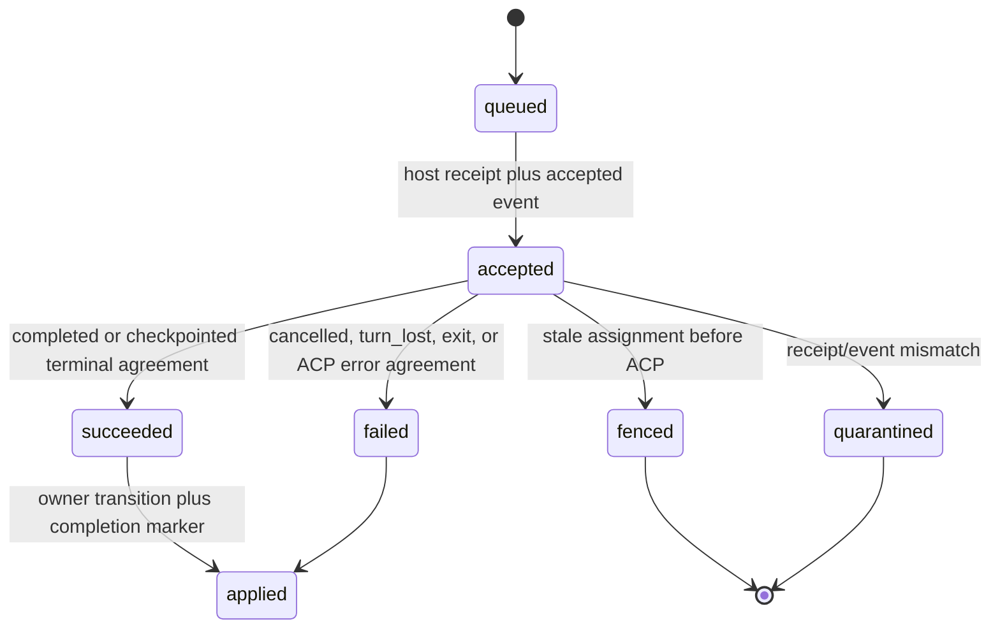
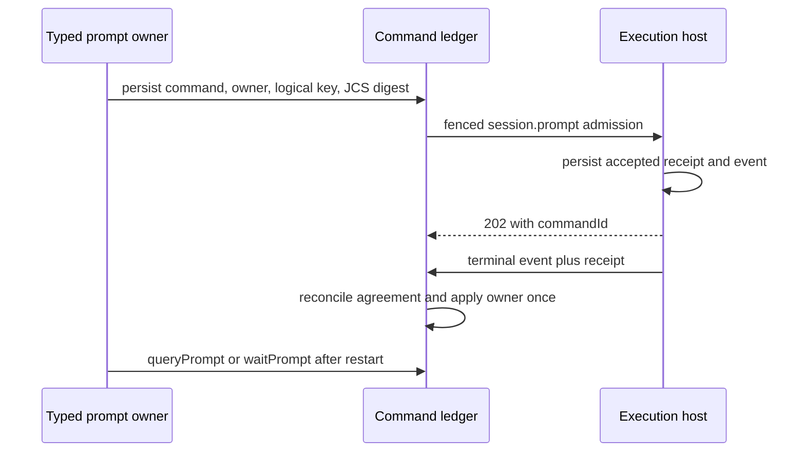

# Execution prompt lifecycle

**Status:** Implemented — `POST /sessions/{id}/prompts` is short-lived command
admission. Stage A command, receipt, assignment, and fence identities remain
the only prompt lifecycle authority; the singular long-lived route is absent.

## Purpose

Define restart-safe prompt admission, progress, terminal reconciliation, and
owner application. A prompt is a durable command whose authoritative lifecycle
is canonical event plus receipt; a local wait or HTTP response is an optional
optimization and cannot decide a run transition.

## Domain entities

- `execution_commands` remains the single command ledger and gains a typed
  owner reference, logical operation key, request schema/digest, and completion
  marker.
- `PromptHandle` is the serializable `{commandId}` locator.
- `command_receipts` is host-private durable side-effect evidence.
- `session.command` is the canonical accepted/terminal event type.
- `run_session_incarnations` binds host session identity to a fenced run
  session across restart, checkpoint, exit, and replacement.

## State machine

## Process flows

## Expectations

- **PRM-01:** `session.prompt` is accepted only after the host durably records its Stage A receipt and accepted event.
- **PRM-02:** Retry reuses command ID, logical operation key, and canonical request digest so ACP is never invoked twice.
- **PRM-03:** Progress and terminal events—not HTTP lifetime or a receipt alone—are lifecycle authority; the queryable receipt is agreeing evidence for reconciliation.
- **PRM-04:** Every prompt command has one typed server-derived owner and idempotent terminal application across web restart.
- **PRM-05:** A host restart finding an accepted command without a live turn terminalizes it as `turn_lost` without replaying prompt text.
- **PRM-06:** Receipt and terminal event must agree on command, assignment, epoch, and outcome before owner mutation.
- **PRM-07:** Session exit, crash, and cancellation terminalize accepted prompts before or atomically with terminal session evidence.
- **PRM-08:** HITL pause, decision, checkpoint, and resume are durable/fenced and resume uses a new command and required incarnation.
- **PRM-09:** Cancellation reuses the command ledger and has one terminal prompt outcome despite retry or ACK loss.
- **PRM-10:** Fencing happens before ACP and records a durable fenced receipt/audit event without owner mutation.
- **PRM-11:** `{commandId}` remains queryable through Postgres after web or supervisor process restart.
- **PRM-12:** Prompt receipt pruning waits for terminal ACK, owner application, terminal run, and replay grace.

## Edge cases

- **EDGE-PRM-01:** A lost admission or terminal acknowledgement reconciles by original command ID and never starts a second turn (`IT-PRM-02-ACK-LOSS`).
- **EDGE-PRM-02:** A restarted host with an accepted non-live turn writes `turn_lost` and lets manager recovery choose checkpoint/resume (`IT-PRM-05`).
- **EDGE-PRM-03:** Disagreeing terminal receipt/event outcomes are quarantined as `prompt_terminal_conflict` and owner application stops (`IT-PRM-06`).
- A duplicate input/cancel/checkpoint uses the existing receipt and fence, and a stale epoch returns typed fenced evidence rather than a new side effect.
- **EDGE-PRM-04:** If checkpoint or release wins the race with terminal publication, an open prompt wait remains pending instead of locally fencing the accepted command. Receipt evidence alone does not settle it; the exact canonical terminal command event settles the historical command, after which an agreeing receipt makes the result queryable (`IT-PRM-06`).

## Linked artifacts

- [ADR-167](../decisions/adr-167.md) fixes command/receipt reuse and retention eligibility.
- [Sessions](sessions.md), [runs](runs.md), [HITL](hitl.md), and [scratch runs](scratch-runs.md) own callers and their state transitions.
- [Supervisor OpenAPI](../api/supervisor.openapi.yaml) and [host event AsyncAPI](../api/async/execution-host-events.asyncapi.yaml) define admission, receipt, and terminal contracts.
- Primary B3 integration proofs are `IT-PRM-01` through `IT-PRM-06`; B0 contract proofs are `CT-PRM-01` through `CT-PRM-06`.
