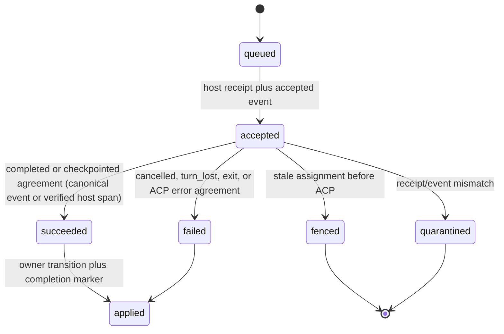
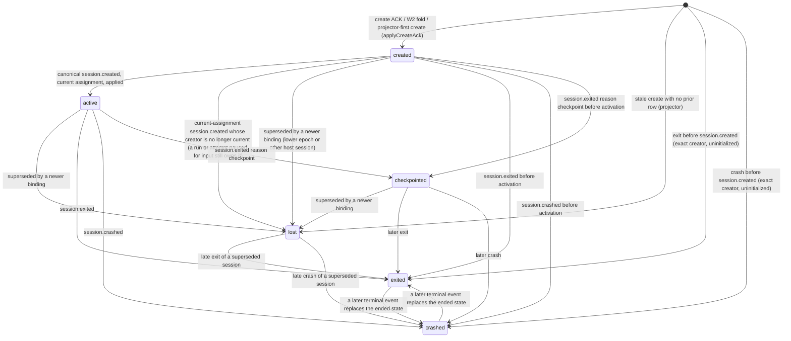
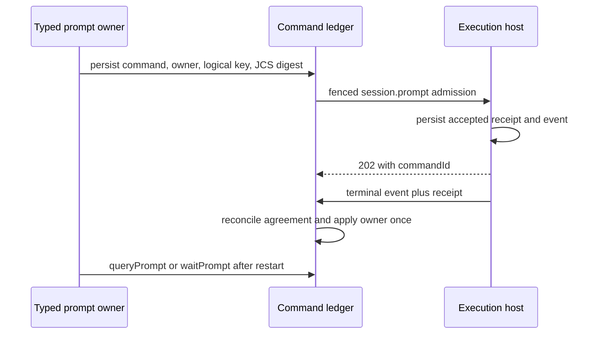
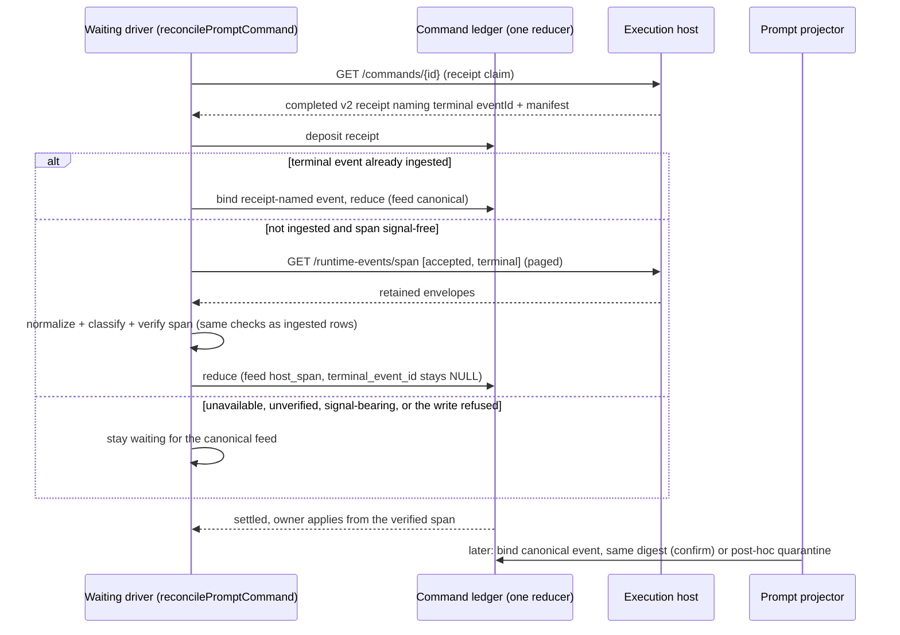
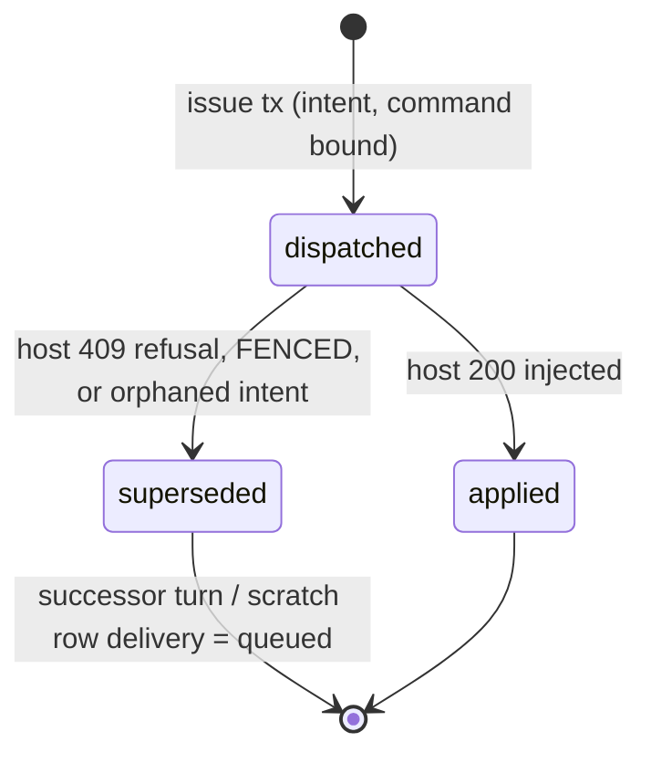
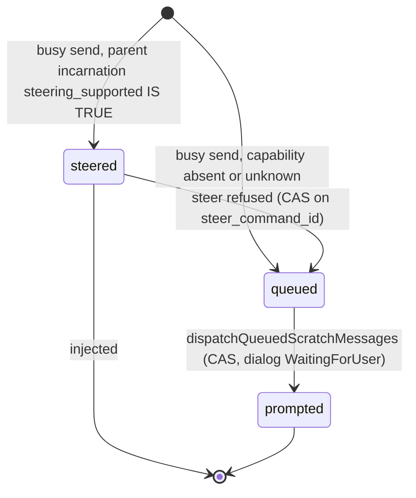
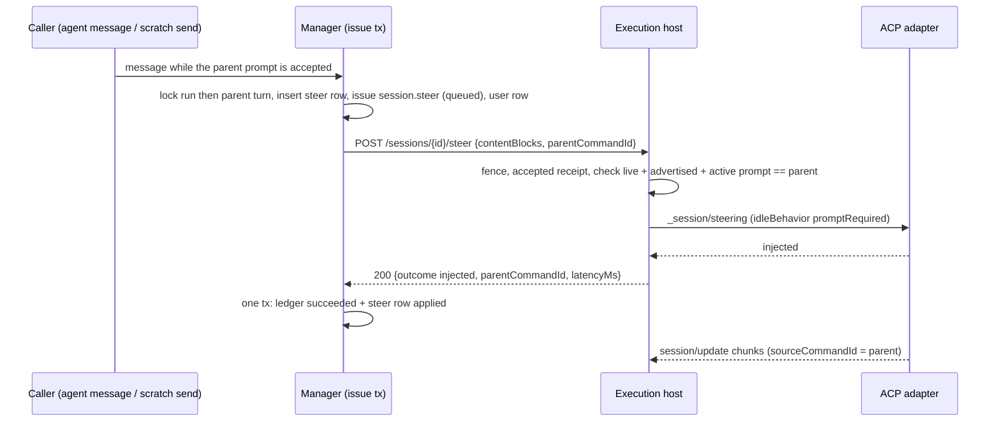
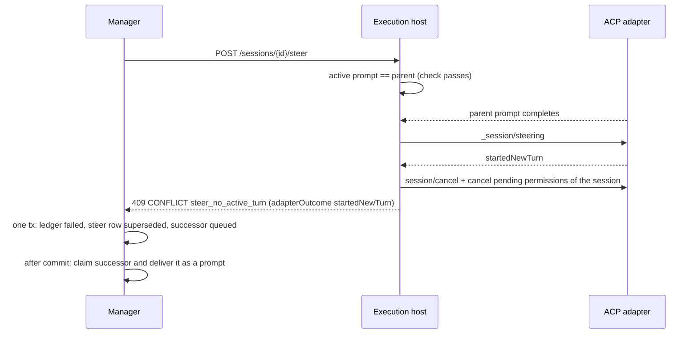

# Execution prompt lifecycle

**Status:** Implemented short-lived admission, private v2 request/owner storage and shared canonical-event/receipt reconciliation. Request-bound receipt/event v2 and verified immutable command-output manifests are implemented on the explicit v2 development path. Unknown-admission reconciliation, frozen-request recovery, create/ACP binding fences and the registered owner application engine are implemented. Every domain adapter is implemented (Flow node/gate, consensus, agent, scratch and local-package, gate chat, sync resolver), the prompt owner is mandatory at both the client boundary and the ledger constraint, and state-aware command/receipt retirement is implemented as a two-sided handshake (AB-05–07/10).


## Purpose

Define restart-safe prompt admission, progress, terminal reconciliation, and
owner application. A prompt is a durable command whose authoritative lifecycle
is canonical event plus receipt; a local wait or HTTP response is an optional
optimization and cannot decide a run transition.

### S5.2 host death before permission input (implemented; hosted CI qualification pending)

A response stored while the supervisor is dead can have an exhausted historical
`session.input` command but no host receipt. After checkpointing the missing
session, a confirmed receipt 404 plus agreed canonical/receipt `turn_lost`
evidence for the exact source prompt permits the existing unanswered-permission
resume path. Unreachable receipt lookup remains retryable 503; it never counts
as absence. No successful input receipt is fabricated and the old command stays
historical. Before authorizing the new assignment, the capacity/run transaction
locks and rechecks the exact HITL source/response, failed input generation and
source terminal digest, then archives the missing input identity in `_audit`
and removes only its `_delivery` marker. Existing node/gate resume authorization
still checks the released source assignment, current visit and ACP handle. A
racing response or changed terminal evidence refuses the claim. Existing
delivered-input result handoffs keep their stricter receipt/checkpoint proofs.

No migration, new HTTP status or permission timer is required. D1 proves both
unavailable-receipt refusal and confirmed-missing recovery at production boot;
the owning permission integration family retains successful-input and stale
generation controls.

### Creation before prompt admission

Flow node and AI/skill gate creation stores `execution_commands.create_intent`
before transport. The private normalized envelope freezes workspace and runtime
object handles, runner configuration, permission policy and launch inputs. Its
node ordinal or gate evaluation key is independent of prompt-owner fields and
has one command per assignment/create generation. Recovery reads that command
before running the payload factory again; a manager restart does not authorize
another session. The Flow continuation worker discovers these creates even
when the first prompt does not exist yet, using the same traversal lease.

S5.2 receipt-first retry amendment (implemented; hosted CI qualification pending): an
attempted owned create probes its exact receipt before another POST. Confirmed
404 permits reissue of the same stored envelope; transport uncertainty defers.
An **accepted** receipt splits on `inflight`, and the split is the whole
specification of this window: `inflight: true` means the live host incarnation
still owns the turn, so the driver defers to it. `inflight: false` means the
host restarted between writing the receipt and finishing the turn — the
turn_lost signature. Nothing advances such a receipt: the supervisor settles it
only when the SAME command id is re-sent, and `session.create` is not a
restartable object kind, so a re-send answers turn_lost rather than a session.
The driver therefore records the lost turn on the original command and
authorizes a replacement generation from the stored bytes, the same answer the
no-receipt window gets one step earlier. This is safe precisely because an
accepted-but-unfinished create returned no session id to fold and a restarted
host holds no live adapter to orphan. The replacement is bounded by the same
generation ceiling as the definitive-refusal arms above it, so a host that keeps
losing the turn ends in a terminal create failure rather than an unbounded
sequence of sessions. A completed 201 with matching command/run/kind/epoch
and a validated create result commits command settlement and binding under the
current owner lock, without re-sending. A rejected receipt uses the existing
definitive-refusal policy. Receipt lookup never reconstructs launch inputs.

The live ACK, recovered receipt and canonical `session.created` all check the
creator command against the current node visit/evaluation and newest admitted
create generation before binding. The host publishes `createdByCommandId` on
created events. An unknown create outcome retains its original command and
backs off for recovery; it cannot authorize a fresh session. The existing
observable resume fallback requires a definitive CHECKPOINT refusal, while
workspace readoption requires the host's explicit invalid-handle refusal.
A replacement retains its predecessor command and increments the create
generation without advancing the Flow prompt ordinal. The global continuation
worker runs in the production web boot (see
[Registered owner application engine](#registered-owner-application-engine-implemented)).

Prompt admission accepts the exact incarnation in `created | active`
(`ADMISSIBLE_PROMPT_INCARNATION_STATES`, one allow-list shared by every admission
site) (Implemented — ADR-167 D5 amendment 2026-09-23). `applyCreateAck` — the one
writer behind the live ACK, the owned-create replay, the W2 receipt fold and the
lifecycle projector — inserts that incarnation as `created` in the ACK
transaction under the run → assignment → logical-session → incarnation locks,
so admission never waits for the lifecycle projector. Before the insert it
retires every other open incarnation of the same logical session: a lower
assignment epoch (`assignment_superseded`) or, because consecutive flow nodes
reuse one session name on one assignment, the same epoch with a different host
session (`session_superseded`). The remaining fence wait (host-stream claim
lease plus projection lease) covers only the window in which no ACK is durable.
Agent, Flow and scratch callers propagate their cancellation signal through it,
and its timeout is a typed `PromptIncarnationPending` (code
`EXECUTOR_UNAVAILABLE`, reason `prompt_incarnation_pending`) that every caller
maps to a **yield**: the flow attempt stays `Running` for the continuation
worker (no session delete, no `markNodeFailed`), the agent run stays `Running`
for the agent continuation worker, and scratch keeps the dialog
`WaitingForUser` with the message persisted. It never permits a prompt against
a different or superseded session.

## Domain entities

- `execution_commands` remains the single command ledger and gains a typed
  owner reference, logical operation key, request schema/digest, and completion
  marker.
- `PromptHandle` is the serializable `{commandId}` locator.
- `command_receipts` is host-private durable side-effect evidence.
- `session.command` is the canonical accepted/terminal event type.
- `run_session_incarnations` binds host session identity to a fenced run
  session across restart, checkpoint, exit, and replacement.

## State machine

The command ledger: a terminal transition always passes the one reducer, fed
either by the canonical event or by the verified host span (`settled_from`).



The session incarnation (`run_session_incarnations.state`, Implemented — ADR-167
D5 amendment 2026-09-23). `created` is written by `applyCreateAck`, `active` and
the terminal states by the lifecycle projector, `lost` by supersession. At most
one row per logical session is `created | active | checkpointed`
(`run_session_incarnations_active_run_session_uq`); a `lost` row never re-enters
that set (`projectTerminal` refuses `lost → checkpointed` and records the reason
instead).



Readers of the incarnation state, re-derived when `created` rows began to exist
from the ACK and same-epoch predecessors began to turn `lost` at the successor's
ACK (D4 T1.6):

| Reader | What it means by the state | Verdict |
| --- | --- | --- |
| The 11 prompt-admission sites | may this session take a prompt | widened to `ADMISSIBLE_PROMPT_INCARNATION_STATES`; a drift guard (`admission-incarnation-sites.test.ts`) refuses a literal `active` |
| `runs/active-run-session.ts` (live-session ranking) | which logical session is live | unchanged, and now correct under lag: the successor ranks live from its ACK instead of its predecessor |
| `execution-host/runtime-object-holds.ts` (`live_session`) | does the run have any open incarnation | unchanged: run-scoped, and the superseding row is itself open |
| `runs/keepalive-sweeper.ts`, `agents/permission.ts` (`checkpointed` witnesses) | positive checkpoint of the current session | unchanged: only projected `session.exited{checkpoint}` writes it, and never for a `lost` row |
| `agents/prompt-owner.ts` (`lockAgentOwner`) | application waits for `exited | crashed` | unchanged: a second agent session on one assignment cannot start before the turn applies |
| `flows/graph/prompt-session-cleanup.ts` | skip the delete of an ended session | unchanged: it runs for node N before node N+1's create; gate sessions use their own name |

## Process flows



Settlement from host evidence when the shared stream lags (Implemented — ADR-167 D5
amendment 2026-09-23). The waiting driver (or, for a dead driver, the
continuation worker's re-drive) owns it; the watchdog and the reconcile sweep
never settle outside the stream-lost branch.



## Immutable requests, outcomes and command authority

The immutable storage/admission contract is active for production prompt
callers. `issueOwnedPrompt` runs the domain's admission
callback and routing checks in one transaction, locks before looking up the
namespaced logical key, and reuses the original ID/time and normalized request
on a matching retry. Migration 0140 rejects incomplete v2 requests and changes
to admitted identity. `readPromptRequest` verifies JCS bytes, SHA-256 and routing
before returning the original request; legacy redacted/digest-only rows remain
explicitly classified. Domain-specific callbacks are registered in the composed
production registry.

The shared `prompt-evidence` reducer is implemented for canonical prompt
outcomes. The projector, admission reconciliation, recovery and waiter retain
terminal receipt evidence and an exact canonical event pointer on the command
row. Receipt-first and event-first delivery remain pending until both agree —
or, for a `completed` v2 receipt, until the receipt agrees with the host's
verified signal-free span, after which `terminal_event_id` stays NULL until the
canonical event confirms the same digest (Implemented, 2026-09-23);
nested result/error values are compared intact. Migration 0141 protects saved
evidence and agreed outcomes from replacement and prevents deleting the
referenced event; only S2.11 retirement may later drop the copied bodies
(migration `0176`, see Command retirement below). A disagreement records an application quarantine while
preserving any valid terminal outcome. Verified evidence remains usable without
a new host read. Host request replay also checks the stored URL-selected target;
a legacy receipt with no target cannot attach to a newly created session.
Host SQLite v10 additionally stores the JCS v2 request digest, original host
key and accepted/terminal stream positions, preserving null metadata on legacy
upgrade. SQLite v11 separately records the public wire version; legacy rows
keep version 1. The production path accepts explicit request-v2 envelopes,
returns strict public receipt v2, and seals original ACP responses with immutable
command-output range manifests. The internal Web reader checks original bytes,
routing and retained contiguous event spans without using message projections.
Canonical command payload v2 carries the same closed request binding and nested
terminal value as receipt v2. Large or private values retain that original
payload in a verified immutable content object. The common reducer validates
the original event ID, host stream and sequence before comparing terminal
evidence. Late v2 events must match the old command's request digest and target
session; they cannot change the current assignment. The production owner
registry is composed and started at web boot; this development path exercises
the same application engine.

Keep `execution_commands.payload` as the existing allowlisted diagnostic projection. Add a **server-private** immutable `request_canonical_json` TEXT on the same ledger, with version and SHA-256. Store the exact JCS UTF-8 string for `{requestVersion, command:{id,kind,issuedAt}, fence, target:{hostSessionId}, payload}`; include every effect-affecting field, array order and frozen content/object references. Normalize optional fields once before storage. `issuedAt` and all generated IDs are created once and reused; no clock/random input during retry. Parsed request → strict schema → digest comparison precedes every dispatch. The host uses the same digest schema, including the URL target (not only envelope payload), before replaying a receipt.

> **Distinct from the run-trace read model.** `request_canonical_json` is
> COMMAND-DELIVERY data: server-private, immutable, digest-compared before every
> dispatch, and never served to a browser. Since TRC-05 the same prompt text
> also reaches a separate read model — a `user` row in `run_messages`, served by
> `GET /api/runs/{runId}/transcript` behind `readRepoFiles`, bounded at 256 KiB
> and keyed per dispatch. The two never share a row or a lifecycle: one exists
> so a command can be replayed byte-exactly, the other so a reader can see what
> the agent was asked. See [`run-trace.md`](run-trace.md). (Prose only — this
> document is at the 12-bullet Expectations cap and gains no new `PRM` id.)

Prompt text in this private request is protected user data, never a generic command DTO, browser event, log or metric. Persist credential references only; never resolved API keys/env secrets. Do not replay from redacted `payload`, a hash alone, a mutable scratch message, a refreshed capability profile, or current configuration. Existing credential injection remains at its established trusted boundary. An immutable request containing an unsupported secret-bearing transport field must be refused before admission, not silently redacted into a different replay request.

For new prompts, owner reference, logical operation key, request schema/digest/body, target incarnation and accepted generation are mandatory together. Retain the existing unique `(run_id, logical_operation_key)` with the owner family/subvariant encoded in the namespaced key and request-content comparison before replay; the key includes durable owner generation/turn identity, not a freshly generated retry UUID. Lock the authoritative owner generation and look up its logical key **before** allocating command UUID/issuedAt. If present, reuse those stored fields and compare the normalized caller-controlled semantics against the immutable request; a concurrent unique-key winner follows this same lookup/comparison path. Only a genuinely new operation allocates generated fields. Same key/same canonical request reattaches; same key/different request returns `409 CONFLICT` / `command_invariant_conflict` without effect. An authorized new turn creates a new owner generation and key.

Add only operational reconciliation fields to this ledger: transport disposition, terminal evidence identity, application disposition/lease/backoff, retirement eligibility. Use typed CHECKs and scoped indexes. Exact physical column names are frozen in S0 before generation. This does not duplicate node/run workflow state.

Terminal result/error identity is a versioned canonical value, preserving nested `{code,message,details}` without flattening or string-based classification. Full semantic output is a command-bound immutable host object/manifest `{objectId,generation,sizeBytes,sha256,commandId,hostSessionId,acceptedSequence,terminalSequence}`. Terminal event/receipt contain matching bounded references; owner replay reads and verifies original bytes. Redacted event snippets and `stopReason` alone cannot reconstruct structured results, gate replies or consensus output.

The command-output v2 manifest is a closed, bounded JSON object. It contains
`schema: maister.command-output.v2`, command/run/host/session/assignment identity,
`requestSha256`, the host `streamId`, `acceptedSequence`, `terminalSequence`, and
an immutable `response` reference (`objectId`, generation, byte size, SHA-256).
The separately sealed response preserves the original ACP prompt response,
including opaque `_meta`, with its command/session/request binding. Capture it
before asynchronous post-turn work can retain the decoder's response object.
The terminal event carries the bounded stop reason, output-manifest reference
and sealed runtime-object metadata; it does not embed opaque response metadata.

For v2 turns, semantic session events carry `sourceCommandId` in their original
payload (also inside a content object when referenced). The manifest addresses
the complete original span strictly after its accepted position and before its
terminal position, filtered by exact stream, run, host, assignment, session and
source command. A reader first verifies the manifest and response bytes against
the declared hashes/bindings and proves contiguous ingestion through terminal.
It then pages the preserved canonical events and verifies each original content
reference before reconstructing owner output. A missing position, object,
source binding or digest is incomplete evidence, never an empty successful
result. Historical reads cannot change a successor's session or domain state.
Only one new prompt may own a host session at a time; same-ID duplicates join,
and the active source command is released after durable terminal publication.

The referenced event span and original content objects remain held through
pending command/owner application. Host replay pruning must retain a v2
accepted command's event prefix until terminal acknowledgement; manager event
and object retirement must honor the manifest through the S2.11 eligibility
protocol. A process restart never replaces the manifest with current messages,
current session output or a redacted diagnostic projection. Manifest capture, verified reads and host prefix retention are implemented.
Manager retirement eligibility is implemented: eligibility is derived under the run/owner/event-ACK predicate, exchanged with the host through `POST /commands/{commandId}/retirement`, and compacts both sides to tombstones. The S3 object-retention half of the gate remains designed.

The evidence and application states are separate:

| Dimension | Legal states / transitions | Authority |
| --- | --- | --- |
| Transport | `not_sent → dispatching → acknowledged` or `unknown`; transient attempts/backoff and `reconciliation_required` are recoverable operational states | Transport can record uncertainty; it cannot invent execution success/failure. |
| Command | Existing queued/delivering/accepted/succeeded/failed/fenced vocabulary retained; receipt-first terminal may remain accepted/delivering while awaiting canonical evidence, or settle from the receipt plus the host's verified signal-free span (Implemented, 2026-09-23) | One terminal reducer consuming validated canonical evidence (ingested terminal event, bound by the projector or directly by receipt `eventId`) or the verified host span, each plus an agreeing receipt; `settled_from` records the first feed; a definitive pre-effect refusal has explicit evidence. |
| Application | `pending → applying → applied` or `superseded`; transient retry / poisoned remain durable | Existing domain owner transaction under assignment/owner-generation fence; marker commits with domain writes. |
| Retirement | `retained → eligible → host_confirmed → tombstone` | Eligibility protocol, terminal ACK, application disposition, run state and replay grace. |

All producers of terminal evidence call **one reconciliation reducer**: live command deliverer, receipt recovery, prompt projector, `queryPrompt`, `waitPrompt`, startup/sweep. Query/wait may schedule reconciliation but never implement a second terminal writer. The reducer takes two evidence feeds — `canonical` (the ingested terminal event, bound by the projector or directly from the receipt's `eventId`) and `host_span` (the verified span, only for a `completed` v2 receipt with a manifest and a signal-free span) — and writes `settled_from` once, in the UPDATE that first sets the digest (Implemented, 2026-09-23). The projector must remain DB-only: receipt fetch/host I/O occurs outside its transaction and deposits validated evidence for a later reducer pass.

Receipt contract v2 includes command ID/kind, host key, run ID, assignment ID/epoch, URL-selected session identity, request schema/digest, phase, original result/error/reference, terminal event identity/sequence. Derive receipt bindings from the stored receipt/fence/session, not the querying client's body. Receipt absence/failed reads are not failure evidence. A canonical terminal with temporarily unavailable receipt waits/retries; verified matching durable receipt evidence already stored in Postgres remains valid after host retirement. Genuine disagreement quarantines the command and blocks owner application without changing a valid terminal outcome to another value.

Historical late evidence may settle the exactly matching old command. It must never update a successor's current session, cost, artifact association, node attempt, HITL, scratch dialog, gate reply or agent state. Maintain the narrow existing stale terminal exception; any extension for an already committed object intent must be explicit, generation-bound, historical-only and tested in S3.

## Unknown admission and transport recovery

`startAsyncPrompt` returns the original handle when ACK/receipt reads remain
unavailable. It records `unknown`, then `reconciliation_required` when the
outbound budget is exhausted; command state stays open and `last_error` is not
filled with a guessed execution outcome. The initial budget is three sends of
the same ID. V2 dispatch reparses and verifies the private frozen request on
every attempt. A local `not_sent` preflight refusal can fail a first unsent
operation; a later refusal cannot prove an earlier unknown send failed.

`queryPrompt`, the waiter and startup/sweep use one reconciliation reader. It
checks stored evidence before host I/O and uses `next_attempt_at` as a 30-second
receipt-read claim token followed by a 5-second due delay. Competing queries
cannot multiply reads; a stale completion cannot replace another claim.
Canonical receipt/event evidence remains actionable regardless of outbound
budget. The wire request deadline covers both headers and the response body,
including a partial 202 ACK whose body never completes. Closed invalid receipt
or admission evidence quarantines application with a bounded protocol cause.

Startup can resend an unacknowledged v2 command only after a reachable missing
receipt, within its remaining budget and while its original assignment is
current. It reads the original stored target, ID, issue time and payload.
Legacy requests without preserved bytes remain held for evidence reconciliation.
A process death after the final dispatch claim also enters recoverable unknown
state; it does not gain a fourth automatic attempt.

The internal `rearmPromptAdmission` repair operation compares command ID,
request digest, cumulative attempts and the observed maximum. One successful
CAS opens three additional sends without resetting attempt history or request
identity. Acknowledged, terminal, quarantined or stale repair requests cannot
rearm. Its caller must hold the existing operator/domain repair authorization;
this increment adds no public repair route. Receipt/event settlement schedules
application by the registered production owner adapter; the durable worker
reclaims pending application after the original caller exits.

## Session create and ACP binding fences (Implemented)

Live create ACKs, recovered create receipts and canonical `session.created`
projection use `applyCreateAck`. It locks the run, its current active assignment,
logical session and any known host incarnation in that order. An obsolete
assignment or incarnation returns `stale` without changing the successor's
session/ACP IDs or node-attempt binding. The original command can still retain
its successful receipt; a live caller receives `CONFLICT` with
`reason=assignment_fenced` after that historical result commits.

Post-create scratch state writes assert the same assignment and exact persisted
host/ACP binding inside their transaction. Agent and sync callers use the binding
already committed by the ACK. Independent ACP setters are removed. When a new
assignment installs its current binding, earlier created/active/checkpointed
incarnations lose their projection slot with `state=lost` and
`reason=assignment_superseded`; their identities and evidence remain retained.
This transition records lost binding authority and does not claim a host exit.

AT-08 holds a real supervisor create ACK while a successor assignment becomes
active, reconciles the old receipt before releasing the held ACK, and rejects
the delayed callback. It checks that both old command evidence and the new
session/ACP binding survive. Prompt-owner state application has its separate
generation checks in the following contract.

## Prompt owner and recovery windows (Implemented)

### Terminal prompt state → run outcome (ADR-177, Implemented)

A settled prompt command is durable evidence about a turn. This table is the
complete mapping from that evidence to what the run does next; the reconcile
sweep reads it for a `run_kind='flow'` agent node with no live session, and the
full classification table with its writers lives in
[`reconciliation-gc.md`](reconciliation-gc.md#evidence-classes-adr-177-implemented).

| Terminal / pending prompt state | Run outcome | Attempt | Command |
| --- | --- | --- | --- |
| `succeeded`, applied | the graph advances | the owner's completion | `applied` |
| `failed` (ordinary), applied | the node fails; `runs.status='Failed'` per the graph's own rules | `Failed`, `decision` NULL | `applied` |
| `failed {turn_lost}` | `Crashed` (`turn-lost`) — **recoverable**, `resume_target_step_id` stamped | `Reworked`, `decision='turn_lost'`, `error_code='CRASH'` | `applied` |
| quarantined (`prompt_terminal_conflict`) or `poisoned` | `Crashed` (`owner-poisoned`) | `Reworked`, `decision='turn_lost'`, `error_code='CRASH'` | `applied` |
| pending (ingest / application / claim) or `inflight` | **unchanged** — the named writer owes the next move | open | unchanged |
| `pending_ingest` with a `completed` v2 receipt and a readable, verified, signal-free span (Implemented, 2026-09-23) | settles from host evidence (`settled_from='host_span'`) through the waiting driver or continuation worker, then follows the `pending_application` / applied rows | open until application | settled; later confirmed by the canonical event |
| `pending_ingest` or `inflight` on a host whose stream is `lost` | `Crashed` (`stream-lost`) — since 2026-09-23 only after a `completed` probe failed to settle from host evidence (Implemented); a host-evidence read the resolver was denied defers the crash to a later tick | `Reworked`, `decision='turn_lost'` | `applied` |
| evidence moved between the sweep's classification and the boundary write (settled, `applying`, applied without a quarantine, `superseded`) | unchanged — the boundary re-reads the command under lock and yields (`lost-cas`, guard `command`); the next tick classifies the new state | open | unchanged |
| `failed {turn_lost}`, settled-unapplied, found by Recover on a still-open attempt | Recover re-dispatches one fresh prompt | the crashed attempt is closed | `superseded`, `completion_applied_at` NULL |

`turn_lost` is matched on the error **reason** — carried nested
(`last_error.details.reason`, the ingested-terminal-event path) or flat
(`last_error.reason`, the `foldReceipt` accepted-with-no-terminal fallback) —
never on an HTTP status and never on the code, which is `PRECONDITION` on one
path and `ACP_PROTOCOL` on the other. `error_code` on the attempt is normalized
to `CRASH` so one root cause stays one Observatory cluster.

#### Recovery windows for host-evidence settlement (normative, Implemented — ADR-167 D5 amendment 2026-09-23)

Each cell names the writer that owes the next move; no cell is left to a timer.

| Run / command state | Canonical feed | Host-span feed | Owner of the next move |
| --- | --- | --- | --- |
| `Running`, prompt `accepted`, driver alive | projector binds, or D-B4 direct bind | driver's `reconcilePromptCommand` claim (first attempt right after the receipt deposit, then every 5 s) | the waiting driver |
| `Running`, prompt `accepted`, driver dead | same | same, reached through the continuation worker's Running-attempt re-drive (reattach → wait) | flow continuation worker |
| `Running`, settled `host_span`, application `pending` | confirms later | — | prompt-owner worker / waiting driver |
| `Running`, settled, over `maxDurationMinutes` | — | — | not killed while its owner can still apply it (`pending_application` / `applying`); a poisoned, quarantined or lost newest turn, or a `completed` receipt on a lost stream, has no writer left and is killed (D-C1) |
| sessionless `Running`, `pending_ingest`, stream active | event consumer | driver / continuation worker | as ADR-177: SKIP |
| sessionless `Running`, `pending_ingest`, stream `lost`, probe `completed` | — | the reconcile resolver, through the same claim | settles → re-classified; otherwise decided by `execution_commands.host_span_verdict`, the answer of the latest read that ran (cleared when a read claims the command): `refused` — whoever read it — or a command the host span cannot settle → `Crashed` (`stream-lost`); no verdict (a read in flight), `busy`, or a receipt still being read → SKIP `evidence-pending`. Every read ends in a verdict or a settlement and the resolver reads itself whenever the claim is free, so the skip waits on the next answer, not on a timer (migration `0178`) |
| assignment released (checkpoint / release won) | late exact `session.command` | same reducer, historical ledger only | nobody for current state (D4) |
| span signal-bearing, failed/fenced receipt, or no manifest | projector | — (declined) | the canonical path, as before this amendment |
| span unreadable or unverifiable, or the database refuses the host-span write | projector | WARN (`prompt-host-span-unavailable`, `-unverified` with its bounded `reason`, `-settlement-failed` with the SQLSTATE and `retryable`), retried on the next claim; records `host_span_verdict='refused'`, or `busy` for a retryable write failure (SQLSTATE class `40` or `08`, `55P03`, `57014`) | the canonical path; the waiter keeps waiting and never throws |
| a host object read answers `command_in_progress` (both sides cap concurrent object reads; the host at 2) | — | re-read inside the held claim, linear 100 ms backoff, at most 5 attempts; still busy → WARN `prompt-host-span-busy`, `host_span_verdict='busy'`, which the stream-lost resolver treats as no verdict | the same claim (`prompt-host-span-fake.integration.test.ts` B5-busy; `reconcile-host-evidence.integration.test.ts` for the resolver) |

#### Earliest application point per owner (Implemented, 2026-09-23)

Host-span settlement makes a command claimable; each adapter still decides when
it can apply.

| Owner | Applies after | Why |
| --- | --- | --- |
| `flow_node_attempt` (node, permission_resume, gates, consensus), `sync_resolution`, `gate_chat` | settlement | no projector dependency; output is hydrated from the verified span |
| `scratch_message` | the transcript projector passed the terminal event | the reply must be visible before the dialog returns to `WaitingForUser` |
| `agent_turn`, `consensus_draft` | the lifecycle projector wrote the session `exited`/`crashed` | teardown must be observed before finalization |
| any adapter check that reads the terminal event row (`findAgentPromptHalt`, `permissionCheckpointOrder`) | the canonical event is bound | `assertTerminalEventConfirmed` (`prompt-owners.ts`) defers (`terminal_event_unconfirmed`) instead of reading absence as proof |

### Registered owner application engine (Implemented)

Application modules construct a typed `PromptOwnerRegistry` and pass it to
`createExecutionHosts` and `startPromptOwnerWorker`. Query/wait and the worker
use the same application path.

The **production registry is composed at one root**, `web/lib/workers/runtime.ts`,
which `instrumentation-node.ts` reaches only through a dynamic
`await import()`. The composition root never lives under
`web/lib/execution-host/`: every domain registry imports that package, so a
registry module placed inside it closes an import cycle at module load. It
composes exactly five registries — `flowPromptOwners`, `consensusDraftPromptOwners`,
`scratchPromptOwners`, `syncPromptOwners`, `gateChatPromptOwners` — covering the
five `PromptOwnerSchema` kinds `flow_node_attempt`, `agent_turn`,
`scratch_message`, `gate_chat` and `sync_resolution`.

Three boot-time refusals keep that composition honest, and each is a
`MaisterError("CONFIG")`:

- **Uniqueness.** `createPromptOwnerRegistry` throws on a duplicate kind.
  `agent_turn` is served by `consensusDraftPromptOwners`, which routes a
  `consensus_draft` variant to draft preparation and every other variant to the
  ordinary agent owner. Adding `agentPromptOwners` beside it is therefore a boot
  failure **by design**, not an oversight — `agentPromptOwners` refuses
  `consensus_draft`, so the pair cannot both be right.
- **Completeness.** The composed key set is asserted against
  `new Set(PROMPT_OWNER_SHAPES.map((shape) => shape.kind))`, mirroring the
  projection registry's own check. The database CHECK derives from the same
  shapes, so registry, schema and constraint cannot drift apart silently.
- **Emptiness.** `startPromptOwnerWorker` refuses an empty registry, so a boot
  order that starts the worker before the registry module resolves fails loudly
  rather than running a worker that owns nothing.

`startDurableWorkers()` and `stopDurableWorkers()` are the root's only exports
besides the registry. Both are guarded by `isApplicationStopping()` and by three
`Symbol.for("maister.durable-workers.*.v1")` process slots, so a double start
returns the same three handles and a stop clears only slots this process still
owns. A plain module-scoped variable is not sufficient: Next bundles
instrumentation separately from the production server entrypoint, so the health
reader and the composition root resolve different module instances of the same
file. `web/lib/workers/health.ts` reads those slots and imports no domain
module, which is what lets the scheduler's `system_sweep` summary report worker
health without dragging the flow runner into its import graph.

The worker selects due terminal request-v2 commands from `execution_commands`
with `FOR UPDATE SKIP LOCKED`. A waiter applying its own command claims that one
row without `SKIP LOCKED`: since settlement no longer waits for the prompt
projector, the projector may still be confirming the row, and skipping would
report a settled turn as pending (bounded by the transaction's `lock_timeout`;
ADR-167 D5 amendment). Each free slot commits a unique claim before
preparation. The 30-second owner lease renews every 10 seconds while output is
read in bounded pages. No additional workflow or result queue is created.
Normal due ordering and retry deadlines let other commands make progress.

Preparation verifies the original request-bound response, manifest and entire
event span. The span comes from the canonical rows once the contiguous frontier
covers the terminal; before that (a stream with no contiguous frontier yet
included) — a turn settled from the host's span — the same
verifier (`commandEvents`) reads it from the host, and an unreadable or
signal-bearing span answers `event_frontier` exactly as the canonical path does. That answer is late evidence, not a failed application: while the stream is not `lost`, owner application defers it without counting a failure (`PromptOwnerDeferred('event_frontier_pending')`, `prompt-owners.ts`); once the stream is lost nothing will deliver the output, and the refusal counts toward poisoning — the bound (`prompt-output-frontier.integration.test.ts`). Adapters must exhaust the output iterator; a prefix cannot produce
an applicable result. Their DB-only callback locks the domain authority in its
existing order, rechecks its current generation and persists the result and
any successor readiness. The final command marker compares claim token, source
digest, terminal digest and unexpired lease in that same five-second bounded
transaction. A lost marker CAS rolls back all domain writes, including a late
callback after another worker has already applied the command.

That order starts at the run and ends at the command row, so every
prompt-evidence writer — the prompt projector, the direct binding and the
host-span settlement — takes the command's run `FOR KEY SHARE` before the
command row (`lockPrompt`, `prompt-evidence.ts`). Binding and confirming write
the row twice in one transaction, which re-runs its foreign-key checks, and
with host-span settlement an owner can already be applying the turn — holding
the run, waiting for the row — while the canonical event confirms it. Taking
the row first deadlocked the two (`prompt-host-span-fake` B-lock-order; ADR-167
D5 amendment).

Successful application sets `application_state=applied` and
`completion_applied_at` together. Explicit supersession retains the historical
outcome without marking it applied. Transient application failures roll back
and retry after 1, 2, 4 and 8 seconds; the fifth failure poisons application.
Invariant failures poison immediately. Host/DB unavailability, and a deadlock
that picked the apply transaction as its victim (`40P01`), leave the owner
retryable without consuming failure attempts. `PromptOwnerDeferred` retains a
valid owner awaiting another durable domain transition, clears its claim and
retries after one second without increasing the failure count. The canonical command outcome is
unchanged by every application disposition. A registered live waiter remains
pending until application succeeds, and surfaces typed poison/supersession
instead of returning an uncommitted domain result.

Shutdown aborts preparation, drains renewal and DB work, and releases only the
worker's own claim. Failure to confirm that release makes shutdown fail and
retains the durable claim for expiry/recovery. Wake signals are advisory;
restart selects the same durable commands without a process-local result.
An adapter may run an `afterCommit` cleanup hint only after successful application.
Its existing durable domain or GC state must recover cleanup if the process dies
before that hint; a failed hint cannot poison an already committed result.

### Flow gate adapter (Implemented)

Skill and AI gate dispatch persist an evaluation-specific owner with the exact
node attempt, assignment and session incarnation. The caller and owner worker
decode the complete verified command output through the same gate adapter;
the existing gate transition and command application marker commit together.
The stored evidence preview is bounded independently of verdict extraction.
Re-entry consumes the same evaluation and command before rendering a new
prompt. A superseding assignment cannot reuse the old result as its own.

A failed application leaves the evaluation running and preserves the host
session. The Flow driver yields with `flow_prompt_continuation_pending`; it
does not convert an unavailable result into a failed check. The generic worker
can recover the gate application after process death. Gate application alone
does not establish complete Flow restart recovery.

### Flow action and graph continuation (Implemented)

Node prompts admit the exact attempt and ordinal before dispatch. Their owner
stores the bounded action result and original structured-output payload in
`node_attempts.action_completion` atomically with the command application marker.
Full-output extraction does not depend on the truncated stdout preview. Local
CLI/check actions before gates also snapshot their result and file output.

Owned-prompt graphs (any `ai_coding`, `judge`, `orchestrator` or `consensus`
node, or an `ai_judgment`/`skill_check` gate) acquire `runs.flow_driver_token`
with a renewable 30-second lease. Every traversal transaction checks its active
assignment and lease, including a final check before commit; global host
consumers and other runs retain their independent database handles — including
a consensus node's draft children, which the fan-out dispatches on the root
handle because the parked parent has already released its assignment. Owned prompt admission repeats the
lease check after its immutable INSERT: holding the run lock cannot authorize
a new command after expiry. Real node and AI/skill gate cases verify rollback
at that boundary, followed by one successful continuation by the next driver.
CLI/check actions and command-check
gates in these leased graphs receive the driver cancellation signal. Cancellation
before dispatch prevents spawn; cancellation during execution immediately kills
the detached process group, including SIGTERM-resistant descendants, then yields
without closing domain state. Ordinary CLI timeouts retain their cleanup grace.
The persisted 500-visit ceiling applies to fresh admission; recovery can finish an
already admitted 500th visit but cannot append visit 501.
The bounded continuation worker re-enters the same driver from durable attempt/cursor state even after command
application is complete. Node closure and its selected cursor commit together with
`node_attempts.finish_continuation`. Rework retains comments and session policy;
retry retains its bounded decision across process death. Recovery also closes the exact completed prompt's source
session before admitting a successor session.

Three real-process SIGKILL windows verify linear node/gate/successor recovery
without another accepted node prompt. Additional real-process cases preserve
failed nodes, rework context and the retry budget. Orchestrator park releases its
assignment; the capacity-checked child-wake claim stores `action_resume` and
advances the exact attempt ordinal before another prompt. Live wake, a crash
after that claim and deferred capacity recovery are covered.
Pre-prompt creation uses the durable intent described above. The owner and
continuation workers run in the production web boot.

An orchestrator child wake accepts a completed node or permission-resume owner
only under the exact assignment that parked it. When that assignment consumed a
`permission_result` handoff, the next authorization retains the full handoff as
`permissionResult`: original input/checkpoint/incarnation, HITL choice and the
receiving assignment. The original source remains checkpointed and fenced. A
pre-prompt rollback preserves this lineage and the already admitted next ordinal;
a repeated child event cannot create another turn. A fresh permission on the
next turn requires its own response.

Checkpointed node permission resumes without a prior admitted input use the
capacity-checked idle-resume claim. It rebinds the exact source attempt and stores
`action_resume.kind: permission`, the new ordinal, original ACP handle, HITL ID,
request ID and selected option before dispatch. The leased graph driver admits
the `permission_resume` command and reuses the original HITL only after validating
the reissued tool call and options. It remains `NeedsInput` until input delivery
is acknowledged, then uses the normal action/gate/cursor reducer. Restart after
the claim consumes that authorization. An unavailable resume handle fails the
attempt and run without creating an empty replacement session. A stored input
delivery must be classified before another turn can be authorized. Confirmed input with an unverified source or an unclassified terminal error
remains pending. A distinct
permission emitted during a resumed prompt has its
own HITL and choice. A later checkpoint matches that `permission_resume` source,
including its prior HITL owner, and advances the same attempt once. Confirmed
input and a completed resumed source use the same verified result handoff at
its current ordinal; they do not dispatch a third prompt.

Checkpointed AI/skill gate permissions with no admitted input retain their exact
evaluation. The capacity claim advances `gate_results.prompt_ordinal` and stores
`permission_resume`, including the source request/choice and retained ACP handle.
It inherits the parent action through its recorded digest and rebinds the same
attempt; the parent action ordinal/result stay unchanged. Resumed graph reads
validate that digest and continue the gate without rerunning the parent action.
The old action-turn authorization is cleared after this explicit handoff. Gate
create, prompt admission, reissue and ACK check the current evaluation/assignment
and ordinal. An unavailable resume handle fails without an empty replacement.

If a gate input was delivered before checkpoint but its manager acknowledgement
was lost, the original completed prompt can instead supply a result handoff.
The preflight verifies its full request-bound output and uses the ordinary
manifest-bound gate parser and calibration. The capacity claim rechecks that
evidence, source request/choice, checkpoint receipt, flow revision and parent
snapshot. It records `permission_resume.kind: permission_result` on the same
evaluation at the same ordinal, with input/checkpoint/incarnation lineage and a
digest of the verdict, and atomically acknowledges the original HITL. Graph
reentry validates both the parent snapshot and transferred verdict before using
them. It sends no new gate prompt and does not reopen the released source
session. The source owner stays fenced; only the explicit receiving assignment
may consume the historical result. Missing or merely accepted input receipts
remain pending without a capacity claim.

A succeeded source command can still have a non-`end_turn` ACP stop reason.
Its verified output is decoded as the ordinary failed node result or gate
verdict. An unexpected `cancelled` is mapped by the supervisor to a failed
`ACP_PROTOCOL` command; that exact receipt/event-agreed error can also be
handed off. An adapter's agreed `EXECUTOR_UNAVAILABLE` rejection uses the same
failed-result handoff and preserves its original code.
The claim and later lineage reads require the original request and
terminal digests and refuse terminal-conflict quarantine. Preflight, capacity claim and
historical lineage reads verify the canonical command/assignment/session boundary
and compare host sequence positions. Wall clocks and arrival order cannot prove
this. An agreed response or explicit adapter-unavailable error remains a completed
result even if its terminal event follows checkpoint acceptance. Only a protocol
failure in that later position follows the interruption path below. Missing
ordering evidence stays pending. For a completed failed source, nodes retain
`ok: false` with the original error code (`ACP_PROTOCOL` for a non-`end_turn`
response); gates retain their failed verdict. The graph
then uses its existing failure handling, without another prompt, successor
action or parent replay. Fenced commands and other failed-command codes remain
unclassified. Event ingestion acquires the run sequence lock before inserting
its FK child, so a simultaneous idle-resume claim cannot deadlock while both
transactions upgrade the same run row lock.
Runtime-object projection atomically inserts a missing catalogue row; a
concurrent loser locks and validates the committed row instead of failing on
the primary key or accepting changed metadata.

A confirmed input followed by an agreed `ACP_PROTOCOL` failure after checkpoint
acceptance has a separate continuation path (`0152`). Once the exact checkpoint
has succeeded, the normal capacity claim records `permission_continue`, retains
the original input/checkpoint/incarnation lineage and ACP handle, and advances
the same attempt or gate evaluation by one prompt ordinal. It settles the
original HITL/input and moves to Running atomically. A gate retains the parent
action snapshot and digest. Creation, prompt admission, owner application and
gate graph reentry revalidate this grant and its original evidence. Restart
reuses the persisted ordinal; the resumed prompt asks to continue the prior
work, and the original accepted prompt remains historical. The old permission
choice is never redelivered. A later permission creates a new HITL requiring
its own answer, even for an identical tool/options payload. A refused ACP handle
fails without creating an empty session. Fenced sources and unclassified failure
envelopes cannot authorize a new turn or a result handoff.

An original input receipt rejected with HTTP 410 and `HITL_TIMEOUT` records a
delivery that did not resolve its deferred. After the exact source prompt is
terminal and checkpoint is acknowledged, the current parked Flow can settle
that rejection as `Failed / HITL_TIMEOUT`, matching the live response policy.
The transaction locks and rechecks the still-current run, original HITL and
commands, released checkpoint assignment, incarnation and latest attempt/gate.
It refuses a changed owner, response, revision, action snapshot or receipt.
It records `rejectedDeliveryCommandId` and the error in the HITL audit, closes
the pending human assignment, marks the node failed, and emits the existing
terminal events atomically. The original action/verdict evidence is retained;
an unfinished gate is closed without inventing a prompt result. This terminal
decision allocates no execution capacity, assignment or ACP turn. Missing and
accepted receipts, other rejections and unproven checkpoint evidence cannot
cause this transition.

In-flight node and AI/skill gate permissions retain the exact source command,
attempt/ordinal, assignment and incarnation in the HITL schema. The existing
node source shape is unchanged; the closed gate variant adds its kind, gate ID
and evaluation ID. Delivery requires that exact latest evaluation. The leased
driver can reattach
that turn while the run remains `NeedsInput`; it does not authorize another
prompt or advance the cursor. Replayed command/request pairs reuse their HITL
row. Delivery intent stores the original input command and complete selection
before dispatch, so a lost ACK replays that same command. Re-entry directly
reconciles already admitted inputs before waiting for prompt application. This
also covers an applied action or gate verdict whose permission ACK was lost:
the result may be stored while `NeedsInput`, but session cleanup and graph
advancement wait for permission delivery. Gate recovery reuses the parent action
snapshot and original evaluation. Confirmed input, delivery audit, HITL completion
and the graph wake commit together. A definitive
503 can be retried by an operator with a fresh delivery; automatic recovery
does not grant that decision. Persistence failure releases the driver wait to
the durable continuation, which replays the request and completes the original
supervisor deferred after delivery. A checkpointed turn under a replacement
assignment uses the persisted permission-resume/handoff authorization above.

### Agent finalization boundary (Implemented preparation)

`web/lib/agents/finalization.ts` separates terminal preparation, DB application
and cleanup. `prepareAgentRunFinalization` requires a pooled connection. It
reads the launch-time public-result contract and workspace provenance and
performs read-only workspace inspection before the application transaction.
`apply(tx)` locks the run and rechecks that provenance, then commits its
ordinary status, result, assignment release, token revocation and terminal
notifications together. A pending human-ask activation defers finalization.
Concurrent finalizers have one status-CAS winner; an outer rollback also rolls
back the result and notifications.

`afterCommit` verifies the committed terminal generation before releasing
materialization, directories and context mounts or promoting the agent pool.
Existing GC backstops retain cleanup retry ownership. The public
`launch.ts:finalizeAgentRun` entrypoint uses this same implementation.
Qualification covers outer rollback with real managed files, refusal of a
transaction connection, changed contract provenance and concurrent finalizers,
alongside the existing result, dirty-workspace, shared-tree and persistent-park
suites (39/39). The first-turn adapter below additionally rechecks the exact
turn, assignment and session before application. Every other agent variant is implemented below, and the owner is now mandatory
at both the client boundary and the `execution_commands_prompt_owner_required`
ledger constraint (S2.12, migration `0159`).

### Initial agent turn (Implemented)

The first agent turn uses its persisted launch assignment as
`turnId`, prompt ordinal zero, and its exact logical session and incarnation.
Admission waits for canonical session projection and records one immutable
owned prompt. Launcher re-entry finds that command before rebuilding the prompt
or creating another session. Both the live waiter and an explicitly registered
owner worker apply the original completion through `agents/prompt-owner.ts`.

The adapter consumes the entire verified output stream and extracts the public
result against the launch-time contract. A result beyond the bounded transcript
preview remains usable. Raw process exit cannot replace an owned ACP completion
with a result assembled from stack-local text. An adapter error or non-`end_turn`
response fails the turn even when partial output contains a valid result block.

Before workspace inspection, the adapter closes only its exact current session
through the existing fenced command ledger. Pending lifecycle projection defers
application. The terminal transaction rechecks the launch assignment, epoch,
session and incarnation, then commits the prepared finalizer and command marker
together. A superseded or checkpointed incarnation cannot finalize a successor.
Cleanup runs after commit under the existing terminal-generation check and GC
backstops.

A persistent agent's successful `end_turn` uses `agents/park.ts` instead of
terminal finalization. The same owner transaction parks it in `NeedsInputIdle`,
sets its checkpoint, retains the ACP resume handle and releases its assignment
with the command marker. It publishes no terminal public result or terminal
event. The exact process is closed before the slot is released. Failed ACP
completion still uses ordinary failed finalization. Post-commit pool promotion
checks the committed park generation; the existing agent scheduler tick
independently retries queued work if that hint is lost. The public
`parkPersistentAgent` entrypoint delegates to this same DB transition.

Qualification uses real Postgres, the production launcher and ACP supervisor:
large-output extraction, actual launcher process death before completion or DB
application, autonomous owner recovery, superseded source refusal and both
failure outcomes. Removing the application-generation guard makes the stale
source test fail by finalizing the successor. Persistent first-turn qualification
also covers live parking and actual process death before completion or the park
transaction. Resume remains required below; this
increment does not enable the global owner worker.

### Agent session creation (Implemented)

Initial turns persist their original prompt in `agent_turns` before creating the
ACP session, using the launch assignment ID and ordinal zero. Message turns keep
their already accepted ID and ordinal. The private owned-create intent binds
that turn and stores the original canonical create request and digest. Migration
`0154_agent_owned_create` extends the existing checked create-intent union; Flow
creation retains its existing authority and behavior.

Re-entry loads the retained turn/create before reading current agent definitions,
reissuing credentials or materializing a new prompt. It reuses one create command
and one prompt even if Web dies before create ACK or before prompt admission.
The ACK checks current run/assignment/turn authority before updating session
bindings. Agent resume refuses an unavailable ACP handle without the Flow-specific
fresh-session fallback. A definitive create refusal atomically finalizes the run
as Failed and supersedes its un-dispatched turn; restart repeats that settlement
after a lost transaction. Unknown admission remains recoverable.

Qualification uses real ACP creation and SIGKILL at both DB boundaries, changes
the agent definition before restart, and checks the original result. An actual
ACP resume refusal is covered live and with process death before failure commit.

### Agent session observer (Implemented)

A live agent session carries a second, non-owning reader beside its prompt
owner: the observer that consumes the canonical session stream for permission
delivery, the `NeedsInput -> Running` flip and terminal events. It is supervised.

Every failure on the stream's path — host content, a projection transaction
deadline, pool acquisition — surfaces as a transient `MaisterError`, and the
stream itself is a durable replay, so the observer RE-ENTERS it instead of
dying: up to `AGENT_CONSUMER_MAX_ATTEMPTS` attempts with capped exponential
backoff, sized to outlast the reconcile grace. A retry is a RECONNECT, not a
restart: the observer keeps its per-session state and resumes after the last
event it finished handling, so no side effect (a permission HITL row, an input
delivery) is replayed, and the turn text the ADR-165 sentinel contract reads
survives. A fenced stream or the run's own abort signal stops it without retry.

Every attempt's failure is reported with its `code`, `message` and `details` —
never a bare error name, which cannot be investigated after the fact — plus the
attempt number and the resume point. Exhaustion is an ERROR line stating that
the run has no observer.

The observer never terminalizes the run. An owned prompt's outcome belongs to
its prompt owner and its own retry/poison ledger.

There is exactly ONE observer per host session per process. The in-process
registry (`lib/agents/session-observer-registry.ts`, the `hasSyncDriver`
precedent) is that mutual exclusion — two readers of one canonical stream would
double every side effect on it — and it is also the discriminant the reconcile
sweep keys on. A `Running` `run_kind='agent'` run whose session is live and whose
observer is gone (the web process died, or the supervisor above exhausted its
attempts) is given an observer back by the sweep (`reobserve`,
`agent-observer-gone`); with one registered here it is healthy and skipped
(`agent-observer-live`). See [`reconciliation-gc.md`](reconciliation-gc.md).

Re-observation after process death re-enters the stream FROM THE BEGINNING — the
new reader has no resume point — so every side effect on that path is idempotent
by (session, request) identity: a replayed permission request keeps its existing
`hitl_requests` row, re-announces nothing and re-delivers nothing. Because the
sweep only ever re-observes a `Running` run with a LIVE session, no terminal or
halting event can be in that replay: a `session.exited` would mean the session is
not live, and an applied halting `session.hook_trip` checkpoints the session and
leaves the run non-`Running`.

When exhaustion happened in THIS process, the give-up is recorded with its typed
`code`, `message` and attempt count, and the terminal status the sweep eventually
writes carries it — `agent-session-gone` names what the sweep noticed, not what
happened, and that gap is what made the failure unknowable. After a process
death nothing recorded it, so the classification stands alone.

### Agent messages (Implemented)

`sendAgentMessage`, `agents/turns.ts` and `agent_turns` persist accepted messages with their original
text and stable identity before any capacity or host operation. Same-key retries
return the original input; conflicting reuse is refused. The optional API/MCP
`requestKey` identifies input within one run; it is never a caller-supplied turn ID.
The response includes `messageId`, `messageState` and the current run status.

Claiming follows scheduler-lock, run-lock and turn-lock order. Earlier unfinished
input or an unapplied owned prompt keeps a new message queued. A parked agent
must reacquire agent-pool capacity and mint its next assignment in that claim.
Scheduler C3 promotion performs the same transition on the parked host; dispatch
checks its live identity outside the transaction. No two message prompts overlap.
A message claimed on a launch assignment before its session is admissible (no
`created | active` incarnation yet) defers as `session_not_admissible` (renamed
from `session_projection`: it no longer waits for projection). Only a persistent
agent accepts messages, so the defer is never orphaned: like every deferral it
writes `resume_requested_at`, the launch turn's park re-arms it from the oldest
queued turn, and the continuation worker's parked-run arm re-drives the message
through the same `claimAgentMessage` after the launch turn — the order a
`prior_turn` deferral already gives. The ACK-authored `created` row narrows the
window to a message claimed before the launch ACK commits (Implemented — ADR-167 D5
amendment 2026-09-23; no new worker arm).
At each successful park, the oldest remaining queued input restores the durable
resume request, so a multi-message queue continues after a lost scheduler hint.

The immutable command binds the original turn ID, ordinal, assignment, logical
session and incarnation. Restart reattaches that command before rebuilding a
prompt or creating a session. Its message acknowledgment and the existing park
or terminal transition commit with the command application marker. Superseded
authority can settle only its old message. Qualification includes production
launcher death before terminal evidence and before application, a full pool,
distinct live inputs, same-key retry and queue draining after process death.
The global recovery worker runs in the production web boot. See the
[schema contract](../database-schema.md#agent_turns-implemented).

**Steer mode (Implemented — [ADR-182](../decisions/adr-182.md)).**
`sendAgentMessage(run, text, {mode: "steer"})` (ext `run_message` `mode:
"steer"`) injects the message into the running turn when it can and queues it
otherwise; the answer's `delivery` (`steered | queued`) says which, and the
caller never learns the adapter. Eligibility is decided inside the issue
transaction under the run lock, then the parent turn's lock: the parent is the
run's `dispatched` owned turn (selected through `OWNED_TURN_VARIANTS`) whose
`session.prompt` command is `accepted` on the current assignment and whose
incarnation has `steering_supported IS TRUE`. Anything else takes the existing
queue path and answers `queued`. `NeedsInput` is admitted for both modes (the
parent may be blocked on a permission). A host refusal supersedes the steer row
and inserts a successor message at the next ordinal
(`message:requeue:<steerTurnId>`), which is claimed and delivered exactly like
any other message. A same-key retry answers the steer row (`applied` or still
`dispatched`) or, after a conversion, its successor; nothing is re-issued. The
full contract is [Steering a running turn](#steering-a-running-turn-implemented--adr-182).

### Agent rework (Implemented)

`reworkChildRun` keeps the existing workspace promotion fence and takes the
scheduler cap lock before claiming work. A full agent pool returns `CONFLICT`
without changing Review or accepting input. A successful claim atomically
mints its `rework_return` assignment, stales the prior public result and stores
the original prompt in a distinct `agent_turns` row. The common create/prompt
owner resumes that exact turn after Web restart and publishes one new result
revision against the retained launch contract. The API/MCP response reports the
current run status, which may already reflect completion.

Qualification covers live completion, actual launcher death before terminal
evidence and before application, stale prior-result visibility, and capacity
refusal. Historical permission/wait handoffs remain pending below.

### Agent completed-turn resume (Implemented)

The capacity-approved idle claim stores a new `resume` turn with the last applied
turn's original input in the same transaction as its new assignment. Queued
messages retain priority and their own identities. The standard owned create,
prompt and application path then handles live completion and Web restart. Host
resolution occurs before the response claim transaction, using its database and
transport. Qualification covers live execution, both launcher-death windows,
capacity refusal and queued-message promotion.

### Agent live permission ownership (Implemented)

An agent permission request retains its exact original command, turn, ordinal,
assignment and incarnation in the HITL schema. Replayed notifications address
that same request. Input admission freezes the delivery command in the response;
an unknown delivery reattaches that command instead of repeating the decision.
Its ACK and response marker verify the original generation under the run lock.
Re-entry observes the same canonical session while the run is `NeedsInput`.
Replayed events recover the original delivery ACK; they do not reuse a stored
choice against an unrelated request. Prompt application waits for an accepted
input ACK instead of releasing the run while that transaction is unfinished.
Live execution, launcher restart and actual responder death before the ACK
commit preserve one prompt, one input command and the original public result.

### Agent checkpoint permission handoff (Implemented)

An idle resume first reconciles that original prompt, input and checkpoint.
The ordinary scheduler/run claim may then retain a typed handoff in the existing
HITL response, binding the original source to the newly admitted assignment.
A verified completed result crosses that explicit grant without another ACP
prompt. Only a proven checkpoint interruption authorizes a new resume turn.
Source request/terminal digests, checkpoint identity and host event order are
rechecked during application. Missing or unknown proof retains pending work.
Historical evidence cannot itself grant permission to mutate the successor.

Host event order accepts **either of two witnesses** (Implemented — ADR-180).
The preferred one stays the checkpoint command's own admission event. The
alternate is the session's terminal `session.exited{reason:"checkpoint"}` on the
same stream, and it exists because a checkpoint the host started for itself
mints no command at all, and a sweeper checkpoint arriving after the registry's
terminal grace never produced an admission event either — so the command
witness is normally absent, not occasionally. The alternate is selected with the
same uniqueness requirement as the admission event and must match exactly once;
the absence of both witnesses stays unproven and every caller keeps its
conservative arm, because a terminal decision never rests on a missing signal.
The resolved order records which witness proved it. A checkpoint command the
host acknowledged as already parked (`alreadyCheckpointed: true`) did not cause
the park and yields to the session's checkpoint terminal; it orders a prompt
only for a session that ended on its own, where a completed prompt before the
acknowledgement is a result. The
terminal witness classifies the interruption: the host commits an interrupted
prompt's rejection after the session's own terminal, so it reads
`after_checkpoint`. It does not by itself authorize a flow result handoff —
that grant still names a checkpoint command row, so a flow run the host parked
re-prompts through the ordinary resume claim — while an agent run's grant
carries a null `checkpointCommandId` and resumes on it. `EDGE-PRM-04` (a
prompt-wait race) is unaffected: only the ordering proof widens, never who may
prompt.

The original command and agent turn stay pending while the checkpointed request
awaits its normal re-entry. Result application acknowledges the original turn,
the exact handoff and the command in one transaction. An interrupted source is
superseded when its new turn is admitted; the saved choice may answer only the
permission reissued by that explicitly granted resume. A different current
assignment, cancelled run or unrelated request cannot consume the handoff.
The reissued ACP request has its own command-bound HITL row, linked to the
original accepted choice. Both response markers commit with that delivery ACK.
This retains a valid current source for another checkpoint or ACK loss during
the resumed turn; a replay of the same request reuses its row and input command.

An exact rejected input receipt (`410 HITL_TIMEOUT`), agreed original prompt
terminal and confirmed checkpoint permit a source-checked parked failure. The
ordinary agent finalizer performs that failure with the response audit and turn
closure in one transaction, without reclaiming a slot or sending another prompt.
The same source proof protects owned-create admission and ACK, prompt admission
and result application; a create must use the granted original ACP resume handle.

The agent continuation worker (Implemented; started at web boot) scans
accepted turns and saved idle choices in run-ID order. It also discovers a Running launch assignment before its first turn is
retained, and enters the ordinary original-input/create admission. Concurrent
workers converge on one turn, create and prompt. It re-enters the same
capacity claim after delayed receipt/canonical evidence, even without another
user request or host event. A bounded prompt wait lets other runs progress;
stopping that wait never cancels the durable command. Original result handoffs
read the original command directly, retaining its original runtime-object
assignment instead of rebinding those objects to the resume assignment.

### Agent hook and budget checkpoint handoffs (Implemented)

The pause transaction retains the exact original `agentPrompt` source and host
session. Accepted `resume` and `raise` decisions persist with their response
markers. The ordinary resume claim extends `_agentResume` with a `pause` proof:
its kind, decision SHA-256 and nullable canonical halt event ID. Dispatch and
application recheck the same decision and source. An unanswered pause remains
blocked even when a stale response callback asks the run to resume.

A held-slot pause mints a new assignment after confirmed checkpoint in the same
transaction that retains its capacity reservation. An idle pause uses the normal
cap claim. The worker discovers accepted decisions in either state and re-enters
those claims after process death. Completed original evidence is applied without
another ACP prompt; a proven interruption admits a new turn with the original
input. A hook halt must be inside that exact prompt's canonical accepted-to-terminal
interval and match the recorded rule. This proves cancellation even when the
guardrail stopped the adapter before the Web checkpoint. A fresh ACP permission
on the resumed turn requires its own choice.

Migration `0155` permits source-bound agent permission supersession by its same-run
hook/budget pause. The transaction keeps `responded_at` null, closes the old human
assignment as superseded, and rejects late input delivery or acknowledgment.
The database checks the original command and pause identity and prevents source
rewrites or reactivation. Other HITL kinds keep their existing constraints.
Replayed notifications retain the cancelled request as history.

### Consensus verifier matrix cell (Implemented)

A consensus verification turn belongs to exactly one matrix cell: the node
attempt, its round, the verifier participant and the target participant. The
owner reference carries all four plus the deterministic
`consensus_round_verdicts` row id, so the same node attempt cannot cross-apply
one cell's output into another round or target. The logical operation key is
that same verdict row id, which makes re-entry select the existing command
instead of paying for a second verification of the same cell.

Admission runs under the current assignment, an active session incarnation and
the consensus node attempt's row lock. It refuses unless the parent run is a
Running Flow run positioned on that consensus node, the attempt is a Running
`consensus` attempt owned by the current assignment, the reference's verdict id
matches the cell's deterministic id, and no verdict row exists for the cell yet.

Application decodes the complete verified output with the round's material axes
from the run's own flow revision, then commits the raw-output artifact and the
verdict row together with the command application marker. A verdict row already
present for that cell is an explicit supersession, never a second write. A
failed, fenced or non-`end_turn` host outcome records the existing fail-closed
verdict with its error code rather than a missing cell.

The runtime reads its cell back from the ledger instead of the live stdout it
used before. A deferred application yields the driver through the owned wait;
if the wait returns without its applied cell, the runtime raises typed
`consensus_generation_pending`. Neither path turns unavailable evidence into a
fail-closed disagreement. Postgres additionally freezes an admitted command's
owner reference, so one cell's paid output cannot be re-pointed at its sibling.

#### P0-5 v2 input evidence and pending control (Implemented)

Before verifier/synthesis prompt enqueue, the current-owner admission path
records a deterministic `:input` artifact keyed by its verdict/synthesis ID.
Versioned JSON contains the exact attempt/round/generation, the source (the
target draft artifact for a verifier; the picked draft's artifact, or the
`consensus` / `provide-resolution` label, for synthesis), bounded input digest
and byte bounds, and the UTF-16 span of that value in the rendered prompt. The
span is the slot's own position: `prepareConsensusInputEvidence` renders the
static template once with a sentinel in that slot and once with the value, so an
identical earlier passage (e.g. inside the base prompt) can never be mistaken
for it. It contains no duplicate draft body.
Re-entry compares rather than overwrites this evidence; an orphan
preparation cannot be mistaken for an applied cell. On application, read only
the matching generation's preparation; the command's verified canonical
request proves the prompt and sliced value digests and byte/marker accounting
delivered to the host. The redacted
command projection intentionally holds only byte/count summaries. The strict
owner-ref JSONB CHECK from migration 0140 is unchanged. Historical commands
without input evidence remain readable with unknown truncation metadata.

After host settlement, a deferred consensus owner application makes the
dedicated owned prompt wait (`waitForConsensusApplication`) yield with
`flow_prompt_continuation_pending`. A **superseded** command is settled, not
pending — the immutable cell or generation it would have written already exists
under another writer, so the runtime reads that result; the same rule holds when
re-entry finds the logical command already `superseded`
(`reattachConsensusPrompt`). A **poisoned** command keeps yielding; ADR-177
reconcile owns its `owner-poisoned` crash (including a quarantine found after
application, read from `application_error`).
Re-entry adopts the existing logical command instead of issuing another turn
and closes the applied command's exact host session before using cached output.
If consensus runtime returns from the wait before its cell/generation is visible,
`ConsensusGenerationPending` passes both graph catches as a control-flow yield.
The node stays Running, the owner worker applies the result, and the production
continuation worker re-enters the graph. Bounded owner-application poison still
ends in ADR-177's owner-poisoned crash. A replayed immutable verdict cell is
never rewritten to add metadata. A non-`end_turn` draft with retained text has
an atomically applied partial artifact and Failed child status; the parent
records an unpaid `draft_partial` cell rather than opening a verifier command.

### Consensus synthesis generation (Implemented)

Synthesis belongs to a node attempt, its round and the synthesis source that
produced it (`consensus`, a picked draft, or a human resolution). Those three
form the deterministic synthesis id carried by the owner reference and used as
the logical operation key, so a re-entering driver adopts the existing
synthesis command instead of regenerating a prompt because the parent stack
died. Admission fences the same run/attempt/assignment/incarnation authority as
the verifier and refuses once a synthesis artifact for that generation exists.

Application commits the round-scoped synthesis output artifact with the command
application marker in one transaction; the node then publishes its existing
current `consensus_plan` and `debate_log` from a complete applied output. Empty
or non-`end_turn` output keeps a partial generation artifact with the actual
stop reason and input/output bounds, then fails the node with `CRASH` reason
`consensus_synthesis_incomplete`, carrying the actual stop reason and
synthesis ID. A generation whose artifact already exists is refused at
admission, so a re-entering driver adopts the applied output rather than paying
again. Explicit Recover is available only when the latest failed attempt has
that matching applied witness and no quarantined terminal conflict. It mints a
fresh node attempt and generation, after checking quarantine **before** the
redispatch branch; it never resumes the synthesis substep as an ACP node
session. Missing, stale and mismatched witnesses have no new recovery arm.

### Consensus draft agent turn (Implemented)

`agents/prompt-owner.ts` exports `createAgentPromptOwners` and the typed
`ConsensusDraftPromptPreparation` context. The factory routes only the closed
`consensus_draft` variant to its supplied preparation callback; ordinary agent
turns retain their existing adapter. The callback receives the immutable command,
the exact child/turn/assignment/incarnation and round/participant reference, and
the verified original output iterator. It returns the common DB-only application
and optional post-commit hint. The command layer requires complete output
consumption before committing the domain application and command marker.

`flows/graph/consensus/draft-prompt-owner.ts` supplies that preparation and
composes `consensusDraftPromptOwners`; the default agent registry still refuses
drafts, so an ordinary agent turn can never enter the draft path.

A draft child's accepted input is retained as one `consensus_draft` turn whose
id is its launch assignment and whose ordinal is zero, exactly like an initial
turn. Migration `0156` admits that variant. Both participant kinds — the
`runner` slot session and the catalog-`agent` launch — create their session
through the existing owned create intent and dispatch through the common stored
turn, so the draft's create, prompt and completion share one durable identity.

Admission fences the child's current assignment, its active incarnation and the
claimed turn, and reads round/participant identity only from the child run's
immutable `trigger_payload`; a rewritten payload cannot rebind a live turn. The
same turn/command binding path as every other agent variant records the prompt.

Application decodes the complete verified output, closes the draft session, and
commits the draft artifact, the ordinary agent finalization and the turn
acknowledgment in one transaction with the command application marker. A draft
whose turn did not end with `end_turn`, or whose verified output is empty,
finalizes `Failed` instead of publishing an empty successful draft — text that
existed only on a dead consumer stack can never become a draft.

The current agent launcher has no `WaitingOnChildren` producer or agent wait
resume claim. Actual child-wait continuations belong to the Flow orchestrator
and consensus driver. Agent S2.8 qualification covers live permissions and
checkpointed/idle turns; it does not synthesize an agent wait state from the
shared run-status enum.

### Project scratch dialog turn (Implemented)

A scratch dialog turn is owned by the identity that already exists before
dispatch: the launch assignment (ordinal zero) for the initial prompt, and the
accepted `run_messages` transcript row (its id and sequence) for a user message.
The logical operation key is `scratch_message:<variant>:<turn>:<ordinal>`, so
two distinct messages can never share one command and a re-entering caller
adopts the existing one.

Admission takes the run and `scratch_runs` row locks in their existing order and
refuses unless the run is a Running scratch run whose dialog status is
`Starting` or `Running`, the referenced transcript row carries the same
sequence, and the current assignment has an active incarnation for the target
session. Owned prompts wait for that incarnation exactly as Flow and agent turns
do, because the create ACK projects it asynchronously.

The turn's own application performs the existing `WaitingForUser` transition —
the dialog status and the run status together — inside the command application
transaction, so the next message is admitted exactly when the previous turn's
result is durable. A superseded assignment, a replaced incarnation or a run that
is no longer a Running scratch run settles the historical outcome without
touching the dialog.

**Busy dialog (Implemented — [ADR-182](../decisions/adr-182.md)).** A message
sent while the dialog is `Starting` or `Running` is appended at once and never
touches the dialog or run status. When the run's newest scratch
`session.prompt` is `accepted` on the current assignment and its incarnation
has `steering_supported IS TRUE`, the row is `delivery = 'steered'` and a
`session.steer` names it (`steer_command_id`); otherwise it is `delivery =
'queued'`. Queued rows are dispatched oldest first by
`dispatchQueuedScratchMessages`, which takes the run and `scratch_runs` locks,
requires `WaitingForUser`, CASes the oldest row `queued → prompted` and sets the
dialog and run `Running` before it sends the prompt under the ordinary message
owner. It has three callers: the previous turn's `afterCommit` (detached — the
dispatcher awaits the whole next turn), the refusal conversion of a steer, and
the next `WaitingForUser` send (the new row is appended `queued` behind any
older queued row, so a returning user never jumps the queue). A concurrent
second dispatcher finds the dialog `Running` and returns without sending. See
[Steering a running turn](#steering-a-running-turn-implemented--adr-182).

A recovery turn belongs to its own `scratch_recover` generation at ordinal zero
and admits only under that placement reason, so a recover can never adopt the
launch turn's identity.

A local-package assistant turn additionally postprocesses one structured action,
and extracting that action SANITIZES the assistant message — so without durable
intent, a process that died before the package apply lost the action outright.
Migration `0157` adds `flow_assistant_actions`: the parsed action is retained in
the same transaction that sanitizes its message, keyed uniquely by that message,
and carries the edit-lock generation that authorized it. Applying settles the
row forward exactly once under a CAS out of `pending`, and the result message is
written only by the settling caller. A pending action whose lock generation no
longer matches is settled `skipped` and never edits the package. The assistant turn carries its own
prompt owner (S2.9). Qualifying it required a real event plane in that suite
rather than a wiring change: the fake host now publishes the canonical
`session.created` event whose incarnation an owned prompt admits against.

### Domain owner adapters (Implemented)

Persist the reference before remote dispatch in the same transaction as the owner admission. Use discriminated subvariants under the existing owner families where possible; widen the checked family only if necessary. Resolve references from authoritative rows. A Flow owner always references existing `node_attempts`, `gate_results` or consensus ledger rows; never create another Flow attempt ledger.

| Owner variant and key inputs | Current callers / durable authority to reuse | Recovery window and terminal application | Primary AT-05 case |
| --- | --- | --- | --- |
| Consensus verification: node attempt, round, verifier, target | `web/lib/flows/graph/consensus/runtime.ts:401–438`; consensus round/evaluation rows | Apply exactly the intended matrix cell, wake existing consensus reducer; same attempt ID alone is not unique enough. | `owner-consensus-verify` |
| Consensus synthesis: attempt, round, synthesis generation | `web/lib/flows/graph/consensus/runtime.ts:658–697` | Apply synthesis result to its original round; never regenerate a prompt merely because the parent stack died. | `owner-consensus-synthesis` |
| Consensus draft agent: child run + consensus round/participant generation | Agent session consumer/consensus draft path in `agents/launch.ts:3915–3921` | Record complete draft artifact and settle the existing child/result path; output lost from stack must not become an empty successful draft. | `owner-consensus-draft` |
| Scratch launch/message/recovery: dialog message/turn ID and generation | `scratch-runs/{service,events,recovery,dialog}.ts` | Scratch dialog Running with run/session still live is a due continuation, not a reason to skip. Persist reply and WaitingForUser once; NeedsInput and idle retain the exact owner until checkpoint/resume disposition. | `owner-scratch-initial`, `owner-scratch-message`, `owner-scratch-recovery` |
| Local-package/Studio assistant scratch: scratch turn plus postprocess action generation | `scratch-runs/service.ts` `postProcessFlowAssistantTurn`, local-package authority | Recover dialog completion and pending postprocessing independently. Revalidate local-package lock/session authority before existing publish/apply side effect; persist action intent/result idempotently. No new package behavior. | `owner-scratch-package-initial`, `owner-scratch-package-message`, `owner-scratch-package-lock-takeover` |
| Gate chat: thread/turn ID, lease generation, session | `services/gate-chat.ts:435,1181,1258`; `gate_chat_turns`/messages | Pending turn across lease expiry, parked/live session and NeedsInput/idle. Reconcile completed command before considering LEASE_EXPIRED. Persist the existing L3 `senseAndRestore` phase and finish it before releasing the pending-turn response fence; exact reply and completed marker then commit together under the existing HITL-first/turn lock order. | `owner-gate-chat` |
| Sync AI resolver: workspace lifecycle operation ID/attempt, resolver round, session | `runs/sync-resolver.ts`, sync target/lifecycle rows | Active resolver can be Running or NeedsInput; mechanical/post-ACP continuation can be parked in Review. Re-enter existing sync state machine with output and fence; Git operations remain local. | `owner-sync-resolver` |

The status × mode map below is normative; owner adapters must use the actual domain enums and predicates. Required refusal arms: owner missing, wrong run/project, unsupported phase, terminal/superseded generation, mismatched assignment/session, cancellation/checkpoint in progress, already applied with differing identity. A released/stale assignment permits historical command settlement and an explicit nonapplying disposition only; it does not implicitly authorize prompt-owner mutation. A parked owner that needs an old result must obtain its normal current domain recovery claim and persist an explicit source-command-to-current-application-generation handoff, with authority/cap/status checks, before consuming that immutable result. The old event reducer cannot perform that handoff or mutate current state. A new ACP turn requires a new command; a handoff of already completed evidence must not send ACP again. This handoff is a new current-owner claim consuming historical evidence, not authority granted by a stale event. It preserves ADR-167 D4. Released-terminal recovery and superseded refusal require separate tests.

Recovery priority: reconcile existing command evidence → apply owned terminal result → recover checkpoint/attempt boundary if evidence proves the old turn lost → dispatch a new logical prompt only under the normal re-entry claim. `run_kind` dispatch is exhaustive before entering Flow-only code. A `NeedsInputIdle` or `WaitingOnChildren` → live transition retains the existing cap lock/slot contract; terminal application emits the wake/domain event and releases/promotes capacity exactly as the existing domain operation requires.

Both live waiters and restart workers call the same owner application path. Commit a durable successor continuation/readiness predicate with the owner transaction and marker; recovery must service it even after the originating command is already applied. A post-commit microtask is only a hint. DB mutation and `completion_applied_at` commit together; further external effects use a durable owner sub-operation with their own completion marker and claim. Failed application retries do not replay ACP. Lease expiry alone is not evidence of a failed command.

## Exhaustive owner eligibility (Implemented)

The rows below cover every current `RunStatus`; each cell is evaluated after
exact owner/command/session/assignment matching under the owning row lock.
`A` means apply agreeing evidence through that domain's existing completion
transition; `P` means preserve evidence and acquire the domain's existing
recovery/resume claim before an explicit generation handoff; `H` means
historical settlement only, with a superseded/nonapplying disposition; `R`
means refuse an impossible owner/status pair without domain mutation. A new
status must be classified exhaustively before activation.

| Run status | Flow node/gate/consensus | Agent turns/drafts | Scratch/package turns | Gate chat | Sync resolver |
| --- | --- | --- | --- | --- | --- |
| `Pending` | R | R | R | R | R |
| `Running` | A | A | A | R | A, only agent_running |
| `NeedsInput` | A, pending permission disposition checked | A | A | A, pending gate turn | A, pending permission checked |
| `NeedsInputIdle` | P, graph resume-cap claim | P, agent resume-cap claim | P, scratch recovery claim | P, gate resume-cap claim | P, sync recovery claim |
| `HumanWorking` | H | H | H | H, finish required restore/cleanup only | H |
| `WaitingOnChildren` | P, existing child-completion/wait-resume gate | R, no current agent producer/claim | R | R | R |
| `Review` | H | P only for an explicitly admitted persistent/message or recovery generation | P only through scratch/package admission | H | P, retained lifecycle operation claim |
| `Crashed` | H until explicit recovery claim | H until explicit recovery claim | H until explicit recovery claim | H, restore cleanup only | H, existing guarded cleanup/forward settlement only |
| `Done` | H | H | H | H | H |
| `Abandoned` | H | H | H | H | H |
| `Failed` | H | H | H | H | H |

`A` never authorizes a status change based solely on this table: the existing
domain transition rechecks cursor, attempt phase, pending HITL, output contract,
cap ownership and generation. A lost CAS becomes H or R as appropriate. An
already-applied matching digest is an idempotent no-op, but its durable successor
readiness is still serviced. A differing digest poisons without overwriting the
winner. Released/stale assignment evidence always starts at H; only the separate
current-owner claim can create P's explicit application handoff. No H path
re-enters ACP or writes current owner state.

**The `Crashed` row's explicit recovery claim (Implemented — ADR-175).** The
`H until explicit recovery claim` cell above is unchanged; this is the claim it
names. Operator Recover commits the claim — CAS `Crashed → Running` (or
`Pending` when the cap is full) with `resume_started_at` and `current_step_id`,
plus a `recover` placement minting the next assignment epoch — BEFORE any host
call, and then re-enters the flow graph at the recover target. It has three
windows, each recovered without a second operator decision:

1. **Crash before terminal evidence.** No agreeing receipt exists, so the
   crashed attempt is closed `Reworked`/`crash_recover` and the graph appends a
   fresh attempt under the new epoch, resuming the node's own handle. The old
   attempt's evidence stays historical; nothing is replayed.
2. **Crash after terminal evidence but before owner application.** Evidence is
   reconciled FIRST, outside every transaction, and applied through the existing
   owner path together with a re-binding of that attempt's
   `execution_assignment_id` to the new epoch — so the graph continues with **no
   second paid turn** and the `staleSessionBinding` guard keeps its meaning. A
   quarantined disagreement is never converted into a re-prompt.
3. **Web death after the claim commits but before dispatch.** The run is left
   `status='Running'` with `resume_started_at` set and `current_step_id`
   pinned — a state the bounded continuation worker cannot serve, because its
   `node_attempts` arm requires an open `Running` attempt on the ACTIVE
   assignment. The reconcile sweep owns it and re-enters through the same
   single-winner claim. A `Running` run holding a live idle session with no
   driver is classified and counted there, never silently skipped.

Identifier trust on both recover surfaces is unchanged: the request body is
EMPTY, `runId` is a `url-param`, and the project, recover-target node, resume
handle and runner snapshot are all `server-state`. (Prose only — this document
is at the 12-bullet Expectations cap and gains no new `PRM` id.)

| Owner mode / local state | Additional rule and recovery |
| --- | --- |
| Flow `node`, `permission_resume` | Attempt/cursor and prompt ordinal must match; answered permissions retain their original input-command identity. A non-resumable adapter refuses resume; an orchestrator waiting for children uses its existing wait gate. |
| Flow `node`, **crash recover** (ADR-175) | Key inputs: the run, the recover-target node (`runs.resume_target_step_id` ?? `current_step_id`), the assignment epoch minted by the recover claim, and the retained `acp_session_id` of THAT NODE's own attempt — never the run's newest `run_sessions` row, which for a crashed run can be a finished `gate-*` or `*-verify-*` substep. The durable authority reused is `runs.resume_started_at` (stamped by the recover claim, CAS-cleared single-winner by the graph) plus the new-epoch assignment plus the crashed attempt closed `Reworked`/`crash_recover`. No new owner variant, no fifth `action_resume` kind: the re-dispatch admits a FRESH attempt under the new epoch, so `variant:"node"` admission passes by construction and the logical operation key cannot collide. A supervisor that refuses the retained resume handle degrades observably to a fresh session (`session_fallback`, ADR-081) inside the graph rather than failing the recover; only a dispatch that fails for another reason keeps the existing `CHECKPOINT → 410` mapping. Applying the crashed turn's own evidence is the explicit generation handoff this table's `P` disposition describes — the SAME decoder the live owner uses, applied under the new generation, because the live owner cannot: its authority check requires the run to still point at the command's assignment, so after the claim its only disposition would be `superseded`. The applied completion's post-application session cleanup admits a RETIRED source generation on the durable witness that the command's assignment is no longer `active`; it never keys on the incarnation's state, which stays non-terminal through exactly the window a recover runs in. |
| Flow `gate_skill`, `gate_ai` | The exact pending gate evaluation must match; verdict, output reference, gate terminal transition and application marker share one transaction. |
| Flow `consensus_verifier`, `consensus_synthesis` | Match node attempt, round and exact cell or synthesis identity; no matrix-wide last-writer selection. Pending child/draft holds still gate aggregation. |
| Agent `initial`, `resume`, `rework` | Match the original turn and immutable result contract; resumed/rework turns have distinct admitted generations and never borrow the initial turn's result. |
| Agent `live_message`, `persistent_message`, `consensus_draft` | Match message/turn or participant/round respectively; message acknowledgment, result and current completion transition commit together. Persistent re-entry reacquires its cap. |
| Agent steer (`agent_turns.variant = 'steer'`, not a prompt owner) | Never admitted as an owner: its `session.steer` ledger row has `owner_kind IS NULL`, and `OWNED_TURN_VARIANTS` hides it from every owned-turn reader. Settled only by `settleSteerCommand`, keyed by command id; a refusal supersedes it and a successor message takes the `live_message | persistent_message` row above (Implemented — ADR-182). |
| Scratch `Starting`, `Running`, `NeedsInput` | Exact dialog turn may apply under A/P; Starting must have admitted session/command identity. A package variant additionally rechecks package authority and lock generation before postprocessing. |
| Scratch `WaitingForUser` | A matching already-applied turn is a no-op; a new message requires a new admission/key. Never overwrite a newer reply with old output. |
| Scratch `Review`, `Crashed` | Only its explicit current recovery/admission may hand off old complete evidence; otherwise H. |
| Scratch `Done`, `Abandoned` | H; preserve unresolved output and dispose/retire without reopening the dialog. |
| Gate turn `pending` | Reconcile terminal evidence first; lease expiry cannot fabricate failure. Persist/complete L3 restore before reply+terminal marker and release of the HITL response fence. |
| Gate turn `completed`, `failed`, `aborted` | Matching evidence is idempotent; a conflicting result is quarantined. No new reply or lease resurrection. |
| Sync `mechanical`, any nonterminal phase | Existing sync recovery owns it; it has no ACP prompt owner. Reuse existing restore-versus-forward-settle decision and lifecycle claim. |
| Sync `agent`, `starting|rebasing` | An already-admitted resolver prompt in these phases is an invariant conflict requiring repair, not permission to skip phase transitions. |
| Sync `agent`, `agent_running` | Match sync attempt/lifecycle token; Running and permission parking windows retain the same command. Complete evidence advances the existing verifying continuation once. |
| Sync `agent`, `verifying|pushing` | Prompt application is already committed; recover the existing successor action. Unknown push settles forward from authoritative remote evidence; never redispatch ACP or blindly restore. |
| Sync either mode, `succeeded|failed|aborted` | H/idempotent terminal disposition; release only the matching lifecycle token. |

Every row is an AT-05 case family with before-terminal and terminal-before-apply
crashes. Every P/H pair additionally tests released original evidence and a
superseding successor separately. The union's exact persisted reference fields
are defined in the [database contract](../database-schema.md#ab-stabilization-persistence-contract-designed).

## Crash-recover marker contract (Implemented)

`runs.resume_started_at` is the durable marker of a **committed recover intent**:
an operator (or a queued-recover promotion) decided this run should re-enter, and
that decision outlives the process that took it. [ADR-175](../decisions/adr-175.md)
made the sweep honour it; [ADR-176](../decisions/adr-176.md) hands it to the flow
continuation worker under a bounded per-run budget. Because two subsystems now
read the same marker, its sites are enumerated here rather than rediscovered.

| Column | Write sites (stamp a value) | Release sites (clear to NULL) | Read / predicate consumers |
| --- | --- | --- | --- |
| `resume_started_at` | `runs/recover.ts:253`, `runs/recover.ts:285` (the recover claim), `scheduler.ts:916` (`Pending → Running` promotion, whenever `isResume`) | `flows/graph/runner-graph.ts:2410` (CAS-clear on `crashResume`), `runs/crash-recover.ts:451` (`clearCrashRecoverMarker`), `runs/recover.ts:654`, `runs/state-transitions.ts:1376`, `runs/state-transitions.ts:1473` (the two reparks) | `reconcile.ts` classifier + its three candidate loaders, `scheduler.ts:556` (queued-recover promotion guard), `queries/inbox-context.ts:666` (`resumeCount` read model), and the flow continuation worker's crash-recover arm |
| `crash_recover_next_retry_at` | the same three write sites (reset to `NULL`), plus `recordCrashRecoverContinuationOutcome` on a `transient` outcome | `recordCrashRecoverContinuationOutcome` on `resumed`, `redispatched` and `unresumable` | the worker's candidate predicate only |
| `crash_recover_attempts` | the same three write sites (reset to `0`), plus `recordCrashRecoverContinuationOutcome` incrementing on `transient` | `recordCrashRecoverContinuationOutcome` on `resumed`, `redispatched` and `unresumable` | the worker's candidate predicate and its budget-exhausted log line |

Line numbers are a convenience and drift with any edit to those files; the
COUNTS are the contract — three write sites and five release sites — and a
source-level guard fails the build if a write site ever stamps the marker
without the reset beside it.

**The budget is reset at every WRITE site, never by chasing release sites.** The
two columns are zeroed in the **same transaction** that stamps
`resume_started_at`. Three write sites are exhaustive; five release sites are
not equivalent, because two of them are reparks — a repark that left a non-zero
`crash_recover_attempts` behind would strand that count into an unrelated future
intent and silently shorten its budget. Resetting at write makes every new intent
start from zero regardless of how the previous one ended.

`reattach`-routed re-entries write no budget at all: that arm is the sweep's
pre-existing behaviour and carries no new bound.

## Command retirement and bounded retry policy (Implemented)

Add an idempotent host-admin retirement-eligibility operation through ExecutionHosts, keyed by command ID plus request/outcome digest and eligibility generation. It conveys proof metadata, not a client assertion that time elapsed. Manager derives eligibility under command/owner/run locks; host checks its receipt phase, terminal event's ACK watermark and stored request/outcome identity. Record the host acknowledgment durably before either side removes recoverable evidence.

Eligibility requires: confirmed terminal receipt/event agreement; terminal event ACKed; owner applied or explicitly superseded with no remaining obligations; run terminal under the command-retention predicate; no retained object/request/result/continuation dependency; replay grace elapsed. Application success and superseded disposition are distinguishable. Live/accepted/unknown/poisoned/unapplied commands remain retained regardless of age. `turn_lost` startup repair runs before any pruning and preserves the original command ID.

After eligibility, compact to a small tombstone containing identity/digests/outcome disposition, not an executable request. **Tombstone shape (Implemented, migration `0176`):** `retired_at` is set and `request_canonical_json`, `create_intent`, `receipt_evidence`, `result` and `last_error` become NULL with `payload = {}`; the id, fence, owner identity, logical operation key, `request_sha256`, `terminal_event_id`, `terminal_evidence_sha256`, `state`, `application_state` and `completed_at` are kept. That single transition is the only exemption from the `0140` request guard and the `0141` evidence guard, and a settled tombstone is final: it can regain neither a request nor a receipt and cannot be un-retired (`command-retirement.integration.test.ts`). The host compacts first and is idempotent; the manager compaction is one UPDATE, so a failure leaves the manager row with its full evidence, is counted as `manager_compaction_failed`, never stops the rows behind it, and completes on the next pass. Retain tombstones while a retry can be legal for that binding; once an assignment/host fence is durably beyond it, stale requests are fenced before side effects. Do not claim infinite idempotency from a finite age TTL. If tombstone bounds cannot be met, refuse further admission and surface retention pressure; never silently forget a still-valid key.

Guard run/assignment deletion and inbound FK cascades as part of this protocol: `execution_commands.run_id` and assignment references currently cascade. Refuse hard deletion with a typed protected-evidence conflict while protected commands/objects/import proofs exist. Parent deletion can proceed only after the ordinary retirement protocol has discharged every hold; adding an archive identity is outside this correction. Do not permit cascading around retirement eligibility. Add a real run-delete versus terminal-unapplied-command race. Host failure or eligibility ACK loss leaves manager recovery evidence intact. Retry the same eligibility operation. A late agreeing success after owner supersession can settle historical evidence and become eligible later; it does not apply to the successor. A missing receipt for a still-retained command is explicit reconciliation work, not an endless wait without diagnostics and not a fabricated terminal failure.

## Remote-effect / database failure tables (Implemented for command and prompt transitions; the object seal/tombstone rows land with S3)

These tables are normative for every changed distributed transition. Network work is outside Postgres transactions. Every operation has an intent before dispatch and an application marker after evidence, with a CAS that checks both owner status and exact generation. Do not describe this as atomic two-database commit.

| Boundary / crash point | Persisted state | Retry owner and reconciliation | Compensation / poison / delayed success |
| --- | --- | --- | --- |
| Before intent commit | No admitted operation | Caller may retry the same user request | No remote call permitted; validation refuses cleanly. |
| Intent committed, before dispatch | Frozen request/key, owner ref, pending marker | Command/owner worker claims same ID | Cancel untouched intent only under owner lock; no fake host outcome. |
| Dispatch sent, no receipt/effect known | Unknown transport, attempt timestamp | Deliverer then durable evidence worker, same request | No rollback of possible effect; partition beyond budget remains recoverable. |
| Host accepted receipt committed before effect | Accepted command and terminal wallet | Host executes once or records `turn_lost` on restart without live action | Never replay ACP merely because in-memory promise disappeared. |
| Host effect/seal/tombstone exists, receipt/event missing | Host intent and effect identity | Host startup repairs receipt/event from exact private state; manager queries original ID | Orphan effect is retained/claimed for forward settlement; conflicting evidence poisons. |
| Host effect complete, HTTP ACK lost | Receipt/event/outbox durable; manager may remain unknown | Same-ID retry/query returns agreeing evidence | No new effect/key; source bytes and references stay held. |
| Canonical event before HTTP ACK | Canonical DB evidence plus original intent | Prompt/object reducers fold independently | Valid event never poisons because ACK has not populated nullable fields. |
| Ingest commit before ACK or projection | Canonical rows and watermark durable | Stream reconnect replays; due worker applies without new events | Duplicate no-op; no host prune until confirmed ACK+grace. |
| Terminal evidence before owner DB application | Complete evidence and pending owner marker | Owner worker reconstructs exact output; claims existing domain generation | No ACP retry; interrupted apply transaction rolls back both domain state and marker. |
| DB application before downstream local effect/wake | Domain state plus durable pending action/wake | Existing domain driver/sub-operation performs effect using same generation/key | Pure hints may be lost; durable query rediscovers work. External success then DB failure settles forward. |
| Assignment/owner superseded during remote effect | Old operation retained, new generation authoritative | Historical reducer settles old evidence; current-state CAS refuses | Delayed success cannot overwrite binding/output/current owner; teardown only exact orphan via authorized current cleanup fence. |
| Retry budget exhausted / deterministic poison | Durable reason, attempts, next/rearm generation | Autonomous incoming-evidence apply; explicit repair/rearm for another outbound budget | Never delete source/evidence, skip poison event, or claim execution failed from failed reads. |

Per-effect instantiation makes the above concrete:

| Effect family | Intent and idempotency key | Host receipt/effect/canonical evidence | DB application, stale handling, compensation |
| --- | --- | --- | --- |
| Workspace adopt/release (existing Stage A boundary only) | Existing command+assignment, immutable workspace request | Existing workspace registry handle/released marker + receipt | Apply handle only to owning assignment. Late old adoption becomes historical/orphan cleanup; never overwrite successor or transfer Git ownership. Release cannot be compensated by resurrecting a handle. |
| Session create/resume | Command/request + expected logical session/incarnation + assignment | Created host session, receipt and lifecycle evidence | `applyCreateAck` and ACP-ID writers share assignment/session CAS. Historical success settles command; a new cleanup command names the exact old session after authoritative orphan check. No broad delete-by-run compensation. |
| Prompt | Owner admission + exact request/command + terminal output wallet | Accepted receipt/event → one ACP call → terminal output object + matching receipt/event | One reducer then owner transaction. Unknown holds capacity according to actual domain state; cancellation/supersession blocks current apply. Lost caller never redispatches under a new ID. |
| Permission input | HITL response intent with unmarked delivery, command/deferred identity | Exact decision replay or explicit cancellation/rejection, receipt | Mark responded/delivered only after evidence, under same HITL/generation. Persistence failure on deferred-creation path invokes explicit cancel/reject release; if unreachable persist release intent and retry. |
| Cancel/checkpoint/delete | Existing command, target session and original prompt ID, owner stop intent | Serialized credited teardown; cancel deferreds; checkpoint/observed child exit; terminal prompt/session evidence | Keep checkpoint/resume and run status coherent. Repeated identical command joins/replays. Turn-only cancellation cannot claim child termination. No released/superseded owner overwrite. |
| Object reserve/upload/seal | Pending catalog + request digest/generation + exact byte identity | Temp/chunk progress → flush/verify/rename → immutable registry → receipt/available event | Object reducer separates intent from seal. Unknown keeps bytes; after supersession retain historical object but do not associate to successor. Only private unsealed temp may be removed on failed write. |
| Object delete/GC | Locked eligible object, deleting intent and command/operation generation | Durable tombstone → unlink → deleted evidence/receipt | Metadata preserved. Unlink failure retries same operation; ACK loss queries tombstone. Late available never resurrects. No attempt to undo an unlink. |
| Object read-detected missing/corrupt | Existing immutable registry generation + read validation context | Host commits detected failure/outbox; response is independent of projection | Manager applies only exact old generation, retains associations with typed unavailable outcome. Unexpected persistence failure yields storage unavailable. |
| Historical import chunk/seal | Authorized import session/manifest/source fingerprint/chunk index + destination ID | Host chunk receipt/size/hash progress → full-object verify/seal + available evidence | DB verifies remote readback before locator CAS/lane proof. Copy success+DB crash is adopted by same manifest ID; source changes poison lane, never delete source to pass. |
| Retirement eligibility | Manager command/outcome/owner/ACK proof + eligibility generation | Host verifies terminal phase/ACK and stores eligibility receipt | Manager retains evidence until host confirmation; compact only afterward. Lost ACK repeats exact eligibility request; late terminal for superseded owner remains historical. |
| Existing sync/package assistant postprocessing | Durable owner action ID + expected lifecycle/package lock generation | Existing local operation outcome/marker; no new remote Git interface | Restart re-enters existing reducer; exact content result reapplies idempotently. Success beyond irreversible point settles forward. This plan does not move or redesign workspace/Git effects. |

Deferred inventory must cover ACP permission promises, prompt wait subscriptions, output stream backpressure waits, retry timers, HTTP body streams and worker claim timers. Each resolve/cancel/checkpoint/delete/fence/shutdown/DB-failure path must release or durably hand off responsibility. A process-local wait aborted by request disconnect does not cancel the durable command. Tests force releasing-side persistence/transport failure and assert explicit release at the real supervisor or a durable retry intent plus eventual release; logging alone is not a release.

## Steering a running turn (Implemented — ADR-182)

A message sent while an agent turn runs can be injected into that turn instead
of waiting for it to end ([ADR-182](../decisions/adr-182.md)). The host
command is `session.steer`; the manager decides eligibility, persists intent
before the wire, and applies the outcome through one settlement function. A
steer never owns a prompt: the parent `session.prompt` keeps its owner, its
request digest, its receipt and its span, and the output the steered agent
produces is attributed to the parent (the host stamps the session's active
prompt as `sourceCommandId`). This section is normative for both callers, a
persistent agent run (`sendAgentMessage`, `mode: "steer"`) and a project
scratch dialog (`POST /api/scratch-runs/{runId}/messages` while `Starting |
Running`).

Entities:

- `execution_commands` row of kind `session.steer` — v1 envelope, no prompt
  owner (`owner_kind IS NULL`), payload projection `parentCommandId`,
  `promptBytes`, `contentBlockCount` only.
- `agent_turns` row with `variant = 'steer'` and `parent_turn_id` (the
  dispatched parent turn); inserted `dispatched` in the issue transaction,
  already bound to its `session.steer` command, then `applied | superseded`;
  never `queued` or `claimed` (the `guard_agent_turn_source` transition rule
  has no `queued → dispatched` edge, and a steer is never claimed).
- `run_messages.delivery` (`queued | prompted | steered`, user rows only) and
  `run_messages.steer_command_id` (unique when set) — the scratch row IS the
  queued message; an agent steer's transcript row carries `delivery =
  'steered'` and `prompt_dispatch_key = steer:<commandId>`.
- `run_session_incarnations.steering_supported` — the incarnation's
  `initialize` advertisement, written at the create ACK; the steer predicate
  is `steering_supported IS TRUE` (NULL = not observed = queue).

The steer command and its domain rows move together; a definitive refusal
supersedes the steer and hands the message to the ordinary queue.



A scratch row's `delivery` has its own small lifecycle; `prompted` is the
only state that owns a prompt (through the ordinary scratch message owner).



Inject: the manager commits the intent and the operator-visible row first,
then calls the host, then settles in one transaction with the ledger's
terminal write.



Idle race: the host check passes, but the adapter finishes the parent before
it reads the steer and starts a turn of its own. The host cancels that
unowned turn before it answers, and the manager converts the message.



Host refusals. Each writes a `rejected` receipt and a
`session.command{kind: "session.steer", status: "failed"}` event; none of the
first two reaches the adapter.

| `details.reason` | When | HTTP | ACP call | Manager action |
| --- | --- | --- | --- | --- |
| `steer_unsupported` | the connection did not advertise `_meta.steering.supported` | 409 `CONFLICT` | none | convert to queued |
| `steer_no_active_turn` | no active prompt, a different active prompt, or the adapter answered `promptRequired`, `startedNewTurn` (host cancels it), `failed` or an ACP error | 409 `CONFLICT` | none, or one | convert to queued |
| `steer_timeout` | the adapter did not answer within `STEER_ACP_TIMEOUT_MS` (30 s) | 409 `CONFLICT` | one | convert to queued (EDGE-STR-06) |
| `assignment_fenced` | stale epoch (`FENCED` on the wire) | 409 `FENCED` | none | convert to queued; no run-state write |
| `missing_envelope` / session not live | malformed request, dead session | 409 `PRECONDITION` | none | ledger `failed`; convert |
| unknown session | host lost the session (restart) | 503 `EXECUTOR_UNAVAILABLE` (parsed, definitive) | none | ledger `failed`; convert (the parent turn is lost too) |
| network error, timeout, non-JSON 5xx | outcome unknown | — | unknown | retry the same id (3×, 0.5 s·2ⁿ); the host replays or joins its receipt |

Settlement, `settleSteerCommand(tx, command, outcome)` — the single writer
of a steer's terminal domain state. It runs in the SAME transaction as the
ledger's terminal write on every path (live ack `onAck`, live refusal
`onReject`, receipt fold, orphan pass); a throwing settlement rolls the ledger
write back and the same-id retry re-runs both.

| Outcome | Ledger | Agent steer row | Agent successor | Scratch row | Caller answer |
| --- | --- | --- | --- | --- | --- |
| 200 `injected` | `succeeded` | CAS `dispatched → applied` | none | stays `steered` | `delivery: "steered"` |
| 409 definitive refusal | `failed` (`last_error.reason`) | CAS `dispatched → superseded` | `live_message | persistent_message` at the next ordinal, `logical_key = message:requeue:<steerTurnId>`, `resume_requested_at` set; claimed after commit | CAS `steered → queued`, then `dispatchQueuedScratchMessages` | `delivery: "queued"` (the successor's `messageId` for agents) |
| `FENCED` | `fenced` | as a refusal | as a refusal | as a refusal | as a refusal; no run-state write |
| orphaned intent (never sent) | `failed` (`orphaned`) | as a refusal | as a refusal | as a refusal | — (the caller died) |
| unknown outcome, budget exhausted | stays `delivering` | stays `dispatched` | none | stays `steered` | `EXECUTOR_UNAVAILABLE` 503; the fold settles later |

The CAS predicates (`state = 'dispatched' AND command_id = …`, `delivery =
'steered' AND steer_command_id = …`) make settlement idempotent across the
live path and recovery; a lost CAS logs `steer-settlement-already-applied`
and returns the row as found. A successor is inserted only from a definitive
host answer, never from an unknown one.

Recovery windows (normative; each cell names its owner):

| Window | State of the steer | Live owner | Owner after a manager death |
| --- | --- | --- | --- |
| W1 — crash after the intent commit, before the wire | ledger `queued`, no receipt | the issuing request | the command recovery orphan pass; for `session.steer` it runs `settleSteerCommand(orphaned)` → steer `superseded` + successor / scratch row `queued` (the wire never happened, so exactly once) |
| W2 — crash after the wire, before settlement | ledger `delivering`, host receipt exists | the issuing request | `foldReceipt`'s `session.steer` arm → `settleSteerCommand` |
| host died mid-steer | ledger `delivering`, host has no receipt | — | the existing `receipt_missing` / `turn_lost` folds mark the ledger and `settleSteerCommand(rejected)` converts; the parent turn is lost too and re-drives through its own path |
| W3 — crash after settlement, before the successor claim | successor `queued` | the issuing request | `resume_requested_at` is set: the continuation worker's parked-run arm re-drives after the parent parks; a `Running` parent's park re-arms it |
| W4 — scratch row `queued`, dialog `Running` | row `queued` | the previous turn's `afterCommit` | the same `afterCommit`, run by whichever process applies the previous turn's completion (the prompt-owner worker) |
| W5/W6 — scratch row `queued`, dialog `WaitingForUser` (crash between the completion commit and the detached dispatch, or after a conversion) | row `queued` | — | **A4** (scratch re-drive; not in ADR-182). Interim: the next send flushes the queue FIFO and the row shows "Queued"; the row is never lost |
| host: `steerInFlight` set, adapter never answers | receipt `accepted` | the 30 s bound | a host restart drops the promise with the session; the parent's receipt folds `turn_lost` |

Identifiers and trust:

| Identifier | Source | Trust |
| --- | --- | --- |
| `runId` (scratch route) | URL | url-param; membership `member`+ |
| `runId` (ext route) | body | body; `runs:delegate` scope, project token |
| host session id, parent command id, incarnation, assignment | server state (issue tx) | server-state |
| `payload.parentCommandId` on the host route | body | body-controlled, compared with the session's active prompt |
| `payload.contentBlocks` | body | confined to the session's roots before the ACP call |
| `fence.{hostKey, assignmentId, assignmentEpoch, runId}` | body | validated against host state by `applyFence` |

Invariants and their enforcement:

| Invariant | Enforcement |
| --- | --- |
| At most one non-steer active turn per run | `agent_turns_active_run_uq` (`state IN ('claimed','dispatched') AND variant <> 'steer'`) |
| A steer names its parent | `agent_turns_steer_parent_check` |
| A steer never owns a prompt | `owner_kind IS NULL` on its ledger row; `OWNED_TURN_VARIANTS` excludes `steer` for every owned-turn reader |
| A message is delivered exactly once | successor only from a definitive receipt; same-key lookup (`message:request:<key>` → steer row or `message:requeue:<steerTurnId>` successor); `run_messages_steer_command_uq`; the `delivery` CAS |
| An unowned turn never runs to completion | host `session/cancel` on `startedNewTurn` (+ pending permissions cancelled) |
| A prompt never overtakes an unanswered steer | the host `steerInFlight` barrier |
| The parent's evidence is untouched | the span verifier skips `session.command` rows; the steered output carries the parent's `sourceCommandId` |
| Prompt text never leaves the transcript | `PAYLOAD_PROJECTION["session.steer"]` keeps `parentCommandId`, `promptBytes`, `contentBlockCount` only; logs carry byte counts |

(This document is at the 12-bullet Expectations cap, so these invariants live
here rather than as new `PRM` ids.)

## Expectations

- **PRM-01:** `session.prompt` is accepted only after the host durably records its Stage A receipt and accepted event, and is admitted against an incarnation in `ADMISSIBLE_PROMPT_INCARNATION_STATES` (`created | active`) that `applyCreateAck` wrote in the ACK transaction — never by waiting for lifecycle projection (Implemented, 2026-09-23; `prompt-admission-incarnation.integration.test.ts`).
- **PRM-02 (Implemented):** Retry reuses command ID, logical operation key, and canonical request digest so ACP is never invoked twice.
- **PRM-03:** Progress and terminal events—not HTTP lifetime or a receipt alone—are lifecycle authority; the queryable receipt is agreeing evidence for reconciliation, and since 2026-09-23 the receipt plus the host's verified, signal-free terminal-event bytes settle a `completed` turn through the same reducer, recorded as `settled_from='host_span'` and confirmed later by the canonical event (Implemented; `execution_commands_terminal_evidence_check`, `prompt-settled-from.integration.test.ts`, `prompt-host-span.integration.test.ts` B1/B2, `prompt-host-span-fake.integration.test.ts` B4 with either writer parked first on the row lock and B5-retry for the claimed retry cadence, `prompt-span-verifier.test.ts`).
- **PRM-04 (Implemented):** Every prompt command has one typed server-derived owner and idempotent terminal application across web restart; the production registry composed in `web/lib/workers/runtime.ts` MUST cover exactly the `PROMPT_OWNER_SHAPES` kind set, and a duplicate or missing kind MUST fail boot with `MaisterError("CONFIG")` before `prompt-owner-worker-started` is logged (`durable-workers-boot.integration.test.ts`).
- **PRM-05 (Implemented):** A host restart finding an accepted command without a live turn terminalizes it as `turn_lost` without replaying prompt text. Since [ADR-177](../decisions/adr-177.md) the manager then gives that terminal state a named run outcome instead of letting it age into `agent-session-gone` or burn the run into an unrecoverable `Failed`: one fenced boundary, `applyTurnLostBoundary` (`web/lib/runs/turn-lost-boundary.ts`), closes the attempt `Reworked`/`decision='turn_lost'`/`error_code='CRASH'`, crashes the run `turn-lost` (so `resume_target_step_id` is stamped and Recover is offered), and discharges the command — all in ONE transaction. The command write is `applied` + `completion_applied_at`, single-winner on `completion_applied_at IS NULL`. Before it, the boundary locks the command row (last, after the domain writes; its first statement locks the run row, the owner application's own order, so the two cannot deadlock) and re-classifies it: the crash proceeds only when that class still justifies its reason (`turn-lost` ← `turn_lost` or an unchanged `pending_ingest`; `stream-lost` ← an unchanged `pending_ingest`; `owner-poisoned` ← `quarantined` or `poisoned`), else the whole transaction rolls back (`lost-cas`, guard `command`). The one row that may already be applied is a quarantine stamped after application — its discharge obligation is met. The attempt's `action_completion IS NULL` guards an action's real result; a gate's close admits the action's completion, so for a gate the locked re-read is what refuses a verdict that landed after classification. Proven by `web/lib/execution-host/__tests__/command-recovery.integration.test.ts` (a REAL supervisor SIGKILL + restart across three ingest orders, plus a worker-first cell driven by a live prompt-owner worker), `web/lib/__tests__/reconcile-sweep.integration.test.ts` (the seeded decision table, one case per class), `web/lib/runs/__tests__/turn-lost-boundary.integration.test.ts` (the three-sided transaction and every loser), `web/lib/runs/__tests__/crash-recover-turn-lost.integration.test.ts` (Recover's decline-and-discharge) and the pure `web/lib/__tests__/reconcile-evidence.test.ts` + `reconcile-classify.test.ts`.
- **PRM-06 (Implemented):** Receipt and terminal event must agree on command, assignment, epoch, and outcome before owner mutation — whether the event came from the canonical log or from the verified host span (Implemented for the host span, 2026-09-23).
- **PRM-07 (Implemented):** Session exit, crash, and cancellation terminalize accepted prompts before or atomically with terminal session evidence.
- **PRM-08 (Implemented):** HITL pause, decision, checkpoint, and resume are durable/fenced and resume uses a new command and required incarnation.
- **PRM-09 (Implemented):** Cancellation reuses the command ledger and has one terminal prompt outcome despite retry or ACK loss.
- **PRM-10:** Fencing happens before ACP and records a durable fenced receipt/audit event without owner mutation.
- **PRM-11 (Implemented):** `{commandId}` remains queryable through Postgres after web or supervisor process restart; `startDurableWorkers()` starts the three workers exactly once per process behind their `Symbol.for("maister.durable-workers.*.v1")` slots, `stopDurableWorkers()` is awaited inside the boot quiesce `Promise.allSettled` before the DB drain, and a claim release the worker cannot confirm MUST fail shutdown (`AggregateError: web workers could not drain`) and leave the durable claim to expire rather than be silently dropped.
- **PRM-12 (Implemented):** Prompt receipt pruning waits for terminal ACK, owner application, terminal run, and replay grace.

## Edge cases

- **EDGE-PRM-01:** A lost admission or terminal acknowledgement reconciles by original command ID and never starts a second turn (`IT-PRM-02-ACK-LOSS`).
- **EDGE-PRM-02 (Implemented):** A restarted host with an accepted non-live turn writes `turn_lost` and lets manager recovery choose checkpoint/resume (`IT-PRM-05`). The manager's choice is now explicit and order-independent (ADR-177): whichever of the reconcile sweep and the flow prompt owner reaches it first, both go through `applyTurnLostBoundary` and converge on ONE row set — run `Crashed`, attempt closed `turn_lost`, command `applied` — and an operator Recover then declines the lost turn as a result (it is not one), settles the stranded command `superseded`, and dispatches exactly one fresh prompt. Proven by `web/lib/execution-host/__tests__/command-recovery.integration.test.ts` (a REAL supervisor SIGKILL + restart across three ingest orders, plus a worker-first cell driven by a live prompt-owner worker), `web/lib/__tests__/reconcile-sweep.integration.test.ts` (the seeded decision table, one case per class), `web/lib/runs/__tests__/turn-lost-boundary.integration.test.ts` (the three-sided transaction and every loser), `web/lib/runs/__tests__/crash-recover-turn-lost.integration.test.ts` (Recover's decline-and-discharge) and the pure `web/lib/__tests__/reconcile-evidence.test.ts` + `reconcile-classify.test.ts`.
- **EDGE-PRM-03:** Disagreeing terminal receipt/event outcomes are quarantined as `prompt_terminal_conflict` and owner application stops (`IT-PRM-06`). When the disagreement is found by the canonical confirmation of a host-span settlement AFTER application, the applied outcome stands and the quarantine is a post-hoc audit record; before application the command is poisoned as above (Implemented, 2026-09-23 — `CONFLICT`).
- A duplicate input/cancel/checkpoint uses the existing receipt and fence, and a stale epoch returns typed fenced evidence rather than a new side effect.
- **EDGE-PRM-04:** If checkpoint or release wins the race with terminal publication, an open prompt wait remains pending instead of locally fencing the accepted command. Receipt evidence alone does not settle it; the exact canonical terminal command event settles the historical command, after which an agreeing receipt makes the result queryable (`IT-PRM-06`). A host-span settlement of such a command settles only the historical ledger entry through the same reducer; owner application follows the existing supersession rule and never mutates current run/session state (Implemented, 2026-09-23).
- **EDGE-PRM-05 (Implemented, 2026-09-23):** The host pruned the span (after ingest ACK plus grace) or the stream identity changed — the span read answers `unavailable`, the command stays waiting, and the canonical feed settles it; never a fabricated failure (`EXECUTOR_UNAVAILABLE` is only the transport answer, not a command outcome; `prompt-host-span-fake.integration.test.ts` B5, `prompt-host-span.integration.test.ts` B1). The same holds when the span verifies but the database refuses the host-span write: WARN `prompt-host-span-settlement-failed` with the SQLSTATE only, and the waiter keeps waiting instead of throwing (B-write-failed).
- **EDGE-PRM-06 (Implemented, 2026-09-23):** A span holding `session.hook_trip`, `session.permission_request`, `session.exited` or `session.crashed` for the command's session is declined by both fast feeds and settles canonically, so the flow runner's guardrail, permission and checkpoint signals are never skipped (`CONSUMER_SIGNAL_EVENT_TYPES` in `execution-host/prompt-signal-events.ts`, pinned against the flow consumer by `consumer-signal-types.test.ts`; B1-signal, B7).
- **EDGE-PRM-07 (Implemented, 2026-09-23):** Consecutive nodes reuse the `default` session on one assignment; the next create ACK retires the previous `created | active` row as `lost` (`session_superseded`) before inserting its own, and the previous session's late `session.exited` moves it `lost → exited`, never `checkpointed` (`prompt-admission-incarnation.integration.test.ts` A5).
- **EDGE-PRM-08 (Implemented, 2026-09-23):** The prompt-admission fence wait times out (no durable ACK yet) — a typed `PromptIncarnationPending` yield (`EXECUTOR_UNAVAILABLE`, `prompt_incarnation_pending`); flow and agent runs stay `Running` for their continuation workers, scratch stays `WaitingForUser`; a dead driver changes nothing because the continuation workers select the Running attempt / claimed turn (`prompt-admission-yield.integration.test.ts` A2, `consensus-prompt-owners`, `local-package-assistant`).
- **EDGE-PRM-09 (Implemented, 2026-09-23):** A prompt dispatched after a host-span settlement but before that turn's reply was ingested is re-anchored to the confirming terminal event's `runSequence`, so the transcript keeps host order; the activity API sees the moved row once as a mutation (`reanchorDispatchedPrompts`; `prompt-host-span-fake.integration.test.ts` B9). The move runs only when the canonical terminal AGREES (a disagreeing one is a quarantine and moves nothing), and it compares `run_messages.created_at` with a settlement time stamped by the same database clock (`clock_timestamp()` in the reducer), so a skewed web clock cannot misorder it (B9-conflict, B9-skew).
- **EDGE-PRM-10 (Implemented, 2026-09-23):** A node attempt past `maxDurationMinutes` whose newest prompt across `FLOW_NODE_ATTEMPT_VARIANTS` finished on the host AND still has a writer — settled with its owner able to apply it (`pending_application` / `applying`), or a `completed` receipt while the host's stream is alive — is deferred, not killed; nothing reads the host beyond that receipt probe. A poisoned, quarantined or lost newest turn, a completed receipt on a lost stream, and an applied newest command (the driver sits between prompts) are killed (`time-limit-watchdog.integration.test.ts` C1-completed, C1-settled, C1-gate, C1-gate-done, C1-applied, C1-poisoned, C1-quarantined, C1-turn_lost, C1-stream-lost).
- **EDGE-PRM-11 (Implemented, 2026-09-23):** On a lost stream, the reconcile resolver offers a `completed` turn to host-evidence settlement, and only a read that ANSWERED decides. A read in flight (its claim cleared the verdict), a host that answered `busy`, or a receipt still being read by another reader leaves the evidence able to arrive: the run SKIPs `evidence-pending` and the in-flight reader's settlement stands. A refusal any reader recorded — even while that reader's retry delay keeps the resolver from reading — crashes `stream-lost` on that tick (`reconcile-host-evidence.integration.test.ts`: concurrent reader, busy host, recorded refusal, refusal cleared by a new read, receipt claim held).
- **EDGE-PRM-12 (Implemented, 2026-09-23):** Between the sweep's classification and the turn-lost boundary's write, a host-span reader settles the turn, or its owner applies it (a gate verdict included). The boundary re-reads the command under lock, finds a class that no longer justifies its crash reason, and rolls back without touching the run, attempt, gate or command; only a quarantine stamped after application still crashes as already discharged (`turn-lost-boundary.integration.test.ts`, the settled-after-classification and applied-gate cases).
- **EDGE-PRM-13 (Implemented, 2026-09-23):** The lifecycle projector reaches an ACK-authored `created` row after its run or attempt paused for input (a permission request, hook trip or interrupt). A pause does not move the owner: applying a create acknowledgement asks whether the session is still the owner's (`lockCreateOwner(…, "ack")`, which admits `NeedsInput` / `NeedsInputIdle`), not whether the owner may create one now, so the row activates instead of turning `lost` (`prompt-admission-incarnation.integration.test.ts` A3-paused; A3 keeps a creator whose attempt failed → `lost`).
- **EDGE-PRM-14 (Implemented, 2026-09-23):** The acknowledgement of an OLDER unowned create arrives (W2 receipt fold or a lagging projector) after a newer create of the same logical session bound on the same assignment. It is `stale`: an unowned create applies only while it is the newest unowned create of that session name on that assignment, so it neither retires the live successor nor re-points the binding (`session-binding.integration.test.ts`, late unowned ACK).
- **EDGE-PRM-15 (Implemented, 2026-09-23):** A turn settled from the host's span reaches its owner before canonical ingest reaches the terminal event, and the span is unreadable by then. Owner application defers it without counting a failure while the stream is not lost, and counts it toward poisoning once the stream is lost (`prompt-output-frontier.integration.test.ts`).

- **EDGE-STR-01 (Implemented — ADR-182):** A steer arrives after its parent completed. The host's active prompt is already cleared (it clears only after the parent's terminal receipt), so it refuses `steer_no_active_turn` without an ACP call and the message is queued; it never attaches to the next prompt (`CONFLICT`; `steer-route.integration.test.ts`).
- **EDGE-STR-02 (Implemented — ADR-182):** The host check passes, the adapter goes idle first and answers `startedNewTurn`. The host cancels that unowned turn and every pending permission it raised, then refuses `steer_no_active_turn` with `adapterOutcome: "startedNewTurn"`; the manager converts once (`CONFLICT`).
- **EDGE-STR-03 (Implemented — ADR-182):** The adapter does not advertise steering, or the incarnation predates the capability column (NULL). The manager never issues a `session.steer`; the message is queued and answered `delivery: "queued"`.
- **EDGE-STR-04 (Implemented — ADR-182):** The parent is blocked on a permission (`NeedsInput`). The steer is admitted, the pending permission is never cancelled by it, and the adapter decides when the text takes effect (claude delivers it after the permission resolves).
- **EDGE-STR-05 (Implemented — ADR-182):** A steer is refused after the parent turn ended. The conversion's successor (agent) or re-queued row (scratch) is dispatched as the next prompt; if the dialog is already `WaitingForUser` the conversion dispatches it immediately, and a concurrent `afterCommit` dispatcher loses the `delivery` CAS — exactly one prompt.
- **EDGE-STR-06 (Implemented — ADR-182):** The adapter answers after `STEER_ACP_TIMEOUT_MS`. The host has refused `steer_timeout` and the manager has queued the message; an adapter that injects it anyway delivers it twice. This is the only reachable double delivery and requires an adapter defect (`CONFLICT`).
- **EDGE-STR-07 (Implemented — ADR-182):** Transcript order is the manager's acceptance order: the steered user row is allocated when the manager accepts it, so assistant chunks the adapter emitted before the injection but projected later sort after it. The steer's `accepted` command event closes the open assistant row, so text before and after the steer never merge.
- **EDGE-STR-08 (Implemented — ADR-182):** The adapter refuses the steer's content (e.g. an image block on a text-only model). The host maps it to `steer_no_active_turn`, the manager queues the message, and the later prompt fails the same way through the existing prompt failure path (`markScratchPromptRetryable` / agent turn failure).

## Verification

**Load control (T5.3, opt-in, not in the default lane).** Run it on a quiet
host, never beside another lane (check `pmset -g log` for sleep first):

```bash
MAISTER_HOST_SPAN_LOAD=1 pnpm --filter maister-web exec vitest run --project integration lib/execution-host/__tests__/host-span-load.integration.test.ts
```

Six flow runs of one `ai_coding` turn each run on a real supervisor while the
fault proxy holds every `session.command` frame for 120 s. Every node reaches
`Review` inside the lag window, all six prompts settle `host_span` (asserted per
command of these runs; the admin read model is only cross-checked), none carries
an application error, and the canonical events confirm all six once released.
The budget is p95 < 10 s from the terminal event's host time to
`completion_applied_at`. Measured 2026-09-23 on this Mac at load 16–24: p95
**6345 ms** (`[5264, 6345, 5295, 5274, 5161, 5206]`) and **5410 ms**
(`[5140, 299, 5173, 5320, 5410, 5280]`). The ~5 s floor is the receipt-read
claim cadence (`RECEIPT_RETRY_MS`), not the ingest lag. Before the busy-read
retry above, two of six turns paid a second claim (p95 10 387 ms).

**Falsification (T5.4).** Each guard of this amendment was removed in a
throwaway worktree, one at a time, and its named test went red for the named
reason: 23 of 24 mutations (the retry-only mutation stays green against B2 by
design and is caught by B5-retry). The per-guard table is in the D4 plan,
`.ai-factory/plans/claude-flow-progression-host-decoupling-216849.md` (T5.4).

## Linked artifacts

- [ADR-167](../decisions/adr-167.md) fixes command/receipt reuse and retention eligibility.
- [Sessions](sessions.md), [runs](runs.md), [HITL](hitl.md), and [scratch runs](scratch-runs.md) own callers and their state transitions.
- [Supervisor OpenAPI](../api/supervisor.openapi.yaml) and [host event AsyncAPI](../api/async/execution-host-events.asyncapi.yaml) define admission, receipt, and terminal contracts.
- `IT-*` and `CT-*` labels are specification scenario IDs; the [stabilization owner matrix](../../.ai-factory/plans/stage-ab-stabilization.md#d2-prompt-owner-and-recovery-windows) records which durable per-owner cases are executed.

S5.2 create receipt-fold qualification also preserves the existing historical
ACK rule: a valid completed receipt settles the command even if lifecycle
projection has already marked its incarnation dead. A stale binding disposition
is raised only after that evidence commits; the receipt never reactivates or
replaces a dead/successor binding.
