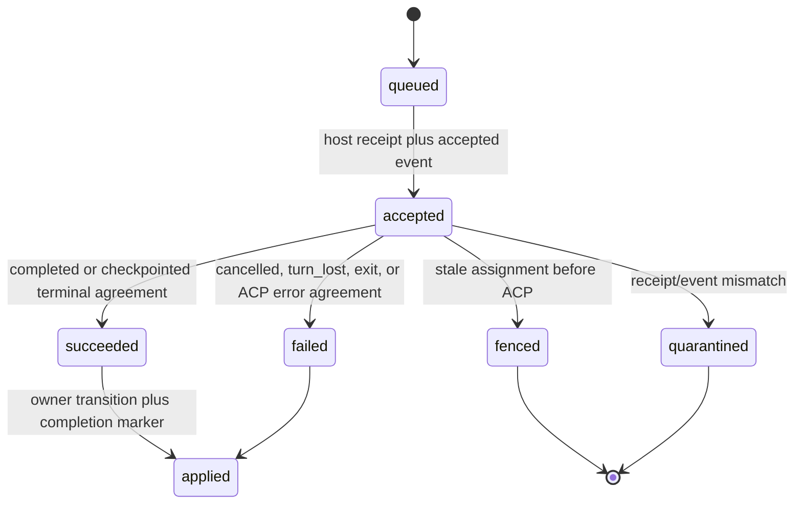
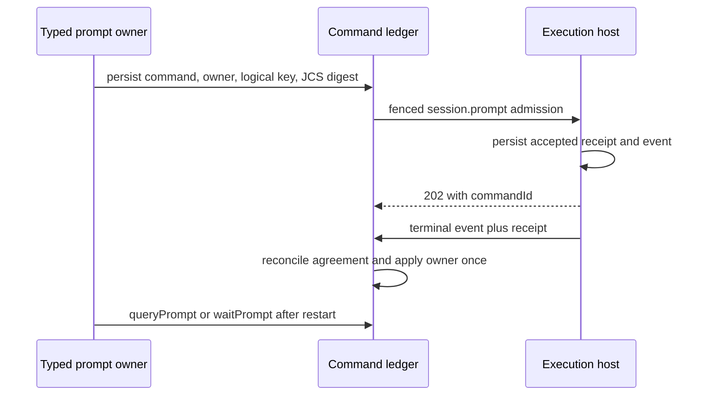

# Execution prompt lifecycle

**Status:** Implemented short-lived admission, private v2 request/owner storage and shared canonical-event/receipt reconciliation. Request-bound receipt/event v2 and verified immutable command-output manifests are implemented on the explicit v2 development path. Unknown-admission reconciliation, frozen-request recovery, create/ACP binding fences and the registered owner application engine are implemented. Production domain-owner adapters, global activation and retirement remain **Designed** (AB-05–07/10).

## Purpose

Define restart-safe prompt admission, progress, terminal reconciliation, and
owner application. A prompt is a durable command whose authoritative lifecycle
is canonical event plus receipt; a local wait or HTTP response is an optional
optimization and cannot decide a run transition.

### Creation before prompt admission

Flow node and AI/skill gate creation stores `execution_commands.create_intent`
before transport. The private normalized envelope freezes workspace and runtime
object handles, runner configuration, permission policy and launch inputs. Its
node ordinal or gate evaluation key is independent of prompt-owner fields and
has one command per assignment/create generation. Recovery reads that command
before running the payload factory again; a manager restart does not authorize
another session. The Flow continuation worker discovers these creates even
when the first prompt does not exist yet, using the same traversal lease.

The live ACK, recovered receipt and canonical `session.created` all check the
creator command against the current node visit/evaluation and newest admitted
create generation before binding. The host publishes `createdByCommandId` on
created events. An unknown create outcome retains its original command and
backs off for recovery; it cannot authorize a fresh session. The existing
observable resume fallback requires a definitive CHECKPOINT refusal, while
workspace readoption requires the host's explicit invalid-handle refusal.
A replacement retains its predecessor command and increments the create
generation without advancing the Flow prompt ordinal. Global continuation
worker activation remains part of the S2.12 deployment gate.

## Domain entities

- `execution_commands` remains the single command ledger and gains a typed
  owner reference, logical operation key, request schema/digest, and completion
  marker.
- `PromptHandle` is the serializable `{commandId}` locator.
- `command_receipts` is host-private durable side-effect evidence.
- `session.command` is the canonical accepted/terminal event type.
- `run_session_incarnations` binds host session identity to a fenced run
  session across restart, checkpoint, exit, and replacement.

## State machine

## Process flows

## Immutable requests, outcomes and command authority

The S2.1 storage/admission foundation is implemented but not yet active for
production prompt callers. `issueOwnedPrompt` runs the domain's admission
callback and routing checks in one transaction, locks before looking up the
namespaced logical key, and reuses the original ID/time and normalized request
on a matching retry. Migration 0140 rejects incomplete v2 requests and changes
to admitted identity. `readPromptRequest` verifies JCS bytes, SHA-256 and routing
before returning the original request; legacy redacted/digest-only rows remain
explicitly classified. Domain-specific callbacks and global activation are
later S2 tasks.

The shared `prompt-evidence` reducer is implemented for canonical prompt
outcomes. The projector, admission reconciliation, recovery and waiter retain
terminal receipt evidence and an exact canonical event pointer on the command
row. Receipt-first and event-first delivery remain pending until both agree;
nested result/error values are compared intact. Migration 0141 protects saved
evidence and agreed outcomes from replacement and prevents deleting the
referenced event. A disagreement records an application quarantine while
preserving any valid terminal outcome. Verified evidence remains usable without
a new host read. Host request replay also checks the stored URL-selected target;
a legacy receipt with no target cannot attach to a newly created session.
Host SQLite v10 additionally stores the JCS v2 request digest, original host
key and accepted/terminal stream positions, preserving null metadata on legacy
upgrade. SQLite v11 separately records the public wire version; legacy rows
keep version 1. The S2.2 development path accepts explicit request-v2 envelopes,
returns strict public receipt v2, and seals original ACP responses with immutable
command-output range manifests. The internal Web reader checks original bytes,
routing and retained contiguous event spans without using message projections.
Canonical command payload v2 carries the same closed request binding and nested
terminal value as receipt v2. Large or private values retain that original
payload in a verified immutable content object. The common reducer validates
the original event ID, host stream and sequence before comparing terminal
evidence. Late v2 events must match the old command's request digest and target
session; they cannot change the current assignment. Production owner activation
remains pending S2.12; this development path is not the S2 activation gate.

Keep `execution_commands.payload` as the existing allowlisted diagnostic projection. Add a **server-private** immutable `request_canonical_json` TEXT on the same ledger, with version and SHA-256. Store the exact JCS UTF-8 string for `{requestVersion, command:{id,kind,issuedAt}, fence, target:{hostSessionId}, payload}`; include every effect-affecting field, array order and frozen content/object references. Normalize optional fields once before storage. `issuedAt` and all generated IDs are created once and reused; no clock/random input during retry. Parsed request → strict schema → digest comparison precedes every dispatch. The host uses the same digest schema, including the URL target (not only envelope payload), before replaying a receipt.

Prompt text in this private request is protected user data, never a generic command DTO, browser event, log or metric. Persist credential references only; never resolved API keys/env secrets. Do not replay from redacted `payload`, a hash alone, a mutable scratch message, a refreshed capability profile, or current configuration. Existing credential injection remains at its established trusted boundary. An immutable request containing an unsupported secret-bearing transport field must be refused before admission, not silently redacted into a different replay request.

For new prompts, owner reference, logical operation key, request schema/digest/body, target incarnation and accepted generation are mandatory together. Retain the existing unique `(run_id, logical_operation_key)` with the owner family/subvariant encoded in the namespaced key and request-content comparison before replay; the key includes durable owner generation/turn identity, not a freshly generated retry UUID. Lock the authoritative owner generation and look up its logical key **before** allocating command UUID/issuedAt. If present, reuse those stored fields and compare the normalized caller-controlled semantics against the immutable request; a concurrent unique-key winner follows this same lookup/comparison path. Only a genuinely new operation allocates generated fields. Same key/same canonical request reattaches; same key/different request returns `409 CONFLICT` / `command_invariant_conflict` without effect. An authorized new turn creates a new owner generation and key.

Add only operational reconciliation fields to this ledger: transport disposition, terminal evidence identity, application disposition/lease/backoff, retirement eligibility. Use typed CHECKs and scoped indexes. Exact physical column names are frozen in S0 before generation. This does not duplicate node/run workflow state.

Terminal result/error identity is a versioned canonical value, preserving nested `{code,message,details}` without flattening or string-based classification. Full semantic output is a command-bound immutable host object/manifest `{objectId,generation,sizeBytes,sha256,commandId,hostSessionId,acceptedSequence,terminalSequence}`. Terminal event/receipt contain matching bounded references; owner replay reads and verifies original bytes. Redacted event snippets and `stopReason` alone cannot reconstruct structured results, gate replies or consensus output.

The command-output v2 manifest is a closed, bounded JSON object. It contains
`schema: maister.command-output.v2`, command/run/host/session/assignment identity,
`requestSha256`, the host `streamId`, `acceptedSequence`, `terminalSequence`, and
an immutable `response` reference (`objectId`, generation, byte size, SHA-256).
The separately sealed response preserves the original ACP prompt response,
including opaque `_meta`, with its command/session/request binding. Capture it
before asynchronous post-turn work can retain the decoder's response object.
The terminal event carries the bounded stop reason, output-manifest reference
and sealed runtime-object metadata; it does not embed opaque response metadata.

For v2 turns, semantic session events carry `sourceCommandId` in their original
payload (also inside a content object when referenced). The manifest addresses
the complete original span strictly after its accepted position and before its
terminal position, filtered by exact stream, run, host, assignment, session and
source command. A reader first verifies the manifest and response bytes against
the declared hashes/bindings and proves contiguous ingestion through terminal.
It then pages the preserved canonical events and verifies each original content
reference before reconstructing owner output. A missing position, object,
source binding or digest is incomplete evidence, never an empty successful
result. Historical reads cannot change a successor's session or domain state.
Only one new prompt may own a host session at a time; same-ID duplicates join,
and the active source command is released after durable terminal publication.

The referenced event span and original content objects remain held through
pending command/owner application. Host replay pruning must retain a v2
accepted command's event prefix until terminal acknowledgement; manager event
and object retirement must honor the manifest through the S2.11 eligibility
protocol. A process restart never replaces the manifest with current messages,
current session output or a redacted diagnostic projection. Manifest capture, verified reads and host prefix retention are implemented.
Manager retirement eligibility and the full S2/S3 retention gate remain designed.

The evidence and application states are separate:

| Dimension | Legal states / transitions | Authority |
| --- | --- | --- |
| Transport | `not_sent → dispatching → acknowledged` or `unknown`; transient attempts/backoff and `reconciliation_required` are recoverable operational states | Transport can record uncertainty; it cannot invent execution success/failure. |
| Command | Existing queued/delivering/accepted/succeeded/failed/fenced vocabulary retained; receipt-first terminal may remain accepted/delivering while awaiting canonical evidence | One terminal reducer consuming validated canonical evidence plus agreeing receipt; a definitive pre-effect refusal has explicit evidence. |
| Application | `pending → applying → applied` or `superseded`; transient retry / poisoned remain durable | Existing domain owner transaction under assignment/owner-generation fence; marker commits with domain writes. |
| Retirement | `retained → eligible → host_confirmed → tombstone` | Eligibility protocol, terminal ACK, application disposition, run state and replay grace. |

All producers of terminal evidence call **one reconciliation reducer**: live command deliverer, receipt recovery, prompt projector, `queryPrompt`, `waitPrompt`, startup/sweep. Query/wait may schedule reconciliation but never implement a second terminal writer. The projector must remain DB-only: receipt fetch/host I/O occurs outside its transaction and deposits validated evidence for a later reducer pass.

Receipt contract v2 includes command ID/kind, host key, run ID, assignment ID/epoch, URL-selected session identity, request schema/digest, phase, original result/error/reference, terminal event identity/sequence. Derive receipt bindings from the stored receipt/fence/session, not the querying client's body. Receipt absence/failed reads are not failure evidence. A canonical terminal with temporarily unavailable receipt waits/retries; verified matching durable receipt evidence already stored in Postgres remains valid after host retirement. Genuine disagreement quarantines the command and blocks owner application without changing a valid terminal outcome to another value.

Historical late evidence may settle the exactly matching old command. It must never update a successor's current session, cost, artifact association, node attempt, HITL, scratch dialog, gate reply or agent state. Maintain the narrow existing stale terminal exception; any extension for an already committed object intent must be explicit, generation-bound, historical-only and tested in S3.

## Unknown admission and transport recovery

`startAsyncPrompt` returns the original handle when ACK/receipt reads remain
unavailable. It records `unknown`, then `reconciliation_required` when the
outbound budget is exhausted; command state stays open and `last_error` is not
filled with a guessed execution outcome. The initial budget is three sends of
the same ID. V2 dispatch reparses and verifies the private frozen request on
every attempt. A local `not_sent` preflight refusal can fail a first unsent
operation; a later refusal cannot prove an earlier unknown send failed.

`queryPrompt`, the waiter and startup/sweep use one reconciliation reader. It
checks stored evidence before host I/O and uses `next_attempt_at` as a 30-second
receipt-read claim token followed by a 5-second due delay. Competing queries
cannot multiply reads; a stale completion cannot replace another claim.
Canonical receipt/event evidence remains actionable regardless of outbound
budget. The wire request deadline covers both headers and the response body,
including a partial 202 ACK whose body never completes. Closed invalid receipt
or admission evidence quarantines application with a bounded protocol cause.

Startup can resend an unacknowledged v2 command only after a reachable missing
receipt, within its remaining budget and while its original assignment is
current. It reads the original stored target, ID, issue time and payload.
Legacy requests without preserved bytes remain held for evidence reconciliation.
A process death after the final dispatch claim also enters recoverable unknown
state; it does not gain a fourth automatic attempt.

The internal `rearmPromptAdmission` repair operation compares command ID,
request digest, cumulative attempts and the observed maximum. One successful
CAS opens three additional sends without resetting attempt history or request
identity. Acknowledged, terminal, quarantined or stale repair requests cannot
rearm. Its caller must hold the existing operator/domain repair authorization;
this increment adds no public repair route. Receipt/event settlement still
leaves owner application pending until the S2 owner adapters are activated.

## Session create and ACP binding fences (Implemented)

Live create ACKs, recovered create receipts and canonical `session.created`
projection use `applyCreateAck`. It locks the run, its current active assignment,
logical session and any known host incarnation in that order. An obsolete
assignment or incarnation returns `stale` without changing the successor's
session/ACP IDs or node-attempt binding. The original command can still retain
its successful receipt; a live caller receives `CONFLICT` with
`reason=assignment_fenced` after that historical result commits.

Post-create scratch state writes assert the same assignment and exact persisted
host/ACP binding inside their transaction. Agent and sync callers use the binding
already committed by the ACK. Independent ACP setters are removed. When a new
assignment installs its current binding, earlier created/active/checkpointed
incarnations lose their projection slot with `state=lost` and
`reason=assignment_superseded`; their identities and evidence remain retained.
This transition records lost binding authority and does not claim a host exit.

AT-08 holds a real supervisor create ACK while a successor assignment becomes
active, reconciles the old receipt before releasing the held ACK, and rejects
the delayed callback. It checks that both old command evidence and the new
session/ACP binding survive. Prompt-owner state application has its separate
generation checks in the following contract.

## Prompt owner and recovery windows (Designed)

### Registered owner application engine (Implemented)

Application modules construct a typed `PromptOwnerRegistry` and pass it to
`createExecutionHosts` and `startPromptOwnerWorker`. Query/wait and the worker
use the same application path. The default production registry remains inactive
until the following domain adapters and their restart scenarios are complete;
the engine tests do not substitute for that owner matrix.

The worker selects due terminal request-v2 commands from `execution_commands`
with `FOR UPDATE SKIP LOCKED`. Each free slot commits a unique claim before
preparation. The 30-second owner lease renews every 10 seconds while output is
read in bounded pages. No additional workflow or result queue is created.
Normal due ordering and retry deadlines let other commands make progress.

Preparation verifies the original request-bound response, manifest and entire
event span. Adapters must exhaust the output iterator; a prefix cannot produce
an applicable result. Their DB-only callback locks the domain authority in its
existing order, rechecks its current generation and persists the result and
any successor readiness. The final command marker compares claim token, source
digest, terminal digest and unexpired lease in that same five-second bounded
transaction. A lost marker CAS rolls back all domain writes, including a late
callback after another worker has already applied the command.

Successful application sets `application_state=applied` and
`completion_applied_at` together. Explicit supersession retains the historical
outcome without marking it applied. Transient application failures roll back
and retry after 1, 2, 4 and 8 seconds; the fifth failure poisons application.
Invariant failures poison immediately. Host/DB unavailability leaves the owner
retryable without consuming failure attempts. The canonical command outcome is
unchanged by every application disposition. A registered live waiter remains
pending until application succeeds, and surfaces typed poison/supersession
instead of returning an uncommitted domain result.

Shutdown aborts preparation, drains renewal and DB work, and releases only the
worker's own claim. Failure to confirm that release makes shutdown fail and
retains the durable claim for expiry/recovery. Wake signals are advisory;
restart selects the same durable commands without a process-local result.

### Flow gate adapter (Implemented)

Skill and AI gate dispatch persist an evaluation-specific owner with the exact
node attempt, assignment and session incarnation. The caller and owner worker
decode the complete verified command output through the same gate adapter;
the existing gate transition and command application marker commit together.
The stored evidence preview is bounded independently of verdict extraction.
Re-entry consumes the same evaluation and command before rendering a new
prompt. A superseding assignment cannot reuse the old result as its own.

A failed application leaves the evaluation running and preserves the host
session. The Flow driver yields with `flow_prompt_continuation_pending`; it
does not convert an unavailable result into a failed check. The generic worker
can recover the gate application after process death. Gate application alone
does not establish complete Flow restart recovery.

### Flow action and graph continuation (Partial implementation)

Node prompts admit the exact attempt and ordinal before dispatch. Their owner
stores the bounded action result and original structured-output payload in
`node_attempts.action_completion` atomically with the command application marker.
Full-output extraction does not depend on the truncated stdout preview. Local
CLI/check actions before gates also snapshot their result and file output.

Owned-prompt graphs acquire `runs.flow_driver_token` with a renewable 30-second
lease. Every traversal transaction checks its active assignment and lease,
including a final check before commit; global host consumers and other runs
retain their independent database handles. Owned prompt admission repeats the
lease check after its immutable INSERT: holding the run lock cannot authorize
a new command after expiry. Real node and AI/skill gate cases verify rollback
at that boundary, followed by one successful continuation by the next driver.
CLI/check actions and command-check
gates in these leased graphs receive the driver cancellation signal. Cancellation
before dispatch prevents spawn; cancellation during execution immediately kills
the detached process group, including SIGTERM-resistant descendants, then yields
without closing domain state. Ordinary CLI timeouts retain their cleanup grace.
The persisted 500-visit ceiling applies to fresh admission; recovery can finish an
already admitted 500th visit but cannot append visit 501.
The bounded continuation worker re-enters the same driver from durable attempt/cursor state even after command
application is complete. Node closure and its selected cursor commit together with
`node_attempts.finish_continuation`. Rework retains comments and session policy;
retry retains its bounded decision across process death. Recovery also closes the exact completed prompt's source
session before admitting a successor session.

Three real-process SIGKILL windows verify linear node/gate/successor recovery
without another accepted node prompt. Additional real-process cases preserve
failed nodes, rework context and the retry budget. Orchestrator park releases its
assignment; the capacity-checked child-wake claim stores `action_resume` and
advances the exact attempt ordinal before another prompt. Live wake, a crash
after that claim and deferred capacity recovery are covered.
Pre-prompt creation uses the durable intent described above. Global
owner/continuation worker activation remains S2.12.

An orchestrator child wake accepts a completed node or permission-resume owner
only under the exact assignment that parked it. When that assignment consumed a
`permission_result` handoff, the next authorization retains the full handoff as
`permissionResult`: original input/checkpoint/incarnation, HITL choice and the
receiving assignment. The original source remains checkpointed and fenced. A
pre-prompt rollback preserves this lineage and the already admitted next ordinal;
a repeated child event cannot create another turn. A fresh permission on the
next turn requires its own response.

Checkpointed node permission resumes without a prior admitted input use the
capacity-checked idle-resume claim. It rebinds the exact source attempt and stores
`action_resume.kind: permission`, the new ordinal, original ACP handle, HITL ID,
request ID and selected option before dispatch. The leased graph driver admits
the `permission_resume` command and reuses the original HITL only after validating
the reissued tool call and options. It remains `NeedsInput` until input delivery
is acknowledged, then uses the normal action/gate/cursor reducer. Restart after
the claim consumes that authorization. An unavailable resume handle fails the
attempt and run without creating an empty replacement session. A stored input
delivery must be classified before another turn can be authorized. Confirmed input with an unverified source or an unclassified terminal error
remains pending. A distinct
permission emitted during a resumed prompt has its
own HITL and choice. A later checkpoint matches that `permission_resume` source,
including its prior HITL owner, and advances the same attempt once. Confirmed
input and a completed resumed source use the same verified result handoff at
its current ordinal; they do not dispatch a third prompt.

Checkpointed AI/skill gate permissions with no admitted input retain their exact
evaluation. The capacity claim advances `gate_results.prompt_ordinal` and stores
`permission_resume`, including the source request/choice and retained ACP handle.
It inherits the parent action through its recorded digest and rebinds the same
attempt; the parent action ordinal/result stay unchanged. Resumed graph reads
validate that digest and continue the gate without rerunning the parent action.
The old action-turn authorization is cleared after this explicit handoff. Gate
create, prompt admission, reissue and ACK check the current evaluation/assignment
and ordinal. An unavailable resume handle fails without an empty replacement.

If a gate input was delivered before checkpoint but its manager acknowledgement
was lost, the original completed prompt can instead supply a result handoff.
The preflight verifies its full request-bound output and uses the ordinary
manifest-bound gate parser and calibration. The capacity claim rechecks that
evidence, source request/choice, checkpoint receipt, flow revision and parent
snapshot. It records `permission_resume.kind: permission_result` on the same
evaluation at the same ordinal, with input/checkpoint/incarnation lineage and a
digest of the verdict, and atomically acknowledges the original HITL. Graph
reentry validates both the parent snapshot and transferred verdict before using
them. It sends no new gate prompt and does not reopen the released source
session. The source owner stays fenced; only the explicit receiving assignment
may consume the historical result. Missing or merely accepted input receipts
remain pending without a capacity claim.

A succeeded source command can still have a non-`end_turn` ACP stop reason.
Its verified output is decoded as the ordinary failed node result or gate
verdict. An unexpected `cancelled` is mapped by the supervisor to a failed
`ACP_PROTOCOL` command; that exact receipt/event-agreed error can also be
handed off. The claim and later lineage reads require the original request and
terminal digests and refuse terminal-conflict quarantine. A result handoff also
requires the agreed prompt terminal event to precede the exact checkpoint
command's accepted event in the same host stream. Preflight, capacity claim and
historical lineage reads verify the canonical command/assignment/session boundary
and compare host sequence positions. Wall clocks and arrival order cannot prove
this. Missing ordering evidence stays pending. For a completed source, nodes retain
`ok: false` with `ACP_PROTOCOL`; gates retain their failed verdict. The graph
then uses its existing failure handling, without another prompt, successor
action or parent replay. Fenced commands and other failed-command codes remain
unclassified. Event ingestion acquires the run sequence lock before inserting
its FK child, so a simultaneous idle-resume claim cannot deadlock while both
transactions upgrade the same run row lock.
Runtime-object projection atomically inserts a missing catalogue row; a
concurrent loser locks and validates the committed row instead of failing on
the primary key or accepting changed metadata.

A confirmed input followed by an agreed `ACP_PROTOCOL` failure after checkpoint
acceptance has a separate continuation path (`0152`). Once the exact checkpoint
has succeeded, the normal capacity claim records `permission_continue`, retains
the original input/checkpoint/incarnation lineage and ACP handle, and advances
the same attempt or gate evaluation by one prompt ordinal. It settles the
original HITL/input and moves to Running atomically. A gate retains the parent
action snapshot and digest. Creation, prompt admission, owner application and
gate graph reentry revalidate this grant and its original evidence. Restart
reuses the persisted ordinal; the resumed prompt asks to continue the prior
work, and the original accepted prompt remains historical. The old permission
choice is never redelivered. A later permission creates a new HITL requiring
its own answer, even for an identical tool/options payload. A refused ACP handle
fails without creating an empty session. Other interrupted error codes and
authoritative no-effect input rejection remain part of the open S2.6 work.

In-flight node and AI/skill gate permissions retain the exact source command,
attempt/ordinal, assignment and incarnation in the HITL schema. The existing
node source shape is unchanged; the closed gate variant adds its kind, gate ID
and evaluation ID. Delivery requires that exact latest evaluation. The leased
driver can reattach
that turn while the run remains `NeedsInput`; it does not authorize another
prompt or advance the cursor. Replayed command/request pairs reuse their HITL
row. Delivery intent stores the original input command and complete selection
before dispatch, so a lost ACK replays that same command. Re-entry directly
reconciles already admitted inputs before waiting for prompt application. This
also covers an applied action or gate verdict whose permission ACK was lost:
the result may be stored while `NeedsInput`, but session cleanup and graph
advancement wait for permission delivery. Gate recovery reuses the parent action
snapshot and original evaluation. Confirmed input, delivery audit, HITL completion
and the graph wake commit together. A definitive
503 can be retried by an operator with a fresh delivery; automatic recovery
does not grant that decision. Persistence failure releases the driver wait to
the durable continuation, which replays the request and completes the original
supervisor deferred after delivery. A checkpointed turn under a replacement
assignment still requires the separate permission-resume/handoff work above.

### Remaining domain adapters (Designed)

Persist the reference before remote dispatch in the same transaction as the owner admission. Use discriminated subvariants under the existing owner families where possible; widen the checked family only if necessary. Resolve references from authoritative rows. A Flow owner always references existing `node_attempts`, `gate_results` or consensus ledger rows; never create another Flow attempt ledger.

| Owner variant and key inputs | Current callers / durable authority to reuse | Recovery window and terminal application | Primary AT-05 case |
| --- | --- | --- | --- |
| Flow agent/judge/orchestrator node: attempt ID, session incarnation, prompt ordinal | `web/lib/flows/runner-agent.ts`, `flows/graph/runner-graph.ts`, `runs/resume-driver.ts`; `node_attempts` + run cursor | Active attempt while Running/NeedsInput; parked NeedsInputIdle remains attached until explicit resumed new command. Apply output/vars/decision, cursor transition and durable successor-readiness intent atomically via the existing graph reducer; its autonomous recovery schedules the existing driver even if the prompt application marker is already complete. | `owner-flow-node` |
| Flow permission resume: exact node attempt, HITL request, resume operation and incarnation | `web/lib/runs/resume-driver.ts:522–527`; stored HITL intent and node attempt | Ordinary restart reattaches its existing action command. Only an actual persisted checkpoint/resume decision creates a new prompt. Preserve exact attempt and permission-delivery evidence; never select an arbitrary open attempt after completion. | `owner-flow-permission-resume`, `owner-flow-restart-no-resume`, `owner-flow-orchestrator-wait` |
| Skill/AI gate: gate result ID, evaluation generation, attempt and gate key | `web/lib/flows/graph/gates-exec.ts:488–535`; `gate_results` | Resume unfinished evaluation even where caller supplied no nodeAttemptId. Persist verdict/evidence and gate completion under generation; do not rerun a paid check. | `owner-gate-skill`, `owner-gate-ai` |
| Consensus verification: node attempt, round, verifier, target | `web/lib/flows/graph/consensus/runtime.ts:401–438`; consensus round/evaluation rows | Apply exactly the intended matrix cell, wake existing consensus reducer; same attempt ID alone is not unique enough. | `owner-consensus-verify` |
| Consensus synthesis: attempt, round, synthesis generation | `web/lib/flows/graph/consensus/runtime.ts:658–697` | Apply synthesis result to its original round; never regenerate a prompt merely because the parent stack died. | `owner-consensus-synthesis` |
| Agent initial/resume/rework turn: run, durable turn generation, incarnation | `web/lib/agents/launch.ts`; runs, sessions, existing trigger/message records | Running/NeedsInput; parked NeedsInputIdle/WaitingOnChildren require their specific existing re-entry and capacity rules. Apply result/public-result contract and completion once, preserving launch snapshot. | `owner-agent-initial`, `owner-agent-persistent-first`, `owner-agent-resume`, `owner-agent-idle-message`, `owner-agent-rework` |
| Agent live message: persisted message/turn ID and incarnation | `sendAgentMessage` and `consumeAgentSession` in agent launch | Do not attach two distinct messages to one command. Apply the exact reply/terminal result and acknowledgment for that message after restart. | `owner-agent-message` |
| Consensus draft agent: child run + consensus round/participant generation | Agent session consumer/consensus draft path in `agents/launch.ts:3915–3921` | Record complete draft artifact and settle the existing child/result path; output lost from stack must not become an empty successful draft. | `owner-consensus-draft` |
| Scratch launch/message/recovery: dialog message/turn ID and generation | `scratch-runs/{service,events,recovery,dialog}.ts` | Scratch dialog Running with run/session still live is a due continuation, not a reason to skip. Persist reply and WaitingForUser once; NeedsInput and idle retain the exact owner until checkpoint/resume disposition. | `owner-scratch-initial`, `owner-scratch-message`, `owner-scratch-recovery` |
| Local-package/Studio assistant scratch: scratch turn plus postprocess action generation | `scratch-runs/service.ts` `postProcessFlowAssistantTurn`, local-package authority | Recover dialog completion and pending postprocessing independently. Revalidate local-package lock/session authority before existing publish/apply side effect; persist action intent/result idempotently. No new package behavior. | `owner-scratch-package-initial`, `owner-scratch-package-message`, `owner-scratch-package-lock-takeover` |
| Gate chat: thread/turn ID, lease generation, session | `services/gate-chat.ts:435,1181,1258`; `gate_chat_turns`/messages | Pending turn across lease expiry, parked/live session and NeedsInput/idle. Reconcile completed command before considering LEASE_EXPIRED. Persist the existing L3 `senseAndRestore` phase and finish it before releasing the pending-turn response fence; exact reply and completed marker then commit together under the existing HITL-first/turn lock order. | `owner-gate-chat` |
| Sync AI resolver: workspace lifecycle operation ID/attempt, resolver round, session | `runs/sync-resolver.ts`, sync target/lifecycle rows | Active resolver can be Running or NeedsInput; mechanical/post-ACP continuation can be parked in Review. Re-enter existing sync state machine with output and fence; Git operations remain local. | `owner-sync-resolver` |

The status × mode map below is normative; owner adapters must use the actual domain enums and predicates. Required refusal arms: owner missing, wrong run/project, unsupported phase, terminal/superseded generation, mismatched assignment/session, cancellation/checkpoint in progress, already applied with differing identity. A released/stale assignment permits historical command settlement and an explicit nonapplying disposition only; it does not implicitly authorize prompt-owner mutation. A parked owner that needs an old result must obtain its normal current domain recovery claim and persist an explicit source-command-to-current-application-generation handoff, with authority/cap/status checks, before consuming that immutable result. The old event reducer cannot perform that handoff or mutate current state. A new ACP turn requires a new command; a handoff of already completed evidence must not send ACP again. This handoff is a new current-owner claim consuming historical evidence, not authority granted by a stale event. It preserves ADR-167 D4. Released-terminal recovery and superseded refusal require separate tests.

Recovery priority: reconcile existing command evidence → apply owned terminal result → recover checkpoint/attempt boundary if evidence proves the old turn lost → dispatch a new logical prompt only under the normal re-entry claim. `run_kind` dispatch is exhaustive before entering Flow-only code. A `NeedsInputIdle` or `WaitingOnChildren` → live transition retains the existing cap lock/slot contract; terminal application emits the wake/domain event and releases/promotes capacity exactly as the existing domain operation requires.

Both live waiters and restart workers call the same owner application path. Commit a durable successor continuation/readiness predicate with the owner transaction and marker; recovery must service it even after the originating command is already applied. A post-commit microtask is only a hint. DB mutation and `completion_applied_at` commit together; further external effects use a durable owner sub-operation with their own completion marker and claim. Failed application retries do not replay ACP. Lease expiry alone is not evidence of a failed command.

## Exhaustive owner eligibility (Designed)

The rows below cover every current `RunStatus`; each cell is evaluated after
exact owner/command/session/assignment matching under the owning row lock.
`A` means apply agreeing evidence through that domain's existing completion
transition; `P` means preserve evidence and acquire the domain's existing
recovery/resume claim before an explicit generation handoff; `H` means
historical settlement only, with a superseded/nonapplying disposition; `R`
means refuse an impossible owner/status pair without domain mutation. A new
status must be classified exhaustively before activation.

| Run status | Flow node/gate/consensus | Agent turns/drafts | Scratch/package turns | Gate chat | Sync resolver |
| --- | --- | --- | --- | --- | --- |
| `Pending` | R | R | R | R | R |
| `Running` | A | A | A | R | A, only agent_running |
| `NeedsInput` | A, pending permission disposition checked | A | A | A, pending gate turn | A, pending permission checked |
| `NeedsInputIdle` | P, graph resume-cap claim | P, agent resume-cap claim | P, scratch recovery claim | P, gate resume-cap claim | P, sync recovery claim |
| `HumanWorking` | H | H | H | H, finish required restore/cleanup only | H |
| `WaitingOnChildren` | P, existing child-completion/wait-resume gate | P, existing agent wait-resume gate | R | R | R |
| `Review` | H | P only for an explicitly admitted persistent/message or recovery generation | P only through scratch/package admission | H | P, retained lifecycle operation claim |
| `Crashed` | H until explicit recovery claim | H until explicit recovery claim | H until explicit recovery claim | H, restore cleanup only | H, existing guarded cleanup/forward settlement only |
| `Done` | H | H | H | H | H |
| `Abandoned` | H | H | H | H | H |
| `Failed` | H | H | H | H | H |

`A` never authorizes a status change based solely on this table: the existing
domain transition rechecks cursor, attempt phase, pending HITL, output contract,
cap ownership and generation. A lost CAS becomes H or R as appropriate. An
already-applied matching digest is an idempotent no-op, but its durable successor
readiness is still serviced. A differing digest poisons without overwriting the
winner. Released/stale assignment evidence always starts at H; only the separate
current-owner claim can create P's explicit application handoff. No H path
re-enters ACP or writes current owner state.

| Owner mode / local state | Additional rule and recovery |
| --- | --- |
| Flow `node`, `permission_resume` | Attempt/cursor and prompt ordinal must match; answered permissions retain their original input-command identity. A non-resumable adapter refuses resume; an orchestrator waiting for children uses its existing wait gate. |
| Flow `gate_skill`, `gate_ai` | The exact pending gate evaluation must match; verdict, output reference, gate terminal transition and application marker share one transaction. |
| Flow `consensus_verifier`, `consensus_synthesis` | Match node attempt, round and exact cell or synthesis identity; no matrix-wide last-writer selection. Pending child/draft holds still gate aggregation. |
| Agent `initial`, `resume`, `rework` | Match the original turn and immutable result contract; resumed/rework turns have distinct admitted generations and never borrow the initial turn's result. |
| Agent `live_message`, `persistent_message`, `consensus_draft` | Match message/turn or participant/round respectively; message acknowledgment, result and current completion transition commit together. Persistent re-entry reacquires its cap. |
| Scratch `Starting`, `Running`, `NeedsInput` | Exact dialog turn may apply under A/P; Starting must have admitted session/command identity. A package variant additionally rechecks package authority and lock generation before postprocessing. |
| Scratch `WaitingForUser` | A matching already-applied turn is a no-op; a new message requires a new admission/key. Never overwrite a newer reply with old output. |
| Scratch `Review`, `Crashed` | Only its explicit current recovery/admission may hand off old complete evidence; otherwise H. |
| Scratch `Done`, `Abandoned` | H; preserve unresolved output and dispose/retire without reopening the dialog. |
| Gate turn `pending` | Reconcile terminal evidence first; lease expiry cannot fabricate failure. Persist/complete L3 restore before reply+terminal marker and release of the HITL response fence. |
| Gate turn `completed`, `failed`, `aborted` | Matching evidence is idempotent; a conflicting result is quarantined. No new reply or lease resurrection. |
| Sync `mechanical`, any nonterminal phase | Existing sync recovery owns it; it has no ACP prompt owner. Reuse existing restore-versus-forward-settle decision and lifecycle claim. |
| Sync `agent`, `starting|rebasing` | An already-admitted resolver prompt in these phases is an invariant conflict requiring repair, not permission to skip phase transitions. |
| Sync `agent`, `agent_running` | Match sync attempt/lifecycle token; Running and permission parking windows retain the same command. Complete evidence advances the existing verifying continuation once. |
| Sync `agent`, `verifying|pushing` | Prompt application is already committed; recover the existing successor action. Unknown push settles forward from authoritative remote evidence; never redispatch ACP or blindly restore. |
| Sync either mode, `succeeded|failed|aborted` | H/idempotent terminal disposition; release only the matching lifecycle token. |

Every row is an AT-05 case family with before-terminal and terminal-before-apply
crashes. Every P/H pair additionally tests released original evidence and a
superseding successor separately. The union's exact persisted reference fields
are defined in the [database contract](../database-schema.md#ab-stabilization-persistence-contract-designed).

## Command retirement and bounded retry policy (Designed)

Add an idempotent host-admin retirement-eligibility operation through ExecutionHosts, keyed by command ID plus request/outcome digest and eligibility generation. It conveys proof metadata, not a client assertion that time elapsed. Manager derives eligibility under command/owner/run locks; host checks its receipt phase, terminal event's ACK watermark and stored request/outcome identity. Record the host acknowledgment durably before either side removes recoverable evidence.

Eligibility requires: confirmed terminal receipt/event agreement; terminal event ACKed; owner applied or explicitly superseded with no remaining obligations; run terminal under the command-retention predicate; no retained object/request/result/continuation dependency; replay grace elapsed. Application success and superseded disposition are distinguishable. Live/accepted/unknown/poisoned/unapplied commands remain retained regardless of age. `turn_lost` startup repair runs before any pruning and preserves the original command ID.

After eligibility, compact to a small tombstone containing identity/digests/outcome disposition, not an executable request. Retain tombstones while a retry can be legal for that binding; once an assignment/host fence is durably beyond it, stale requests are fenced before side effects. Do not claim infinite idempotency from a finite age TTL. If tombstone bounds cannot be met, refuse further admission and surface retention pressure; never silently forget a still-valid key.

Guard run/assignment deletion and inbound FK cascades as part of this protocol: `execution_commands.run_id` and assignment references currently cascade. Refuse hard deletion with a typed protected-evidence conflict while protected commands/objects/import proofs exist. Parent deletion can proceed only after the ordinary retirement protocol has discharged every hold; adding an archive identity is outside this correction. Do not permit cascading around retirement eligibility. Add a real run-delete versus terminal-unapplied-command race. Host failure or eligibility ACK loss leaves manager recovery evidence intact. Retry the same eligibility operation. A late agreeing success after owner supersession can settle historical evidence and become eligible later; it does not apply to the successor. A missing receipt for a still-retained command is explicit reconciliation work, not an endless wait without diagnostics and not a fabricated terminal failure.

## Remote-effect / database failure tables (Designed)

These tables are normative for every changed distributed transition. Network work is outside Postgres transactions. Every operation has an intent before dispatch and an application marker after evidence, with a CAS that checks both owner status and exact generation. Do not describe this as atomic two-database commit.

| Boundary / crash point | Persisted state | Retry owner and reconciliation | Compensation / poison / delayed success |
| --- | --- | --- | --- |
| Before intent commit | No admitted operation | Caller may retry the same user request | No remote call permitted; validation refuses cleanly. |
| Intent committed, before dispatch | Frozen request/key, owner ref, pending marker | Command/owner worker claims same ID | Cancel untouched intent only under owner lock; no fake host outcome. |
| Dispatch sent, no receipt/effect known | Unknown transport, attempt timestamp | Deliverer then durable evidence worker, same request | No rollback of possible effect; partition beyond budget remains recoverable. |
| Host accepted receipt committed before effect | Accepted command and terminal wallet | Host executes once or records `turn_lost` on restart without live action | Never replay ACP merely because in-memory promise disappeared. |
| Host effect/seal/tombstone exists, receipt/event missing | Host intent and effect identity | Host startup repairs receipt/event from exact private state; manager queries original ID | Orphan effect is retained/claimed for forward settlement; conflicting evidence poisons. |
| Host effect complete, HTTP ACK lost | Receipt/event/outbox durable; manager may remain unknown | Same-ID retry/query returns agreeing evidence | No new effect/key; source bytes and references stay held. |
| Canonical event before HTTP ACK | Canonical DB evidence plus original intent | Prompt/object reducers fold independently | Valid event never poisons because ACK has not populated nullable fields. |
| Ingest commit before ACK or projection | Canonical rows and watermark durable | Stream reconnect replays; due worker applies without new events | Duplicate no-op; no host prune until confirmed ACK+grace. |
| Terminal evidence before owner DB application | Complete evidence and pending owner marker | Owner worker reconstructs exact output; claims existing domain generation | No ACP retry; interrupted apply transaction rolls back both domain state and marker. |
| DB application before downstream local effect/wake | Domain state plus durable pending action/wake | Existing domain driver/sub-operation performs effect using same generation/key | Pure hints may be lost; durable query rediscovers work. External success then DB failure settles forward. |
| Assignment/owner superseded during remote effect | Old operation retained, new generation authoritative | Historical reducer settles old evidence; current-state CAS refuses | Delayed success cannot overwrite binding/output/current owner; teardown only exact orphan via authorized current cleanup fence. |
| Retry budget exhausted / deterministic poison | Durable reason, attempts, next/rearm generation | Autonomous incoming-evidence apply; explicit repair/rearm for another outbound budget | Never delete source/evidence, skip poison event, or claim execution failed from failed reads. |

Per-effect instantiation makes the above concrete:

| Effect family | Intent and idempotency key | Host receipt/effect/canonical evidence | DB application, stale handling, compensation |
| --- | --- | --- | --- |
| Workspace adopt/release (existing Stage A boundary only) | Existing command+assignment, immutable workspace request | Existing workspace registry handle/released marker + receipt | Apply handle only to owning assignment. Late old adoption becomes historical/orphan cleanup; never overwrite successor or transfer Git ownership. Release cannot be compensated by resurrecting a handle. |
| Session create/resume | Command/request + expected logical session/incarnation + assignment | Created host session, receipt and lifecycle evidence | `applyCreateAck` and ACP-ID writers share assignment/session CAS. Historical success settles command; a new cleanup command names the exact old session after authoritative orphan check. No broad delete-by-run compensation. |
| Prompt | Owner admission + exact request/command + terminal output wallet | Accepted receipt/event → one ACP call → terminal output object + matching receipt/event | One reducer then owner transaction. Unknown holds capacity according to actual domain state; cancellation/supersession blocks current apply. Lost caller never redispatches under a new ID. |
| Permission input | HITL response intent with unmarked delivery, command/deferred identity | Exact decision replay or explicit cancellation/rejection, receipt | Mark responded/delivered only after evidence, under same HITL/generation. Persistence failure on deferred-creation path invokes explicit cancel/reject release; if unreachable persist release intent and retry. |
| Cancel/checkpoint/delete | Existing command, target session and original prompt ID, owner stop intent | Serialized credited teardown; cancel deferreds; checkpoint/observed child exit; terminal prompt/session evidence | Keep checkpoint/resume and run status coherent. Repeated identical command joins/replays. Turn-only cancellation cannot claim child termination. No released/superseded owner overwrite. |
| Object reserve/upload/seal | Pending catalog + request digest/generation + exact byte identity | Temp/chunk progress → flush/verify/rename → immutable registry → receipt/available event | Object reducer separates intent from seal. Unknown keeps bytes; after supersession retain historical object but do not associate to successor. Only private unsealed temp may be removed on failed write. |
| Object delete/GC | Locked eligible object, deleting intent and command/operation generation | Durable tombstone → unlink → deleted evidence/receipt | Metadata preserved. Unlink failure retries same operation; ACK loss queries tombstone. Late available never resurrects. No attempt to undo an unlink. |
| Object read-detected missing/corrupt | Existing immutable registry generation + read validation context | Host commits detected failure/outbox; response is independent of projection | Manager applies only exact old generation, retains associations with typed unavailable outcome. Unexpected persistence failure yields storage unavailable. |
| Historical import chunk/seal | Authorized import session/manifest/source fingerprint/chunk index + destination ID | Host chunk receipt/size/hash progress → full-object verify/seal + available evidence | DB verifies remote readback before locator CAS/lane proof. Copy success+DB crash is adopted by same manifest ID; source changes poison lane, never delete source to pass. |
| Retirement eligibility | Manager command/outcome/owner/ACK proof + eligibility generation | Host verifies terminal phase/ACK and stores eligibility receipt | Manager retains evidence until host confirmation; compact only afterward. Lost ACK repeats exact eligibility request; late terminal for superseded owner remains historical. |
| Existing sync/package assistant postprocessing | Durable owner action ID + expected lifecycle/package lock generation | Existing local operation outcome/marker; no new remote Git interface | Restart re-enters existing reducer; exact content result reapplies idempotently. Success beyond irreversible point settles forward. This plan does not move or redesign workspace/Git effects. |

Deferred inventory must cover ACP permission promises, prompt wait subscriptions, output stream backpressure waits, retry timers, HTTP body streams and worker claim timers. Each resolve/cancel/checkpoint/delete/fence/shutdown/DB-failure path must release or durably hand off responsibility. A process-local wait aborted by request disconnect does not cancel the durable command. Tests force releasing-side persistence/transport failure and assert explicit release at the real supervisor or a durable retry intent plus eventual release; logging alone is not a release.

## Expectations

- **PRM-01:** `session.prompt` is accepted only after the host durably records its Stage A receipt and accepted event.
- **PRM-02 (Designed correction):** Retry reuses command ID, logical operation key, and canonical request digest so ACP is never invoked twice.
- **PRM-03:** Progress and terminal events—not HTTP lifetime or a receipt alone—are lifecycle authority; the queryable receipt is agreeing evidence for reconciliation.
- **PRM-04 (Designed correction):** Every prompt command has one typed server-derived owner and idempotent terminal application across web restart.
- **PRM-05:** A host restart finding an accepted command without a live turn terminalizes it as `turn_lost` without replaying prompt text.
- **PRM-06 (Designed correction):** Receipt and terminal event must agree on command, assignment, epoch, and outcome before owner mutation.
- **PRM-07 (Designed correction):** Session exit, crash, and cancellation terminalize accepted prompts before or atomically with terminal session evidence.
- **PRM-08 (Designed correction):** HITL pause, decision, checkpoint, and resume are durable/fenced and resume uses a new command and required incarnation.
- **PRM-09 (Designed correction):** Cancellation reuses the command ledger and has one terminal prompt outcome despite retry or ACK loss.
- **PRM-10:** Fencing happens before ACP and records a durable fenced receipt/audit event without owner mutation.
- **PRM-11 (Designed correction):** `{commandId}` remains queryable through Postgres after web or supervisor process restart.
- **PRM-12 (Designed correction):** Prompt receipt pruning waits for terminal ACK, owner application, terminal run, and replay grace.

## Edge cases

- **EDGE-PRM-01:** A lost admission or terminal acknowledgement reconciles by original command ID and never starts a second turn (`IT-PRM-02-ACK-LOSS`).
- **EDGE-PRM-02:** A restarted host with an accepted non-live turn writes `turn_lost` and lets manager recovery choose checkpoint/resume (`IT-PRM-05`).
- **EDGE-PRM-03:** Disagreeing terminal receipt/event outcomes are quarantined as `prompt_terminal_conflict` and owner application stops (`IT-PRM-06`).
- A duplicate input/cancel/checkpoint uses the existing receipt and fence, and a stale epoch returns typed fenced evidence rather than a new side effect.
- **EDGE-PRM-04:** If checkpoint or release wins the race with terminal publication, an open prompt wait remains pending instead of locally fencing the accepted command. Receipt evidence alone does not settle it; the exact canonical terminal command event settles the historical command, after which an agreeing receipt makes the result queryable (`IT-PRM-06`).

## Linked artifacts

- [ADR-167](../decisions/adr-167.md) fixes command/receipt reuse and retention eligibility.
- [Sessions](sessions.md), [runs](runs.md), [HITL](hitl.md), and [scratch runs](scratch-runs.md) own callers and their state transitions.
- [Supervisor OpenAPI](../api/supervisor.openapi.yaml) and [host event AsyncAPI](../api/async/execution-host-events.asyncapi.yaml) define admission, receipt, and terminal contracts.
- `IT-*` and `CT-*` labels are specification scenario IDs; durable per-owner acceptance remains Designed until the [stabilization owner matrix](../../.ai-factory/plans/stage-ab-stabilization.md#d2-prompt-owner-and-recovery-windows) is executed.
