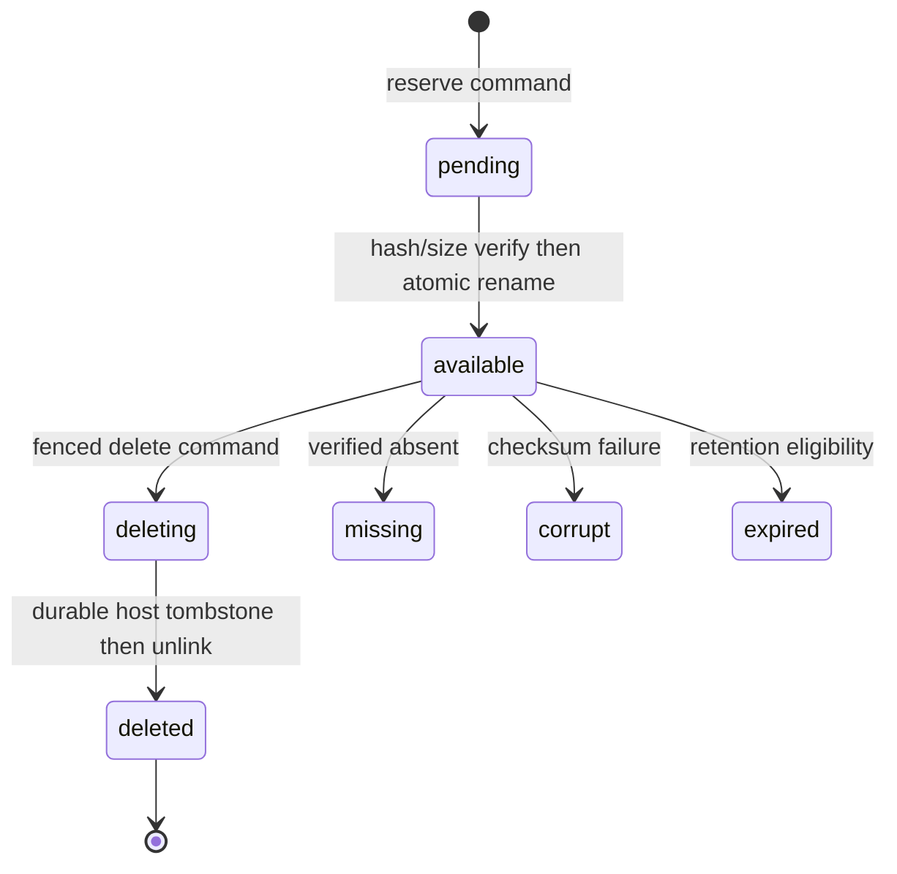
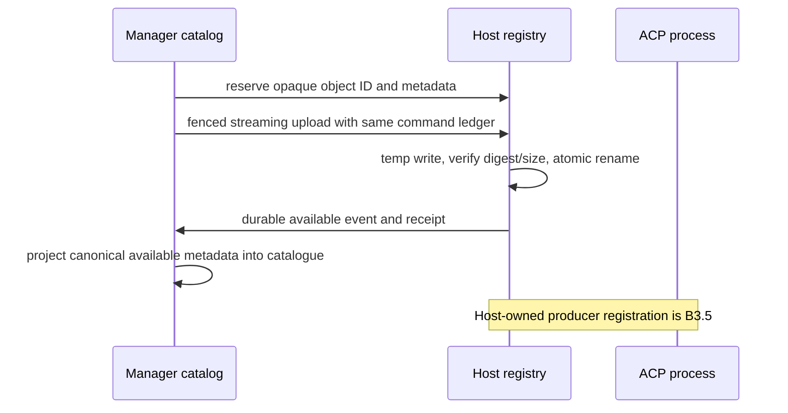

# Execution runtime objects

**Status:** Incremental — B3.4 implements the host registry, fenced
reserve/upload/delete API, manager catalog projection, and authorized web
read route. Producer migration from legacy runtime files remains B3.5.

## Purpose

Define opaque, fenced access to ACP runtime files without exposing a host path
to the web tier, browser, or manager database. The host owns private bytes and
object registry paths; the manager owns catalog metadata, authorization, and
artifact association.

## Domain entities

- `execution_runtime_objects` is the manager catalog of object ID, association,
  kind, metadata, retention, state, and tombstone without a path.
- Host-private object registry records canonical private path, upload intent,
  generation, sealing, and deletion state.
- `ArtifactLocator {kind:"execution-object",objectId}` associates a cataloged
  host object with an existing artifact without host/run/path data.
- `runtime_object.available` and `runtime_object.state` are canonical catalog
  events.
- Stage A `execution_commands`, receipts, assignment ID, and epoch fence own
  reserve, upload, and delete side-effect identity.

## State machine

## Process flows

## Expectations

- **OBJ-01:** Manager contracts/catalogs expose opaque object IDs and typed metadata, never a host filesystem path.
- **OBJ-02:** The web authorizes URL-selected resources then derives host/run/assignment/epoch/object association from Postgres.
- **OBJ-03:** Reserve, upload, and delete reuse Stage A commands, receipts, retry state, and fences without a second ledger.
- **OBJ-04:** A sealed object has immutable binding, generation, MIME, size, and SHA-256, and differing retries conflict.
- **OBJ-05:** Upload bytes use private temporary files, verify declared integrity, and atomically rename before available evidence.
- **OBJ-06:** Reads return a manager-authorized streaming response with one byte range and a SHA-256 Content-Digest; the web tier forwards host bytes without buffering the full object, while invalid ranges return typed errors.
- **OBJ-07:** Unknown/cross-boundary, tombstoned/expired, corrupt, and oversized objects have distinct typed outcomes.
- **OBJ-08:** Object content, host paths, prompts, and secrets are prohibited from logs and event payloads.
- **OBJ-09:** Events/messages/cost/catalog metadata remain manager-owned while raw diagnostics and large host content remain host-owned.
- **OBJ-10:** Structured result transport remains separate from verifier evidence payload storage and required evidence fails explicitly.
- **OBJ-11:** Delete commits a durable host tombstone before unlink and repeated delete is idempotent.
- **OBJ-12:** Manager metadata outlives missing/deleted bytes and deletion follows existing run/artifact delivery retention.

## Edge cases

- **EDGE-OBJ-01:** A client-selected foreign binding is not found before project authorization, while host-private path traversal is impossible because no path is accepted (`IT-OBJ-02-PATH`).
- **EDGE-OBJ-02:** Multi-range, malformed, or out-of-content range returns `PRECONDITION {reason: runtime_object_range_invalid}` with no full-body fallback (`IT-OBJ-06`).
- **EDGE-OBJ-03:** A retry with different size, hash, MIME, or generation preserves the original and returns `PRECONDITION {reason: command_invariant_conflict}` (`IT-OBJ-04-CONFLICT`).
- An interrupted upload discards private temporary bytes and retries from zero with its original command ID; a sealed registry row can synthesize the missing receipt/event after restart.

## Linked artifacts

- [ADR-167](../decisions/adr-167.md) records object ownership and retained Stage C repository boundary.
- [Artifacts](artifacts.md) owns artifact validity and manager-owned locator metadata.
- [Supervisor OpenAPI](../api/supervisor.openapi.yaml) defines reserve/upload/metadata/range/delete operations.
- [Host event AsyncAPI](../api/async/execution-host-events.asyncapi.yaml) defines catalog events, and [database schema](../database-schema.md) defines retention records.
- Primary B3 proofs are `IT-OBJ-01` through `IT-OBJ-07`; B0 contract proofs are `CT-OBJ-01` through `CT-OBJ-07`.
