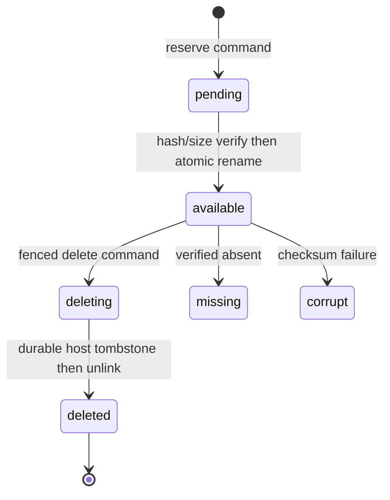
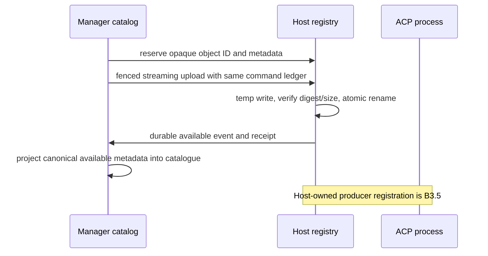

# Execution runtime objects

**Status:** Implemented host registry, reserve/upload/delete routes, manager catalog and **safe content delivery (AB-12, S3.4)**; **Designed** lifecycle convergence, read integrity and fair retention corrections (AB-09/13–15). Bytes remain host-owned and manager locators remain opaque.

## Purpose

Define opaque, fenced access to ACP runtime files without exposing a host path
to the web tier, browser, or manager database. The host owns private bytes and
object registry paths; the manager owns catalog metadata, authorization, and
artifact association.

## Domain entities

- `execution_runtime_objects` is the manager catalog of object ID, association,
  kind, metadata, retention, state, and tombstone without a path.
- Host-private object registry records canonical private path, upload intent,
  generation, sealing, and deletion state.
- `ArtifactLocator {kind:"execution-object",objectId}` associates a cataloged
  host object with an existing artifact without host/run/path data.
- `runtime_object.available` and `runtime_object.state` are canonical catalog
  events.
- Stage A `execution_commands`, receipts, assignment ID, and epoch fence own
  reserve, upload, and delete side-effect identity.
- Capability profile JSON and instruction Markdown are distinct typed runtime
  objects; `session.create` accepts only their opaque IDs and validates each
  expected kind before deriving child environment paths.

## State machine

`expires_at` is deletion eligibility, not a persisted terminal state. The
manager's 60-second sweep leaves a referenced object or an object owned by a
live/checkpointed session `available`; otherwise it issues the fenced delete
command and the canonical state event moves the object through `deleting` to
`deleted`.

## Process flows

## Runtime-object lifecycle, security and integrity (Designed)

Use one reducer over immutable object identity `{objectId,generation,hostId,runId,kind,MIME,origin}` and separately sealed metadata `{sizeBytes,sha256}`. Origin is an explicit union: native command/output allocation with required assignment/epoch/session/command provenance, or authorized historical import `{importId,manifestHash,itemId}` without a fabricated active assignment. Any uniquely proven historical assignment is optional provenance. Import availability uses verified host import receipt plus deterministic `legacy_import` canonical evidence; it is not a fake native host event. The import adapter stores this proof using the existing 0131/0133 fields and import lanes/host manifest, so it works before forward schema additions. Pending rows may have null sealed fields; declared expected size/hash, when present, are immutable independent fields. Compare intent identity first, then establish sealed metadata once. Same metadata replay is idempotent; different metadata/generation conflicts without overwrite.

| State / evidence | Legal action | Refusal / recovery |
| --- | --- | --- |
| No intent | Reserve with durable command/owner intent | Unsolicited foreign object event is quarantined; never infer run/project from body. |
| Pending, upload not complete | Write exclusive private temp/chunks; persist upload progress | ACK loss queries exact object/command; retry same bytes/key. Changed declared bytes conflict. |
| Bytes sealed, event/receipt pending | Reconcile durable host seal to missing receipt/event | No duplicate file generation; manager catalog remains pending until matching canonical availability. |
| Available event before ACK | Fill sealed fields via object reducer | Valid pending identity succeeds; no impossible null-and-equal conjunction. |
| Available ACK before event | Persist matching evidence and wake reconciliation | ACK does not forge a canonical event; retry replay until event arrives. |
| Released/superseded assignment | Retain exact old intent's bytes/metadata as historical evidence | Never attach to current successor. Historical object evidence exception requires exact committed intent, not a general stale-event bypass. |
| Available, verified missing/corrupt | Host persists typed state and outbox evidence; manager projects state | No success response with stale digest. Read failure does not delete metadata or silently retry a different object. |
| Deleting | Durable delete intent/tombstone precedes unlink | New references denied under same object/generation lock; unlink/recovery retries same operation. |
| Deleted | Keep catalog and idempotency tombstone | Replayed available cannot resurrect; identical delete succeeds; read reports typed gone. |

**Seal and read:** flush/close producer writable handles; seal to a distinct private immutable inode by tmp+rename and record identity. Never label the actively appended log inode immutable; seal segments and a manifest with ordering/total length for continued logs and full prompt output. Preserve structured result transport (`MAISTER_OUTPUT_FILE`/sentinel and `node_attempts.vars`) separately from required verifier evidence (`MAISTER_ARTIFACT_DIR` and typed evidence associations).

For each read, open with no-follow semantics, validate regular-file/device/inode/size and initial stat, stream the entire representation through SHA-256 while copying only the selected ≤8 MiB response bytes to an exclusive 0600 private spool. Compare total size/hash and final stat before sending success headers. Serve the exact spool descriptor, unlinking its path while open where supported; do not verify then reopen the original path. This adds bounded disk I/O to catch same-size tampering and avoids a hash-then-mutate race on returned bytes. Cap scans/spools; use typed busy/retry responses. Large multipart historical representations hash ordered sealed chunks; no whole-file RAM buffer.

A segmented log/history is exposed as **one ordinary catalog object and existing execution-object locator**, with the full logical size and SHA-256 of concatenated original bytes. Segment order/offset/length/hash descriptors are host-private. Range reads cross segments transparently; Repr-Digest hashes original file bytes, never the descriptor or concatenated segment hashes. No new unresolved manifest locator leaks to artifact/attachment consumers.

On ENOENT return a typed missing outcome; on nonregular/symlink/identity/digest mismatch return corrupt. Persist host state/outbox evidence before claiming that transition; if host persistence fails, return storage-unavailable and record service degradation, not a falsely durable missing/corrupt state. DB application follows canonical evidence without blocking the HTTP error response on projection. Manager validates representation identity and hashes actual response bytes in its bounded spool before forwarding success; a corrupt peer stream is never labeled verified solely because its headers agree.

**Download policy (Implemented — AB-12, S3.4):** untrusted arbitrary object content is `application/octet-stream`, `Content-Disposition: attachment` with sanitized ASCII filename and RFC 8187 encoded filename, `X-Content-Type-Options: nosniff`, `Content-Security-Policy: sandbox; default-src 'none'`, `Cache-Control: private, no-store`. One shared policy module (`runtime/safe-download.ts`) is applied to 200/206 on the host content route (`GET /runtime-objects/{id}/content`), the manager proxy (`GET /api/runs/{runId}/runtime-objects/{objectId}/content`) and the artifact payload route for `execution-object` locators; server-derived text/JSON artifact payloads keep their passive type but travel under the same disposition, nosniff, CSP and cache headers. The catalogued MIME (caller-supplied at upload) is metadata only and is never reflected into a response type; the attachment filename is the manager's `logicalName`, sanitized. Both routes that expose an execution object's bytes require the same `readRepoFiles` grant (the payload route previously served them under `readBoard`); diff/log/git/inline artifact payloads stay board evidence at `readBoard`. Never inline HTML, SVG, XML, script, PDF or supplied MIME. The evidence-graph payload preview fetches and renders escaped text, so it is unaffected. Proven by AT-12: `web/e2e/execution-ab-content.spec.ts` (real Chromium against a real supervisor — an uploaded HTML/SVG document with an authenticated side effect is downloaded, never executed; anonymous/non-member/foreign access refused) plus the route unit tests and the host integration case. Fixing this exposed a seam defect: the host's prompt path resolved uploaded attachments without `expectedKind`, so every prompt carrying an upload had been refused since the Stage B lifecycle commit; `resolvePromptRuntimeObjects` now names the prompt-reference kind (`attachment`) explicitly.

**Digest contract:** for 200 the body digest and representation digest agree when bytes are identical; for 206 Content-Digest covers the transferred slice, Repr-Digest the full verified object; a strong ETag binds generation/hash. No compression/transcoding on this route. Invalid/multiple/out-of-range requests return 416 with typed range error, without full-body fallback. See [RFC 9530 §2–3 and Appendix B.3](https://www.rfc-editor.org/rfc/rfc9530.html#appendix-B.3). Tests hash returned bytes independently; header equality is only a metadata check.

**Retention:** expired is eligibility, not deletion authority. Preserve live/checkpointed session input/output, unresolved command requests/results, unapplied owners, pending import proofs, required verifier evidence, artifact/result references, and delivery holds. Use the existing confirmed local-delivery or PR-merge policy and persisted delivery snapshot/confirmation; `Done` or an open/closed-unmerged PR alone is insufficient. Result-only delivery requires its actual acknowledgment policy, not a fabricated merge. When no authoritative delivery confirmation exists, retain with an actionable protected reason. Optional operational diagnostics can follow their explicitly weaker policy; do not reuse it for required evidence.

GC advances a keyset/last-examined marker even for protected rows. New reference creation and delete eligibility use the same object/generation lock so a reference cannot appear after destructive claim. Recheck eligibility/fence before remote effect; store deleting command identity and retry state before dispatch. Fairness applies to deleting/missing/corrupt cleanup queues too. Catalog/tombstones outlive missing/deleted payloads.

## Expectations

- **OBJ-01:** Manager contracts/catalogs expose opaque object IDs and typed metadata, never a host filesystem path.
- **OBJ-02:** The web authorizes URL-selected resources then derives host/run/assignment/epoch/object association from Postgres.
- **OBJ-03:** Reserve, upload, and delete reuse Stage A commands, receipts, retry state, and fences without a second ledger.
- **OBJ-04 (Designed correction):** A sealed object has immutable binding, generation, MIME, size, and SHA-256, and differing retries conflict.
- **OBJ-05 (Designed correction):** Upload bytes use private temporary files, verify declared integrity, and atomically rename before available evidence.
- **OBJ-06 (Designed correction):** Reads return a manager-authorized streaming response with one byte range and a SHA-256 Content-Digest; the web tier forwards host bytes without buffering the full object, while invalid ranges return typed errors.
- **OBJ-07 (Designed correction):** Unknown/cross-boundary, tombstoned, corrupt, and oversized objects have distinct typed outcomes; expiry is an internal deletion eligibility check.
- **OBJ-08:** Object content, host paths, prompts, and secrets are prohibited from logs and event payloads.
- **OBJ-09:** Events/messages/cost/catalog metadata remain manager-owned while raw diagnostics and large host content remain host-owned.
- **OBJ-10:** Structured result transport remains separate from verifier evidence payload storage and required evidence fails explicitly.
- **OBJ-11 (Designed correction):** Delete commits a durable host tombstone before unlink and repeated delete is idempotent.
- **OBJ-12 (Designed correction):** Manager metadata outlives missing/deleted bytes and deletion follows existing run/artifact delivery retention.

## Edge cases

- **EDGE-OBJ-01:** A client-selected foreign binding is not found before project authorization, while host-private path traversal is impossible because no path is accepted (`IT-OBJ-02-PATH`).
- **EDGE-OBJ-02:** Multi-range, malformed, or out-of-content range returns `PRECONDITION {reason: runtime_object_range_invalid}` with no full-body fallback (`IT-OBJ-06`).
- **EDGE-OBJ-03:** A retry with different size, hash, MIME, or generation preserves the original and returns `PRECONDITION {reason: command_invariant_conflict}` (`IT-OBJ-04-CONFLICT`).
- An interrupted upload discards private temporary bytes and retries from zero with its original command ID; a sealed registry row can synthesize the missing receipt/event after restart.

## Linked artifacts

- [ADR-167](../decisions/adr-167.md) records object ownership and retained Stage C repository boundary.
- [Artifacts](artifacts.md) owns artifact validity and manager-owned locator metadata.
- [Supervisor OpenAPI](../api/supervisor.openapi.yaml) defines reserve/upload/metadata/range/delete operations.
- [Host event AsyncAPI](../api/async/execution-host-events.asyncapi.yaml) defines catalog events, and [database schema](../database-schema.md) defines retention records.
- `IT-*` and `CT-*` labels are specification scenario IDs, not collected-test evidence. AB-09/12–15 require the [stabilization acceptance matrix](../../.ai-factory/plans/stage-ab-stabilization.md#final-acceptance-matrix).
