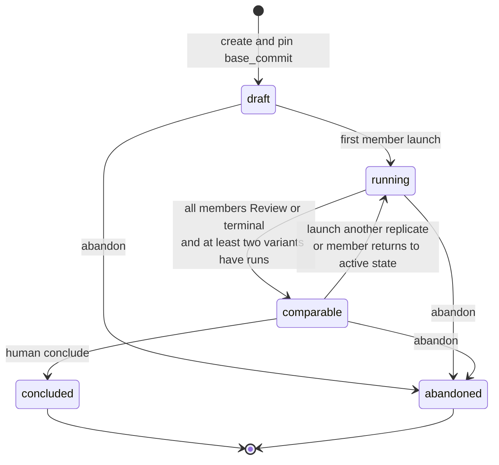
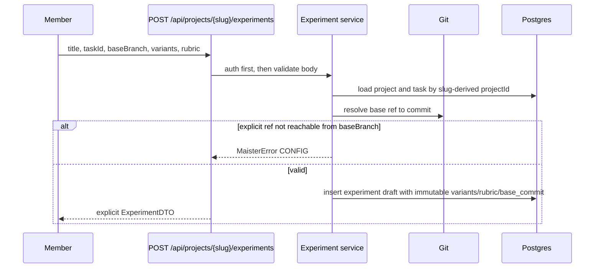
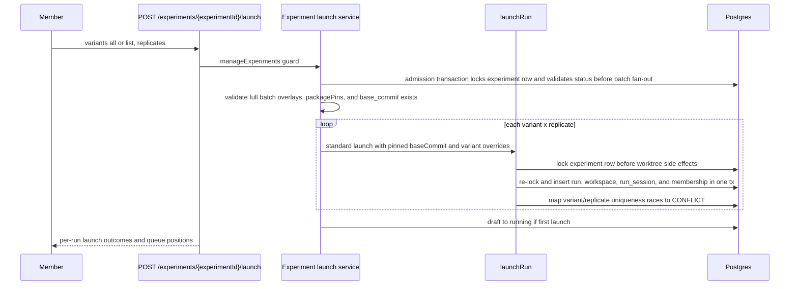
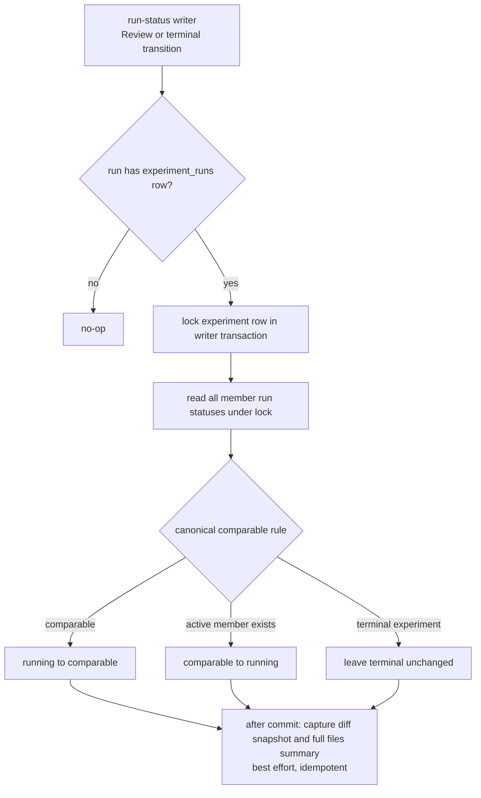
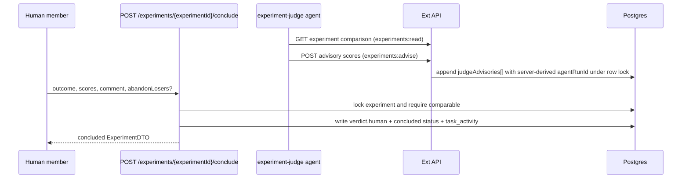

# Experiments domain

> **Legacy — removal in progress ([ADR-149](../decisions.md#adr-149-experiments-cut-over-completion));
> superseded by [`evaluations.md`](evaluations.md).** This file documents the
> retiring Experiment surface and is deleted when the cut-over completes.

## Purpose

This domain (**Implemented, Phase 1; ADR-124**) covers task-bound experiment
comparison: an operator creates one experiment for one task, pins a base commit,
launches N variants through the normal run pipeline, compares run evidence, and
records a human verdict. The boundary includes experiment membership,
variant capability overlays, comparison snapshots, advisory judge writes, and
automated-retention holds. It excludes new execution runtimes, new SSE/domain
events, automatic gate approval, automatic promotion, aggregate experiment
budgets, and a second review-comment surface.

## Domain entities

- **Experiment** (`experiments`, Implemented) — durable task-bound comparison
  container: `project_id`, `task_id`, `title`, `base_branch`, pinned
  `base_commit`, immutable `variants`, immutable `rubric`, five-state `status`,
  optional verdict envelope, actor/timestamp columns, and lifecycle timestamps.
  ERD: [`../db/erd.md`](../db/erd.md).
- **Experiment member run** (`experiment_runs`, Implemented) — membership row
  joining one `runs.id` to one experiment with `variant_key`,
  `replicate_ordinal`, `launch_reason`, capped `diff_snapshot`, structured
  truncation fields, `diff_files_summary`, and applied `materialization_delta`.
- **Variant** — immutable JSON entry `{key, label, config}`. Config is a
  closed registry: `runnerId?`, `executionPolicy?`, `capabilityOverlay?` over
  rules, skills, MCPs, and subagents, and `packagePin?: {packageInstallId}`
  (ADR-132) — an ephemeral per-run package pin resolving the task-flow's
  revision from the named `package_installs` row without touching
  `project_package_attachments`.
- **Rubric** — immutable JSON criteria snapshot. The default template contains
  exactly `correctness`, `completeness`, `consistency`, `code_quality`,
  `cost_efficiency`, and optional `specs_traceability`.
- **Verdict envelope** — nullable `experiments.verdict` JSON. `human` records
  the conclusive operator decision; `judgeAdvisories[]` records append-only
  advisory suggestions from the experiment judge.
- **Experiment judge** — package-sourced platform agent that reads the
  comparison DTO via `experiment_get` and appends advisory scores via
  `experiment_advise`; it never concludes.
- **Comparison DTO** — explicit public projection combining experiment fields,
  member run statuses, gate results, cost rollups, diff snapshots, files
  summaries, materialization deltas, and verdict/advisory state. Each member
  run additionally carries a `provenance` object (ADR-132) —
  `{packageName, versionLabel, kind: "local_cut" | "upstream",
  installDigest12}` or `null` — derived by joining the run's snapshotted
  `runs.flow_revision` to `package_installs.resolved_revision`, plus a
  cross-variant `flowRevisionDelta` marker beside the materialization delta.

## State machine

Experiment state is persisted on `experiments.status`. Run states remain on
`runs.status`; the verdict never mutates member-run status or gate rows.

`Review`, `Done`, `Failed`, `Abandoned`, and `Crashed` member runs count as
settled for comparability. `Pending`, `Running`, `NeedsInput`,
`NeedsInputIdle`, `HumanWorking`, and `WaitingOnChildren` keep the experiment
`running`.

## Process flows

### Create experiment and pin base

### Launch variants through the normal run path

### Status sync and snapshot capture

Snapshot failure never blocks the run transition. On comparison reads, the
service recomputes the derived status; if persisted status drifted, it heals the
row with a compare-and-swap update and logs when a concurrent terminal write wins.

### Human verdict and advisory judge

Machine/token actors cannot call conclude. `abandonLosers` stops selected member
runs after the verdict transaction through the standard dispatcher.

## Expectations

- `experiments.base_commit`, `variants`, and `rubric` MUST be immutable after
  creation; mutation attempts return `MaisterError("PRECONDITION")`.
- Experiment create MUST validate explicit base refs as reachable from
  `base_branch` and return `MaisterError("CONFIG")` before persisting invalid
  experiment data.
- `POST /api/runs` `baseCommit` MUST exist and be reachable from the selected
  server-derived base ref or fail with `MaisterError("PRECONDITION")` before a
  worktree side effect.
- Experiment membership MUST be written only from server-derived launch
  contexts and in the same transaction as the new run row; request bodies MUST
  never carry an experiment id for membership.
- The launch route MUST validate the whole variant batch, including overlay
  refs, class-adapter compatibility, and every `packagePin` install
  (exists, `Installed`, trusted, carries the task-flow's `flowRefId` — the
  ADR-132 pin matrix), before the first side effect; experiment create MUST
  run the same pin batch validation so an unlaunchable pin refuses at create.
- A `packagePin` variant launch MUST leave `project_package_attachments`
  byte-identical; the pinned revision is recorded only on the run snapshot
  columns (`flow_revision_id` / `flow_revision` / `flow_version`). (ADR-132)
- Experiment member runs MUST never auto-promote (ADR-124 invariant, enforced
  by ADR-132): the auto-promotion sweep's candidate query excludes runs with
  an `experiment_runs` row, and `evaluateAutoPromotion` returns a
  `not_applicable` term on membership at the apply site.
- Each member launch MUST lock and validate the experiment row before attempt
  allocation or worktree creation, then re-check inside the run insert
  transaction before writing membership.
- The comparable rule MUST be recomputed at every member run status
  choke-point and verified on experiment read; no timer, watcher, or polling
  may drive experiment status.
- Diff snapshots MUST carry structured truncation fields. When git metadata is
  available, `diff_files_summary` MUST be computed from metadata for the full
  diff before truncation; when metadata fails after the text diff succeeds, the
  snapshot MUST still be captured with patch-derived file summaries.
- Human conclude MUST write `verdict.human`, `status = concluded`,
  `concluded_by_user_id`, `concluded_at`, and `experiment_concluded`
  `task_activity` in one transaction; it MUST NOT mutate member-run gates or
  statuses.
- Advisory writes MUST append only `judgeAdvisories[]` under row lock, require
  `experiments:advise`, re-validate rubric scores at the untrusted sink, and
  fail after terminal states. Agent-token callers MUST be the package-sourced
  experiment judge; `agentRunId` is server-derived from the bound token and is
  never accepted from the body.
- Automated GC/reconcile sweeps MUST skip workspaces referenced by
  non-terminal experiments; manual workbench lifecycle actions remain allowed.
- Public responses MUST be explicit DTO projections and MUST NOT expose
  worktree paths, supervisor session ids, adapter argv/env, materialization
  paths, internal cost handles, or raw DB rows.
- Structured logs MUST use bounded identifiers such as `projectId`,
  `experimentId`, `taskId`, `runId`, `variantKey`, `replicateOrdinal`,
  `launchReason`, `fromStatus`, `toStatus`, `actorType`, `scopeUsed`,
  `tokenId`, `fileCount`, `truncated`, `workspaceId`, and `skipReason`; they
  MUST NOT log prompt text, verdict comments, diff contents, secrets, adapter
  argv/env, supervisor session ids, or worktree paths.

## Edge cases

- **Human-launched non-member run on the same task** — a bare `POST /api/runs`
  without `relaunchOfRunId` never inherits membership; incorrect inheritance is
  `MaisterError("PRECONDITION")`/test failure depending on boundary.
- **Duplicate launch click / replicate ordinal race** — unique
  `(experiment_id, variant_key, replicate_ordinal)` maps a racer to
  `MaisterError("CONFLICT")` or retry-next-ordinal behavior, never raw
  Postgres `23505`.
- **Conclude racing replicate launch** — both lock the experiment row;
  conclude requires freshly-read `comparable`, while a post-conclusion launch
  returns `MaisterError("PRECONDITION")`.
- **Budget restart racing conclusion** — restart after `concluded` or
  `abandoned` creates a plain non-member run; stale membership attempts return
  `MaisterError("PRECONDITION")`.
- **Base branch deleted after pin** — new launch fails with
  `MaisterError("PRECONDITION")` if the stored pin cannot be verified; already
  created runs and snapshots remain readable.
- **Mid-run human form** — member runs in `NeedsInput`, `NeedsInputIdle`, or
  `HumanWorking` keep the experiment `running`; no comparison timer advances
  it.
- **Winner promotion target moved past the pin** — promotion uses the existing
  merge semantics; conflicts return `MaisterError("CONFLICT")` and leave the
  run in `Review`.
- **Overlay ref vanished between create and launch** — launch-time resolution
  fails with `MaisterError("CONFIG")` naming the missing ref.
- **Unsupported overlay class for adapter** — class x adapter refusal returns
  `MaisterError("CONFIG")` before any launch side effect.
- **Unsupported/non-Postgres `DB_URL`** — boot fails with
  `MaisterError("CONFIG")` before a connection is attempted.
- **Pinned install degraded between create and launch** — a `packagePin`
  install that is no longer `Installed` (or lost trust) at fan-out refuses
  with `MaisterError("PRECONDITION")`; an install row that vanished refuses
  with `MaisterError("CONFIG")` naming the install id. Nothing launches for
  that variant; the attachment is untouched. (ADR-132)
- **Member run reaches Review in an auto-promotion-enabled project** — the
  ADR-126 sweep never selects it (candidate prefilter) and a direct
  evaluate/promote call path reports `not_applicable`; only the explicit
  human winner-promotion applies. (ADR-132)
- **Provenance lookup finds no matching install** — the comparison DTO
  carries `provenance: null` for that run (degradation, not an error); the
  lab renders the run without package badges. (ADR-132)
- **Experiment abandon with live runs** — abandon flips the experiment terminal
  under row lock, then stops live member runs through the standard dispatcher;
  stop failures are logged per run and do not resurrect the experiment.
- **External scope denial** — `experiments:read` and `experiments:advise` are
  separate token scopes; missing scopes or non-judge agent tokens return
  `MaisterError("UNAUTHORIZED")`.

## Linked artifacts

- ADR: [`ADR-124`](../decisions.md#adr-124-experiment-comparison-studio-for-pinned-base-comparison-runs);
  package pin axis, provenance, and the enforced auto-promotion exclusion:
  [`ADR-132`](../decisions.md#adr-132-forked-package-loop--ephemeral-pins-package-experiment-axis-local-sources-upstream-sync).
- Database narrative: [`../database-schema.md`](../database-schema.md).
- ERD: [`../db/erd.md`](../db/erd.md).
- Web API contract: [`../api/web.openapi.yaml`](../api/web.openapi.yaml).
- External API contract: [`../api/external/operations.openapi.yaml`](../api/external/operations.openapi.yaml).
- Async/API deferral: Phase 1 adds no `docs/api/async/*` event family.
- Related domains: [`runs.md`](runs.md), [`workspaces.md`](workspaces.md),
  [`flow-settings.md`](flow-settings.md), [`readiness.md`](readiness.md),
  [`agents.md`](agents.md), [`external-operations.md`](external-operations.md),
  [`reconciliation-gc.md`](reconciliation-gc.md).
- Planned source boundaries: `web/lib/experiments/*`,
  `web/app/api/projects/[slug]/experiments/*`,
  `web/app/api/v1/ext/projects/[slug]/experiments/*`,
  `web/lib/db/schema.ts`, `web/lib/services/runs.ts`,
  `web/lib/runs/resume-driver.ts`, `web/lib/gc/workspace-gc.ts`, and
  `mcp/src/tools.ts`.
