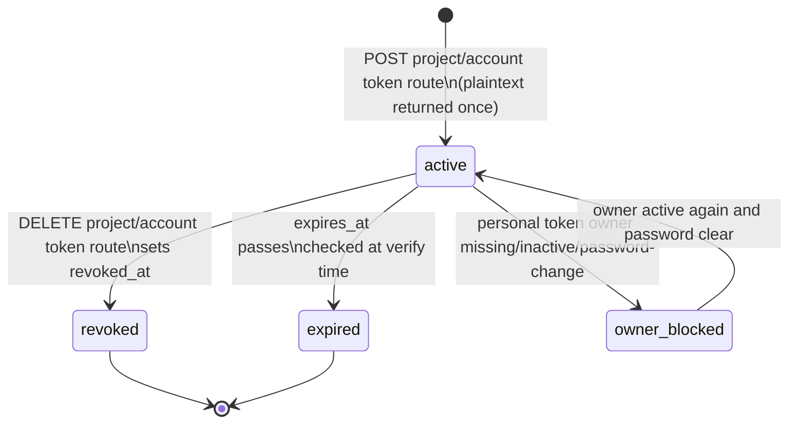
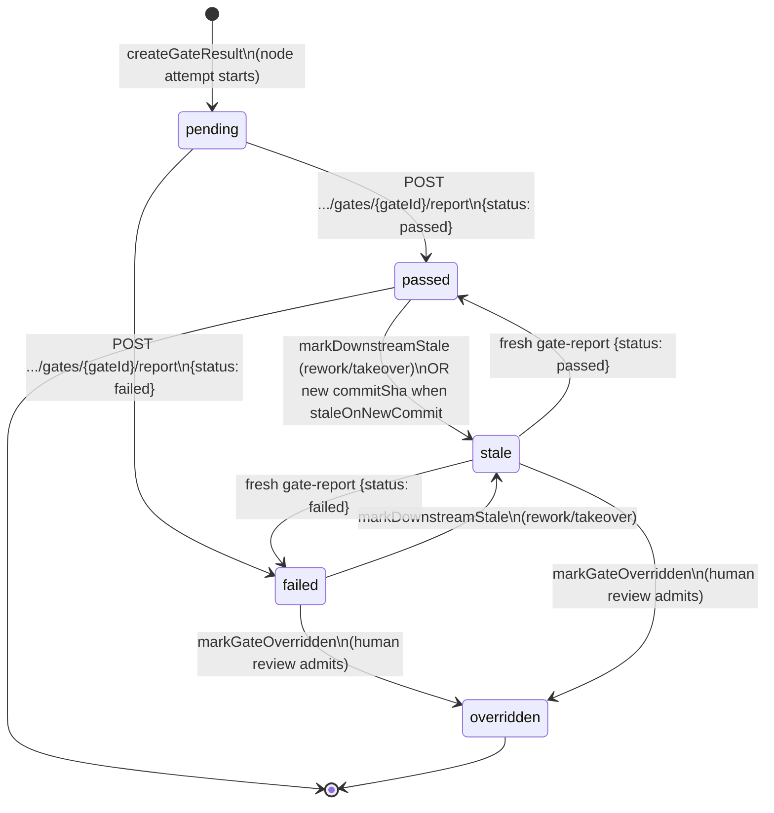
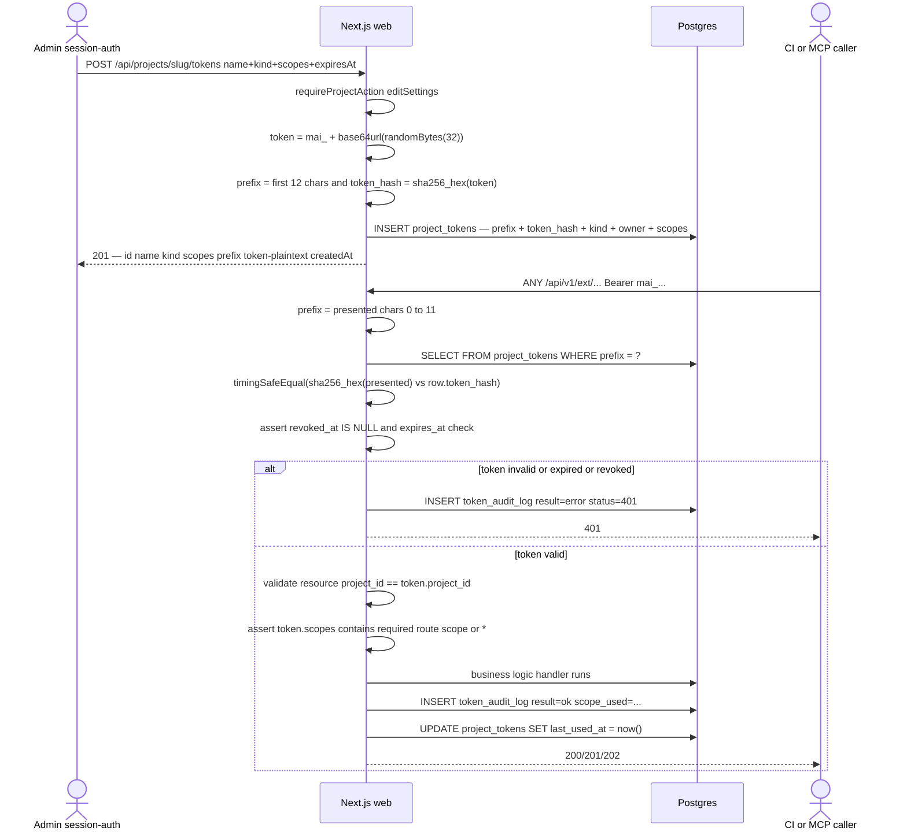
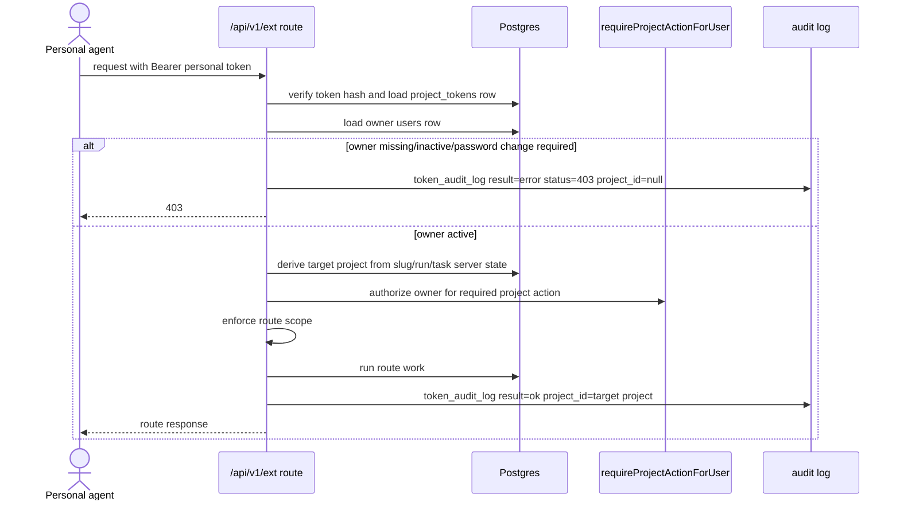
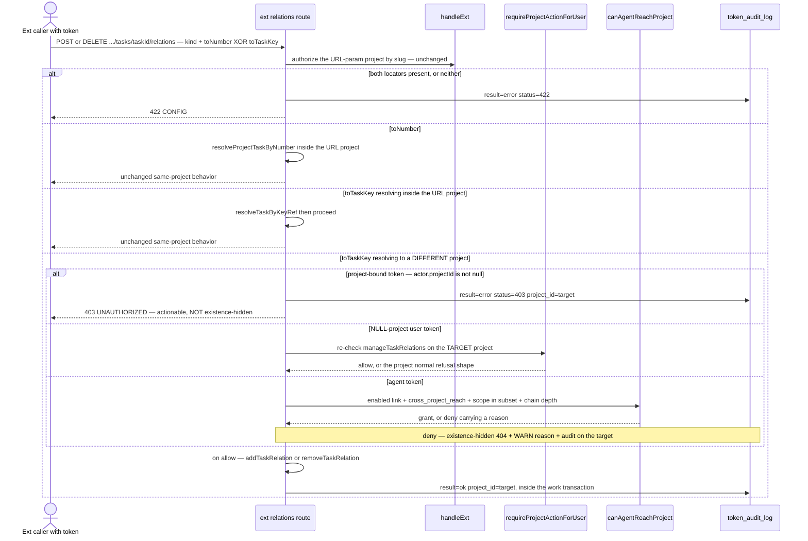
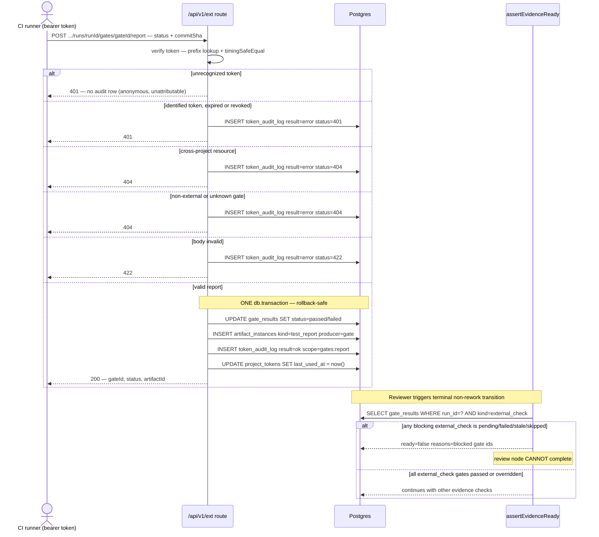
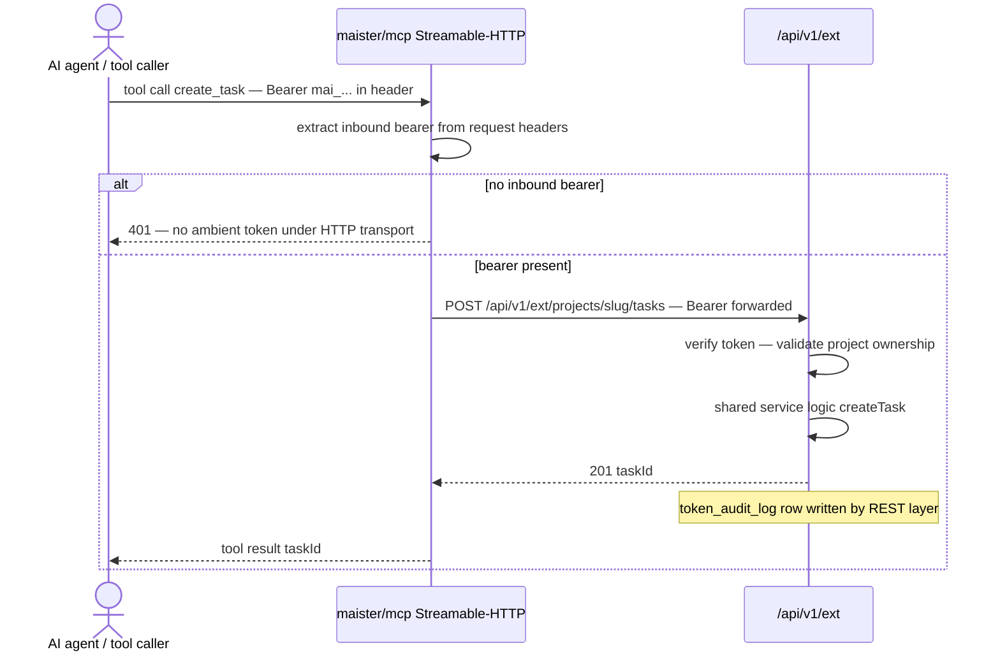

# External operations domain (M16)

> **Status: Implemented (M16), expanded by migration `0031_token_actor_scope_support.sql`.**
> Project API tokens, user-owned tokens, route-scope enforcement, token audit log,
> the `/api/v1/ext` external REST surface, the `external_check` gate report loop,
> and the thin MCP facade. Global personal API tokens are **Implemented** by
> migration `0076_user_access_tokens.sql`. Locked decisions:
> [ADR-040](../decisions.md#adr-040), [ADR-041](../decisions.md#adr-041),
> [ADR-042](../decisions.md#adr-042).
>
> **Designed (M49):** cross-project relation addressing over `toTaskKey` plus the
> `requires` kind on the ext relations route and the MCP facade
> ([ADR-155](../decisions.md#adr-155-cross-project-task-relations)), and
> opt-in cross-project reach for agent tokens at the ext-handler seam
> ([ADR-156](../decisions.md#adr-156-cross-project-agent-facade-reach)).

## Purpose

This domain covers how external callers — CI/CD pipelines, automation scripts, and
AI tool-calling agents via the MCP facade — authenticate to MAIster and interact
with the project API. A `project_tokens` row carries a sha256-hashed secret,
token kind (`project`, `user`, or `agent`), optional human owner, optional
project binding, and route scopes for `/api/v1/ext`. A user token with
`project_id IS NULL` is a global personal token: it can act only on projects the
owner can currently access. Every identified token call is recorded in
`token_audit_log`. The
`external_check` gate kind closes the
CI feedback loop: an external runner posts a pass/fail report to the gate-report
endpoint, which atomically flips the gate, records a `test_report` artifact, and
writes an audit entry; `assertEvidenceReady` then enforces the result at the
review chokepoint. The thin MCP facade (`@maister/mcp`) is a standalone REST
client of `/api/v1/ext` and carries no ambient project token of its own under the
Streamable-HTTP transport.

Domain boundary: token lifecycle management (issue/verify/revoke), the
`token_audit_log` write path, the `/api/v1/ext` versioned external surface,
the `external_check` gate-report→artifact→review-refusal loop, global personal
token authorization, and the MCP transport-scoped auth model. Out of scope:
promotion (M18), readiness DSL calibration (M15), and platform-wide tokens.
Platform tokens remain a design question until a platform-authenticated external
surface exists.

## Domain entities

- **`project_tokens`** — one row per issued token. Stores `prefix` (first 12
  chars of the token string, indexed) + `token_hash` (sha256 hex), never the
  plaintext. `token_kind='project'` represents a project automation identity.
  `token_kind='user'` records `owner_user_id` so actions can be attributed to
  the human who owns a personal agent or webhook token. Existing project-bound
  rows keep `project_id NOT NULL`; global personal tokens use
  `token_kind='user'`, `owner_user_id NOT NULL`, and `project_id IS NULL`.
  `scopes` authorizes the matching `/api/v1/ext` route label; `*` remains the
  broad project API wildcard except it does not imply `hitl:respond:human`.
  See [`../db/integrations-domain.md`](../db/integrations-domain.md).
  (Implemented)
- **Agent tokens** (M34 — Implemented, ADR-089) — `token_kind='agent'` rows with
  an `agent_id` FK: per-LAUNCH ephemeral credentials for platform-agent runs.
  Issued at agent-run spawn with exactly the fixed scope set `tasks:read,
  tasks:update, tasks:triage, comments:read, comments:create, relations:read,
  relations:create, relations:delete, flows:read, runners:read`; injected
  server-side into the
  session's MCP-facade `mcpServers` entry; revoked at the run's terminal
  transition, on attachment detach, and by GC. Verification maps them to the
  polymorphic actor `{type: 'agent', id: agent_id}` (ADR-083's first agent
  writer) and `token_audit_log.actor_label` records `agent:<id>`. See
  [agents.md](agents.md).
- **`tasks:create` joins `AGENT_TOKEN_SCOPES`** (Implemented — ADR-156) — agents hold
  no `tasks:create` in ANY project today (`web/types/token-scopes.ts:61-84`), so an
  agent cannot open a task anywhere. The route
  (`POST /api/v1/ext/projects/{slug}/tasks`, `scopeLabel: "tasks:create"`) and the
  mapping (`PROJECT_ACTION_BY_SCOPE["tasks:create"] = "createTask"`) already exist,
  so only the grant list changes — but that grant is a **same-project privilege
  expansion too**: every agent in every project gains task creation the moment it
  lands, which is exactly what forces the `runs.agent_chain_depth` containment
  below. A task an agent creates without a `flowId` is a flowless simple-intent
  task and stays `unconfigured` until triage assigns a flow — the existing ADR-112
  path, not a defect.
- **New scopes** (M34 — Implemented) — `tasks:triage` (the triage verdict op),
  `relations:read` / `relations:create` / `relations:delete` (typed-relation
  ops), `agents:trigger` (the inbound `POST /api/agents/{agentId}/event`
  webhook trigger — the only token-authenticated route outside
  `/api/v1/ext`).
- **`toTaskKey` — the cross-project relation locator** (Implemented — ADR-155) —
  `POST|DELETE /api/v1/ext/projects/{slug}/tasks/{taskId}/relations` gains a body
  field `toTaskKey`, a platform-unique `KEY-N` address such as `"API-42"`, resolved
  against the globally-unique `projects.task_key` + `tasks.number`. It is
  **mutually exclusive** with the existing `toNumber`: exactly one MUST be present;
  both or neither is a body-validation failure. `toNumber` keeps its
  "cross-project reach impossible by construction" property — it stays resolved
  strictly within the URL-param project — so `toTaskKey` is the single
  body-controlled cross-resource locator on this surface, and it is the field that
  carries the target-project authorization checks below.
- **`requires` on the ext relations surface** (Implemented — ADR-155) — `opBodySchema`
  (`web/app/api/v1/ext/projects/[slug]/tasks/[taskId]/relations/route.ts:38`)
  enumerates only `blocks | depends_on | parent_of | duplicate_of`; it gains
  `requires`, bringing ext to the same five kinds as the internal route. **The
  schema is shared by POST and DELETE**, so the missing kind today is not "cannot
  create" — it is **"cannot REMOVE"**: a `requires` edge minted by the
  orchestrator's `run_plan` is visible through `relation_list` yet unremovable over
  ext or MCP. That is the dangerous half, because `requires` is **success-gated** —
  it does NOT release when its dependency ends `Abandoned` or `Failed`, so a
  wrongly-minted edge blocks its dependent forever. A caller that wants the
  self-healing kind must reach for `depends_on`. See
  [orchestrator.md](orchestrator.md) and [social-board.md](social-board.md).
- **`CROSS_PROJECT_AGENT_SCOPES`** (Implemented — ADR-156) — the allow-list that lets
  an agent token minted for project **A** act in project **B** at the ext-handler
  cross-project seam (`web/lib/tokens/ext-handler.ts:255-274` for the slug arm,
  `:358-377` for the `resolveProjectId` arm). Exactly: `tasks:read`,
  `tasks:create`, `comments:read`, `comments:create`, `relations:read`,
  `relations:create`, `relations:delete` — read, comment, and relate. It is
  evaluated as an **allow-list**, never as a deny-list, so a scope added to
  `TOKEN_SCOPES` or `AGENT_TOKEN_SCOPES` later cannot silently acquire reach.
  Deliberately excluded: every `runs:*` op, `tasks:update`, `tasks:triage`,
  `hitl:request`, `flows:read`, `runners:read`, `memory:*`, and
  `agent_memory:write`. Reach is admitted only when ALL three hold — (1) the agent
  has an **enabled** `agent_project_links` row in the **target** project with
  `cross_project_reach = true` (the owner's per-project attach confirmation is the
  consent event; no new grant table), (2) the route's `scopeLabel` is in the subset
  AND in the token's own scopes, and (3)
  `runs.agent_chain_depth < MAISTER_MAX_AGENT_CHAIN_DEPTH` (default `2`).
  Every denial keeps the existing **existence-hidden 404** — an agent must never be
  able to probe whether a sibling project exists — accompanied by a WARN carrying
  `reason: "no_link" | "link_disabled" | "reach_off" | "scope_not_in_subset" |
  "chain_depth_exhausted"`, and the reasons stay indistinguishable from the
  response. The failure audit row records the **target** project in
  `token_audit_log.project_id` with `actor_label = agent:<id>`. Because
  `projectActionForScope` ends in `?? "readBoard"`
  (`ext-handler.ts:84-116`), every scope in the subset MUST also carry a
  `PROJECT_ACTION_BY_SCOPE` entry — an unmapped write scope silently downgrades to
  the viewer-level action. See [agents.md](agents.md) and
  [identity-access.md](identity-access.md).
- **New scopes** (M-triager — Implemented, ADR-112) — `flows:read` (the
  project's launchable flows a triage verdict may assign) and `runners:read`
  (the enabled platform ACP runners), both mapping to the `readBoard` project
  action and added to the agent-token scope set for the triager's discovery
  reads. `tasks:update` (pre-existing, maps to `editTask`) is also in the
  agent-token set so the triager's clarify mode can sharpen the task
  title/prompt before recording a verdict.
- **New scope** (ADR-141 — Implemented) — `runs:sync` authorizes BOTH
  `POST /api/v1/ext/runs/sync` and `POST /api/v1/ext/runs/reopen`, and backs the
  MCP tools `run_sync` / `run_reopen`. The routes are **run-bound** — the project
  is derived server-side from the run row (`resolveProjectId`), existence-hidden
  `404` on cross-project mismatch. `runs:sync` MUST be mapped in
  `PROJECT_ACTION_BY_SCOPE` to the **`promoteRun`** project action (member-level),
  mirroring the internal `POST /api/runs/{runId}/sync` route (FR-B9); leaving it
  unmapped would fall through to the `readBoard` (viewer) default —
  `projectActionForScope` returns `PROJECT_ACTION_BY_SCOPE[scope] ?? "readBoard"`
  — an authorization DOWNGRADE that would let a viewer-owned token launch a
  resolver. It is **manual-only**: NOT in `AGENT_TOKEN_SCOPES` and NOT in
  `ORCHESTRATOR_TOKEN_SCOPES` (`web/lib/agents/tokens.ts`). See
  [branch-sync.md](branch-sync.md) and ADR-141.
- **Memory scopes** (ADR-122/127/128) — `memory:read` covers recall and
  clusters; `memory:write` covers retain and propose. Both are in the
  `AGENT_TOKEN_SCOPES` fixed set. Scope alone never suffices: access is
  additionally gated by `projects.brain_enabled` and, for agent tokens, the
  per-link `agent_project_links.can_read_brain` (recall/clusters) /
  `can_write_brain` (retain/propose) axes. A `memory:read`/`can_read_brain`
  grant NEVER opens retain or propose.
- **Personal-token scopes** (Implemented) — `hitl:inbox:read` grants read-only
  cross-project pending HITL listing. `hitl:respond:human` is an exact critical
  scope for human, infra-recovery, and budget-breach HITL responses; `*` does
  not imply it.
- **`token_audit_log`** — append-only audit record per `/api/v1/ext` call.
  Captures actor label, scope label, endpoint, method, result, and HTTP status
  code. Global personal inbox calls write `project_id IS NULL`; per-resource
  calls write the server-derived target project. See
  [`../db/integrations-domain.md`](../db/integrations-domain.md).
  (Implemented)
- **Token string** — `mai_` + base64url(randomBytes(32)). `prefix` = first 12
  chars of the full string. Plaintext returned once at creation, never stored.
  (Implemented)
- **`/api/v1/ext`** — versioned external REST surface; token-auth only via
  `projectToken` HTTP bearer; session auth is not accepted here. (Implemented)
- **`external_check` gate** — a `gate_results` row of `kind: external_check`
  whose status starts `pending` and is driven to `passed`/`failed` by the
  gate-report endpoint. (Implemented)
- **`assertEvidenceReady`** — the review chokepoint guard
  (`web/lib/flows/graph/evidence-readiness.ts`) extended in M16 to treat
  a blocking `external_check` in `pending`, `failed`, `stale`, or `skipped` as NOT ready.
  (Implemented)
- **MCP facade (`@maister/mcp`)** — standalone `mcp/` workspace package; external
  tools, each a thin REST client of `/api/v1/ext`; zero DB or web coupling.
  (Implemented) ADR-078 adds `comment_create` / `comment_list` over the ext
  comment routes, following the `hitl_*` idiom. (Implemented) M34 (Implemented,
  ADR-089) adds `triage_set` (the triager's verdict op over
  `POST .../tasks/{taskId}/triage`) and `relation_add` / `relation_remove` /
  `relation_list` over the ext relation routes. Personal tokens add stdio
  fallback `MAISTER_ACCESS_TOKEN` and the `hitl_inbox` tool. (Implemented)
  M-triager (Implemented, ADR-112) adds the read-only discovery tools
  `flow_list` (`GET .../flows`, scope `flows:read`, launchable flows only) and
  `runner_list` (`GET .../runners`, scope `runners:read`, enabled runners only),
  and extends the triage op with two body booleans — `flag` (sets
  `triage_status='flagged'`, mutually exclusive with verdict fields → `CONFIG`)
  and `enqueue` (sets `launch_mode='auto'`, requires a verdict yielding a
  `flowId` → else `CONFIG`). See [triage.md](triage.md). (Implemented)
  - `relation_add` / `relation_remove` (scopes `relations:create` /
    `relations:delete`; `mcp/src/tools.ts:613-646` plus the `dispatchTool` bodies
    at `:1304-1330`) (Implemented — ADR-155): both `inputSchema`s gain
    `toTaskKey: { type: "string" }` as the alternative to
    `toNumber: { type: "integer", minimum: 1 }`, and both `kind` enums gain
    `requires` — yielding `{ slug, taskId, kind:
    "blocks"|"depends_on"|"parent_of"|"requires"|"duplicate_of", toNumber?,
    toTaskKey? }` with `required: ["slug", "taskId", "kind"]` and exactly one
    locator supplied. The tool **descriptions** change with the schema: the target
    may be a per-project number OR a platform-unique `KEY-N`, and `requires` is
    success-gated — it does NOT release on `Abandoned`/`Failed`, so a model that
    wants the self-healing kind picks `depends_on`. `relation_list` is unchanged:
    it already returns the counterpart's own `taskKey`, so a cross-project
    counterpart already reads correctly.
  - ⚠ **Operational — the facade runs `mcp/dist`, not `mcp/src`.** A `TOOL_SPECS`
    change is not live until the bundle is rebuilt. `dispatchTool` must also be
    extended to **forward** `toTaskKey`: it destructures known keys, so a
    schema-only change ships a facade that advertises the field and silently drops
    it. `mcp/src/__tests__/tool-contract.test.ts` (with its `TOOL_OP` map at `:96`)
    anchors both `inputSchema`s to their operation in
    `docs/api/external/operations.openapi.yaml` and is the drift guard; it is
    written RED-first, so it must fail on the `toTaskKey` / `requires` drift before
    `TOOL_SPECS` is touched.
- **MCP memory tools** (ADR-122/127/128) — `memory_recall`, `memory_retain`,
  `memory_clusters`, and `memory_propose` join `TOOL_SPECS`/`resolveRouting` in
  `mcp/src/tools.ts`, following the
  `hitl_*`/`comment_*` idiom (thin REST clients of `/api/v1/ext/projects/{slug}/memory`,
  `projectId` server-derived from the token + slug). See
  [project-brain.md](project-brain.md).
  - `memory_recall` (scope `memory:read`, `GET`): `inputSchema` =
    `{ slug: string, query: string(1..2000), limit?: integer(1..50, default 5),
    kinds?: ("lesson"|"observation"|"state_fact"|"decision"|"direction")[],
    minConfidence?: number(0..1) }` — an unknown `kinds` value → 422 `CONFIG`
    (not silently ignored). Returns the owned/indexed recall union and writes a
    `brain_snapshots` audit row (`run_id` = the token's `boundRunId` when the
    token is run-bound, else NULL). Indexed hits include canonical pointers and
    capped previews, never file-content payloads.
  - `memory_retain` (scope `memory:write`, `POST`): `inputSchema` =
    `{ slug: string, content: string(≤ 32000 chars), kind:
    "lesson"|"observation"|"state_fact"|"decision"|"direction", title?:
    string(1..512), tags?: string[] (≤ 10 items, each ≤ 64 chars) }` — body
    carries NO project id. Embeds and **dedup-or-reinforces** or inserts at
    confidence₀. `decision`/`direction` retain is refused when a registered
    canonical home covers the kind.
  - `memory_clusters` (scope `memory:read`, `GET
    /api/v1/ext/projects/{slug}/memory/clusters`): server-computed recurring
    evidence clusters for the improver. It is read-only and returns evidence ids,
    recurrence, summary, and `clusterHash`.
  - `memory_propose` (scope `memory:write`, `POST
    /api/v1/ext/projects/{slug}/memory/proposals`): creates a
    `brain_proposals` row. Project autonomy may immediately auto-draft allowed
    low-risk catalog proposals into unpublished authored drafts, but the route
    never publishes or writes repo files. Duplicate `clusterHash` values are
    idempotent and return the existing proposal status.
  All memory tools are gated by `brain_enabled` + the `can_read_brain`/`can_write_brain` link
  axis. When the Brain migration lineage is not provisioned, tools stay
  **listed** (static `TOOL_SPECS`) but fail closed with `PRECONDITION`; a transient embedding outage returns
  `EMBEDDING_UNAVAILABLE` (503, retryable) while a deterministic provider 4xx maps
  to 422 `CONFIG`. Ext rate limiting remains deferred until the multi-tenant
  middleware exists.

## State machine — token lifecycle

A `project_tokens` row is active from creation until it is revoked or expires.
Revocation sets `revoked_at`; no row is deleted.

Transitions:
- `[*] → active`: session-auth `POST /api/projects/{slug}/tokens` with
  `requireProjectAction(editSettings)`. Generates a 256-bit random token string,
  stores `prefix` + `sha256` hash, returns the plaintext once; `expires_at` is
  optional.
- `active → revoked`: `DELETE /api/projects/{slug}/tokens/{tokenId}` sets
  `revoked_at`; verify of a revoked token → 401.
- `active → expired`: `expires_at` is compared at verify time; past expiry → 401.
  No sweeper; expiry is evaluated on each request.
- `active → owner_blocked`: global personal-token owner state is evaluated at
  verification/authorization time; no token row mutation is required.
  (Implemented)

## State machine — external_check gate

The gate-report endpoint drives a `gate_results` row from `pending` through its
verdict. Staleness and override reuse the existing flow-graph machinery.

Transitions:
- `pending → passed|failed`: the gate-report endpoint atomically updates the
  `gate_results` row, records a `test_report` artifact, and writes a success
  `token_audit_log` row — all in one `db.transaction`.
- `passed → stale`: either `markDownstreamStale` on rework/takeover, or a new
  gate-report arriving with a different `commitSha` when `staleOnNewCommit !== false`
  on the gate's `external` config. No sweeper; event-driven.
- `stale → passed|failed`: a fresh gate-report supersedes the stale result.
- `failed|stale → overridden`: `markGateOverridden` — original verdict preserved,
  never deleted.

## Process flows

### Token issue, verify, and audit

Session-auth token-management routes issue and revoke tokens. The external REST
surface verifies on every call and writes an audit row.

### Personal token authorization across projects (Implemented)

Global personal tokens do not carry a project binding. Each external route must
derive the target project from URL or server state, then authorize the token
owner as a live MAIster user.

### Cross-project relation mutation (Implemented — ADR-155 / ADR-156)

`handleExt` authorizes the **URL-param** project exactly as it does today. A
`toTaskKey` that resolves outside that project is a second, body-supplied target
and needs its own authorization, which differs by actor class. Note the deliberate
asymmetry: the project-bound refusal is an **actionable 403**, because the caller
supplied a globally-unique key and hiding the target would leave them with nothing
to fix; the agent refusal stays an **existence-hidden 404**, because an agent must
never be able to probe for project existence.

### Gate-report: gate flip, test_report artifact, review refusal

The success path is atomic. A blocking `external_check` gate that is `pending`,
`failed`, `stale`, or `skipped` blocks `assertEvidenceReady` at the review chokepoint.

### MCP tool call via Streamable-HTTP transport

The MCP facade forwards the inbound bearer verbatim to `/api/v1/ext`. The server
holds no ambient token under the HTTP transport.

For the stdio transport (local-only), the MCP server reads `MAISTER_PROJECT_TOKEN`
first and then `MAISTER_ACCESS_TOKEN` as a fallback. It forwards the first
non-empty value to every `/api/v1/ext` call. No per-request bearer extraction
occurs.

The assistant-facing activity routes are part of the same external trust
boundary, but their semantic reduction and liveness rules are owned by
[assistant-activity.md](assistant-activity.md). This domain owns only auth,
scope, audit, and MCP forwarding for that surface.

## Expectations

- `project_tokens.token_hash` MUST be `sha256_hex(fullTokenString)` — never bcrypt,
  never peppered — the plaintext MUST be returned exactly once at creation and
  never stored, logged, or re-derivable, and verification MUST use
  `timingSafeEqual(sha256_hex(presented), row.token_hash)` against the
  `prefix`-indexed row. (Implemented)
- A token whose `project_id` does not match the addressed resource's project MUST
  return 404 to existence-hide the resource, not 401. (Implemented)
- Every `/api/v1/ext` route MUST require its matching route scope (`tasks:create`,
  `tasks:read`, `tasks:update`, `runs:launch`, `runs:read`, `readiness:read`,
  `gates:report`, `hitl:read`, `hitl:respond`, `comments:read`, `comments:create`,
  `relations:read`, `relations:create`, `relations:delete`, …), returning 403
  `UNAUTHORIZED` with a failure `token_audit_log` row that MUST NOT reveal the
  token's held scopes; `*` is the full-project-automation compatibility path and
  MUST NOT satisfy `hitl:respond:human`, which MUST be granted explicitly.
  (Implemented)
- User-owned tokens MUST store `token_kind='user'` and `owner_user_id`, and
  external task creation or run launch through one MUST set
  `tasks.created_by_user_id` / `runs.created_by_user_id` to the owner while project
  tokens keep those fields null. (Implemented)
- A global personal token MUST store `project_id IS NULL`, MUST authorize each
  per-resource call by deriving the target project from URL/server state (body
  project ids MUST NOT expand authority) and checking the owner through
  `requireProjectActionForUser`, and MUST fail closed when its owner row is
  missing, inactive, or `must_change_password=true`. (Implemented)
- Every `/api/v1/ext` call presenting an **identified** token MUST write exactly
  one `token_audit_log` row — on success and on identified-token failures (expired
  / revoked / wrong-project / validation) — while an **unidentifiable** token (no
  `prefix` match or hash mismatch) returns 401 with NO audit row because
  `token_audit_log.token_id` is `NOT NULL`; those rows MUST cascade-delete with
  their `project_tokens` row and MAY carry `project_id IS NULL` for global personal
  calls. (Implemented)
- The gate-report success path (gate UPDATE + `test_report` artifact INSERT +
  success `token_audit_log` INSERT) MUST execute in a single `db.transaction` that
  rolls back all three on any failure, MUST serialize concurrent reports for the
  same run with a `SELECT ... FOR UPDATE` on the run row so a double-delivered
  report for the SAME `commitSha` updates one row in place, and MUST return 409
  `CONFLICT` on a terminal run (`runs.status` ∈ `Done`/`Abandoned`/`Crashed`/
  `Failed`) without mutating gate or artifact state. (Implemented)
- A blocking `external_check` gate in `pending`, `failed`, `stale`, or `skipped`
  MUST make `assertEvidenceReady(runId, "review")` return `blocked` so the review
  node cannot complete its terminal non-rework transition unless the gate is
  `overridden`, and `staleOnNewCommit !== false` MUST flip a passed gate to `stale`
  when a report arrives with a different `commitSha` — event-driven, with NEVER a
  periodic sweeper. (Implemented)
- The Streamable-HTTP MCP transport MUST require a per-request inbound bearer
  forwarded verbatim to `/api/v1/ext` (no ambient token, 401 when absent), and
  because the per-tool `inputSchema` is advisory only — every tool is registered
  with a passthrough `z.record` — the facade MUST coerce any argument whose
  declared type is `number` or `integer` from a finite numeric string to a number
  while passing `null`, already-numeric values, and non-numeric strings through
  unchanged so genuinely invalid input still surfaces as `422 CONFIG`.
  (Implemented)
- `GET /api/v1/ext/activity` and `GET /api/v1/ext/runs/{runId}/activity` MUST
  stay thin external surfaces over the shared assistant-activity layer:
  project identity is derived from the token or run row, `runs:read` remains
  the scope gate, and the external payload MUST NOT expose raw ACP frames,
  absolute paths, or supervisor-private handles.
- Session-auth routes MUST NOT accept project tokens; `/api/v1/ext` routes MUST
  NOT accept session cookies. The two auth surfaces are mutually exclusive. (Implemented)
- The ext relations `opBodySchema` MUST offer the same five kinds as the internal
  route — `blocks | depends_on | parent_of | requires | duplicate_of` — on BOTH
  `POST` and `DELETE`, so every kind the orchestrator can mint is also removable
  over ext and MCP. (Designed)
- `toNumber` and `toTaskKey` MUST be mutually exclusive on the relations body —
  exactly one present — with both-present or neither-present returning `CONFIG`
  (status 422 on this surface, per `httpStatusForExtCode`; the internal route
  returns 400). (Designed)
- A project-bound ext token (`actor.projectId !== null`) whose `toTaskKey` resolves
  to a different project MUST be refused 403 `UNAUTHORIZED` with a failure
  `token_audit_log` row recording the target project — deliberately NOT the
  existence-hidden 404 used for URL-project scoping, because the caller supplied a
  globally-unique key and the refusal must be actionable. (Designed)
- A NULL-project user token MUST pass
  `requireProjectActionForUser(ownerUserId, targetProjectId, "manageTaskRelations")`
  on the TARGET project before a cross-project relation is created or removed.
  (Designed)
- An agent token MUST reach another project only when the route's scope is in
  `CROSS_PROJECT_AGENT_SCOPES`, the agent holds an enabled `agent_project_links`
  row in the target project with `cross_project_reach = true`, and
  `runs.agent_chain_depth < MAISTER_MAX_AGENT_CHAIN_DEPTH`; every denial MUST stay
  an existence-hidden 404 carrying a WARN with its `reason`. (Designed)
- Every scope in `CROSS_PROJECT_AGENT_SCOPES` MUST have a `PROJECT_ACTION_BY_SCOPE`
  entry, because `projectActionForScope` ends in `?? "readBoard"` and an unmapped
  write scope silently resolves to the viewer-level action. (Designed)
- MCP `TOOL_SPECS` for `relation_add` / `relation_remove` MUST mirror the ext
  route's body schema — `toTaskKey` and the `requires` kind included — as asserted
  by `mcp/src/__tests__/tool-contract.test.ts` against
  `docs/api/external/operations.openapi.yaml`. (Designed)

## Edge cases

- **Token expired** (`expires_at < now()`) → 401; failure `token_audit_log` row
  written after the verification attempt, outside any success transaction.
- **Token revoked** (`revoked_at IS NOT NULL`) → 401; same failure-audit path.
- **Cross-project resource** (token's `project_id` ≠ addressed slug/run/task) →
  404 (existence-hide); failure audit written; no resource mutation.
- **Non-external or unknown gate** (gate is not `kind: external_check`, or
  `gateId` does not exist) → 404; failure audit written; no gate or artifact
  mutation.
- **Body validation failure** → 422; failure audit written; no gate or artifact
  mutation.
- **Terminal run** (`runs.status` ∈ `Done`/`Abandoned`/`Crashed`/`Failed`) →
  409 `CONFLICT`; failure audit written; no gate or artifact mutation.
- **Gate already `overridden`** → gate-report on an overridden gate returns 404
  (gate is sealed); cannot reopen via the external surface. A concurrent
  override that seals the gate after the pre-check but before the transaction
  also returns 404 (`GateNotReportableError` → 404), never 500.
- **`staleOnNewCommit` re-report with same `commitSha`** → gate flips to
  `passed`/`failed` normally; no staleness triggered.
- **Concurrent gate-reports** → serialized by a run-row `FOR UPDATE` lock; two
  reports for the SAME new `commitSha` produce exactly one fresh superseding row
  (the second updates it in place), each still writing its own
  `token_audit_log` row.
- **MCP stdio transport** → reads `MAISTER_PROJECT_TOKEN` from env; ignores any
  inbound bearer header; local-only use. If unset, it reads
  `MAISTER_ACCESS_TOKEN`. Empty strings are ignored. (Implemented)
- **User token owner deleted** → new user-token rows require
  `owner_user_id NOT NULL`; operators must revoke/delete personal tokens before
  deleting the owner. Any legacy ownerless user-token row fails closed because no
  live owner can be authorized.
- **Personal token owner disabled or password-change required** → identified
  request returns 403 and writes a failure audit row without running route work.
- **Personal token targets inaccessible project** → route uses the existing
  family rule: existence-hide 404 where project/run/task visibility is hidden,
  otherwise 403. No body field can make another project visible.
- **Global personal HITL inbox** → `GET /api/v1/ext/hitl` writes audit with
  `project_id IS NULL`; project and agent tokens get 403.
- **Relations body carries both `toNumber` and `toTaskKey`, or neither** → 422
  `CONFIG`; failure audit written; no relation mutation. (Designed)
- **`toTaskKey` malformed, unknown, or archived** (does not parse as `KEY-N`, no
  matching `projects.task_key`, no matching `tasks.number`, or the resolved project
  is archived) → 404; failure audit written; no relation mutation. The malformed
  case is a resolver `null`, never a throw. (Designed)
- **Project-bound token with a cross-project `toTaskKey`** → 403 `UNAUTHORIZED`
  with the audit row on the TARGET project. This is the one place the surface's
  existence-hiding rule is deliberately not applied — ADR-155 records the
  asymmetry, so a reviewer does not "fix" it back to 404. (Designed)
- **Agent reach denied** (`no_link | link_disabled | reach_off |
  scope_not_in_subset | chain_depth_exhausted`) → existence-hidden 404 + failure
  audit on the target project + a WARN naming the reason; the five reasons MUST NOT
  be distinguishable from the response, and the agent MUST NOT be able to infer
  whether the project exists. (Designed)
- **Agent token holds a scope outside `CROSS_PROJECT_AGENT_SCOPES`** (e.g.
  `tasks:update`, `hitl:request`, `memory:read`) → the cross-project call is denied
  `scope_not_in_subset` even with an enabled reach-granted link; same-project use of
  that scope is unaffected. (Designed)
- **`requires` edge wedges a board** → no `MaisterError`; this is a stuck state,
  not a failure. `requires` never releases on `Abandoned`/`Failed`, so a wrongly
  minted edge blocks its dependent indefinitely. The mitigation is visibility plus
  removability: the `blocked` chip names the blocker's `KEY-N`, and the ext/MCP
  `DELETE` path made available by the kind-parity change is what lets a caller undo
  it at all. (Designed)
- **MCP facade forwards a stale schema** → `dispatchTool` accepts `toTaskKey` but
  drops it (unknown-key destructuring), or `mcp/dist` was not rebuilt after the
  `mcp/src` edit → the ext route sees neither locator and returns 422 `CONFIG`.
  `mcp/src/__tests__/tool-contract.test.ts` is the guard for both halves.
  (Designed)

## Agent clarification request (Implemented — ADR-136)

`POST /api/v1/ext/projects/{slug}/tasks/{taskId}/human-asks` requires the exact
agent `hitl:request` scope. The project comes from `slug`, the task is checked
against that project, and the source run/agent come only from the authenticated
agent-token server state; none can appear in the body. The strict body is
`{ question, schema: FormSchemaV1, reTriggerMode?: "agent" | "triage" }`.
`schema` uses the existing form-schema version validator, not arbitrary JSON
Schema. A human-only answer of `agent_question` requires a session responder or
a global personal token with exact `hitl:respond:human`; `*` is insufficient.

## Linked artifacts

- ADRs: [ADR-045](../decisions.md#adr-045) (external_check enforcement via review
  chokepoint), [ADR-046](../decisions.md#adr-046) (project API token model),
  [ADR-047](../decisions.md#adr-047) (thin MCP facade),
  [ADR-155](../decisions.md#adr-155-cross-project-task-relations) (cross-project
  task relations — `toTaskKey` addressing, kind parity, the deliberate
  403-vs-404 asymmetry; Designed),
  [ADR-156](../decisions.md#adr-156-cross-project-agent-facade-reach)
  (cross-project agent facade reach — `CROSS_PROJECT_AGENT_SCOPES`, the
  attachment-as-grant model, `runs.agent_chain_depth`; Designed).
- DB ERD: [`../db/integrations-domain.md`](../db/integrations-domain.md),
  [`../db/erd.md`](../db/erd.md).
- DB narrative: [`../database-schema.md`](../database-schema.md)
  (`project_tokens`, `token_audit_log` sections).
- API (external surface): `docs/api/external/operations.openapi.yaml`.
- API (token management): [`../api/web.openapi.yaml`](../api/web.openapi.yaml)
  (`POST/GET/DELETE /api/projects/{slug}/tokens`,
  `GET/POST/DELETE /api/account/tokens`).
- Error taxonomy: [`../error-taxonomy.md`](../error-taxonomy.md)
  (Token / external-API auth: 401/403/404/422).
- Related domains: [`flow-graph.md`](flow-graph.md) (gate_results,
  markDownstreamStale, markGateOverridden), [`artifacts.md`](artifacts.md)
  (test_report artifact, assertEvidenceReady),
  [`assistant-activity.md`](assistant-activity.md) (assistant pulse and
  per-run semantic activity feed),
  [`social-board.md`](social-board.md) (ADR-083 ext comment routes, actor
  mapping, Implemented).
- Configuration: [`../configuration.md`](../configuration.md)
  (`gates[].external` schema, `MAISTER_API_BASE_URL`, `MAISTER_PROJECT_TOKEN`,
  `MAISTER_ACCESS_TOKEN`).
- SDD: [`../../.ai-factory/specs/feature-user-access-tokens.md`](../../.ai-factory/specs/feature-user-access-tokens.md).
- Source files (Implemented): `web/lib/db/schema.ts` + migration
  `0020_m16_api_tokens.sql` + `0031_token_actor_scope_support.sql`,
  `web/lib/tokens/` (`issue.ts`, `verify.ts`,
  `secret.ts`, `audit.ts`, `revoke.ts`, `list.ts`, `ext-handler.ts` —
  `TokenAuthError`, `httpStatusForTokenAuth`, `verifyToken`, constant-time
  hash compare), `web/app/api/v1/ext/`, `web/app/api/projects/[slug]/tokens/`,
  `web/lib/flows/graph/evidence-readiness.ts` (extended for `external_check`),
  `mcp/` (`@maister/mcp` workspace package).
