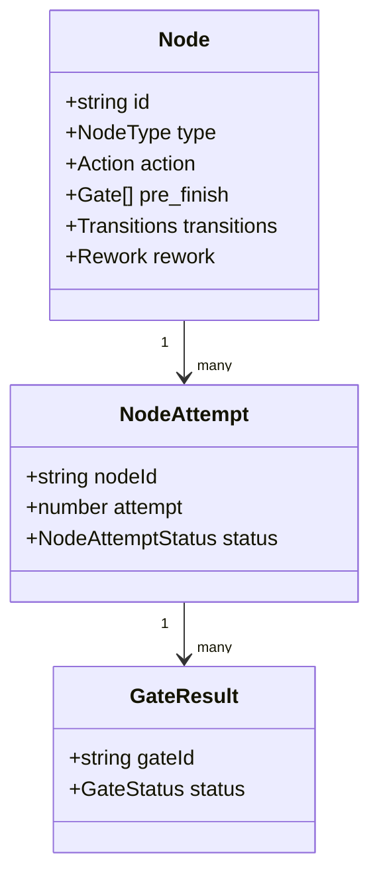
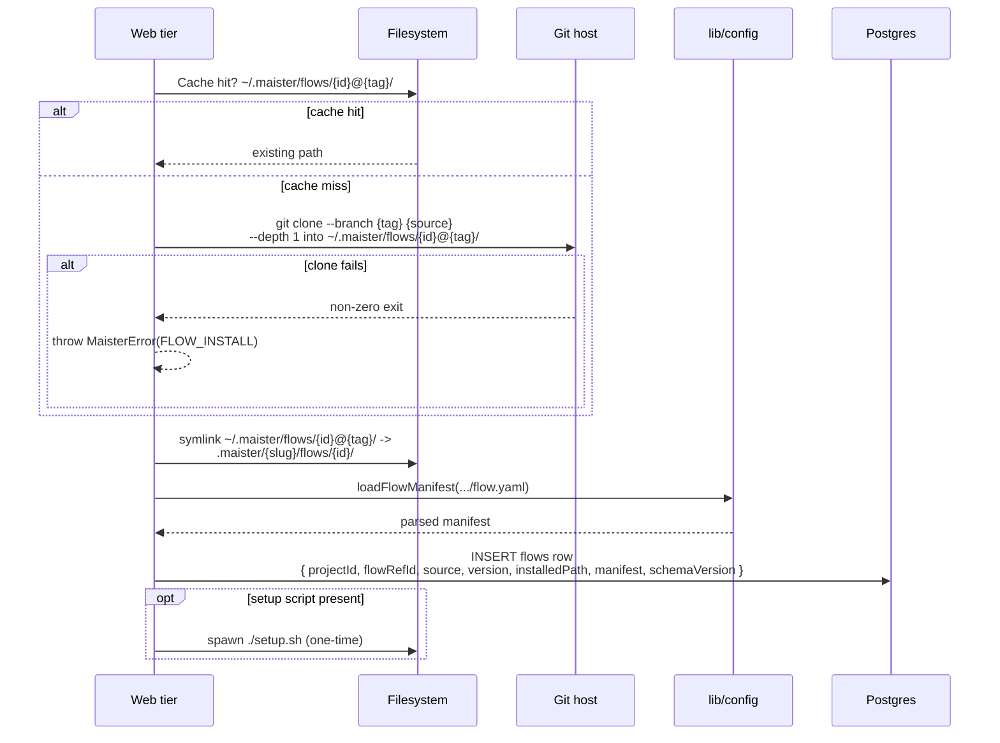
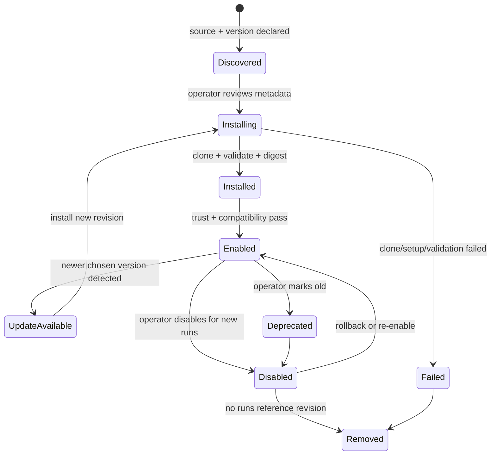
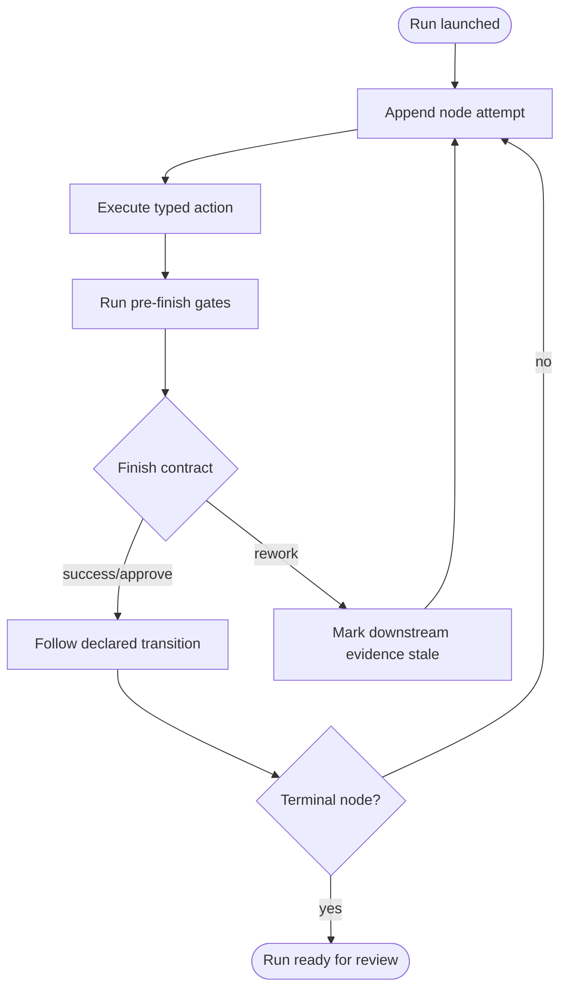
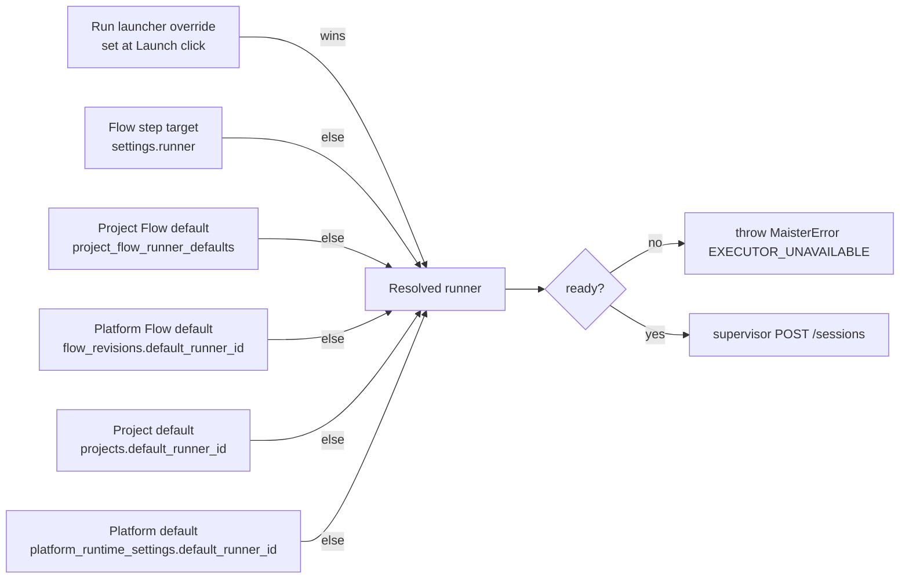

# Flows domain

## M43 graph-only compatibility contract (Implemented)

Engine 3.0.0 accepts only manifests with a non-empty nodes array and no
top-level steps key. A present steps key, including an empty array or a
manifest that also contains nodes, is the typed incompatibility “legacy
steps[] flows are not supported since engine 3.0.0; republish the package with
nodes[]”. Stored legacy revisions remain inspectable but cannot be enabled,
selected by lifecycle mutation, or launched. Malformed graph data and
engine-bound incompatibility remain distinct typed classifications; mutation
boundaries reject them with `CONFIG`, while read models remain renderable.

## Purpose

A **Flow** is a versioned plugin bundle that describes how to execute
one kind of task — bugfix, feature, spec-kit, review, etc. It ships as
a git repository with a manifest (`flow.yaml` v1), shipped CLIs, an
optional `setup.sh`, and a graph-node YAML DSL. MAIster orchestrates
the graph; it does NOT design Flows itself. Multi-flow **packages** that group
several Flows + capability content under one import are **(Implemented)** in
[`packages.md`](packages.md) (ADR-088).

## Domain entities

- **Flow plugin** — git repo with `flow.yaml` at root. Pinned by tag.
- **Flow package revision** — immutable installed revision of a Flow package,
  keyed by resolved commit SHA and manifest digest. It is a first-class
  lifecycle object with trust, compatibility, setup, enablement, upgrade,
  rollback, and deprecation state.
- **Project Flow enablement** — project-level pointer to the Flow package
  revision new runs should use. Existing runs keep their snapshotted revision.
- **Node** — a typed entry in the Flow's `nodes[]` graph, with an action,
  lifecycle gates, explicit transitions, and optional rework policy.
- **Manifest** — parsed `flow.yaml`. Persisted to `flows.manifest`
  (jsonb).
- **Recommended executor** — optional pointer in the manifest. Lowest
  priority in the override chain ([`executors.md`](executors.md)).
- **Gate** — planned Flow-distributed readiness decision over artifacts:
  command check, internal skill/command check, AI judgment, external
  CI/system check, required artifact, or human review.

## Node taxonomy

## Process flows

### Install a Flow plugin (Implemented)

### Package lifecycle (Implemented)

### Graph execution model (Implemented)

Nodes run according to validated transitions. A human review decision may
re-enter an allowed target, mark downstream evidence stale, and open a new node
attempt. `maxLoops` bounds rework.

### Runner resolution

The platform ACP runner for an AI-coding node is the highest-priority match:

## Expectations

- A Flow plugin is identified at install time by its upstream **git
  commit SHA**, captured via `git rev-parse HEAD` after the
  tag-pinned clone. The system cache is keyed by the resolved SHA:
  `~/.maister/flows/<flow_ref_id>@<short_sha>/`. The directory is
  content-addressed and immutable once written — re-installing the
  same tag at a different commit (force-pushed tag, replaced tag)
  lands at a new directory, leaving the prior install untouched.
- **(Implemented)** A run executes against an immutable,
  content-addressed flow bundle. At launch the SHA is snapshotted into
  `runs.flow_revision`; the runner derives the bundle path from
  `(flows.flow_ref_id, runs.flow_revision)` via
  `systemCachePath` — **never** from the mutable
  `flows.installed_path` column. A flow upgrade is therefore safe even
  for runs in flight: the new install lands at a new SHA-keyed
  directory and existing runs keep reading their pinned directory.
  Local-source installs (file:// to a non-git directory, used by
  test fixtures) use the literal `"unknown"` sentinel as the
  revision; production flows are git-only.
- `flow.yaml` is parsed exactly once at install and persisted verbatim
  to `flows.manifest` (jsonb); runtime NEVER re-reads `flow.yaml`.
- **(Implemented)** Package revisions are persisted separately from project
  enablement. A project may have several installed revisions of one Flow id,
  but only one enabled revision is used for new launches.
- **(Implemented)** Install and upgrade are explicit product actions. Reading
  `maister.yaml` can discover a desired Flow source/version, but it must not
  silently trust, enable, run setup, or replace the project-enabled revision.
- **(Implemented)** Package metadata includes source, version label, resolved
  revision, manifest digest, compatibility result, trust status, setup status,
  declared nodes, artifacts, gates, capabilities, external operation needs, and
  active run references.
- **(Implemented)** Upgrade installs a new immutable revision beside the old
  one, validates compatibility, shows a diff of package contract changes, and
  then switches the project enablement only after user confirmation.
- **(Implemented)** Rollback switches project enablement to an older installed
  revision. Active and completed runs continue to resolve the revision they
  snapshotted at launch.
- **(Implemented)** Package removal is refused while any run references the
  revision. GC can remove only unreferenced disabled/failed revisions.
- `flow.yaml schemaVersion: 1` mismatch refused with `CONFIG` BEFORE
  any filesystem side effect.
- `nodes[]` ids are unique within a Flow; duplicates are refused with `CONFIG`.
- Node types and their type-specific action/settings contracts are a closed
  discriminated union; unknown or malformed nodes are refused with `CONFIG`.
- Every transition and rework target resolves to a declared node id; the graph
  must have one valid entry and at least one terminal path.
- Any top-level `steps` key is refused with the locked engine-3 migration
  message before persistence or runtime side effects.
- `setup.sh` runs exactly once per `{id}@{tag}` install.
- Executor resolution for every runner-bearing node is total — produces a
  registered executor or fails with `EXECUTOR_UNAVAILABLE`.
- Graph gates ship with the Flow plugin, while project config supplies reusable
  command profiles, skill mappings, capability profiles, env profiles, and
  default limits.
- Gate kinds are `command_check | skill_check |
  ai_judgment | external_check | artifact_required | human_review`; each gate has
  `mode: blocking | advisory` and status `pending | running | passed |
  failed | stale | skipped | overridden`. M11a **executes**
  `command_check`/`ai_judgment`/`human_review` and `skill_check` (best-effort,
  no capability scoping until M14); `artifact_required` executes as of M12 and
  `external_check` executes as of M16 (report ingestion via the operations API).
  See [`flow-graph.md`](flow-graph.md) §Gate execution.
- **(M16 — Implemented)** `external_check` gates are satisfied through the
  token-authenticated operations API or the thin MCP facade. Reports become
  typed gate artifacts and participate in readiness, staleness, review, and
  promotion refusal like native gate results.
- **(Planned)** Internal skill/command gates, such as `/aif-review` or
  project QA/checklist skills, run through the same capability materialization
  and artifact recording path as AI nodes when they use an agent session.
- **(Planned M15/M18)** Review and merge refuse when any required blocking gate
  is missing, pending, running, failed, stale, or skipped — M11a records
  `gate_results` but does not gate promotion on them. **(M11a — Designed)**
  Overrides require a declared `human_review` decision and never delete the
  failed evidence (override-without-erasure).
- Templating in `prompt` is Mustache-style and resolves session context, task
  fields, highest-attempt node output vars through the stable `steps.<nodeId>`
  namespace, and executor metadata.

## Edge cases

- **`schemaVersion: 1` mismatch in `flow.yaml`** → `MaisterError("CONFIG")` on load.
- **Any top-level `steps` key** → `CONFIG` with the locked engine-3 migration
  message.
- **Missing/empty `nodes[]` or duplicate node id** → `CONFIG`.
- **Transition/rework target references a missing node id** → `CONFIG`.
- **Malformed node-specific action/settings contract** → `CONFIG`.
- **`git clone --branch <tag>` fails** → `FLOW_INSTALL` (502).
- **Tag mutated upstream after install** — MAIster does NOT re-validate
  on each launch (cache hit short-circuits). Operator forces refresh by
  bumping the tag in `maister.yaml`.
- **Package revision disabled after launch** — in-flight runs keep using their
  snapshotted revision; only new launches are refused.
- **Package revision removed while referenced by a run** → `PRECONDITION`;
  referenced immutable revisions are retained.
- **Package requires unsupported MAIster engine/API/capability** → cannot be
  enabled; launch fails before workspace creation.
- **`setup.sh` exits non-zero** → `FLOW_INSTALL` (502); manifest stays
  uninstalled.
- **Node output token cost exceeds guard cap** — metric only,
  no kill. Phase 2 adds enforcement.

## Linked artifacts

- ADRs: [ADR-010 Flow Engine v2](../decisions.md#adr-010-flow-engine-v2-plugin-packaging--step-dsl),
  [ADR-026 Graph manifest](../decisions.md#adr-026-flow-graph-manifest-v1-nodes--engine-version-bump),
  [ADR-029 M11 split](../decisions.md#adr-029-split-m11-into-m11a--m11b--m11c).
- Graph execution (M11a): [`flow-graph.md`](flow-graph.md).
- Package lifecycle: [`flow-packages.md`](flow-packages.md).
- Config reference: [`../configuration.md`](../configuration.md) §`flow.yaml v1`.
- ERD: [`../db/projects-domain.md`](../db/projects-domain.md) (flows table).
- Schemas: `web/lib/config.schema.ts` (graph-only node union).
- Source: `web/lib/config.ts` (`loadFlowManifest`).

## Plan-review capability validation (Implemented — ADR-137)

Flow compilation owns `settings.plan_review` validation: `human` type, engine
floor 3.1.0, declared current artifacts, positive decision-rework bound, exact
parent outcomes, and a Flow-declared rework target. This is reusable manifest
semantics, not a convention tied to a `plan_review` node name or prompt text.
