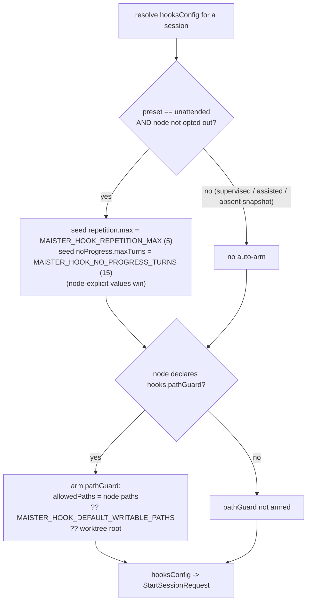
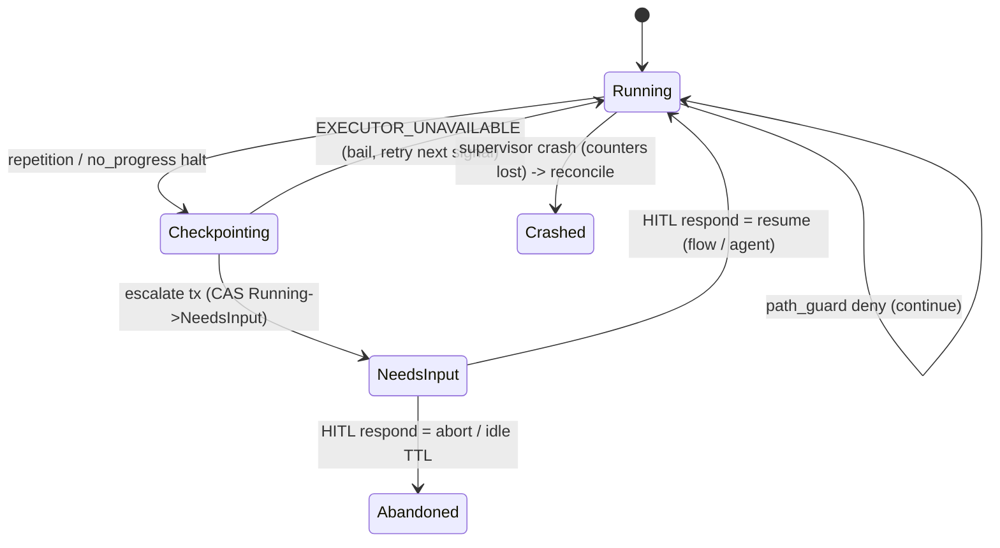
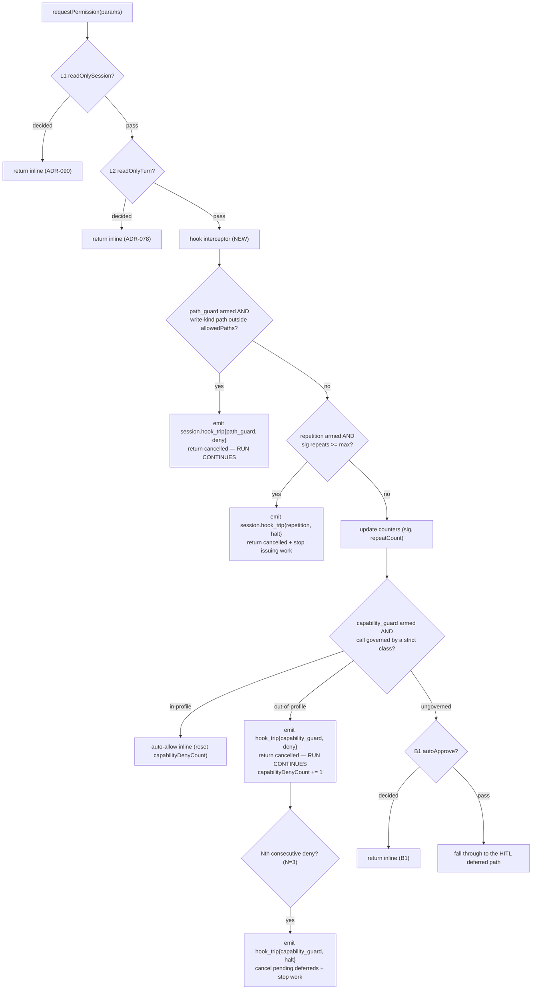
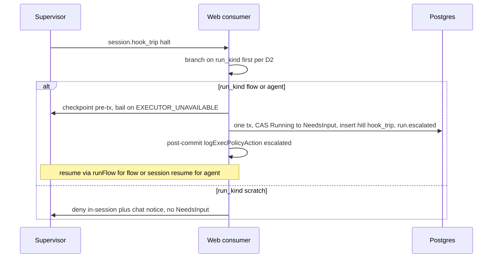
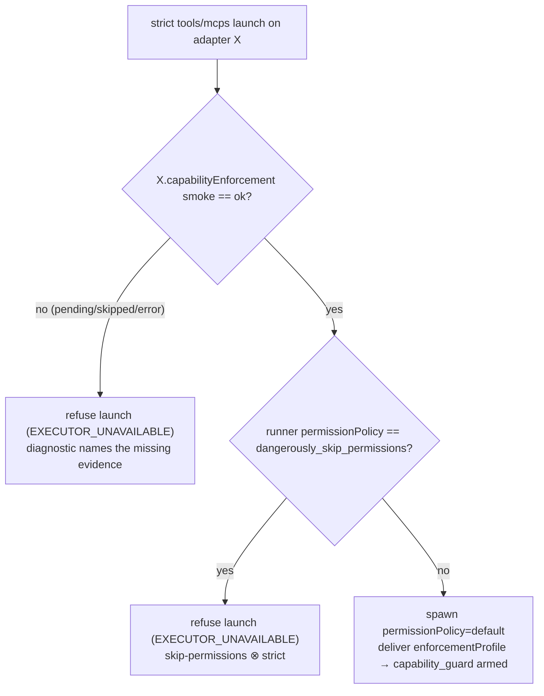

# Guardrail / hook engine (ADR-108, M40 — Implemented; `capability_guard` ADR-129 — Designed)

> Status: **[ADR-108](../decisions.md#adr-108-declarative-guardrailhook-engine--universal-supervisor-acp-seam-interceptor-native-materializer-seam-and-hook-trip-hitl-escalation)** (M40). Contract frozen; **P1–P5 implemented** (capability class + migration 0066 + two-tier default; universal supervisor 3-rule interceptor; web hook-trip escalation + per-run_kind resume + `hook_trip` HITL; native claude `PreToolUse` path-guard backend — live fires+denies confirmation deferred; Studio node-settings `hooks` editor + 7th-class settings-panel tag + `hook_trip` HITL resume/abort affordance with timeline surfacing; seeded `m40-guardrail-hooks` e2e). **P6: e2e + full gate sweep done (green); dogfood ralph-loop dropped (the universal + native layers stand on unit/integration/e2e coverage; the live native-hook fires/denies confirmation is the one residual); rebased onto main + renumbered (ADR-108 / migration 0066) 2026-06-24.**
>
> **[ADR-129](../decisions.md#adr-129-adapter-agnostic-capability-enforcement-at-the-acp-seam) — `capability_guard` (M14 enforcement flip, Designed).** A fourth,
> **derived-only** rule kind `capability_guard` extends this same seam to enforce
> `enforcement.<class>: strict` on `tools` / `mcps` via tool-identity allow-lists,
> evidence-gated per adapter. It carries a new `enforcementProfile` on
> `StartSessionRequest` (seeded onto `SessionRecord` like `hooksConfig`), flips
> `tools`/`mcps` → `enforced` and corrects `hooks` → `enforced` in
> `ENFORCEABILITY_BY_AGENT` (see [`flow-settings.md`](flow-settings.md) +
> [`capabilities.md`](capabilities.md)). **No migration, no engine bump.** Every
> section tagged `(capability_guard — ADR-129)` below is the frozen spec ahead of
> code (Phases 2–3); it flips Designed → Implemented at as-built reconciliation.
> This file is the design home for the mechanism. ADR rationale is in ADR-108/ADR-129 (R7 — cited, not restated).

## Purpose

The guardrail/hook engine adds **per-tool-call enforcement at the supervisor↔ACP
seam** — a deterministic rule set evaluated inside the supervisor's
`requestPermission` callback (`supervisor/src/acp-client.ts`) *before* a tool
runs, plus a post-turn liveness watchdog driven from `sessionUpdate`. It is the
one safety primitive MAIster lacks: Flow **gates** evaluate after a node
finishes and the ADR-101 **budget** meters totals, so neither can stop a run
that mid-node loops on the same tool call, writes outside its lane, or stalls
without producing a diff. The engine is the structural floor that makes
**unattended overnight loops** safe. It generalizes the hardcoded ADR-090
`readOnlySession` (a single allow-set, left intact) into a declarative,
vendor-neutral rule set that works across all five adapter families, with an
optional claude-native backend delivered through a clean seam.

## Domain entities

- **`hooks` node-settings block** — the authored, sparse rule declaration on a
  capability-bearing node's `settings` (`ai_coding | orchestrator | judge`) or
  on a platform agent. Validated in `web/lib/config.schema.ts`; documented in
  [`flow-dsl.md`](../flow-dsl.md) and [`flow-settings.md`](flow-settings.md).
- **`hooksConfig`** — the resolved, flat, materialized rule set delivered to the
  supervisor on `StartSessionRequest` (beside `readOnlySession`). Persistence:
  none — it is a per-session launch payload. See
  [`supervisor.openapi.yaml`](../api/supervisor.openapi.yaml).
- **Three rules** — `path_guard`, `repetition`, `no_progress` (the MVP set;
  secret-scan and others are fast-follow).
- **`session.hook_trip` event** — the supervisor SSE event emitted on a trip.
  See [`supervisor-sse.asyncapi.yaml`](../api/async/supervisor-sse.asyncapi.yaml)
  and the web mirror [`web-runs.asyncapi.yaml`](../api/async/web-runs.asyncapi.yaml).
- **`hook_trip` HITL kind** — the dedicated `hitl_requests.kind` /
  `assignments.action_kind` value created on a `halt` escalation (migration
  `0066`). Persisted; see [`database-schema.md`](../database-schema.md) +
  [`db/hitl-domain.md`](../db/hitl-domain.md).
- **Per-session counters** — `lastToolCallSig`, `repeatCount`,
  `turnsSinceProgress` on the in-memory `SessionRecord` (`supervisor/src/types.ts`).
  In-memory only; lost on supervisor crash; reset on resume.
- **`NativeHookMaterializer`** — the adapter→materializer seam (interface +
  registry). The universal core registers a no-op; the claude `PreToolUse`
  materializer is spike-gated (path_guard only).
- **`capability_guard` rule** _(capability_guard — ADR-129)_ — a fourth,
  **derived-only** guardrail rule kind. It is **not** authorable in the `hooks`
  node-settings block; the web tier derives it from the node/agent capability
  `settings` (`tools` / `mcps`) filtered to classes declared `strict` **and**
  enforceable. Adapter-agnostic by construction.
- **`enforcementProfile` / `SessionEnforcementProfile`** _(capability_guard —
  ADR-129)_ — the resolved, flat enforcement set delivered to the supervisor on
  `StartSessionRequest` (beside `hooksConfig` / `readOnlySession`), seeded onto the
  in-memory `SessionRecord`. Persistence: none as a wire payload; the derived plan
  is also recorded in `node_attempts.enforcement_snapshot` +
  `materialization_plan` (existing jsonb) and folded into the launch `profileDigest`
  (mid-session drift guard). Shape: `{ tools?: { allow: string[] }; mcps?: {
  allowServers: string[] }; enforcedClasses: ("tools"|"mcps")[] }`. Distinct from
  the M14 `capabilityProfilePath` (child-env only) and the platform-agent
  `capability_profile` frontmatter — the name collision is deliberately avoided.
- **`capabilityDenyCount`** _(capability_guard — ADR-129)_ — a per-session counter
  on the in-memory `SessionRecord` (`supervisor/src/types.ts`). Counts consecutive
  out-of-profile denials; reset to 0 on any in-profile call; the Nth
  (`MAISTER_CAPABILITY_DENY_ESCALATION_THRESHOLD`, default 3) latches a `halt`.
  In-memory only; a resume rebuilds the record and counts from zero.
- **`capabilityEnforcement` smoke dimension** _(capability_guard — ADR-129)_ — an
  optional per-adapter evidence dimension on the adapter smoke cache (mirroring
  `readOnlySession`), surfaced through `GET /diagnostics`. An adapter enforces only
  once its dimension is cached `ok`; see [`configuration.md`](../configuration.md)
  (`MAISTER_ADAPTER_SMOKE_CACHE_PATH`) + [`getting-started.md`](../getting-started.md).

## Rule × lifecycle matrix (frozen)

| Rule | Lifecycle | Disposition | Trip → action |
| --- | --- | --- | --- |
| `path_guard` | `pre_tool_call` | `deny` | Deny the tool call inline (cancelled outcome); **the run continues** (deny-and-continue). No web round-trip. |
| `repetition` | `pre_tool_call` | `halt` | Cancel the tool call, stop issuing work; the **web** consumer checkpoints + escalates. |
| `no_progress` | `post_turn` | `halt` | Stop issuing work; the **web** consumer checkpoints + escalates. (Driven from `sessionUpdate`, which fires after a tool already ran — post-hoc, never blocking.) |
| `capability_guard` _(ADR-129)_ | `pre_tool_call` | `deny` **and** `halt` (dual) | Per governed call: in-profile → auto-allow inline (zero HITL, reset counter); out-of-profile → deny the call inline (cancelled outcome), **the run continues** (deny-and-continue). The **Nth** consecutive out-of-profile deny → `halt` (cancel the call + stop issuing work; the web consumer checkpoints + escalates). |

`deny` is resolved entirely inside the supervisor `requestPermission` callback.
`halt` returns the cancelled outcome and stops further prompts; the supervisor
**never self-kills** — the runner owns the `NeedsInput` transition (D1).

`capability_guard` is the one **dual-disposition** rule: a per-call `deny` and,
on the Nth consecutive deny, a `halt`. Because the disposition is not a single
frozen value, its `halt` emit passes the disposition explicitly (a small
`emitHookTrip` extension) rather than reading the frozen `HOOK_RULE_META[rule]`.
It is **armed only when `record.enforcementProfile` is present** (a session
carrying at least one strict-enforced `tools`/`mcps` class); every other session
is untouched.

## Canonical shapes (frozen)

### Authored node-settings `hooks` (sparse — every key optional)

```yaml
settings:
  hooks:
    disabled: false          # opt out entirely (suppresses the unattended auto-arm)
    repetition:
      max: 5                 # consecutive identical tool-call cap (liveness breaker)
    noProgress:
      maxTurns: 15           # turns-without-edit cap (liveness breaker)
    pathGuard:
      allowedPaths:          # ALWAYS opt-in; the writable set (globs)
        - "src/**"
        - "tests/**"
  enforcement:
    hooks: instruct          # strict | instruct (default) | off — folded at eval, not parse
```

The block is parsed sparse (keys `.optional()`, never per-key `.default()` — the
sparse-default rule); `enforcement.hooks` defaults to `instruct` at evaluation
(`enforcement?.hooks ?? "instruct"`), so "was this class explicitly declared?"
survives. A node/agent that declares `hooks` requires `compat.engine_min >=
1.8.0`.

### Resolved `hooksConfig` (wire — `StartSessionRequest`)

```json
{
  "repetition": { "max": 5 },
  "noProgress": { "maxTurns": 15 },
  "pathGuard": { "allowedPaths": ["src/**", "tests/**"] }
}
```

Each top-level key is optional; **absent = that rule is not armed.** The
supervisor enforces exactly what it is given (no policy interpretation
supervisor-side).

### `session.hook_trip` event

```json
{
  "type": "session.hook_trip",
  "sessionId": "5f3a8a2b-7e34-4f6d-9d2c-1d4e5f6a7b8c",
  "monotonicId": 42,
  "rule": "repetition",
  "lifecycle": "pre_tool_call",
  "disposition": "halt",
  "toolCall": { "toolCallId": "tc_07", "kind": "edit", "title": "Edit src/x.ts" }
}
```

`toolCall` is present for `pre_tool_call` rules (path_guard / repetition /
capability_guard), `null` for `no_progress`.

### Resolved `enforcementProfile` (wire — `StartSessionRequest`) _(capability_guard — ADR-129)_

Present **iff** the resolved node/agent declares `enforcement.tools: strict` or
`enforcement.mcps: strict` on an enforceable adapter. Each class key is present
**iff** that class is strict-enforced; an empty/undefined allow-set under strict is
a launch-time `CONFIG` refusal (never enforce-nothing).

```json
{
  "tools": { "allow": ["Read", "Edit", "Bash", "mcp__github__create_issue"] },
  "mcps": { "allowServers": ["github", "maister"] },
  "enforcedClasses": ["tools", "mcps"]
}
```

- **`tools.allow`** — allow-list of tool **names** for the resolved adapter
  (`settings.tools[resolvedAgent]`). A tool call reaching `requestPermission` whose
  extracted identity ∉ this set is denied. Allow-list, never a deny-list.
- **`mcps.allowServers`** — allow-list of MCP server namespaces (the servers already
  gated at `session/new`); this enforces per-**call** for a tool named
  `mcp__<server>__<tool>` whose `<server>` ∉ the set.
- **`enforcedClasses`** — audit list folded into the enforcement snapshot + logs.

The supervisor enforces exactly what it is given (no policy interpretation
supervisor-side); the profile is a data input, not a policy grammar.

### `session.hook_trip` event — `capability_guard` _(ADR-129)_

```json
{
  "type": "session.hook_trip",
  "sessionId": "5f3a8a2b-7e34-4f6d-9d2c-1d4e5f6a7b8c",
  "monotonicId": 51,
  "rule": "capability_guard",
  "lifecycle": "pre_tool_call",
  "disposition": "deny",
  "toolCall": { "toolCallId": "tc_11", "kind": "execute", "title": "curl https://x" }
}
```

`disposition` is `deny` on each out-of-profile call (record-only downstream, like
`path_guard`) and `halt` on the Nth consecutive deny (escalated by the web
consumer, like `repetition`/`no_progress`).

## Two-tier default resolution (D4)

The Phase-1 resolver folds the node/agent `hooks` block + env defaults into the
flat `hooksConfig`, keyed off the run's execution-policy **preset**
(`web/lib/runs/execution-policy.ts`: `supervised | assisted | unattended`):



- **`unattended` + no opt-out** → the two liveness breakers auto-arm from env
  (caps **5** / **15**); a node-explicit value overrides the env seed.
- **`supervised` / `assisted`** → opt-in only (a node must declare the rule).
- **Absent execution-policy snapshot** → treated as non-unattended (fail-safe to
  opt-in).
- **`path_guard`** is always opt-in (it needs an explicit writable set); an
  opt-in-without-paths node resolves `allowedPaths` from
  `MAISTER_HOOK_DEFAULT_WRITABLE_PATHS`, else the worktree root.
- **Opt-out** = `hooks.disabled: true` on the node (suppresses the unattended
  auto-arm for that node).

## State machine — a halting trip



Scratch runs never enter this machine: a scratch path_guard / breaker surfaces
as an in-session deny + chat notice (no `NeedsInput`).

## Process flow — pre_tool_call interceptor

The interceptor runs after the read-only layers (L1/L2) and **before** B1
auto-approve. This ordering is load-bearing: every `unattended` run resolves to
`permissions=auto_approve` (B1), and B1 returns inline on an allow-shaped option —
so placing the guardrails after B1 would silently no-op `path_guard` + `repetition`
on exactly the runs the two-tier default arms them for. Guardrails are deny/halt
layers (like L1/L2) and therefore precede the B1 approve layer.



`capability_guard` _(ADR-129)_ slots **after `path_guard`, before B1** — same
rationale as the M40 rules: it must win over auto-approve so an out-of-profile call
is denied even on unattended/auto-approve sessions. It runs **only** when
`record.enforcementProfile` is present, and only decides calls it *governs* (a
strict-`tools` call whose identity resolves; an MCP call when `mcps` is strict);
an **ungoverned** call falls through unchanged to B1/HITL, so today's UX is
preserved for every non-enforced class. In-profile calls and out-of-profile denies
both resolve the RPC **synchronously inside `requestPermission`** — no
`pendingPermissions.register` runs for them, so no deferred leaks. Any throw inside
profile evaluation falls through to a logged deny + release (never an unresolved
RPC — the M40 deferred-release invariant).

Write-path extraction is adapter-agnostic: `toolCall.locations[0].path` (the
standardized ACP field — verified for claude, schema-backed for codex), with a
**kind-only fallback** for adapters that do not populate `locations`
(gemini / opencode / mimo): an armed `path_guard` then denies any write-kind
with no extractable path (conservative deny-and-continue).

## Process flow — halt → escalate → resume (per `run_kind`)



The escalate transaction reuses the ADR-101 budget `actBudgetEscalate` pattern
exactly — checkpoint pre-tx (bail on `EXECUTOR_UNAVAILABLE`, retry next signal),
write `needs-input.json` pre-tx (unlink on tx failure), then a single
`db.transaction`, then a post-commit `logExecPolicyAction`. It is **not**
flow-only: the budget's flow-only constraint is an artifact of its
`raise → runFlow` path, which a hook-trip resume does not use — an agent run
resumes through the same agent-permission-HITL path that already drives it.

## Supervisor-vs-native split + the `NativeHookMaterializer` seam (D7)

- **Universal supervisor layer (P2/P3)** — all three rules, all five adapters.
  Enforcement is 100% supervisor-side; the native registry resolves a **no-op**
  for every adapter. This layer is complete on its own.
- **Native claude backend (P4, Implemented)** — `resolveNativeHookMaterializer`
  registers a `claude` materializer that FOLDS a `PreToolUse` hook into the M14
  `<worktree>/.claude/settings.local.json` via the SINGLE existing writer
  (`mapProfileToAgentArtifacts` → `materializeCapabilityProfile`) — the `hooks`
  key rides the same file, so the ownership-marker / reclaim / cleanup protocol is
  untouched and reclaim removes it with the file (no second write, no extra
  cleanup). The hook runs a SHIPPED repo-local guard script
  (`web/scripts/native-path-guard.mjs`) via `node` (resolved relative to the web
  cwd, `MAISTER_HOOK_GUARD_SCRIPT`-overridable for split-host) — NOT written into
  the worktree, so it needs no `WORKTREE_EXCLUDE_PATTERNS` entry or cleanup;
  `allowedPaths` ride the exec-form `args` (no shell). It covers **only
  `path_guard`**; `repetition` and `no_progress` stay supervisor-only (they need
  cross-turn session state). The hook's `allowedPaths` derive from the **same**
  resolved `hooksConfig.pathGuard` — the two backends share one source of truth
  and cannot diverge.
- **Spike result (T4.1, 2026-06-23) + graceful degradation** — the spike
  **CONFIRMED feasibility**: `claude-agent-acp` sets `settingSources: ["user",
  "project", "local"]` (it loads `settings.local.json`) and the bundled SDK's
  `Settings` schema honors a `hooks` block, so a settings-file `PreToolUse`
  command hook is loaded. (The earlier "unverified" note looked only at the
  programmatic `query({hooks})` channel and missed the settings-file channel.) The
  native materializer is implemented; the one remaining check is the **live**
  "a PreToolUse hook fires + denies in a real agent run" confirmation (deferred to
  a live / dogfood run). The graceful-degradation contract is retained for the
  unconfirmed-live case AND for every non-claude adapter (which resolves the
  no-op): if a backend does not honor the hook, the universal supervisor layer
  carries enforcement — no safety gap, no double-escalate (the native deny is the
  SDK's `permissionDecision: "deny"`, so the supervisor never sees that permission
  request).

## `capability_guard` mechanics + evidence gate (Designed — ADR-129)

**Tool identity at the seam.** The M40 seam narrows a tool call to `kind` +
`locations[].path`. `capability_guard` additionally reads the tool **name** and, for
MCP calls, the server **namespace** — extracted (single-sourced in one supervisor
helper) from `_meta.claudeCode.toolName ?? title` (the same fields
`web/lib/run-transcript/transcript.ts` already parses), with an MCP server split on
the `mcp__<server>__<tool>` naming convention. The raw ACP `ToolCallUpdate` carries
these fields; the narrowed guard type is widened to read them. **No first-class ACP
field guarantees a tool name** — so identity is per-adapter empirical, which is why
the flip is evidence-gated (below), and a call **governed by a strict class** whose
identity is **missing/malformed** is a **conservative deny** (fail-closed), never a
silent allow.

**Governed-class evaluation.** A call is *governed* when a strict-enforced class
applies to it: `tools` governs every call reaching the seam (matched by name);
`mcps` governs a call whose name is `mcp__<server>__<tool>` (matched by server).
The decision is an **allow-list membership test**, never a deny-list complement:
- in-profile ⟺ (`tools` not enforced OR name ∈ `tools.allow`) AND (`mcps` not
  enforced OR not-an-MCP-call OR server ∈ `mcps.allowServers`).
- **Two-strict-class precedence** — a call governed by BOTH `tools` and `mcps` (an
  MCP call, both enforced) is allowed **iff both allow-lists admit it** (AND-of-allows,
  most-restrictive wins). This tightens, never loosens — ADR-032-safe. The denying
  class is named in the deny reason + log (`governedClass`).
- **`execute` (bash)** is name-matchable under `capability_guard` (unlike
  `path_guard`, which is kind-based): a bash call arrives with a resolvable tool
  name (e.g. `Bash`), so `tools.allow` governs it by name.

**N-consecutive breaker.** Each out-of-profile deny increments
`record.capabilityDenyCount`; any in-profile call resets it to 0. The Nth
consecutive deny (`MAISTER_CAPABILITY_DENY_ESCALATION_THRESHOLD`, default 3) latches
`record.hookHalted = true`, emits a `capability_guard` **halt**, cancels every
pending deferred for the session (mirroring `no_progress`), and resets the counter.
The web tier escalates the halt via the existing `hook_trip` HITL path.

**Permission-mode ownership + always-ask sentinel (D5).** An enforced session is
spawned with `permissionPolicy = "default"` (no `--dangerously-skip-permissions`),
so the adapter itself issues `session/request_permission` for tool calls and the
supervisor becomes the permission authority (auto-allow in-profile). A runner whose
`permissionPolicy = "dangerously_skip_permissions"` + a strict-armed profile
**refuses launch** (`EXECUTOR_UNAVAILABLE`) — under skip-permissions the seam is
structurally inert. A fail-closed **sentinel** in the `session/update` handler
tracks arbitrated `toolCallId`s: a WRITE_KINDS `tool_call` update whose id was never
arbitrated latches `hookHalted` + emits a `capability_guard` halt (the adapter
stopped honoring always-ask mid-session).

**Evidence-gated per-adapter flip.**



The `capabilityEnforcement` smoke dimension mirrors `readOnlySession`
(`{status, reason?, checkedAt, protocolVersion?}`, same demote-to-generic rule) and
is `required` for **all five** adapters; the async launch gate
`assertEnforcementEvidence` (mirroring `assertReadOnlySessionEvidence`) refuses a
strict-enforced launch until the resolved adapter's dimension is cached `ok`. Net:
an adapter enforces **after** its smoke proves it, never before — the flip is
adapter-agnostic in code but evidence-gated at launch.

**Derivation posture + snapshot (D4/D9).** The web tier derives
`SessionEnforcementProfile` from the node/agent capability settings filtered to
`enforcement.<class>: strict` **and** enforceable, as an **allow-list**: a strict
class with **no declared allow-set for the resolved agent** refuses launch
(`CONFIG`, "requires a declared allow-set") — never enforce-nothing. The profile is
recorded in `node_attempts.enforcement_snapshot` + `materialization_plan` and folded
into the launch `profileDigest` so the long-lived-session consistency guard catches
a mid-session enforcement change. **Resume of an existing attempt reads the persisted
snapshot/profile — it does NOT recompute against the live (post-flip) table**; a
*fresh* attempt (new node, or a relaunch) computes fresh.

## Operator evidence ritual (ADR-090 + ADR-129, W-F)

Some launches are gated on **cached live-adapter smoke evidence** written by
`pnpm -C supervisor smoke:acp --cache <path>` into `MAISTER_ADAPTER_SMOKE_CACHE_PATH`.
Two dimensions ride the same cache and **accumulate** (a single-dimension run never
clobbers the sibling — see `writeAdapterSmokeCache` merge):

| Dimension | Ritual command | Gates | Pass criterion (per adapter) |
| --- | --- | --- | --- |
| `readOnlySession` (ADR-090) | `smoke:acp --cache <path> --read-only-session gemini opencode mimo` | `none`/`repo_read` agent launches | read-kind allowed + write-kind denied + unknown-kind denied |
| `capabilityEnforcement` (ADR-129) | `smoke:acp --cache <path> --capability-enforcement claude codex gemini opencode mimo` | strict `tools`/`mcps` flow/agent launches | `requestPermission` fires per write-class probe **and** `params.toolCall` carries a stable tool name (+ a resolvable MCP server namespace) |

- **CI** runs each probe against the mock-ACP adapter (`mock-acp-compatibility.mjs`),
  proving the wire contract green (`smoke-acp-adapter-script.test.ts`). **Live**
  confirmation for real adapters is this operator ritual; until an adapter's
  `capabilityEnforcement` dimension is cached `ok`, a strict `tools`/`mcps` launch on
  it **refuses** with a diagnostic naming the missing evidence (never a false-enforce).
- **M40 native-hook residual folded here (Resolved-Decision 5).** The one M40 residual
  — "a claude `PreToolUse` path-guard hook fires + denies in a real agent run" — is the
  **same** operator action (run a live agent, observe the seam), so it rides this ritual:
  when caching `capabilityEnforcement` for claude live, also confirm the native
  `PreToolUse` deny fires. Both are defense-in-depth over the supervisor seam, which is
  the real guarantee (de-scoping the live native check entirely is a legitimate fallback
  if operator time is scarce — the universal supervisor layer carries enforcement).
- The cache path defaults to `<runtimeRoot>/adapter-smoke-cache.json`; `GET /diagnostics`
  surfaces both dimensions, and the web launch gates (`assertReadOnlySessionEvidence`,
  `assertEnforcementEvidence`) read them.

## Expectations (Designed — ADR-108)

- The interceptor MUST run in `requestPermission` after L1 (`readOnlySession`) /
  L2 (`readOnlyTurn`) and BEFORE B1 (`autoApprovePermissions`) and the HITL
  deferred; a `pre_tool_call` decision MUST resolve before the SDK runs the tool.
  The before-B1 placement is required so `path_guard` / `repetition` are NOT
  bypassed by auto-approve (every `unattended` run is `permissions=auto_approve`).
- `path_guard` MUST deny (cancelled outcome) a write-class tool call whose
  `toolCall.locations[].path` is outside the resolved `allowedPaths` and MUST let
  the run continue (deny-and-continue) — never `halt`.
- `repetition` MUST `halt` at exactly `>= repetition.max` consecutive identical
  tool-call signatures and MUST reset the counter on a differing signature.
- `no_progress` MUST `halt` at `>= noProgress.maxTurns` `sessionUpdate` turns
  since the last edit/diff-producing tool call and MUST reset on real progress.
- A `halt` MUST be escalated by the web tier (checkpoint + `NeedsInput`); the
  supervisor MUST NOT self-kill on a trip.
- Escalation MUST branch on `run_kind` before routing: `flow`/`agent` →
  `NeedsInput` + a `hook_trip` HITL resumable via that kind's existing resume
  path; `scratch` → in-session deny, never `NeedsInput`.
- The escalate transaction MUST CAS `runs.status` `Running → NeedsInput` and
  write the `hitl_requests(kind:"hook_trip")` row, `run.needs_input`, and
  `run.escalated{reason:"hook_trip"}` in ONE `db.transaction`; the assignment is
  created iff `onStuck !== "notify_only"`.
- Under the `unattended` preset and absent a per-node opt-out, `repetition` and
  `noProgress` MUST auto-arm from `MAISTER_HOOK_REPETITION_MAX` (5) and
  `MAISTER_HOOK_NO_PROGRESS_TURNS` (15); `supervised` / `assisted` and an absent
  policy snapshot MUST NOT auto-arm.
- `path_guard` MUST always be opt-in (armed only when a node declares
  `hooks.pathGuard`); an opt-in-without-paths node resolves `allowedPaths` from
  `MAISTER_HOOK_DEFAULT_WRITABLE_PATHS`, else the worktree root.
- A node/agent declaring `hooks` MUST require `compat.engine_min >= 1.8.0`; a
  `strict` `enforcement.hooks` MUST be refused at launch (`hooks` is `instructed`
  in `ENFORCEABILITY_BY_AGENT`, the M11c boundary; ADR-041 stays frozen).
- The native (claude) materializer MUST cover only `path_guard`, derive
  `allowedPaths` from the same resolved `hooksConfig.pathGuard`, and degrade to
  documented-N/A (no dead code) when the adapter does not honor settings-file
  hooks; `repetition` / `no_progress` MUST remain supervisor-only.
- A trip MUST NOT raise a new `MaisterError` code; counters are per-session
  in-memory and a resumed run MUST start them fresh.

### Expectations — `capability_guard` (Designed — ADR-129)

- `capability_guard` MUST be armed **iff** `record.enforcementProfile` is present;
  every other session MUST behave exactly as before (untouched).
- An **in-profile** governed call MUST resolve inline as an allow (zero added HITL)
  and reset `capabilityDenyCount`; an **out-of-profile** governed call MUST resolve
  inline as `cancelled`, emit `session.hook_trip{capability_guard, deny}`, let the
  run continue, and increment `capabilityDenyCount`.
- The governed decision MUST be an **allow-list membership test**, never a deny-list
  complement; a call governed by BOTH `tools` and `mcps` MUST be allowed only if
  **both** allow-lists admit it (AND-of-allows); missing/malformed identity on a
  governed call MUST **deny** (fail-closed).
- The **Nth** consecutive out-of-profile deny
  (`MAISTER_CAPABILITY_DENY_ESCALATION_THRESHOLD`, default 3) MUST latch
  `hookHalted`, emit `session.hook_trip{capability_guard, halt}`, cancel every
  pending deferred, and reset the counter; a throw inside evaluation MUST fall
  through to a logged deny + release (never an unresolved RPC).
- `capability_guard` MUST run **after `path_guard` and before B1** auto-approve;
  an **ungoverned** call MUST fall through unchanged to B1/HITL.
- The always-ask sentinel MUST latch a `capability_guard` halt if a WRITE_KINDS
  `session/update` `tool_call` is observed whose `toolCallId` was never arbitrated
  by `capability_guard` (adapter stopped honoring always-ask).
- A strict-`tools`/`mcps` launch MUST refuse (`EXECUTOR_UNAVAILABLE`) unless the
  resolved adapter's `capabilityEnforcement` smoke `=== "ok"`, with a diagnostic
  naming the missing evidence.
- A strict-armed profile on a runner whose
  `permissionPolicy = "dangerously_skip_permissions"` MUST refuse launch
  (`EXECUTOR_UNAVAILABLE`); an enforced session MUST spawn `permissionPolicy=default`.
- A strict class with **no declared allow-set** for the resolved agent MUST refuse
  launch (`CONFIG`) — never enforce-nothing (ADR-032).
- Resume of an existing attempt MUST read the persisted
  `enforcement_snapshot`/`enforcementProfile`; only a **fresh** attempt recomputes
  against the current `ENFORCEABILITY_BY_AGENT` table.
- The `enforcementProfile` MUST be folded into `profileDigest` so the long-lived
  session consistency guard refuses a mid-session enforcement change without a
  declared session boundary.
- `capability_guard` MUST add **no** new `MaisterError` code (reuse `CONFIG` /
  `EXECUTOR_UNAVAILABLE`) and **no** migration.

## Edge cases

- **Supervisor crash mid-trip** — in-memory counters are lost and the live
  session is gone → the existing reconcile sweep marks the run `Crashed` (no
  `MaisterError`; recovery path).
- **Web crash after checkpoint, before the escalate tx** — the run is still
  `Running` with a valid checkpoint and no live session → the existing
  crash-reconcile sweep handles it (a checkpointed-but-not-escalated trip is
  reconciled, never stranded).
- **`EXECUTOR_UNAVAILABLE` during the pre-escalate checkpoint** — bail and retry
  on the next signal; no state mutation (no split-brain).
- **Adapter omits `toolCall.locations[].path`** (gemini / opencode / mimo) →
  kind-only fallback: an armed `path_guard` denies any write-kind with no
  extractable path (conservative deny-and-continue).
- **`execute` (bash) writes are NOT confined by `path_guard`** — the guard is
  kind-based (`WRITE_KINDS` = edit/write/create/delete/move); `execute` is
  excluded by design (a shell command can be read-only, and neither the
  supervisor nor the native claude `Edit|Write|MultiEdit|NotebookEdit` hook
  statically proves a command stays in-lane). Under `unattended`
  (`permissions=auto_approve`) a single out-of-lane bash write is therefore
  auto-approved. The liveness breakers bound bash *loops* (an `execute` turn is
  not progress, so a non-writing bash loop trips `no_progress`), but a single
  destructive command is not blocked — true filesystem confinement is an
  OS-sandbox concern (Phase 2), not `path_guard`'s kind-based scope.
- **Stall with no tool calls at all** (pure model output, no `tool_call`
  `sessionUpdate`) → `no_progress` does NOT increment — only tool-call turns
  count as a turn. That case is covered by the ADR-101 budget
  (token / wallclock meter) and the keep-alive sweeper, not the hook engine.
- **Invalid `hooks` block at compile/load** (negative caps, empty
  `allowedPaths`, unknown lifecycle) → `MaisterError("CONFIG")` with the field
  path.
- **`enforcement.hooks: strict`** → launch refused at the M11c boundary
  (`CONFIG` / `EXECUTOR_UNAVAILABLE`), no agent spawned, no leaked deferred.
- **Native + supervisor both cover path_guard on a claude run** → no
  double-count / double-escalate: the native hook denies inline before the
  supervisor sees the permission; the supervisor remains the backstop for
  codex/etc. and the sole layer for `repetition` / `no_progress`.

### Edge cases — `capability_guard` (ADR-129)

- **A call governed by two strict classes** (an MCP call, both `tools` and `mcps`
  enforced) → allowed **iff both** allow-lists admit it (AND-of-allows,
  most-restrictive wins); the denying class is named in the reason.
- **MCP-namespace extraction** — a tool named `mcp__github__create_issue` resolves
  to server `github`; `mcps.allowServers` is matched on that server, not the full
  tool name. A non-MCP name (no `mcp__` prefix) is never governed by `mcps`.
- **Missing / ambiguous tool identity** on a governed call (adapter surfaced no
  `_meta.claudeCode.toolName` and no usable `title`) → **conservative deny**
  (fail-closed) — never a silent allow. (The `capabilityEnforcement` smoke exists to
  keep this rare: an adapter that cannot surface identity refuses launch.)
- **`execute` (bash) is name-matchable here** (unlike `path_guard`): a bash call
  arrives with a resolvable tool name and is admitted only if that name ∈
  `tools.allow`. `capability_guard`'s scope is tool **identity**, not paths, so it
  does confine bash by name where `path_guard` cannot by path.
- **Ungoverned call** (a class not declared `strict`, e.g. a read tool when only
  `mcps` is enforced) → falls through unchanged to B1/HITL; `capability_guard`
  decides only the enforced subset.
- **Read tools the adapter auto-runs without asking** never reach
  `requestPermission`, so `capability_guard` cannot deny them; the D5 always-ask
  sentinel is the WRITE_KINDS backstop for a tool that *executed* without arbitration.
- **Enforced × auto-approve** — on an unattended (`permissions=auto_approve`)
  session, `capability_guard`'s after-path_guard/before-B1 placement means an
  out-of-profile call is still denied (it wins over B1); in-profile calls are
  auto-allowed at the seam with zero added prompts.
- **Scratch-run exemption** — scratch runs carry no flow-node enforcement settings,
  so `record.enforcementProfile` is absent and `capability_guard` is naturally inert;
  the scratch `session.hook_trip` consumer stays notify-only.
- **Evidence-pending adapter** — a strict-enforced launch on an adapter whose
  `capabilityEnforcement` smoke is `pending`/`skipped`/`error` **refuses launch**
  with a diagnostic naming the missing evidence — never enforces-nothing (ADR-032).
- **Resume vs fresh attempt** — a resumed attempt reads its persisted
  `enforcement_snapshot`/`enforcementProfile` (the launch-time decision), so a
  post-flip table change never mid-run-upgrades a resumed attempt; a fresh attempt
  recomputes against the current table.
- **Tool-name case** — the identity comparison is exact-match against the adapter's
  reported name (no case-folding); allow-sets are authored in the adapter's tool
  naming (`Read`/`Edit`/`Bash`, `mcp__server__tool`).

## Linked artifacts

- **ADR:** [ADR-108](../decisions.md#adr-108-declarative-guardrailhook-engine--universal-supervisor-acp-seam-interceptor-native-materializer-seam-and-hook-trip-hitl-escalation);
  [ADR-129](../decisions.md#adr-129-adapter-agnostic-capability-enforcement-at-the-acp-seam) (`capability_guard`).
- **Wire:** [`supervisor.openapi.yaml`](../api/supervisor.openapi.yaml) (`StartSessionRequest.hooksConfig` + `StartSessionRequest.enforcementProfile`),
  [`supervisor-sse.asyncapi.yaml`](../api/async/supervisor-sse.asyncapi.yaml) +
  [`web-runs.asyncapi.yaml`](../api/async/web-runs.asyncapi.yaml) (`session.hook_trip` `rule` enum incl. `capability_guard`),
  [`outbound-webhooks.asyncapi.yaml`](../api/async/outbound-webhooks.asyncapi.yaml) (`DataRunEscalated.reason`).
- **Schema:** [`database-schema.md`](../database-schema.md) + [`db/hitl-domain.md`](../db/hitl-domain.md) +
  [`db/erd.md`](../db/erd.md) (`hook_trip`, migration `0066`).
- **DSL / settings / config:** [`flow-dsl.md`](../flow-dsl.md), [`flow-settings.md`](flow-settings.md),
  [`configuration.md`](../configuration.md) (env vars).
- **Related domains:** [`execution-policy.md`](execution-policy.md) (preset + `onStuck`),
  [`hitl.md`](hitl.md) (HITL respond), [`runs.md`](runs.md) (checkpoint/resume).
- **Source (Designed):** `supervisor/src/acp-client.ts` (interceptor),
  `supervisor/src/types.ts` (`SessionRecord` counters),
  `web/lib/runs/keepalive-sweeper.ts` (`actBudgetEscalate` precedent),
  `web/lib/capabilities/agent-map.ts` + `web/lib/capabilities/materialize.ts` (native backend),
  `web/lib/flows/enforcement.ts` (`ENFORCEABILITY_BY_AGENT`).
- **Source (`capability_guard` — ADR-129, Designed):**
  `supervisor/src/guardrail-hooks.ts` (`resolveCapabilityGuardDecision` + tool-identity extractor),
  `supervisor/src/acp-client.ts` (interceptor branch + D5 sentinel),
  `supervisor/src/adapter-smoke-cache.ts` + `supervisor/scripts/smoke-acp-adapter.ts` (`capabilityEnforcement` dimension + probe),
  `web/lib/capabilities/resolver.ts` (`SessionEnforcementProfile` derivation + `profileDigest`),
  `web/lib/agents/launch.ts` (`assertEnforcementEvidence`),
  `web/lib/flows/enforcement.ts` (`ENFORCEABILITY_BY_AGENT` `tools`/`mcps`/`hooks` → `enforced`).

## Phase-0 spec audit (T0.5 — `capability_guard` ADR-129, EXIT GATE)

Adversarial self-review of all Phase-0 artifacts (ADR-129, this SDD, `flow-settings.md`,
`capabilities.md`, `supervisor.openapi.yaml`, `supervisor-sse.asyncapi.yaml` +
`web-runs.asyncapi.yaml`, `configuration.md`, `agents.md`, `getting-started.md`, the
T0.6 REQ matrix). **Zero open items** — this gate authorizes Phase 1. T5.5 re-runs it
against the shipped code as a drift check.

- **Fullness** — ✅ Every capability class has `{mechanism, expectation, acceptance,
  edge-cases}`: `tools`/`mcps` (capability_guard allow-lists), `hooks` (M40 seam),
  and each of `skills`/`restrictions`/`permissionMode`/`workspaceAccess` carries a
  documented-instructed reason in the flipped table + `capabilities.md` mechanism
  table. Every REQ-1..27 has an AC and a planned test; no "TBD".
- **Consistency** — ✅ Cross-artifact identifiers agree: rule name `capability_guard`
  (SDD ↔ SSE `rule` enum ↔ ADR ↔ matrix); disposition `deny`+`halt` dual (SDD ↔ SSE
  ↔ ADR); profile shape `{ tools?: {allow[]}; mcps?: {allowServers[]};
  enforcedClasses[] }` — **`deniedTools` dropped everywhere** (ADR + SDD + OpenAPI
  `enforcementProfile` all omit it); refusal codes `CONFIG`/`EXECUTOR_UNAVAILABLE`
  (SDD ↔ flow-settings ↔ capabilities ↔ ADR ↔ error-taxonomy reuse, no new code); env
  var + default `MAISTER_CAPABILITY_DENY_ESCALATION_THRESHOLD=3` (SDD ↔ ADR ↔
  configuration.md); flipped cells `tools`/`mcps`/`hooks`=`enforced` all 5 adapters
  (flow-settings tables ↔ capabilities mechanism table ↔ ADR).
- **No logical holes** — ✅ each resolved in writing: two-strict-class precedence →
  AND-of-allows (Edge cases, REQ-6); missing/ambiguous identity → fail-closed deny
  (Edge cases, REQ-7); ungoverned call → fallthrough to B1/HITL (waterfall, REQ-10);
  resume-reads-snapshot vs fresh recompute (Derivation posture D4/D9, REQ-17); enforced
  × auto-approve → capability_guard wins over B1 (Edge cases); scratch exemption → no
  `enforcementProfile`, notify-only (Edge cases); read-tools-auto-run → not governed,
  D5 sentinel is the write backstop (Edge cases, REQ-11); `restrictions`/
  `permissionMode`/`workspaceAccess` NOT flipped → documented (ADR scope refinement +
  tables) with code-verified evidence (path-deny-set / claude-only-unverified / not
  seam-delivered on the flow path).
- **Gates as code will implement them (allow-list)** — ✅ every refusal is an
  allow-list membership test: in-profile = explicit `allow`/`allowServers` membership
  (never a deny-list complement); the evidence gate admits an adapter only when smoke
  `=== "ok"` (allow-list), refusing every other status. `restrictions`' path deny-set
  is explicitly **excluded** from `capability_guard` for this reason.
- **Migration-free / no engine bump** — ✅ no `pgEnum`; rule kind is a TS union +
  jsonb key; `hitl_requests.kind`/`assignments.action_kind` already carry `hook_trip`;
  no authored manifest surface. Proven at T5.5 by `db:generate` = "No schema changes".
