# HITL domain

## Purpose

**HITL** — human-in-the-loop — covers every transition where a run
needs an operator decision before it can continue. HITL is not a
sidecar feature; it is a first-class state of a run. The domain spans
three kinds of human ask, the lifecycle that surrounds them, and the
artifact protocol used when the worker is checkpointed.

## ADR-148 removed-workspace boundary (Implemented)

Archive must preflight unanswered actionable HITL and refuse without a side
effect. It never resolves, deletes, or fabricates a HITL response. After an
explicit workspace removal, HITL/review/gate-chat/rework entry points repeat a
server-side workspace-presence guard and return `PRECONDITION`; the retained
run history and previously recorded HITL evidence remain readable.

## Domain entities

- **HITL request** — `hitl_requests` row. FK to `runs`.
- **Assignment** — `assignments` row (ADR-040) linked by `hitl_request_id`; this is
  the inbox and ownership primitive for open HITL work. `hitl_requests` still
  owns the payload and `responded_at` marker.
- **Kind** — `'permission' | 'form' | 'human' | 'infra_recovery' | 'budget_breach' | 'hook_trip' | 'node_interrupt'`
  (on `hitl_requests.kind`):
  - `permission` — binary approve/deny via ACP
    `session/request_permission`.
  - `form` — structured input whose schema is declared by a graph `form`
    node's `settings.form_schema` (intake — `runFormCollect`).
  - `human` — a graph `human_review` finish. The row stores the validated
    decision, transition, rework targets, workspace policies, and loop bound.
  - `infra_recovery` — opened by the flow engine when execution-policy
    `crashRetry=auto_retry` exhausts its in-run retries on a transient
    code (see [`execution-policy.md`](execution-policy.md)). The failed
    `ai_coding`/`cli` node's attempt is parked `NeedsInput` (worktree
    preserved) and the human answers with `optionId: "retry"` (resume
    re-runs the node) or `"abandon"` (run → `Failed`). Human-actor-only
    (a machine token can never answer it, like `human`); honors the run's
    `onStuck` axis (notify_only ⇒ HITL row but no assignment).
  - `budget_breach` — **(ADR-101 / ADR-125 — Implemented)** opened by the execution-policy
    `budget` axis watchdog when a run/task-scope token spend reaches 100%
    `maxTokens` (the ESCALATE rung, see [`execution-policy.md`](execution-policy.md)).
    The live session is halted (idle-checkpoint, so spend stops) and the run is
    parked `NeedsInput` with the **worktree KEPT**; the card shows the breached
    _scope_ (Run/Task/Tree), _meter_, current vs limit, node progress, diff
    counts, gate summary, wall-clock, and resume count. The human answers one
    of four server-guarded options: **Raise & continue** (writes
    `runs.budget_state.ceilingOverride` for the breached scope, clears
    `notified[scope]`, and resumes), **Restart fresh** (old run → `Failed`,
    new attempt through the standard launcher with a fresh policy snapshot),
    **Park the result** (snapshot/export the worktree, archive the preserved ref,
    run → `Abandoned`), or **Discard** (run → `Failed` with `BUDGET_EXCEEDED`,
    optionally dropping the owned worktree/branch immediately). Human-actor-only
    (like `human`/`infra_recovery`); the `runId` is derived server-side from the
    HITL row, never a body field. A `tree`-scope breach has NO escalate rung —
    it terminates without a `budget_breach` HITL.
  - `hook_trip` — **(ADR-108 — Implemented)** opened by `escalateHookTrip` when
    a halting guardrail breaker (`repetition` / `no_progress`) trips on an
    unattended run (see [`guardrail-hooks.md`](guardrail-hooks.md)). The live
    session is checkpointed (spend stops) and the run is parked `NeedsInput`
    with the worktree KEPT. The human answers `optionId: "resume"` (re-enter via
    the run_kind's resume path — flow `runFlow` / agent runner claims
    `NeedsInput → Running` and respawns) or `"abort"` (run → `Failed`, reason
    `hook_trip_abandoned`). Human-actor-only (like
    `human`/`infra_recovery`/`budget_breach`): a machine/agent token can never
    dismiss its own trip. `path_guard` is deny-and-continue and never escalates.
  - `node_interrupt` — **(ADR-161 — Implemented)** opened by
    `POST /api/runs/{runId}/node-interrupt` when an operator pauses a live agent
    node mid-turn. Admitted only on a `Running` flow run whose current node has a
    `status='Running'` attempt and is `ai_coding | judge | orchestrator`; `cli`
    and `check` nodes refuse `PRECONDITION` naming the deferral. Reuses
    `escalateHookTrip`'s mechanics exactly — checkpoint pre-transaction
    (`EXECUTOR_UNAVAILABLE` re-throws with **no** mutation), `needs-input.json`
    written pre-transaction and unlinked on failure, then ONE transaction parks
    `NeedsInput` with the worktree KEPT. It emits `run.escalated` with
    `reason='node_interrupt'`, reusing the existing domain-event kind rather than
    adding one. The human answers one of four **server-owned** options —
    `resume`, `restart_node` (default), `restart_from`, `stop` — delivered on the
    same `availableOptions` channel `budget_breach` uses; see the option matrix
    below. Human-actor-only (like `human`/`infra_recovery`/`budget_breach`/
    `hook_trip`), enforced at the `respondToHitl` chokepoint before any mutation,
    with **no ext-API and no MCP surface**. `nodeId`, `nodeAttemptId`, and the
    supervisor session id are all server-state, never body fields.
- **Form schema** — JSON Schema-like object with required
  `schemaVersion: integer`. Field types: `string | number | boolean |
enum | array`.
- **`criticality`** — flow-author-declared importance of the HITL request.
  Stored on `hitl_requests.criticality` (text, nullable). Allowed values:
  `low | medium | high | critical`. Written ONCE at creation from the `human`
  node/step's `criticality` field; never updated after the row is inserted.
  Surfaces as a badge on the HITL form and as a sort key in the inbox (critical
  first). (Implemented)
- **`human_confidence`** — responder self-reported certainty at response time.
  Real in `[0,1]`; stored on `hitl_requests.human_confidence` (real, nullable)
  and echoed in `hitl_requests.response` jsonb as `{ confidence }`. Validated
  server-side: values outside `[0,1]` are rejected with 422. Written in the
  Phase-1 transaction of `respondToHitl`. Distinct from
  `GateVerdict.calibration.confidence` (ADR-048 AI-judge machine confidence on
  `gate_results.verdict`): `human_confidence` annotates a human decision;
  it does NOT re-gate readiness. (Implemented)
- **`needs-input.json`** — artifact written when a checkpointable
  structured-form request is raised.
- **`input-<stepId>.json`** — atomic-written response payload.
- **`dirty_summary`** — **(Implemented, ADR-082)** computed when a review gate
  opens (`statusPorcelain`, incl. untracked): file list + staged/unstaged/untracked
  counts. Carried on the gate/HITL payload; a dirty worktree never blocks the gate.
- **`review_tip_sha`** — **(Implemented, ADR-082)** branch tip SHA stamped per
  review-gate visit on `hitl_requests.review_tip_sha`; the base for the
  `since-last-review` diff scope.
- **`dirty_resolution`** — **(Implemented, ADR-082)** the reviewer's chosen
  dirty-worktree treatment on `hitl_requests.dirty_resolution`:
  `commit | discard | proceed` (nullable).
- **Diff scope** — **(Implemented, ADR-082)** the `scope` query param on
  `GET /api/runs/{runId}/diff`: `run | since-last-review | last-node | uncommitted`.
- **Gate-chat message** — **(Implemented, ADR-078)** a `gate_chat_messages` row:
  an answer-only Q&A turn between a reviewer (`role=user`) and the parked agent
  (`role=agent`) at a HITL pause. Carries `hitl_request_id`, `node_id`,
  `gate_attempt`, `body`, `acp_session_id`, `seq`, and `mutation_reverted`.
- **Chat checkpoint** — **(Implemented, ADR-078)** the single L3 neutrality
  baseline ref `refs/maister/chat-checkpoints/<runId>/<hitlRequestId>` (bounded at 1,
  captured at the first chat turn) via the ADR-079 checkpoint machinery.
- **Delivery-policy conflict assignment** — **(Implemented, ADR-087)** an
  `ai_rebase_merge` promotion conflict uses the existing `merge_conflict` assignment
  action kind and the current inbox / needs-you surfaces. Agent-driven conflict
  resolution may raise normal `permission`, `form`, or `human` HITL requests during the
  same run; it does not introduce a new HITL kind in this slice.

## Graph-only upgrade cancellation

Migration `0094` terminally closes unanswered HITL for each unfinished legacy
`steps[]` Flow run before that run becomes `Failed`. The request receives
`response = { cancelled: true, reason: "legacy_steps_engine_3_cutover", source:
"upgrade_cutover" }` and `responded_at`; any linked open or claimed assignment
becomes `cancelled` with a `system_closed` assignment event. This is terminal
upgrade cleanup: it never replays the request and is distinct from checkpoint
cancellation, where the same run may later resume.

## Three kinds — when to use which

| Kind         | Trigger                                                                                                           | Form?               | Loop on reject?                                                                                                                                          | Wire                             |
| ------------ | ----------------------------------------------------------------------------------------------------------------- | ------------------- | -------------------------------------------------------------------------------------------------------------------------------------------------------- | -------------------------------- |
| `permission` | Agent emits `session/request_permission` mid-step                                                                 | No (binary)         | No                                                                                                                                                       | Live ACP request/response        |
| `form`       | Agent writes `needs-input.json` mid-step, OR a graph `form` (intake) node is reached (`runFormCollect` writes it) | Yes (`form_schema`) | No                                                                                                                                                       | Artifact + ACP message OR resume |
| `human`      | Graph `human_review` node finish                                                                                  | Yes (`form_schema`) | Declared decisions drive the bounded rework loop                                                                                                   | Artifact only                    |

The decision tree:

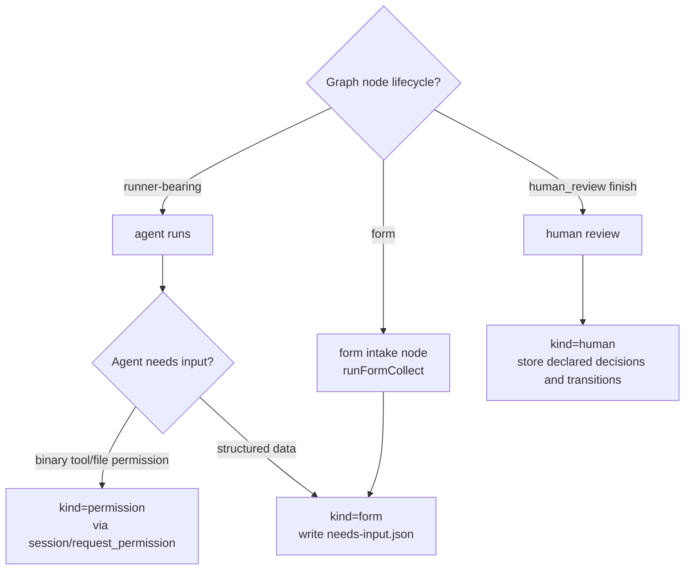

## State machine — HITL request

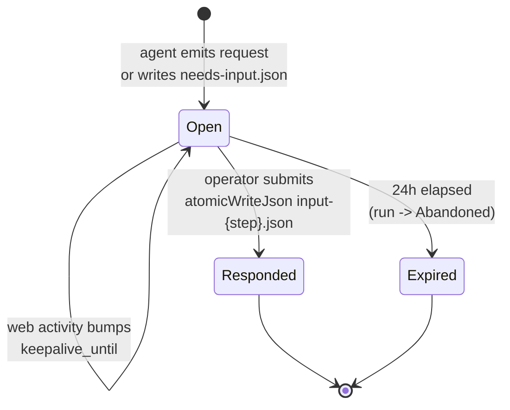

## Process flows

### Live path — permission request (Implemented)

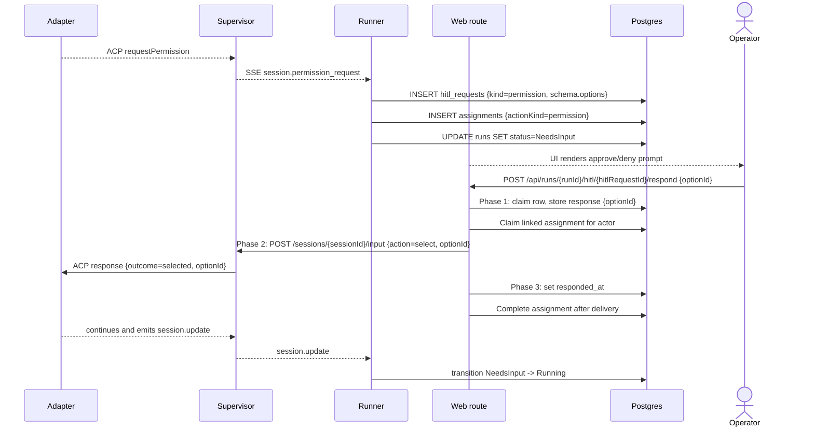

### Structured form response (Implemented, checkpoint resume Designed)

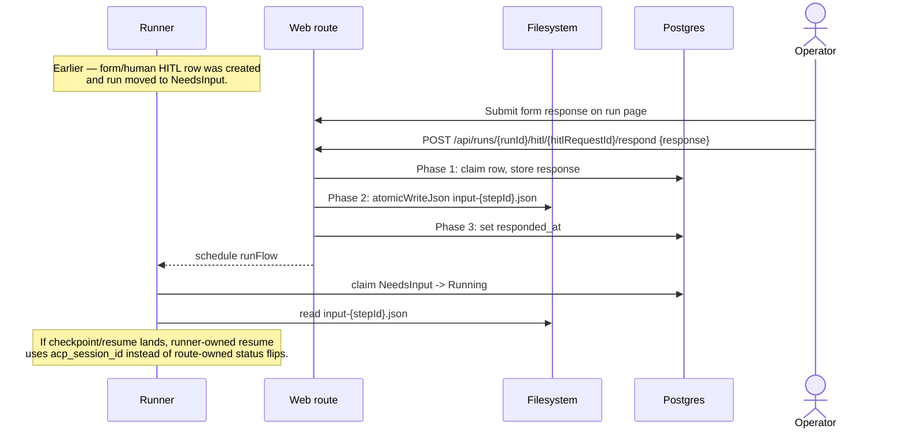

### Graph `form` (intake) node — UI + output vars (Implemented — T4)

A graph `form` node's collection is rendered by `HitlDecisionControls`
(`web/components/board/hitl-decision-controls.tsx`): each `form_schema` field
shows its `options[]` as buttons **and** a free-text input (pick or type),
falling back to a raw-JSON textarea when the schema declares no `fields[]`. The
server re-validates the submitted object against the stored `form_schema`
(`assertHitlResponse` → 422 `NEEDS_INPUT` on a missing required field) before
persisting `input-{stepId}.json`; on resume `runFormCollect` returns that object
as the node's output vars (`node_attempts.vars`), read downstream as
`{{ steps.<id>.vars.<field> }}`. Unlike a `human` review, a `form` node carries
no decision — it finishes on `transitions.success`.

### Human-review response with declared graph rework

On a rework response the route validates the decision and target against the
server-stored allow-list, persists the response, marks downstream evidence
stale, and atomically moves `currentStepId` to the declared target. The loop is
bounded by the graph node's `rework.maxLoops`.

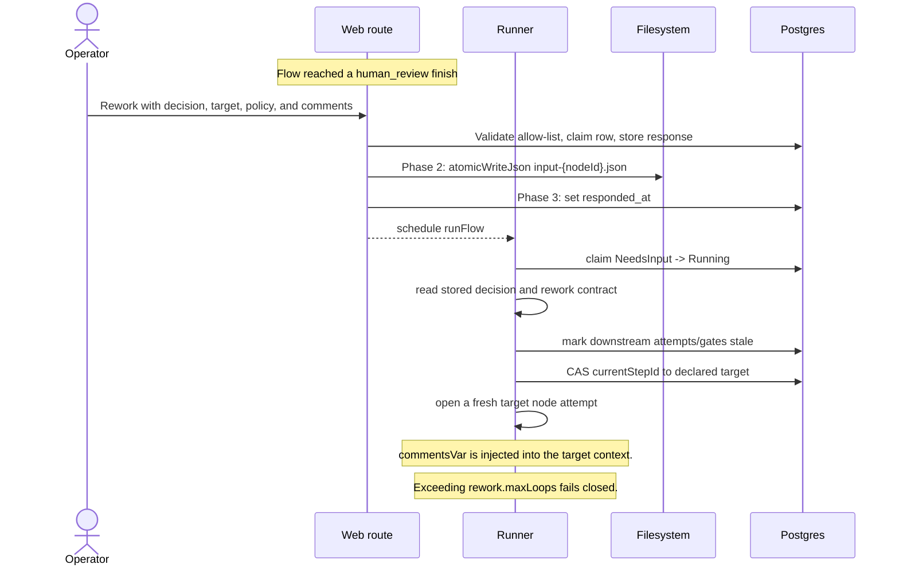

### `ai_rebase_merge` HITL surfacing (Implemented, ADR-141)

Delivery-policy promotion does not create a parallel HITL lane. When
`strategy="ai_rebase_merge"` hits a rebase conflict, the promote service records the
failed command, conflicted paths, and promotion attempt id, then opens the same
`merge_conflict` assignment shape used by the current merge-conflict UX. The
current implementation reuses the shared rebase-merge side-effect lane and the
standard assignment/inbox contract; a future autonomous resolver may add normal
permission/form/human HITL rows if it needs a richer interaction model.

The UI acceptance for this designed slice is:

- Run detail promote panel: shows the conflict/degraded state, failing command, paths,
  and the current assignment link; empty state remains the existing no-open-HITL state.
- Board card / inbox: shows the standard needs-you affordance for any resolver request,
  with EN/RU labels for conflict, permission, and form states.
- Error states: unresolved conflict, permission denial, aborted resolver, and restore
  failure surface as typed promotion statuses, never by message-string matching.
- E2E owner: `web/e2e/multi-run-cost-policy.spec.ts` covers the delivery-policy
  surfaces; promote service tests pin `ai_rebase_merge` conflict-to-assignment
  behavior.

Logging requirements: INFO on resolver start/finish with `runId`, `promotionAttemptId`,
and assignment id; WARN on unresolved conflict, denied permission, abort, or restore
failure with bounded command/path context; no prompts, env values, or raw cost payloads in
logs.

### Declared review decisions

A graph `human_review` node declares **decisions**: the manifest declares
`finish.human.decisions` (e.g.
`approve`, `rework`) and a `transitions` map, and the runner stores the allowed
sets (`allowedDecisions`, `transitions`, `reworkTargets`, `workspacePolicies`)
in `hitl_requests.schema` at creation. The reviewer's `decision` /
`comments` / `workspacePolicy` ride **inside** the `response` payload; the
respond route validates them against that server-state allow-list **before** any
mutation (undeclared → 422), persists the resolved values to the
`decision`/`workspace_policy`/`rework_target` columns, and the graph runner reads
them on resume to drive the rework loop. No body field names a filesystem path
and no raw `goto_step` is accepted from the client. See
[`flow-graph.md`](flow-graph.md) and
[`../api/web.openapi.yaml`](../api/web.openapi.yaml).

**(Implemented — ADR-118) `rework.resetTargets` is server-side — no HITL wire
change.** When a `human` node declares `rework.resetTargets`, a `rework` decision
re-baselines the listed loop nodes' attempt counters server-side (inside the same
transaction as the rework). It is NOT a reviewer-selectable field and is NOT added
to `hitl_requests.schema` or the respond payload — the reviewer still chooses only
`decision`/`comments`/`workspacePolicy` from the existing allow-list. See
[`flow-graph.md`](flow-graph.md).

**(Implemented — ADR-072) review-gate loop fields + line-anchored comments.** For
a review gate the stored `hitl_requests.schema` additionally carries the
server-state fields `{ maxLoops, gateAttempt }` (`gateAttempt` = the 1-based
visit number of the current gate, initial visit = 1; `maxLoops` from the
node's `rework.maxLoops`, `null` when no rework is declared). The respond
route's validation rejects a `rework` decision with 422 (`NEEDS_INPUT`) when
`gateAttempt > maxLoops` — total allowed gate visits = `maxLoops + 1`; the
engine's `CONFIG` re-entry throw stays as the backstop. Line-anchored review
comments are drafted incrementally through the separate
`/api/runs/{runId}/review-comments` route family BEFORE the decision — never
through the respond route, whose two-phase commit, idempotency CAS, and
pristine `response`/`input-<stepId>.json` payloads are UNTOUCHED. At rework
consumption the runner composes the open comment threads into the node's
`commentsVar` payload (zero open threads ⇒ byte-identical to the raw
`comments` summary). Domain detail:
[`review-comments.md`](review-comments.md).

### `takeover` decision → manual handoff (Implemented)

The `human_review` node's `takeover` decision is **not** an artifact-write HITL
response like `approve`/`rework`. It drives a **run-state transition**
(`NeedsInput → HumanWorking`) through a dedicated route pair —
`POST /api/runs/{runId}/takeover/claim` and `.../takeover/return` — not through
the `respond` route. The live `permission` / `form` / `human` (approve/rework)
paths above are **unchanged**. Domain detail lives in
[`manual-takeover.md`](manual-takeover.md);
[ADR-030](../decisions.md#adr-030-manual-takeover-as-a-local-worktree-handoff-humanworking-status)
is the locked decision.

The decision tree at a `human_review` finish:

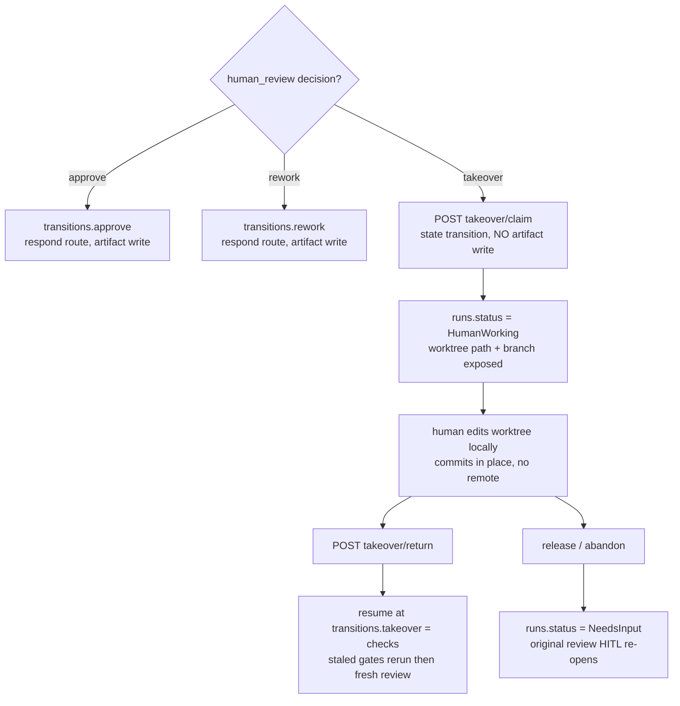

The **return** path is a **two-phase commit** (mirrors the form/idle two-phase
contract but against the worktree, not the supervisor): a Phase-1 claim intent,
a Phase-2 git/ledger side-effect, then a Phase-3 AFTER-side marker.

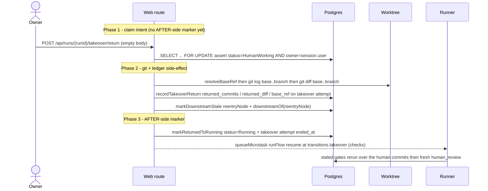

The `status='Running'` flip plus the takeover row's `ended_at` is the **AFTER-side
idempotency marker** — never set before the git/ledger side-effect completes. A
git-op failure in Phase 2 leaves the run `HumanWorking` with no ledger write and
no status flip (409 `CONFLICT`, retryable).

### Operator node interrupt — server-owned option matrix (ADR-161 — Implemented)

The `node_interrupt` card's options are derived on the server and delivered on
a dedicated `nodeInterrupt` field of the pending-HITL DTOs — the matrix plus the
`interruptedNodeId` it was raised at. It rides its own channel rather than
`budget_breach`'s `availableOptions` because it carries per-option
`enabled`/`disabledReason` and a ledger-derived `restartTargets` list that the
flat option list cannot express.

Every read model resolves it through ONE loader,
`loadNodeInterruptMatrices` (`lib/runs/node-interrupt.ts`), batched per run by
`resolveNodeInterruptMatrices` (`lib/queries/hitl-stage.ts`) for the inbox
surfaces:

| Read model | Surface | Resolves via |
| --- | --- | --- |
| `queries/run.ts` | run detail | `loadNodeInterruptMatrices` directly |
| `queries/hitl.ts` | per-project HITL inbox | `resolveNodeInterruptMatrices` |
| `queries/portfolio.ts` | cross-project inbox | `resolveNodeInterruptMatrices` |

Both reads (ledger + manifest) are paid only when an interrupt is actually
pending. The client renders what it is given and never re-derives availability;
a surface that did not receive a matrix degrades to the generic JSON responder
rather than guessing the option set.

| Option | Effect | Availability |
| --- | --- | --- |
| `resume` | `scheduleResume(runId)`; the runner owns `NeedsInput → Running` and the agent continues the **same** attempt via `session/resume`, keeping context | always |
| `restart_node` (**default**) | Close the parked attempt `Reworked` with `decision='operator_interrupt'`; `runGraph` appends a **fresh** attempt at the same node | always |
| `restart_from` | Same, targeting an earlier node, plus `markDownstreamStale` from the target | only when ≥1 other node has a prior attempt in this run |
| `stop` | Delegates to the existing `stopWorkbenchRun` terminal stop — no new stop semantics | always |

Three rules bind the matrix:

- **`restart_from` targets are ledger-derived, never topological.** The static
  graph has cycles, so "earlier" is not derivable from the manifest. The eligible
  set is exactly the nodes with at least one prior `node_attempts` row in THIS
  run; a target outside it is refused `PRECONDITION`. **Forward skips are out of
  scope** — skipping a node would bypass the artifacts it produces. Nodes that
  are also declared rework targets are flagged `recommended` for the UI, but that
  is presentation, not permission.
- **The correction is a prompt append, not a template variable.** The operator's
  free text is appended server-side as a fenced, labelled block — the same
  channel as the run-context pointer line — so it works on any node type, needs
  no `commentsVar` declaration, and can never throw a strict-mode
  unknown-variable `CONFIG` into the run. It is captured in
  `node_attempts.resolved_prompt` and applies to the restarted attempt only.
- **The restart mechanism is the `Reworked` close.** Because the closing row is
  `Reworked` rather than `NeedsInput`, `resumingThisNode` is false, so
  `reusesCurrentAttempt` is false and `runGraph` appends a fresh attempt. The
  workspace policy is applied against the target's `checkpoint_ref` **before**
  the ledger transaction (the ADR-079 rework ordering); a missing `checkpoint_ref`
  degrades to `keep` with a WARN and is never guessed.

Attempts closed with `decision='operator_interrupt'` are excluded from the flow's
`rework.maxLoops` budget and from both Observatory correction counters, and are
bounded per run by `MAISTER_MAX_OPERATOR_RESTARTS` (default `10`, `CONFLICT` on
breach). See [`run-continuation.md`](run-continuation.md) and
[`flow-graph.md`](flow-graph.md).

### Gate-chat at HITL pauses + workspace-neutrality (Implemented)

**(Implemented, [ADR-078](../decisions.md#adr-078-gate-chat-at-hitl-pauses-with-three-layer-workspace-neutrality).)**
At a `human`/`form` pause a reviewer can ask the parked agent an answer-only
question through **gate-chat**, persisted to `gate_chat_messages`. Chat NEVER
resolves the HITL and NEVER flips the run to `Running`.

**Availability (DD2)** — chat is enabled iff `runs.status ∈ {NeedsInput,
NeedsInputIdle}` AND the open HITL `kind ∈ {human, form}` AND the run's active
`run_sessions.acp_session_id ≠ null`. Excluded by construction: `permission`-kind (the
session is mid-prompt-turn — the in-flight `conn.prompt()` promise owns the
session), `HumanWorking` (manual takeover owns the worktree, no live agent
session), and the no-session case (explanatory empty state).

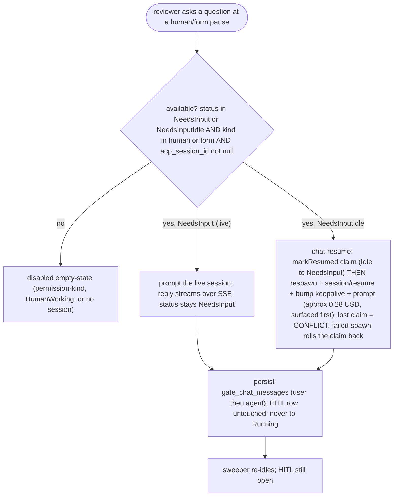

**Live vs idle (DD3).** `NeedsInput` (turn complete) → prompt the live session; the
reply streams over the SSE bridge as a `session.chat_turn` event; status stays
`NeedsInput`. `NeedsInputIdle` → **chat-resume**: `markResumed` claim
(Idle→NeedsInput) BEFORE the respawn with ACP `session/resume` on the active
`run_sessions.acp_session_id`, then keepalive bump + prompt, then the sweeper re-idles —
the same claim-before-spawn order as `resumeRun`, so a concurrent `/respond`
resume or second chat turn loses the CAS with `CONFLICT` and never spawns a
duplicate session; a failed spawn rolls the claim back to `NeedsInputIdle`.
Chat-resume MUST NOT call the resumed-session driver and
MUST NOT touch the `hitl_requests` row. **Allow-list invariant (tested):** chat may
drive `Idle→NeedsInput`; it NEVER drives `→Running` and NEVER writes
`hitl_requests.responded_at`. The chat prompt is tagged with the server-derived
marker `stepId = "gate-chat-<hitlRequestId>"` (dash, not colon — the supervisor
`SAFE_PATH_SEGMENT` rejects a colon and the marker names the per-step log file).
Chat input is NEVER Mustache-evaluated.

**Workspace-neutrality (DD11) — three layers; L3 is the only hard guarantee**
(consistent with the ADR-041 instructed-only model and the ADR-074 detect-after
sensor):

- **L1 Instruct.** Every chat prompt is prefixed server-side with a "read-only Q&A,
  do not modify the workspace" preamble (not user text).
- **L2 Permission auto-deny (best-effort).** A `readOnlyTurn` flag on the prompt +
  session record makes the supervisor `requestPermission` callback auto-reject
  unambiguous mutating `toolCall.kind` (`edit | write/create | delete | move`)
  BEFORE any SSE emit or pending-permission registration — so no
  `session.permission_request` fires and no `hitl_requests` row is created.
  `read`/`fetch` pass; `execute` (bash) passes and relies on L3. L2 is a **no-op**
  under `--dangerously-skip-permissions` / `permissionMode:allow` — hence L3.
- **L3 Mutation sensor (hard guarantee).** ONE known-good baseline is captured at
  the FIRST chat turn (`refs/maister/chat-checkpoints/<runId>/<hitlRequestId>`,
  bounded at 1, via the ADR-079 machinery) and EVERY subsequent turn is verified
  against it (`statusPorcelain` + `git diff`). On a delta the workspace is restored
  to the baseline (overlay + targeted deletion of only the rogue untracked paths
  absent from the baseline tree — never a blanket `git clean`, never touching
  `.maister/`), `gate_chat_messages.mutation_reverted` is set `true`, an
  Observatory-ready audit signal is emitted, and a UI notice rides the turn. L3 runs
  **unconditionally** and **fail-closed** (a sensor that cannot sense must not pass);
  it covers permissive runners where L2 is a no-op. The ref is GC'd when the HITL
  resolves; a mid-pause dirty-resolution (ADR-082) deletes it so the next turn
  re-anchors (no false un-discard).

**Feature-3 interplay.** When a later rework resumes the SAME session
([ADR-081](../decisions.md#adr-081-rework-session-policy-with-resume-by-default)
`session_policy: resume`), the rework prompt MUST explicitly lift the chat-time
read-only restriction, else the agent may refuse legitimate edits. Rework compose
([ADR-072](../decisions.md#adr-072-pr-grade-review-comments--review_comments-table-snapshot-anchoring-runner-side-rework-compose-open-gate-guard))
folds the chat history into `commentsVar`.

### Review-diff completeness — dirty-state protocol + scope switcher (Implemented)

**(Implemented, [ADR-082](../decisions.md#adr-082-review-diff-completeness-with-dirty-state-protocol-and-scope-switcher).)**
When a review gate opens, the runner computes `dirtySummary` via `statusPorcelain`
(incl. untracked) — **no auto-commit**. A dirty worktree does NOT block the gate;
the summary rides on the gate/HITL payload so the reviewer sees uncommitted work
instead of silently missing it.

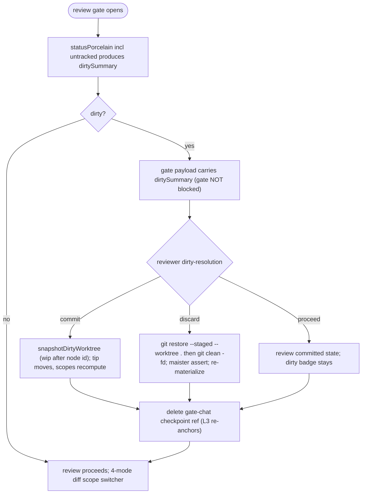

The reviewer's choice is recorded write-once on `hitl_requests.dirty_resolution`
(X-2PC: the intent is claimed via a guarded CAS before the git side-effect, so a
concurrent second resolution gets `CONFLICT` without running git; a git failure
rolls the claim back, returns 409, and leaves the gate open, unrecorded). **Discard is hard-guarded**:
`git clean -fd` (never `-fdx`), scoped `-C <worktree>`, with a `.maister/`
containment assertion, and re-runs launch materialization afterward
([ADR-079](../decisions.md#adr-079-node-workspacepolicy-execution-and-checkpoint-capture))
— `.maister/` is never touched. Every executed choice deletes the gate-chat
checkpoint ref (`refs/maister/chat-checkpoints/<runId>/<hitlRequestId>`) so the
ADR-078 L3 sensor re-anchors and never "reverts" an explicit Discard.

**4-mode diff scope switcher** — `scope` on `GET /api/runs/{runId}/diff`, all
sharing the
[ADR-066](../decisions.md#adr-066-editor-and-diff-rendering-stack-shiki-git-diff-view-codemirror)
`prepareDiff` pipeline + byte-cap guard:

| scope               | base → head                                     | base source                                                          |
| ------------------- | ----------------------------------------------- | -------------------------------------------------------------------- |
| `run` (default)     | `workspace.baseCommit..branch`                  | current behavior                                                     |
| `since-last-review` | `<prev-review-visit-sha>..branch`               | `hitl_requests.review_tip_sha` (stamped per review visit)            |
| `last-node`         | `<pre-attempt-checkpoint-sha>..branch`          | ADR-079 checkpoint ref of the latest completed agent node            |
| `uncommitted`       | `HEAD` vs working tree + untracked as additions | temp `GIT_INDEX_FILE` intent-to-add; the real index is never mutated |

A scope whose base ref is missing (pre-feature run, first review visit) is
hidden/disabled with a reason, never an error. Consumer-project review gates list
launch-materialized capability bundles in `dirtySummary` — known v1 noise
(ADR-079); the dogfood project is unaffected (its skills/agents are repo-local).

### Cross-project Inbox block and numeric badge (Implemented — ADR-057)

The portfolio home (`app/(app)/page.tsx`) renders a full cross-project
Inbox block listing every pending `HitlItem` across all projects visible
to the actor. The block absorbs the per-project `NeedsYouStrip`; the
compact numeric "Needs you (N)" badge on each `ProjectCard` and on the
portfolio header survives. The inline response component renders directly
inside the block so the operator can respond without navigating to the
run page. Access is RBAC-scoped: members see only their own projects;
admins see all.

**(WI-1 — Implemented)** A dedicated cross-project `/inbox` page is the primary
working surface: it reuses the same `getCrossProjectHitlInbox` query and renders
the project-grouped `HitlInboxList` of unified `HitlCard`s (respond controls
reuse `components/board/run-hitl-response.tsx`) above the social inbox, while the
portfolio home collapses both blocks into one compact "Needs you (N)" summary
card that links to `/inbox`. The card's three disclosure tiers and lazy
`inbox-context` load are detailed in the _Inbox card redesign_ section below. The
numeric badge follows the canonical `needsYou` formula owned by
[`social-board.md`](social-board.md).

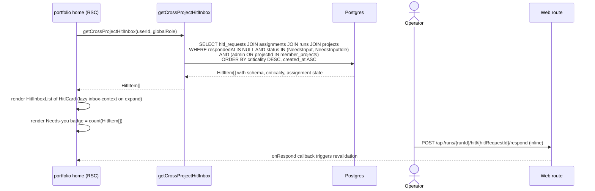

### Inbox card redesign — 3-tier disclosure + lazy context (Implemented)

The cross-project `/inbox` and the per-project board render one unified
`HitlCard` with three disclosure tiers: **collapsed** (scan), **expanded**
(decide), and the **run page** (deep dive). The list query stays cheap; the
expensive context loads lazily only when a card is expanded.

- **Eager (the list query).** `getHitlInbox` (board) and
  `getCrossProjectHitlInbox` (portfolio) each add `tasks.title` and a
  `stage {label, type}` to every `HitlItem`. `label` is the originating
  `hitl_requests.step_id`; `type` is the node kind resolved from the run's
  compiled flow graph. To avoid an N+1 the resolver loads each distinct flow
  revision's manifest ONCE (`resolveManifest` + `compileManifest`) and maps every
  item's `step_id → nodeType`. An unresolved `step_id` logs a WARN and degrades to the
  raw label — the inbox always renders.
- **Lazy (`GET /api/runs/{runId}/inbox-context`).** On expand the browser fetches
  a read-only, project-scoped (`readBoard`) DTO
  `{ lastAgentMessage, gates[], diff, progress }`: `gates` + `progress` from
  `getRunNodeStatuses` (the current node attempt's gates + a done/total count);
  `lastAgentMessage` from the trailing coalesced `agent_message_chunk` in the
  run's `run.events.jsonl`; `diff` from `prepareDiffSummary` over the run's raw
  git diff. Any field that cannot be read degrades to `null` (the card stays
  answerable); the route never 500s for a missing peek.

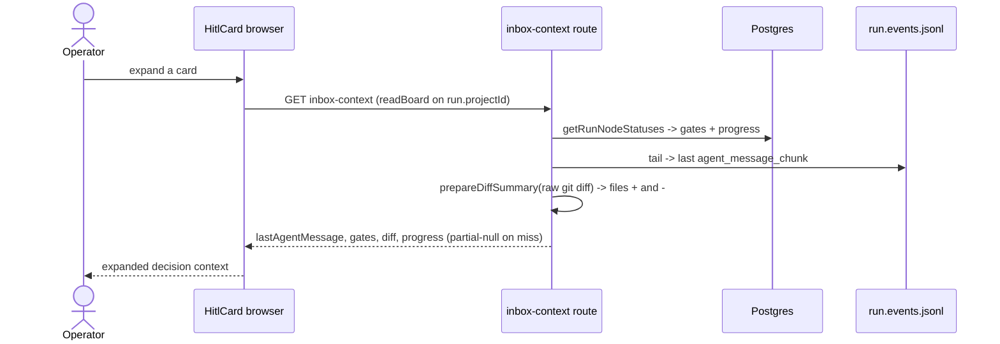

### HITL-over-MCP — hitl_list, hitl_inbox, and hitl_respond

Status: `hitl_list` / `hitl_respond` for permission/form HITL are Implemented
(ADR-055). `hitl_inbox` and global personal-token human response are Implemented
by migration `0076_user_access_tokens.sql`.

External token-scoped agents query and answer pending HITL via MCP tools
(`hitl_list`, `hitl_inbox`, `hitl_respond`) backed by external REST
routes. These routes enforce scope (D8) and actor-kind (D7) gates and
emit audit rows via `handleExt`. A token/agent actor may answer
`permission` and `form` HITL only; `human`-kind requests require a human
actor. Cross-project isolation is enforced by existence-hiding: a
`runId` that belongs to a different project returns 404, not 403.

Global personal tokens extend this model. `hitl_inbox` lists pending HITL across
the token owner's currently visible projects through `GET /api/v1/ext/hitl`.
Human, infra-recovery, and budget-breach HITL responses are accepted only from a
global personal user token whose owner is live, can `answerHitl` on the run
project, and holds the exact `hitl:respond:human` scope. The `*` wildcard does
not satisfy that human-response scope.

The assistant pulse's `needsYou` block is a separate, project-scoped read model
built from these same HITL and clarification rows. It is documented in
[assistant-activity.md](assistant-activity.md) and is NOT an alias of the
global personal-token inbox route `GET /api/v1/ext/hitl`.

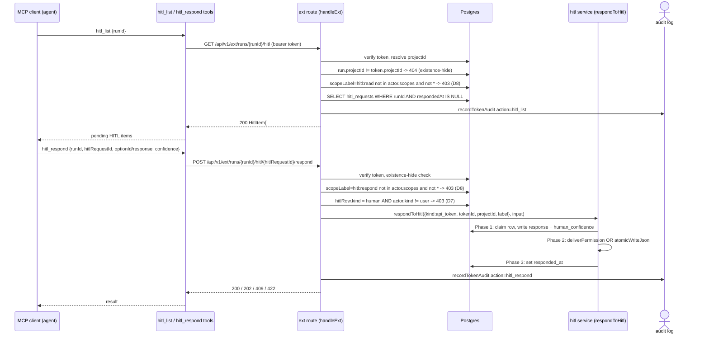

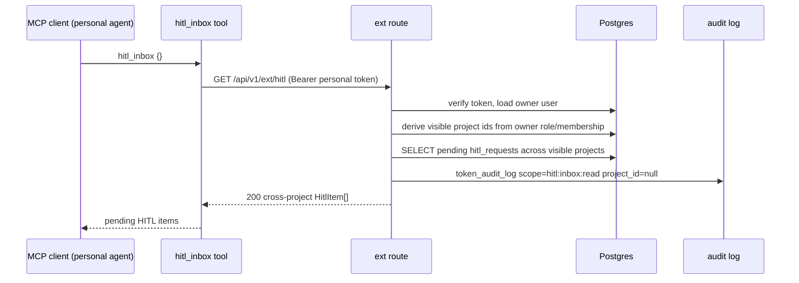

## Keep-alive activity tracking

The flow below describes the implemented checkpoint/resume path:
activity pings extend `runs.keepalive_until`, the sweeper checkpoints
idle `NeedsInput` runs, and a later HITL response resumes the ACP session
via the `session/resume` call on `acp_session_id` (not a CLI flag).

While a run is in `NeedsInput`, the run-detail page is responsible for
keeping the worker alive:

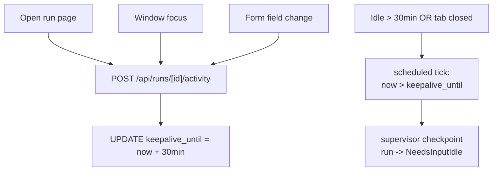

## Form schema versioning

Every form payload includes a required `schemaVersion: integer`.
`validateFormSchemaVersion(payload, expected)` throws
`MaisterError("CONFIG")` on mismatch with both versions named.

```yaml
schemaVersion: 1
fields:
  - name: comment
    label: Reviewer comment
    type: string
    required: true
  - name: severity
    type: enum
    options: [low, medium, high]
  - name: confirm
    type: boolean
    default: false
```

## Expectations

- HITL kind is exactly `permission | form | human | infra_recovery |
budget_breach | hook_trip | node_interrupt` (on `hitl_requests.kind`); the three
  core kinds map to wire per the three-kinds table verbatim, and the four
  engine- or operator-opened kinds (`infra_recovery`, `budget_breach` — ADR-101;
  `hook_trip` — ADR-108; `node_interrupt` — ADR-161) park
  `NeedsInput` with the worktree kept and are Human-actor-only (a token actor
  NEVER answers them).
- **(ADR-161 — Implemented)** A `node_interrupt` request MUST idle to
  `NeedsInputIdle` and be abandoned at 24 h exactly like `hook_trip`, MUST NEVER
  be classified `Crashed` by the recovery sweep, and its `availableOptions` MUST
  be derived server-side — the client NEVER re-derives which options are
  available, and `restart_from` targets come from the ledger, never the graph.
- Every HITL request is persisted as a `hitl_requests` row before the
  run transitions to `NeedsInput`; UI never derives HITL state from
  supervisor in-memory state.
- Every new permission/form/human wait creates an open assignment (ADR-040); legacy
  HITL rows without assignments remain readable as compatibility data, but new
  inbox ownership/counts prefer assignments.
- **(Implemented, ADR-082)** A dirty worktree at a review gate NEVER blocks the
  gate; `dirtySummary` (from `statusPorcelain`, incl. untracked) rides on the gate
  payload and the reviewer's `commit | discard | proceed` choice is recorded on
  `hitl_requests.dirty_resolution` + audit in one transaction.
- **(Implemented, ADR-082)** Discard runs `git clean -fd` (never `-fdx`) scoped
  `-C <worktree>` with a `.maister/`-containment assert and re-materialization; it
  MUST NOT touch `.maister/`. Every executed dirty-resolution deletes the gate-chat
  checkpoint ref so the ADR-078 L3 sensor re-anchors.
- **(Implemented, ADR-082)** `GET /api/runs/{runId}/diff?scope=` accepts exactly
  `run | since-last-review | last-node | uncommitted` (allow-list); a missing-base
  scope is hidden/disabled with a reason, never an error; `uncommitted` renders via
  a temp `GIT_INDEX_FILE` and MUST NOT mutate the real index.
- **(Implemented, ADR-082)** `hitl_requests.review_tip_sha` is stamped with the
  branch tip (`headCommit`) at each review-gate visit; it is the base for the
  `since-last-review` scope.
- **(Implemented, ADR-078)** Gate-chat is available iff `runs.status ∈
{NeedsInput, NeedsInputIdle}` AND the open HITL `kind ∈ {human, form}` AND the
  run's active `run_sessions.acp_session_id ≠ null`; `permission`-kind and
  `HumanWorking` are excluded.
- **(Implemented, ADR-078)** A gate-chat turn NEVER resolves the HITL, NEVER
  writes `hitl_requests.responded_at`, and NEVER drives the run `→Running`; on
  `NeedsInputIdle` it may drive `Idle→NeedsInput` (chat-resume) and then re-idle.
- **(Implemented, ADR-078)** The L3 mutation sensor captures ONE baseline at the
  first chat turn, runs unconditionally + fail-closed on every turn, reverts any
  detected mutation to that baseline, sets `gate_chat_messages.mutation_reverted =
true`, and emits an audit signal — even under permissive runners where L2 is a
  no-op; the baseline ref is GC'd on HITL resolve and deleted by any dirty-resolution.
- **(Implemented, ADR-078)** Chat input is NEVER Mustache-evaluated; the L1
  preamble is server-side; the chat-prompt `stepId` marker uses a dash
  (`gate-chat-<hitlRequestId>`), never a colon.
- **(Implemented)** A run in `NeedsInput` extends `keepalive_until` by
  `MAISTER_KEEPALIVE_MINUTES` (default 30) on operator activity through
  `POST /api/runs/[id]/activity`.
- **(Implemented)** Idle past `keepalive_until` triggers checkpoint →
  run becomes `NeedsInputIdle` with `acp_session_id` retained. Supervisor
  `POST /sessions/:id/checkpoint` cancels pending permission deferreds
  with reason `checkpoint`, terminates the live adapter session, and lets
  the runner observe `session.exited.reason = "checkpoint"`.
- **(Implemented)** 24 h elapsed in `NeedsInputIdle` without response →
  run `Abandoned`, task → `Backlog`. This sweeper transition does not
  raise `HITL_TIMEOUT`.
- Every form payload includes `schemaVersion: integer`; mismatch with
  the Flow's declared version raises `CONFIG` with both versions
  named.
- Form-schema field types are exactly `string | number |
boolean | enum | array`; unknown type refused with `CONFIG` at Flow
  load.
- **(Implemented)** Operator responses go through
  `POST /api/runs/[runId]/hitl/[hitlRequestId]/respond`. Permission
  responses are routed through the supervisor's
  `POST /sessions/:id/input` (permission-only, discriminated `action:
"select" | "cancel"`). Form / `human` responses are written via
  `atomicWriteJson` (tmp + rename) to
  `.maister/<slug>/runs/<runId>/input-<stepId>.json` by the web tier
  AFTER the row-level CAS claim succeeds — concurrent double-submits
  with conflicting payloads return 409 before any artifact is
  touched, and same-payload retries are idempotent. The supervisor
  never writes input artifacts.
- `human_review` responses use the same two-phase commit + artifact-write
  contract as `form` (stored as `hitl_requests.kind = "human"`). The response
  carries a declared decision, comments, and optional workspace policy; the
  runner follows only the server-stored transition allow-list.
- **(Implemented)** A conflicting re-submit on an already-claimed
  `hitl_requests` row (different payload, `respondedAt IS NULL`) MUST
  return 409 before any artifact or supervisor side-effect runs.
  A same-payload retry on a delivered row (`respondedAt IS NOT NULL`)
  MUST be idempotent (200 + re-queue resume). The respond route MUST
  reject any `runs.status` outside `PENDING_FORM_RUN_STATUS =
{NeedsInput, NeedsInputIdle}` with 422.
- **(Implemented — ADR-125)** `budget_breach` uses the same row-lock discipline
  but with a four-option decision claim gate. Incoming payloads are canonicalized
  before comparison: legacy `{optionId:"raise", raiseTo:N}` and new
  `{optionId:"raise", response:{dimension?, newLimit:N}}` compare as the same
  raise decision, and bare `{optionId:"abandon"}` remains valid. Already
  delivered rows compare stored option+payload: same → idempotent; different →
  `CONFLICT`. Restart claims write `response.stage="claimed"` with
  `respondedAt IS NULL`; park claims write `response.stage="preserving"`
  because preservation is its first resumable phase. Same-payload retries
  re-drive the recorded stage.
  `stage:"failed"` is pre-boundary and can be overwritten by any new option.
  `stage:"relaunch_failed"` is final because the old run is already terminal.
  Unavailable options fail with `PRECONDITION` before claim.
- **(Implemented — ADR-125)** The budget option matrix is server-owned and
  exposed on pending HITL DTOs as `availableOptions`; the UI MUST render that
  array instead of reimplementing predicates. Active non-failed claimed rows
  expose `claimStage` and are excluded from needs-you counts until completion or
  `stage:"failed"`. The progress DTO is read-only and field-degraded:
  missing diff/worktree → `diff:null`, missing cost rollup →
  `source:"no-data"` instead of fake zero, missing gate/ledger data →
  `unknown`/zero counts.
- **(Implemented)** `hitl_requests.criticality` MUST be written
  once at creation from the flow-author-declared `human` node/step
  `criticality` field (`low | medium | high | critical`) and MUST NOT
  be updated after insertion.
- **(Implemented)** `hitl_requests.human_confidence` MUST be a
  real in `[0,1]`; values outside that range MUST be rejected
  server-side with 422. `human_confidence` and `criticality` ANNOTATE
  a human decision; they MUST NOT re-gate readiness. The escalate-to-
  human decision stays the Flow's `human_review` gate, never the
  external actor's.
- **(Implemented)** A token or internal-agent actor MUST NOT
  satisfy a `hitl_requests.kind = "human"` request;
  `respondToHitl` MUST return 403 (`UNAUTHORIZED`) for any
  `actor.kind !== "user"` when `hitlRow.kind = "human"` (D7).
  Token actors are limited to answering `permission` and `form` HITL. A global
  personal token with exact `hitl:respond:human` is the Implemented exception: the
  external route converts it to `HitlActor.kind="user"` before calling
  `respondToHitl`.
- **(Implemented)** Both HITL ext routes (`GET …/hitl` scope
  `hitl:read`, `POST …/hitl/{id}/respond` scope `hitl:respond`) MUST
  enforce `handleExt({requireScope:true})`: the route's `scopeLabel`
  MUST be in `actor.scopes` or equal `"*"`; absent scope MUST return 403. A token actor MUST NOT create or skip a gate; gate placement
  stays the Flow's.
- **(Implemented)** `GET /api/v1/ext/hitl` MUST require a global personal user
  token and `hitl:inbox:read`, derive visible projects from the owner user, and
  write a `token_audit_log` row with `project_id IS NULL`.
- **(Implemented)** Human HITL through REST
  can be answered by a global personal user token with exact
  `hitl:respond:human`. Infra-recovery and budget-breach remain
  session-auth-only in ADR-125; external/MCP token actors still answer only
  `permission` and `form` unless a later ADR opens those kinds explicitly.
  For `human`, MCP/REST MUST require exact `hitl:respond:human`; `*` alone
  MUST return 403.
- **(Implemented — ADR-072)** A graph review gate's stored schema MUST carry
  server-state `{ maxLoops, gateAttempt }`; the respond route MUST reject a
  `rework` decision with 422 (`NEEDS_INPUT`) when `gateAttempt > maxLoops`
  (total gate visits = `maxLoops + 1`) BEFORE any artifact write or state
  mutation — the engine `CONFIG` throw remains the backstop only (it fires
  on a fresh-visit append, never on a resume-reuse re-entry). The
  rejection applies only when the stored schema carries both fields: a
  no-rework node stamps `maxLoops` null and legacy pre-ADR-072 rows lack
  the fields entirely, so the rule is vacuous there.
- **(Implemented)** `hitl_requests.response` and `.responded_at`
  use two-phase commit semantics:
  - **Phase 1 (atomic claim).** `response` is stored under a row-level
    `SELECT ... FOR UPDATE` only if the row is unclaimed, or claimed
    with the same payload (idempotent retry). Different payload on
    retry → 409.
  - **Phase 2 (durable side-effect).** For permission, the supervisor
    deferred is resolved; for form/human, `input-<stepId>.json` is
    written from the STORED response.
  - **Phase 3 (delivered marker).** `responded_at` is set ONLY after
    the side-effect succeeds. The route does NOT flip `runs.status`
    back to `Running` — the runner owns that transition on resume so
    its `isResume` gate can match.
  - Retry classification: supervisor 410 → `HITL_TIMEOUT` terminal
    (run → `Failed`); supervisor 503 / network → `EXECUTOR_UNAVAILABLE`
    retryable (row stays claimed, `responded_at` NULL); artifact
    write I/O failure → 503 retryable.
  - Same-payload retry on an already-delivered row re-queues
    `runFlow` so a process crash between Phase 3 commit and the
    original microtask cannot strand the run in `NeedsInput`.
- **(Designed)** HITL request lost during supervisor shutdown is
  recoverable via the standard `acp_session_id` resume on next launch —
  no separate reconciliation needed. Depends on checkpoint/resume
  landing the `session/resume` re-spawn path.
- **(Implemented — checkpoint/resume Codex review fix #1)** When the supervisor
  cancels a pending permission as part of a checkpoint flow (sweeper or
  `POST /sessions/:id/checkpoint`), the adapter resolves the deferred
  with `{outcome: "cancelled"}` and returns `stopReason: "end_turn"`
  from `prompt()` — the cancelled permission is journaled for replay
  on the next `session/resume`. The web runner-agent MUST observe
  `session.exited.reason="checkpoint"` on the SSE stream and suppress
  step success: it calls `markCheckpointedFromExit(runId)`
  (`NeedsInput → NeedsInputIdle`, same SQL as the sweeper's
  `markCheckpointed` with a distinct trigger marker in logs) and
  returns `errorCode: "STEP_CHECKPOINTED"` from the step. `runFlow`
  treats `STEP_CHECKPOINTED` as a pause (not a failure): mark the
  step_run NeedsInput, skip terminal write, `promoteNextPending` (slot
  is free, `NeedsInputIdle` does not count). Without this contract a
  checkpoint mid-permission would race the sweeper's idle transition
  and the step could be marked succeeded with an un-replayed
  permission.
- **(Implemented — checkpoint/resume Codex review fix #2)** Claimed-but-undelivered
  HITL intents (`hitl_requests.response IS NOT NULL AND respondedAt
IS NULL` joined to `runs.status='NeedsInput'`) are recovered on web
  boot via `web/lib/runs/resume-recovery.ts:runResumeRecoverySweep`.
  The sweep runs in `web/instrumentation.ts` BEFORE the keep-alive
  sweeper and either re-schedules `scheduleResumedSessionDrive`
  against a live supervisor session OR atomically rolls the run back
  to `NeedsInputIdle` (status-guarded; intent preserved). Supervisor
  5xx during recovery → skip-this-boot, the keep-alive sweeper's
  24 h TTL is the long-term safety net. Always-on, no flag.
- **(Implemented — checkpoint/resume Codex review fix #3)** Every resume-driver
  terminal transition (`completeResumedStepAndHandoff` last-step
  `Review`, `failResumedRun`, `crashResumedRun`) calls
  `promoteNextPending` after a successful status-guarded write —
  mirrors `runFlow`'s normal-path pattern at
  `web/lib/flows/runner.ts:586`. Failed status-guard (race lost) is
  detected via `{ok: false}` and skipped, so no double-promotion.
- **(WI-1 — Implemented)** The respondable cross-project HITL set surfaces on the
  dedicated `/inbox` page (inline respond preserved) in addition to the compact
  home summary; the "Needs you (N)" count is the canonical `needsYou` owned by
  [`social-board.md`](social-board.md) (`pendingHitlCount` = the
  `getCrossProjectHitlInbox(userId, role)` count), with RBAC scoping preserved.
- **(Implemented)** Every `HitlItem` MUST carry `taskTitle` and `stage {label,
type}`; the stage `type` MUST be resolved by compiling each distinct flow
  revision's manifest at most ONCE per list query (never per item), and an
  unresolved `step_id` MUST degrade to the raw label rather than throw.
- **(Implemented)** `GET /api/runs/{runId}/inbox-context` MUST be read-only, gated by
  `readBoard` on the run's project (foreign run → 403, missing → 404), return an
  explicit DTO `{ lastAgentMessage, gates[], diff, progress }` carrying no DB rows
  or server-only handles, and degrade any unreadable field to `null` (never 500
  for a missing peek).

## Edge cases

- **24h elapsed in `NeedsInputIdle`** → run `Abandoned`, task →
  `Backlog`. This is a sweeper state transition, not `HITL_TIMEOUT`.
- **Form payload `schemaVersion` mismatch** → `CONFIG`. Worker stays
  in `NeedsInput`; operator sees a validation error in the form.
- **Unsupported field type in `form_schema`** → `CONFIG` at Flow load
  time (`web/lib/config.ts`).
- **Operator submits twice in quick succession** — the response
  route's row-level CAS (`SELECT ... FOR UPDATE` + conditional
  UPDATE) ensures only one submission claims the deferred. A
  same-payload retry is idempotent (200 + re-queue resume); a
  different-payload retry is rejected with 409 BEFORE any artifact
  or supervisor side-effect runs.
- **(Implemented, ADR-082) Discard path escapes the worktree** → the
  `.maister/`-containment assert hard-fails the discard with a mapped 409
  (`CONFLICT`/`PRECONDITION`); the gate stays open and no `dirty_resolution` is
  recorded.
- **(Implemented, ADR-082) Diff scope base ref missing** (pre-feature run,
  first review visit, no completed agent node yet) → that scope is hidden/disabled
  with a reason; the default `run` scope always resolves. Never an error.
- **(Implemented, ADR-078) Gate-chat on a `permission`-kind pause or
  `HumanWorking` run** → unavailable; the UI shows a disabled empty-state, not a chat
  box (the session is mid-prompt-turn or human-owned).
- **(Implemented, ADR-078) Idle gate-chat respawn fails** → the chat prompt's
  deferred is released, the turn errors without resolving the HITL, and the run stays
  `NeedsInputIdle` (never a partial `→Running`).
- **(Implemented, ADR-078) Agent mutates the workspace during a chat turn** → L3
  reverts to the first-turn baseline, marks `mutation_reverted=true`, and emits an
  audit signal; the turn's answer still renders with a revert notice.
- **Supervisor restart while the user response is in-flight** —
  supervisor returns 503 `EXECUTOR_UNAVAILABLE` for the
  "unknown session" case (distinct from 410 `HITL_TIMEOUT` for
  expired deferred). The web tier treats 503 as retryable: the
  `responded_at` marker stays NULL, the response column holds the
  user's intent, and a retry replays through the normal flow.
- **Agent reads a malformed `input-<stepId>.json`** — adapter exits
  non-zero → `Crashed`. Operator decides whether to Recover or
  Discard.
- **Graph human review requests rework** — the decision is validated and stored,
  downstream evidence is marked stale, and the runner atomically reparks to the
  declared target with `commentsVar` injected. Exceeding `maxLoops` fails closed.
- **`session/request_permission` arrives while the supervisor is
  shutting down** — request lost; agent will retry on next launch
  through the standard `acp_session_id` resume.
- **Project, agent, or project-scoped user token calls ext HITL respond on a
  `human`-kind request** — `respondToHitl` returns
  `MaisterError("UNAUTHORIZED")` → HTTP 403 (D7). Response body MUST NOT reveal
  which HITL kind triggered the refusal. (Implemented)
- **Global personal token calls human HITL respond without exact
  `hitl:respond:human`** → HTTP 403 even when the token has `*`. Failure audit
  written with the run's server-derived `project_id`. (Implemented)
- **Token missing `hitl:read` or `hitl:respond` scope** →
  `handleExt({requireScope:true})` returns 403. Response MUST NOT
  leak which scopes the token holds (D8). (Implemented)
- **Project or agent token calls `GET /api/v1/ext/hitl`** → HTTP 403; the
  cross-project inbox is personal-token-only. (Implemented)
- **Global personal token owner loses project access before response** → HTTP
  403 or existence-hidden 404 per route family; no HITL row is claimed and the
  audit row records the server-derived target project. (Implemented)
- **Ext HITL route called with a `runId` from a different project** →
  existence-hide: 404, not 403. (Implemented)
- **`human_confidence` body value outside `[0,1]`** → server-side Zod
  validation fails → 422 (`NEEDS_INPUT`). (Implemented)
- **Graph review `rework` decision at an exhausted loop**
  (`schema.gateAttempt > schema.maxLoops`) → 422 (`NEEDS_INPUT`) at validate
  time — no artifact write, no state mutation; the reviewer can still
  approve. Without this rule a final-loop rework would die at the engine's
  fresh-append check when traversal returns to append visit `maxLoops + 2`
  and `CONFIG`-fail the whole run (that throw remains the backstop; it
  never fires on the resume re-entry processing a decision at the final
  allowed visit). (Implemented — ADR-072)

## Live vs idle HITL response paths

The `POST /api/runs/:runId/hitl/:hitlRequestId/respond` route branches
on the locked `runs.status` read inside the atomic-claim transaction:

```
                 lockedRun.status?
                       │
        ┌──────────────┴──────────────┐
        │                             │
   NeedsInput                  NeedsInputIdle
        │                             │
        ▼                             ▼
  Phase 2: deliverPermission     Phase 2: resumeRun
   (sync supervisor RPC)         (spawn fresh session)
        │                             │
        ▼                             ▼
   200 ok                         202 resume-in-progress
                                       │
                                       ▼
                             Phase 3 (async — runner-agent):
                             on next session.permission_request
                             from the resumed session, look up the
                             stored hitl_requests row and auto-deliver
                             the operator's intent against the NEW
                             requestId, then mark respondedAt with
                             audit { originalRequestId, reissuedRequestId,
                             deliveredViaResume: true }.
```

### Two-phase commit on the idle branch

| Phase | Layer                                   | DB write                                                                                                                                        | Side-effect                                                       |
| ----- | --------------------------------------- | ----------------------------------------------------------------------------------------------------------------------------------------------- | ----------------------------------------------------------------- |
| 1     | web route                               | atomic-claim: `UPDATE hitl_requests SET response=:intent WHERE id=:id AND respondedAt IS NULL` (FOR UPDATE)                                  | none                                                              |
| 2     | web route → `resumeRun(runId)`          | inside `markResumed`: `UPDATE runs SET status='NeedsInput', keepalive_until=now+N, checkpoint_at=null WHERE id=:id AND status='NeedsInputIdle'` | `POST /sessions` to supervisor with `resumeSessionId`             |
| 3     | runner-agent permission_request handler | `UPDATE hitl_requests SET respondedAt=now(), response=<merged>`                                                                                 | `POST /sessions/:id/input` to supervisor with the new `requestId` |

The route NEVER awaits Phase 3 — it returns 202 immediately after
Phase 2's 201 from the supervisor. Phase 3 happens asynchronously
within the runner-agent's event loop over the next 5-60 s.

### Idempotency guards (idle branch)

- Retry with same payload while `respondedAt IS NULL` AND
  `runs.status='NeedsInput'` (resume already in progress; runner-agent
  hasn't auto-delivered yet): 202 `{state:"resume-in-progress"}`.
- Retry with same payload after successful auto-deliver
  (respondedAt set): 200 idempotent.
- Retry after terminal `Failed` (Phase 2 failed terminally):
  410 `{terminal:true}`.
- Retry with different payload: 409 (the atomic-claim CAS rule).

### Resume failures

The classification table mirrors `resumeRun(runId)` results:

| Supervisor status      | MaisterError         | HTTP                   | Run status                  |
| ---------------------- | -------------------- | ---------------------- | --------------------------- |
| 5xx / network          | EXECUTOR_UNAVAILABLE | 503 `{terminal:false}` | unchanged (NeedsInputIdle)  |
| 400 spawn refused      | CHECKPOINT           | 410 `{terminal:true}`  | Failed (via failResumedRun) |
| 201 empty acpSessionId | CHECKPOINT           | 410 `{terminal:true}`  | Failed                      |
| 404 unknown checkpoint | CHECKPOINT           | 410 `{terminal:true}`  | Failed                      |

### Resume-prompt watchdog (deferred enforcement)

`MAISTER_RESUME_PROMPT_TIMEOUT_SECONDS` (default 60) bounds the wait
for the resumed session's first `session.permission_request`. On
expiry the runner-agent must call `crashResumedRun(runId)` → run
transitions to `Crashed` and the stored intent is closed with
`respondedAt=now()` (audit: `{abandonedReason:"resume-prompt-timeout"}`).
The helper exists in `web/lib/runs/state-transitions.ts`; the
runner-agent enforcement is queued for a follow-up patch.

## Agent question — task-bound clarification (Implemented — ADR-136)

`agent_question` is a standalone-agent request for a human clarification on a
task. It is not a Flow `form`/`human` pause and it never resumes an ACP session
in v1. Creation first persists a durable `pending_termination` intent, then
terminates the source session, and only then atomically activates the question,
records its immutable `task_clarifications` snapshot, revokes the source-agent
token, and marks the source run `Done`.

A matching listed session that exits before DELETE returns is confirmed absent
on its scoped `404` and follows the same activation path. Supervisor network or
5xx failures leave the durable intent pending for recovery; another 4xx or a
live session with a different ACP identity marks it failed without exposing an
Inbox assignment.

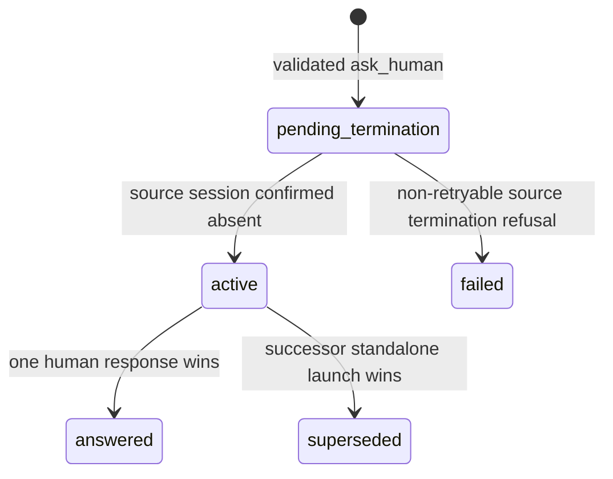

The active Inbox read model includes a terminal-origin `agent_question` only
when its activation state is `active`, `responded_at IS NULL`, and
`superseded_at IS NULL`; ordinary terminal-run HITL remains excluded. Response
and schema bodies are never written to structured logs. Creation, activation
retry/failure, answer, supersession count, and targeted re-trigger decision log
only IDs, kind, state, and row counts.

### Human answer and supersession transaction

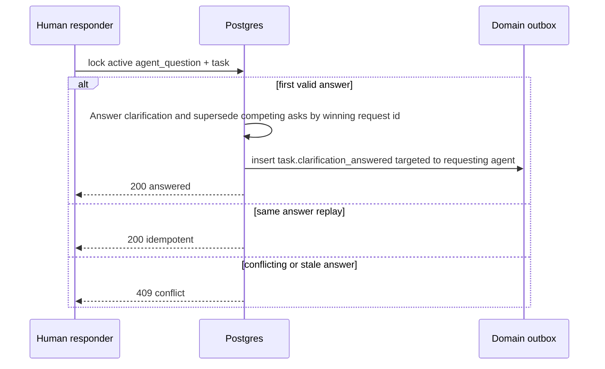

The answer winner records `superseded_by_hitl_request_id`; a manual/domain
successor run instead records `superseded_by_run_id`. Exactly one provenance
column may be non-null. `responded_at` means a real human answer only, never a
supersession. The response endpoint rejects every non-`agent_question` branch
here and does not write an artifact, call `runFlow`, or call the supervisor.

## Flow Review Workspace feedback delivery (Implemented — ADR-138)

### Purpose

Turn a Flow review rework into a verifiable preview → claim → runner sequence.
Only the authenticated Review Workspace can make this decision; general HITL
remains unchanged.

### Entities

- **Preview** — side-effect-free `POST /api/runs/{runId}/hitl/{hitlRequestId}/review-feedback-preview`.
  URL ids locate rows; actor, project, Flow target, comments variable, workspace,
  threads, and chat are server-derived.
- **Fresh claim** — a session response with opaque review-source and feedback
  fingerprints, valid only for `response.decision = rework`.
- **Canonical retry** — stored response equality is structural (object-key
  order is irrelevant); it does not recompute a potentially later worktree or
  packet.
- **Gate-chat turn** — durable lifecycle row `pending | completed | failed |
  aborted`; only `completed` turns are packet input.

### Process

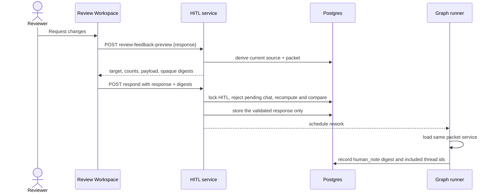

### Expectations

- Preview accepts no body-controlled project, workspace, node, path, comment,
  target, or template identifiers. It returns `200` only for a live allowed
  rework decision and has no mutation or runner side effect.
- A pending chat turn returns retryable `409 PRECONDITION`. The prompt is
  performed outside a DB transaction. Lease expiry only requests cancellation;
  the owner waits for the prompt, completes L3 restore, and then writes its
  terminal abort. The response fence therefore survives until a late restore is
  impossible.
- External v1 `respond` rejects `schema.review === true` with `409
  PRECONDITION` before calling the shared response service. Permission, form,
  and other eligible human compatibility remains unchanged.
- Preview/runner logs use ids, counts, state, and SHA-256 digests only—never
  review summary, thread, chat, diff, or composed packet text.

### Edge cases

- A stale source/packet fingerprint, missing feedback consumer, or changed
  review gate → `409 PRECONDITION` with the HITL row still open.
- Same structurally equal response after a successful claim (object-key order is
  irrelevant) → existing idempotent response; different response → `409
  CONFLICT`.
- `approve` never needs preview fingerprints and retains current semantics.

### Linked artifacts

- Execution-host contract (ADR-166, Implemented): [`execution-hosts.md`](execution-hosts.md) — the permission-respond Phase-1 transaction also inserts the `session.input` command row; Phase 2 marks `responded_at` and the command `succeeded` in one transaction, and every persist-failure path cancels through a `session.input{action:"cancel"}` command.
- [ADR-138](../decisions.md#adr-138-flow-review-workspace--complete-working-tree-review-and-verified-rework-feedback-delivery),
  [`review-comments.md`](review-comments.md), [`flow-graph.md`](flow-graph.md),
  [`../api/web.openapi.yaml`](../api/web.openapi.yaml), and
  [`../api/external/operations.openapi.yaml`](../api/external/operations.openapi.yaml).

## Plan-review decision children (Implemented — ADR-137)

`decision_request` is a child of a graph-human parent, not an agent question
or a standalone Inbox entity. It exposes only server-allowed options and is
idempotent by `(run, source artifact, decision id)`. Nonfinal answers keep the
parent pending; the final answer atomically prepares the declared rework. A
parent rework system-closes unresolved children under the same parent/sibling
lock. Gate chat remains attached to the parent and never resolves a child.
## Linked artifacts

- ADRs: [ADR-006 Hybrid HITL](../decisions.md#adr-006-hybrid-hitl-keep-alive--checkpointresume),
  [ADR-008 Typed error taxonomy](../decisions.md#adr-008-typed-error-taxonomy-maistererror),
  ADR-054 (HITL assessment taxonomy — `criticality`/`human_confidence`; Implemented),
  ADR-055 (HITL response service + HITL-over-MCP + token-actor + D7/D8 gates; Implemented),
  ADR-056 (flat-runner `on_reject` atomic repark; Implemented),
  ADR-057 (HITL hybrid-surface composition — cross-project inbox; Implemented),
  [ADR-066 Diff rendering stack](../decisions.md#adr-066-editor-and-diff-rendering-stack-shiki-git-diff-view-codemirror) (ADR-082 scope-switcher reuse),
  [ADR-082 Review-diff completeness (Implemented)](../decisions.md#adr-082-review-diff-completeness-with-dirty-state-protocol-and-scope-switcher),
  [ADR-078 Gate-chat + workspace-neutrality (Implemented)](../decisions.md#adr-078-gate-chat-at-hitl-pauses-with-three-layer-workspace-neutrality).
- ERD: [`../db/hitl-domain.md`](../db/hitl-domain.md).
- Config reference: [`../configuration.md`](../configuration.md)
  §`form_schema versioning`;
  §`Environment variables (server tier)` for
  `MAISTER_KEEPALIVE_MINUTES`.
- API (external): [`../api/external/acp.asyncapi.yaml`](../api/external/acp.asyncapi.yaml)
  §`session.request_permission`.
- Related: [`runs.md`](runs.md), [`flows.md`](flows.md),
  [`external-operations.md`](external-operations.md),
  [`assistant-activity.md`](assistant-activity.md),
  [`flow-graph.md`](flow-graph.md) (graph review decisions),
  [`review-comments.md`](review-comments.md) (Implemented — ADR-072:
  line-anchored review threads, `{maxLoops, gateAttempt}` schema fields,
  loop-exhaustion refusal).
- Source: `web/lib/config.ts` (`validateFormSchemaVersion`),
  `web/lib/atomic.ts` (`atomicWriteJson`),
  `web/lib/db/schema.ts` (hitl_requests table),
  `web/lib/services/agent-question.ts`, `web/lib/services/hitl.ts`,
  `web/app/api/v1/ext/projects/[slug]/tasks/[taskId]/human-asks/route.ts`,
  `web/app/api/v1/ext/runs/[runId]/hitl/route.ts`,
  `web/app/api/v1/ext/runs/[runId]/hitl/[hitlRequestId]/respond/route.ts`,
  `mcp/src/tools.ts`.
- SDD: [`../../.ai-factory/specs/feature-user-access-tokens.md`](../../.ai-factory/specs/feature-user-access-tokens.md).

