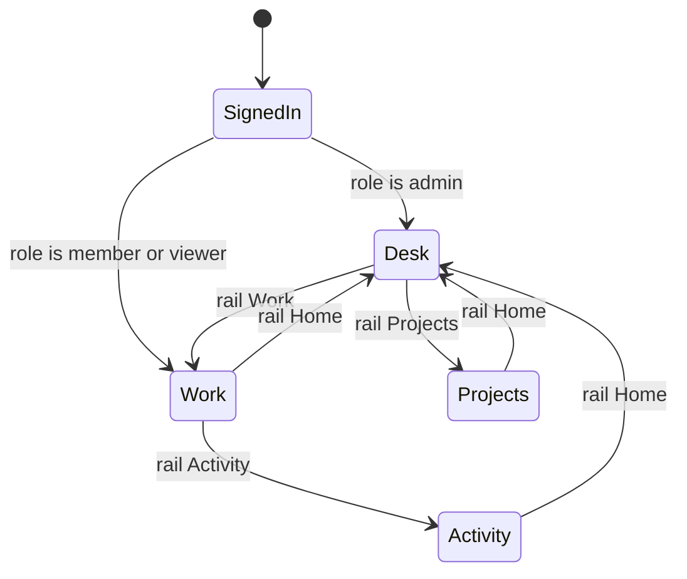
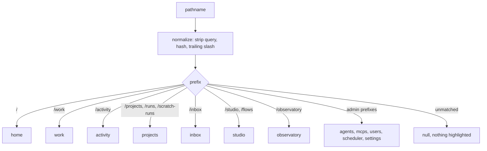
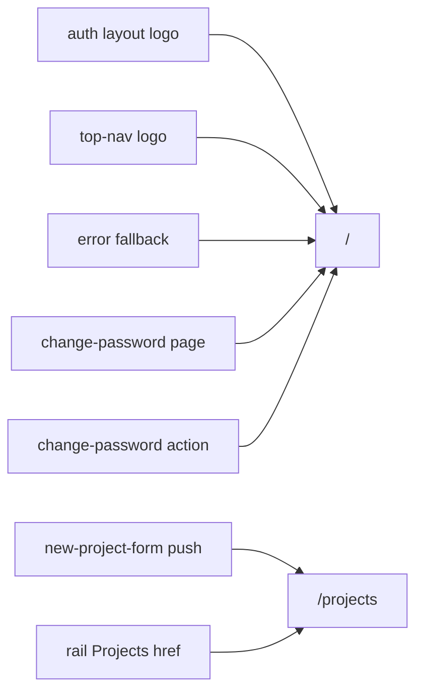

# Home navigation

## Purpose

The application's **information architecture above the page level**: what `/`
renders, where the project portfolio lives, which rail section a route
highlights, and which surface a user lands on after sign-in. The domain exists
because `/` acquired two meanings — "home" and "the portfolio" — and those
meanings now diverge; its invariants are testable and had no owning document.
Locked by [ADR-172](../decisions.md#adr-172-desk-home-information-architecture-and-the-member-default-route),
and **Implemented**.
It owns no data and no authorization: every rule here is about routing and
rendering, and nav visibility is explicitly **not** an access control
(see NAV-06).

## Domain entities

- **The Desk** — `/`. Composes the Now tiles, the decision queue, work in
  flight, the activity feed and the digest sentence. Composition only; it
  re-implements none of them.
- **The portfolio** — `/projects`. The project-card grid formerly at `/`,
  behaviour unchanged, including the onboarding checklist and empty state.
- **`RailSectionId`** — the rail's section vocabulary, gaining `home`, `work`
  and `activity`.
- **`railSectionForPathname`** — the pure route-prefix → section classifier.
- **`buildLeftRailSections`** — the role-aware section list; its admin-only tail
  is a convenience, never a boundary.
- **Landing route** — the post-sign-in destination, forked once by
  `role !== "admin"`. Implemented as `resolveLandingRoute` in
  `web/lib/navigation/landing.ts`, called from the `authenticate` server action
  with the role of the row it just verified.

## State machine

Navigation has no persisted state. The one branching decision is the landing
route, resolved once per sign-in.

## Process flows

Route prefix to highlighted rail section. The classifier must be total over the
application's prefixes; `/` resolves to `home`, and the `/runs` and
`/scratch-runs` collapse onto `projects` is deliberate and retained.

`null` is a DECIDED answer, not a gap: `/account` and `/account/password` are
reached from the user menu and highlight nothing. Totality is therefore checked
as "every segment `app/(app)` serves appears in the classifier's declared
table" (`UT-NAV-04`), not as "every segment returns non-null" — which is what a
first cut of that gate asserted, and which would have forced a fake rail
section onto the account pages.

Intent classification for inbound links to `/`. Two call sites mean "the
portfolio" and must move; the rest mean "home" and must not.

## As built

- `railSectionForPathname` gained `home` and maps `/` to it; `/projects`,
  `/runs` and `/scratch-runs` still collapse onto `projects`.
- The rail order is Home / Projects / Work / Activity / Inbox / Flow Studio /
  Observatory, then the admin tail. `Activity` moved ahead of `Inbox`.
- `UT-NAV-05` found ONE call site beyond the seven ADR-172 D3 tabulated: the
  proxy's `new URL("/", nextUrl)` bounce for an already-signed-in visitor to
  `/login`. Its intent is "home" and it is unchanged, but it is now declared.
  The gate's pattern covers `href="/"`, `redirect("/")`, `router.push("/")` and
  `new URL("/"` — an inventory that excludes one navigation idiom is not an
  inventory.
- The header crumb named "portfolio" unconditionally, which was simply false on
  the Desk; it now reads the same classifier
  (`web/components/chrome/nav-crumb.tsx`).
- The Desk | Projects switch is hidden below `md`, where the mobile rail drawer
  already carries both destinations — keeping it pushed the header past a 390px
  viewport.

## Expectations

- **NAV-01:** `/` MUST render the Desk for an admin.
- **NAV-02:** A user whose `role !== "admin"` — `member` or `viewer` — MUST land on `/work` after sign-in.
- **NAV-03:** `/projects` MUST render the former portfolio unchanged, including its onboarding checklist and empty state.
- **NAV-04:** `railSectionForPathname` MUST be total over the application's route prefixes and MUST map `/` to `home`.
- **NAV-05:** Every inbound link to `/` MUST resolve to the surface its call site intends; a call site meaning "the portfolio" MUST target `/projects`. The inventory is read from the tree and compared against a declared table (`UT-NAV-05`), so an undeclared new call site fails.
- **NAV-06:** Rail visibility MUST NEVER be the authorization boundary — every route the rail hides MUST still be refused server-side on its own.
- **NAV-07:** The shared `(app)` header MUST fit a 390px viewport on every route without making the page scroll horizontally, and MUST keep the mobile rail toggle and every control's accessible name while it does — below `md` only the user's name may lose visible characters, by truncation, never by removal from the DOM.
- **NAV-08:** One work item MUST appear as exactly ONE object on the Desk (ADR-174). A task that is simultaneously in flight and blocked on a human MUST be rendered by exactly one row or card naming it, never by a work row AND a decision card; its decision rides on the row. The activity feed is deliberately out of scope — it is a log of EVENTS, not a second rendering of the item, and collapsing it is refused by ADR-174 D4.

## Edge cases

- **EDGE-NAV-01:** No projects exist — the Desk renders the first-run onboarding checklist and empty-state card inside its own frame. The scratch composer is absent UNCONDITIONALLY, with or without projects (ADR-174 `REQ-D22`): the rail already renders the launcher with the global Cmd/Ctrl+K listener, so the Desk's own copy bought nothing and a second registration opened two dialogs. `hasProjects` therefore gates only the first-run frame.
- **EDGE-NAV-02:** Narrow viewports stack the Desk regions in source order; no region is dropped and none makes the PAGE scroll horizontally — the work table DROPS columns by priority (`tokens` and `readiness` first) rather than scrolling inside its own container (ADR-174, `REQ-D11`). Column hiding is CSS-driven, so the `<td>` elements remain in the DOM and any `colSpan` is the FULL column count, never the visible one. Asserted on the document: it was scoped to `<main>` only while the shared header still overflowed a 390px viewport on every route (`/work` measured 471px, `/inbox` 479px), a chrome defect now closed by `NAV-07`. The stacked order is strip, then Work, then Held, then Activity, at every width — there is no second arrangement, so the rendered order IS the source order (Implemented — ADR-174 D1).

## Linked artifacts

- [ADR-172 — Desk home IA and the member default route](../decisions.md#adr-172-desk-home-information-architecture-and-the-member-default-route)
- [M51 requirement traceability](m51-traceability.md)
- [Screen reference — the Desk](../screens/desk.md)
- [Screen reference — left rail](../screens/chrome/left-rail.md)
- [Screen reference — top nav](../screens/chrome/top-nav.md)
- [`web/components/chrome/left-rail-route.ts`](../../web/components/chrome/left-rail-route.ts)
- [`web/components/chrome/left-rail-sections.ts`](../../web/components/chrome/left-rail-sections.ts)
