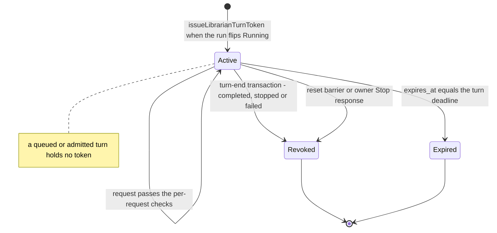
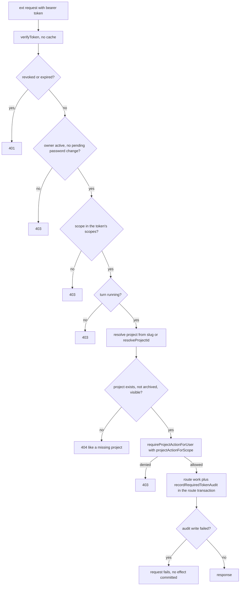
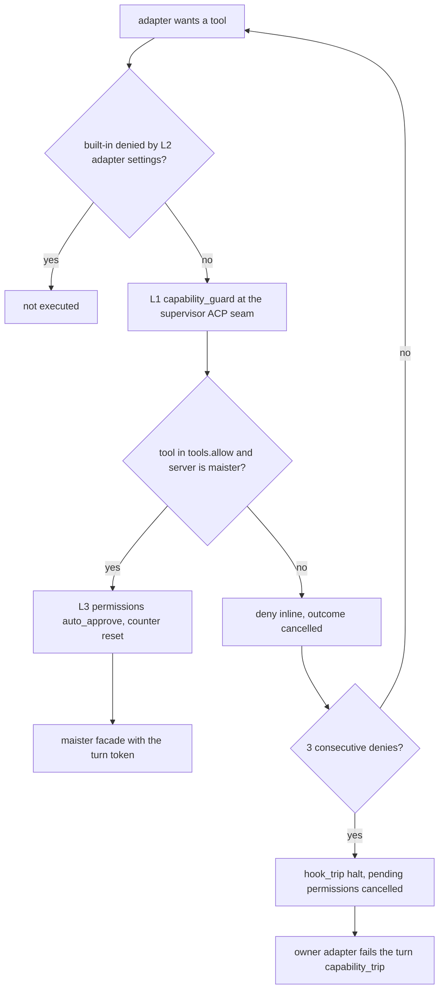
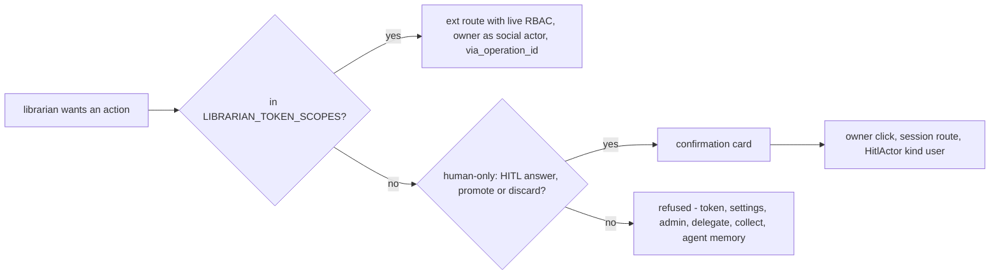

# Librarian authority

## Purpose

The **delegated authority** under which the librarian reads and acts: a short-lived,
server-issued token bound to one owner and one turn, re-checked against the owner's
live account state and project roles on every request, narrowed by a librarian
scope policy, filtered by the owner's visible projects, attributed in the audit log,
and delivered to an ACP session that can reach the platform only through the
`maister` MCP facade. The domain owns the `librarian` token kind, the librarian arm
of `handleExt`, `LIBRARIAN_TOKEN_SCOPES` / `LIBRARIAN_READ_SCOPES`, the audit
attribution columns, the human-only boundary, and the MCP-only session profile. It
does **not** own the user/role model ([`identity-access.md`](identity-access.md)),
the general token lifecycle ([`token-lifecycle.md`](token-lifecycle.md)), the
external route surface ([`external-operations.md`](external-operations.md)) or the
supervisor's guard engine ([`guardrail-hooks.md`](guardrail-hooks.md)). Being an
instance-level assistant grants no instance-wide data access. The decision is
[ADR-186](../decisions.md#adr-186-librarian-delegated-authority-per-turn-owner-bound-tokens-with-live-rbac).
The whole domain is **Implemented**.

## Domain entities

- **Librarian turn token** (persisted, Implemented) — a `project_tokens` row with
  `token_kind='librarian'`, `owner_user_id` = owner, `project_id` and `agent_id` NULL,
  `librarian_turn_id` set, `expires_at` = turn deadline, name
  `librarian-turn:<turnId>` (reserved). Issued when the run flips `Running`; a
  `Pending` turn holds no token. See the [librarian ERD](../db/librarian-domain.md).
- **Librarian principal** (Implemented) — the `TokenActor` librarian arm carrying the
  owner and `librarianTurnId`; `actorUserIdForToken` and `socialActorForToken` return
  the owner.
- **`LIBRARIAN_TOKEN_SCOPES`** (Implemented) — the explicit librarian scope list in
  `web/types/token-scopes.ts`: task, comment, relation, flow/runner read, run
  read/launch/cancel/recover/rework/sync/reopen/message, HITL and decisions read,
  project and Brain read, `librarian:*`. `AGENT_TOKEN_SCOPES` and
  `CROSS_PROJECT_AGENT_SCOPES` are untouched.
- **`LIBRARIAN_READ_SCOPES`** (Implemented) — the read-only subset given to Explain
  turns, so teammate answers and retrieved text never run with effect authority.
- **Audit attribution** (persisted, Implemented) — `token_audit_log.on_behalf_of_user_id`,
  `librarian_turn_id`, `operation_id`; `actor_label` = `librarian:<ownerUserId>`.
- **`requirePersonalOrLibrarianActor`** (Implemented) — the one shared actor gate
  replacing the three inline "global personal token only" checks.
- **Authz fingerprint** (Implemented) — sha256 over the owner's active flag, global role
  and sorted `(project_id, role)` visibility set, computed at admission; a change
  bumps `context_epoch` ([`librarian-conversation.md`](librarian-conversation.md)).
- **MCP-only session profile** (Implemented) — L1 `enforcementProfile`
  (`tools.allow` = librarian tool names, `mcps.allowServers: ["maister"]`,
  `enforcedClasses: ["tools","mcps"]`, `escalationThreshold: 3`), L3 execution policy
  `permissions=auto_approve`, Claude L2 adapter deny settings, an empty cwd. Codex
  is ineligible while its built-in host reads have no deny surface. Summary turns
  use `tools.allow: []`, `mcps.allowServers: []`,
  `enforcedClasses: ["tools","mcps"]` and carry no token.

## State machine

The turn token lives exactly as long as the running turn. It is minted at the
`Running` flip, looked up per request with no cache, and ends in the turn-end
transaction or at its `expires_at` (Implemented).

## Process flows

Per-request admission of a librarian-token call. Every check reads live state; the
project answer for an archived, invisible or unknown project is the same 404
(Implemented).

The three enforcement layers of the eligible Claude MCP-only session. L2 keeps built-ins from being
offered; L1 is the seam that decides every call that reaches it; L3 makes an admitted
MCP call proceed without a permission request, so no `hitl_requests` row is ever
needed (Implemented).

The human-only boundary. Some actions stay out of token reach altogether and appear
to the owner as confirmation cards whose click runs as the user through a session
route ([`librarian-operations.md`](librarian-operations.md)) (Implemented).

## Expectations

- **LAU-01:** The owner MUST come only from the authenticated session (`auth-context`), and no librarian route or tool may accept a user id, enforced by the ADR-186 route identifier table across `/api/librarian/*` and `/api/v1/ext/librarian/*` (Implemented).
- **LAU-02:** Each turn MUST get a fresh `project_tokens` row with `token_kind='librarian'`, `owner_user_id` = owner, `project_id` NULL, `agent_id` NULL, `librarian_turn_id` set and `expires_at` = turn deadline, revoked in the turn-end transaction, enforced by CHECK `project_tokens_librarian_check` (Implemented).
- **LAU-03:** Every librarian-token request MUST re-check at request time that the owner is active, has no pending password change, holds the live project role for the scope's action, holds the scope in the token's scopes and owns a `running` turn, enforced by the `handleExt` librarian arm calling `requireProjectActionForUser` (Implemented).
- **LAU-04:** A librarian token MUST be refused on `hitl_respond` (any kind), `run_promote`, `run_discard`, `run_delegate`, `run_collect`, `agent_memory_write` and token/settings/admin routes, and an agent token MUST be refused on every `/ext/librarian/*` route, enforced by `LIBRARIAN_TOKEN_SCOPES` and the kind gates in `handleExt` (Implemented).
- **LAU-05:** A follow-up (Explain) turn MUST receive `LIBRARIAN_READ_SCOPES`, and its token MUST be refused on every effectful route, enforced by the scope check in `handleExt` (Implemented).
- **LAU-06:** Every list, search and count admitted for librarian tokens MUST filter by the owner's visible projects before aggregation, and a foreign project MUST answer exactly like a missing one, enforced by `getVisibleProjects` in the discovery and cross-project read routes (Implemented).
- **LAU-07:** Every librarian-token request MUST write `token_audit_log` with `on_behalf_of_user_id`, `librarian_turn_id` and, for effects, `operation_id`, and an audit failure MUST fail the request, enforced by `recordRequiredTokenAudit` inside the route's transaction (Implemented).
- **LAU-08:** Effects made through the librarian MUST record the owner as social actor plus `via_operation_id`, and human-only answers and promotions MUST execute only from an owner click in the session UI, enforced by `socialActorForToken` and `POST /api/librarian/cards/{cardId}/decide` (Implemented).
- **LAU-09:** No role, including global admin, MAY read another user's conversation, memory or snapshots through any route, enforced by owner-only `server-state` resolution in every `/api/librarian/*` route (Implemented).
- **LAU-10:** Deactivation or loss of membership MUST apply to the next request of an in-flight turn and to every queued turn at admission, enforced by the `verifyToken` owner checks, the per-request RBAC re-check and the admission owner check (Implemented).
- **LAU-11:** A librarian session MUST carry the enforcement profile `{tools:{allow:<librarian tool names>}, mcps:{allowServers:["maister"]}, enforcedClasses:["tools","mcps"]}`, execution policy `permissions=auto_approve`, no `readOnlySession`, L2 adapter deny settings and only the `maister` server; an adapter without verified built-in denial MUST be ineligible. A call reaching the seam is denied, a threshold halt fails the turn `capability_trip`, and no `hitl_requests` row is ever created for a librarian run (Implemented for Claude; Codex ineligible).

## Edge cases

- **EDGE-LAU-01:** Token replay after revocation — `verifyToken` looks the token up per request and refuses a revoked or expired turn token with 401 (`TokenAuthError("revoked")`, the HTTP twin of [`MaisterError("UNAUTHENTICATED")`](../error-taxonomy.md#token--external-api-auth-implemented)), so a replay after the turn-end transaction never reaches a route (Implemented).
- **EDGE-LAU-02:** A global admin opens the panel — they get only their own conversation, resolved by owner; an id belonging to another user answers 404, never [`MaisterError("UNAUTHORIZED")`](../error-taxonomy.md#codes), so its existence is not revealed, and no admin inspection route exists (Implemented).
- **EDGE-LAU-03:** A project is archived mid-turn — the next request addressing it answers 404 exactly like a missing project, never [`MaisterError("UNAUTHORIZED")`](../error-taxonomy.md#codes), and an `admitted` operation with no result row settles `failed{reason:"not_applied"}` by reconcile (Implemented).
- **EDGE-LAU-04:** A summary turn (no server attached, no token) that emits any tool call fails — the owner adapter observes the call in `outcome.events` and ends the turn `failed{reason:"capability_trip"}`; no summary is written and no `hook_trip` escalation ([`MaisterError("NEEDS_INPUT")`](../error-taxonomy.md#codes)) is raised (Implemented).

## Linked artifacts

- [ADR-186 — librarian delegated authority](../decisions.md#adr-186-librarian-delegated-authority-per-turn-owner-bound-tokens-with-live-rbac) · [record](../decisions/adr-186.md)
- [ADR-185 — librarian runtime](../decisions.md#adr-185-librarian-runtime-a-project-less-run-kind-with-per-turn-acp-sessions) · [ADR-130 — capability guard](../decisions.md#adr-130)
- [Librarian requirement traceability](librarian-traceability.md)
- [Product brief — personal librarian](../pv/personal-librarian.md)
- [Librarian ERD](../db/librarian-domain.md)
- [External operations](external-operations.md) · [Token lifecycle](token-lifecycle.md) · [Identity and access](identity-access.md) · [Guardrail hooks](guardrail-hooks.md)
- [`web/lib/tokens/ext-handler.ts`](../../web/lib/tokens/ext-handler.ts) · [`web/lib/tokens/verify.ts`](../../web/lib/tokens/verify.ts) · [`web/lib/tokens/issue.ts`](../../web/lib/tokens/issue.ts) · [`web/lib/tokens/lifecycle.ts`](../../web/lib/tokens/lifecycle.ts)
- [`web/types/token-scopes.ts`](../../web/types/token-scopes.ts) · [`web/lib/authz.ts`](../../web/lib/authz.ts) · [`web/lib/queries/visible-projects.ts`](../../web/lib/queries/visible-projects.ts)
- [`supervisor/src/acp-client.ts`](../../supervisor/src/acp-client.ts) · [`web/lib/capabilities/adapter-home.ts`](../../web/lib/capabilities/adapter-home.ts) · [`web/lib/acp-runners/resolve.ts`](../../web/lib/acp-runners/resolve.ts) · [`mcp/src/tools.ts`](../../mcp/src/tools.ts)
