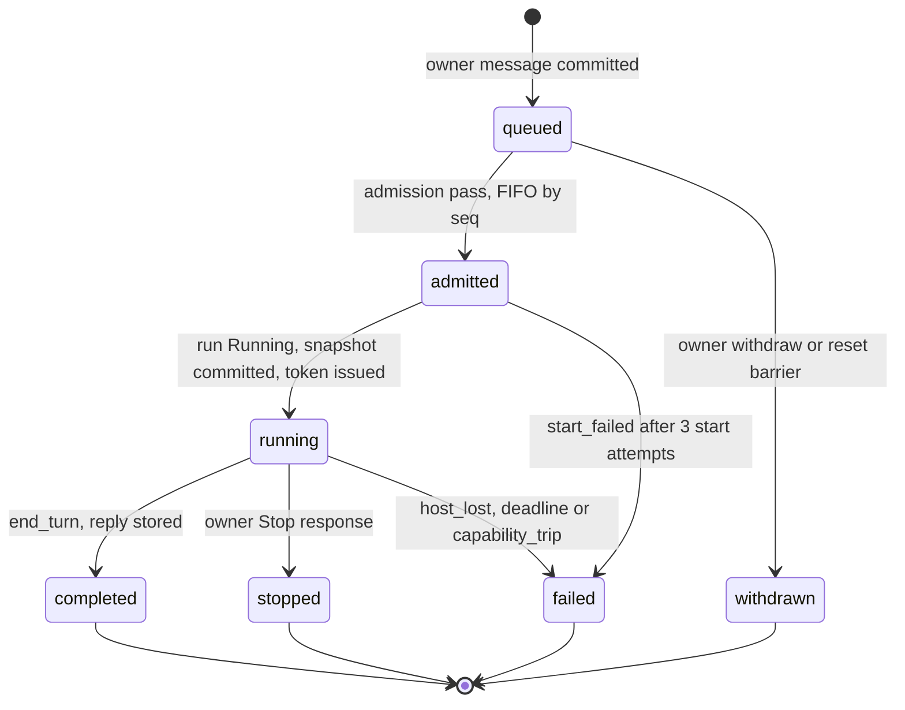
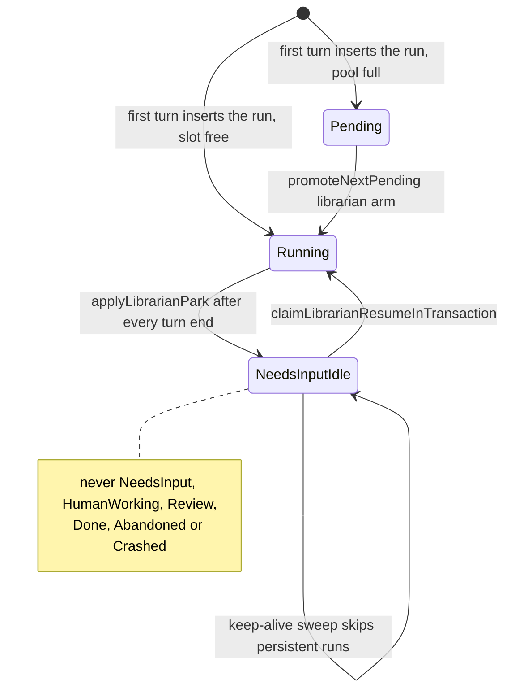
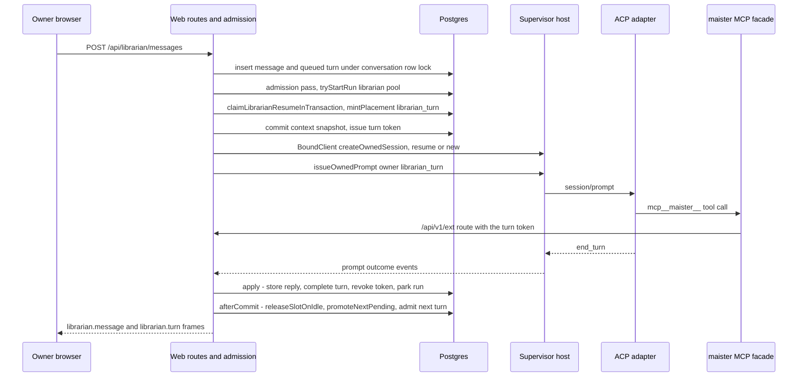
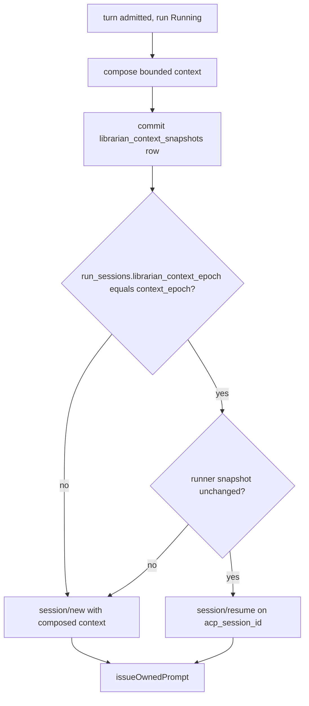
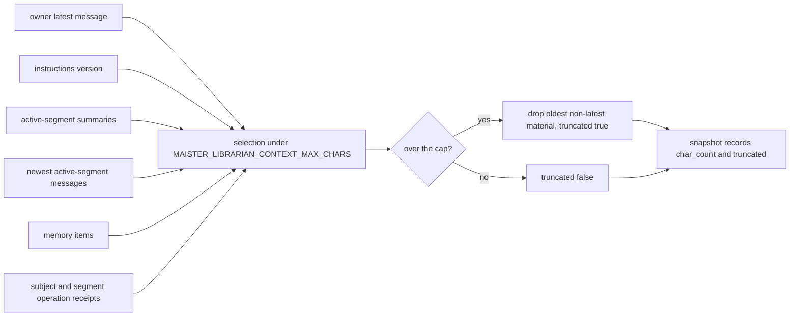
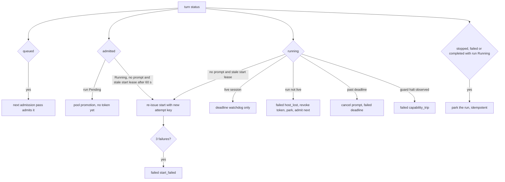
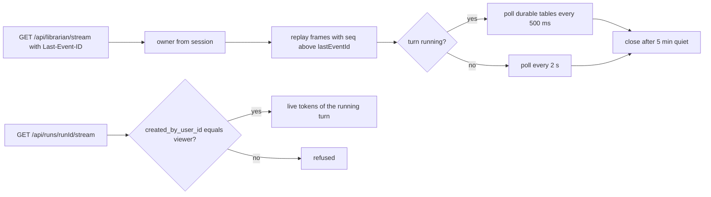

# Librarian conversation

## Purpose

The **durable personal conversation** between one user and the librarian, and the
runtime that executes its turns. The domain owns the conversation row, its messages
and segments, the turn queue and ledger, the context snapshot written before every
prompt, the `run_kind='librarian'` run that hosts the turns, the librarian scheduler
pool and budgets, stop/deadline/restart recovery, admin enablement, and the owner's
conversation stream. It does **not** own the delegated token and its checks
([`librarian-authority.md`](librarian-authority.md)), the operation ledger and cards
([`librarian-operations.md`](librarian-operations.md)), memory, summaries and reset
([`librarian-memory.md`](librarian-memory.md)), or the panel
([`librarian-surface.md`](librarian-surface.md)). The durable records are the source
of truth; an ACP session is a cache that a turn may resume only when it is provably
current. The runtime decision is
[ADR-185](../decisions.md#adr-185-librarian-runtime-a-project-less-run-kind-with-per-turn-acp-sessions).
The whole domain is **Implemented**.

## Domain entities

- **`librarian_conversations`** (persisted, Implemented) — exactly one per user
  (`librarian_conversations_user_uq`); carries `run_id`, `context_epoch`,
  `forget_generation`, `history_generation`, `current_segment_id`, `reset_state`,
  `subject`, `read_through_seq` and the daily turn counters. See the
  [librarian ERD](../db/librarian-domain.md).
- **`librarian_segments`** (persisted, Implemented) — monotonic `ordinal` per
  conversation; the boundary of automatic recall (owned semantics in
  [`librarian-memory.md`](librarian-memory.md)).
- **`librarian_messages`** (persisted, Implemented) — `seq`, `author_kind`
  (`owner | librarian | update | system`), `client_message_id`, `subject` captured at
  send, `delivery_state` (`accepted | queued | withdrawn | withdrawn_by_reset |
  processed`), `turn_id`, `source_project_ids`.
- **`librarian_turns`** (persisted, Implemented) — the turn ledger: `variant`
  (`owner_message | explain | summary`), `status`, `failure_reason`,
  `context_snapshot_id`, `runner_snapshot`, `token_id`, `deadline_at`.
- **`librarian_context_snapshots`** (persisted, Implemented) — per turn: message ids,
  summary and memory revisions, `instructions_version`, `authz_fingerprint`,
  `context_epoch`, `char_count`, `truncated`.
- **Librarian run** (persisted, Implemented) — the conversation's single `runs` row:
  `run_kind='librarian'`, `project_id` and `task_id` NULL, `persistent=true`,
  `flow_version='librarian'`, `created_by_user_id` = owner, `agent_workspace='none'`,
  adopted as a `directory` workspace at
  `<runtimeRoot>/.maister/_librarian/<conversationId>/` under the reserved
  `projectSlug` `_librarian`.
- **`run_sessions.librarian_context_epoch`** (persisted, Implemented) — the epoch the
  ACP session was created under; the resume guard compares it.
- **Prompt owner `librarian_turn`** (Implemented) — variants
  `owner_message | explain | summary`, logical key
  `librarian_turn:<variant>:<assignmentId>:<promptOrdinal>`, placement reason
  `librarian_turn`.
- **Librarian pool** (Implemented) — `SchedulerPool` member `librarian`, capped by
  `MAISTER_MAX_CONCURRENT_LIBRARIAN_TURNS`; queued FIFO, never refused.
- **Budgets** (Implemented) — `MAISTER_LIBRARIAN_TURN_MAX_MINUTES`,
  `MAISTER_LIBRARIAN_CONTEXT_MAX_CHARS`, `MAISTER_LIBRARIAN_DAILY_TURNS_PER_USER`.
- **Enablement** (persisted, Implemented) — `platform_runtime_settings.librarian_enabled`
  and `librarian_runner_id` (`ON DELETE SET NULL`).
- **Conversation stream** (Implemented) — `GET /api/librarian/stream`, frames
  `librarian.message`, `librarian.turn`, `librarian.indicator`, `librarian.reset`,
  `id` = monotonic `seq`.

## State machine

The turn machine. A turn row exists from the moment its owner message commits;
`withdrawn` is terminal and is mirrored on the message's `delivery_state`
(`withdrawn` by the owner, `withdrawn_by_reset` by the reset barrier). The partial
unique index allows at most one of `admitted`/`running` per conversation (Implemented).

The run of kind `librarian` never leaves the two live statuses once started: the
reconcile arm parks it instead of crashing it, and `persistent=true` exempts it from
keep-alive abandonment (Implemented).

## Process flows

One owner-message turn end to end. The message commits before admission; the token
exists only while the run is `Running`; the owner adapter stores the reply and parks
the run in one transaction, then frees the slot and admits the next queued turn
(Implemented).

Session reuse. A retained ACP session may still hold facts the owner can no longer
see, so it is resumed only when both the context epoch and the runner match; any
mismatch composes a fresh bounded context (Implemented).

Composition within the budget. The owner's latest message is selected first, so a
truncation can only drop older material (Implemented).

Recovery arms by turn status and run liveness, owned by the reconcile `librarian`
arm, the deadline watchdog and the `system_sweep` backstop (Implemented).

The conversation stream replays durable rows and never carries live tokens; those
ride the existing run stream, which authorizes a project-less run by
`created_by_user_id` (Implemented).

## Expectations

- **LCV-01:** Exactly one `librarian_conversations` row MUST exist per user and no route or tool may create a second, enforced by UNIQUE `librarian_conversations_user_uq` behind `getOrCreateConversation` (Implemented).
- **LCV-02:** An owner message MUST be committed before any turn admission, and a repeated `(conversation_id, client_message_id)` MUST return the stored message, enforced by partial UNIQUE `librarian_messages_client_id_uq` in `appendOwnerMessage` (Implemented).
- **LCV-03:** At most one turn per conversation MAY be `admitted` or `running`, later messages MUST queue in `seq` order, and a message MAY be withdrawn only while `queued`, enforced by partial UNIQUE `librarian_turns_one_active_uq` under the `librarian_conversations` row lock (Implemented).
- **LCV-04:** A turn MUST run on the conversation's single `runs` row with `run_kind='librarian'`, `project_id IS NULL`, `task_id IS NULL`, `persistent=true`, `flow_version='librarian'` and `created_by_user_id` = owner, adopted as a `directory` workspace under `<runtimeRoot>/.maister/_librarian/<conversationId>/`, and every prompt MUST carry owner kind `librarian_turn`, enforced by CHECK `runs_librarian_shape_check` and `execution_commands_prompt_owner_required` (Implemented).
- **LCV-05:** A conversation MUST hold a slot only while its run is `Running`, MUST be parked `NeedsInputIdle` between turns and NEVER TTL-abandoned, and a full `MAISTER_MAX_CONCURRENT_LIBRARIAN_TURNS` pool MUST queue rather than refuse, enforced by the `tryStartRun` librarian pool arm and the `persistent=true` keep-alive Pass2 exemption (Implemented).
- **LCV-06:** ACP `session/resume` MUST be used only when `run_sessions.librarian_context_epoch` equals the conversation's current `context_epoch` and the runner snapshot is unchanged, and otherwise a fresh session MUST start from a composed context, enforced by the composer guard (Implemented).
- **LCV-07:** A context snapshot (message ids, summary and memory revisions, instructions version, authz fingerprint) MUST commit before the turn's prompt command is queued, enforced by CHECK `librarian_turns_running_has_snapshot_check` (Implemented).
- **LCV-08:** Stop MUST cancel the turn's prompt through `BoundClient` and revoke its token, and MUST NEVER cancel a task run or delete an operation row, enforced by the stop service behind `POST /api/librarian/turns/current/stop` (Implemented).
- **LCV-09:** After a restart or adapter loss, a `running` turn with no live session MUST resolve to `failed{host_lost}` through the reconcile `librarian` arm with the run parked, and queued messages MUST stay queued and admit afterwards (Implemented).
- **LCV-10:** The turn deadline, context character cap and per-user daily turn cap (`MAISTER_LIBRARIAN_TURN_MAX_MINUTES`, `MAISTER_LIBRARIAN_CONTEXT_MAX_CHARS`, `MAISTER_LIBRARIAN_DAILY_TURNS_PER_USER`) MUST be finite, exhaustion MUST refuse with `MaisterError("BUDGET_EXCEEDED")` in a visible state, and the owner's latest message MUST NEVER be truncated away by the composer (Implemented).
- **LCV-11:** With the librarian disabled or no ready runner, admission MUST refuse with `MaisterError("CONFIG")` or `MaisterError("EXECUTOR_UNAVAILABLE")` while admitted operations still reconcile and nothing is deleted, enforced by the admission check over `platform_runtime_settings.librarian_enabled` and `librarian_runner_id` (Implemented).
- **LCV-12:** `GET /api/librarian/stream` MUST emit only the owner's conversation and replay from durable `seq` via `lastEventId`; the existing run stream, whose project-less authz is `created_by_user_id = viewer`, supplies the running/responding state. Reply text appears after settlement (Implemented).

## Edge cases

- **EDGE-LCV-01:** Two tabs submit one `client_message_id` concurrently — partial UNIQUE `librarian_messages_client_id_uq` admits one row, and both requests answer with the same stored message and turn; neither sees [`MaisterError("CONFLICT")`](../error-taxonomy.md#codes) (Implemented).
- **EDGE-LCV-02:** A message arrives while a turn runs — it commits `queued` with its own `seq` and subject and is admitted after the active turn ends; admission never refuses it with [`MaisterError("CONFLICT")`](../error-taxonomy.md#codes) (Implemented).
- **EDGE-LCV-03:** The configured runner is disabled between turns — the next admission refuses with [`MaisterError("EXECUTOR_UNAVAILABLE")`](../error-taxonomy.md#codes), queued messages stay `queued` and visible, and admitted operations still reconcile (Implemented).
- **EDGE-LCV-04:** The deadline expires during a tool call — the watchdog cancels the prompt and ends the turn `failed{reason:"deadline"}`, surfaced as [`MaisterError("BUDGET_EXCEEDED")`](../error-taxonomy.md#codes); the token is revoked, so the tool's next request answers 401, and the tool's operation settles by reconcile lookup (Implemented).
- **EDGE-LCV-05:** A run parked 25 h is still `NeedsInputIdle` after the keep-alive sweep, because Pass2 skips `persistent=true`; a resume the host cannot serve fails only the turn (`start_failed` after 3 attempts, [`MaisterError("EXECUTOR_UNAVAILABLE")`](../error-taxonomy.md#codes)) and leaves the run parked (Implemented).

## Linked artifacts

- [ADR-185 — librarian runtime](../decisions.md#adr-185-librarian-runtime-a-project-less-run-kind-with-per-turn-acp-sessions) · [record](../decisions/adr-185.md)
- [ADR-166 — execution-host contract](../decisions.md#adr-166) · [ADR-167 — execution data plane](../decisions.md#adr-167)
- [Librarian requirement traceability](librarian-traceability.md)
- [Product brief — personal librarian](../pv/personal-librarian.md)
- [Librarian ERD](../db/librarian-domain.md)
- [Screen reference — librarian panel](../screens/chrome/librarian-panel.md)
- [Execution hosts](execution-hosts.md) · [Execution prompt lifecycle](execution-prompt-lifecycle.md) · [Scheduler](scheduler.md) · [Runs](runs.md) · [Reconciliation and GC](reconciliation-gc.md) · [Scratch runs](scratch-runs.md)
- [`web/lib/scheduler.ts`](../../web/lib/scheduler.ts) · [`web/lib/runs/keepalive-sweeper.ts`](../../web/lib/runs/keepalive-sweeper.ts) · [`web/lib/reconcile.ts`](../../web/lib/reconcile.ts)
- [`web/lib/execution-host/adoption.ts`](../../web/lib/execution-host/adoption.ts) · [`web/lib/execution-host/prompt-owner-contract.ts`](../../web/lib/execution-host/prompt-owner-contract.ts) · [`web/lib/workers/runtime.ts`](../../web/lib/workers/runtime.ts) · [`web/lib/agents/prompt-owner.ts`](../../web/lib/agents/prompt-owner.ts)
- [`supervisor/src/workspace-registry.ts`](../../supervisor/src/workspace-registry.ts) · [`supervisor/src/types.ts`](../../supervisor/src/types.ts)
- [`web/app/api/runs/[runId]/stream/route.ts`](../../web/app/api/runs/[runId]/stream/route.ts)
