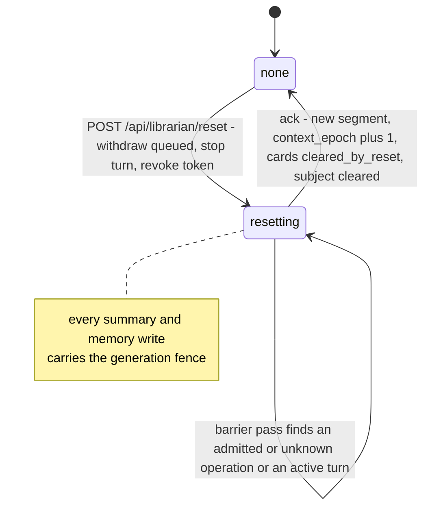
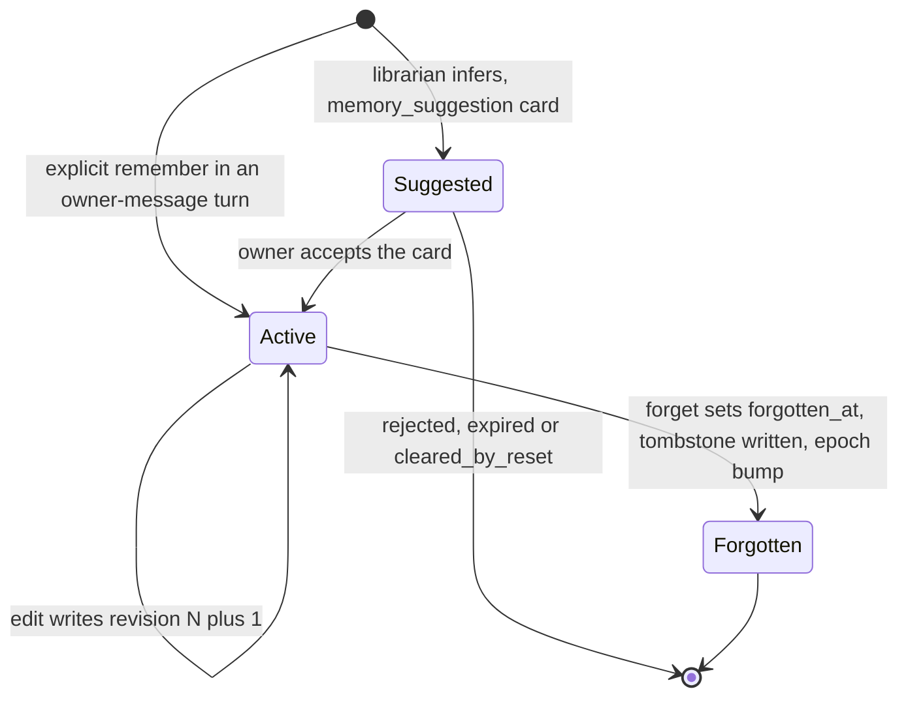
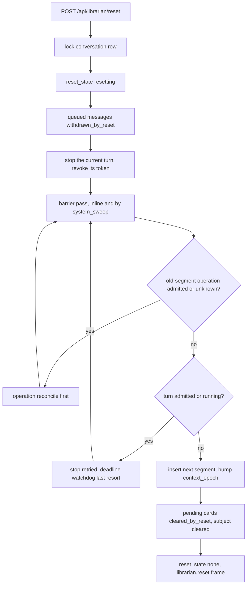
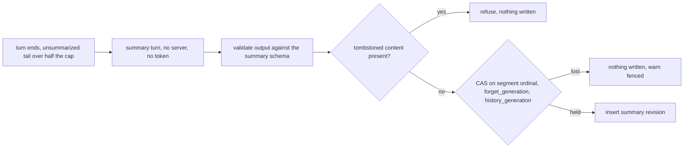
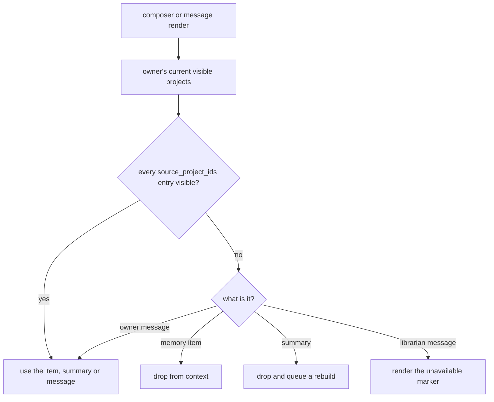
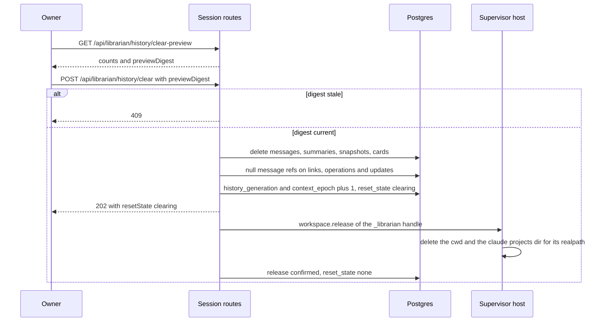

# Librarian memory

## Purpose

What the librarian **remembers, summarizes, retrieves and forgets** for one owner,
and the three distinct ways the owner bounds it: reset context, forget a memory,
clear personal history. The domain owns personal memory items and their revisions,
forget tombstones, segment summaries and their generation fences, the retrieval and
rendering visibility re-checks, explicit history search, the reset barrier, history
clearing with its host workspace purge, and retention. It does **not** own the
conversation, turn and snapshot records it reads and bounds
([`librarian-conversation.md`](librarian-conversation.md)), the operation ledger the
reset barrier waits on ([`librarian-operations.md`](librarian-operations.md)), task
content a conversation produced ([`task-statements.md`](task-statements.md)), Project
Brain ([`project-brain.md`](project-brain.md)) or an agent's per-project memory
([`agent-memory.md`](agent-memory.md)) — personal memory never writes to either.
Every change that could let retained context repeat a revoked or forgotten fact bumps
`context_epoch`, which forces the next turn onto a fresh ACP session. The decision is
[ADR-188](../decisions.md#adr-188-librarian-memory-summaries-reset-barrier-and-history-deletion).
The whole domain is **Designed**.

## Domain entities

- **`librarian_memory_items`** (persisted, Designed) — `kind`
  (`preference | goal | commitment | fact`), `content`, `scope`
  (`general | project`), `project_id`, `source_refs`, `source_project_ids`, `origin`
  (`explicit | accepted_suggestion`), `valid_until`, `revision`, `forgotten_at`;
  content changes only through revisions (trigger
  `librarian_memory_items_content_immutable`). See the
  [librarian ERD](../db/librarian-domain.md).
- **`librarian_memory_item_revisions`** (persisted, Designed) — PK
  `(item_id, revision)`.
- **`librarian_memory_tombstones`** (persisted, Designed) — PK
  `(user_id, content_digest)`; summary and suggestion writers consult it.
- **`librarian_segment_summaries`** (persisted, Designed) — per segment `revision`,
  `from_seq`..`to_seq`, `content`, `source_project_ids`, `forget_generation`,
  `history_generation`, `invalidated_at`; produced by a tool-less `summary` turn.
- **Generation fence** (Designed) — `(segment ordinal, forget_generation,
  history_generation)` on `librarian_conversations`; every summary and memory write
  CASes on it.
- **Reset barrier** (Designed) — `librarian_conversations.reset_state`
  (`none | resetting`) and the barrier pass; the acknowledgement inserts the next
  `librarian_segments` row.
- **History search** (Designed) — `GET /api/v1/ext/librarian/history/search`
  (`librarian_history_search`) over the generated `librarian_messages.body_tsv`,
  at most 20 hits, labelled `from earlier conversation`.
- **Clear-history preview** (Designed) — counts plus a `previewDigest`; the clear
  refuses a stale digest.
- **Retention** (Designed) — `MAISTER_LIBRARIAN_HISTORY_RETENTION_DAYS` (default 365)
  and `MAISTER_LIBRARIAN_SNAPSHOT_RETENTION_DAYS` (default 30), purged by a
  `system_sweep` pass with a keyset cursor.
- **`memory_enabled_next_segment`** (persisted, Designed) — the owner's switch for
  using memory in the next segment.

## State machine

The conversation reset machine. Admission refuses while `resetting`; the
acknowledgement is the only way back to `none` and happens only when the old segment
has nothing left in flight (Designed).

A memory item's lifecycle. Edits never change content in place; forget is terminal
and leaves a tombstone, so only an explicit new "remember" brings the fact back — as a
new item (Designed).

## Process flows

The reset barrier. The request commits the fence at once; the acknowledgement waits
for every old-segment operation to be terminal. The `system_sweep` backstop repeats
the idempotent barrier pass (Designed).

A fenced summary write. A summary turn is tool-less and token-less; a writer that
started before a reset, forget or clear writes nothing (Designed).

Retrieval and rendering re-check visibility on every use, so revoked project access
removes derived content from context and from the rendered history alike (Designed).

Clearing personal history. One transaction removes the personal rows, bumps both
the history generation and the context epoch, and sets `reset_state='clearing'`; after
commit the host workspace is released, which deletes the cwd and the claude transcript
directory for it. The conversation stays closed to admission until the release is
confirmed — the barrier pass re-issues it after a host outage — so a new turn can
never re-adopt the folder mid-purge; then `reset_state` returns to `none` and the next
turn re-adopts ([ADR-188](../decisions.md#adr-188) D8) (Designed).

## Expectations

- **LMM-01:** Memory items MUST be written only on an explicit "remember" in an owner-message turn or on acceptance of a visible suggestion card, and inferred items MUST stay suggestions, enforced by `POST /api/v1/ext/librarian/memory` (owner-message turns only) and the card decide route (Designed).
- **LMM-02:** An item MUST carry kind, scope, source refs, origin, validity and revision, and an edit MUST write a new revision, enforced by `librarian_memory_item_revisions` and trigger `librarian_memory_items_content_immutable` (Designed).
- **LMM-03:** Every use MUST re-check visibility of each item's and summary's source projects, and a mixed summary with an invisible source MUST be dropped and queued for rebuild, enforced by the composer's `source_project_ids` re-check (Designed).
- **LMM-04:** Automatic context MUST include only the active segment's messages and summaries, and older segments MUST be reachable only through the explicit history-search tool, labelled in the reply, enforced by the composer and `librarian_history_search` (Designed).
- **LMM-05:** Reset MUST be a barrier, acknowledged only after old-segment operations are terminal and queued messages withdrawn, and it MUST bump `context_epoch` and clear pending cards, enforced by `web/lib/librarian/reset.ts` and its `system_sweep` backstop (Designed).
- **LMM-06:** Forget MUST set `forgotten_at` and write a tombstone digest, summary and suggestion writers MUST refuse tombstoned content, and the epoch MUST bump, enforced by `librarian_memory_tombstones` (Designed).
- **LMM-07:** Summary and memory writes MUST be fenced on `(segment ordinal, forget_generation, history_generation)`, and a writer that lost the fence MUST write nothing, enforced by a CAS on `librarian_conversations` (Designed).
- **LMM-08:** Clear history MUST delete messages, summaries, snapshots and search rows, keep operations and audit with message refs nulled, and release the conversation's host workspace, enforced by `POST /api/librarian/history/clear` with its `previewDigest` (Designed).
- **LMM-09:** Rendering MUST mask librarian messages whose source projects are no longer visible, and the owner's own messages MUST always render, enforced by the `source_project_ids` check in `GET /api/librarian/messages` (Designed).
- **LMM-10:** A `system_sweep` pass MUST purge messages older than `MAISTER_LIBRARIAN_HISTORY_RETENTION_DAYS` (default 365) and snapshots older than `MAISTER_LIBRARIAN_SNAPSHOT_RETENTION_DAYS` (default 30), enforced by the librarian retention pass in `runSystemSweep` (Designed).
- **LMM-11:** Personal memory MUST NEVER write to Project Brain or to an agent's `memory.md`, enforced by an ESLint `no-restricted-imports` fence on `web/lib/librarian/**` (Designed).
- **LMM-12:** Each reply MUST show which memory items its snapshot used, enforced by `librarian_context_snapshots.memory_item_revisions` (Designed).

## Edge cases

- **EDGE-LMM-01:** Reset while a summary turn is running — the summary writer's CAS on `(segment ordinal, forget_generation, history_generation)` fails after the reset acknowledgement, so nothing is written and the writer logs `warn` fenced; no [`MaisterError("CONFLICT")`](../error-taxonomy.md#codes) reaches the owner (Designed).
- **EDGE-LMM-02:** Forget during a running owner turn — the reply may still cite the item, because its snapshot predates the forget; the epoch bump makes the next snapshot omit it, and summary and suggestion writers refuse the tombstoned content silently rather than raising [`MaisterError("CONFLICT")`](../error-taxonomy.md#codes) (Designed).

## Linked artifacts

- [ADR-188 — memory, summaries, reset barrier and history deletion](../decisions.md#adr-188-librarian-memory-summaries-reset-barrier-and-history-deletion) · [record](../decisions/adr-188.md)
- [ADR-183 — librarian runtime](../decisions.md#adr-183-librarian-runtime-a-project-less-run-kind-with-per-turn-acp-sessions) · [ADR-166 — execution-host contract](../decisions.md#adr-166)
- [Librarian requirement traceability](librarian-traceability.md)
- [Product brief — personal librarian](../pv/personal-librarian.md)
- [Librarian ERD](../db/librarian-domain.md)
- [Project Brain](project-brain.md) · [Agent memory](agent-memory.md) · [Scheduler](scheduler.md) · [Execution hosts](execution-hosts.md)
- [`web/lib/scheduler/system-sweeps.ts`](../../web/lib/scheduler/system-sweeps.ts) · [`supervisor/src/workspace-registry.ts`](../../supervisor/src/workspace-registry.ts) · [`web/lib/capabilities/adapter-home.ts`](../../web/lib/capabilities/adapter-home.ts)
