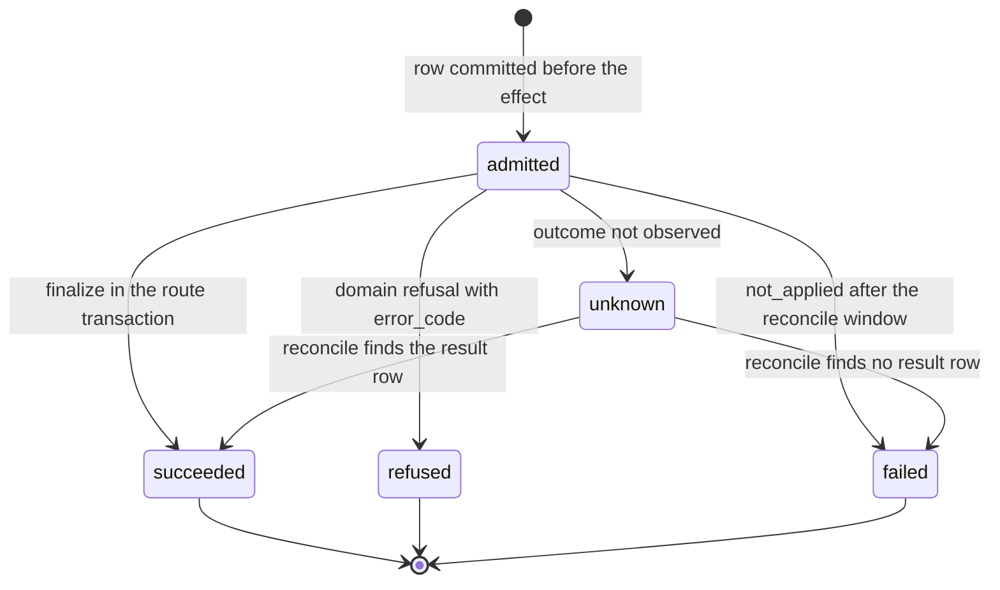
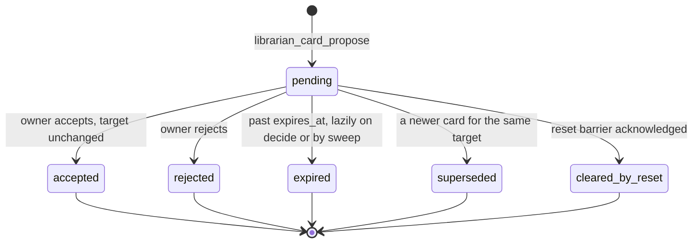
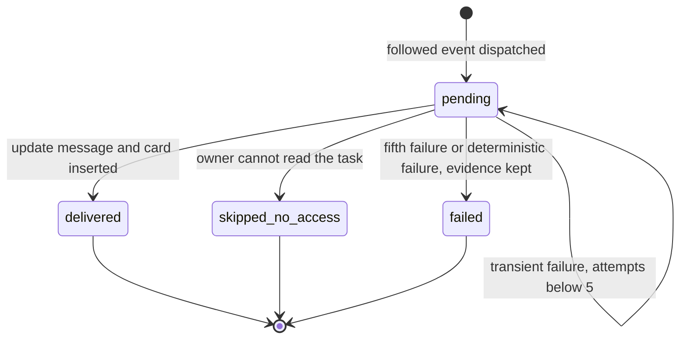
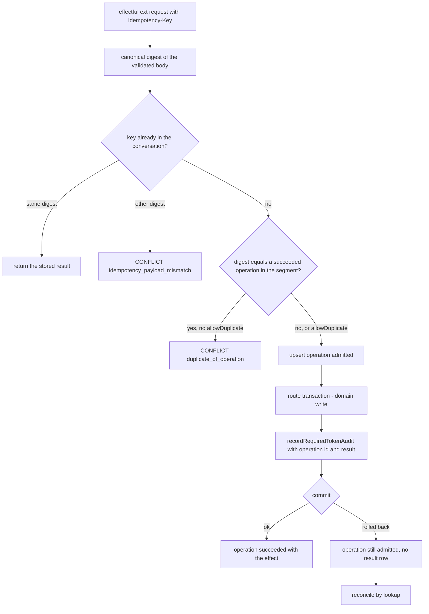
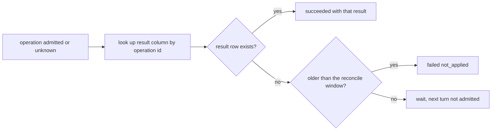
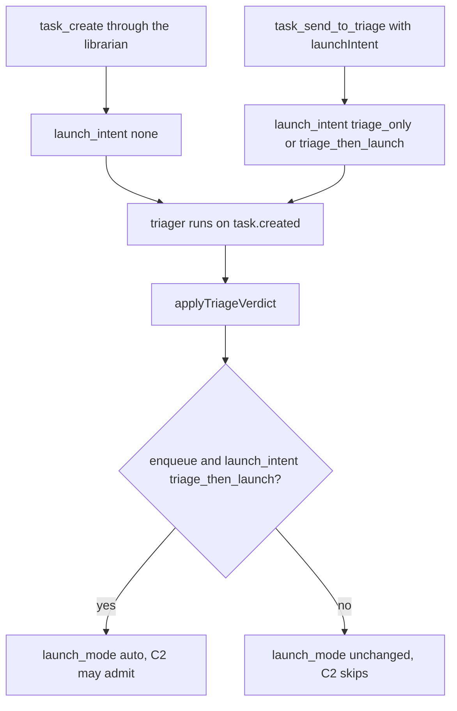
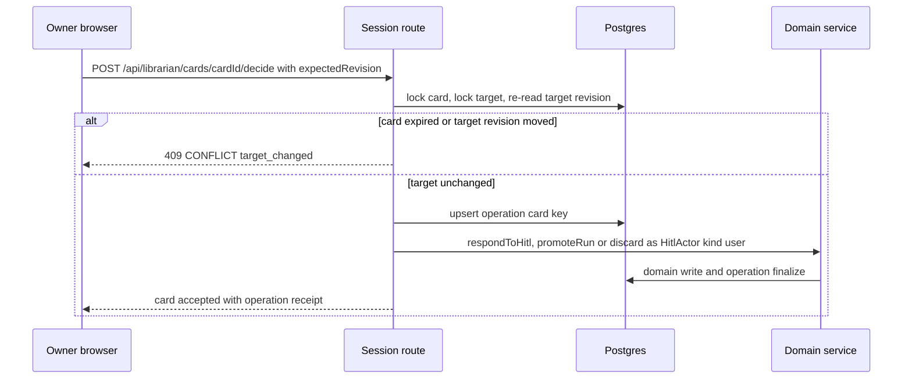
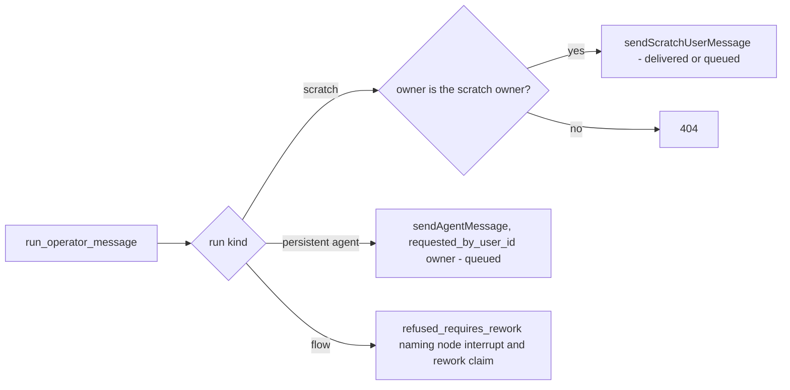
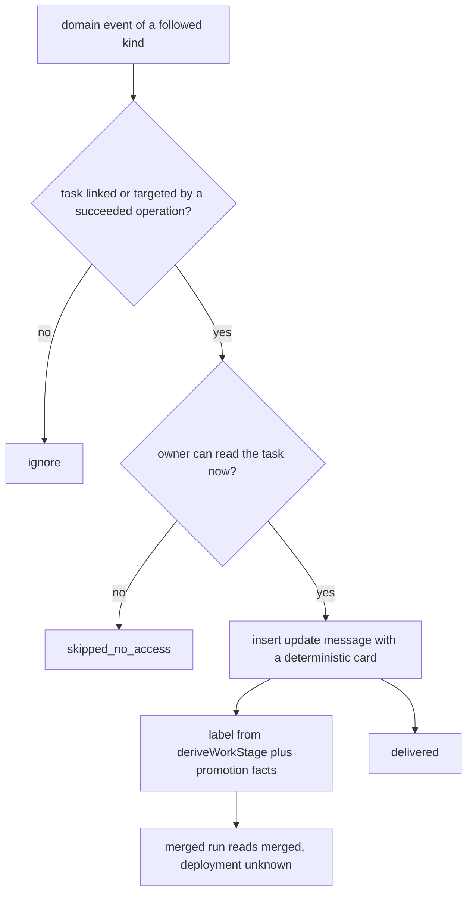

# Librarian operations

## Purpose

The **effects** the librarian causes and how each is made observable, idempotent and
recoverable: the operation ledger and its `Idempotency-Key` contract, batches, the
launch intent a librarian-created task carries through triage, launch and
existing-work actions, the operator-message seam, proposal and confirmation cards for
human-only or ambiguous actions, and the deduplicated follow-up updates that return
outcomes to the conversation. The domain owns `librarian_operations`,
`librarian_cards`, `tasks.launch_intent`, the operator-message route, the
`librarian_followup` domain-event consumer and `librarian_updates`. It does **not**
own the domains the effects land in — tasks, triage, runs, HITL, promotion
([`tasks.md`](tasks.md), [`triage.md`](triage.md), [`runs.md`](runs.md),
[`hitl.md`](hitl.md)) — nor the token checks
([`librarian-authority.md`](librarian-authority.md)) or statement content
([`task-statements.md`](task-statements.md)). A lost response means reconciliation
until the domain outcome is known, never a repeated effect. The decision is
[ADR-185](../decisions.md#adr-185-librarian-operation-ledger-confirmation-cards-and-launch-intent).
The whole domain is **Designed**.

## Domain entities

- **`librarian_operations`** (persisted, Designed) — one row per effect:
  `idempotency_key` (UNIQUE `librarian_operations_key_uq` per conversation), `kind`,
  `request_digest`, `target`, `status`, `result`, `error_code`, `segment_id`,
  `turn_id`, `card_id`. See the [librarian ERD](../db/librarian-domain.md).
- **Idempotency key** (Designed) — the effectful MCP tools' `operationKey` argument,
  sent by the facade as the `Idempotency-Key` header; `handleExt` gains
  `idempotency: "required"`.
- **Request digest** (Designed) — canonical JSON (sorted keys, arrays in order) of the
  route's validated body minus the key.
- **Result columns** (persisted, Designed) — UNIQUE nullable
  `tasks.created_via_operation_id`, `task_comments.via_operation_id`,
  `task_clarifications.requested_via_operation_id`, `runs.librarian_operation_id`;
  the reconcile lookup key of an unsettled operation.
- **Batch receipt** (Designed) — one operation per item, per-item status and
  dependencies.
- **`tasks.launch_intent`** (persisted, Designed) — `none | triage_only |
  triage_then_launch`; NULL keeps today's behaviour on every non-librarian path.
- **Operator-message outcome** (Designed) — `delivered | queued |
  refused_requires_rework` from `POST /api/v1/ext/runs/{runId}/operator-message`.
- **`librarian_cards`** (persisted, Designed) — `kind`
  (`statement_proposal | confirmation | memory_suggestion`), `status`, `target`,
  `target_revision`, `payload_digest`, `requires_owner`, `expires_at`
  (`MAISTER_LIBRARIAN_CONFIRMATION_TTL_MINUTES`).
- **`librarian_followup`** consumer (Designed) — a `DOMAIN_EVENT_CONSUMERS` member
  over the run, gate and clarification event kinds; a task is followed when a
  `librarian_task_links` row or a succeeded operation targets it.
- **`librarian_updates`** (persisted, Designed) — UNIQUE
  `librarian_updates_event_uq (conversation_id, domain_event_id)`, `status`,
  `attempts`, `last_error_code`, `message_id`.

## State machine

The operation machine. `unknown` leaves only through reconcile, which reads the
result column rather than re-issuing the effect (Designed).

The card machine. A decision is taken once, under the card row lock with a status
CAS; the reset barrier clears every pending card of the old segment (Designed).

The update-delivery machine. At-least-once dispatch is made idempotent by the unique
key; a poison event ends `failed` and never stalls the consumer cursor (Designed).

## Process flows

An effectful librarian request. The operation commits before the effect, and the
finalize rides `recordRequiredTokenAudit` in the route's own transaction, so a DB-only
effect and its operation result commit or roll back together (Designed).

Reconciling an unsettled operation. The lookup on the result column is the only
recovery; an operation older than `MAISTER_LIBRARIAN_OPERATION_RECONCILE_SECONDS`
also holds the next turn's admission (Designed).

Launch intent through triage. Creating a task never arms automatic launch; only an
explicit `triage_then_launch` does. A human Launch click ignores intent (Designed).

Deciding a card. The server re-reads the target under lock and executes through the
same domain service the existing UI uses, as the user, under operation key
`card:<cardId>` so a double click is one effect (Designed).

The operator-message seam routes by run kind and never impersonates a coordinator
(Designed).

Follow-up delivery. The card is deterministic — no model turn, no tokens — and reads
live run status at render; Explain on it enqueues a read-only `explain` turn
(Designed).

## Expectations

- **LOP-01:** Every effectful librarian request MUST carry an `Idempotency-Key`, the operation row MUST commit before the effect, and the finalize MUST ride `recordRequiredTokenAudit` inside the route's transaction so a DB-only effect and its operation result commit together, enforced by the `handleExt` option `idempotency: "required"` (Designed).
- **LOP-02:** Same key and same canonical digest MUST return the stored result, same key with a different digest MUST refuse `CONFLICT{reason:"idempotency_payload_mismatch"}`, and a new key whose digest matches a succeeded operation in the same segment MUST refuse `CONFLICT{reason:"duplicate_of_operation"}` unless `allowDuplicate`, enforced by UNIQUE `librarian_operations_key_uq` (Designed).
- **LOP-03:** An operation with an unknown outcome MUST be settled by lookup on its result column (`via_operation_id` / `librarian_operation_id`) and NEVER re-issued, and a turn MUST NOT be admitted while the conversation has an `admitted` operation older than `MAISTER_LIBRARIAN_OPERATION_RECONCILE_SECONDS`, enforced by the UNIQUE result columns and the admission gate (Designed).
- **LOP-04:** Each batch item MUST be its own operation, the receipt MUST list per-item status, and a retry MUST re-submit only non-terminal items, enforced by one `librarian_operations` row per item (Designed).
- **LOP-05:** A task created through the librarian MUST get `launch_intent='none'`, and under `none` a triage verdict MUST NEVER arm `launch_mode='auto'` and C2 MUST NEVER admit the task, enforced by `applyTriageVerdict` and `scheduler/c2-eligibility.ts` (Designed).
- **LOP-06:** Send-to-triage MUST record `launch_intent` ∈ {`triage_only`, `triage_then_launch`}, and `applyTriageVerdict` MUST arm auto-launch only under `triage_then_launch`, enforced by the `send-to-triage` ext route writing the intent in the `sendTaskToTriage` transaction (Designed).
- **LOP-07:** A librarian launch MUST return the actual run id and `Pending` or `Running`, admission MUST use `launchRun` preconditions unchanged, and `runs.librarian_operation_id` MUST be written in the run's insert transaction, enforced by UNIQUE `runs_librarian_operation_uq` (Designed).
- **LOP-08:** A confirmation card MUST bind kind, target ids, target revision (task revision, run head SHA, HITL id) and payload digest, and deciding a stale or expired card MUST refuse `CONFLICT{reason:"target_changed"}`, enforced by the locked re-read in `POST /api/librarian/cards/{cardId}/decide` (Designed).
- **LOP-09:** Human-only actions (human HITL answers, promotion, discard) MUST run only from the owner's confirmation click through a session route as `HitlActor{kind:"user"}`, enforced by the card decide route calling `respondToHitl`, `promoteRun` and the discard service (Designed).
- **LOP-10:** An operator message to an existing run MUST return exactly one of `delivered`, `queued`, `refused_requires_rework` and MUST NEVER use `runs:delegate`, enforced by `POST /api/v1/ext/runs/{runId}/operator-message` (Designed).
- **LOP-11:** A follow-up update MUST be unique per `(conversation_id, domain_event_id)`, MUST be inserted only while the owner can read the task, and MUST render as a deterministic card without a model turn, enforced by UNIQUE `librarian_updates_event_uq` in the `librarian_followup` consumer (Designed).
- **LOP-12:** A failed update delivery MUST retry at most 5 times and then record `failed` with evidence, and delivery MUST NEVER repeat the business effect, enforced by `librarian_updates.attempts` and CHECK `librarian_updates_failed_has_error_check` (Designed).

## Edge cases

- **EDGE-LOP-01:** The response is lost after a task create — the retry with the same `operationKey` returns the stored result, a racing retry hits UNIQUE `tasks_created_via_operation_uq` and returns the existing task, and a changed body under that key refuses [`MaisterError("CONFLICT")`](../error-taxonomy.md#codes) `idempotency_payload_mismatch` (Designed).
- **EDGE-LOP-02:** A batch where item 2 fails — item 1 stays created and linked, item 2 records `refused` with its code (a dependency refusal is [`MaisterError("PRECONDITION")`](../error-taxonomy.md#codes)), the receipt lists both, and a retry re-issues item 2 only (Designed).
- **EDGE-LOP-03:** A launch refused by cap or dependency — a full pool is not a refusal: the launch returns `Pending` with its queue position; a blocking dependency refuses [`MaisterError("PRECONDITION")`](../error-taxonomy.md#codes) through the unchanged `launchRun` preconditions and the operation records `refused` (Designed).
- **EDGE-LOP-04:** The triager says enqueue under `launch_intent='none'` — the verdict is recorded, `launch_mode` stays NULL and C2 admits nothing, with no error raised; a later human Launch click ignores intent and runs its own [`MaisterError("PRECONDITION")`](../error-taxonomy.md#codes) checks (Designed).

## Linked artifacts

- [ADR-185 — operation ledger, cards and launch intent](../decisions.md#adr-185-librarian-operation-ledger-confirmation-cards-and-launch-intent) · [record](../decisions/adr-185.md)
- [ADR-184 — librarian delegated authority](../decisions.md#adr-184-librarian-delegated-authority-per-turn-owner-bound-tokens-with-live-rbac) · [ADR-160](../decisions.md#adr-160) · [ADR-161](../decisions.md#adr-161)
- [Librarian requirement traceability](librarian-traceability.md)
- [Product brief — personal librarian](../pv/personal-librarian.md)
- [Librarian ERD](../db/librarian-domain.md)
- [Triage](triage.md) · [Tasks](tasks.md) · [HITL](hitl.md) · [Run continuation](run-continuation.md) · [Domain events](domain-events.md) · [Work stages](work-stages.md) · [External operations](external-operations.md)
- [`web/lib/tokens/ext-handler.ts`](../../web/lib/tokens/ext-handler.ts) · [`web/lib/services/triage.ts`](../../web/lib/services/triage.ts) · [`web/lib/scheduler/c2-eligibility.ts`](../../web/lib/scheduler/c2-eligibility.ts) · [`web/lib/services/hitl.ts`](../../web/lib/services/hitl.ts)
- [`web/lib/domain-events/consumers.ts`](../../web/lib/domain-events/consumers.ts) · [`web/lib/domain-events/taxonomy.ts`](../../web/lib/domain-events/taxonomy.ts) · [`mcp/src/tools.ts`](../../mcp/src/tools.ts)
