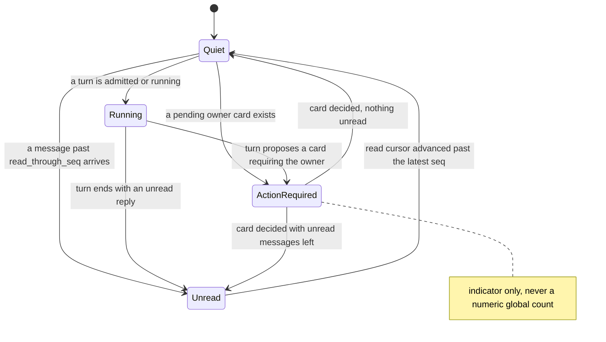
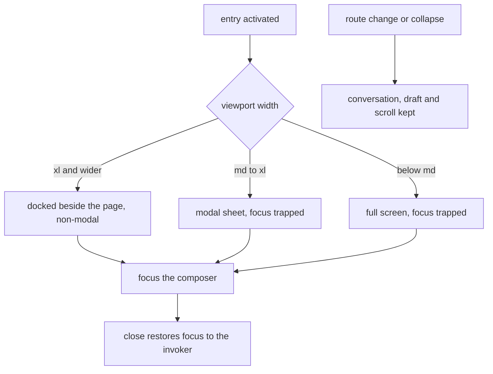
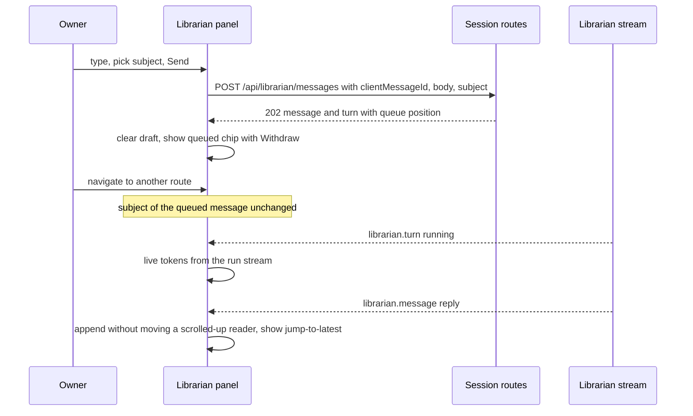
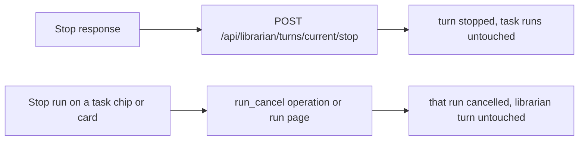

# Librarian surface

## Purpose

The **librarian's place in the application shell**: a persistent top-navigation
entry with a small state indicator, and a right-side panel mounted once in the
authenticated layout that survives route changes. The domain owns the entry and its
indicator semantics, the panel's presentation modes by breakpoint, focus and scroll
behaviour, the subject captured with each message, the Needs attention / Related work
region, the composer's controls and their disabled reasons, keyboard coexistence with
the scratch launcher, and the `librarian` i18n namespace. It does **not** own the
conversation records or turn lifecycle
([`librarian-conversation.md`](librarian-conversation.md)), card semantics
([`librarian-operations.md`](librarian-operations.md)), or the global counters
([`attention.md`](attention.md)); the panel's regions, roles and states are laid out
in the [screen reference](../screens/chrome/librarian-panel.md). The panel never
absorbs the Studio assistant's or a scratch run's history — each composer keeps its
own identity and focus owner. The decision is
[ADR-189](../decisions.md#adr-189-librarian-surface-top-navigation-entry-and-right-side-panel).
The whole domain is **Designed**.

## Domain entities

- **Top-nav entry** (Designed) — `web/components/librarian/librarian-trigger.tsx` in
  the right group of `top-nav.tsx`; icon plus label where space permits, an
  accessible icon when compact.
- **Indicator** (Designed) — one of `running | unread | action_required`, or none;
  `unread` from `librarian_conversations.read_through_seq`, `action_required` from
  pending owner cards; never a number.
- **Panel** (Designed) — `web/components/librarian/librarian-panel.tsx`, mounted in
  `web/app/(app)/layout.tsx`: docked non-modal at ≥ `xl`, modal sheet at
  `md`–`xl`, full screen below `md`; an expanded reading mode for long statements.
  Two more rules from `librarianPanelMode` ([ADR-189](../decisions.md#adr-189) D4,
  D6): on the wide routes (`/runs/`, `/studio/edit/`, `/studio/local`) it docks only
  at ≥ `2xl`, and while another assistant composer (scratch, Studio AI) is visible
  it opens as the sheet, so two composers are never side by side.
- **Message list** (Designed) — built on `TranscriptView`; live tokens of the active
  turn via `useRunStream` on its run; jump-to-latest when the reader has scrolled up.
- **Subject chip** (Designed) — **General / Общий вопрос** or the selected task(s);
  stored on the message at send (`librarian_messages.subject`).
- **Composer** (Designed) — Send, Stop response, queued-message chips with Withdraw,
  Reset context and Memory entries; draft persisted per user in `localStorage` inside
  try/catch.
- **Needs attention / Related work region** (Designed) — live domain reads from
  `getLinkedWork`, never copied chat text.
- **`librarian` i18n namespace** (Designed) — `web/messages/en.json` and `ru.json`,
  distinct copy in both.

## State machine

The indicator is derived per read, so this diagram describes precedence rather than a
persisted machine: an action owed by the owner outranks a running response, which
outranks unread results (Designed).

## Process flows

Presentation mode follows the viewport; the conversation, draft and scroll position
belong to the layout-level panel and survive every switch (Designed).

Sending from the panel. The subject travels with the message, so navigating away
cannot retarget it; the stream refreshes the list and the indicator (Designed).

Two stop controls, never merged: one ends the librarian's response, the other is a
run action on launched work and is offered only through its own named control
(Designed).

## Expectations

- **LUI-01:** The top-nav entry MUST render on every `(app)` route with an accessible name and an indicator of `running | unread | action_required`, and MUST NEVER show a numeric global count, enforced by `librarian-trigger.tsx` in `top-nav.tsx` (Designed).
- **LUI-02:** The panel MUST be mounted in `(app)/layout.tsx`, navigation and collapse MUST preserve conversation, draft and scroll, and reload MUST restore messages and pending operations, enforced by `librarian-panel.tsx` (Designed).
- **LUI-03:** The panel MUST be docked non-modal at ≥ `xl`, a modal sheet at `md`–`xl` and full screen below `md`, and at 390 px it MUST show no horizontal overflow with Send visible, enforced by the panel's breakpoint layout (Designed).
- **LUI-04:** A message MUST store its subject at send time, and a route change MUST NEVER retarget a queued message or a pending card, enforced by `librarian_messages.subject` written in `appendOwnerMessage` (Designed).
- **LUI-05:** Opening MUST focus the composer, closing MUST restore focus to the invoker, and modal modes MUST trap focus, enforced by `useModalFocusTrap` (Designed).
- **LUI-06:** Arriving messages MUST NEVER move a reader who scrolled up, and a jump-to-latest control MUST appear, enforced by the panel's message list (Designed).
- **LUI-07:** "Stop response" and "Stop run" MUST be distinct named controls, and every disabled control MUST state its reason, enforced by the panel composer and card controls (Designed).
- **LUI-08:** Every string in the `librarian` namespace MUST exist in EN and RU with distinct copy, enforced by `web/messages/en.json` and `web/messages/ru.json` (Designed).
- **LUI-09:** The librarian MUST bind no Cmd/Ctrl+K, and the scratch shortcut MUST still work while the panel is docked, enforced by the panel registering no key binding (Designed).
- **LUI-10:** The Needs attention / Related work region MUST render from live domain reads, enforced by `getLinkedWork` in `web/lib/librarian/read-models.ts` (Designed).

## Edge cases

No `EDGE-LUI` ids are declared; the surface renders the conversation domain's refusals
as visible states rather than adding its own:

- The librarian disabled by an admin shows the entry with a disabled composer whose reason names the setting — the admission refusal [`MaisterError("CONFIG")`](../error-taxonomy.md#codes) (Designed).
- No ready runner shows the same disabled composer with the runner reason — [`MaisterError("EXECUTOR_UNAVAILABLE")`](../error-taxonomy.md#codes) (Designed).
- An exhausted daily turn cap or a turn past its deadline shows the budget state and keeps the draft — [`MaisterError("BUDGET_EXCEEDED")`](../error-taxonomy.md#codes) (Designed).
- A card whose target moved shows the refusal and the current target instead of a success glyph — [`MaisterError("CONFLICT")`](../error-taxonomy.md#codes) `target_changed` (Designed).

## Linked artifacts

- [ADR-189 — librarian surface](../decisions.md#adr-189-librarian-surface-top-navigation-entry-and-right-side-panel) · [record](../decisions/adr-189.md)
- [ADR-172 — home navigation](../decisions.md#adr-172) · [ADR-169 — attention counters](../decisions.md#adr-169)
- [Librarian requirement traceability](librarian-traceability.md)
- [Product brief — personal librarian](../pv/personal-librarian.md)
- [Screen reference — librarian panel](../screens/chrome/librarian-panel.md) · [Screen reference — top nav](../screens/chrome/top-nav.md)
- [Attention](attention.md) · [Home navigation](home-navigation.md) · [Scratch runs](scratch-runs.md)
- [`web/components/chrome/top-nav.tsx`](../../web/components/chrome/top-nav.tsx) · [`web/components/run-transcript/transcript-view.tsx`](../../web/components/run-transcript/transcript-view.tsx) · `web/app/(app)/layout.tsx` (the panel's mount point)
