# Local packages (Flow Studio Phase C)

> Behavior SSOT for **editable local packages** — a platform-scoped, git-backed
> working directory a member authors/forks artifacts in, edits in Flow Studio
> under a session lock, and **cuts versions** from into the existing
> package-install substrate. **Status: Implemented (ADR-096 base; ADR-105 Stream A; ADR-107/110 Stream B — version-adopt launch + PR-to-source, migration 0078); the tabbed composition-view editor IA is ADR-116 — Implemented (web-only, no migration); the fork loop — `try_once` per-run pin, upstream divergence view, upstream sync, publish base branch + sync-first refusal — is ADR-132, Implemented (migration 0097). Canonical Create Flow is Implemented; it adds a durable local-package operation claim and does not create a DB-authored Flow model.** Surface:
> [`../screens/studio/README.md`](../screens/studio/README.md) §Local workspace +
> [`../screens/studio/editor.md`](../screens/studio/editor.md). Data:
> [`../db/projects-domain.md`](../db/projects-domain.md).

## Purpose

A **local package** is a platform-scoped working copy of a package: a mutable,
git-backed directory on the host that a member authors artifacts in (flows,
agents, skills, MCP templates, rules, schemas) or forks from an installed git
package, edits in Flow Studio, and **cuts immutable versions** from. A "cut"
reuses the *existing* installer (`installPackageRevision({ version: "local" })`)
to produce a `local-<digest>` `package_installs` revision that a project member
then attaches — so local packages plug into the same install → attach → run
pipeline as git packages (Variant B), without re-scoping the project-keyed
`authored_capabilities` drafts table.

Boundary: this domain owns the `local_packages` table, its working directory,
the session edit-lock, the cut/move operations, the fork↔upstream loop
(divergence view, upstream sync, PR-to-source publish — ADR-113/129), and the
per-run `try_once` pin choice at launch. It does NOT own the
install/attach/trust machinery (that is [`packages.md`](packages.md), reused).

## Domain entities

- **`local_packages`** (persisted — [`../db/projects-domain.md`](../db/projects-domain.md)):
  one row per local package, pointing at a `working_dir`. Carries fork lineage
  (`source_install_id`, `source_repo_url`, `source_ref`, `branch_name`), the most
  recent cut (`last_cut_install_id`), the session lock (`locked_by_user_id`,
  `locked_by_session`, `lock_expires_at`), and the durable upstream-sync intent
  `sync_state` (jsonb NULL, ADR-132 —
  `{targetInstallId, targetRef, conflictedFiles: string[], startedAt}`;
  `NULL` = no sync in flight).
- **Per-project default ("virtual") local package** (ADR-096): a
  `local_packages` row with `is_default = true` and a non-NULL `project_id`. It
  is the landing spot for **element-level forks** — a member who forks one flow /
  skill / agent / rule out of an installed package does not name a package; the
  element drops into their project's single default, created on first use. The
  partial-unique index `local_packages_default_per_project`
  (`(project_id) WHERE is_default`) enforces at most one default per project; the
  FK is `ON DELETE CASCADE` (a deleted project drops its default). Named,
  platform-scoped local packages keep `project_id = NULL`, `is_default = false`.
- **Working directory** (`working_dir`, server-only): a git-backed dir under
  `localPackagesRoot()` holding `maister-package.yaml` + the kind dirs
  (`flows/ agents/ skills/ mcps/ rules/ schemas/`). Edited in place by the Studio
  file/graph editors.
- **Cut version**: an immutable `local-<digest>` `package_installs` row produced
  by the installer over a clean export of `working_dir`. A reused entity
  ([`packages.md`](packages.md)).
- **Session edit-lock**: a `(locked_by_session, lock_expires_at)` claim on a
  `local_packages` row; mirrors the `runs.keepalive_until` TTL pattern.
- **Reused**: `package_installs`, `project_package_attachments`, the installer,
  `resolveTrust`, the Phase B `FlowEditorTabs` seam, `lib/worktree.ts` git
  primitives, and the platform MCP catalog (`platform_mcp_servers`,
  [`mcp-management.md`](mcp-management.md)) the MCP-template editor sources from.

## State machine

Package lifecycle:

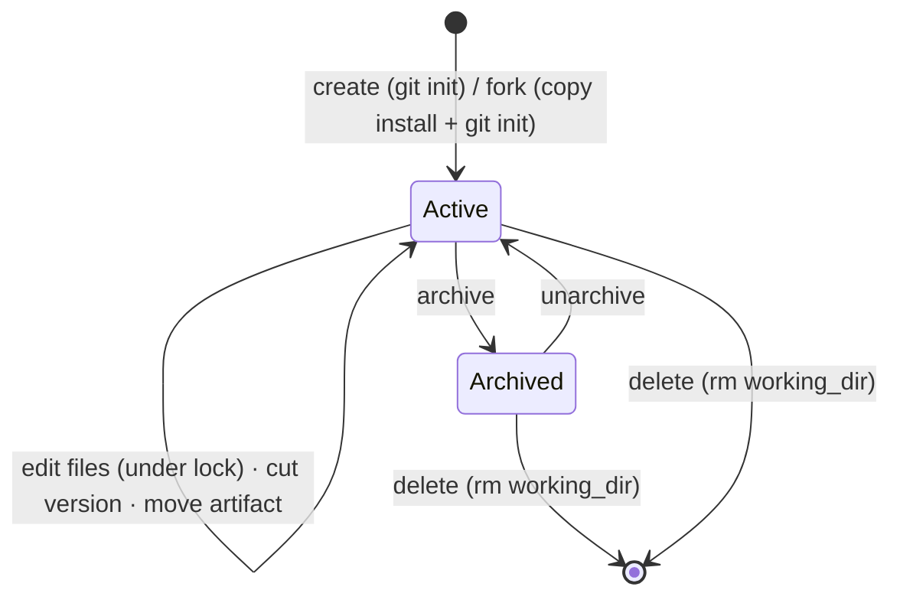

Per-package session edit-lock:

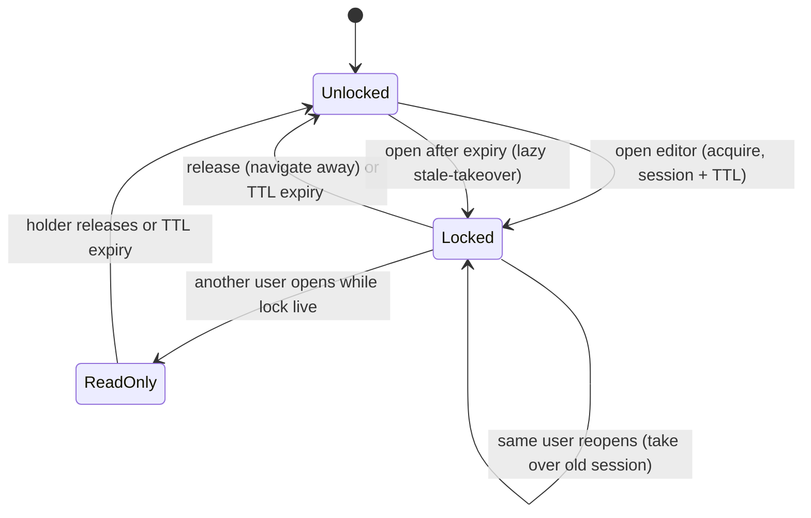

## Process flows

Create from scratch, or fork an installed package (two grains):

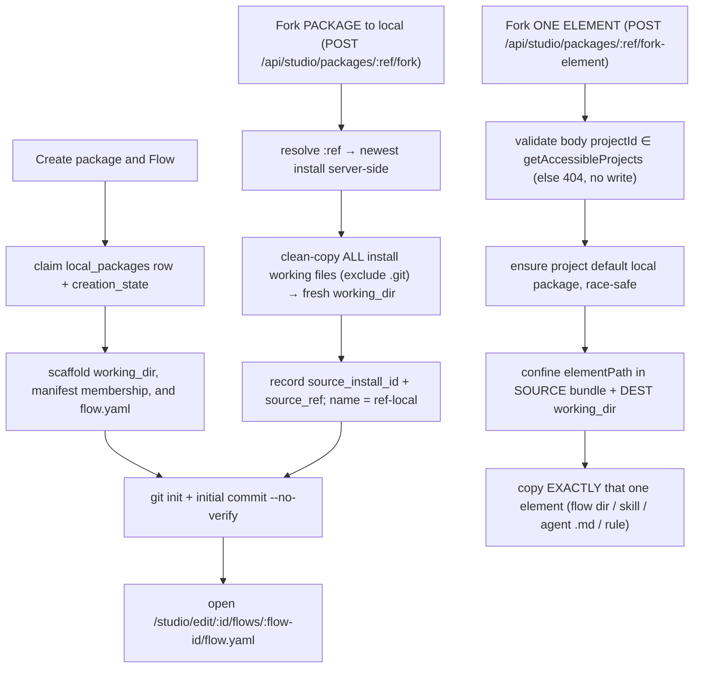

**Fork mechanism (finalized):** a fork **copies the installed revision's
on-disk content** (`package_installs.installedPath`, server-only) excluding any
`.git`/VCS dir, then `git init`s the destination fresh — it does NOT re-clone the
upstream source or reuse its history (a clone-source variant was rejected: the
install bytes are already content-addressed and present, so a copy is
deterministic and credential-free). A package fork copies the whole bundle into
a NEW `<ref>-local` package; an element fork copies exactly one confined element
into the project's default. **Neither executes anything** — no `setup.sh`, no MCP
spawn. A missing/unreadable source bundle → `CONFIG`, nothing persisted.

**Element-fork project selection:** the element fork is the only fork that names
a project, because its destination is that project's default package. The
`projectId` is body-controlled, so it is validated against the caller's
`getAccessibleProjects(userId, role)` set (admin → all non-archived; member →
their memberships) — an unknown or inaccessible project is a 404 with no write,
and the default is never created. The package fork takes no project (its output
is platform-scoped and named).

**Default-package race ("create on first use"):** the first element fork for a
project has no default yet. The ensure step scaffolds + `git init`s a working
dir, then `insert(...).onConflictDoNothing()` on the partial-unique
`(project_id) WHERE is_default`; a concurrent racer that lost re-selects the
winner's row and `rm`s its own orphan scaffold — never a read-then-write SELECT
(no TOCTOU).

Edit + save under the lock:

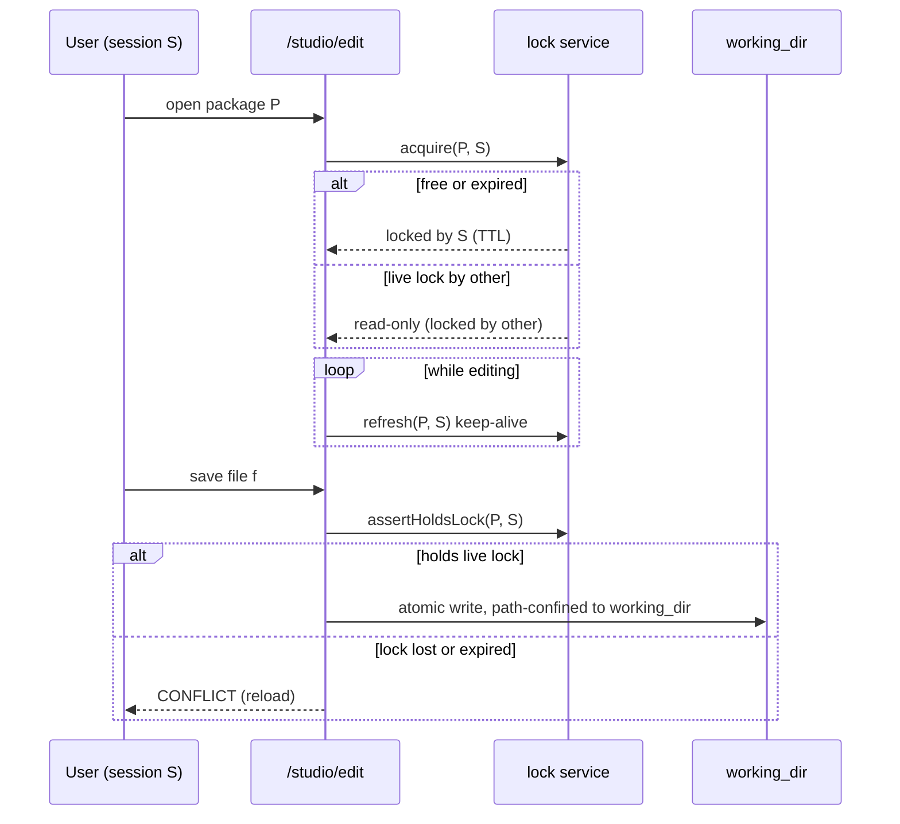

Cut a version and (optionally) attach to a project:

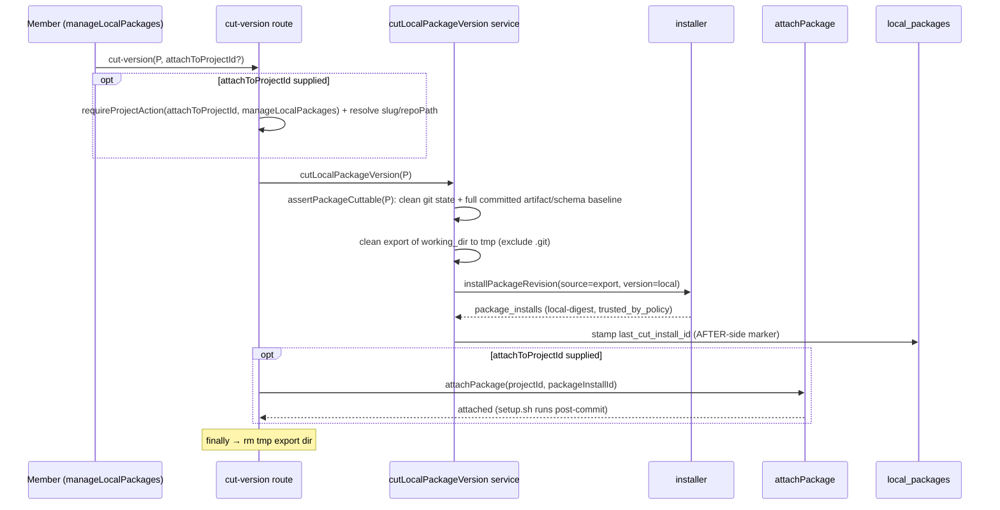

The attach gate (`manageLocalPackages` on `attachToProjectId`) is evaluated
**before** the irreversible export+install, so an inaccessible attach target
never leaves a cut install behind. The tmp export dir is removed in a `finally`.

**Batch import.** `POST /api/studio/local-packages/:id/import`
(`multipart/form-data`) accepts a **folder** (files with relative paths) or one
**zip / tar.gz** archive. `mode=preview` returns the resolved tree without
writing (no lock); `mode=commit` asserts the session edit-lock, then writes.
Safety is **validate-all-then-write**: every entry is confined — `..` rejected
on the **original** segments (POSIX `../` + Windows `..\`, plus absolute /
drive-letter / NUL) BEFORE normalization, then `resolveWithinWorkingDir`
(`.git`/symlink/abs) — and the caps
(`MAISTER_IMPORT_MAX_{BYTES,ENTRIES,FILE_BYTES}`, defaults 50 MiB / 2000 /
10 MiB) are enforced; the archive blob is capped BEFORE parsing (zip-bomb
defense). A single violation rejects the whole import pre-write, so the working
dir is left UNCHANGED. Only regular files are written — tar dirs/symlinks/devices
are skipped at the source, closing the tar-symlink escape vector.

**Git-backed diff + Commit/Discard.** The working dir is a git repo, so
every edit (form / YAML / import / AI) is a working-tree change. `GET
/api/studio/local-packages/:id/diff` returns the uncommitted
working-tree-vs-`HEAD` diff (2-dot, incl. untracked) as a `@git-diff-view` DTO +
a changed-count (a `truncated` flag degrades an oversized diff to summary-only —
never silently). `POST .../commit` (lock-guarded; `git add -A` + `git commit`,
optional message) clears the count; `POST .../discard` (lock-guarded; body
`paths[]` confined BEFORE git, omitted → all) restores to `HEAD`. All three work
with NO AI session present.

## Canonical Create Flow journey (Implemented)

Studio Packages and Local Packages expose **Create package and Flow**.
One dialog collects package name, Flow ID, display title,
`metadata.summary`, and `metadata.route_when`; labels, links, and sources are
optional Flow metadata. Success creates `maister-package.yaml` membership and
`flows/<flow-id>/flow.yaml`, then opens that Flow in the existing local-package
editor. The package's initial Git commit contains both files. From an editable
package home, **Add Flow** invokes the same dialog and leaves the working tree
dirty for the existing Commit action. It is repeatable for every additional
Flow, not only a package's first Flow.

The generated Flow is graph-only and starts with an `ai_coding` node whose
`success` target is the implicit `done` terminal. It sets `schemaVersion: 1`,
`name` to the machine ID, `metadata.title` to the display title,
`compat.engine_min: "3.0.0"`, and empty capabilities/artifacts. It does not
run `setup.sh`, hooks, MCPs, installer code, or Flow nodes; Git uses
`--no-verify`.

### Durable recovery and serialization

The feature adds nullable `local_packages.creation_state` JSONB. It contains
only operation ID, kind, phase, Flow ID, and hashes; filesystem payloads and
backups remain in a private, Git-excluded journal. This is operation recovery
state, not another authored Flow store. A pending state serializes writers with
the existing mutation lease. A fresh package is assembled in an operation-owned
private staging directory and atomically renamed into its final working
directory only after the journal, package bytes, and initial Git commit exist.
Deterministic recovery may finalize exact hashes or clear an exact
original/compensated state. If a process dies after the DB claim but before the
private journal is atomically written, recovery removes only the unfinished row
and its private stage, returns `rolled_back`, and directs the user to restart;
it never adopts or deletes a final working directory. Drift becomes a visible
localized recovery-required state and is never overwritten.

Normal writer order is member authorization/edit lock, mutation lease, reload,
write/validate, release. Add Flow refuses while a local-package assistant can
write. Pending/recovery-required packages are read-safe but cannot be mutated,
Committed, Cut, archived, or deleted. Existing immutable cuts remain usable for
Attach/Repoint because they do not read the working directory.

Existing empty packages are still valid, cuttable, and attachable. They receive
a localized **No Flow yet** state with Add Flow rather than a silent dead end.
Only the public scratch-create route becomes Flow-required; default/fork
internals can retain intentionally empty packages.

### Canonical HTTP boundary

- `POST /api/studio/local-packages` accepts only `{name, flow}`; the server
  derives creator, package ID, slug, working directory, branch, and operation.
- `POST /api/studio/local-packages/{id}/flows` accepts only `{sessionId, flow}`;
  URL `{id}` resolves the server package and `sessionId` is checked against its
  edit lock. Its localized Flow wizard consumes only a fixed safe refusal enum
  for duplicate ID, lock, assistant, recovery, or mutation-lease conflicts;
  generic clients never render a server error message.
- `POST /api/studio/local-packages/{id}/creation-recovery` accepts no body and
  only retries deterministic reconciliation. It never accepts a repair payload.
  It returns `200 {recoveryStatus:"rolled_back"}` for the safe pre-journal
  compensation boundary and `400 CONFIG` for a malformed private journal.

No response exposes a working directory, journal, or package content. The
existing collection `sourceInstallId` fork contract is stale; package forks keep
their dedicated endpoint. The documented file move endpoint has no route and
will be removed from OpenAPI rather than represented as implemented.

## Package-authoring Stream A — first-class authoring (Implemented, ADR-105)

Stream A is **web-only** (no migration, no new `MaisterError` code) and finishes
the in-app authoring surface the ADR-096 base started. The canonical Create Flow
wizard now covers both a new local package plus its initial Flow and another
Flow in an existing editable package; it never creates a DB-only authored Flow.

**Centralized model + per-project version pins.** Packages stay **instance-level**
and Studio-edited (platform-scoping, ADR-096/097, stands — project-scoping was
evaluated and rejected: it fights reuse). A project consumes a package at a **cut
version** (a pin), never a live edit; editing in Studio produces new cuts, and at
launch a project adopts a newer cut or keeps its pin (the adopt path is **Stream
B**, [`../decisions.md`](../decisions.md) ADR-107). Cross-project divergence is
rare + explicit — see "Customize for this project" below — so conflicts never
arise in the default flow.

**Package manifest form (`manifest` kind).** `maister-package.yaml` becomes a
first-class authored kind with a `PackageManifestForm` (name/description/version +
the kind lists) plus a raw-YAML toggle; a strict parse failure → `CONFIG`. Adding
`manifest` to `AuthoredFlowPackageFileKind` is an **8-site union fan-out** (label
map, en/ru `flows.packageFileKind`, content-editor dispatch, code-editor kind +
language, `SUPPORTED_FILE_KINDS`, the path classifier, `artifact-validate`). The
editor lands on a **package-home** overview (manifest form + file tree) when no
flow file is selected — not the empty flow canvas — which removes the spurious
"YAML is invalid" banner and the rework-empty symptom, with a real **End edit**
(release lock + navigate) and a correct initial `heldByMe`.

**Fork dedup + "Customize for this project."** `forkPackageToLocal` checks for an
existing fork by `source_install_id` before INSERTing: an existing fork returns
`{ localPackageId, alreadyExists: true }` (HTTP **200**) and the UI navigates to it
(+ an explicit "Fork a new copy"); a fresh fork is **201**. **"Customize"** is the
same whole-package fork forced fresh (`forceNew`) with an origin-reflecting name
`<ref> (custom)` — a name convention, **no schema field**, and **no project
target** (owner reframe: packages are centralized, edited in one place). The
project-side attach of a copy is Stream B.

**List management.** The local-packages list gains Delete (confirm; also `rm`s the
working dir), Rename, Archive/unarchive (archived hidden behind a toggle), Open,
and Cut-version — all over routes that already exist; the `LocalPackageListItem`
DTO is extended to carry the needed state. Archive and Delete refuse while any
local-package assistant run is live or recoverable (including `Crashed`), so an
expired editor lock can never hide an ACP session before a status cascade or
working-dir removal.

**Commit is the validation gate.** A prominent top-bar **"Commit state"** action +
dirty indicator; **every** commit entry point (the diff-drawer Commit and
Commit-state) routes through `validatePackageArtifacts` (NEW
`web/lib/local-packages/validate.ts`), which validates the **changed** artifacts in
the commit — already-committed artifacts are assumed valid — covering flow.yaml
parse+compile, manifest parse, platform-agent strict frontmatter, subagent lenient
frontmatter, and skill `SKILL.md` presence, and **hard-blocks** the commit on any
invalid artifact (`PRECONDITION`/`CONFIG`) with an error list. Schema lifecycle
validation is cross-file: malformed changed schema JSON always blocks; a
grammar-invalid schema blocks when referenced by any flow or newly referenced by a
changed flow; an unreferenced grammar-invalid schema remains advisory; missing,
deleted, escaping, or non-root references block the affected commit. A form or
output schema reference resolves only to one package-root
`schemas/<name>.json` file (no nested or arbitrary package-relative path);
Studio writes canonical `./schemas/<name>.json`, while the legacy bare form is
normalized to the same path. Cut and Publish call
`assertPackageCuttable` before export/push, revalidating the entire clean committed
baseline so a legacy invalid reference cannot escape through lifecycle actions.
During package install, when a package provides root `schemas/` artifacts, the
validated directory is copied into each member flow revision before that revision
becomes `Installed`; the runtime therefore resolves the same
`./schemas/<name>.json` path within its flow-revision root. A pre-existing member
`schemas/` file must be byte-identical to the package-root source or the install
fails rather than overwriting it. A legacy package with no root schema artifacts
keeps its member-flow `schemas/` files so that an old installed version cannot
block a project from adopting a newer package version; each referenced file is
still parsed and validated. Local-package authoring and cuts remain root-schema
only.
Because a launch needs a committed state, an invalid artifact is inherently
un-launchable; WIP lives in the uncommitted, lock-preserved working dir. A shared
`ChangeReviewDialog` (diff + editable, prefilled commit message) is introduced
here; Stream B's PR-to-source adds a **sibling `PublishDialog`** modeled on its
modal pattern (the commit dialog itself is not extended — see ADR-113).

## Package-authoring Stream B — version-adopt launch + PR-to-source (Implemented — ADR-107/110)

Stream B is the **runtime + publish** half of the Studio package-authoring work
and owns **migration 0078** — the only schema change in its runtime. It closes
two gaps left by Stream A's
centralized model: a project can pick up a **newer cut** of a package it pins, and a
member can **propose a local package's edits upstream** as a PR.

### Source link on the cut (migration 0078)

A project's attachment is an immutable `package_installs` row; a centralized package
is a mutable `local_packages` working dir. Today the only edge is the **forward**
`local_packages.last_cut_install_id` (package → its newest cut) — an attached install
does not know which local package + commit it was cut from. Migration 0078 adds the
**back-edge** plus the publish markers:

- `package_installs.source_local_package_id` — FK → `local_packages.id`
  (`ON DELETE SET NULL`); set when the Studio `cut-version` path mints the install.
- `package_installs.source_commit_sha` — the package working-dir `HEAD` at cut time.
- `local_packages.last_pushed_branch`, `local_packages.last_pr_url` — the PR-to-source
  result (written after a successful push).

No `runs` column: provenance is
`run.flowRevisionId → package_installs.(source_local_package_id, source_commit_sha)`,
and `runs.local_package_id` stays NULL on flow runs (the `run-kind-invariants` hard
block).

### Version-adopt launch (ADR-107)

A project pins a package at a cut. At launch, the `launchRunStaged` precondition
chain — **after the flow row loads, before the enablement check reads
`enabled_revision_id`** — detects, per backing package P of the task's flow, the
available-version state and prompts the launcher. The choice rides `POST /api/runs`'s
`packageVersions` (`packageInstallId → keep|adopt|cut_and_adopt`), **server-constrained**
to the detected set (an unknown or ineligible option → **409**).

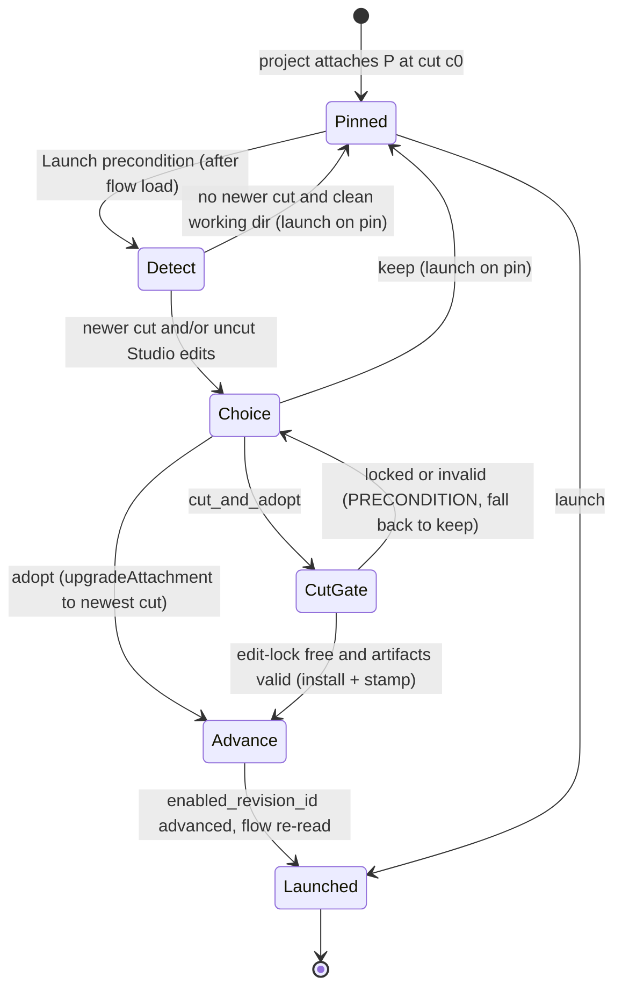

**Choice table (exactly as the code gates).** For each backing package P, let
`hasNewerCut` mean `P.last_cut_install_id` differs from the attached install, and
`hasUncutEdits` mean P's working dir is dirty versus the pin's `source_commit_sha`.
`try_once` (ADR-132) is offered **exactly when `adopt` is offered**:

| Detected state | Offered options | `keep` | `adopt` | `try_once` | `cut_and_adopt` |
| --- | --- | --- | --- | --- | --- |
| neither (up to date, clean) | `keep` only | launch on pin | not offered (409) | not offered (409) | not offered (409) |
| `hasNewerCut` only | `keep`, `adopt`, `try_once` | launch on pin | `upgradeAttachment(last_cut)` then launch | pin THIS run to `last_cut`, attachment untouched | not offered (409) |
| `hasUncutEdits` only | `keep`, `cut_and_adopt` | launch on pin | not offered (409) | not offered (409) | cut gate then `upgradeAttachment(new cut)` then launch |
| both | `keep`, `adopt`, `try_once`, `cut_and_adopt` | launch on pin | adopt the existing newest cut | pin THIS run to the newest cut, attachment untouched | mint a fresh cut from the edits, then adopt |

`adopt`/`cut_and_adopt` advance the project's `project_package_attachments` +
`flows.enabled_revision_id` (via the existing `upgradeAttachment`) **before** the
enablement check re-reads the flow, so the very launch uses the adopted cut. The
advance is its own transaction; the run-insert tx is unchanged (a board launch carries
no `trigger_event_id` and never conflicts on the dedup). Multi-package = one choice per
backing package.

**`try_once` (ADR-132)** validates like `adopt` (unknown install / unoffered
option → 409 `CONFLICT`) but translates into an **ephemeral per-run pin**: the
run's flow revision resolves from the newer cut's install and is snapshotted on
the run's existing `flow_revision_id`/`flow_revision`/`flow_version` columns;
`project_package_attachments` is byte-identical before/after, and the choice
contributes NO adopt-revert compensation (nothing to compensate). The next
launch re-detects and re-offers.

### Cross-project version reuse

A project's **"Add package"** picks a Studio local package + a cut → the existing
`attachPackage` (per-project pin). "Pick this version into project B" = attach that cut
to B. The Stream-A **"Customize for this project"** copy is attached the same way (it is
just another local package). The launch prompt above is a light "version available"
dialog — NOT the commit `ChangeReviewDialog`; no commit happens at launch except the
explicit `cut_and_adopt` Studio gate.

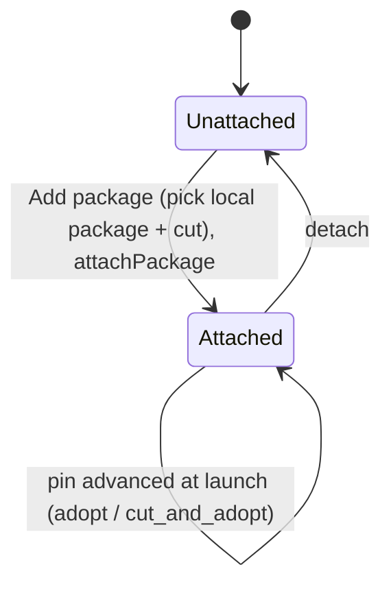

### PR-to-source (ADR-113)

`publishLocalPackage(id, { targetSourceId, branchName })` proposes the local package's
committed working tree upstream. The target is resolved from the **registered
`package_sources` allow-list** (server-state — never a body-supplied raw URL); the
branch is a stable, reusable **`maister/<pkg-slug>`** (re-publish updates it and the
existing PR, never duplicates). Only `kind: 'git'` sources are publish targets
(ADR-132 — `getPublishOptions` filters by kind, allow-list). The PR base
resolves as `package_sources.base_branch ?? gitRemoteDefaultBranch(...) ??
"main"` (ADR-132 — `base_branch` is per-source operator config).

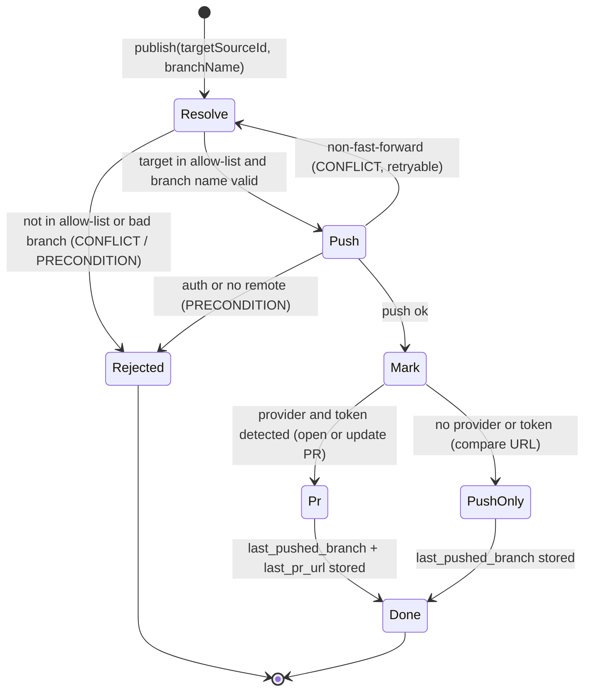

**Two-phase + failure table.** The push is the external side-effect;
`last_pushed_branch` / `last_pr_url` are written **only after** it acks.

| Failure | Code | Marker | Caller action |
| --- | --- | --- | --- |
| `targetSourceId` not in `package_sources` (or `kind: 'local'`) | `CONFLICT` (409) | unset | pick a registered git source |
| invalid branch name (`branchNameSchema`) | `PRECONDITION` (409) | unset | fix the branch name |
| non-fast-forward push (upstream `maister/<slug>` moved) | `CONFLICT` (409) with `details.reason: "upstream_moved"`, `details.canSync`, `details.localPackageId` (ADR-132) | unset | `canSync: true` → "Sync from upstream" CTA, then re-publish; `canSync: false` (no lineage) → manual reconcile guidance (inspect/delete the remote branch) |
| auth / no remote reachable | `PRECONDITION` (409) | unset | configure host credentials |
| no source url / unsupported provider for the PR | `CONFIG` / push-only | branch only | open the PR from the compare URL |
| push ok, provider + token | — | `last_pushed_branch` + `last_pr_url` | PR opened/updated |
| push ok, no provider/token | — | `last_pushed_branch` (+ compare URL shown) | open the PR manually |

Package publish **NEVER retries with force** (ADR-132, regression-pinned): the
force capability stays quarantined to its existing non-package call sites; a
rejected push is always the typed `upstream_moved` refusal above.

PR automation needs the provider CLI (`gh`/`glab`) + a host-ambient token
(`GH_TOKEN` / `GITLAB_TOKEN` / `GITEA_TOKEN` / `GITVERSE_TOKEN`); absent → the push-only
fallback. See [`../configuration.md`](../configuration.md).

## Fork ↔ upstream loop — divergence view + upstream sync (ADR-132)

Closes the fork loop for a local package with lineage
(`source_install_id` set): the member can **see** how the fork diverged from
its source, and **re-synchronize** the fork when the upstream releases a new
tag. Both operate on **local install bytes only** — no git-remote fetch for
comparison (D3); "install the new tag" goes through the normal
`installPackageRevision` path first, so the bytes land in the
content-addressed cache like any install.

### Divergence view (read-only)

`GET /api/studio/local-packages/{id}/divergence` (viewer-permitted, like
`/diff`) diffs **ours** — the fork working dir (default) or a chosen cut's
`installedPath` (`cutInstallId` query param, validated against the package's
own cut lineage `package_installs.source_local_package_id = id`) — against
**theirs** — the lineage source install's `installedPath` — via
`git diff --no-index` (exit 0/1 both success), excluding `.git/`, into the
shared `DiffView` DTO. An optional `element` scope narrows to one composition
element where element lineage exists (degrades to package-level otherwise).

Degradation: lineage source row missing (`ON DELETE SET NULL`) or its on-disk
bundle gone → typed `MaisterError("CONFIG")` "source install unavailable" —
the editor renders a degraded panel, never a crash. After a completed sync the
view automatically compares against the NEW base (lineage advanced).

### Upstream sync — synthetic 3-way merge

Mechanism (ADR-132 §d): **base** = the original lineage source install bytes,
**theirs** = the new-tag install bytes, **ours** = fork working dir at HEAD.
Merge-shaped, never rebase-shaped — the fork is a fresh `git init` with no
shared ancestry; sync lands as AT MOST one commit on top of fork history
(clean: auto-commit `Sync from upstream <tag>`, skipped when the merge
changed no bytes; conflict: the user's
resolution commit). Fork commits are never rewritten.

Sync state machine (persisted discriminant: `local_packages.sync_state`;
`idle` = `sync_state IS NULL`, `syncing`/`conflicted` = pending `sync_state`
with empty/non-empty `conflictedFiles`; completion always returns to `idle`):

```mermaid
stateDiagram-v2
    [*] --> idle
    idle --> syncing: POST /sync (all preconditions pass;<br/>tx persists sync_state BEFORE disk writes)
    syncing --> syncing: POST /sync SAME target (Resume)<br/>idempotent re-merge for crash-window recovery
    syncing --> idle: clean merge (commit "Sync from upstream tag"<br/>when bytes changed + ONE tx advance lineage + clear sync_state)
    syncing --> conflicted: merge conflicts (tx stamps conflictedFiles;<br/>markers in working dir, uncommitted)
    conflicted --> idle: POST /sync/resolve (markers gone + committed;<br/>SAME single tx advance lineage + clear)
    conflicted --> idle: POST /sync/abort (git reset --hard HEAD + tx clear)
    syncing --> idle: POST /sync/abort (crash-window recovery;<br/>reset + clear)
```

**`POST /sync` precondition allow-list (refusals exactly as the code gates):**

| # | Precondition | On violation |
| --- | --- | --- |
| 1 | caller session holds the live edit-lock (`assertHoldsLock`) | `CONFLICT` |
| 2 | package `status = active` | `PRECONDITION` |
| 3 | fork lineage present: `source_install_id` row exists AND its bundle bytes exist on disk | `CONFIG` ("source install unavailable") |
| 4 | NO pending `sync_state` for a DIFFERENT `targetInstallId` — a same-target re-POST is **Resume** (idempotent re-merge from step 2); a different-target pending sync refuses | `CONFLICT` ("sync in progress") |
| 5 | working tree clean (`git status --porcelain` empty) — Resume re-entry with a dirty tree is the conflicted state and routes through Resolve/Abort instead | `PRECONDITION` ("commit or discard first"; no auto-stash) |
| 6 | body `targetInstallId` is an `Installed` install of the SAME package name + `sourceUrl` as the lineage source (server-state comparison) | `CONFLICT` |

**Order of operations + crash windows (two-phase; `sync_state` is the single
discriminant — no third partial state exists):**

1. tx: persist `sync_state = {targetInstallId, targetRef, conflictedFiles: [],
   startedAt}` — durable intent BEFORE any disk write.
2. disk: 3-way merge writes into the working dir.
3. clean case: commit `Sync from upstream <tag>` (only when the merge changed
   bytes — a no-change merge skips the commit), then ONE tx: advance lineage
   (`source_install_id`/`source_ref` → the new install/tag) + clear
   `sync_state`.
4. conflict case: tx update `sync_state.conflictedFiles = [...]`; working dir
   holds standard conflict markers (uncommitted).

**Resume = `POST /sync` re-invocation with the SAME `targetInstallId`**
(precondition 4 above): the merge re-runs idempotently from step 2 — in
crash-window 1 it performs the merge for the first time; after a landed sync
commit it is a no-change merge that just completes. There is no separate
resume route.

| Crash window | Observable state | Recovery (user-driven via the editor banner; NO sweep) |
| --- | --- | --- |
| after 1, before 2 | `sync_state` pending, tree clean | banner offers Resume (same-target `POST /sync` — idempotent, inputs unchanged) or Abort |
| after 2, before 3/4 | `sync_state` pending, tree dirty with merged content | banner shows conflicted/in-review; Resolve validates + completes; Abort resets |

**`POST /sync/resolve` allow-list:** live edit-lock · pending `sync_state` ·
something to resolve — `conflictedFiles` non-empty OR a dirty tree (the
window-1 state of pending + empty list + clean tree refuses with
`PRECONDITION` "nothing to resolve — resume the sync", so resolve can never
advance lineage past a merge that never ran) ·
no conflict markers remain in the UNION of the listed files' current bytes
and every dirty working-tree file (`conflictedFiles` alone is not the scan
boundary — a
crash before the conflict-stamp tx leaves the list empty while markers sit on
disk, and a user commit can bake markers into a listed file the dirty set no
longer covers) · tree committed
(or committed as part of resolve with the user's message) → completion is the
SAME single tx as step 3 (advance lineage + clear). Idempotent retry: lineage
already advanced and state cleared → success no-op.

**No-change merges:** the clean case commits ONLY when the merge changed
bytes. A no-change merge — re-sync to the same tag, or Resume after the sync
commit already landed pre-crash — skips the commit and still runs the
completion tx (advance lineage + clear `sync_state`).

**`POST /sync/abort` allow-list:** live edit-lock · pending `sync_state` →
`git reset --hard HEAD` (structurally safe: the tree was clean pre-merge, so
nothing user-authored is lost) + tx clear `sync_state`. Never force-overwrites
commits. Idempotent: no pending `sync_state` (a completed or already-aborted
sync) is a no-op `200`, not a `409`. All three sync ops (sync/resolve/abort)
take the per-package working-dir mutex — a concurrent op refuses with `409`.

Merge case table (implemented in `sync-merge.ts` exactly as enumerated):
unchanged ours + changed theirs → take theirs · changed ours + unchanged
theirs → keep ours · both changed same → keep · both changed different →
`git merge-file` (clean or markers) · added in theirs only → add · added in
ours only → keep · added both identical → keep · added both different →
merge-file with empty base (add/add conflict) · deleted in theirs + ours
unchanged → delete · deleted in theirs + ours changed → modify/delete conflict
(keep ours, list as conflicted) · deleted in ours + theirs changed →
delete/modify conflict (list; do NOT resurrect) · binary (NUL-sniff) differing
→ conflict entry "binary", ours kept.

## Composition view — tabbed local-package editor (ADR-116 — Implemented)

The local editor's no-path landing is a **tabbed-by-kind composition view**,
reusing the installed viewer's `PackageTabs` / `ElementCard` / `FlowPreviewCard`
pattern over a BOM **decoupled from install** into a shared source abstraction. It
is **web-only** — no migration, no new HTTP route, no new `MaisterError` code; all
create / rename / move / import mutations reduce to the existing lock-guarded
save-diff (`PUT`/`DELETE /api/studio/local-packages/{id}/files/{path}`) and import
(`POST /api/studio/local-packages/{id}/import`) routes.

### Additional domain entities

- **`PackageSource`** (server-only abstraction, NOT persisted): `{ logLabel,
  spec: { flows, mcps }, inventory, listFiles(), readFile(rel), loadFlow(flowPath) }`
  — the input the BOM builder consumes. `spec` is a narrowed projection (NOT the
  full `MaisterPackageManifest`), so a local source can synthesize `mcps` from
  files; `loadFlow()` is the single confinement chokepoint for compiling a flow's
  `flow.yaml`. An **installed** source reads `package_installs.manifest` +
  `installedPath` (unchanged); a **local** source projects `spec` from
  `maister-package.yaml` in `working_dir`, **computes** `inventory` by walking the
  dir (the install-time `collectInventory` logic factored over a file list), and
  confines `listFiles`/`readFile`/`loadFlow` to `working_dir`.
- **`PackageBom` (local)** — the same `PackageBom` shape the installed viewer uses
  (`flows`/`skills`/`subagents`/`platformAgents`/`mcps`/`rules`), produced by the
  shared `buildPackageBom(source)`. **Derived, never stored** — computed at RSC
  load and re-derived on `router.refresh()` after a save.
- **Composition tabs** — seven view groups: `Flows · Skills · Subagents · Agents ·
  MCP · Rules · Files`. Counts equal the BOM array lengths; an empty kind hides its
  tab; **Files is always shown**.

### State machine

The package + edit-lock FSMs are **unchanged** (see above). The only new
invariant: the composition BOM is **derived from the last-saved disk state**, not
stored — every identity change (create / rename / delete) is a
save-then-`router.refresh()` round-trip before the BOM (and thus the tab
counts/cards) reflects it.

### Process flows

Open-model routing per kind. In the **local** composition the whole `ElementCard`
is the open affordance (`clickableCard`); the Phase-2 fork stub is dropped
(`showFork={false}` — a local package is already an editable working copy). The
installed viewer keeps its explicit View button + fork.

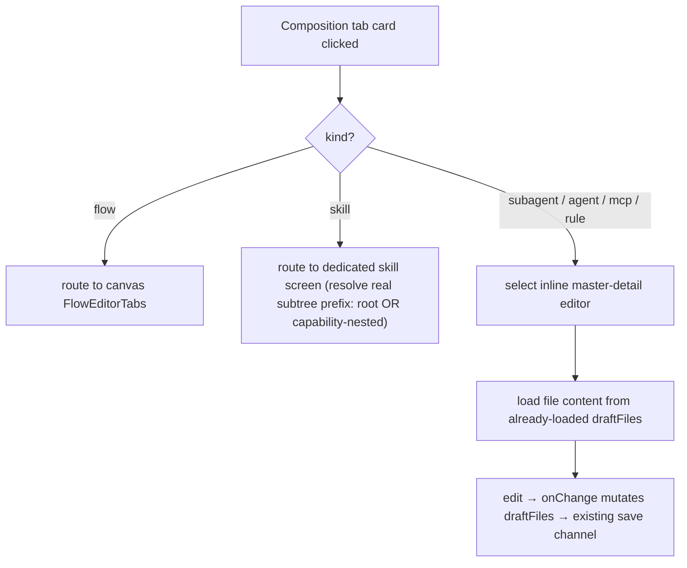

Create artifact (`+ Add <Kind>`) — scaffold → save → refresh:

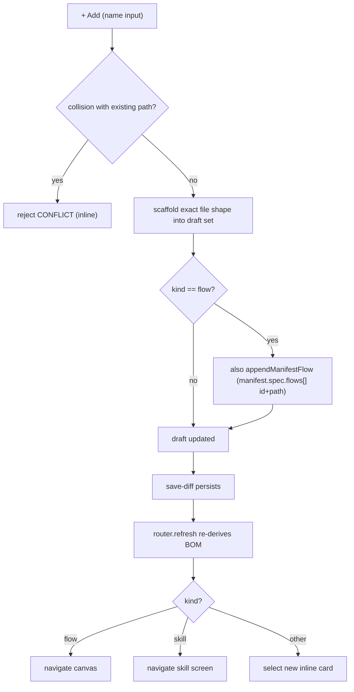

Rename identity (card `Rename <Kind>`) — save-diff (D8):

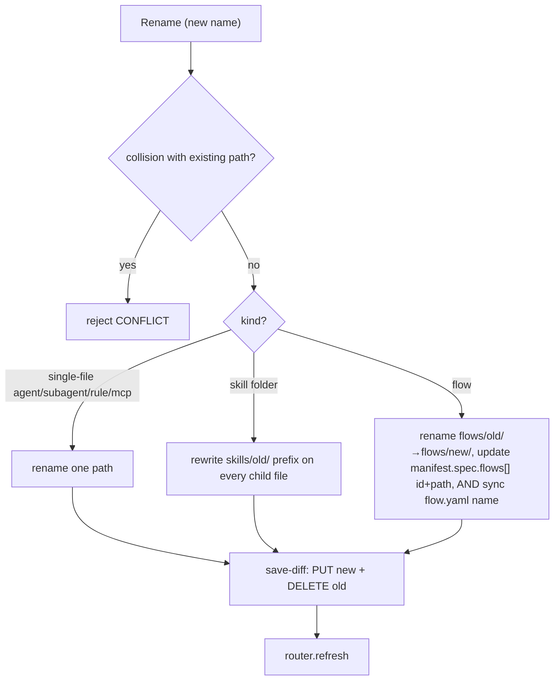

Files tab = the unified **`PackageFileNavigator`** (one surface over the flat
draft list, no sentinel — D7). A URL-persisted `?fileview` switch toggles a
**Finder** (one folder at a time, double-click to descend, breadcrumb up) and an
expandable **Tree**; the selected file opens in the shared `ContentEditor` on the
right. Row-level inline rename + delete, toolbar new-file / new-folder in the
current folder, and drag-move onto folders all reduce to the same pure draft
helpers + the one save-diff channel:

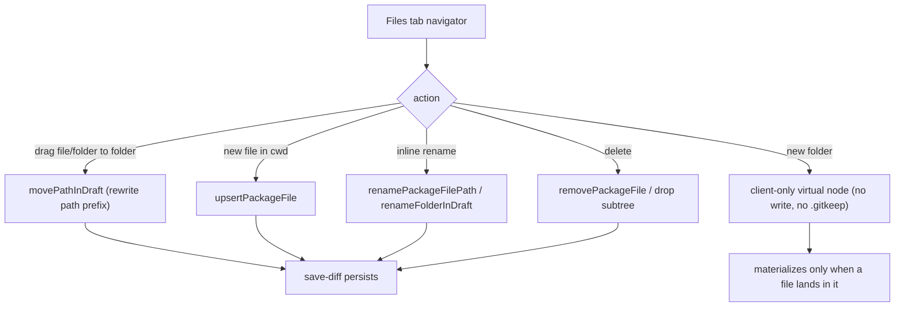

Batch import is unchanged — see **Batch import** above; the composition Files
tab surfaces one shared **Import** button wired to the existing
`POST .../import` (`mode=preview` → confirm → `mode=commit`).

### Composition-view expectations (ADR-116 — Implemented)

- The local editor landing MUST render the 7-tab composition view; each tab count
  MUST equal its BOM array length; an empty kind MUST hide its tab; **Files** MUST
  always be present.
- `buildPackageBom` MUST be shared by installed + local sources; `getStudioPackageBom`
  output for a fixture install MUST be byte-identical before/after the refactor
  (characterization snapshot).
- The composition BOM MUST be server-computed and re-derived on `router.refresh()`;
  it MUST NOT be persisted and MUST NOT compile flows client-side.
- A card click MUST honor the open model exactly: flow → canvas, skill → its own
  screen, subagent/agent/mcp/rule → inline master-detail. The skill 404-gate,
  screen scoping, and rename MUST resolve the skill's REAL subtree prefix
  (`resolveSkillSubtreePrefix`: root `skills/<id>/` OR capability-nested
  `capability/<cap>/skills/<id>/`), so a bundled skill the BOM surfaces is never
  falsely 404'd.
- `+ Add <Kind>` MUST scaffold the exact path shape per kind, and a flow scaffold
  MUST append `manifest.spec.flows[]` (id + path); a name colliding with any
  existing draft path MUST be rejected with `MaisterError("CONFLICT")`.
- Card `Rename <Kind>` MUST rewrite **identity** only (a skill-folder rename moves
  every child; a flow rename updates `manifest.spec.flows[]` id+path AND syncs the
  moved `flow.yaml` `name` to the new id — the installer rejects
  `flow.yaml name != manifest flow id`, so all three move together); it MUST NOT
  touch frontmatter and MUST reject a colliding target with `CONFLICT`.
- The Files tab "new folder" MUST be virtual/client-only — it MUST NOT persist and
  MUST NOT write a `.gitkeep` sentinel; an empty folder never reaches disk.
- `mcps/*.yaml` MUST be recognized via a local `isMcpDescriptorPath` predicate;
  `classifyPackageFilePath` MUST NOT be broadened (it stays shared with the
  installed reader).
- `readOnly` (lock lost / no manage / assistant busy) MUST disable every
  composition mutation (create / rename / inline edit / files-tab move / import).
- The local BOM MUST degrade any per-element parse failure to an id-only card and
  MUST NEVER throw.
- A manifest-declared `flows[].path` MUST be path-confined to the package root
  before the flow is loaded (`resolveConfinedFlowYaml`) — the local manifest is
  parsed leniently, so a `..`/absolute/symlink path MUST be refused (read nothing
  outside the root) and the flow MUST degrade to an id-only card.

### Composition-view edge cases (ADR-116 — Implemented)

- Create/rename target collides with an existing draft path → `MaisterError("CONFLICT")`,
  surfaced inline, never a silent overwrite.
- Rename/move path escape (`..`/abs/symlink/`.git`) → `MaisterError("PRECONDITION")`
  via `resolveWithinWorkingDir`, before any write (the existing confinement guard).
- A flow rename that updates the manifest id/path but leaves the moved `flow.yaml`
  `name` stale is a defect — it cuts an uncuttable package (the installer enforces
  `flow.yaml name === manifest flow id`). The rename helper moves the dir, the
  manifest entry, and the `flow.yaml` `name` atomically in the draft set; an
  unparseable moved `flow.yaml` fails the rename with `MaisterError("CONFIG")`.
- Malformed `maister-package.yaml` in the local source → empty/degraded BOM
  (manifest parse → `CONFIG`/empty), never a thrown landing.

## Expectations

- A `local_packages` row MUST have a UNIQUE `slug`; its `working_dir` MUST
  resolve under `localPackagesRoot()` and MUST NEVER appear in any client
  response.
- Every file read/write/delete/move MUST resolve the artifact path within the
  row's `working_dir` (realpath containment; reject `..`, absolute paths,
  symlink escape, and any `.git/` path) → `MaisterError("PRECONDITION")` on
  violation, before any write.
- A write MUST be rejected with `MaisterError("CONFLICT")` unless the caller's
  session holds a live (non-expired) lock on the package.
- A lock MUST be acquirable only when the package is unlocked OR
  `lock_expires_at < now` (lazy stale-takeover); a live lock held by another
  session MUST yield a read-only editor and MUST NOT be stolen.
- Authoring (create/fork/edit/cut) MUST require only `requireSession`;
  **attaching** a cut version to a project MUST require project `member`
  (`manageLocalPackages`). Git-package install/attach/trust MUST stay
  admin-gated (unchanged).
- A fork MUST copy the source install's on-disk content **excluding any `.git`/
  VCS dir** and MUST `git init` the destination fresh; it MUST execute NOTHING
  (no `setup.sh`, no MCP). A missing/unreadable source bundle → `CONFIG`, nothing
  persisted.
- A package fork MUST copy the WHOLE bundle into a NEW `<ref>-local` package
  (recording `source_install_id` + `source_ref`); `forceNew` bypasses dedup and
  "Customize" names the copy `<ref> (custom)`. An element fork (ADR-105 A4,
  `forkElementToNewLocal`) MUST copy EXACTLY ONE confined element into a NEW
  centralized local package named `<elementName> (local)` — **NO project target**
  (owner reframe: editing is centralized) — carrying NO `source_install_id`
  lineage (a partial copy), and MUST NOT copy the rest of the source.
- An element fork's `elementPath` MUST be confined inside BOTH the source bundle
  AND the destination working dir (reject `..`/abs/`.git`) → `PRECONDITION`, with
  NO package created on violation.
- The legacy per-project default (`forkElementToDefault` + the partial-unique
  `(project_id) WHERE is_default` race-safe ensure via
  `insert(...).onConflictDoNothing()` + re-select) is RETAINED for Stream B but is
  no longer the A4 element-fork target.
- "Cut version" MUST install from a clean export of `working_dir` (no `.git`/VCS
  metadata) via the existing `installPackageRevision({ version: "local" })`,
  producing a `local-<digest>` `package_installs` revision; it MUST NOT introduce
  a second install path.
- A cut MUST stamp `last_cut_install_id` only AFTER the install (and any attach)
  succeeds — the stamp is the durable "cut succeeded" marker, never written
  before the side-effect.
- The MCP-template editor (T2.5) sources its prefill from the platform MCP
  catalog (`platform_mcp_servers`) and materializes a `mcps/*` template carrying
  ONLY transport/command/args/url + `env:NAME` references — secret VALUES MUST
  NEVER be read or written. MCP-template provenance is **display-only**: the
  picked catalog server's id is NOT persisted on the template (no schema column,
  no migration — T2.1 decision); re-opening the editor does not re-link it.
- Local working-dir sources MUST resolve to `trusted_by_policy`; `setup.sh` MUST
  NOT run during install and MUST run only post-attach (ADR-021).
- Deleting a `local_packages` row MUST remove its `working_dir`; orphaned dirs
  and abandoned `Installing` installs are NOT auto-GC'd (manual cleanup, owner
  decision).
- Phase C MUST NOT extend the authored CAPABILITY enum (`rule|skill|flow`,
  `authored_capabilities`) and MUST NOT add a new `MaisterError` code (ADR-008
  closed union). *(ADR-105 note: the **file-kind** classifier union
  `AuthoredFlowPackageFileKind` is a DIFFERENT type — Stream A DOES extend it with
  `manifest` + `subagent` (file-based, Variant B), which is not a capability-enum
  change.)*
- (Stream A, ADR-105) A package commit MUST validate the **changed** artifacts
  (flow parse+compile, manifest parse, platform-agent strict frontmatter, subagent
  lenient frontmatter, skill `SKILL.md` presence) and MUST **hard-block** on any
  invalid artifact (`PRECONDITION`/`CONFIG`) — no "commit anyway" override;
  already-committed artifacts are assumed valid, WIP stays in the working dir.
- (Stream A, ADR-105) `forkPackageToLocal` MUST dedup by `source_install_id`
  (existing fork → 200 `{ alreadyExists: true }`; fresh fork → 201);
  "Customize for this project" MUST reuse that path and name the copy by
  convention (`P (for <project>)`) with NO schema field.
- (Stream B, ADR-107 — Implemented) A launch MUST detect, per package backing the
  task's flow, whether a newer cut exists (`last_cut_install_id` differs from the pin)
  and/or uncut Studio edits exist (working dir dirty vs the pin's `source_commit_sha`),
  and offer `keep | adopt | cut_and_adopt`. `adopt`/`cut_and_adopt` MUST advance the
  project attachment via `upgradeAttachment` BEFORE the enablement check, and the flow
  run MUST keep `runs.local_package_id` NULL. An option not in the detected set → 409.
- (Stream B, ADR-107 — Implemented) `cut_and_adopt` MUST run the Studio cut gate (free
  edit-lock + `validatePackageArtifacts` → `installPackageRevision` → `stampLastCutInstall`)
  before adopting; a package locked by another session or with invalid artifacts →
  `PRECONDITION` (the launcher can still `keep`).
- (Stream B, ADR-107 — Implemented) A cut install MUST record `source_local_package_id`
  + `source_commit_sha`; provenance is derived (`flowRevisionId → install`), never a new
  `runs` column.
- (Stream B, ADR-113 — Implemented) `publishLocalPackage` MUST resolve its target ONLY
  from the registered `package_sources` allow-list (never a body URL), validate the
  branch name at the git sink (`branchNameSchema`), push the package working tree on a
  stable `maister/<pkg-slug>` branch, and write `last_pushed_branch`/`last_pr_url` only
  AFTER a successful push (two-phase). `source_repo_url`/`source_ref`/`branch_name` feed
  the source preselect.
- (ADR-132) A `try_once` choice MUST leave `project_package_attachments`
  byte-identical, contribute NO adopt-revert compensation, and be offered
  exactly when `adopt` is offered; an unoffered/unknown option → 409
  `CONFLICT`.
- (ADR-132) Sync MUST refuse on a dirty working tree with
  `MaisterError("PRECONDITION")` (no auto-stash) and MUST persist `sync_state`
  in a transaction BEFORE the first disk write; lineage advance + `sync_state`
  clear MUST be ONE transaction; abort MUST `git reset --hard HEAD` and MUST
  NEVER rewrite or force-overwrite fork commits.
- (ADR-132) Sync, resolve, and abort MUST require the live session edit-lock;
  a second sync while `sync_state` is pending MUST refuse with
  `MaisterError("CONFLICT")`.
- (ADR-132) The divergence view MUST compare local bytes only (fork working
  dir or a cut vs the lineage source install), MUST exclude `.git/`, and MUST
  degrade a missing source install to `MaisterError("CONFIG")` rather than
  throwing; a `cutInstallId` not in the package's own cut lineage MUST refuse.
- (ADR-132) Package publish MUST resolve its PR base as
  `package_sources.base_branch ?? gitRemoteDefaultBranch(...) ?? "main"` and
  MUST surface a non-fast-forward push as `MaisterError("CONFLICT")` with
  `details.reason: "upstream_moved"` + `details.canSync`; it MUST NEVER pass
  force to the push.

## Edge cases

- Path traversal / symlink escape / `.git/` write → `MaisterError("PRECONDITION")`
  (the confinement guard); no file is written.
- Concurrent edit: a second session opening a locked package gets a read-only
  editor; a save after the lock expired or was taken over →
  `MaisterError("CONFLICT")` ("reload").
- Invalid or missing working dir (manual deletion, bad scaffold) →
  `MaisterError("CONFIG")`.
- Cut-version crash windows (ADR-096), the irreversible export+install happening
  BEFORE the durable stamp/attach: **(a) export done, install not started** →
  only an orphan tmp dir (the `finally` rm covers the happy path), nothing
  persisted; **(b) install done, stamp not written** → an immutable
  content-addressed `package_installs` row exists but `last_cut_install_id` is
  stale — a re-cut reuses the identical install by digest and re-stamps (no
  duplicate, no leak); **(c) stamp done, attach pending** → the package is cut +
  recorded, only the attach did not happen — re-run with `attachToProjectId`, or
  attach later (`attachPackage` is itself one-tx with its own windows). No
  partial state is load-bearing.
- Fork crash: a fork is reads + one row insert; a death after the working-dir
  copy but before the insert leaves an orphan working dir (rolled back on a
  failed insert; otherwise cleaned manually like any orphan). The copy executes
  nothing, so there is no half-run side-effect.
- A cut of a flow-less package (for example, an element-fork default holding
  only a skill) remains a valid immutable package revision, but it contains no
  launchable Flow. It may still be attached for its non-Flow artifacts; add a
  Flow before selecting that package for a Flow launch.
- The lock holder's session dies → the lock simply expires at `lock_expires_at`;
  the next opener takes over lazily (no sweeper).
- (ADR-132) Sync crash windows — only two exist, discriminated by
  `sync_state` + tree dirtiness: pending + clean tree → Resume (idempotent
  re-merge) or Abort; pending + dirty tree → conflicted/in-review banner,
  Resolve or Abort. No sweep touches `sync_state`; recovery is user-driven.
- (ADR-132) Lineage source install GC'd/`SET NULL` or bundle bytes missing →
  divergence and sync refuse with `MaisterError("CONFIG")` "source install
  unavailable"; the editor shows the degraded panel (fork remains fully
  editable/cuttable).
- (ADR-132) Re-sync to the SAME tag after completion → precondition 6 still
  passes but the merge is a no-change merge (base = theirs): no commit, the
  completion tx still runs; a second sync WHILE one is
  pending → `MaisterError("CONFLICT")` "sync in progress".
- (ADR-132) Resolve called with conflict markers still present in a listed
  or dirty file (union scan) → `MaisterError("PRECONDITION")` naming the
  file; resolve in the window-1 state (empty list + clean tree) →
  `MaisterError("PRECONDITION")` "nothing to resolve — resume the sync";
  resolve after
  lineage already advanced (crash between tx and response) → idempotent
  success no-op.
- (ADR-132) Crash between the sync commit and the completion tx →
  observationally crash-window 1 (pending + clean tree); Resume re-merges as
  a no-change merge and completes; Abort keeps the landed commit
  (`reset --hard HEAD` is a no-op on a clean tree) and clears the state —
  re-running sync then advances lineage via the no-change path. No
  user-authored bytes are at risk in either branch.

## Linked artifacts

- **ADRs:** ADR-096 (this domain), ADR-105 (Stream A — first-class kinds + centralized
  model), ADR-107 (Stream B — version-adopt launch), ADR-113 (Stream B — PR-to-source),
  ADR-116 (composition-view tabbed editor IA + shared package-BOM source abstraction —
  Implemented),
  [`ADR-132`](../decisions.md#adr-132-forked-package-loop--ephemeral-pins-package-experiment-axis-local-sources-upstream-sync)
  (fork loop: `try_once` pin, divergence, upstream sync, publish base +
  sync-first refusal — migration 0097), ADR-092 (unified Studio +
  editable-local-package direction), ADR-088 (package
  management), ADR-021 (fetch-then-execute trust separation) — see
  [`../decisions.md`](../decisions.md).
- **ERD:** [`../db/projects-domain.md`](../db/projects-domain.md),
  [`../database-schema.md`](../database-schema.md).
- **API:** [`../api/web.openapi.yaml`](../api/web.openapi.yaml)
  (`/api/studio/local-packages*` incl. `/files/{path}` CRUD + `/cut-version` +
  `/publish` [Stream B] + `/divergence` + `/sync` + `/sync/resolve` +
  `/sync/abort` [ADR-132]; `/api/studio/packages/{ref}/fork` + `/fork-element`;
  `POST /api/runs` `packageVersions` [Stream B; `try_once` ADR-132];
  `POST /api/projects/{slug}/packages` attach-a-version).
- **Reused behavior:** [`packages.md`](packages.md) (install/attach/trust),
  [`flow-studio.md`](flow-studio.md) (editor seam, fork),
  [`mcp-management.md`](mcp-management.md) (the MCP catalog the template editor
  sources from).
- **Source (Phase C):** `web/lib/local-packages/*` (incl. `fork.ts`,
  `service.ts` `ensureDefaultLocalPackage`/`cleanCopyExcludingGit`/
  `exportWorkingDir`/`stampLastCutInstall`),
  `web/app/api/studio/local-packages/*` (incl. `[id]/cut-version`),
  `web/app/api/studio/packages/[ref]/{fork,fork-element}/`,
  `web/app/(app)/studio/local/`, `web/app/(app)/studio/edit/[id]/`.
- **Source (ADR-116 composition view):** `web/lib/queries/package-bom.ts`
  (`PackageSource` + `buildPackageBom` + `installedPackageSource`),
  `web/lib/local-packages/bom.ts` (`getLocalPackageBom` + `localPackageSource` +
  `collectInventoryFromFiles`), `web/lib/local-packages/composition.ts` (tab/route
  helpers + `isMcpDescriptorPath` + `movePathInDraft` + skill scope/merge),
  `web/lib/local-packages/{scaffold,rename-artifact}.ts`,
  `web/components/studio/{package-composition,skill-screen,files-manager}.tsx`.
