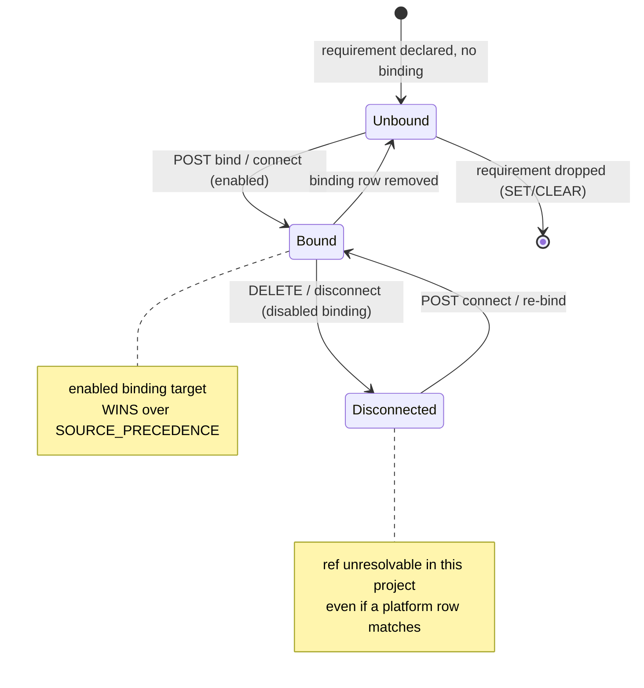
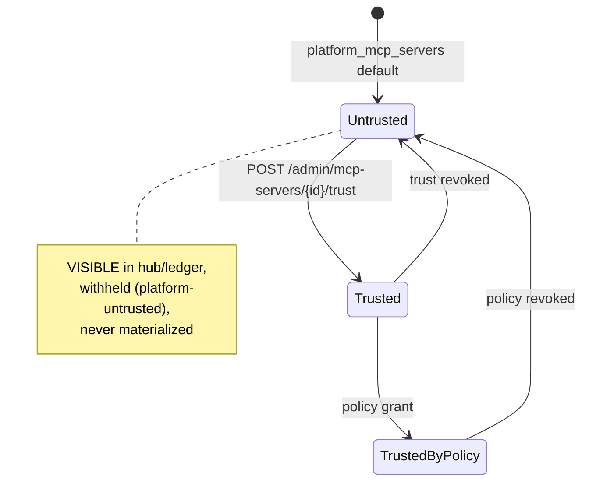
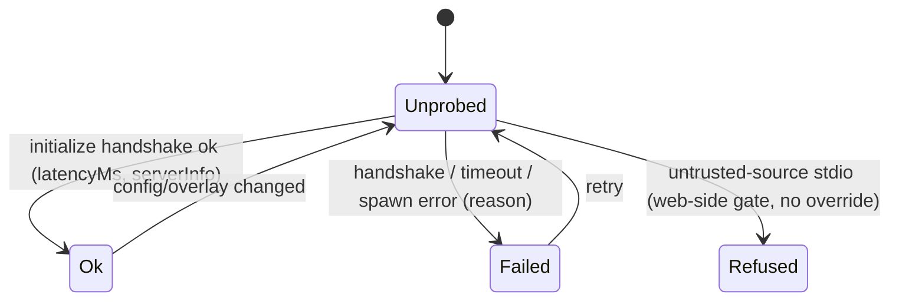
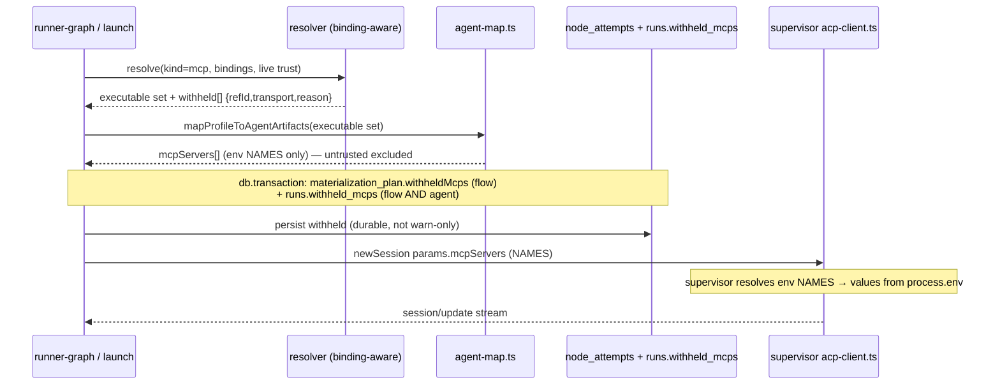
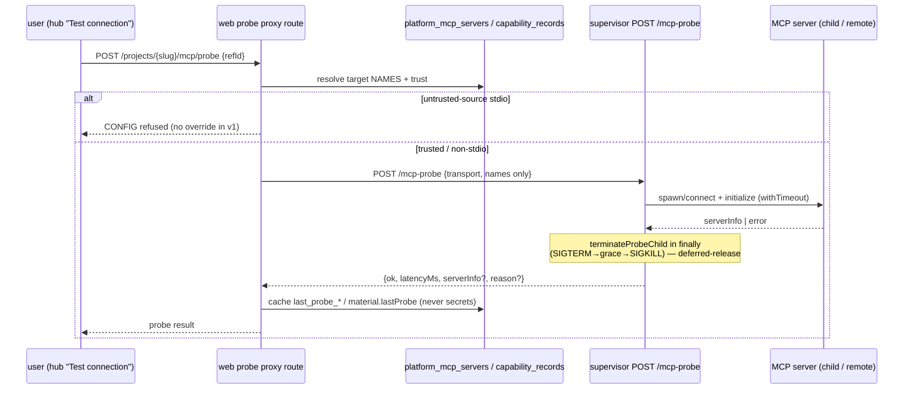

# MCP capability management domain

> **Status: mixed.** The platform CRUD + M14 materialization surface is
> **Implemented** (M27, [ADR-070](../decisions.md#adr-070)). MCP Management v2
> ([ADR-129](../decisions.md#adr-129)) is **Implemented** at the backend +
> read-model + admin/board-surface layers: the `project_mcp_bindings` table +
> migration `0093`, the binding-aware resolver with `provenance`, load-bearing
> trust + withheld persistence, the per-project env-slot overlay (names-only),
> the supervisor `POST /mcp-probe` + web proxy with the D4 trust gate, the hub
> read model + requirements ledger, the board-header metacell, the admin trust
> action + used-by column, and the board requirements-ledger + test-connection.
> **Follow-up (Designed, routes-ready):** the board match/connect/overlay
> dialogs, the shared node/scratch MCP-select unification (W-G), and the seeded
> hub e2e. Acceptance SSOT
> [`.ai-factory/specs/feature-mcp-management-v2.md`](../../.ai-factory/specs/feature-mcp-management-v2.md);
> pieces below are tagged with their current status. Extends the M14
> materialization surface in [capabilities.md](capabilities.md) and the M25
> authored catalog in [capability-catalog.md](capability-catalog.md).

## Purpose

This domain covers how Model Context Protocol (MCP) servers are **declared,
matched, bound, configured, and materialized** across the three scopes of a
MAIster deployment: the **platform instance** (admin-owned, host-wide catalog),
a **project** (project-admin-owned bindings + local servers), and a
**flow-package** (a requirement or a shipped template inside a `flow.yaml` /
package manifest).

v2 replaces the implicit "`refId` string-equality" resolution model with an
**explicit requirements & bindings layer**: a package declares a *requirement*
or ships a *template*; the platform catalogs servers once; a project **binds** a
ref to a concrete target and may **override** its per-project config (env-slot
names only). Two dormant signals become load-bearing — `trust_status`
(untrusted ⇒ visible-but-not-executable) and a real `initialize` **health
probe**. Secret values are never stored — only `env:NAME` references. Out of
scope: MCP marketplace / reputation / malware scanning / sandboxing / org policy
/ version pinning / OAuth (see the SDD §2).

## Domain entities

- **`platform_mcp_servers`** (Implemented; trust column now load-bearing) —
  admin-managed, host-wide MCP catalog. One row per server:
  `{ id, transport ∈ {stdio,sse,http}, command, args, env_keys (names),
  url, header_keys (names), supported_agents,
  trust_status ∈ {untrusted,trusted,trusted_by_policy},
  readiness_status, readiness_reasons, last_probe_status, last_probe_at,
  last_probe_reason, enabled, created_at, updated_at }`. The
  `last_probe_*` columns (Implemented) cache the admin global probe. See
  [db/projects-domain.md](../db/projects-domain.md).
- **`project_mcp_bindings`** (Implemented, W-A) — the explicit binding of a **ref**
  to a concrete MCP **target** within one project:
  `{ id, project_id (CASCADE), ref_id, target_kind ∈ {platform,project,package},
  target_id, enabled (default true), config_overlay jsonb, recommended_hint,
  created_by, created_at, updated_at }`, unique `(project_id, ref_id)`. An
  enabled binding **wins over precedence**; a disabled binding makes the ref
  **unresolvable** (opt-out); an absent binding is **grandfather** (today's
  behavior). See [db/projects-domain.md](../db/projects-domain.md).
- **`capability_records` kind=mcp** (Implemented, M14; extended v2) — one row per
  declared MCP in the project registry, `source ∈ {platform, project,
  flow-package}`. `material` jsonb carries transport shape + `env:NAME`
  references — never secret values; a package **requirement** marker and the
  `material.lastProbe`/`material.readiness` cache (Implemented) also live here.
  Enabled = `disabled_at IS NULL`. See
  [db/capabilities-domain.md](../db/capabilities-domain.md).
- **Requirements ledger** (Implemented, W-A) — a **derived** read model (never
  stored redundantly) aggregating refs from attached packages' manifest
  `mcps[]` requirement-only entries, `settings.mcps.required/additional` across
  enabled flow revisions, and attached agents' `capability_profile.mcps`; each
  classified `bound | auto | unbound | misconfigured | not_ready`.
- **Config overlay** (Implemented, W-C) — per-binding
  `{ envRemap?, argsOverride?, urlOverride?, headerRemap? }` validated against
  the target's declared slots; rewrites env/header/arg/url **NAMES** only, wire
  shape unchanged.
- **MCP transport** — discriminated union: `stdio { command, args?, env? }` |
  `sse { url, headers? }` | `http { url, headers? }`. Credential fields accept
  `env:NAME` only (regex `^env:[A-Za-z_][A-Za-z0-9_]*$`). See
  [configuration.md](../configuration.md).
- **Required vs additional** — node `settings.mcps: { required?, additional? }`
  (bare `string[]` ⇒ `additional`). An unresolvable `required` ref blocks
  launch; an absent `additional` ref degrades gracefully.
- **Provenance + withheld** (Implemented, W-B/W-E) — `resolved_capability_set.mcps[]`
  gains `provenance ∈ {binding,precedence}` (+ `boundTarget`); `withheldMcps[]`
  is persisted into `node_attempts.materialization_plan` (flow) and
  `runs.withheld_mcps` (both flow and agent).

## State machines

### Binding lifecycle (Implemented)

### Trust activation (Implemented — makes the inert column load-bearing)

### Probe (Implemented — per target, per project)

## Process flows

### Binding-vs-precedence resolution (Implemented — the core v2 rule)

For each ref, an enabled binding wins; a disabled binding suppresses; an absent
binding falls through to `project > platform > flow-package` precedence
(canonical in [capabilities.md](capabilities.md)). The platform winner then
passes the live trust gate.

### Trust gate + withheld visibility (Implemented — kills the silent log-only downgrade)

### Per-project overlay application (Implemented — names-only, wire unchanged)

The overlay rewrites `envKeys`/`args`/`url`/`headerKeys` **NAMES** web-side after
`mapProfileToAgentArtifacts`; the ACP `mcpServers` wire shape is unchanged and
the supervisor still resolves values from `process.env`. Project A and project B
can point the same platform MCP at different `env:NAME` slots — no secret value
ever crosses a boundary.

### Health probe handshake (Implemented — real MCP `initialize`)

### Platform MCP readiness (computed on write — WI-2, Implemented; extended to project/package — Implemented)

`evaluateMcpReadiness(row, diagnostics)` (`web/lib/mcp/readiness.ts`) derives
`readiness_status`/`readiness_reasons` from transport config × supervisor
`/diagnostics` env references, invoked on every `POST`/`PATCH
/api/admin/mcp-servers`. v2 extends the same evaluator over project/package
`capability_records` material + diagnostics envRefs, caching into
`material.readiness`. It reads only `env:NAME` names — never a secret value.

## Expectations

1. A `project_mcp_bindings` row MUST be unique on `(project_id, ref_id)`; an enabled binding's target MUST win over `SOURCE_PRECEDENCE`, and a disabled binding MUST make the ref unresolvable in that project. (Implemented)
2. An **absent** binding MUST leave resolution exactly as today (grandfather) — zero behavior change for any project without bindings. (Implemented)
3. Every binding route MUST derive `project_id` from the URL slug (server-state) and validate `target_kind`/`target_id` against existing rows of the matching kind; a platform target MUST be `enabled`+trusted to bind as executable, else `CONFLICT`/`CONFIG`. (Implemented)
4. `config_overlay` MUST validate against the target's declared slots at write AND materialization (unknown slot → `MaisterError("CONFIG")` 422); overlay application MUST rewrite only NAMES, keeping the ACP `mcpServers` wire shape unchanged. (Implemented)
5. No secret **value** MUST EVER appear in a binding row, HTTP response, `session/update`, `materialization_plan`, `runs.withheld_mcps`, or a log — only `env:NAME` names. (Implemented invariant, extended)
6. A winning `source='platform'` record with live `trust_status='untrusted'` MUST be excluded from the executable set and recorded withheld `platform-untrusted`, while remaining VISIBLE in the requirements ledger/hub. (Implemented)
7. The grandfather migration MUST set `trust_status='trusted'` for every `enabled=true AND trust_status='untrusted'` platform row and MUST leave `enabled=false` rows (Serena) untouched. (Implemented)
8. Every withhold (trust or exec-trust; flow or agent) MUST be persisted — flow into `node_attempts.materialization_plan.withheldMcps`, both into `runs.withheld_mcps` — with NO silent warn-only path as the sole record. (Implemented)
9. `resolved_capability_set.mcps[]` MUST record `provenance ∈ {binding,precedence}` (+ `boundTarget` when bound) at launch; pre-migration runs MUST read it absent without error. (Implemented)
10. The requirements ledger MUST honor SET/CLEAR/re-SET symmetry: dropping the last declaring flow-revision/package/agent drops the requirement; re-adding restores it. (Implemented)
11. Supervisor `POST /mcp-probe` MUST release the child + timer on every path; the web probe proxy MUST refuse an untrusted-source stdio probe with a typed reason and have NO override path in v1. (Implemented)
12. A package manifest `mcps[]` entry with neither `command` nor `url` MUST be a valid requirement (no `schemaVersion` bump); an entry with an implementation stays a template; `recommendedPlatformServerId` is an optional `capabilityRefId`. (Implemented)

## Edge cases

| Case | MaisterError code | HTTP |
|---|---|---|
| Bind unknown ref (not in ledger + not a registered ref) | `CONFIG` | 422 |
| Bind to non-existent target, or `target_kind` mismatch | `CONFIG` | 422 |
| Bind a target implementing a different ref (`target.refId ≠ ref_id`) | `CONFIG` | 422 |
| Bind a disabled/untrusted platform target as executable | `CONFLICT` | 409 |
| `config_overlay` names an unknown slot (write or materialization) | `CONFIG` | 422 |
| Second binding for the same `(project, ref)` | `CONFLICT` | 409 |
| Required ref with a **disabled** binding at launch | `CONFIG` | 422 (names disconnect) |
| Required ref unresolved (no candidate, no binding) at launch | `CONFIG` | 422 |
| Required ref agent-unsupported transport at launch | `EXECUTOR_UNAVAILABLE` | 503 |
| Probe an untrusted-source stdio MCP | `CONFIG` (typed refusal, no override) | 422 |
| Probe target missing / not connected | `PRECONDITION` | 409 |
| Trust route unknown platform id | `PRECONDITION` | 409 |
| Raw (non-`env:`) secret in any MCP field | `CONFIG` | 422 |
| Repeated Serena seed ensure | n/a | idempotent |
| Serena default projection (enabled=false, untrusted) | n/a | not materialized (now via real trust gate) |

## Linked artifacts

- **Acceptance SSOT (SDD):** [`.ai-factory/specs/feature-mcp-management-v2.md`](../../.ai-factory/specs/feature-mcp-management-v2.md) — entities, per-route identifier labels, Expectations, edge-cases, test matrix.
- **Decision:** [ADR-129](../decisions.md#adr-129) — requirements & bindings, per-project overlay, trust & health activation (amends [ADR-070](../decisions.md#adr-070) platform CRUD + [ADR-043](../decisions.md#adr-043) materialization visibility; extends [ADR-088](../decisions.md#adr-088) package manifest; fulfills [ADR-128](../decisions.md#adr-128) Serena trust-gate precondition).
- **Capability resolution precedence:** [capabilities.md](capabilities.md) — the project > platform > flow-package winner rule that an **absent** binding falls through to.
- **M14 materialization path:** [capabilities.md](capabilities.md) §Process flows — reused; v2 adds the trust gate, the overlay (names-only), and the withheld sinks.
- **Authored catalog:** [capability-catalog.md](capability-catalog.md) — authored publish does not mutate `platform_mcp_servers`.
- **Admin surface precedent:** [acp-runners.md](acp-runners.md) — `platform_mcp_servers` CRUD + delete-guard mirror `platform_acp_runners` (ADR-065).
- **OpenAPI (web):** [`../api/web.openapi.yaml`](../api/web.openapi.yaml) — bindings, connect/disconnect, project probe, admin trust + PATCH `trustStatus`.
- **OpenAPI (supervisor):** [`../api/supervisor.openapi.yaml`](../api/supervisor.openapi.yaml) — `POST /mcp-probe`.
- **ERD:** [`../db/capabilities-domain.md`](../db/capabilities-domain.md) + [`../db/projects-domain.md`](../db/projects-domain.md) — `project_mcp_bindings`, `platform_mcp_servers.last_probe_*`, `capability_records.material.lastProbe/readiness`, `runs.withheld_mcps`.
- **Screens:** [`../screens/mcps.md`](../screens/mcps.md) (admin trust + used-by) + [`../screens/projects/project-mcps-hub.md`](../screens/projects/project-mcps-hub.md) (project hub).
- **Source (Implemented base):** `web/lib/capabilities/resolver.ts`, `web/lib/capabilities/agent-map.ts`, `web/lib/mcp/projection.ts`, `web/lib/mcp/readiness.ts`, `supervisor/src/acp-client.ts`, `web/app/api/admin/mcp-servers/*`.
