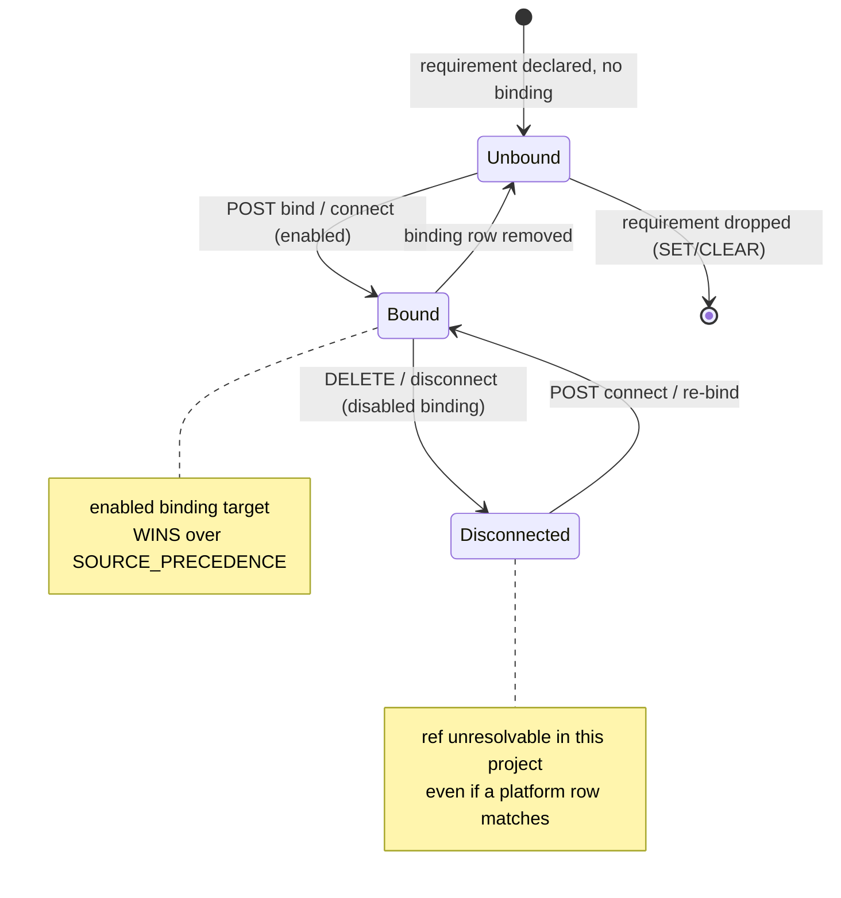
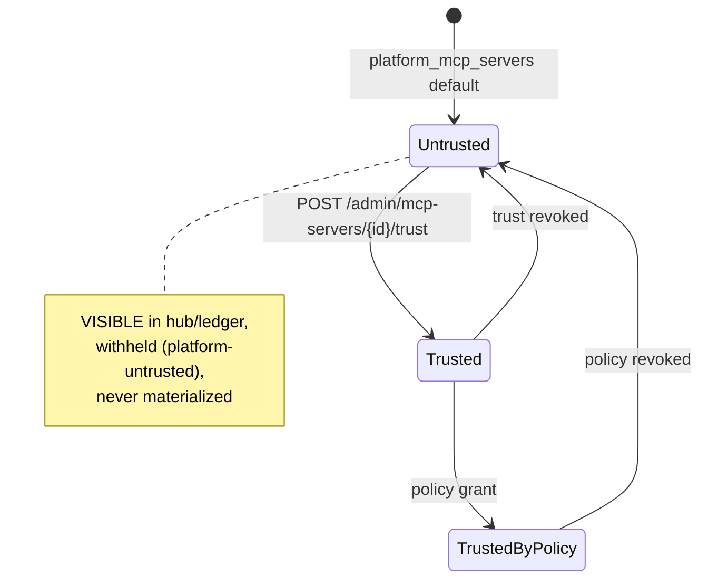
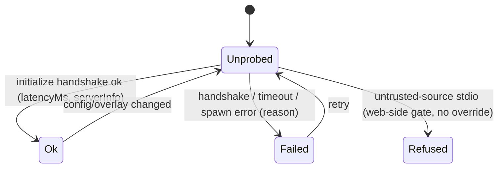
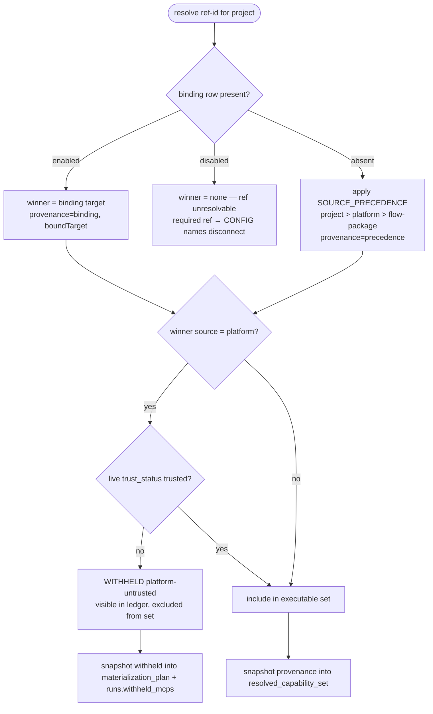
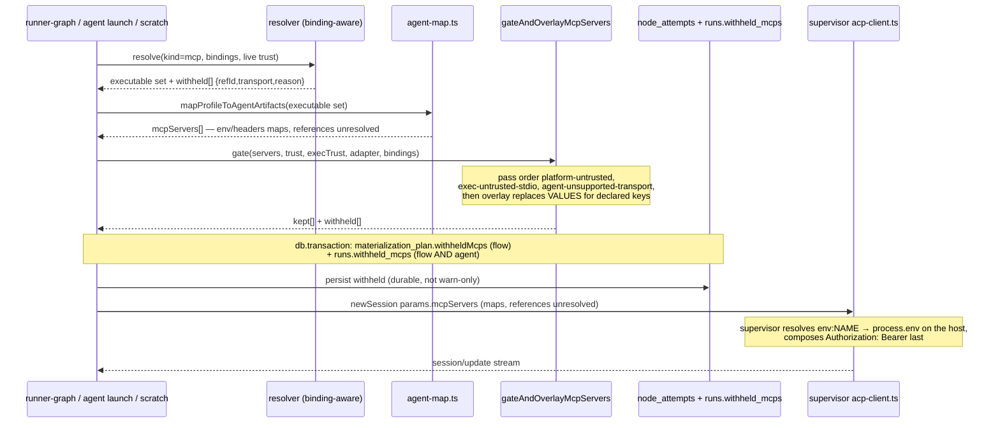
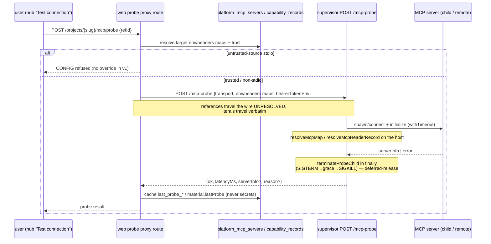

# MCP capability management domain

> **Status: mixed.** The platform CRUD + capability-materialization surface is
> **Implemented** ([ADR-070](../decisions.md#adr-070)). MCP Management v2
> ([ADR-129](../decisions.md#adr-129)) is **Implemented**: the
> `project_mcp_bindings` table + migration `0093`, the binding-aware resolver
> with `provenance`, load-bearing trust + withheld persistence, the per-project
> env-slot overlay, the supervisor `POST /mcp-probe` + web proxy
> with the D4 trust gate, the hub read model + requirements ledger, the
> board-header metacell, the admin trust action + used-by column, the board
> hub tab (requirements ledger + 3-source servers list + match/connect/overlay
> dialogs + test-connection with inline result), the shared node/scratch
> MCP-select (W-G) + agent effective-MCPs list, and the seeded hub e2e.
> The value model ([ADR-179](../decisions.md#adr-179)) is **Implemented**:
> `env`/`headers` value maps, the `bearerTokenEnv` field, value-replacing
> overlays, host env-ref readiness, and the adapter transport gate.
> Acceptance SSOT
> [`.ai-factory/specs/feature-mcp-management-v2.md`](../../.ai-factory/specs/feature-mcp-management-v2.md);
> pieces below are tagged with their current status. Extends the
> materialization surface in [capabilities.md](capabilities.md) and the
> authored catalog in [capability-catalog.md](capability-catalog.md).

## Purpose

This domain covers how Model Context Protocol (MCP) servers are **declared,
matched, bound, configured, and materialized** across the three scopes of a
MAIster deployment: the **platform instance** (admin-owned, host-wide catalog),
a **project** (project-admin-owned bindings + local servers), and a
**flow-package** (a requirement or a shipped template inside a `flow.yaml` /
package manifest).

v2 replaces the implicit "`refId` string-equality" resolution model with an
**explicit requirements & bindings layer**: a package declares a *requirement*
or ships a *template*; the platform catalogs servers once; a project **binds** a
ref to a concrete target and may **override** its per-project config (the
VALUE behind a declared slot). Two dormant signals become load-bearing —
`trust_status` (untrusted ⇒ visible-but-not-executable) and a real `initialize`
**health probe**. Every value is whole-value `literal | env:NAME`; the value
behind a reference is resolved only on the execution host and is never stored,
returned, streamed or logged. Out of scope: MCP marketplace / reputation / malware scanning / sandboxing / org policy
/ version pinning / OAuth (see the SDD §2).

## Domain entities

- **`platform_mcp_servers`** (Implemented; trust column now load-bearing) —
  admin-managed, host-wide MCP catalog. One row per server:
  `{ id, description, transport ∈ {stdio,sse,http}, command, args,
  env jsonb (Record<envName, value>), url, headers jsonb
  (Record<headerName, value>), bearer_token_env, supported_agents,
  trust_status ∈ {untrusted,trusted,trusted_by_policy},
  readiness_status, readiness_reasons, last_probe_status, last_probe_at,
  last_probe_reason, enabled, created_at, updated_at }`. The
  `last_probe_*` columns (Implemented) cache the admin global probe; the two
  pre-ADR-179 name-list columns were replaced by the value maps in migration
  `0172_mcp_env_values`. See
  [db/projects-domain.md](../db/projects-domain.md).
- **`project_mcp_bindings`** (Implemented, W-A) — the explicit binding of a **ref**
  to a concrete MCP **target** within one project:
  `{ id, project_id (CASCADE), ref_id, target_kind ∈ {platform,project,package},
  target_id, enabled (default true), config_overlay jsonb, recommended_hint,
  created_by, created_at, updated_at }`, unique `(project_id, ref_id)`. An
  enabled binding **wins over precedence**; a disabled binding makes the ref
  **unresolvable** (opt-out); an absent binding is **grandfather** (today's
  behavior). See [db/projects-domain.md](../db/projects-domain.md).
- **`capability_records` kind=mcp** (Implemented; extended v2) — one row per
  declared MCP in the project registry, `source ∈ {platform, project,
  flow-package}`. `material` jsonb carries the transport shape plus ONE map
  shape for every source — `env`, `headers` (both `Record<name, value>`) and
  `bearerTokenEnv`, values under the shared grammar; a package **requirement**
  row keeps its declared slots as the keys of `env` with `env:NAME` values, and
  a **template** row keeps the values it declared. The package **requirement**
  marker and the `material.lastProbe`/`material.readiness` cache (Implemented)
  also live here.
  Enabled = `disabled_at IS NULL`. See
  [db/capabilities-domain.md](../db/capabilities-domain.md).
- **Requirements ledger** (Implemented, W-A) — a **derived** read model (never
  stored redundantly) aggregating refs from attached packages' manifest
  `mcps[]` requirement-only entries, `settings.mcps.required/additional` across
  enabled flow revisions, and attached agents' `capability_profile.mcps`; each
  classified `bound | auto | unbound | misconfigured | not_ready`.
- **Config overlay** (Implemented, W-C; value semantics ADR-179) — per-binding
  `{ envRemap?, headerRemap?, bearerTokenEnv?, argsOverride?, urlOverride? }`
  validated against the target's declared slots (the KEYS of its `env`/`headers`
  maps); application replaces the **VALUE** for a declared key and preserves the
  key, wire shape unchanged. `bearerTokenEnv` is accepted only for an http/sse
  target.
- **MCP transport** — discriminated union: `stdio { command, args?, env? }` |
  `sse { url, headers?, bearerTokenEnv? }` |
  `http { url, headers?, bearerTokenEnv? }`. `sse` is legacy — deprecated by MCP
  2025-03-26 and absent from the ACP v2 schema — and is still creatable. Every
  `env`/`headers` value is whole-value `literal | env:NAME`; `bearerTokenEnv` is
  `env:NAME` only. Normalization is by transport on both sides of the wire:
  stdio drops `url`/`headers`/`bearerTokenEnv`, sse/http drop
  `command`/`args`/`env`. See [configuration.md](../configuration.md).
- **Required vs additional** — node `settings.mcps: { required?, additional? }`
  (bare `string[]` ⇒ `additional`). An unresolvable `required` ref blocks
  launch; an absent `additional` ref degrades gracefully.
- **Provenance + withheld** (Implemented, W-B/W-E) — `resolved_capability_set.mcps[]`
  gains `provenance ∈ {binding,precedence}` (+ `boundTarget`); `withheldMcps[]`
  is persisted into `node_attempts.materialization_plan` (flow) and
  `runs.withheld_mcps` (both flow and agent). `reason ∈ {platform-untrusted,
  exec-untrusted-stdio, agent-unsupported-transport}`, applied in that pass
  order so the strongest refusal names the withhold.

## State machines

### Binding lifecycle (Implemented)

### Trust activation (Implemented — makes the inert column load-bearing)

### Probe (Implemented — per target, per project)

## Process flows

### Binding-vs-precedence resolution (Implemented — the core v2 rule)

For each ref, an enabled binding wins; a disabled binding suppresses; an absent
binding falls through to `project > platform > flow-package` precedence
(canonical in [capabilities.md](capabilities.md)). The platform winner then
passes the live trust gate.

### Trust, overlay and transport gate + withheld visibility (Implemented — kills the silent log-only downgrade)

`gateAndOverlayMcpServers` is the one gate, taken by all three launch surfaces —
the flow node (`runner-graph.ts`), the standalone agent (`agents/launch.ts`) and
the scratch session (`scratch-runs/service.ts`). The local-package assistant
launch has no project and therefore no catalog MCPs, so it is a proven
non-path, not an exemption.

### Per-project overlay application (Implemented — value replace, wire unchanged)

For each overlay key present in the target's `env`/`headers`, the overlay
replaces the **VALUE** and keeps the **KEY**, web-side after
`mapProfileToAgentArtifacts`; `argsOverride`/`urlOverride`/`bearerTokenEnv`
replace their fields outright. The ACP `mcpServers` wire shape is unchanged and
the supervisor still resolves references on the host. Project A and project B
can therefore point the same key of the same platform MCP at different sources —
a different host variable, or a plain literal such as a `GH_HOST` override —
while the child process keeps reading the variable name its server expects. The
key is the server's contract, not ours; renaming it (the pre-ADR-179 behavior)
meant the server never received the variable it reads.

### Health probe handshake (Implemented — real MCP `initialize`)

### MCP readiness — host env-ref presence, cached on write (Implemented)

`evaluateMcpReadiness(row, { presence, adapters })` (`web/lib/mcp/readiness.ts`)
derives `readiness_status`/`readiness_reasons` from transport config ×
**host env-ref presence** × supported-agent adapter availability (a server none
of whose `supported_agents` map to an `available` adapter is `NotReady`;
undeclared agents mean "all adapters"; diagnostics reporting no adapters skip
the gate).

Presence comes from `HostAdminClient.checkEnvRefs(names)` over the supervisor's
`POST /diagnostics/env-refs`, which answers `{ name, present }` per name and
never a value; the client dedupes, chunks by the route's 64-name cap and merges
in request order. The names are collected from the `env:NAME` values across
`env`, `headers` and `bearerTokenEnv` — a **literal value never produces a
reason**. `GET /diagnostics.envRefs` is untouched and remains the runner
readiness source.

The verdict is **cached at write time on all three row kinds**: platform rows in
`readiness_status`/`readiness_reasons` on `POST`/`PATCH /api/admin/mcp-servers`;
project rows in `material.readiness` on `createProjectMcp`/`updateProjectMcp`;
package rows in `material.readiness` at `attachPackage`/`upgradeAttachment`
ingestion. `composeProjectMcpHub` reads `material.readiness` for non-platform
entries and the panel renders the status **and its reasons**.

The two host reads (`diagnostics()` and `checkEnvRefs`) are issued BEFORE the
transaction — they are reads, not side effects. Any host failure (unreachable,
timeout, 5xx, fenced) yields readiness `Unknown` plus one WARN naming the host
cause code; the write commits and the route returns 2xx.

Presence is host-scoped by construction and no value ever leaves the host.
Resolving values web-side and pushing them down is rejected: it would put
secrets on the web→supervisor wire, into the command ledger's input payload and
into web process env. A per-host readiness matrix is out of scope until a second
execution host exists.

## Value grammar, secret guard and transport gate (Implemented — ADR-179)

One grammar serves web validation (`web/lib/mcp/value-grammar.ts`), the
supervisor schema (`supervisor/src/types.ts`), the package manifest and the
binding overlay. A value is **whole-value**: there is no interpolation, so a
literal containing `${X}` reaches the server unchanged.

| Value | Class | Web | Supervisor | Resolution on the host |
|---|---|---|---|---|
| does not start with `env:` | literal | accepted; warned under a secret-shaped key | accepted | passed verbatim |
| `env:NAME` matching `^env:[A-Za-z_][A-Za-z0-9_]*$` | env-ref | accepted | accepted | `process.env[NAME] ?? ""` |
| starts with `env:`, fails the regex | malformed | `CONFIG` 422, field `env.<key>` / `headers.<name>` / `bearerTokenEnv` | `PRECONDITION` 409 | never reaches resolution |
| `bearerTokenEnv` | env-ref only | `CONFIG` unless `env:NAME`; `CONFIG` with an `Authorization` header row | same (409) | `Authorization: Bearer ` + `(process.env[NAME] ?? "")`, appended LAST |
| literal header value containing CR, LF or another control character | invalid field-value | `CONFIG` 422, field `headers.<name>` | `PRECONDITION` 409 | never reaches resolution |

Keys: env names `^[A-Za-z_][A-Za-z0-9_]*$`; header names are RFC 7230 tokens
`^[!#$%&'*+.^_\x60|~0-9A-Za-z-]+$`. Literal header values are held to the RFC
7230 field-value alphabet at write, so a header injection is refused rather than
discovered as a runtime `fetch` failure. An `env:NAME` value is not checked that
way — the resolved value is only known on the host, and readiness cannot predict
it.

**Secret guard (UI warning, never a refusal).** The form warns inline when a
LITERAL value sits under an env key with a `_`-delimited segment in
{`TOKEN`, `SECRET`, `PASSWORD`, `PASSWD`, `API_KEY`, `APIKEY`, `PRIVATE_KEY`,
`ACCESS_KEY`} (so `MY_TOKEN_2` warns and `TOKENIZER_MODE` does not), or under a
header named {`Authorization`, `Proxy-Authorization`, `Cookie`, `X-Api-Key`,
`X-Auth-Token`}; both case-insensitive. The routes accept the value. A literal
is the operator's declaration that the value is not a secret; the invariant that
holds unconditionally is about REFERENCES — the value behind `env:NAME` is
resolved only on the execution host.

**Transport gate.** `mcpTransportsForAdapter(adapter)`
(`web/lib/acp-runners/adapter-support.ts`) is the accessor for the per-adapter
transport list: codex is `["stdio","http"]` (verified against the shipped
`codex-acp` binary, whose `createMcpSeverConfig` throws `invalidRequest` for
`sse`), claude is `["stdio","sse","http"]` (also verified); the other three
carry an explicit unverified marker. The gate splits by how the ref was
declared:

- A **REQUIRED** ref whose transport the launch adapter cannot use refuses the
  launch at the existing precondition (`firstAgentUnsupportedRequiredMcp` →
  `EXECUTOR_UNAVAILABLE` 503) — before a worktree or a run row exists. This is
  the same site that already refuses on `supported_agents`; the distinction now
  covers two reasons.
- An **ADDITIONAL** ref is withheld by the third `partitionWithheldMcps` pass
  with reason `agent-unsupported-transport`, persisted like the two trust
  reasons. Pass order is `platform-untrusted` > `exec-untrusted-stdio` >
  `agent-unsupported-transport`, so an untrusted server withheld for trust is
  never relabelled by a later pass.

## Expectations

1. A `project_mcp_bindings` row MUST be unique on `(project_id, ref_id)`; an enabled binding's target MUST win over `SOURCE_PRECEDENCE`, and a disabled binding MUST make the ref unresolvable in that project. (Implemented)
2. An **absent** binding MUST leave resolution exactly as today (grandfather) — zero behavior change for any project without bindings. (Implemented)
3. Every binding route MUST derive `project_id` from the URL slug (server-state) and validate `target_kind`/`target_id` against existing rows of the matching kind; a platform target MUST be `enabled`+trusted to bind as executable, else `CONFLICT`/`CONFIG`. (Implemented)
4. `config_overlay` MUST validate against the target's declared slots — the KEYS of its `env`/`headers` maps — at write AND materialization (unknown slot → `MaisterError("CONFIG")` 422), and application MUST replace only the VALUE for a declared key while PRESERVING the key, keeping the ACP `mcpServers` wire shape unchanged. (Implemented)
5. The value behind an `env:NAME` reference MUST NEVER appear in a binding row, HTTP response, `session/update`, `materialization_plan`, `runs.withheld_mcps`, or a log — it is resolved only on the execution host, and env-ref readiness MUST read host-scoped PRESENCE (`POST /diagnostics/env-refs` returns `{name, present}`, never a value); a LITERAL value is the operator's declaration that it is not a secret and MUST be warned, never refused, under a secret-shaped key; `bearerTokenEnv` MUST be an `env:NAME` and MUST NOT coexist with an `Authorization` header row (`CONFIG` 422 web, `PRECONDITION` 409 supervisor). (Implemented invariant, extended)
6. A winning `source='platform'` record with live `trust_status='untrusted'` MUST be excluded from the executable set and recorded withheld `platform-untrusted`, while remaining VISIBLE in the requirements ledger/hub. (Implemented)
7. The grandfather migration MUST set `trust_status='trusted'` for every `enabled=true AND trust_status='untrusted'` platform row and MUST leave `enabled=false` rows (Serena) untouched. (Implemented)
8. Every withhold — `platform-untrusted`, `exec-untrusted-stdio` or `agent-unsupported-transport` — MUST be persisted (flow into `node_attempts.materialization_plan.withheldMcps`; flow, agent and scratch into `runs.withheld_mcps`) with NO silent warn-only path as the sole record, and MUST be applied identically by every launch surface that passes through `gateAndOverlayMcpServers` — the flow node, the standalone agent, and the scratch session. (Implemented)
9. `resolved_capability_set.mcps[]` MUST record `provenance ∈ {binding,precedence}` (+ `boundTarget` when bound) at launch; pre-migration runs MUST read it absent without error. (Implemented)
10. The requirements ledger MUST honor SET/CLEAR/re-SET symmetry: dropping the last declaring flow-revision/package/agent drops the requirement; re-adding restores it. (Implemented)
11. Supervisor `POST /mcp-probe` MUST release the child + timer on every path; the web probe proxy MUST refuse an untrusted-source stdio probe with a typed reason and have NO override path in v1. (Implemented)
12. A package manifest `mcps[]` entry with neither `command` nor `url` MUST be a valid requirement (no `schemaVersion` bump); an entry with an implementation stays a template; `recommendedPlatformServerId` is an optional `capabilityRefId`. (Implemented)

## Edge cases

| Case | MaisterError code | HTTP |
|---|---|---|
| Bind unknown ref (not in ledger + not a registered ref) | `CONFIG` | 422 |
| Bind to non-existent target, or `target_kind` mismatch | `CONFIG` | 422 |
| Bind a target implementing a different ref (`target.refId ≠ ref_id`) | `CONFIG` | 422 |
| Bind a disabled/untrusted platform target as executable | `CONFLICT` | 409 |
| `config_overlay` names an unknown slot (write or materialization) | `CONFIG` | 422 |
| Second binding for the same `(project, ref)` | `CONFLICT` | 409 |
| Required ref with a **disabled** binding at launch | `CONFIG` | 422 (names disconnect) |
| Required ref unresolved (no candidate, no binding) at launch | `CONFIG` | 422 |
| Required ref agent-unsupported transport at launch (codex + `sse`) — refused before any worktree or run row (Implemented) | `EXECUTOR_UNAVAILABLE` | 503 |
| Additional ref agent-unsupported transport at launch | withheld `agent-unsupported-transport` (persisted) | n/a |
| Scratch launch selecting a server the adapter cannot use | withheld `agent-unsupported-transport`, persisted to `runs.withheld_mcps` | n/a |
| Probe an untrusted-source stdio MCP | `CONFIG` (typed refusal, no override) | 422 |
| Probe target missing / not connected | `PRECONDITION` | 409 |
| Trust route unknown platform id | `PRECONDITION` | 409 |
| Value starts with `env:` and fails the env-ref regex | `CONFIG` | 422 |
| `bearerTokenEnv` set alongside an `Authorization` header row | `CONFIG` | 422 |
| `bearerTokenEnv` on a stdio server | normalized away (web form) / `PRECONDITION` (supervisor) | 409 |
| Literal header value containing CR, LF or a control character | `CONFIG` | 422 |
| `POST /diagnostics/env-refs` unreachable while computing readiness | n/a — readiness `Unknown` + one WARN; the write commits | 2xx |
| Repeated Serena seed ensure | n/a | idempotent |
| Serena default projection (enabled=false, untrusted) | n/a | not materialized (now via real trust gate) |

## Linked artifacts

- **Acceptance SSOT (SDD):** [`.ai-factory/specs/feature-mcp-management-v2.md`](../../.ai-factory/specs/feature-mcp-management-v2.md) — entities, per-route identifier labels, Expectations, edge-cases, test matrix.
- **Decision (value model):** [ADR-179](../decisions.md#adr-179) — literal-or-reference `env`/`headers` maps, `bearerTokenEnv`, value-replacing overlays, host env-ref readiness, adapter transport gate (amends [ADR-070](../decisions.md#adr-070) and [ADR-129](../decisions.md#adr-129)); design record [`../plans/2026-09-21-mcp-configurator-env-model-design.md`](../plans/2026-09-21-mcp-configurator-env-model-design.md).
- **Decision:** [ADR-129](../decisions.md#adr-129) — requirements & bindings, per-project overlay, trust & health activation (amends [ADR-070](../decisions.md#adr-070) platform CRUD + [ADR-043](../decisions.md#adr-043) materialization visibility; extends [ADR-088](../decisions.md#adr-088) package manifest; fulfills [ADR-128](../decisions.md#adr-128) Serena trust-gate precondition).
- **Capability resolution precedence:** [capabilities.md](capabilities.md) — the project > platform > flow-package winner rule that an **absent** binding falls through to.
- **Materialization path:** [capabilities.md](capabilities.md) §Process flows — reused; v2 adds the trust gate, the value-replacing overlay, the adapter transport gate, and the withheld sinks.
- **Authored catalog:** [capability-catalog.md](capability-catalog.md) — authored publish does not mutate `platform_mcp_servers`.
- **Admin surface precedent:** [acp-runners.md](acp-runners.md) — `platform_mcp_servers` CRUD + delete-guard mirror `platform_acp_runners` (ADR-065).
- **OpenAPI (web):** [`../api/web.openapi.yaml`](../api/web.openapi.yaml) — bindings, connect/disconnect, project probe, admin trust + PATCH `trustStatus`.
- **OpenAPI (supervisor):** [`../api/supervisor.openapi.yaml`](../api/supervisor.openapi.yaml) — `POST /mcp-probe`.
- **ERD:** [`../db/capabilities-domain.md`](../db/capabilities-domain.md) + [`../db/projects-domain.md`](../db/projects-domain.md) — `project_mcp_bindings`, `platform_mcp_servers.last_probe_*`, `capability_records.material.lastProbe/readiness`, `runs.withheld_mcps`.
- **Screens:** [`../screens/mcps.md`](../screens/mcps.md) (admin trust + used-by) + [`../screens/projects/project-mcps-hub.md`](../screens/projects/project-mcps-hub.md) (project hub).
- **Migration:** `web/lib/db/migrations/0172_mcp_env_values.sql` — adds `env`/`headers`/`bearer_token_env`/`description`, backfills both stored key spellings, unifies the three `capability_records.material` shapes, drops the two pre-ADR-179 name-list columns.
- **Source (Implemented base):** `web/lib/capabilities/resolver.ts`, `web/lib/capabilities/agent-map.ts`, `web/lib/mcp/projection.ts`, `web/lib/mcp/readiness.ts`, `supervisor/src/acp-client.ts`, `web/app/api/admin/mcp-servers/*`.
- **Source (value model):** `web/lib/mcp/value-grammar.ts` (the one grammar), `supervisor/src/mcp-values.ts` (host resolution + bearer composition), `web/lib/mcp/materialization-gate.ts` (three withhold passes + overlay), `web/lib/acp-runners/adapter-support.ts` (`mcpTransportsForAdapter`).
