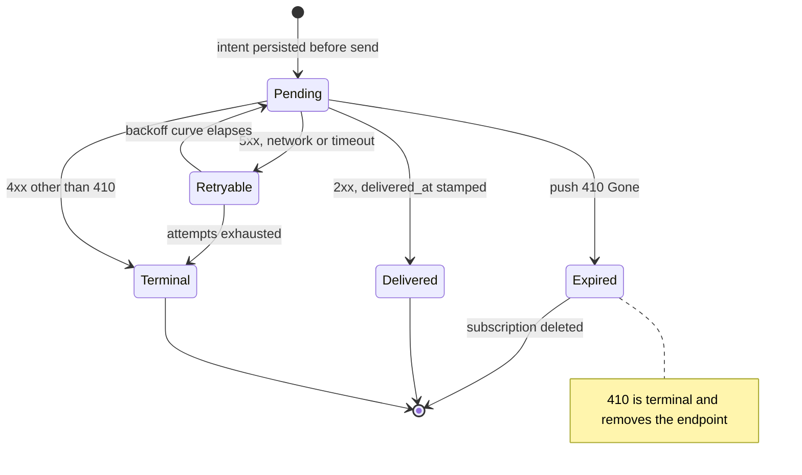
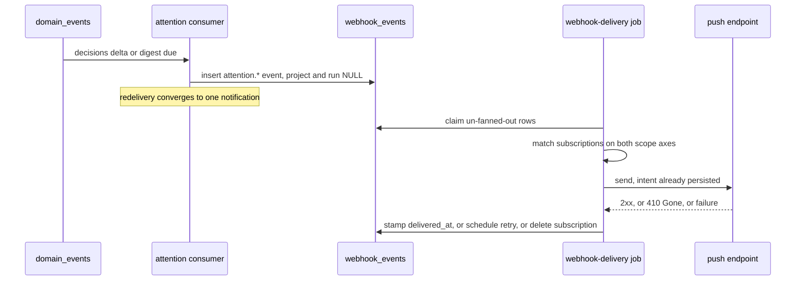
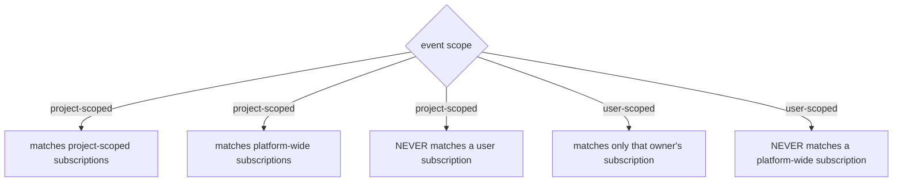

# Notifications

## Purpose

**User-scoped notification delivery**: per-user subscriptions, web-push
endpoints, and the delivery of `attention.*` events over the **widened**
ADR-077 outbound-webhook engine. The domain exists so a reader learns that a
decision is waiting without keeping a tab open. It deliberately introduces **no
second outbox, no second drainer and no second retry curve** — it widens the
one that ships today, and pays for that by enumerating every reader of the
columns it makes nullable. Locked by
[ADR-172](../decisions.md#adr-172-user-notification-subscriptions-and-web-push-over-the-widened-outbound-webhook-engine).
Project- and run-scoped webhook behaviour is owned by
[`outbound-webhooks.md`](outbound-webhooks.md) and is unchanged.

## Domain entities

- **`notification_subscriptions`** (persisted) — per-user delivery intent:
  which `attention.*` types, over which transport (`web_push | webhook`).
  See the [ERD](../db/erd.dbml).
- **`push_subscriptions`** (persisted) — a browser push endpoint and its keys,
  stored opaque and never parsed for routing.
- **`webhook_subscriptions`** (persisted, widened) — gains `owner_user_id`.
  Scope is now **two independent axes**: project (or platform-wide) and owner.
- **`webhook_events`** (persisted, widened) — `project_id` and `run_id` become
  nullable so a user-scoped event is representable.
- **`attention.*` event types** — `decision_opened`, `decision_closed`,
  `decisions_changed`, `digest`.
- **The `attention` domain-event consumer** — one entry in
  `DOMAIN_EVENT_CONSUMERS` plus its cursor row; no new clock.
- **VAPID configuration** — three environment variables; absent means "push
  unavailable", never a boot failure.

## State machine

A delivery row's lifecycle. Intent is persisted **before** the send; the
idempotency marker is stamped **after** it succeeds.

## Process flows

Emission to delivery. The consumer is idempotent because domain-event dispatch
is at-least-once.

Scope matching, both directions. This is the edit the widening makes necessary:
a nullable `project_id` on the event side must not be absorbed by the
"platform-wide" meaning of a nullable `project_id` on the subscription side.

## Expectations

- **NTF-01:** User-scoped events MUST ride the ADR-077 outbox; no second outbox, drainer or retry curve may be introduced.
- **NTF-02:** Every reader of `webhook_events.run_id` and `.project_id` MUST handle NULL, enumerated as a per-reader checklist with one case each.
- **NTF-03:** A platform-wide subscription MUST NOT match a user-scoped event, and a user subscription MUST NOT match a project-scoped event.
- **NTF-04:** The sender MUST persist delivery intent before the send and stamp `delivered_at` only after it succeeds.
- **NTF-05:** A push `410 Gone` MUST delete the subscription; every other failure MUST follow the existing retry curve.
- **NTF-06:** Signing secrets MUST be stored as `env:NAME` references only, never as plaintext in a column, log or payload.
- **NTF-07:** A personal token MUST be able to CRUD only its own owner's subscriptions; an unknown id MUST answer `404`, never `403`.
- **NTF-08:** Notification triggers MUST be `decisions` deltas and digests only, and MUST NEVER be per-event by default.
- **NTF-09:** `decisions:read` and `notifications:subscriptions` MUST be absent from `AGENT_TOKEN_SCOPES` and `CROSS_PROJECT_AGENT_SCOPES`.
- **NTF-10:** Missing VAPID configuration MUST degrade to "push unavailable" with a clear log line and MUST NEVER crash boot.

## Edge cases

- **EDGE-NTF-01:** At-least-once redelivery of the same domain event MUST converge to one notification; the consumer's `handle` is idempotent and a second dispatch produces no second send.
- **EDGE-NTF-02:** An expired push subscription answers `410 Gone`; the row is deleted rather than retried, and the reader's remaining transports are unaffected.
- **EDGE-NTF-03:** Existing project- and run-scoped webhooks MUST fan out, deliver, retry and prune exactly as before the widening — the nullable columns change no behaviour for rows that fill them.

## Linked artifacts

- [ADR-172 — user notification subscriptions and web push](../decisions.md#adr-172-user-notification-subscriptions-and-web-push-over-the-widened-outbound-webhook-engine)
- [ADR-168 — the `decisions` counter whose deltas trigger delivery](../decisions.md#adr-168-two-canonical-attention-counters-decisions-and-updates)
- [Outbound webhooks — the engine being widened](outbound-webhooks.md)
- [Domain events — the consumer registry and cursor model](domain-events.md)
- [M51 requirement traceability](m51-traceability.md)
- [Configuration — the canonical env table](../configuration.md)
- [`web/lib/webhooks/match.ts`](../../web/lib/webhooks/match.ts)
