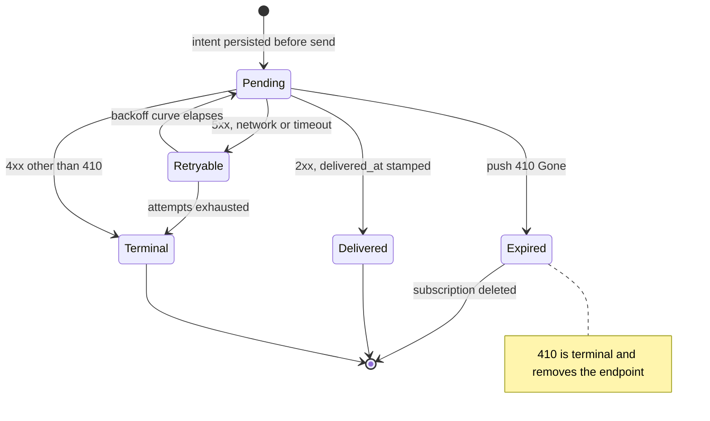
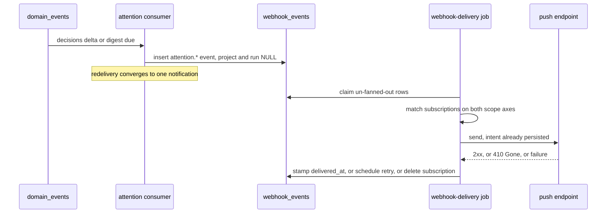
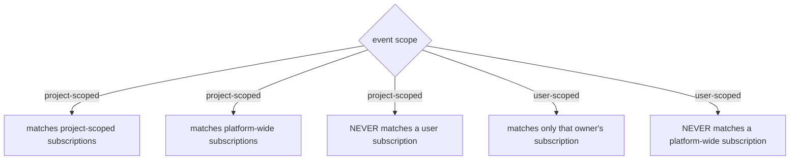

# Notifications

## Purpose

**User-scoped notification delivery**: per-user subscriptions, web-push
endpoints, and the delivery of `attention.*` events over the **widened**
ADR-077 outbound-webhook engine. The domain exists so a reader learns that a
decision is waiting without keeping a tab open. It deliberately introduces **no
second outbox, no second drainer and no second retry curve** — it widens the
one that ships today, and pays for that by enumerating every reader of the
columns it makes nullable. Locked by
[ADR-172](../decisions.md#adr-172-user-notification-subscriptions-and-web-push-over-the-widened-outbound-webhook-engine),
and **Implemented**.
Project- and run-scoped webhook behaviour is owned by
[`outbound-webhooks.md`](outbound-webhooks.md) and is unchanged.

## Domain entities

- **`notification_subscriptions`** (persisted) — per-user delivery intent:
  which `attention.*` types, over which transport (`web_push | webhook`).
  See the [ERD](../db/erd.dbml).
- **`push_subscriptions`** (persisted) — a browser push endpoint and its keys,
  stored opaque and never parsed for routing.
- **`webhook_subscriptions`** (persisted, widened) — gains `owner_user_id`.
  Scope is now **two independent axes**: project (or platform-wide) and owner.
- **`webhook_events`** (persisted, widened) — `project_id` and `run_id` become
  nullable so a user-scoped event is representable.
- **`attention.*` event types** — `decision_opened`, `decision_closed`,
  `decisions_changed`, `digest`.
- **The `attention` domain-event consumer** — one entry in
  `DOMAIN_EVENT_CONSUMERS` plus its cursor row; no new clock.
- **VAPID configuration** — three environment variables; absent means "push
  unavailable", never a boot failure.

## State machine

A delivery row's lifecycle. Intent is persisted **before** the send; the
idempotency marker is stamped **after** it succeeds.

## Process flows

Emission to delivery. The consumer is idempotent because domain-event dispatch
is at-least-once.

Scope matching, both directions. This is the edit the widening makes necessary:
a nullable `project_id` on the event side must not be absorbed by the
"platform-wide" meaning of a nullable `project_id` on the subscription side.

## As built

- **A `410` deletes the endpoint and nothing else is written.** The delete IS
  the operation: `webhook_deliveries.push_subscription_id` cascades from
  `push_subscriptions` and `webhook_delivery_attempts.delivery_id` cascades from
  `webhook_deliveries`, so the delivery row and every attempt on it go with the
  endpoint. Stamping the delivery `dead` first, or recording a closing attempt,
  would be writes the same transaction deletes.
- **`terminal` is a verdict the retry curve cannot reach.** `classifyResult`
  sees only a status, and a non-2xx, non-`410` 4xx below the attempt ceiling
  looks retryable to it — so a `403` from a push service would be re-sent seven
  more times across a day. The sender classifies instead and the ledger takes an
  explicit `terminal` flag; `408` and `429` are carved out of that arm by name,
  because they are the two 4xx that mean "later".
- **`webhook_deliveries` is the push ledger too.** ADR-172 D7 stamps
  `delivered_at`, which is a `webhook_deliveries` column, and that table's
  `subscription_id` was `NOT NULL` to `webhook_subscriptions` — a push endpoint
  has no HTTP subscription and no HMAC secret, so there was nowhere to record a
  push attempt. `0165` therefore also makes `subscription_id` nullable, adds
  `push_subscription_id`, and enforces `webhook_deliveries_one_target`
  (`(subscription_id IS NULL) <> (push_subscription_id IS NULL)`). One outbox,
  one drainer, one retry curve, one ledger — and a `410` cascade-deletes the
  attempts with the endpoint. Recorded as an ADR-172 amendment.
- **The platform scope had to be narrowed, and this is the highest-value thing
  the D2 enumeration found.** `subscriptions.ts` expressed "platform-wide" as
  `project_id IS NULL`. A user subscription is also `project_id IS NULL`, so the
  admin settings surface began listing, reading, deleting and exposing the
  deliveries of other people's PERSONAL subscriptions. "Platform" now means
  `project_id IS NULL AND owner_user_id IS NULL`, at all four call sites
  (`IT-NTF-02`).
- **The event's owner rides in `data.ownerUserId`.** ADR-172 rejected a `user_id`
  column on `webhook_events` (D3's bug with an extra column), so `emitWebhookEvent`
  is a two-arm union: the user-scoped arm takes `ownerUserId` and writes NULL
  project/run, and the project-scoped arm still requires both ids, so no existing
  caller can silently drop them.
- **Two triggers, two hosts.** The delta trigger is the `attention-notifications`
  domain-event consumer; the digest rides the existing `system_sweep` bundle
  rather than a new `scheduler_jobs.job_kind`, which would be a migration for a
  pass whose cadence is bounded by the digest WINDOW, not by the tick.
- **The digest passes the UNCACHED decision queue.** `getNowTileCounts` defaults to
  the React-`cache`d `getDecisionsQueue` — correct in a render, where the Desk's
  tiles and its Decisions region must be one computation (`ATN-05`) — but a
  long-lived sweep has no request to scope that memo, so the trigger injects
  `computeDecisionsQueue`.
- **VAPID lives in `.env.example` and the canonical env table only.** The plan
  asked for the `web` service `environment:` block of three compose files; no such
  block exists — per ADR-023 web runs on the host, and `compose.yml` /
  `compose.production.yml` define only `postgres`. This follows the
  `MAISTER_WEBHOOK_*` precedent, which those same docs mark "never `compose.yml`".
- **The service worker is a route, not a static file.** `web/public/` does not
  exist and the app runs behind a custom `server.ts`, so the worker is served by
  a route handler at `/sw.js` with `Service-Worker-Allowed: /`,
  `Content-Type: text/javascript` and `Cache-Control: no-store` — inside the Next
  build and outside any bind mount. It is deliberately absent from
  [`../api/web.openapi.yaml`](../api/web.openapi.yaml), which scopes itself to
  `app/api/`: this is an origin-root asset claiming root scope, not an API.
- **What the e2e can and cannot reach.** The service worker and its registered
  scope are asserted unstubbed in a real browser; the opt-in POST/DELETE round
  trip is real and session-authenticated. `pushManager.subscribe()` is NOT
  exercised — headless Chromium has no push service, so the call never resolves —
  and an actually-delivered push is therefore proven at the ledger by
  `IT-NTF-04`/`IT-NTF-05` rather than in a browser.

## Expectations

- **NTF-01:** User-scoped events MUST ride the ADR-077 outbox; no second outbox, drainer or retry curve may be introduced.
- **NTF-02:** Every reader of `webhook_events.run_id` and `.project_id` MUST handle NULL, enumerated as a per-reader checklist with one case each.
- **NTF-03:** A platform-wide subscription MUST NOT match a user-scoped event, and a user subscription MUST NOT match a project-scoped event. The admin platform SCOPE must likewise exclude user-owned subscriptions (`project_id IS NULL AND owner_user_id IS NULL`).
- **NTF-04:** The sender MUST persist delivery intent before the send and stamp `delivered_at` only after it succeeds. Push intent is persisted at fanout, one `webhook_deliveries` row per registered endpoint.
- **NTF-05:** A push `410 Gone` (or `404`) MUST delete the subscription. A push rejected with any other 4xx except `408`/`429` MUST settle `dead` without retrying — the same request cannot succeed later. Every remaining failure, including `408`/`429`, MUST follow the existing retry curve.
- **NTF-06:** Signing secrets MUST be stored as `env:NAME` references only, never as plaintext in a column, log or payload.
- **NTF-07:** A personal token MUST be able to CRUD only its own owner's subscriptions; an unknown id MUST answer `404`, never `403`.
- **NTF-08:** Notification triggers MUST be `decisions` deltas and digests only, and MUST NEVER be per-event by default.
- **NTF-09:** `decisions:read` and `notifications:subscriptions` MUST be absent from `AGENT_TOKEN_SCOPES` and `CROSS_PROJECT_AGENT_SCOPES`.
- **NTF-10:** Missing VAPID configuration MUST degrade to "push unavailable" with a clear log line and MUST NEVER crash boot.

## Edge cases

- **EDGE-NTF-01:** At-least-once redelivery of the same domain event MUST converge to one notification; the consumer's `handle` is idempotent and a second dispatch produces no second send.
- **EDGE-NTF-02:** An expired push subscription answers `410 Gone`; the row is deleted rather than retried, and the reader's remaining transports are unaffected.
- **EDGE-NTF-04:** A push service answering `429 Too Many Requests` MUST be retried on the normal curve, not settled `dead` — it is the one 4xx that means "later" rather than "no", and collapsing the whole 4xx range into "terminal" would drop a notification under load.
- **EDGE-NTF-03:** Existing project- and run-scoped webhooks MUST fan out, deliver, retry and prune exactly as before the widening — the nullable columns change no behaviour for rows that fill them.

## Linked artifacts

- [ADR-172 — user notification subscriptions and web push](../decisions.md#adr-172-user-notification-subscriptions-and-web-push-over-the-widened-outbound-webhook-engine)
- [ADR-168 — the `decisions` counter whose deltas trigger delivery](../decisions.md#adr-168-two-canonical-attention-counters-decisions-and-updates)
- [Outbound webhooks — the engine being widened](outbound-webhooks.md)
- [Domain events — the consumer registry and cursor model](domain-events.md)
- [M51 requirement traceability](m51-traceability.md)
- [Configuration — the canonical env table](../configuration.md)
- [`web/lib/webhooks/match.ts`](../../web/lib/webhooks/match.ts)
