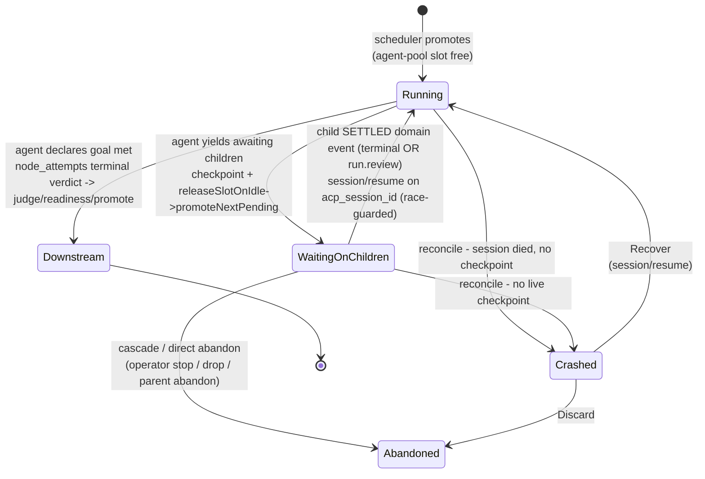
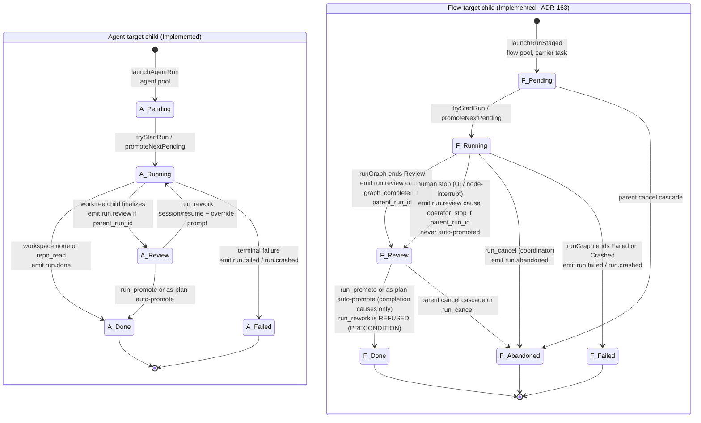
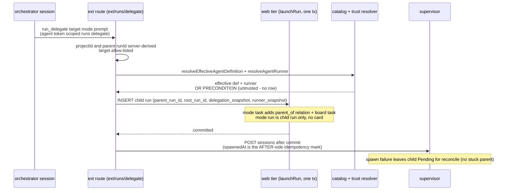
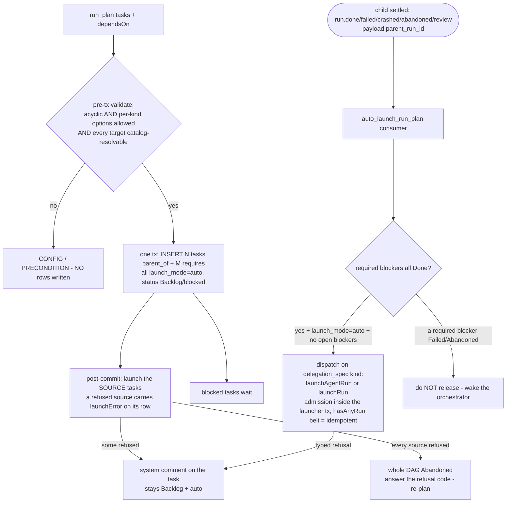
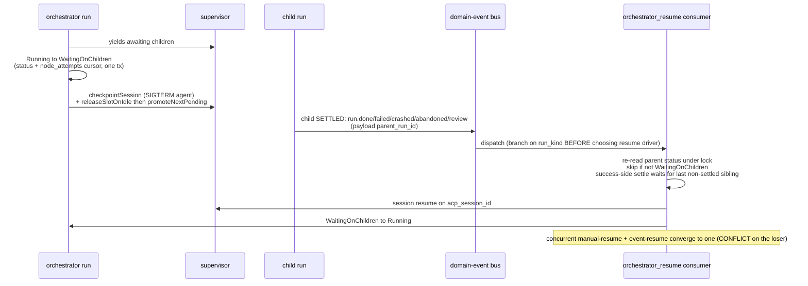
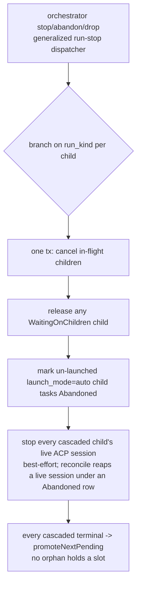
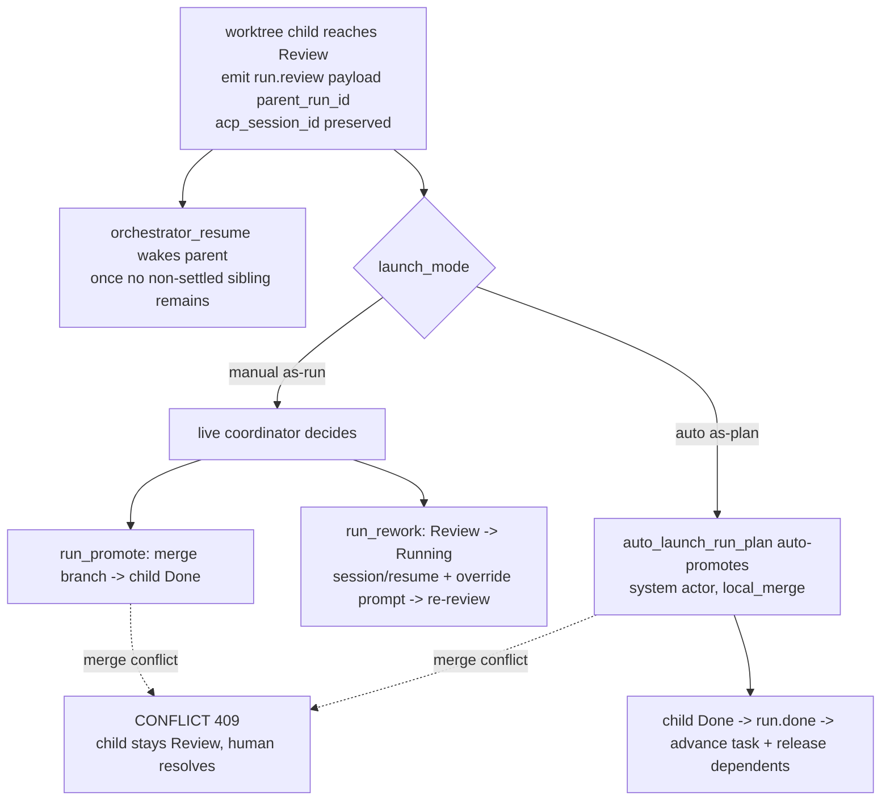
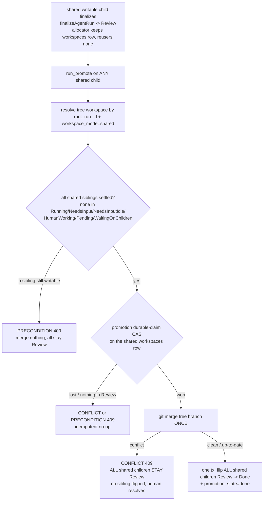
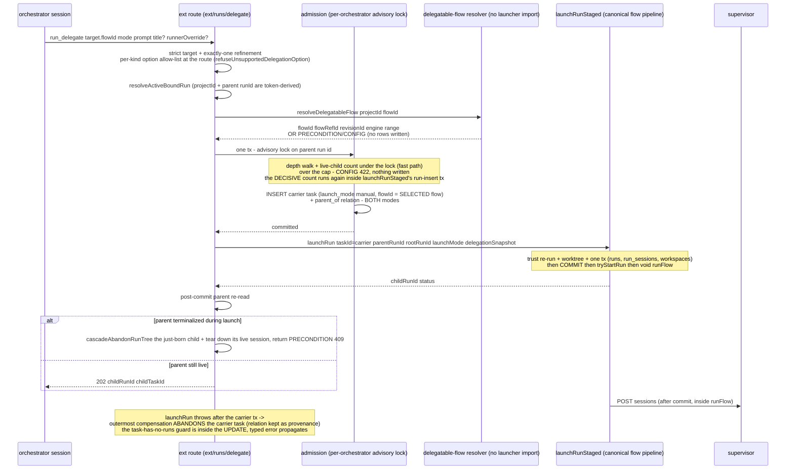

# Orchestrator engine domain

## Purpose

The orchestrator engine (**Implemented**, ADR-098/ADR-099) gives a running
agent governed **dynamic delegation**: an `orchestrator` flow node is a
long-lived supervisory step that spawns and coordinates child Runs, parks
(idle-checkpoints) while they execute, and reaches a terminal verdict only when
the agent declares the goal met. Every delegated unit stays a real, governed Run
(worktree, gates, promotion, board visibility, concurrency cap); dynamism lives
only in *coordination*, never in bypassing governance, and children are
catalog-resolved (the platform-agent effective definition —
[agents.md](agents.md)), never
runtime-authored. Boundary: this domain owns the `orchestrator` node lifecycle,
the run-tree (`runs.parent_run_id`/`root_run_id`), the `WaitingOnChildren` run
status, the delegation toolset over the MCP facade (`run_delegate` / `run_plan` /
`run_collect` / `run_cancel`), the success-gated `requires` relation kind, and the
idle-checkpoint wait + child-terminal-event resume loop. It does NOT own the base
run state machine ([runs.md](runs.md)), the outbox mechanics
([domain-events.md](domain-events.md)), the social-relation substrate it writes
through ([social-board.md](social-board.md)), the scheduler cap
([scheduler.md](scheduler.md)), the catalog/trust resolution it consumes
([agents.md](agents.md)), the consensus protocol
([consensus.md](consensus.md)), or capability enforcement (materialize-only per
ADR-041/ADR-043 — [flow-settings.md](flow-settings.md)). The shared-worktree
tree-level review/promote ownership model (re-enabling `workspace_mode: shared` for
writable worktrees) is **Implemented — ADR-102**; flow (f) and its
Expectations/Edge-cases carry that tag.

## Domain entities

- **Orchestrator node** (Implemented) — an `orchestrator` flow node (engine floor
  `1.6.0`) in a `FlowGraph`. Carries `action.prompt`, inherits the `ai_coding`
  capability `settings` shape, plus a `delegation` sub-block (`max_fanout?`,
  `max_depth?`). Executes as an ACP session like an `ai_coding` node, but with a
  **supervisory** lifecycle: park → delegate → `WaitingOnChildren` → resume →
  complete → downstream transition. Recorded in the `node_attempts` ledger under
  the new `node_attempts.node_type = orchestrator`. See [flow-dsl.md](../flow-dsl.md).
- **Run-tree** (Implemented) — child Runs linked to their parent by
  `runs.parent_run_id` (FK→`runs`, on-delete set-null) and to the orchestrator at
  the top of the tree by `runs.root_run_id` (FK→`runs`). A child may itself be an
  orchestrator (bounded by `MAISTER_ORCHESTRATOR_MAX_DEPTH`). See
  [db/runs-domain.md](../db/runs-domain.md).
- **`runs.delegation_snapshot`** (Implemented) — jsonb on the child run holding
  the launch-time identity resolved at spawn, discriminated by `kind`: the
  effective agent-definition id + pinned revision for an agent child, a
  consensus participant for `kind: 'runner'` (ADR-109), the flow ref + pinned
  revision + branch pair for a flow child (ADR-163); the resolved runner stays
  in the run's `run_sessions.runner_snapshot` (never duplicated). The terminal/enforcement path reads the snapshot, never a drifting
  live projection.
- **`runs.launch_mode`** (Implemented) — `auto` | `manual`. `run_plan`-emitted child
  tasks are `auto` (the auto-launcher and cancel-cascade key on this); manually
  launched runs are `manual`.
- **`WaitingOnChildren` run status** (Implemented) — a `runs.status` value for an
  orchestrator that has yielded awaiting children. Holds **no** scheduler slot
  (the agent idle-checkpoints); allow-listed in every run-status consumer (read
  models, board, sweeps, guards) and **excluded** from the
  `MAISTER_MAX_CONCURRENT_AGENTS` cap. See [runs.md](runs.md).
- **`requires` task relation** (Implemented) — a success-gated `task_relations.kind`:
  releases a dependent **only** when the required task is `Done`; `Failed` /
  `Abandoned` keeps it blocked and wakes the orchestrator. Distinct from
  `depends_on` / `blocks` (release on Done **and** Abandoned) and `parent_of`
  (never gates). See [social-board.md](social-board.md).
- **Delegation toolset** (Implemented) — `run_delegate` / `run_plan` /
  `run_collect` / `run_cancel`, plus `run_message` (re-message a persistent
  swarm child, ADR-099) and `run_promote` / `run_rework` (resolve a reviewed
  child, ADR-100), exposed over the maister MCP facade and reachable only from an
  `orchestrator` session via a per-launch ephemeral run-bound token carrying
  `ORCHESTRATOR_TOKEN_SCOPES`
  (`runs:delegate`+`runs:collect`+`runs:cancel`+`runs:promote`). See
  [`../api/external/operations.openapi.yaml`](../api/external/operations.openapi.yaml)
  (`/api/v1/ext/runs/*`).

- **Flow-target delegation** (Implemented — ADR-163) — a `run_delegate` / `run_plan`
  `target` carrying `flowId` instead of `agentId`. The two are a **discriminated
  union**: exactly one field, enforced by schema rather than by procedural
  fallback. A Flow target resolves ONLY through the bound orchestrator's project
  (`resolveFlowRef` over `flows.id` | `flows.flow_ref_id`), must pass the same
  enablement + trust + pinned-revision + package-status + setup + schema-version +
  engine allow-list a board launch passes, and then launches through the
  **canonical Flow Run pipeline** (`launchRunStaged`) — never `launchAgentRun`.
  A package path, git tag, filesystem path, URL, or inline definition is never
  accepted.
- **Carrier task** (Implemented — ADR-163) — the server-minted `tasks` row a Flow
  target always gets, because a Flow run cannot exist without one
  (`assertFlowRunInvariant` requires `taskId && flowId`; `loadRun` throws
  `PRECONDITION` without a task; the Flow prompt entry point IS `task.prompt`).
  Minted inside the admission transaction with `launch_mode='manual'`,
  `flowId` = the **selected** child flow (never inherited from the orchestrator's
  task), `title` = `body.title` else the prompt's first line, and always linked
  `parent_of` under the orchestrator's task — in BOTH modes. `mode` is therefore
  **not** a board-visibility switch for Flow targets; the response always carries
  `childTaskId`. Its id is server-state, never accepted from the body.

## State machine

The orchestrator-run execution axis. The base run FSM is in [runs.md](runs.md);
this diagram shows only the `WaitingOnChildren` wait/resume cycle that the
orchestrator engine adds.
All transitions Implemented.



Cancel or abandon of the orchestrator run (operator stop / drop / abandon)
**cascades** to the entire child run-tree in one transaction — see flow (d) and
Expectation 11. `WaitingOnChildren` re-reads its status under lock before any
resume RPC (Expectation 9), so a concurrent manual-resume and event-resume
converge to a single resume.

The delegated-child execution axis, side by side by target kind. The Agent-target
child (left, Implemented) may skip `Review` entirely when its workspace axis is
`none` / `repo_read`; the Flow-target child (right, **Implemented — ADR-163**)
always provisions a worktree and therefore ALWAYS parks in `Review` until the
coordinator promotes it. Both wake the parent through the SAME settled-event set.



## Process flows

### (a) as-run / as-task delegation (Implemented)

The orchestrator calls `run_delegate` over the facade; the ext route hands the
**web tier** the transaction (run row + task/relation rows), and the supervisor
`POST /sessions` happens only **after** commit. `as-task` adds a `parent_of`
relation + a board task; `as-run` creates a child run with `parent_run_id` and no
board card.



### (b) as-plan task-DAG with `requires` success-gate + auto-launcher (Implemented)

`run_plan` validates the DAG **before** any write (acyclic, per-kind options,
every target resolvable), takes the per-orchestrator admission lock in the DAG
transaction, then emits N child tasks + M `requires` relations in **one**
transaction, all `launch_mode='auto'`. As each blocker terminates `Done`, the
`auto_launch_run_plan` consumer flips the producer task `Done`, clears the
`requires` edge, and dispatches the now-unblocked dependent on its
`delegation_spec` kind — `launchAgentRun` for an agent, `launchRun` for a flow
(ADR-163) — with cap admission and the decisive depth/fan-out bound inside that
launcher's run-insert transaction, so there is no separate `promoteNextPending`
mark; the per-task `hasAnyRun` belt makes a redelivered window idempotent. A
typed refusal at release time (the target was disabled, untrusted or upgraded
past this engine) is posted as a system comment on the task, which stays
`Backlog`/`auto` for the next settle. `run_plan`'s own post-commit SOURCE launch
follows the same rule **(Implemented — ADR-163 amendment)**: a refused source
is reported on its result row (`launchError`) and as that system comment, and
stays `Backlog` for the next sibling settle; when EVERY source is refused
nothing can ever settle, so the committed DAG is abandoned
(`abandonUnlaunchedTasks`, parity with `run_delegate`'s compensation) and the
call answers the refusal's code (`PRECONDITION` when the codes mix, each line
tagged `[CODE]`) — the parent, counting zero child runs, would otherwise
complete its node over a dead DAG.



### (c) idle-checkpoint wait then child-terminal resume — the inbox (Implemented)

When the orchestrator yields awaiting children it transitions
`Running → WaitingOnChildren`, checkpoints, and releases its agent-pool slot. A
child is **SETTLED** when it reaches a terminal state (`Done` / `Failed` /
`Crashed` / `Abandoned`) OR `Review` (a diff awaiting the coordinator); each
settled transition emits a domain event carrying `parent_run_id`. A
`Failed`/`Crashed`/`Abandoned` child wakes the parent unconditionally; a
success-side settle (`run.done` OR `run.review`) wakes it only once no pending
(non-settled, `SETTLED_RUN_STATUSES`) sibling remains. The `orchestrator_resume`
consumer does the wake via ACP `session/resume`; a child reaching `Review` keeps
its `acp_session_id` so a later `run_rework` can resume it.



### (d) cancel / abandon cascade down the run-tree (Implemented)

Stopping, abandoning, or dropping an orchestrator run cascades to its children in
one transaction; every cascaded terminal honors `promoteNextPending`. The
cascade flips rows only — sessions live in the supervisor and the graph runner
never re-reads `runs.status` — so every tree-cancelling caller (operator stop /
drop, the abandon route, the coordinator's `run_cancel` of a child that itself
orchestrates, the budget tree-terminate, the orphan-child compensation, the
`orchestrator-stuck` crash) goes through ONE composition,
`cascadeAbandonRunTreeAndStopSessions`, which also stops every cascaded
descendant's live ACP session; the reconcile sweep reaps any live session a
crash or a supervisor hiccup leaves under an `Abandoned` row
**(Implemented — ADR-163 amendment)**.



### (e) reviewed-child settle → promote / rework / auto-promote (Implemented, ADR-100)

A `worktree` child runs to `Review` (a diff), not straight to `Done`. Reaching
`Review` emits `run.review` (only when the child has a parent; `acp_session_id`
is preserved). The coordinator's choice differs by `launch_mode`: a **manual**
(as-run) child waits for the live coordinator to `run_promote` (merge → `Done`)
or `run_rework` (`Review → Running` + `session/resume` with an override prompt);
an **as-plan** (`launch_mode='auto'`) child is **auto-promoted** by
`auto_launch_run_plan` (system actor, `local_merge`) so the DAG flows without a
live coordinator. A merge conflict surfaces as `CONFLICT` (409) and leaves the
child in `Review` — never auto-resolved (§8). **(Implemented — ADR-163
amendment)** `run.review` carries a `cause` (`graph_completed | agent_exit |
operator_stop | rework_released | sync_returned`) and the auto-promote fires
only for the two completion causes: an operator stop, a released rework claim
or a sync-resolver return wakes the parent exactly the same way but parks the
child in `Review` for the coordinator or a human — the stop's partial diff is
not finished work. Fail-closed: a cause-less event is never promoted.



### (f) shared-tree review/promote — one tree, one Review, one promote (Implemented — ADR-102)

A `workspace_mode='shared'` writable tree is ONE branch with ONE cumulative diff, so
every shared writable child finalizes to `Review` (not `Done`) and the WHOLE tree is
promoted once. The allocator (first) child owns the tree `workspaces` row; a
`run_promote` on ANY shared child resolves that row by `(root_run_id,
workspace_mode='shared')`, re-checks under lock that every shared sibling is settled,
merges once, and flips ALL shared children `Review → Done` in one transaction. The
settled-gate and the merge run BEFORE the cross-tree settle flip; exactly-once falls
out of the promotion durable-claim CAS plus the `status === 'Review'` re-check.



### (g) flow-target delegation — carrier task, canonical launcher, post-commit parent re-check (Implemented — ADR-163)

A `target.flowId` delegation runs the SAME pipeline a board Launch runs. Every
refusal above the carrier-task line writes **zero** rows: the wire shape, the
limits, and the flow-trust resolution are three separate modules and none of them
can start a run. The carrier task and its `parent_of` relation are minted in ONE
transaction that also holds the per-orchestrator admission lock; the run,
workspace, and sessions land in `launchRunStaged`'s own transaction; execution
starts strictly after that commit.



## Flow-target delegation contract (Implemented — ADR-163)

### Trust-boundary identifier labelling

Every locator is labelled and every `body-controlled` one is resolved against
server state scoped by the token's `projectId` before use. No `body-controlled`
field names a filesystem path component.

| Identifier | Label | Handling |
| --- | --- | --- |
| `projectId` | auth-context | `ctx.projectId` from the ephemeral `agent:<id>` token binding |
| parent `runId` | auth-context | `ctx.actor.boundRunId`; never a body field |
| `rootRunId` | server-state | `parent.rootRunId ?? parent.id` after `resolveActiveBoundRun` |
| parent `taskId` | server-state | read from the parent run row |
| delegation depth / live-child count | server-state | `parent_run_id` walk + `COUNT(*)` over live children, both under the admission lock |
| `target.flowId` | body-controlled | resolved ONLY through `resolveFlowRef(ctx.projectId, flowId, db)` → a `flows.id` or `flow_ref_id` scoped to the token's project; the resolved row's `projectId` is re-asserted. Never a package path, git tag, filesystem path, URL, or inline definition |
| `runnerOverride` | body-controlled | passed as `LaunchRunInput.runnerId` into the EXISTING Flow executor-resolution chain; an unknown/disabled runner surfaces that chain's own `PRECONDITION` / `EXECUTOR_UNAVAILABLE` |
| `mode` | body-controlled | closed enum |
| `prompt`, `title` | body free-text | no locator role; stored as the carrier task's prompt / title |
| carrier `taskId` | server-state | minted server-side; never accepted from the body |
| child `flowRevisionId` | server-state | resolved inside `launchRunStaged` from the project's enablement pointer |
| `resultProfile` | body-controlled (a NAME, `/^[A-Za-z0-9._-]{1,64}$/`) | **(Designed — ADR-165)** allow-list lookup in the PARENT run's pinned `flow_revisions.result_profiles`; never a path or a schema body; `CONFIG` on a miss |
| allowed profile set, effective bounds, active node | server-state | `resolveActiveBoundRun` → `runs` → `flow_revisions`; `runs.delegation_bounds` is written by the runner **(Designed — ADR-165)** |
| child `result_contract` | server-state | built by the launcher from the resolved profile / export **(Designed — ADR-165)** |

### Option compatibility by target kind

Enforced by a **strict target object with an exactly-one refinement** (both or
neither identifier → `CONFIG`) plus a **per-kind option allow-list applied at
the route before any lookup** (`refuseUnsupportedDelegationOption`), so an
agent-only key on a flow target is refused with its own message — never a
silently dropped field. `run_plan` runs the same allow-list over every entry
before resolution and reports all violations at once.

| Field | Agent target | Flow target | Refusal when violated |
| --- | --- | --- | --- |
| `target.agentId` | required | forbidden | `CONFIG` 422 — both present / neither present |
| `target.flowId` | forbidden | required | `CONFIG` 422 |
| `mode` | `task` \| `run` — decides whether a task is created | accepted; does NOT change board presence or linkage (a carrier task is always created and always linked) | — |
| `prompt` | ✅ | ✅ → carrier task `prompt` | — |
| `title` | ✅ `mode: task` only | ✅ both modes | `CONFIG` 422 on the agent `mode: run` arm |
| `workspace` | ✅ | ❌ | `CONFIG` 422 — a flow run always provisions its own worktree |
| `workspaceMode` | ✅ | ❌ | `CONFIG` 422 — agent-target only |
| `runnerOverride` | ✅ (agent runner chain) | ✅ (Flow executor-resolution chain) | the chain's own `PRECONDITION` / `EXECUTOR_UNAVAILABLE` |
| `persistent` | ✅ | ❌ | `CONFIG` 422 — agent-target only |
| `addressableKey` | ✅ | ❌ | `CONFIG` 422 — agent-target only |
| `resultProfile` | ✅ (a name from the parent's pinned `result_profiles`; forbidden with `persistent`) | ❌ | `CONFIG` 422 — a flow child declares its own `result.export` **(Designed — ADR-165)** |

### Tool support by child kind

| Tool | Agent child | Flow child |
| --- | --- | --- |
| `run_collect` | ✅ | ✅ (kind-agnostic) |
| `run_cancel` | ✅ → the child is `Abandoned` | ✅ → the child is `Abandoned` (owner decision at the 2026-09-02 review): `stopWorkbenchRunForToken` routes a flow child with `parent_run_id` through `markAbandoned` — `run.abandoned` wakes the parent, the fan-out slot is freed, assignments close in the same transaction, the worktree is retained until GC. A HUMAN stop (UI stop, node-interrupt `stop`) keeps the operator semantic `Review` and emits `run.review`. A terminal child refuses `CONFLICT`. |
| `run_promote` | ✅ (`Review` only) | ✅ (`Review` only, kind-agnostic) |
| `run_rework` | ✅ | ❌ `PRECONDITION` 409 — a flow child owns its own review/rework loop |
| `run_message` | ✅ (persistent only) | ❌ `PRECONDITION` 409 — no addressable agent session |

### Refusal table

Parameterized one row = one case. Every row above the carrier-task line writes
**no rows at all** — trust resolution is physically separate from launch.

| # | Condition | Where checked | Code / HTTP | Rows written |
| --- | --- | --- | --- | --- |
| 1 | both `agentId` and `flowId` present | Zod exactly-one refinement on the strict target, pre-everything | `CONFIG` 422 | none |
| 2 | neither present | Zod | `CONFIG` 422 | none |
| 3 | `workspace` on a flow target | route allow-list (`refuseUnsupportedDelegationOption`), post-parse, before any lookup | `CONFIG` 422 | none |
| 4 | `workspaceMode` on a flow target | route allow-list (`refuseUnsupportedDelegationOption`), post-parse, before any lookup | `CONFIG` 422 | none |
| 5 | `persistent` on a flow target | route allow-list (`refuseUnsupportedDelegationOption`), post-parse, before any lookup | `CONFIG` 422 | none |
| 6 | `addressableKey` on a flow target | route allow-list (`refuseUnsupportedDelegationOption`), post-parse, before any lookup | `CONFIG` 422 | none |
| 7 | `title` on an agent `mode: run` target | route refinement | `CONFIG` 422 | none |
| 8 | no run-bound token | route | `PRECONDITION` 409 | none |
| 9 | bound orchestrator terminal, or not in the token's project | `resolveActiveBoundRun` | `PRECONDITION` 409 — never `UNAUTHORIZED`: a cross-project bound run reads as "not found in this project", which is also what stops the route confirming another project's run ids | none |
| 10 | depth ≥ `MAISTER_ORCHESTRATOR_MAX_DEPTH` | `admitDelegatedChild` (server-state walk, under lock) | `CONFIG` 422 | none |
| 11 | live children ≥ `MAISTER_MAX_ORCHESTRATOR_FANOUT` (shared across both kinds) | `admitDelegatedChild` (server-state count, under lock) | `CONFIG` 422 | none |
| 12 | unknown flow / not in project | `resolveDelegatableFlow` → `resolveFlowRef` | `PRECONDITION` 409 | none |
| 13 | flow enablement ∉ `{Enabled, UpdateAvailable}` | `resolveDelegatableFlow` | `PRECONDITION` 409 | none |
| 14 | `flows.trust_status = 'untrusted'` | `resolveDelegatableFlow` | `PRECONDITION` 409 | none |
| 15 | no `enabled_revision_id` / revision row missing | `resolveDelegatableFlow` | `PRECONDITION` 409 | none |
| 16 | `packageStatus !== 'Installed'` | `resolveDelegatableFlow` | `PRECONDITION` 409 | none |
| 17 | `setupStatus ∈ {pending, failed}` | `resolveDelegatableFlow` | `PRECONDITION` 409 | none |
| 18 | unsupported manifest `schemaVersion` | `resolveDelegatableFlow` | `CONFIG` 422 | none |
| 19 | engine incompatible (`engine_min` / `engine_max`) | `resolveDelegatableFlow` (shared launchability gate) | `CONFIG` 422 | none |
| 20 | no Ready platform ACP runner is enabled | `resolveDelegatableFlow` (board-parity check) | `PRECONDITION` 409 | none |
| 21 | stored manifest not executable by this engine (`classifyStoredFlowManifest`) | `resolveDelegatableFlow` (board-parity check) | `CONFIG` 422 | none |
| 22 | flow host requirement missing (`checkFlowRequirements`) | `launchRunStaged` | `PRECONDITION` 409 | carrier task → Abandoned |
| 23 | worktree creation failure | `launchRunStaged` inner catch | propagated code | worktree removed; carrier task → Abandoned |
| 24 | supervisor unavailable | `checkSupervisorHealth` in `launchRunStaged` | `EXECUTOR_UNAVAILABLE` 503 | carrier task → Abandoned |
| 25 | parent terminalized during launch | post-commit parent re-read (`run_delegate` only) | `PRECONDITION` 409 | child abandoned through `cascadeAbandonRunTree`, its live session torn down |
| 26 | `run_rework` on a flow child | rework route, pre-dispatch | `PRECONDITION` 409 | none |
| 27 | `run_message` on a flow child | message route, pre-dispatch | `PRECONDITION` 409 | none |
| 28 | `resultProfile` on a flow target **(Designed — ADR-165)** | route allow-list (`refuseUnsupportedDelegationOption`), pre-lookup | `CONFIG` 422 | none |
| 29 | `resultProfile` with `persistent: true` **(Designed — ADR-165)** | route refinement (allow-list: `resultProfile` iff agent ∧ ¬persistent) | `CONFIG` 422 | none |
| 30 | `resultProfile` not a key of the parent's pinned `flow_revisions.result_profiles` **(Designed — ADR-165)** | `resolveResultProfile` | `CONFIG` 422 | none |
| 31 | `resultProfile` while the parent flow's `engine_min < 3.7.0` **(Designed — ADR-165)** | `resolveResultProfile` | `CONFIG` 422 | none |
| 32 | effective depth reached (`min(env, root.maxDepth, parent.maxDepth)`) **(Designed — ADR-165)** | `admitDelegatedChild`, under the lock | `CONFIG` 422 | none |
| 33 | effective fan-out reached (`min(env, parent.maxFanout)`) **(Designed — ADR-165)** | `admitDelegatedChild`, under the lock | `CONFIG` 422 | none |
| 34 | an ancestor's child-count budget exhausted (`subtree(ancestor) + incoming > ancestor.budget.maxChildRuns`) **(Designed — ADR-165)** | `admitDelegatedChild`, recursive CTE per ancestor | `CONFIG` 422 naming the ancestor | none |

### Shared dispatchers that branch on `run_kind`

Half-A-tested + half-B-tested ≠ A∘B-tested: every NEW / WIDEN arm carries a test
per discriminant.

| # | Site | Action |
| --- | --- | --- |
| 1 | `app/api/v1/ext/runs/delegate/route.ts` | NEW — branch on the discriminated target: `launchAgentRun` vs `launchRun` |
| 2 | `app/api/v1/ext/runs/plan/route.ts` (source-task launch) | NEW — branch on the task's `delegation_spec` kind |
| 3 | `lib/domain-events/auto-launch.ts` | WIDEN — accept `flow` as an ALLOW-LIST; dispatch candidate launch on the spec kind; auto-promote flow `Review` children |
| 4 | `app/api/v1/ext/runs/rework/route.ts` | NEW — refuse `run_kind='flow'` before `reworkChildRun` |
| 5 | `app/api/v1/ext/runs/message/route.ts` | NEW — explicit flow refusal |
| 6 | `lib/flows/graph/runner-graph.ts` Review branch | NEW — `run.review` domain emit gated on `parent_run_id != null` |
| 7 | `lib/domain-events/orchestrator-resume.ts` | VERIFY — branches on the PARENT's kind; child-agnostic |
| 8 | `lib/workbench-lifecycle/service.ts` `stopWorkbenchRunForToken` | NEW — a flow child with `parent_run_id` takes `cancelDelegatedFlowChild` (Abandoned); `stopRunByKind`'s `case "flow"` keeps the human stop-to-`Review` (now with the `run.review` emit) |
| 9 | `lib/orchestrator/cascade.ts` | VERIFY — kind-agnostic + `poolForRunKind` |
| 10 | `lib/scheduler.ts` `poolForRunKind` | VERIFY + TEST — flow children draw `MAISTER_MAX_CONCURRENT_RUNS`, agent children `MAISTER_MAX_CONCURRENT_AGENTS` |
| 11 | `lib/reconcile.ts` | VERIFY — the flow arm is already reached for `run_kind='flow'` |
| 12 | `lib/runs/promote.ts` `promoteChildRunForToken` | VERIFY — kind-agnostic |

**Child-creation edges.** Three sites create a delegated child — `run_delegate`,
`run_plan`'s source launch, and `auto_launch_run_plan`'s candidate launch (which
has never had a depth or fan-out check). A guard on one of N edges is a guard on
none, so all three are covered by ONE helper, `admitDelegatedChild()`, called at
**two levels**:

1. **Decisive** — inside the transaction that INSERTS the child run
   (`launchRunStaged` for a flow child, `launchAgentRun` for an agent child),
   gated on `parentRunId`. The per-orchestrator advisory lock is held through
   that insert, so the count provably includes every committed sibling and two
   racers cannot both land. Every one of the three edges reaches one of these
   two launchers, which is what makes the coverage complete rather than
   enumerated.
2. **Fast path** — at the `run_delegate` route, in the same transaction as the
   carrier task. It exists to avoid minting a carrier task and provisioning a
   worktree for an obviously over-cap request. It is never the decision: a
   count taken in a transaction that commits before the run exists is a
   read, not a mutex.

## Bounds and budgets (Designed — ADR-165)

Node-level bounds have parsed since ADR-098 and been ignored ever since:
`admitDelegatedChild` reads the env ceilings only. They go **live behind an
engine floor**, so no shipped manifest changes behaviour.

### Effective bounds

```
engine_min <  3.7.0  →  { source: "env",  maxDepth: env.depth, maxFanout: env.fanout,
                          maxActiveChildren: null, budget: null }

engine_min >= 3.7.0  →  { source: "node",
                          maxDepth:          min(MAISTER_ORCHESTRATOR_MAX_DEPTH,   max_depth  ?? 2),
                          maxFanout:         min(MAISTER_MAX_ORCHESTRATOR_FANOUT,  max_fanout ?? 6),
                          maxActiveChildren: min(poolCap(kind),  max_active_children ?? 3),
                          budget:            node.budget }        // required, complete
```

`settings.delegation` gains `max_active_children?` and, for an orchestrator node
in a `>= 3.7.0` manifest, a REQUIRED and complete
`budget { max_tokens, wall_clock_minutes, max_child_runs, consecutive_failures }`
(load refusal R10). No new environment variable is introduced.

### Snapshot

The effective bounds are written to `runs.delegation_bounds` on the
**orchestrator run** at the token-issuance site, keyed by `nodeAttemptId`, and
rewritten only when the active node **attempt** changes. Admission reads the
parent's and the ancestors' snapshots; a NULL snapshot means env-only. Changing
an environment ceiling after the snapshot cannot change a running tree's bounds —
that is the guarantee, not a side effect.

### Where each budget binds

| Budget | Binds at | Metered by |
| --- | --- | --- |
| `max_child_runs` | **every ancestor** | `admitDelegatedChild` — a recursive CTE over `parent_run_id` (all statuses) per ancestor with the key set, under the per-orchestrator lock |
| `max_tokens` | the tree **root** | the ADR-101 keep-alive budget sweeper, min-merged with the policy's `tree.maxTokens` |
| `wall_clock_minutes` | the tree **root** | same sweeper |
| `consecutive_failures` | the tree **root** | same sweeper |

On a nested orchestrator the spend/time/failure budgets are **recorded and not
metered** (residual R-nested). A flow launched as a child obeys the root's.

### Active-children concurrency is a queue, not a refusal

A child whose parent already has `maxActiveChildren` siblings in
`SLOT_HOLDING_RUN_STATUSES` (`Running | NeedsInput | HumanWorking`) stays
`Pending`. `tryStartRun` and `promoteNextPending` skip it exactly the way
`sharedWriterSiblingActive` already does, and `run_delegate` reports the outcome
additively as `status: "Pending" | "Running"`. Every settle path calls
`promoteNextPending`, so a queued child always has a re-promotion edge.

## `run_collect` contract (Designed — ADR-165)

`POST /api/v1/ext/runs/collect` serves the **public result plane**
([`run-results.md`](run-results.md)), not scavenged text.

- **Direct children only.** A row is served iff `parent_run_id = <bound run>` AND
  `project_id = <token project>`. A grandchild is invisible under `all: true` and
  a named grandchild is refused `PRECONDITION` 409 — existence-hidden, the same
  message as any mismatch.
- **Idempotent.** Two consecutive collects return byte-identical bodies;
  `first_collected_at` is stamped exactly once per `valid` row, in a transaction
  before the response.
- **Engine-derived artifacts.** `artifacts[]` is projected from
  `artifact_instances` (LIVE), never from a request payload; each item carries
  `nodeId` and `validity`. A payload naming a fake artifact id changes nothing.
- **Stale token.** A token whose bound orchestrator is terminal is refused
  `PRECONDITION` 409 by `resolveActiveBoundRun`.
- **Result fields.** `settled`, `resultStatus` (7 values), `result`
  (`{schemaRef, value}`, null unless `valid`), `resultRevision`, `resultFailure`.
  `outputText` is deprecated and now deterministic
  (`ORDER BY created_at DESC LIMIT 1`); the untruthful `"unknown"` status
  fallback is removed.

### Wake invariant

A parent in `WaitingOnChildren` is woken by `orchestrator_resume` on exactly
`run.review` (cause-tagged), `run.done` (including `completion: "result_only"`),
`run.failed`, `run.crashed` and `run.abandoned`, routed by `payload.parentRunId`.

> The child's `run_results` row — valid or invalid — is committed in the SAME
> transaction as the settle flip that emits the event, so a woken parent's
> `run_collect` never observes a half-published result.

### Coordinator contract in the reference harness

The reference RAH graph ([`run-results.md`](run-results.md) §Process flows (f))
makes the coordinator's job **collect only**:

- Research **flow** children declare `result.export` and finish `Done` by
  result-only completion — nobody has to promote or archive them.
- Research **agent** children are launched read-only (`workspace: repo_read`)
  with a `resultProfile`; their result is published in the finalize transaction.
- The coordinator's completing turn publishes the REDUCED result including
  `consumedChildRunIds`, and the single worktree writer is a downstream
  `ai_coding` node — never a child.
- Hidden adapter subagents are excluded structurally: `enforcement.tools: strict`
  plus a `tools` allow-list omitting the subagent tool, enforced by
  `capability_guard` ([`guardrail-hooks.md`](guardrail-hooks.md)).

## Expectations

- An `orchestrator` node MUST require `compat.engine_min >= 1.6.0` (refused at
  load with `MaisterError("CONFIG")`), and `run_plan` MUST reject a cyclic
  `dependsOn` BEFORE writing any row (`CONFIG`); a valid plan writes all task +
  relation rows in one transaction. **(Implemented — ADR-163)** Run-tree depth
  `>= MAISTER_ORCHESTRATOR_MAX_DEPTH` and fan-out
  `>= MAISTER_MAX_ORCHESTRATOR_FANOUT` MUST be enforced by the ONE
  `admitDelegatedChild()` helper on ALL THREE child-creation edges
  (`run_delegate`, `run_plan`'s source launch, `auto_launch_run_plan`'s candidate
  launch), under a per-orchestrator `pg_advisory_xact_lock` on the parent run id
  (never `SCHEDULER_LOCK_KEY`), counting LIVE children of BOTH kinds — so the cap
  bounds an orchestrator, not one call.
- A `WaitingOnChildren` run MUST NOT count against `MAISTER_MAX_CONCURRENT_AGENTS`
  (`countLiveRuns` excludes it) and MUST hold no scheduler slot.
- Every child Run MUST carry `runs.parent_run_id` and `runs.root_run_id`; an
  AGENT-target `as-task` additionally creates a `parent_of` relation + a board
  task, while an agent `as-run` creates NO board card. **(Implemented — ADR-163)** A
  FLOW-target child MUST always mint a carrier `tasks` row
  (`launch_mode='manual'`, `flowId` = the SELECTED flow, never inherited) and
  always link it `parent_of` under the orchestrator's task — in BOTH modes — and
  the response MUST carry `childTaskId`.
- `run_delegate`/`run_plan` MUST accept exactly one of `target.agentId` /
  `target.flowId` (a discriminated union, not optional fields plus a procedural
  fallback) and resolve it through the project's enabled+trusted catalog —
  `resolveEffectiveAgentDefinition` for an agent, `resolveDelegatableFlow` for a
  flow **(Implemented — ADR-163)**; an unresolvable, disabled, untrusted,
  not-`Installed`, setup-incomplete, unsupported-`schemaVersion`, or
  engine-incompatible target is refused `PRECONDITION`/`CONFIG` and creates NO
  rows at all. The flow resolver MUST NOT import a launcher module — trust
  resolution is physically separate from launch.
- A child run MUST snapshot its launch-time identity in
  `runs.delegation_snapshot` and its resolved runner in
  `run_sessions.runner_snapshot` at spawn — the effective agent-definition id +
  pinned revision for an agent child, and **(Implemented — ADR-163)**
  `{kind:'flow', flowId, flowRefId, flowRevisionId, resolvedRevision, engineMin,
  engineMax, carrierTaskId, mode, runnerOverride, baseBranch, targetBranch}` for
  a flow child, whose `baseBranch`/`targetBranch` both resolve to
  `project.mainBranch` (a child never branches off its parent); the
  terminal/enforcement path reads the snapshot, never a live projection.
- A `requires` relation MUST release a dependent ONLY when the required task is
  `Done`; `Failed`/`Abandoned` MUST keep it blocked and wake the orchestrator.
  `parent_of` MUST never gate.
- `auto_launch_run_plan` MUST launch a dependency-cleared `launch_mode='auto'`
  dependent by dispatching on the task's `delegation_spec` kind — `launchAgentRun`
  for an agent, `launchRun` for a flow **(Implemented — ADR-163)** — guarded
  idempotent by the per-task `hasAnyRun` belt so the dependent starts exactly once
  under concurrent child settles, admitted by `admitDelegatedChild()` inside the
  launcher's run-insert transaction (no fast path on this edge), and gated by an ALLOW-LIST of accepted `run_kind`s (`agent | flow`) so
  `scratch` and any future kind stay rejected by default.
- **(Implemented — ADR-163 amendment)** `run_plan`'s post-commit source launch
  MUST report a refused source on its result row (`launchError`) and as a
  system comment while keeping the task `Backlog`/`auto`; when EVERY source is
  refused it MUST abandon the committed DAG (`abandonUnlaunchedTasks`) and
  answer the refusal's code (`PRECONDITION` when the codes mix, each line
  tagged `[CODE]`) — a `202` MUST never describe a plan nothing will ever run.
- A child SETTLE (terminal `Done`/`Failed`/`Crashed`/`Abandoned` OR `run.review`)
  MUST wake a parked parent via `orchestrator_resume` — `Failed`/`Crashed`/
  `Abandoned` unconditionally, a success-side settle (`run.done`/`run.review`)
  only once no non-settled (`SETTLED_RUN_STATUSES`) sibling remains — using ACP
  `session/resume` on the active `run_sessions.acp_session_id` after branching on `runs.run_kind`
  and re-reading parent status under lock (skip if not `WaitingOnChildren`;
  concurrent resume converges to one).
- A DELEGATED child of EITHER kind reaching `Review` MUST emit the `run.review`
  DOMAIN event in the same transaction as the status flip, gated on
  `parent_run_id != null` (a top-level Review emits nothing) — every
  Review flip does so through ONE helper (`emitDelegatedReviewIfChild`): the
  agent launcher, the graph runner's `Review` branch, the operator stop, the
  ADR-160 rework-claim release and both ADR-141 sync-resolver returns
  **(Implemented — ADR-163)** — or a parked parent deadlocks. A manual child MUST be resolvable via
  `run_promote` (merge → `Done`; conflict → `CONFLICT`, stays `Review`), and an
  AGENT child additionally via `run_rework` (`Review → Running` + resume) — which
  MUST be refused `PRECONDITION` for a FLOW child at the route, before dispatch,
  as MUST `run_message`; a `launch_mode='auto'` child of either kind MUST instead
  be auto-promoted (system actor, `local_merge`) by `auto_launch_run_plan` —
  ONLY when the event's `payload.cause` is a completion (`graph_completed` /
  `agent_exit`); every `run.review` MUST carry a `cause` from
  `RUN_REVIEW_CAUSES`, and an `operator_stop` / `rework_released` /
  `sync_returned` or cause-less event MUST leave the child in `Review`
  **(Implemented — ADR-163 amendment)**.
- **(Implemented — ADR-102)** A `workspace_mode='shared'` writable tree MUST be ONE
  Review and ONE promote: every shared writable child MUST finalize to `Review`
  (never straight to `Done`); the allocator (first) child's `workspaces` row
  (`worktree_path` UNIQUE) is the tree handle and reuser children get NO row;
  `run_promote` on ANY shared child MUST resolve the tree workspace by
  `(root_run_id, workspace_mode='shared')`, MUST refuse with `PRECONDITION` while
  ANY shared sibling is in a writable status (`Running | NeedsInput |
  NeedsInputIdle | HumanWorking | Pending | WaitingOnChildren`, the complement of
  `SETTLED_RUN_STATUSES`), then MUST merge ONCE and CAS-flip ALL shared children
  of the tree `Review → Done` in one transaction (exactly-once via the promotion
  durable-claim CAS on the shared `workspaces` row + the `status === 'Review'`
  re-check; a tree merge conflict returns `CONFLICT` and flips NO sibling); opening
  ANY shared child's diff MUST resolve that tree workspace (run-diff route +
  review-comments gate-diff source, NEVER an empty diff); the shared worktree MUST
  NEVER be GC-removed while any shared sibling is non-terminal; the serialized-writer
  guard (`sharedWriterSiblingActive`, one active writer per shared tree) is RETAINED
  unchanged.
- Cancelling or abandoning an orchestrator run MUST cascade to its run-tree in one
  transaction (cancel in-flight children, release `WaitingOnChildren`, mark
  un-launched `launch_mode='auto'` child tasks Abandoned) and every cascaded
  terminal MUST honor `promoteNextPending`; every tree-cancelling caller MUST
  also stop each cascaded descendant's live supervisor session through
  `cascadeAbandonRunTreeAndStopSessions`, and the reconcile sweep MUST stop a
  live session found under an `Abandoned` run row (`orphanSessionsReaped`)
  **(Implemented — ADR-163 amendment)**.
- The delegation tools MUST be reachable ONLY from an `orchestrator` session (a
  run-bound token carrying `ORCHESTRATOR_TOKEN_SCOPES` =
  `runs:delegate`+`runs:collect`+`runs:cancel`+`runs:promote` materialized into
  its ACP `mcpServers`; `runs:promote` is held by NO child agent token), and the
  token MUST be revoked on terminal but MUST survive the `WaitingOnChildren` park.

## Edge cases

- **Unresolvable/untrusted delegation target** → `MaisterError("PRECONDITION")`;
  no child run created (resolve+trust is physically separate from launch).
- **Cyclic / over-fanout / over-depth DAG** → `MaisterError("CONFIG")` pre-tx; no
  rows written.
- **Both or neither of `target.agentId` / `target.flowId`** **(Implemented — ADR-163)**
  → `MaisterError("CONFIG")` (422) from the discriminated union, before anything
  else runs; no rows written.
- **An agent-only field on a flow target** (`workspace`, `workspaceMode`,
  `persistent`, `addressableKey`) **(Implemented — ADR-163)** → `MaisterError("CONFIG")`
  (422) from the route's per-kind allow-list; REFUSED, never silently ignored. Same for
  `title` on an AGENT `mode: run` target (an agent `mode: run` child creates no
  task, so there is nothing to name).
- **A flow target that is unknown / not in the project / disabled / untrusted /
  whose revision is not `Installed` / setup-incomplete / unsupported
  `schemaVersion` / engine-incompatible** **(Implemented — ADR-163)** →
  `MaisterError("PRECONDITION")` (409) or `MaisterError("CONFIG")` (422) from
  `resolveDelegatableFlow`; ZERO rows written, because the resolver cannot start a
  run (it may not import a launcher — asserted by a static test).
- **`run_rework` / `run_message` on a FLOW child** **(Implemented — ADR-163)** →
  `MaisterError("PRECONDITION")` (409) at the route, BEFORE dispatch. The child is
  untouched — still `Review`, `promotion_state` unchanged — and `run_promote` on
  the same child still succeeds, so the refusal is a routing decision, not a state
  mutation.
- **`launchRunStaged` throws after the carrier-task transaction committed**
  **(Implemented — ADR-163)** → an OUTERMOST compensation (a third layer, outside
  `launchRunStaged`'s own `removeWorktree` and `revertPackageVersionChoices`)
  ABANDONS the carrier task (never deletes it — `runs.task_id` and
  `domain_events.task_id` cascade on delete), with the "task has no runs" guard
  inside the UPDATE and the `parent_of` relation kept as provenance; the typed
  error propagates unchanged.
- **The orchestrator terminalizes WHILE its flow child is launching**
  **(Implemented — ADR-163)** → a post-commit parent re-read abandons the just-born
  child through `cascadeAbandonRunTree`, tears down its live supervisor session,
  and returns `MaisterError("PRECONDITION")` (409); the child is never left
  running under a terminal tree.
- **Process death between the carrier transaction and the run transaction**
  **(Implemented — ADR-163, residual W3)** → a visible `Backlog`,
  `launch_mode='manual'` carrier card with no run. NOT auto-rescued: no discovery
  query selects it (`auto_launch_run_plan` requires `launch_mode='auto'`; the C2
  auto-launch funnel requires a triaged/armed task). An operator abandons it.
- **A duplicate `run_delegate`** (at-least-once MCP redelivery) **(Implemented —
  ADR-163, residual W7)** → two governed children, both visible in `run_collect`,
  bounded by the shared fan-out cap. No idempotency key in this cut — parity with
  the shipped agent path.
- **An abandoned orchestrator leaves relaunchable carrier cards** **(Implemented —
  ADR-163, residual W11)** → the cascade abandons the children's RUNS, not their
  TASKS (`getUnlaunchedAutoChildTaskIds` selects `launch_mode='auto'` tasks with
  NO run; a carrier task is `manual` and has one), and
  `MANUAL_RUN_STATUS_LAUNCHABILITY.Abandoned` is `"launchable"`. Accepted because
  no automation can fire them — only a human clicking a card they can read.
- **An orchestrator exits NORMALLY leaving un-promoted flow children**
  **(Implemented — ADR-163, residual W12)** → each parks in `Review` with its
  worktree and branch retained, holding NO scheduler slot. Nothing reclaims it:
  `Review` has no sweeper, workspace GC only collects
  `DISPOSABLE_WORKSPACE_RUN_STATUSES` (`Done`/`Abandoned`), and the normal exit
  only revokes the token. Pre-existing (ADR-100) but AMPLIFIED — an agent child
  may be `workspace: none` and reach `Done` with nothing to park, a flow child
  always provisions a worktree. The coordinator contract is "promote or cancel
  every child before finishing", enforced by prompt, not by the engine. Since
  the 2026-09-02 review `run_cancel` ENDS a flow child (`Abandoned`), so a
  coordinator can clear its children before finishing; a human stop still parks
  in `Review`. Among the orchestrator's own tools only `run_promote` and
  `run_cancel` take a flow child out of `Review`; a board promote, a workbench
  archive/drop and the ADR-160 rework claim also do.
- **Orchestrator node with `engine_min < 1.6.0`** → `MaisterError("CONFIG")` at
  flow load.
- **Concurrent manual-resume + event-resume** → guarded to a single resume
  (`MaisterError("CONFLICT")` on the loser, or a no-op skip after the under-lock
  status re-read).
- **Orchestrator session crash with no checkpoint** → `Crashed`; the reconcile
  sweep surfaces "Recover or discard".
- **Supervisor spawn failure after the child run row committed** → the child is
  left `Pending` for the per-project reconcile sweep (no stuck-parent expectation;
  `spawnedAt` is the AFTER-side idempotency mark).
- **`strict` path-scoped write declaration** → `MaisterError("CONFIG")` at launch
  — real path-scoped enforcement needs the policy layer **(Phase 2)**; maister
  enforces read-only-vs-full only, so path-scope ships `instructed`-only (ADR-099).
- **Reviewer read-only child** (`workspace: repo_read` delegation) reuses the
  L1/L2/L3 read-only enforcement free via `launchAgentRun` (supervisor
  `readOnlySession` + materialized deny rules + dirty-watchdog quarantine,
  ADR-041/ADR-090 untouched) — no orchestrator-specific enforcement code.
- **`workspace_mode: shared` with no `root_run_id`** (a top-level run) →
  `MaisterError("CONFIG")` at launch — a shared tree is keyed by the tree root,
  so only a delegated child can join one (ADR-099).
- **`workspace_mode: shared` with a writable `worktree`** **(Implemented — ADR-102)** →
  one tree-level Review + one tree-level promote (NO launch gate, NOT fail-closed):
  every shared writable child finalizes to `Review`; the allocator child's
  `workspaces` row (`worktree_path` UNIQUE) is the tree handle and reuser children
  have none; `run_promote` on ANY shared child resolves the tree workspace by
  `(root_run_id, workspace_mode='shared')`, merges the tree branch once, and flips
  ALL shared children `Review → Done` in one transaction. Supersedes ADR-099 §4's
  GATED/Phase-2 decision; `workspace_mode: own` is the default and unchanged.
- **Shared tree-promote with a still-writable sibling** **(Implemented — ADR-102)** →
  `MaisterError("PRECONDITION")` (409): the promote-time settled re-check refuses
  while ANY shared sibling is in a writable status (the complement of
  `SETTLED_RUN_STATUSES` — `Running | NeedsInput | NeedsInputIdle | HumanWorking |
  Pending | WaitingOnChildren`); no merge, all siblings stay `Review`. The same
  `PRECONDITION` also covers a promote target that is not a shared child / has no
  resolvable tree workspace, and a re-promote that finds nothing in `Review`
  (already promoted — an idempotent no-op).
- **Shared tree-promote merge conflict** **(Implemented — ADR-102)** →
  `MaisterError("CONFLICT")` (409): the `local_merge` tree merge conflicts; ALL
  shared children STAY `Review`, no sibling is flipped (the conflict path runs
  BEFORE the tree-settle flip), never auto-resolved — a human resolves, then
  re-promotes (§8).
- **Shared sibling re-opened (rework) during the tree-promote merge window**
  **(Implemented — ADR-102)** → `MaisterError("CONFLICT")` (409) REFUSED AT THE
  SOURCE: `reworkChildRun` on a shared writable child opens a tx that locks the
  tree allocator `workspaces` row FOR UPDATE — the SAME row the promote
  claim/finalize locks — and refuses the rework while `promotion_state ∈
  {'claiming','done'}` (a tree promote is in progress / the tree is already
  promoted), else CASes that child `Review → Running` in that tx. Rework and the
  promote claim/finalize thus serialize on one row, so a rework can NO LONGER open
  during the lockless merge window — the git target is never mutated before the
  settle is confirmed. The finalize-tx settled re-check under the same lock remains
  as a BACKSTOP (defense-in-depth), not the primary protection. No stranded
  sibling work. The SAME fence covers an OWN (non-shared) worktree child on its own
  `workspaces` row, and the promote claim RE-READS `run.status` under that lock —
  together they close the non-shared promote-vs-rework lost-update where an unfenced
  rework that won `Review → Running` in the window was clobbered back to `Done` by
  the no-status-guard non-shared finalize (both reported success; Codex adversarial
  review).
- **Shared tree with a failure-terminal sibling (non-human promote)** **(Implemented —
  ADR-102)** → any NON-human promote is refused BEFORE the merge when a shared sibling
  is in a FAILURE-terminal status (`Failed | Crashed | Abandoned`, the
  `FAILURE_TERMINAL_RUN_STATUSES` set = TERMINAL minus `Done`): the AUTO-promoter
  (`autoPromoteAsPlanChild`) SKIPS the tree (benign log) via its pre-check, and the
  orchestrator's `run_promote` is refused `PRECONDITION` by the promote CLAIM-tx guard
  (`!isHumanPromotion`) — so an unattended merge never absorbs partial / unreviewed
  work and the target is never mutated before the gate. The finalize-tx re-check
  (`countFailureTerminalSharedSiblings`) remains the under-lock BACKSTOP for a sibling
  that fails DURING the lockless merge window. A MANUAL (human) `run_promote` stays
  allowed (the human reviews the whole tree-diff first). The writer-safety settled-gate
  (`SETTLED_RUN_STATUSES`, which counts a failure-terminal sibling as settled) is
  UNCHANGED.
- **Shared-tree allocation is DB-truth + orphan recovery** **(Implemented —
  ADR-102)** → `launchAgentRun` decides allocator-vs-reuser from the `workspaces`
  row (`(root_run_id, workspace_mode='shared', agent_workspace='worktree')`), NOT
  from `listWorktrees`: a row ⇒ reuser; no row + path on disk ⇒ ORPHAN-CLAIM (reuse
  the dir, insert the row, `base_commit=null`); no row + no path ⇒ allocator. The
  insert is `onConflictDoNothing(worktree_path)` (concurrent-claimer safe), so a
  crash between `addWorktree` and the insert no longer permanently orphans the
  tree — the next shared launch claims it, and `recoverOrphanSharedTrees` (wired
  into the reconcile sweep) re-creates the missing row per project (synthetic row
  owned by the earliest shared child, `base_commit=null`) for a tree whose
  deterministic path is on disk.
- **Shared child diff with no own `workspaces` row** **(Implemented — ADR-102)** → the
  run-diff route and the review-comments gate-diff source MUST resolve the shared
  TREE workspace by `(root_run_id, workspace_mode='shared')` and render the one
  shared diff — NEVER an empty diff or `PRECONDITION` "workspace not found" (the
  pre-ADR-102 reuser behavior).
- **A run-bound ext token whose orchestrator has TERMINALIZED**
  (`Done`/`Failed`/`Crashed`/`Abandoned`) → `MaisterError("PRECONDITION")` (HTTP
  409) on delegate/plan/collect/cancel/promote/rework/message. Every run-bound
  route re-checks the bound run is non-terminal (`resolveActiveBoundRun`), and the
  orchestrator's `orchestrator-run:<id>` token is revoked in the
  abandon/stop/drop/crash cascade — a stale or copied token cannot mutate a
  terminal tree (ADR-098).
- **Merge conflict on promote** (`run_promote` or the as-plan auto-promote) →
  `MaisterError("CONFLICT")` (HTTP 409); the child STAYS in `Review`, never
  auto-resolved — a human resolves it, then re-promotes (ADR-100, §8).
- **`run_promote` from a child agent token** → 403 by scope (`runs:promote` is
  held only by the run-bound orchestrator token, not child agent tokens).

## Linked artifacts

- **Decisions:** [ADR-098](../decisions.md#adr-098-orchestrator-engine--supervisory-node-governed-run-tree-delegation-toolset-success-gated-task-dag-idle-checkpoint-waitresume),
  [ADR-099](../decisions.md#adr-099-persistent-swarm-layer-2--addressable-sessions-star-routed-messaging-worktree-modes-per-agent-read-only),
  [ADR-100](../decisions.md#adr-100-delegated-child-review-settle--promoterework)
  (delegated-child `Review` settle + promote/rework, the `run.review` kind),
  [ADR-102](../decisions.md#adr-102-shared-worktree-tree-level-reviewpromote-ownership)
  (shared-worktree tree-level review/promote: allocator-row handle, per-tree Review,
  settled-gate, idempotent tree-promote settling all siblings — Designed, supersedes
  ADR-099 §4),
  [ADR-163](../decisions.md#adr-163-flow-target-delegation--carrier-task-shared-admission-canonical-flow-launcher)
  (flow-target delegation: discriminated target, carrier task, one shared
  admission helper under a per-orchestrator lock, the canonical Flow launcher, the
  `run.review` domain emit from the graph runner); boundary kept from
  ADR-041/ADR-043 (materialize-only) and ADR-008 (closed error union — no new
  code).
- **Flow DSL + engine:** [`../flow-dsl.md`](../flow-dsl.md) (`orchestrator` node
  type, `1.6.0` floor, delegation semantics).
- **Related graph nodes:** [`consensus.md`](consensus.md) (Implemented —
  reuses governed child run-tree mechanics but owns its own fan-out,
  verification, tally, and HITL protocol; no orchestrator delegation toolset is
  exposed to consensus participants).
- **DB:** [`../database-schema.md`](../database-schema.md) (migration `0060`:
  run-tree columns, `WaitingOnChildren`, `node_attempts.node_type` value,
  `requires` kind; migration `0060`: the `run.review` `domain_events_kind` CHECK,
  ADR-100), [`db/runs-domain.md`](../db/runs-domain.md) (run-tree ERD),
  [`social-board.md`](social-board.md) (`requires` relation).
- **HTTP + SSE:** [`../api/external/operations.openapi.yaml`](../api/external/operations.openapi.yaml)
  (`/api/v1/ext/runs/*` delegation routes — incl. `message`/`promote`/`rework`),
  [`../api/async/web-runs.asyncapi.yaml`](../api/async/web-runs.asyncapi.yaml)
  (`WaitingOnChildren` SSE status).
- **Triggers:** [`domain-events.md`](domain-events.md) (the `auto_launch_run_plan`
  + `orchestrator_resume` sibling consumers reacting to the SETTLED set;
  `run.done/failed/crashed/abandoned` payload widened with `parent_run_id`; the
  new `run.review` settled-not-terminal kind, ADR-100),
  [`db/domain-events.md`](../db/domain-events.md).
- **Errors:** [`../error-taxonomy.md`](../error-taxonomy.md) (`PRECONDITION`,
  `CONFIG`, `CONFLICT`, `CHECKPOINT`, `EXECUTOR_UNAVAILABLE` callers).
- **Catalog/trust + run substrate:** [agents.md](agents.md)
  (`resolveEffectiveAgentDefinition`, ephemeral agent tokens), [runs.md](runs.md)
  (base FSM, `run_kind`), [scheduler.md](scheduler.md) (cap, `promoteNextPending`).
- **Source (Implemented):** `web/lib/flows/graph/runner-graph.ts` (orchestrator node
  dispatch + supervisory lifecycle + `countPendingChildren`),
  `web/lib/runs/run-status-sets.ts` (`SETTLED_RUN_STATUSES` — the shared
  child-pending set), `web/lib/social/relations.ts` (`requires` success-gate),
  `web/lib/runs/launchability.ts` (shared classifier wiring),
  `web/lib/domain-events/auto-launch.ts` (`auto_launch_run_plan` — launch +
  auto-promote) + `web/lib/domain-events/orchestrator-resume.ts`
  (`orchestrator_resume` — wake) + `web/lib/domain-events/consumers.ts`
  (registry), `web/lib/runs/promote.ts` (`promoteChildRunForToken`),
  `web/lib/agents/launch.ts` (`finalizeAgentRun` `run.review` emit +
  `reworkChildRun`), `mcp/src/tools.ts`
  (`run_delegate`/`run_plan`/`run_collect`/`run_cancel`/`run_message`/`run_promote`/`run_rework`).
- **Source (Implemented — ADR-163):** flow-target delegation threads through
  `web/lib/orchestrator/delegation-target.ts` (wire shape — the discriminated
  target union + the per-kind field allow-list; no DB, no launcher),
  `web/lib/flows/delegatable-flow.ts` (trust resolution only — the same allow-list
  sequence `launchRunStaged` runs, and it MUST NOT import a launcher),
  `web/lib/orchestrator/admission.ts` (`admitDelegatedChild` — depth + shared
  fan-out under a per-orchestrator `pg_advisory_xact_lock`),
  `web/lib/orchestrator/delegation-spec.ts` (`delegationSpecKind` — legacy rows
  with no `kind` read as `agent`), `web/lib/services/runs.ts` (`LaunchRunInput`
  gains the server-internal `parentRunId`/`rootRunId`/`launchMode`/
  `delegationSnapshot`), `web/lib/flows/graph/runner-graph.ts` (the `Review`
  branch's `run.review` domain emit), and the `delegate`/`plan`/`rework`/`message`
  ext routes.
- **Source (Implemented — ADR-102):** the shared-tree review/promote model threads
  through `web/lib/runs/shared-tree.ts` (the extracted resolver/predicate module —
  `resolveSharedTreeWorkspaceForUpdate` by `(root_run_id, workspace_mode='shared')`,
  the failure-terminal predicate), `web/lib/runs/run-status-sets.ts`
  (`FAILURE_TERMINAL_RUN_STATUSES` = TERMINAL minus `Done`), `web/lib/runs/promote.ts`
  (`promoteChildRunForToken` — promote-time settled re-check over
  `SETTLED_RUN_STATUSES`, merge-once + cross-tree `Review → Done` settle),
  `web/lib/agents/launch.ts` (`finalizeAgentRun` — shared writable child → `Review`;
  `launchAgentRun` — DB-truth allocator-vs-reuser + orphan-claim;
  `reworkChildRun` — the promotion-state rework fence under the allocator-workspace
  lock), `web/lib/domain-events/auto-launch.ts` (`autoPromoteAsPlanChild` —
  failure-terminal-sibling skip), `web/lib/reconcile.ts` (`recoverOrphanSharedTrees`,
  wired into the reconcile sweep), the run-diff route + review-comments gate-diff
  source (tree-workspace resolution), and the workspace GC (tree-aware — never remove
  while a shared sibling is non-terminal). The serialized-writer guard in
  `web/lib/scheduler.ts` (`sharedWriterSiblingActive`, wired into `tryStartRun` +
  `promoteNextPending`) is reused unchanged.
