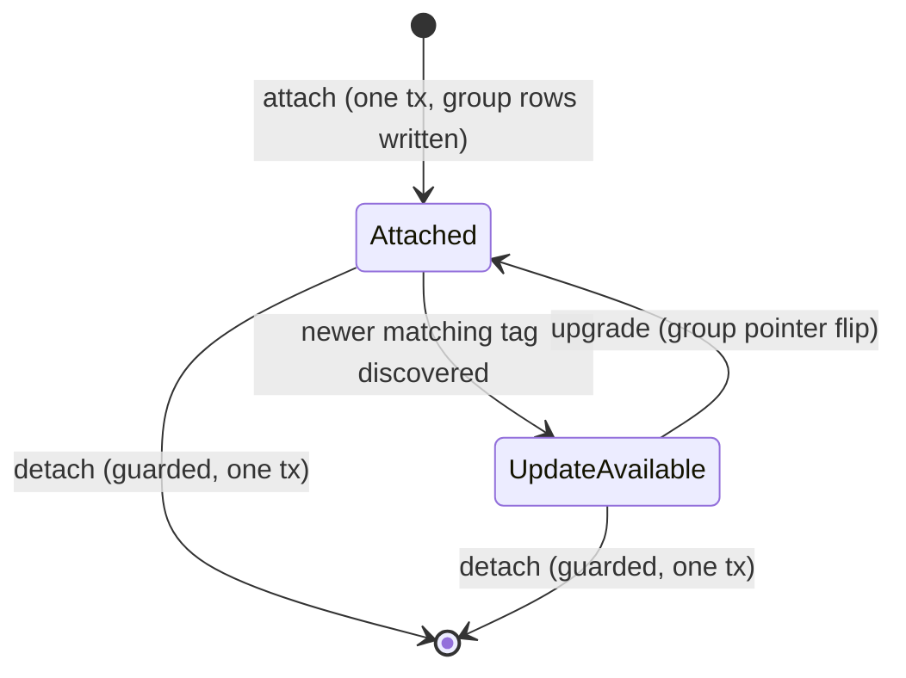
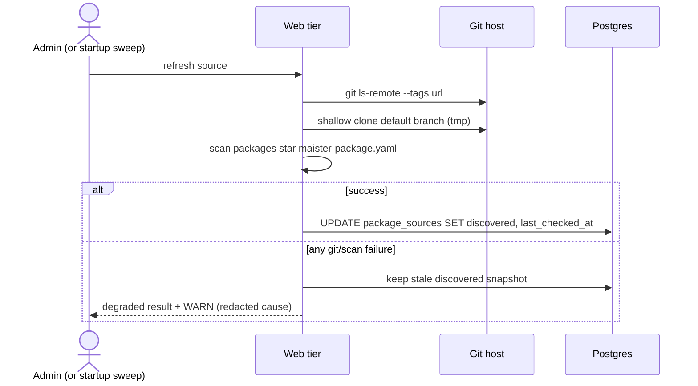
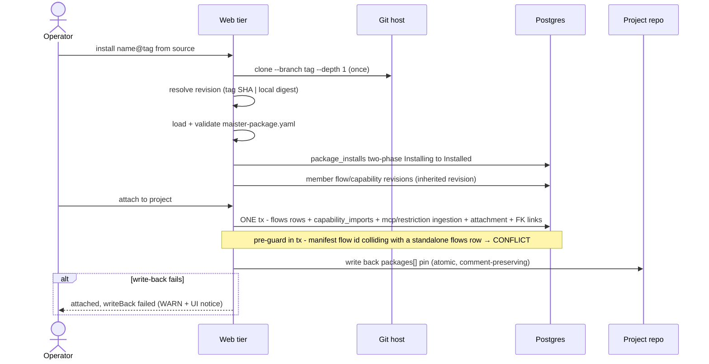

# Packages domain

## M43 package compatibility (Implemented)

Direct Flow-package installation maps legacy members to FLOW_INSTALL/502.
Admin package ingestion maps member-manifest validation to CONFIG/422 while
transport clone/copy failures remain FLOW_INSTALL. Enable, upgrade and
rollback refuse a legacy target with CONFIG/422 and never change the enabled
revision pointer or cached manifest. A graph member whose declared engine range
excludes this host remains inspectable but receives the distinct typed
`engine_incompatible` reason at stored/executable boundaries. Reads return
typed incompatibility.

## Purpose

Packages are the multi-flow distribution unit above the per-revision install
substrate of [`flow-packages.md`](flow-packages.md): one git-monorepo source
ships several flows plus the capability content they need (skills, agents, MCP
server templates, restriction path-sets) under a single
`maister-package.yaml` manifest and a single per-package version tag. This
domain covers platform package sources, version discovery, package
installation, per-project attachment/detach/upgrade, package-level trust, local
versions, and the `maister.yaml packages[]` bootstrap + write-back contract
(ADR-088). Everything below is **(Implemented)** — shipped by the
`feature/package-management` plan (M33) — except the pieces tagged
**(ADR-132)**: source kinds (`git | local`), digest-as-version discovery for
local sources, the by-kind update-available carve, and the per-source publish
base branch. Per-revision install/trust mechanics stay in
[`flow-packages.md`](flow-packages.md) and are referenced, not restated.

## Domain entities

- **Package source** — a configured package location (`package_sources` row,
  platform scope): `kind` (`'git' | 'local'`, ADR-132), `url` holding the
  location string (git URL for `kind: 'git'`; **absolute host directory
  path** for `kind: 'local'`), optional per-source `base_branch` (git
  sources only — the publish PR base, ADR-132), enabled flag, cached
  `discovered` snapshot, `last_checked_at`. Local sources never appear as
  publish targets and are admin-registered only.
- **Default package source** — a `package_sources` row ensured at web boot from
  `MAISTER_DEFAULT_PACKAGE_SOURCES` (unset → the built-in maister-plugins github
  repo; see [`../configuration.md`](../configuration.md)). Insert-only and
  idempotent; an admin disable/delete of a default row is honored on later boots.
  Carries a localized "Built-in" badge in `/settings` (URL exact-match against
  the env list; `note` stays null — no DB text).
- **Discovered package** — a `packages/<name>/maister-package.yaml` found in a
  source's default branch, plus its `<name>/vX.Y.Z` tags (cached jsonb on the
  source row; not separately persisted).
- **Package install** — an immutable installed package revision
  (`package_installs` row): source URL, name, version label, resolved revision
  (tag SHA or local content digest), manifest + inventory, install path, trust
  state.
- **Project package attachment** — per-project enablement of one package
  install (`project_package_attachments` row); member `flows` and
  `capability_imports` rows join the group via nullable `package_install_id`
  FKs (ERD: [`../db/projects-domain.md`](../db/projects-domain.md)).
- **Local version** — a package install whose source is a local directory;
  version label `local-<digest12>`, content-digest addressed.
- **Package manifest** — `maister-package.yaml` v1 (schema:
  [`../configuration.md`](../configuration.md)): `flows[]`, `capabilities[]`,
  `mcps[]` templates, `restrictions[]` path-sets, package metadata.

## State machine

A package install reuses the revision lifecycle vocabulary of
[`flow-packages.md`](flow-packages.md) (`Installing → Installed | Failed`,
`Removed` via GC). The per-project **attachment** lifecycle is new:

## Process flows

### Discovery (refresh button / startup debounce)

Per enabled source: tag listing plus a shallow manifest scan; failures degrade
to the cached snapshot and never block the catalog page.

The startup path first ensures the env-driven default source row(s)
(`MAISTER_DEFAULT_PACKAGE_SOURCES`, insert-only and idempotent — see
Expectations), then runs the same refresh for enabled sources whose
`last_checked_at` is null or older than `MAISTER_PACKAGE_DISCOVERY_STALE_HOURS`
(default 24), sequentially, fire-and-forget. Freshly-seeded default rows (null
`last_checked_at`) are therefore swept on the same boot.

### Local source discovery (ADR-132 — `kind: 'local'`)

A `kind: 'local'` source mirrors git discovery semantics over a host
directory, without git: registration validates server-side that the path is
absolute, exists, and contains `maister-package.yaml` at the root OR ≥ 1
`packages/*/maister-package.yaml` (monorepo layout) — violations are
`MaisterError("CONFIG")` naming the failed check. Refresh (the same
`/{id}/refresh` route) walks the directory, re-digests each package dir
(content digest), and writes `discovered` entries `{name, dir, tags: []}`
with a digest-derived version label `local-<digest12>` (the same sentinel
family as Studio cuts).

**Digest-as-version:** the "version" a local source offers is always its
PRESENT content digest — installing an older digest is not possible; re-check
surfaces drift instead. Re-check is **on-demand only** (refresh button); no
scheduler wiring (ADR-132 D7). Install resolves through the existing
`isLocalPackageSource` branch of the installer (the stored path is used only
through server-state resolution, never a client-supplied path).

### Install + attach

Install is idempotent and content-addressed (one resolved revision per
package; every member sub-install inherits it). Attach writes the project
group in one transaction; the `maister.yaml` write-back is a post-commit
side-effect. Registration `packages[]` bootstrap drives the SAME two steps
per entry (install revision → attach), so bootstrapped packages land in the
same attachment model as UI-attached ones.

### Detach / upgrade / trust

- **Detach**: refuse with `PRECONDITION` while any member revision is pinned
  by a non-terminal run; otherwise one transaction removes the attachment,
  member `flows` rows, ingested MCP/restriction records; member revisions stay
  for in-flight runs and GC ([`reconciliation-gc.md`](reconciliation-gc.md)).
- **Upgrade**: install the newer revision beside the old one, then one
  transaction flips the group pointers; in-flight runs keep their pinned
  revisions; write-back updates the yaml pin.
- **Trust**: one operator decision per package revision, gated on the
  **global `admin` role** — the fan-out crosses every project attached to the
  install, so project-scoped `managePackages` is not sufficient. The same
  transaction fans `trust_status`/`exec_trust` onto every member
  `flow_revisions` + `capability_imports` row, THEN the existing post-trust
  setup path runs per-member `setup.sh` (never at install — fetch and execute
  stay physically separate, ADR-021/ADR-042/ADR-069).

### Crash windows (attach path)

| Window | Reachable state | Recovery |
| --- | --- | --- |
| Install done, attach tx not committed | Orphan package install | Harmless; reused on retry or swept by GC when unreferenced |
| Attach tx committed, write-back not performed | DB attached, yaml stale | Next attach/detach/upgrade rewrites the pin; manual edit also valid |
| Trust tx committed, setup not yet run | Members trusted, `setup_status='pending'` | Existing launch precondition refuses until setup completes; setup retried via the trust/enable path |

## Expectations

- Exactly one `package_installs` row per `(source_url, name,
  resolved_revision)`; installed package revisions are immutable.
- Attach group writes — member `flows` rows, `capability_imports`,
  MCP/restriction ingestion, `project_package_attachments`,
  `package_install_id` FK links — MUST commit in ONE transaction, on the UI
  attach path and the registration `packages[]` bootstrap alike.
- Attach MUST refuse with `MaisterError("CONFLICT")` when a manifest flow id
  collides with an existing standalone `flows` row of the project
  (`flows_project_ref_uq`).
- `setup.sh` NEVER executes during package install or attach; only the
  post-trust setup path runs it, per member revision.
- A package trust decision MUST fan `trust_status`/`exec_trust` to ALL member
  rows in the same transaction and MUST require the global `admin` role.
- Every member sub-install MUST record the package's resolved revision (tag
  SHA or content digest) as `flow_revisions.resolved_revision` — never the
  `"unknown"` sentinel.
- `maister.yaml` write-back happens AFTER the mutating transaction commits; a
  write-back failure MUST NOT roll back the operation and MUST surface
  `writeBack: "failed"` to the caller.
- Detach MUST refuse with `MaisterError("PRECONDITION")` while any member
  revision is pinned by a non-terminal run's `runs.flow_revision_id`.
- Upgrade flips group pointers only; in-flight runs keep their pinned
  revisions (ADR-021 pinning contract unchanged).
- Per-source discovery failure MUST degrade to the cached `discovered`
  snapshot with a WARN and never block the catalog surface.
- The web-boot default-source ensure MUST insert each
  `MAISTER_DEFAULT_PACKAGE_SOURCES` URL (unset → the built-in default) as a
  `package_sources` row only when absent (insert-only on the `url` unique
  index), MUST NEVER re-enable or edit an existing row, and MUST ensure nothing
  when the value is empty (opt-out); a seeded row's `note` MUST be null.
- MCP templates and restriction records ingested on attach MUST be removed on
  detach only for rows the detached install owns (`material.packageInstallId`)
  and recreated on re-attach (SET / CLEAR / re-SET symmetric).
- `packages[].version` accepts `/` (tag form `<name>/vX.Y.Z`); member
  sub-installs receive the path-safe label (`/` → `-`) because
  `versionTagSchema` forbids slashes.
- (ADR-132) The update-available carve is by SOURCE KIND: for attachments
  whose install belongs to a `kind: 'local'` source, discovered digest ≠
  pinned digest ⇒ update available with upgrade target `local-<newDigest12>`;
  Studio-cut installs (no source row) keep the existing `local-*` skip. Kind
  guards are allow-lists (`kind === 'local'` / `kind === 'git'`), never
  `!== 'git'` complements.
- (ADR-132) `kind: 'local'` source registration MUST be
  `requireGlobalRole("admin")`-gated and MUST validate the path server-side
  (absolute + exists + manifest layout) BEFORE persistence; local sources
  resolve `trusted_by_policy` (deliberate — the admin gate is the trust
  boundary), and the fetch → trust → execute ordering is unchanged.
- (ADR-132) `getPublishOptions` MUST offer only `kind: 'git'` sources as
  publish targets; `package_sources.base_branch` (git sources only) feeds the
  publish PR base
  (`package_sources.base_branch ?? gitRemoteDefaultBranch(...) ?? "main"`).

## Edge cases

- **`git ls-remote` / clone failure during discovery** → degraded refresh
  result (stale cache + WARN); no `MaisterError` surfaces to the page.
- **`maister-package.yaml` invalid (schema, dup ids, escape path, bad
  `env:NAME` ref)** → `MaisterError("CONFIG")`; nothing installed.
- **Manifest `flows[].id` ≠ the referenced `flow.yaml` `name`** →
  `MaisterError("CONFIG")` from the package installer.
- **Package install clone/copy failure** → `MaisterError("FLOW_INSTALL")`
  (stage-tagged, ADR-021 shape).
- **Attach with colliding standalone flow id** → `MaisterError("CONFLICT")`,
  no partial group.
- **Attach when another attached package already provides the same
  `(kind, id)` MCP/restriction record** → `MaisterError("CONFLICT")`, no
  partial group (same-id different-kind records coexist).
- **Detach while a member revision is run-pinned** →
  `MaisterError("PRECONDITION")`.
- **Source delete while installs from it are attached** →
  `MaisterError("CONFLICT")` (usage guard).
- **Write-back target unwritable** → operation succeeds, `writeBack:
  "failed"` + WARN; DB remains the runtime truth.
- **Registration `packages[]` id colliding with `flows[]` /
  `capability_imports[]` ids** → `MaisterError("CONFIG")` at config load.
- **(ADR-132) Local source path relative / missing / no manifest at root nor
  `packages/*/`** → `MaisterError("CONFIG")` naming the failed validation;
  nothing persisted.
- **(ADR-132) Local source dir mutated after install** → the pinned install is
  untouched (content-addressed); on-demand re-check re-digests and flips
  `updateAvailable` for attachments on that source; a refresh with no byte
  change is idempotent (digest stable).
- **(ADR-132) Publish attempted against a `kind: 'local'` source** → not
  offered by `getPublishOptions`; a forged `targetSourceId` fails the
  allow-list with `MaisterError("CONFLICT")`.

## Trust-confirmation presentation contract (Implemented)

Before a global administrator confirms the existing trust operation, the UI
may show an advisory snapshot count of affected projects. The count is
`COUNT(DISTINCT project_package_attachments.project_id)` for the exact selected
`package_install_id`; attachments for another install and multiple member
revisions of the same install are not double-counted.

The count is read-model copy, not an authorization or concurrency decision.
The existing global-admin route remains authoritative and keeps its request
payload and trust fan-out semantics unchanged if attachments change between
the read and confirmation. Cancel sends no trust request.

## Linked artifacts

- Decision: [`../decisions.md` ADR-088](../decisions.md#adr-088-multi-flow-package-management)
  (+ amended [ADR-021](../decisions.md#adr-021-flow-package-lifecycle-multi-revision-trust-and-compatibility);
  source kinds + digest-as-version + publish base:
  [ADR-132](../decisions.md#adr-132-forked-package-loop--ephemeral-pins-package-experiment-axis-local-sources-upstream-sync)).
- Design: `docs/pv/package-management.md` (owner-approved target picture).
- Revision substrate: [`flow-packages.md`](flow-packages.md);
  flow entity/install pipeline: [`flows.md`](flows.md),
  [`../flow-installer.md`](../flow-installer.md).
- Config contract: [`../configuration.md`](../configuration.md)
  (`packages[]`, `maister-package.yaml` v1,
  `MAISTER_PACKAGE_DISCOVERY_STALE_HOURS`).
- ERD: [`../db/projects-domain.md`](../db/projects-domain.md),
  [`../database-schema.md`](../database-schema.md).
- Web API: [`../api/web.openapi.yaml`](../api/web.openapi.yaml)
  (`/api/admin/package-sources*`, `/api/admin/package-installs`,
  `/api/projects/{slug}/packages*`).
- AIF package content: the `maister-plugins` repo (`packages/aif`,
  tag `aif/v2.0.0`); consumption notes in
  [`../flow-aif-plugin.md`](../flow-aif-plugin.md).

## Plan-review package releases (Designed — ADR-137)

The AIF and superpowers packages release this capability independently under
new package-scoped tags. Each source declares engine 3.1.0 and its artifact
contract; historic tags, installs, and SHA-pinned runs remain unchanged.
