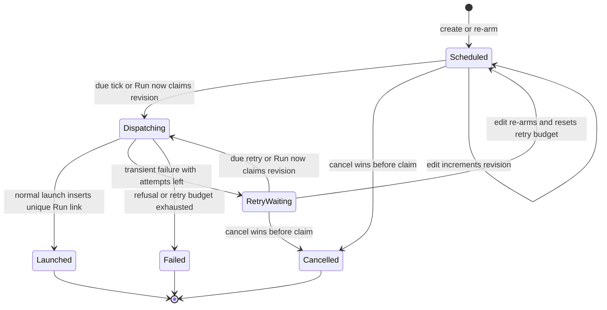
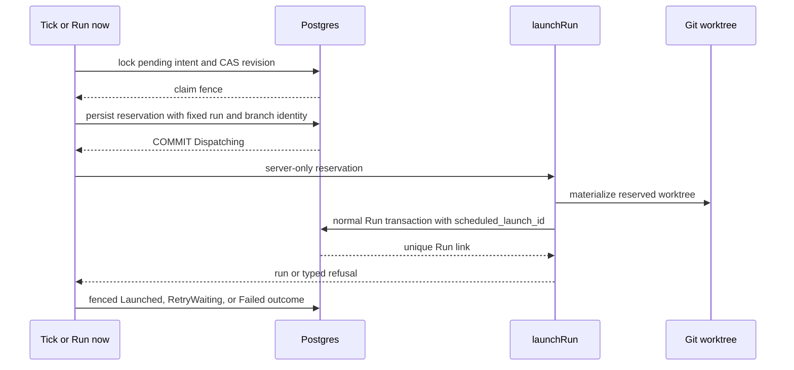

# Project automations domain

## Purpose

This domain is **Designed**. It specifies a member-facing project
**Automations** surface and a durable, one-time future launch of an existing
configured task. It extends the existing M24 `run_schedule.dispatcher` clock;
it does not add a timer, a scheduler job per intent, supervisor database
access, or a side channel which inserts a Run.

The design keeps three records deliberately separate:

- one-time task launches are owned by `scheduled_task_launches`;
- recurring task schedules remain owned by `run_schedules`;
- agent cron and event bindings remain owned by `agent_schedules` and are
  edited only by Project Settings → Agents.

The aggregate reader joins these records for the project view but does not
invent a generic automation editor. Observatory remains a read model over
durable ledgers; it does not own automation state or perform write-side
dispatch.

## Authority and privacy boundary

| Operation | Required project action | Owner |
| --- | --- | --- |
| Read Automations and details | `readBoard` | Project viewer+ |
| Create, edit, cancel, Run now one-time task launch | `manageSchedules` + `launchRun`; `launchUnattended` when the stored policy needs it | Project member+ |
| Mutate recurring task schedule | `manageSchedules` | Existing schedules routes |
| Mutate agent cron/event binding | `editSettings` | Existing project-agent PATCH |
| Inspect host-wide diagnostics | Global admin | `/admin/scheduler`, read-only |

Creation authorizes a narrow future launch request. At dispatch, the system may
act only on the durable project, task, normalized request, and reservation it
claimed. It must re-evaluate project, task, runner, package, preflight, and
capacity eligibility. Deleting or demoting the creator does not silently
cancel an already-authorized intent.

Public DTOs, audit events, UI copy, and logs may expose stable IDs, task
`KEY-N`/title snapshots, state, outcome code, retry count, and timing. They
must not expose repository or worktree paths, credentials, capability secrets,
raw request payloads, or raw upstream errors.

### Identifier and trust table

| Value | Source | Contract |
| --- | --- | --- |
| Project slug and intent/detail ID | URL path | Resolve the project first, then project-scoped row joins; missing/foreign rows are 404. |
| Actor | Auth context | Authenticate and authorize before JSON parsing, request validation, or resource lookup. |
| Task and launch options | Request body | Strictly validate then resolve against the server-derived project; re-evaluate mutable eligibility at dispatch before filesystem work. |
| `Idempotency-Key` and request hash | Header and server state | The client sends only a bounded opaque key; the server hashes canonical normalized request bytes and never trusts a client hash. |
| Revision, claim/fence, reservation, and Run link | Header and server state | `If-Match` supplies only the quoted revision. Claim, fence, reservation, and Run identity are server-generated and protected by CAS/unique constraints. |

## Entities

- **Scheduled task launch** (`scheduled_task_launches`, Designed) — one
  authorized future launch intent. It persists its project, nullable task FK
  (`ON DELETE SET NULL`), task key/number/title snapshot, creator/last actor,
  requested local date-time, IANA timezone, DST disambiguation, resolved UTC
  instant, immutable normalized request, hash/key idempotency material,
  revision, retry state, and latest safe outcome.
- **Launch reservation attempt** (`scheduled_task_launch_attempts`, Designed) —
  a durable, pre-Git external-effect reservation. The successful claim gives
  it one `run_id`, task attempt number, branch, worktree path, request hash,
  and claim fence. A re-entry must reuse this identity, never allocate a
  replacement.
- **Launch event** (`scheduled_task_launch_events`, Designed) — append-only
  safe audit event: `created`, `edited_rearmed`, `claimed`, `retry_scheduled`,
  `cancelled`, `launched`, or `failed`, with user/system attribution and
  code-level metadata only.
- **Resulting Run** (`runs.scheduled_launch_id`, Designed) — the sole durable
  intent-to-Run link, unique when present. `runs.trigger_source` gains
  `scheduled`. There is no mutable reciprocal `resulting_run_id` on the
  intent.
- **Agent binding telemetry** (Designed) — `agent_schedules` gains stable
  IDs, revision-fenced reconciliation, `last_attempt_at`, `last_attempt_fence`,
  `last_outcome`, safe code/message, and `last_run_id`; `runs.agent_schedule_id`
  records the binding which produced an agent Run.

## One-time state machine

Only `Scheduled` and `RetryWaiting` can be edited, cancelled, or claimed.
Editing increments `revision`, clears transient outcome fields, stamps a new
`armed_at`, and resets the three-attempt intent-scoped budget. `Dispatching`
and terminal rows are immutable. A mutable request carries the exact quoted
revision in `If-Match`; a stale, malformed, missing, or post-claim revision is
`CONFLICT`.

## Claim, reservation, and recovery

The tick and Run now use one claim function. Its transaction locks the current
row, rechecks its state/revision, writes a claim ID and fence, increments the
attempt count, allocates the unique live reservation, and commits
`Dispatching` **before** Git worktree creation. `launchRun` subsequently takes
the server-only reservation and still performs its ordinary compatibility,
snapshot, isolation, capacity, and evidence work. It persists
`runs.scheduled_launch_id` in its normal Run transaction; the dispatcher never
talks to the supervisor or inserts a Run itself.

Claim expiry begins recovery rather than allowing an arbitrary second launch.
Recovery resolves the unique Run link first. If no Run exists, it uses this
strict matrix:

| Reservation condition | Recovery action |
| --- | --- |
| No worktree exists | Re-enter `launchRun` with the same reservation. |
| Managed worktree has matching reservation provenance, branch, and safe uncommitted state | Remove only the reserved worktree/branch, then re-enter with the same reservation. |
| Existing Run has the intent link | Idempotently finalize the intent from that Run. |
| Missing, malformed, mismatched, moved, or unverifiable provenance/path/branch | Terminal `Failed`; do not delete anything. |

This closes the pre-Run crash window that the recurring schedule design
intentionally leaves open. It must not change recurring schedule W1/W2
semantics in [run-schedules.md](run-schedules.md).

## Execution decision matrix

| Condition at claim | Decision | Durable visible outcome |
| --- | --- | --- |
| Launchable task and capacity available | Call `launchRun` with reservation | `Launched` with Run link |
| Global Flow cap full | Call ordinary `launchRun` | `Launched`; linked Run is `Pending` |
| Service was down at due time | Claim once on the next tick | Normal outcome plus `lateByMs` |
| Active, Review, HumanWorking, NeedsInput, or Crashed run | Never force a concurrent retry | Terminal `Failed` / `PRECONDITION` |
| Blocked, flagged, unconfigured, Done, or Abandoned task | Do not inherit manual permissive relaunch | Terminal `Failed` / `PRECONDITION` |
| Archived project or deleted task | Terminalize without launch side effect | `Failed` with preserved target snapshot |
| Invalid stored request, package/Flow/engine mismatch, removed runner, or Git preflight refusal | Repair requires a person | Terminal `Failed` / `CONFIG` or `PRECONDITION` |
| Temporary supervisor/runner/network failure | Retry at 1, 5, then 15 minutes | `RetryWaiting`; terminal `Failed` on third attempt |
| Tick/Run now/cancel/edit race | CAS and row lock choose one winner | Loser receives `CONFLICT` or current safe DTO |

The due scan orders by `(next_attempt_at, id)` and bounds its batch. Every
claimed row becomes terminal or gets a future `next_attempt_at`; a poison row
cannot monopolize the dispatcher. A truncated scan records a summary and WARN.

## Time semantics

The server converts submitted local wall time with an exact IANA timezone using
Temporal. It stores the original local ISO value, timezone, selected
disambiguation, and resolved `timestamptz` UTC instant.

- Unsupported zones, past instants, and nonexistent spring-forward local times
  are `CONFIG` field errors.
- An ambiguous fall-back local time requires `earlier` or `later`; UI presents
  both offsets and UTC previews. It is never silently shifted.
- UI displays local time, timezone, resolved UTC, and “starts on the next
  scheduler tick (normally within 60 seconds)”; it does not promise seconds.
- A pending overdue intent launches once after downtime, records lateness, and
  does not consume retry budget merely because the host was unavailable.

## Aggregate Automation reader

`GET /api/projects/{slug}/automations` returns only a bounded,
cursor-paginated discriminated union:

`one_time_task_launch`, `recurring_task_schedule`, `agent_cron`, and
`agent_event`.

Rows sort active records by `nextActionAt ASC`, kind rank, then ID; rows with
no next action or terminal one-time state sort by `updatedAt DESC`, kind rank,
then ID. The opaque versioned cursor encodes this complete tuple. Every row has
a name, effective target, trigger/timezone when meaningful, state, safe latest
outcome, result Run link when any, and a type-specific read-only `detailHref`.
Recurring mutation stays in `/schedules`; agent rows only link to their
authoritative Settings editor. Phase 1 never fabricates an agent Run now
action.

## Agent identity, reconciliation, and truthful telemetry

The project-agent PATCH remains the sole binding editor. It accepts the last
seen schedules revision and stable schedule IDs:

- unchanged ID + equal normalized content is retained with its telemetry;
- unchanged ID + changed normalized content updates the same row and resets
  only fields invalidated by the change;
- absent existing ID is deleted; a new row receives a generated ID;
- a stale schedules revision is `CONFLICT`, so a full-replacement save cannot
  erase an unseen binding.

Cron passes its `agentScheduleId` through launch and records a fenced outcome.
For a domain event, deterministic owner selection chooses the first matching
enabled binding by `(agent_schedule_id ASC)`. It alone may claim the existing
`(agent_id, trigger_event_id)` Run backstop. Other matching bindings receive a
truthful suppressed/deduplicated outcome, not a false separate launch. Every
telemetry update fences on its attempt marker so a late write cannot overwrite a
newer attempt.

## Operations and logging

The dispatcher combines recurring and one-time counts in the existing
`run_schedule.dispatcher` job summary. It exposes: claimed, launched, retried,
failed, late, and truncated counts. Per-intent logs use only
`scheduledLaunchId`, `projectId`, `taskId`, `state`, `claimId`, `attempt`,
`outcome`, `errorCode`, and `lateByMs`. They must not log request bodies,
paths, branches, credentials, raw provider errors, or secret values.

## Expectations

- Creating, editing, or viewing an intent must not create a Run, reserve a
  Flow slot, create a worktree, or contact the supervisor.
- A due claim must durably reserve its external Git identity before
  `launchRun`; concurrent tick, Run now, cancel, and edit calls converge by
  row lock, revision CAS, fence, and unique database constraints.
- The only launch path is `launchRun` with the fixed server-owned reservation;
  capacity uses ordinary `Pending` admission and is never bypassed.
- Recovery must converge each reachable `Dispatching` state to the one linked
  Run, a bounded retry, or one safe terminal refusal. It never deletes a path
  or branch whose ownership/provenance is not verified.
- One-time retries classify only temporary supervisor/runner/network failure as
  retryable. Configuration, task eligibility, repository preflight, and
  compatibility refusals require a human repair and terminalize promptly.
- The aggregate must preserve recurrence and agent ownership semantics. An
  agent binding row never implies a Phase-1 Run now action.
- Route contracts must authenticate and authorize before body parsing or
  resource lookup, project-scope every identifier, return explicit safe DTOs,
  and enforce canonical `Idempotency-Key` and quoted ETag/`If-Match` behavior.

## Edge cases

- **Reservation crash before Git:** recovery reuses the same durable identity;
  it cannot allocate an unrelated second branch or Run.
- **Managed worktree crash after Git:** only matching managed provenance and a
  safe branch state allow cleanup; a missing or mismatched marker is terminal
  `Failed` without deletion.
- **Run inserted before intent finalization:** the unique
  `runs.scheduled_launch_id` is authoritative and re-entry finalizes the same
  intent idempotently.
- **Clock outage:** an overdue pending intent runs once on the next tick and
  records lateness; it does not backfill slots or spend retry budget.
- **Task deletion or project archive:** no launch side effect occurs; snapshots
  make the terminal audit actionable without retaining a live task relation.
- **DST:** nonexistent local time is `CONFIG`; ambiguous time requires an
  explicit earlier/later choice.
- **Agent event fan-out:** a deterministic owner claims the historical unique
  Run backstop; non-owners retain truthful suppressed telemetry.

## Compatibility expectations

- Existing `run_schedules` rows, APIs, overlap policies, catch-up flags, and
  W1/W2 recurrence behavior are unchanged.
- Existing `agent_schedules` remain the project-agent PATCH owner's data;
  additions are stable identity, revision, and truthful telemetry only.
- The legacy board URL `?tab=schedules` resolves to `?tab=automations`; new
  links use `automations`. The alias remains until a documented retirement
  release after external links have migrated.
- The supervisor remains database-free. The Web scheduler owns all durable
  claim, reservation, retry, and finalization state.

## Linked artifacts

- Decision: [ADR-139](../decisions.md#adr-139-project-automations--one-time-task-launch-reservation-and-truthful-agent-binding-telemetry).
- Existing recurring model: [run-schedules.md](run-schedules.md).
- Scheduler clock: [scheduler.md](scheduler.md).
- Agent trigger model: [agents.md](agents.md).
- Task eligibility: [tasks.md](tasks.md).
- Run lifecycle: [runs.md](runs.md).
- Planned screen: [../screens/projects/project-automations.md](../screens/projects/project-automations.md).
