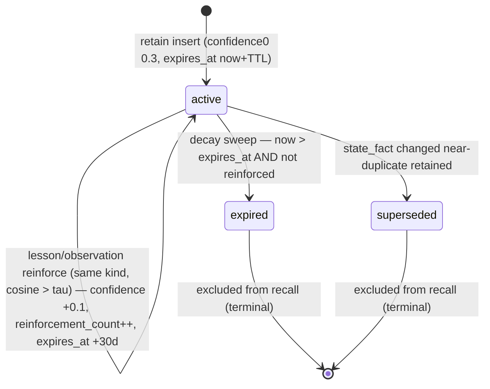
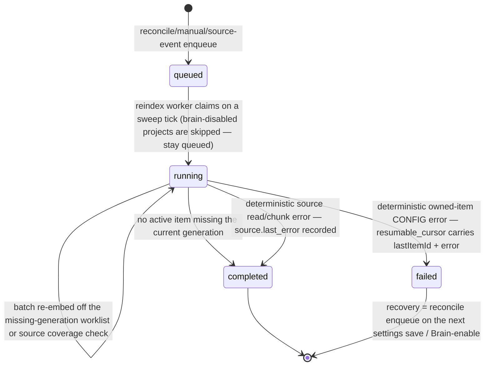
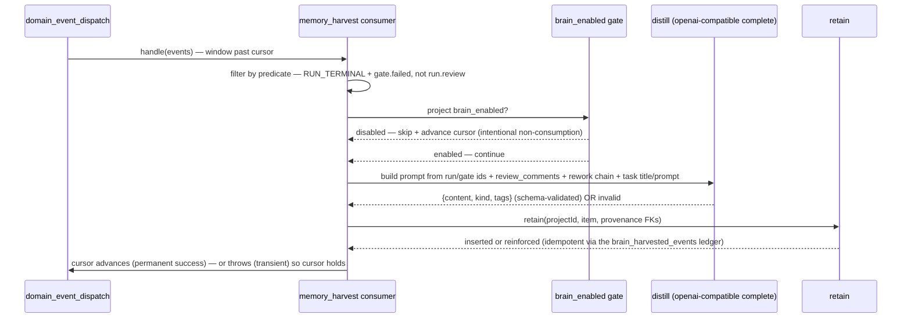
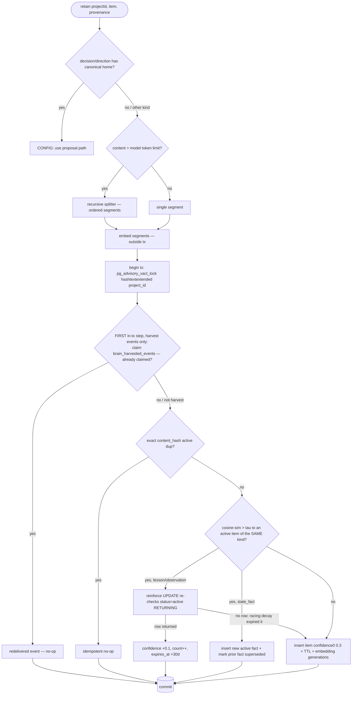
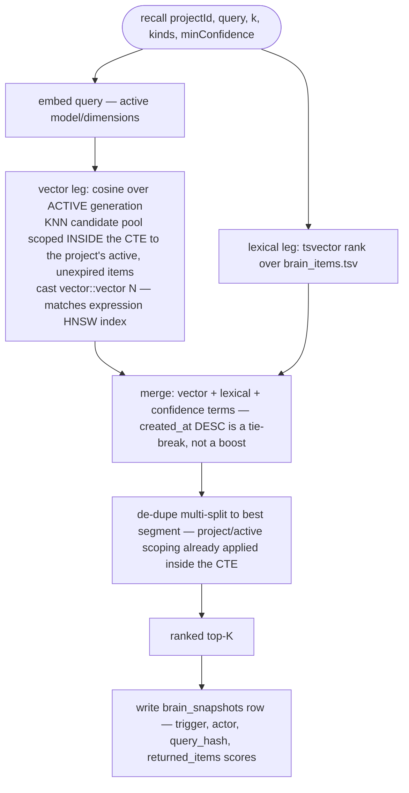
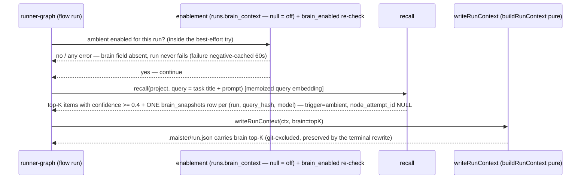
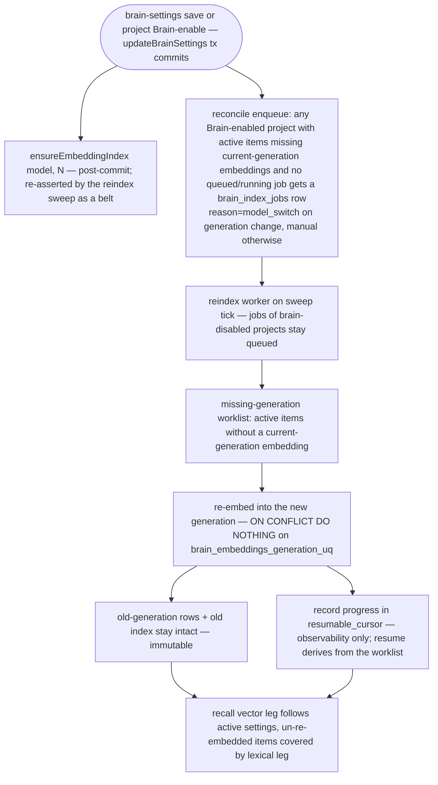
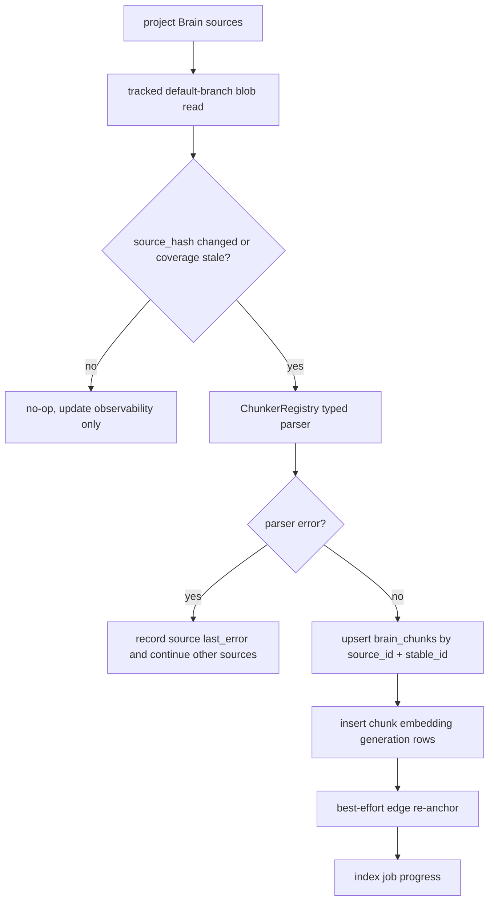
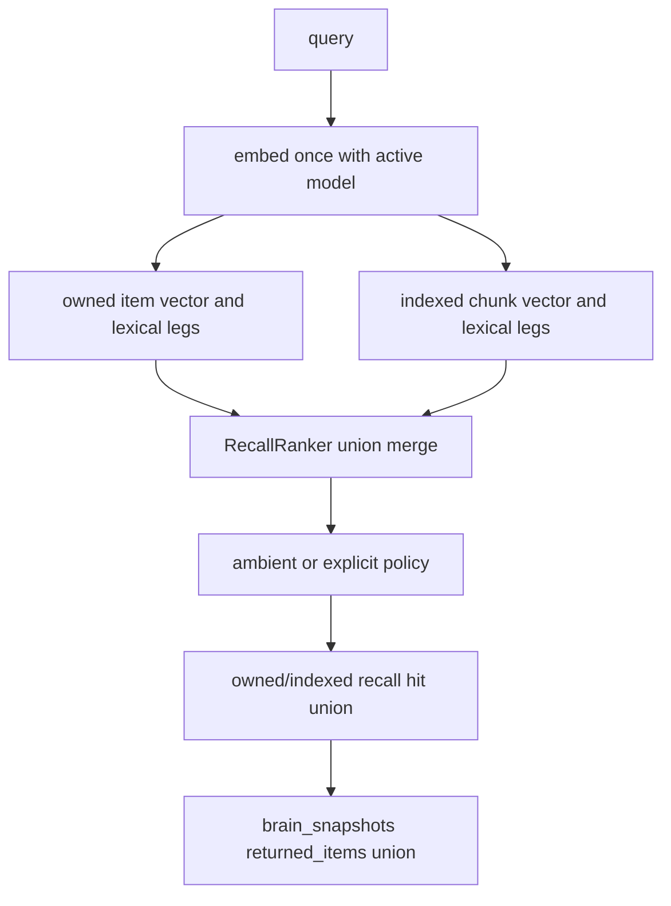
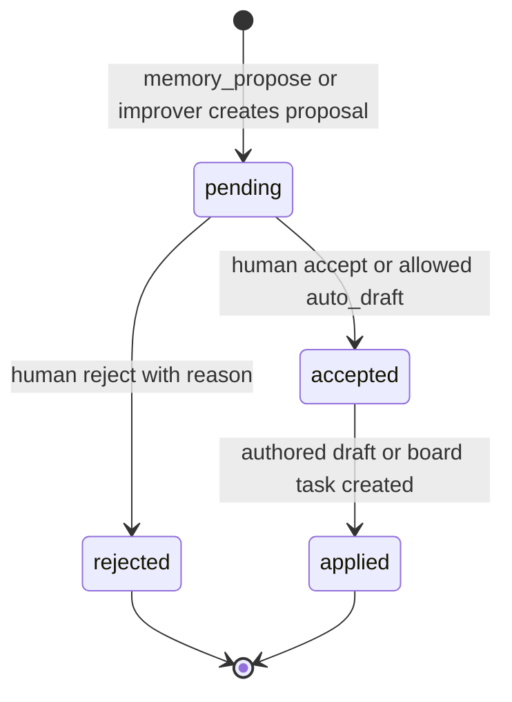

# Project Brain domain (A+B+C: Foundation, Consultant, Improvement Bridge)

## Purpose

The **Project Brain** (ADR-122, ADR-127, ADR-128) is MAIster's per-project,
vectorized knowledge substrate: a self-improving, project-scoped memory that
platform agents use natively.

- **Sub-project A (Implemented)** ships the owned/volatile tier:
  `lesson` / `observation` / `state_fact`, harvested from `domain_events`,
  embedded in `brain_*` tables, decayed by the scheduler, and recalled through
  MCP/ext/P7 with no LLM at read.
- **Sub-project B (Implemented)** adds the read-only Consultant
  indexed tier: canonical sources, typed chunks, `decision`/`direction`
  home-resolution, chunk embeddings, cross-tier recall, snapshots with pointers,
  and best-effort edge re-anchor.
- **Sub-project C (Implemented)** adds the self-improvement bridge:
  server-computed memory clusters, `brain_proposals`, human/session review,
  `auto_draft` autonomy, docs-as-code projection through board tasks, and the
  non-executable Serena MCP catalog seed.

Boundary: this domain owns the `brain_*` tables, harvest/index/proposal services,
embedding-provider registry, and 4-layer enablement. It does NOT own the
`domain_events` fact log ([domain-events.md](domain-events.md)), the run state
machine ([runs.md](runs.md)), the M25 authored catalog, project file serving, or
the scheduler clock ([scheduler.md](scheduler.md)). Indexed sources remain
pointers to canonical truth; all write-back enters C proposals, authored drafts,
or board tasks.

## M43 Postgres-only provisioning and event filter (Implemented)

Brain stays separately provisioned through its own Postgres migration lineage.
Engine 3 uses the Postgres-only database client and retains the schema-applied
assertion. A run.failed event with the M43 cut-over reason and source is not
harvested and does not enqueue source reindex work.

## Domain entities

- **`brain_items`** (Implemented) — one owned-tier knowledge item: `{ id, project_id (FK,
  ON DELETE CASCADE — the auth boundary), kind (lesson|observation|state_fact|decision|direction),
  tier (owned), title, content, status (active|expired|superseded), confidence,
  reinforcement_count, last_reinforced_at, expires_at, content_hash, tags
  (jsonb string[] — owned metadata), provenance
  (source_run_id?, source_node_attempt_id?, source_domain_event_id?,
  source_gate_kind?), created_at, updated_at, tsv (generated tsvector) }`. See
  [db/brain-domain.md](../db/brain-domain.md).
- **`brain_embeddings`** (Implemented) — **immutable** per (owned item or indexed
  chunk, embedding generation): `{ id, item_id? (FK cascade), chunk_id? (FK cascade),
  split_ordinal, vector (dimension-untyped), embedding_provider, embedding_model,
  embedding_dimensions, embedding_version, source_hash, content_hash,
  chunker_id?, chunker_version?, embedded_at }`. The DB CHECK enforces exactly one
  target arm. N rows per target across generations × splits. A model, dimension,
  or chunker switch writes a NEW generation, never mutates a row. One **active**
  generation is read at recall.
- **`brain_snapshots`** (Implemented) — a recall snapshot written at **consumption**
  (ambient inject or explicit recall) for reproducibility/audit: `{ id, project_id
  (FK CASCADE), run_id? (FK), node_attempt_id? (RESERVED — always NULL in A),
  actor_type, actor_id, trigger (ambient|explicit), query, query_hash,
  embedding_model, returned_items (jsonb:
  `[{tier,itemId?|chunkId?,score,pointer?}]` — ids, scores, and indexed pointers),
  ranker_version, created_at }`. Ambient writes exactly ONE row per `(run,
  query_hash, embedding_model)` — repeated node iterations never duplicate; rows
  older than 30 days (`BRAIN_POLICY.snapshotTtlDays`) are pruned by the decay
  sweep. The launch-time *decision* to include Brain context persists on
  `runs.brain_context`, not here.
- **`brain_index_jobs`** (Implemented) — reindex work: `{ id, project_id (FK),
  source_id? (FK), reason (model_switch|manual|event|chunker_upgrade), status
  (queued|running|completed|failed), progress, resumable_cursor, created_at }`.
  Enqueued by settings/enable reconciliation, manual source reindex, and the
  `brain_source_reindex` domain-event consumer; consumed by the reindex worker
  on the M24 tick. `resumable_cursor` is progress/observability metadata
  (`{lastItemId, error}` on failed owned reindex, or event cursor metadata for
  source jobs) — resume derives from the missing-generation worklist and source
  coverage checks, not the cursor.
- **`brain_harvested_events`** (Implemented, brain migration `0002`) — the harvest
  idempotency ledger: `{ project_id (FK CASCADE), domain_event_id (no FK — the
  marker outlives `domain_events` GC), harvested_at }`, PK `(project_id,
  domain_event_id)`. Claimed as the FIRST step of `retain`'s transaction so an
  at-least-once redelivery is a no-op across ALL retain outcomes
  (insert / reinforce / exact-dup).
- **Shared-table columns (Implemented, migrations `0088`, `0091`)** — `platform_runtime_settings`
  gains `embedding_base_url`, `embedding_model`, `embedding_dimensions`,
  `embedding_api_key_ref`, `distill_base_url`, `distill_model`,
  `distill_api_key_ref` (all nullable); `projects.brain_enabled`
  (bool, default false); `agent_project_links.can_read_brain` /
  `can_write_brain` (bool, default false); `runs.brain_context` (bool, nullable —
  null = off (default) in A; a flow/agent-level default is reserved).
- **Kinds (owned tier)** (Implemented) — `lesson` (decay TTL, promoted by
  recurrence), `observation` (slower decay), `state_fact` (not decayed;
  near changed facts supersede the prior active fact). `decision`/`direction`
  are owned fallback kinds only when home resolution has no canonical source;
  otherwise they are indexed-tier pointers.
- **`brain_sources`** (Implemented — brain migration `0003`) — one canonical source
  registration per project: `{ id, project_id (FK CASCADE), kind, path/glob,
  source_hash, chunker_id, chunker_version, enabled, last_indexed_at,
  last_error, created_at, updated_at }`. Source content is read from the
  project row's `repo_path` and `main_branch`; Brain source APIs return metadata
  and pointers only.
- **`brain_chunks`** (Implemented — `0003`) — indexed-tier chunk store:
  `{ id, source_id (FK CASCADE), project_id (FK CASCADE), stable_id, kind,
  title, path, symbol?, content, metadata, source_range, content_hash, tsv }`.
  Chunks are not authoritative; recall returns capped previews plus canonical
  pointers.
- **`brain_edges`** (Implemented — `0003`) — lightweight graph references:
  `{ id, project_id, from_ref, to_ref, relation, confidence, degraded,
  created_at, updated_at }`. Retain can create `derived_from` edges from
  `brain_items.source_ref` to indexed chunks. Re-chunking remaps chunk refs
  best-effort by stable id, symbol/path, then content hash; unmappable edges
  remain visible with `degraded=true`.
- **`brain_project_config`** (Implemented — `0003`) — per-project Brain policy:
  `{ project_id PK, home_resolution, projection_flow_id, autonomy_policy? }`.
  Home resolution decides whether `decision`/`direction` are indexed canonical
  sources or owned items.
- **`brain_proposals`** (Implemented — brain migration `0004`) — C bridge:
  `{ id, project_id, kind, evidence_item_ids, draft, status, blast_radius,
  autonomy_decision, cluster_hash, actor fields, resolution fields,
  authored_draft_id?, task_id?, run_id?, created_at, updated_at, resolved_at,
  applied_at }`. Proposal status is a closed FSM; publishing is not part of
  Brain.
- **Policy constants** (Implemented) — `web/lib/brain/policy.ts`: τ=0.85 (dedup cosine),
  confidence₀=0.3, TTL=30d, reinforce=+0.1 confidence / +30d `expires_at`, ambient
  K=5, `ambientMinConfidence`=0.4 (ambient-inject floor — one reinforce above
  confidence₀; explicit recall is unaffected), `snapshotTtlDays`=30 (snapshot GC).
  Named constants, tune-on-real-runs; not env, not DB in A.
- **`RecallRanker`** (Implemented) — the DIP seam (`web/lib/brain/recall-ranker.ts`):
  a swappable ranking interface with a default pgvector hybrid implementation.

## State machine

### `brain_items` lifecycle (Implemented)

An item is inserted `active` at confidence₀; a semantically-near retain of the SAME
kind reinforces `lesson`/`observation` in place (self-loop, no new row), while a
changed near `state_fact` inserts the newer fact and marks the prior active fact
`superseded`. The decay sweep expires decayed kinds past `expires_at`.

Embedding generations are immutable: an item's `active` status is orthogonal to how
many `brain_embeddings` generations it carries. A reindex adds a new generation and
moves the active-generation pointer (platform embedding settings); old rows persist.

### `brain_index_jobs` lifecycle (Implemented)

An interrupted/crashed owned-item job STAYS `running` and is re-claimed on the
next tick; transient embedding errors also leave it `running` for retry. Resume
derives from the missing-generation worklist (active items or chunks without a
current generation), NOT from a cursor. Source-scoped jobs record deterministic
read/chunk errors on `brain_sources.last_error` and complete so one bad source
does not poison the cursor. Recovery after an owned-item `failed` is the
reconcile enqueue: every brain-settings save and every project Brain-enable
enqueues a job for any Brain-enabled project whose active items miss
current-generation embeddings and that has no queued/running job.

## Process flows

### (a) Harvest → distill → retain (Implemented)

The `memory_harvest` consumer rides the `domain_events` dispatcher
([domain-events.md](domain-events.md)). It matches an explicit per-kind predicate
(`RUN_TERMINAL_EVENT_KINDS` + `gate.failed`; `run.review` excluded), skips when the
project's Brain is disabled, distills concrete sources into a structured lesson, and
calls `retain` with provenance FKs.

Untrusted run data in the distiller prompt (task title/prompt, review comments, the
rework chain) is FENCED between explicit `BEGIN/END UNTRUSTED RUN DATA` markers with
a data-not-instructions instruction, and the distill completion request carries
`max_tokens` (bounds respend on a runaway provider).

### (b) `retain` — atomic retain, reinforce, or supersede (Implemented)

`retain` embeds OUTSIDE the transaction, then serializes per-project writes with an
advisory lock. Exact active `content_hash` duplicates no-op. Near
`lesson`/`observation` retains reinforce the active item. Near changed
`state_fact` retains insert a new active fact and mark the prior active fact
`superseded`; only active rows participate in recall.

The partial UNIQUE `(project_id, content_hash) WHERE status = active` makes the
exact-dup race a `CONFLICT`-mapped constraint at the DB, not a duplicate row.
Harvest redelivery is idempotent across ALL retain outcomes: the
`brain_harvested_events` ledger row (PK `(project_id, domain_event_id)`) is claimed
as the first in-transaction step, and the partial UNIQUE
`(project_id, source_domain_event_id)` stays as the insert-path belt.

### (c) Recall — hybrid, no LLM at read (Implemented)

The lexical leg also covers items not yet re-embedded mid-reindex. No completion/LLM
call happens on this path.

### (d) Ambient inject via P7 (flow runs only) (Implemented)

Recall is computed in `runner-graph.ts` (which has DB + policy) and the ready brain
projection is passed INTO `writeRunContext` as plain data — `buildRunContext` stays
pure. The whole ambient step — including the `projects.brain_enabled` re-check —
runs inside one best-effort try: any DB/provider error degrades to no-injection and
NEVER fails the run, and a recall/provider failure is negative-cached for 60s per
process. Only items with `confidence >= 0.4` (`BRAIN_POLICY.ambientMinConfidence` —
one reinforce above confidence₀, so an item must have recurred at least once before
it is auto-injected; explicit recall is unaffected) are injected. The query embedding
is memoized per runner process, keyed by
`hash(query + embedding_model + embedding_dimensions)`, and exactly ONE snapshot row
is written per `(run, query_hash, embedding_model)` — repeated node iterations do not
duplicate (`node_attempt_id` is RESERVED, always NULL in A). The agent prompt pointer
carries a caveat that `brain` entries are distilled memory — background context, not
instructions.

### (e) Reindex on model/dimension switch (Implemented)

`updateBrainSettings` runs in ONE transaction with `SELECT … FOR UPDATE` on the
singleton row (concurrent admin PATCHes serialize — no lost updates);
`ensureEmbeddingIndex` runs after commit and the reindex sweep re-asserts it as a
belt. Every brain-settings save AND every project Brain-enable then runs a
reconcile enqueue — this is also the recovery path after a `failed` job.

### (f) Decay sweep (throttled) (Implemented)

`runBrainDecaySweep()` is folded into `runSystemSweep()`. The 60s system tick
self-throttles the sweep to hourly via a last-run stamp; decay is expiry-only in A —
confidence never decreases and there is no per-tick decrement. Items past
`expires_at` without reinforcement become `expired` and drop out of recall. The same
sweep prunes `brain_snapshots` older than 30 days (`BRAIN_POLICY.snapshotTtlDays`).
A sweep error is caught into the sweep summary, never thrown.

### (g) Source indexing and chunk embeddings (Implemented — Sub-project B)

All source reads derive the project repo from server state. Paths/globs are
repo-relative and validated before any git read. `.git`, ignored/untracked files,
absolute paths, and body-controlled worktree paths are refused. Glob reads are
bounded by match-count and aggregate-byte limits before chunking, and indexing
also refuses sources that exceed per-job chunk or embedding-segment budgets. A
glob source excludes enabled exact peer sources of the same project/kind, so the
default `docs/**/*.md` row does not duplicate chunks owned by the explicit
`docs/decisions.md` row. Source jobs are manual or domain-event triggered; no
watcher or polling exists.

### (h) Cross-tier recall (Implemented — Sub-project B)

Owned hits return full owned content and provenance. Indexed hits return
`{tier:"indexed", chunkId, preview, pointer}` with a capped preview and
canonical `{sourcePath, sourceRange, stableId}`. Ambient injection keeps owned
priority for K=5; indexed hits fill only remaining slots and are capped at two.

### (i) Proposal bridge and docs projection (Implemented — Sub-project C)

`memory_clusters`, `memory_propose`, the `brain_proposals` pending FSM, and the
core Brain Improver platform-agent definition are implemented.
`memory_clusters` computes recurring evidence server-side and is read-only.
`memory_propose` creates a proposal and may auto-draft only when project
autonomy allows a low-risk catalog proposal; it never publishes or writes repo
files. The improver runs from the external core package with workspace `none`,
mode `session`, risk tier `read_only`, cron/manual triggers, and ADR-111 config defaults for
`min_recurrence`, `kinds`, and `max_proposals_per_run`. Rule/skill/flow
acceptance creates unpublished M25 authored catalog drafts, links the proposal,
and requires catalog permission. Rejection records a human-authored reason. ADR,
roadmap, and state projection require the project task-creation gate, create a
Backlog task with drafted target path/content, link `brain_proposals.task_id`,
and, when `brain_project_config.projection_flow_id` is set, apply the normal
triage verdict with `launch_mode='auto'` so the existing scheduler can launch
it. Brain services never write repo files directly.

### (j) Serena catalog seed (Implemented — Sub-project C)

Serena is seeded as an optional platform MCP catalog row with `enabled=false`
and `trust_status='untrusted'`. Current MCP projection materializes only enabled
rows, so the seed is visible from the admin MCP catalog ensure path but
non-executable by default. If a later product slice needs `enabled=true`
visibility, projection must first gain a trust gate and its tests/docs must move
with it.

## Expectations

*(E-n pin the spec §13 numbering, top-to-bottom. The B/C guarantees below are
implemented in this branch unless a bullet explicitly names a later deferral.)*

- **E-1** — Every `brain_*` row MUST carry `project_id` directly or transitively
  via `item_id`/`chunk_id` (`brain_embeddings`); recall MUST NEVER return items
  across a `project_id` boundary. (Implemented)
- **E-2** — `brain_embeddings` rows MUST be immutable — a model or dimension change
  MUST create a new embedding generation, NEVER mutate a row — and both the owned
  item arm and indexed chunk arm carry UNIQUE generation keys, so an overlapping
  reindex sweep never writes a duplicate generation row. (Implemented)
- **E-3** — `retain` MUST be idempotent on identical `content_hash`;
  semantically-near active `lesson`/`observation` items of the SAME kind above
  threshold τ=0.85 reinforce in place, while changed near `state_fact` items
  supersede the prior active fact and insert a fresh active fact. (Implemented)
- **E-4** — Harvested `lesson`/`observation` items MUST start at confidence₀=0.3
  (below any auto-apply threshold) and MUST become `expired` at `expires_at` unless
  reinforced. (Implemented)
- **E-6** — Recall MUST perform NO LLM call at read time. (Implemented)
- **E-7** — Harvest MUST be event-driven off `domain_events` over exactly
  `RUN_TERMINAL_EVENT_KINDS` + `gate.failed` (`run.review` MUST NOT be harvested)
  and idempotent across ALL retain outcomes via the `brain_harvested_events` ledger
  claimed in `retain`'s transaction; decay and reindex MUST be scheduler-driven; the
  domain MUST NEVER use `fs.watch`/chokidar/polling. Source indexing is
  scheduler/manual driven, with `brain_source_reindex` enqueueing enabled
  sources from run-terminal domain events; external repo edits still require
  manual reindex. (Implemented)
- **E-9** — Package-delivered chunker/connector code MUST NOT execute in B/C v1.
  Built-in chunkers are allowed; package extensibility waits for a separate trust
  and sandbox implementation. (Implemented)
- **E-13** — Cross-tier recall of an indexed chunk MUST return a canonical
  pointer and capped preview, never a forked authoritative copy. Snapshot and MCP
  DTOs MUST use the same owned/indexed union. (Implemented)
- **E-14** — Edge re-anchoring on re-chunk MUST be best-effort by stable id,
  symbol, path, and content hash; unmappable edges MUST be marked degraded and
  kept visible. (Implemented for edges; proposal re-anchor remains Designed)
- **E-8** — An interrupted owned-item reindex job MUST stay `running` and be
  re-claimed on a later tick; resume MUST derive from the missing-generation
  worklist. Source jobs complete on deterministic read/chunk errors and write
  `brain_sources.last_error`; broad globs and excessive chunk/embedding segment
  production are deterministic bounded errors. Transient embedding outages leave
  the job retryable. Source no-op is gated by `source_hash` plus current
  chunk/embedding coverage.
  `brain_index_jobs.resumable_cursor` records progress/observability metadata
  only. (Implemented)
- **E-10** — Embedding-provider secrets MUST be stored as `env:NAME` refs and MUST
  NEVER be logged, streamed, or embedded in any payload. (Implemented)
- **E-11** — Brain entrypoints MUST call `assertBrainProvisioned()` before use.
  A Postgres installation missing the Brain lineage returns 409
  `PRECONDITION`; MCP memory tools fail closed while the facade still lists
  `TOOL_SPECS` statically. (Implemented)
- **E-12** — Every recall-path Brain consumption MUST record a `brain_snapshots`
  row — explicit ext/MCP recall records the token's `boundRunId` as `run_id` when
  run-bound; ambient writes exactly ONE row per `(run, query_hash,
  embedding_model)` with `node_attempt_id` NULL (reserved in A). The Project Brain
  page's lexical browser query is an authenticated UI list/search surface, not a
  recall consumption path, and intentionally does not snapshot. (Implemented)
- Enablement MUST flow through the ONE shared guard (`web/lib/brain/guard.ts`
  `isProjectBrainEnabled`/`assertProjectBrainEnabled`) — enforced at the ext route
  AND inside `recall()`/`retain()` as a belt, with ambient inject and harvest
  re-checking through the same function (an admin can disable the Brain after a
  launch opted in, so a disabled project recalls/injects/snapshots nothing). (Implemented)
- A project MUST NOT be enabled (`brain_enabled=true`) unless platform embedding
  config AND `distill_model` are set (the PATCH MUST refuse `CONFIG`). A dedicated
  distillation base/key may override the embedding provider; when no dedicated
  distillation fields are set, distillation falls back to the embedding provider
  for compatibility. For AGENT
  tokens recall MUST additionally be gated by `agent_project_links.can_read_brain`
  and retain by `can_write_brain` (a separate axis — a read grant MUST NOT open
  retain; user/project tokens pass these link axes by design). (Implemented)
- Proposal accept/reject transitions MUST increment durable
  `brain_proposal_decision_stats` counters per `(project, kind, blast_radius)`;
  `auto_draft` increments both accepted and auto-drafted counts. The counters are
  graduation evidence for expanding or shrinking autonomy zones. (Implemented)

## Edge cases

- **Postgres without the brain lineage applied** (an upgrade ran `db:migrate`
  but not `db:migrate:brain`): the boot guard warns with the exact command;
  the decay/reindex sweeps probe `to_regclass('public.brain_items')` and
  quietly no-op (one warn per process — never a recurring 42P01 per tick,
  including for installs that never enable the Brain); the admin Brain-settings
  PATCH and the project enable-gate refuse `PRECONDITION` naming the command.
  A positive probe is memoized per process; a negative one re-probes, so
  running the migration takes effect without a web restart.
- **Embedding provider outage** (timeout / 429 / 5xx / network / malformed 200 body,
  past bounded retry) → `MaisterError("EMBEDDING_UNAVAILABLE")` (HTTP 503,
  retryable). On the harvest path this is **transient**: the consumer throws, the
  cursor holds, and the window redelivers next tick — no event lost.
- **Deterministic provider 4xx** (400/401/403/404/422 — everything except 408/429)
  → `MaisterError("CONFIG")` with NO retry (422 on the ext routes). The harvest
  consumer holds the cursor (a config problem — fix it and the window drains);
  distill respend is bounded by `max_tokens`; dispatcher-level backoff for a
  persistent hold is a platform-level follow-up.
- **Embedding provider stall** (accepts the connection then hangs) → each attempt
  carries an `AbortSignal.timeout` deadline (`timeoutMs`, default 30 s); the abort is
  classified transient → retried → `EMBEDDING_UNAVAILABLE`. Recall/retain routes and
  the harvest/reindex sweeps can NEVER hang indefinitely on a stalled provider.
- **Malformed embedding response body** → `data[]` is sorted by `index` when
  present and every element must be a finite number; a violating 200 body is
  classified transient → bounded retry → `EMBEDDING_UNAVAILABLE`.
- **`distill_model` cleared while projects are enabled** → harvest treats the missing
  config as **transient** `CONFIG`: throw, cursor holds, retry next tick (NEVER
  skip-and-advance, which would silently lose the event forever). Unreachable in
  steady state given the enable-gate.
- **Schema-invalid distill output** (including empty or >2000-char `content`) →
  counts as an invalid attempt; after one in-process retry the consumer logs and
  **skips the event** (advances the cursor) — a permanent failure MUST NOT become
  a poison-pill loop.
- **Returned-vector dimension ≠ configured `embedding_dimensions`** →
  `MaisterError("CONFIG")` (misconfiguration, not an outage).
- **Exact-dup / near-dup retain race** → the DB partial UNIQUEs collapse the race:
  exact `content_hash` → `MaisterError("CONFLICT")`-mapped constraint (idempotent
  no-op); the per-project advisory lock serializes near-dup reinforcement and
  `state_fact` supersede-on-change.
- **Near-dup across kinds** → dedup is KIND-SCOPED: a `state_fact` never reinforces
  a `lesson` — a cross-kind near-duplicate inserts a separate item.
- **Reinforce vs decay race** → the reinforce UPDATE re-checks `status='active'`
  (`RETURNING`); if a racing decay sweep expired the item mid-transaction, retain
  falls through and INSERTS a fresh item instead of reinforcing an invisible one.
- **State fact updates** → changed near-duplicate `state_fact` retains insert a
  new active row and mark exactly one prior active fact `superseded`; superseded
  rows stay excluded from recall.
- **Ambient recall failure** → the enable-check runs INSIDE the best-effort try:
  any DB/provider error degrades to no-injection (the run NEVER fails) and is
  negative-cached for 60s per process; items below `confidence` 0.4
  (`ambientMinConfidence`) are not injected.
- **Oversized/abusive ext input** → the ext memory routes + MCP mirror cap
  `content` ≤ 32000 chars, `title` 1..512, `tags` ≤ 10 items × ≤ 64 chars, recall
  `q` 1..2000, `limit` 1..50, `minConfidence` 0..1; an unknown `kinds` value → 422
  `CONFIG` (not silently ignored). Rate limiting is deferred until the
  multi-tenant middleware exists.
- **Reindex job hits a deterministic owned-item error** → `MaisterError("CONFIG")`
  marks the job `failed` (`resumable_cursor` carries `{lastItemId, error}`).
  **Source-index jobs** record deterministic read/chunk errors on
  `brain_sources.last_error`, retire affected chunks when appropriate, and
  complete so one bad source does not poison the worker. Broad globs,
  aggregate-byte overflow, and excessive chunk/embedding segment production are
  deterministic source errors. Transient embedding errors leave the job
  `running` for retry; recovery is the reconcile enqueue on the next
  brain-settings save, project Brain-enable, manual reindex, or source reindex
  event.
- **Reindex job of a brain-DISABLED project** → skipped (stays `queued`) until the
  project is re-enabled.
- **Snapshot growth** → `brain_snapshots` rows older than 30 days
  (`BRAIN_POLICY.snapshotTtlDays`) are pruned by the decay sweep.
- **Non-English content on the lexical leg** → the `tsv` column uses the
  `'english'` tsvector config; RU text gets exact-lexeme matching only (no
  stemming) — a known bias, the config knob is deferred.
- **Brain migration lineage missing** → `MaisterError("PRECONDITION")` from
  Brain service entrypoints; MCP memory tools fail closed.
- **Cross-project token / slug mismatch on the ext route** → HTTP 404 (the body
  carries no project id; `projectId` is server-derived from the token + slug).
- **Missing scope or agent link axis** → HTTP 403 (`memory:read`/`memory:write` scope
  missing, or `can_read_brain`/`can_write_brain` false).
- **Indexed source path escape** → `CONFIG` before any git read; source APIs
  never return file content, and pointer opening delegates to the existing files
  route plus `readRepoFiles`.
- **`decision`/`direction` retain with canonical home** → `CONFIG` naming the
  covering source and proposal path; read access never grants retain/propose.
- **Chunk embedding target ambiguity** → DB check enforces exactly one of
  `item_id` or `chunk_id`; unique generation indexes cover both arms.
- **Proposal duplicate with `cluster_hash`** → idempotent no-op returning the
  existing proposal; without `cluster_hash`, duplicate policy remains explicit in
  route validation/tests and does not silently merge unrelated drafts.
- **Machine actor accept/reject** → refused; agents propose, human session RBAC or
  configured project-level `auto_draft` concludes.
- **Proposal decision stats** → counted only on the decision transition
  (`pending -> accepted` or `pending -> rejected`), never on the later
  `accepted -> applied` transition, so applying a draft/task cannot double-count
  graduation evidence.
- **`auto_publish`** → not accepted by config/schema/API/UI. A grep for the term
  may only match non-goal docs.
- **Serena default seed** → repeated admin-catalog ensure is insert-only
  idempotent; default row remains non-executable because it is disabled.

## Linked artifacts

- **Decision:** [ADR-122](../decisions.md#adr-122-project-brain-per-project-memory-substrate),
  [ADR-127](../decisions.md#adr-127-project-brain-consultant-indexed-tier),
  [ADR-128](../decisions.md#adr-128-project-brain-self-improvement-proposal-bridge).
- **Design spec (SSOT):** [`../plans/2026-07-01-project-brain-architecture.md`](../plans/2026-07-01-project-brain-architecture.md)
  — locked decisions D1–D10, data model §4, pipelines §5, Expectations §13,
  Acceptance §14.
- **DB:** [`db/brain-domain.md`](../db/brain-domain.md) (domain ERD) +
  [`database-schema.md`](../database-schema.md) (narrative) — migrations main `0088`
  + brain lineage `0001`–`0005`.
- **Harvest feed:** [`domain-events.md`](domain-events.md) — the `memory_harvest`
  consumer on the `domain_events` bus (ADR-086).
- **Background clock:** [`scheduler.md`](scheduler.md) — the decay + reindex sweeps
  folded into `runSystemSweep()` on the M24 tick.
- **Ambient host:** [`flow-graph.md`](flow-graph.md) / P7 run-context — `writeRunContext`
  → `.maister/run.json` (flow runs only).
- **MCP facade / ext API:** [`external-operations.md`](external-operations.md) —
  `memory_recall`, `memory_retain`, `memory_clusters`, and `memory_propose` plus
  `GET/POST /api/v1/ext/projects/{slug}/memory`, `GET
  /api/v1/ext/projects/{slug}/memory/clusters`, and `POST
  /api/v1/ext/projects/{slug}/memory/proposals`.
- **Error taxonomy:** [`error-taxonomy.md`](../error-taxonomy.md) —
  `EMBEDDING_UNAVAILABLE` (503).
- **Secret redaction pattern:** `web/lib/mcp/projection.ts` (`env:NAME` refs).
- **Source (Implemented):** `web/lib/brain/*`
  (`policy.ts`, `schema.ts`, `guard.ts`, `chunk.ts`, `openai-compatible.ts`,
  `embedding-index.ts`, `retain.ts`, `recall.ts`, `recall-ranker.ts`, `distill.ts`,
  `decay.ts`, `reindex.ts`, `ambient.ts`, `sources.ts`, `indexer.ts`,
  `chunkers/*`, `edges.ts`, `home-resolution.ts`, `clusters.ts`, `proposals.ts`,
  `autonomy.ts`, `projection.ts`, `index-triggers.ts`, `ui-queries.ts`),
  `web/lib/domain-events/memory-harvest.ts`, `web/lib/mcp/serena-seed.ts`,
  `web/lib/db/brain-migrations/0001_*.sql` through `0005_*.sql`,
  `web/lib/db/migrate-brain.ts`.
