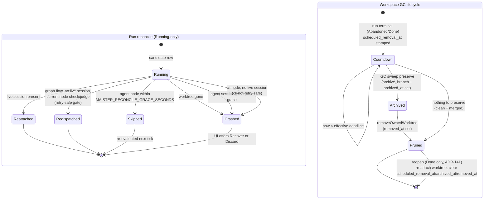
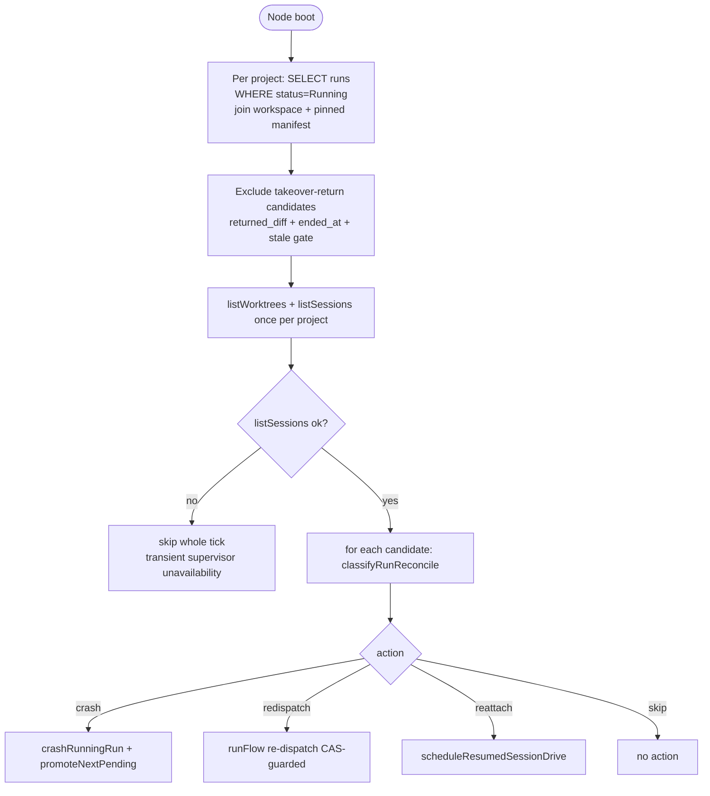
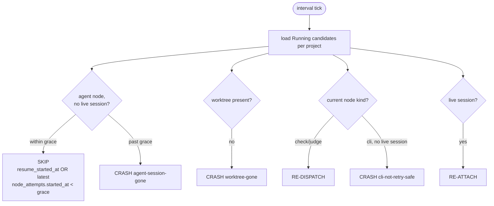
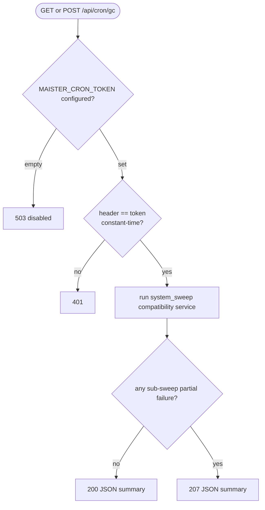
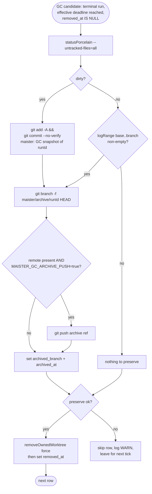
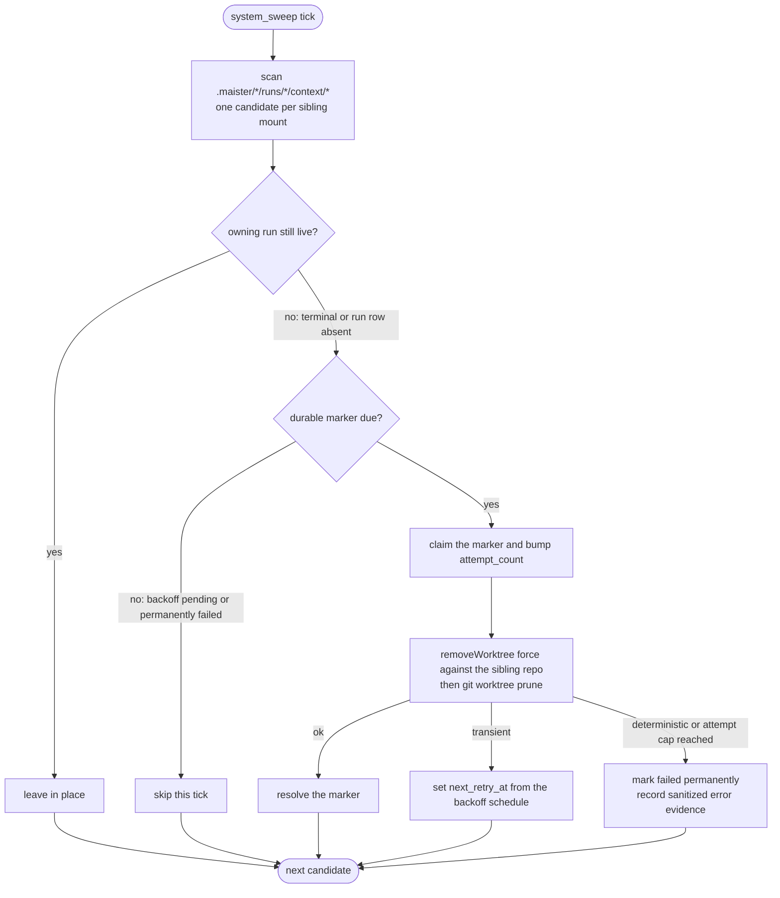

# Reconciliation and GC domain

## Purpose

This domain (**Designed**) covers two recovery-and-cleanup concerns
that sit below the live run machine. **Crash reconciliation** detects a
stranded `Running` run — a runner loop gone after a Next.js or supervisor
restart, or a session-less node left dangling — and classifies it into
re-attach, re-dispatch, skip, or `Crashed`. **Graceful workspace and
revision GC** reclaims disk for terminal runs and unreferenced flow
revisions on a graceful, preserve-then-prune schedule. The boundary: the
live mid-stream crash path (`Running → Crashed` inside an active session
via `session.crashed`/`session.exited`) is owned by the runner and is NOT
re-implemented here; reconciliation is the out-of-band recovery sweep, and
GC is the deferred removal that never destroys un-committed work.

## ADR-148 workspace cleanup contract (Implemented)

The behavior below is the shipped baseline. ADR-148 changes only the
workspace cleanup boundary: automatic row-backed GC selects the disposable
set `{Done, Abandoned}` and never selects `Review`, `Crashed`, or `Failed`.
All row-backed removal paths use a renewable lifecycle claim that fences every
irreversible Git/filesystem step and the final transaction. A persisted result
records `removal_kind` independently from `preservation_outcome`; a path absent
after process death therefore converges from durable intent instead of guessing.

Disk-only candidates first become durable `workspace_reconciliation_findings`.
Autonomous action requires a root realpath/no-symlink check, verified parent
Git registration, current provenance v2, no matching workspace/live session,
the configured grace, a lease-fenced final recheck, and a CAS-created rescue
ref. V1, malformed, ambiguous, or foreign candidates are held/quarantined and
reported, never removed. Findings retain bounded retry/backoff, sanitized error
codes, rescue evidence, and resolved history.

Each sweep observes the filesystem and missing owned paths first, then claims at
most 100 due findings from the durable ledger ordered by retry time. A held or
quarantined early path therefore cannot starve later work. Before orphan removal,
the rescue ref/commit pair is persisted under the finding claim; a process death
after deletion resolves that retained finding on the next due sweep without
relying on a vanished path. A row whose owned path is already absent is marked
removed only when it has a durable preservation result; otherwise it is
quarantined for operator review.

One claimed `system_sweep` composes reconcile, row-backed GC, orphan
reconciliation, and reconstructible-agent cleanup. Timer, tick, and
`/api/cron/gc` request that same job; a losing contender reports
`alreadyRunning`. The claimed scheduler attempt renews and fences its lease for
the complete bundle. A service-level bundle failure marks that attempt failed;
candidate-level failures remain in its summary and use their individual durable
retry or quarantine state. Runtime JSONL, transcripts, evidence, and run rows
are not GC targets.

## One-time cut-over versus recurring repair (ADR-131 — Implemented)

Migration 0094 is the only owner of unfinished-linear-run terminalization. It
runs while web and supervisor are stopped and is not a recurring reconcile
rule. Ordered follow-on migration 0095 clears only C2 task claims that predate
the durable D2 event; it does not change a run or emit an event. Reconcile never
recovers or redispatches these explained Failed rows. Workspaces are retained
and enter normal terminal preserve/prune GC after restart.

> **Unified runner & session model (Implemented).** Reconcile / resume /
> recover read the per-session `run_sessions` snapshot (incl. `acp_session_id`)
> instead of `runs.acp_session_id`; classification is session- and
> `run_kind`-aware and must cover partial `run_sessions` insert,
> spawned-but-unpersisted `acp_session_id`, and mid-run session switch. Canonical:
> [`sessions.md`](sessions.md) /
> [ADR-114](../decisions.md#adr-114-unified-flow-runner-config-first-class-sessions-per-project-connect-time-bindings-and-run_sessions-as-the-sole-run-runner-source-of-truth).
> Flipped to as-built in Phase 7 of that work.

## Domain entities

- **Run** — `runs` row. Reconciliation only acts on `runs.status='Running'`
  (allow-list). It can transition a run to `Crashed`; GC reads terminal
  runs (`Abandoned`/`Done`). See [`runs.md`](runs.md).
- **Resume-in-flight marker** — `runs.resume_started_at` (timestamptz, null
  by default; **Designed**, migration 0015). Stamped by Recover before
  the supervisor side-effect; anchors the reconcile grace window. Cleared on
  first progress, on terminal write, or by the runner's single-winner CAS-clear
  (`UPDATE runs SET resume_started_at = NULL WHERE id = ? AND resume_started_at
  IS NOT NULL`).
- **Recover target node** — `runs.resume_target_step_id` (text, null by
  default; **Implemented**, migration 0016). The node id retained at crash
  time: `crashRunningRun` copies `current_step_id → resume_target_step_id` and
  nulls `current_step_id` (clean-terminal read preserved). Recover resolves the
  node kind + `retry_safe` from this column (falling back to `current_step_id`
  for live/hand-seeded rows). See [`runs.md`](runs.md).
- **`retry_safe` opt-in** — a per-node boolean on graph nodes (`flow.yaml`
  `nodes[]`), default `false`. A crashed
  session-less node is redispatch-recoverable only when its config declares
  `retry_safe: true` (`ai_coding` ignores it — recovered via `session/resume`). See
  [`../flow-dsl.md`](../flow-dsl.md).
- **Workspace** — `workspaces` row / git worktree. GC entities added by
  migration 0015 (**Designed**):
  - `scheduled_removal_at` (timestamptz, null) — GC deadline (cleared on
    reopen, ADR-141), stamped at the `Abandoned`/`Done` transition.
  - `archived_branch` (text, null) — name of the preserved archive ref
    (`maister/archive/<runId>`).
  - `archived_at` (timestamptz, null) — when preservation completed.
  - `removed_at` (timestamptz, null; pre-existing) — when the worktree was
    pruned. Rows are NEVER hard-deleted.
- **Flow revision** — `flow_revisions` row. GC deletes rows whose
  `package_status='Removed'` once unreferenced and past age. See
  [`flow-packages.md`](flow-packages.md).
- **Live session set** — supervisor `listSessions()` records keyed by
  `acp_session_id` with `status: 'live' | 'exited' | 'crashed'`. The
  reconcile classifier (`reconcile.ts`) matches this against each run's ACTIVE
  `run_sessions` `acp_session_id`, resolved via `loadActiveRunSessionsByRunId`
  (no longer a `runs.acp_session_id` column join).
- **Worktree set** — `listWorktrees(projectRepoPath)` paths, joined against
  `workspaces.worktree_path` (the "runs vs `git worktree list`" check).
- **Context mount** (**Implemented, ADR-157**) — an ephemeral detached read-only
  checkout of a *sibling* project's repo at
  `.maister/<consuming-slug>/runs/<runId>/context/<siblingSlug>/`. It carries
  **no** `workspaces` row and lives **outside** `worktreesRoot()`, so neither the
  row-backed workspace GC nor the disk-scanning workspace reconciler can see it —
  the GC backstop sweep below is its only automatic cleanup. Its launch snapshot
  is `runs.context_mounts`; its lifecycle is owned by
  [`workspaces.md`](workspaces.md).
- **Evaluation evidence snapshot** (**Implemented, ADR-148/144** —
  `evaluation_evidence_snapshots` rows; see
  [`../db/evaluations-domain.md`](../db/evaluations-domain.md)) — the
  Evaluation Lab arm of the shared GC bundle. `sweepEvaluationEvidence`
  (`web/lib/evaluations/evidence/gc.ts`) runs on every `system_sweep` tick AND
  through the `/api/cron/gc` compatibility wrapper: (1) a `preparing` snapshot
  older than 1h never completed its seal transaction (crash between blob write
  and DB seal) and is flipped to `pending_delete` (orphan recovery); (2) a
  `pending_delete` snapshot past a 24h grace window that is cited by **no**
  `evaluation_executions.evidence_snapshot_id` is finalized to `deleted`
  (two-stage, reference-guarded — the not-referenced predicate is a safety net
  over the RESTRICT FK, so a snapshot an execution still points at is never
  finalized). Idempotent and bounded; blob pruning under
  `MAISTER_EVALUATION_EVIDENCE_ROOT` is a separate generation-rotation
  concern — this sweep owns only the DB lifecycle rows.

## State machine

The run reconcile axis (allow-list `Running`-only) and the workspace GC
lifecycle (terminal → countdown → archived → pruned). Both are
**Designed**.

`Crashed` is a real `runs.status` value; the GC lifecycle states are
**derived** from `scheduled_removal_at`, `archived_at`, and `removed_at` —
there is no `gc_state` enum column.

## Process flows

### Startup reconcile (Implemented)

Runs once on Node boot from `web/instrumentation.ts`, AFTER the two
existing recovery sweeps (`runResumeRecoverySweep`,
`runTakeoverReturnRecoverySweep`) and BEFORE the keep-alive sweeper.

Before the `Running`-only crash classifier, this same startup call repairs
ADR-137 Plan-review graph handoffs. It examines only current-step,
current-artifact parent responses in `NeedsInput|NeedsInputIdle`; it either
rewrites a missing parent input and marks delivery, or reclaims a delivered
graph wake with the existing scheduler-cap policy. This is a distinct durable
handoff recovery path and does not broaden the crash classifier's `Running`
candidate set.

### Periodic reconcile sweep (Implemented)

A `globalThis`-singleton timer
(`setInterval(...).unref()`, `MAISTER_RECONCILE_SWEEP_INTERVAL_SECONDS`,
default 60) re-runs the same classification on a cadence. This is the
sanctioned recovery poll (heartbeat + reconcile), NOT a banned live-path
transition poll — the live path stays ACP-notification-driven.

The cadence also retries the bounded Plan-review handoff repair described above.
It has no supervisor side effect: a ready graph wake calls `runFlow()` and an
at-cap idle run records `resume_requested_at` for normal scheduler admission.

### Operator Recover — hybrid resume / re-dispatch (Implemented)

Operator-driven Recover (`POST /api/runs/{runId}/recover`) classifies the
`Crashed` run with `classifyRecover(run, nodeKind, retrySafe)` over the
**recover target node** — `runs.resume_target_step_id` (the node id retained at
crash time; `current_step_id` is nulled on crash), falling back to
`current_step_id` for live/hand-seeded rows:

| recover target node | `acpSessionId` | node `retry_safe` | plan | recoverable? |
| ------------------- | -------------- | ----------------- | ---- | ------------ |
| `ai_coding` (agent) | present | ignored | `resume-agent` — ACP `session/resume <acpSessionId>` | yes (200 resumed / 202 queued) |
| `ai_coding` (agent) | null | ignored | `discard-only` | no (409) |
| session-less (`cli`/`check`/`judge`/`guard`/`human`/`form`) | irrelevant | `true` | `redispatch` — re-run the node | yes (200 redispatched / 202 queued) |
| session-less | irrelevant | `false` (default) | `discard-only` | no (409) |
| unresolvable target node | — | — | `discard-only` | no (409) |

An agent node continues the prior agent session via the ACP `session/resume`
call on `acpSessionId` (`createSession({ resumeSessionId })` +
`scheduleResumedSessionDrive`) — the
same mechanism idle-resume uses, and the continuation is exercised in CI
against the mock ACP adapter. A session-less node carries no resumable session
and is re-dispatched via `runFlow` **only** when its manifest config declares
`retry_safe: true` (re-running a session-less node repeats its side effects —
accepted-risk); otherwise it is discard-only. The durable `Crashed → Running`
(or `Crashed → Pending` when the cap is full) flip commits before any supervisor
side-effect, so a lost supervisor ack leaves the run `Running` for the
reconciler, never double-spawns.

The runner recognizes Recover as a **crash-resume mode** (a third resume mode
alongside NeedsInput-resume and takeover-resume): `driveResume` flips
`Crashed → Running` and calls `runFlow(runId, { crashResume: { targetStepId } })`;
`runGraph`/`runFlow` resume FROM the target node, re-running it once as a fresh
attempt instead of no-op'ing on the already-owned graph guard. The claim is
single-winner via a CAS-clear of the
in-flight marker (`UPDATE runs SET resume_started_at = NULL WHERE id = ? AND
resume_started_at IS NOT NULL`): the winner drives, the loser bails.

### Cron GC route (Implemented; compatibility wrapper Implemented)

`GET`/`POST /api/cron/gc` runs the unified `system_sweep` service on demand,
guarded by a constant-time `X-Maister-Cron-Token` comparison.

The route is kept as a compatibility wrapper over the unified scheduler
`system_sweep` service. The response shape and `200`/`207`/`401`/`503` behavior
remain the original GC contract; new external cron integrations should prefer
`/api/cron/tick`. The shared GC bundle both entry points run includes the
ADR-148 evaluation-evidence sweep (orphan `preparing` recovery + two-stage
reference-guarded `pending_delete → deleted` finalize — see Domain entities
above) alongside workspace/revision GC, capabilities cleanup, ephemeral-agent
cleanup, and the agent-materialization retry.

### Preserve-then-prune (Implemented)

The destructive-safety core: every removal is gated on preserve success;
GC archives a branch, it never merges to main/target (that is the shared
promotion service).

### Context-mount GC backstop (Implemented — ADR-157)

A new sweep in the `system_sweep` family, modeled on
`web/lib/gc/ephemeral-agent-gc.ts` (`runEphemeralAgentGcSweep`): scan the disk,
join each candidate to its owning run, reap what no live run owns. It reaps
mounts under `.maister/*/runs/*/context/*` whose owning run is **terminal or
absent**, then runs `git worktree prune` on every touched sibling repo. The
owning run id is read from the `runs/<runId>` path segment and the donor repo
from resolving `<siblingSlug>` to that project's `projects.repo_path` — so the
sweep needs **no** `runs.context_mounts` snapshot and reaps by **path shape
alone**. That is deliberate: it is the only cleanup that can reach the residual
crash window where a mount was created but its snapshot never committed.

The live allow-list is `Pending | Running | NeedsInput | NeedsInputIdle |
HumanWorking | WaitingOnChildren | Review` (`CONTEXT_MOUNT_LIVE_RUN_STATUSES`);
anything outside it — or a missing `runs` row — means the terminal choke already
ran or never will. `Review` is IN the set (unlike the agent-only `-ro` sweep it
is modeled on) because a `Review` flow run can rework and re-open a session that
still expects its mounts. `WaitingOnChildren` is in for the same reason in its
strongest form: a parked orchestrator WILL be woken by a child-terminal event and
resumed via `session/resume` into the same node, so reaping its mounts mid-park
would hand the resumed coordinator paths that no longer exist.

Where it goes **beyond** the `-ro` sweep it copies: that sweep has no durable
per-item state — it counts a `failed` and retries forever, so one permanently
undeletable path is re-attempted on every tick. This backstop carries a
**durable per-item attempt marker** using the ADR-148 *semantics* (`state` /
`attemptCount` / `nextRetryAt` / sanitized error evidence) but deliberately
**not** the `workspace_reconciliation_findings` table. Two independent reasons:
that table's `candidate_kind` CHECK admits only four values
(`row_missing_path | row_removed_path | rowless_managed | untrusted`), and — the
load-bearing one — `loadDueReconciliationFindings` filters only on `state`,
`nextRetryAt`, and `leaseExpiresAt` with **no kind predicate**, so a
context-mount row would be claimed and processed by the workspace reconciler
itself. The marker is instead an atomically-written file at
`<runDir>/context/.gc/<siblingSlug>.json`, deleted on a successful reap and
**retained on permanent failure as the operator-review evidence**. A
permanently-failing mount therefore cannot starve the rest of the scan:

- **Bounded retries with explicit backoff** — a transient failure sets
  `nextRetryAt` from an explicit backoff schedule (a literal table, not a
  formula, so an operator reading the marker can predict the next attempt) and
  the item is skipped until then; the attempt cap is a constant, not "retry
  forever".
- **Poison-item policy** — a *deterministic* failure (a path that is not a
  registered worktree of the named sibling, a sibling project row that no longer
  exists, a malformed path shape) becomes a permanent `failed` with sanitized
  error evidence recorded, surfaced for operator review and never re-attempted;
  a *transient* failure (a locked worktree, a busy repo) gets the bounded retry.
  The distinction is recorded on the marker, not inferred from a retry count.

#### Context mounts are out of the workspace reconciler's scan scope BY PATH

This is a structural property of where mounts live, not a filter someone added,
and it is the reason the mount path was chosen:

- The workspace reconciler scans **only** `worktreesRoot()/<slug>/<entry>` —
  exactly **two** path segments below the worktrees root
  (`isSafeWorkspaceRelativePath`, `web/lib/gc/workspace-reconciler.ts`). A mount
  at `.maister/<slug>/runs/<runId>/context/<siblingSlug>/` is not under
  `worktreesRoot()` at all, so it never enters `listCandidates()`.
- `loadTrustedProject` requires `project.repoPath === provenance.parentRepoPath`.
  A sibling mount's parent repo is **by definition a different project's repo**,
  so a mount that *did* land under `worktreesRoot()` could never satisfy that
  identity check.

**Consequence: moving context mounts under `worktreesRoot()` is a
KNOWN-BREAKING change and must be treated as one.** Every mount would become a
candidate whose provenance names a foreign parent repo, and each would resolve
to a `quarantined:untrusted_candidate` finding — the reconciler would fill with
quarantine rows for paths that are working exactly as designed. A future change
that relocates mounts must therefore land with a matching reconciler scope
change in the same commit, never on its own.

## Result-only completion feeds the ordinary GC shape (Designed — ADR-165)

A flow run that finishes `Running → Done` by result-only completion stamps
`workspaces.scheduled_removal_at = now + MAISTER_GC_AGE_DAYS` in the same
terminal transaction, exactly like a promoted run. GC needs no new branch: the
row is already `Done` with a deadline, which is what
`DISPOSABLE_WORKSPACE_RUN_STATUSES` collects. See
[`run-results.md`](run-results.md) and [`workspaces.md`](workspaces.md).

## Expectations

- Reconcile is **allow-list `Running`-only**: a row whose `runs.status` is
  not `Running` is NEVER reclassified by the reconcile sweep.
- A `Running` run whose `workspaces.worktree_path` is absent from
  `listWorktrees` MUST be crashed (reason `worktree-gone`) via
  `crashRunningRun`.
- A `Running` agent run with no live session MUST be SKIPPED while
  `resume_started_at` OR the latest `node_attempts.started_at` is within
  `MAISTER_RECONCILE_GRACE_SECONDS` (default 90); only past grace MUST it be
  crashed (reason `agent-session-gone`). A `Running` run with no live session
  whose current node is a read-only gate eval (`check`/`judge`) MUST be
  re-dispatched; a `cli` node MUST be crashed (reason `cli-not-retry-safe`) and
  NEVER auto-re-dispatched.
- A `Running` agent run with NO `acpSessionId` match but a LIVE supervisor
  session for its `(runId, currentStepId)` MUST be SKIPPED (reason
  `live-session-by-step`), never crashed: the node's prompt is in-flight and
  `acp_session_id` is persisted only after it returns.
- A supervisor `listSessions` failure MUST skip the whole reconcile tick;
  the sweep NEVER crashes a run on transient supervisor unavailability.
- (ADR-121, T15) The sweep MUST clear a STALE C2 admission claim — a
  `tasks.queue_claimed_at` older than the grace window (a claimer that crashed
  between the CAS and `launchRun`'s run-INSERT) — counted as `staleClaimsCleared`;
  it runs every tick independent of the run-candidate set (even on a
  zero-candidate tick) so a crashed claimer never strands the task.
- **(Implemented — ADR-163 amendment)** The sweep MUST stop a live supervisor
  session whose run row is already `Abandoned` — counted as
  `orphanSessionsReaped`, allow-listed to exactly that status — without
  writing the row: it is the orphan of a run-tree cascade whose best-effort
  session teardown did not complete.
- Reconcile candidate sets MUST stay disjoint from `runResumeRecoverySweep`
  (`NeedsInput`) and `runTakeoverReturnRecoverySweep` (returned takeover);
  reconcile excludes the takeover-return predicate.
- Every `Running → Crashed` MUST call `promoteNextPending` after commit, MUST
  clear `runs.resume_started_at`, and MUST copy `current_step_id →
  resume_target_step_id` (nulling `current_step_id`) so the row is cleanly
  re-recoverable and operator Recover has a target node.
- Operator Recover MUST classify via `classifyRecover(run, nodeKind,
  retrySafe)` over the recover target (`resume_target_step_id`, else
  `current_step_id`): an agent node with an `acpSessionId` resumes via
  the ACP `session/resume` call; a session-less node re-dispatches ONLY when its config is
  `retry_safe: true`; every other case is discard-only — and the crash-resume
  runner MUST claim single-winner via a CAS-clear of `resume_started_at`.
- GC MUST select terminal candidates by the effective deadline
  `COALESCE(workspaces.scheduled_removal_at, runs.ended_at + MAISTER_GC_AGE_DAYS) <= now()`
  so pre-0015 terminal runs with null `scheduled_removal_at` are still
  collected (no backfill migration).
- GC MUST preserve before pruning: a dirty worktree's tracked **and**
  untracked changes are snapshot-committed and pointed at archive branch
  `maister/archive/<runId>`; removal MUST be gated on preserve success and a
  preserve failure MUST skip the row (never force-remove unpreserved state).
- Operator archive/drop actions reuse the same preserve-before-remove
  invariant immediately from the workbench lifecycle UI. Background GC remains
  schedule-driven; user-initiated drop is claim-serialized through
  `workspaces.lifecycle_operation_*` and still refuses removal when preservation
  fails.
- GC MUST NOT merge into main/target; preservation is archive-branch
  (+ optional push when `MAISTER_GC_ARCHIVE_PUSH=true`, default `false`)
  only.
- The cron route MUST return 503 when `MAISTER_CRON_TOKEN` is empty/unset,
  401 on token mismatch (constant-time compare), and MUST NEVER log or
  stream the token; `MAISTER_CRON_TOKEN` is a server-only secret.
- Revision GC MUST delete a `flow_revisions` row only when its
  `package_status='Removed'`, past `MAISTER_GC_AGE_DAYS`, with zero
  `runs.flow_revision_id` references and zero `flows.enabled_revision_id`
  references; it only removes (`rm installedPath`), never runs `setup.sh`.
- Context mounts MUST stay OUT of the workspace reconciler's scan scope by
  path: the reconciler scans only `worktreesRoot()/<slug>/<entry>` (exactly two
  segments), so a live mount under `.maister/*/runs/*/context/*` MUST produce
  zero findings and zero quarantines. (Implemented — ADR-157)
- The context-mount GC backstop MUST reap a mount whose owning run is terminal
  or absent and MUST leave a live run's mount in place; every candidate MUST
  carry a durable attempt marker with bounded retries, so a permanently-failing
  mount is marked `failed` with recorded evidence and NEVER starves the rest of
  the scan. (Implemented — ADR-157)

## Edge cases

- **`CHECKPOINT`** — Recover hit a supervisor 4xx for an unresumable ACP
  session; the run is crashed (`crashRunningRun`, `resume_started_at`
  cleared) and only Discard is offered. No new error code is introduced.
- **`CONFLICT`** — surfaced by an underlying read-only range git op during
  preserve (e.g. `logRange`/snapshot failure on a damaged worktree); the
  preserve returns not-ok, the row is skipped and the worktree is NOT
  removed.
- **`PRECONDITION`** — Recover/Discard refused because the row is not in an
  admitted allow-list state (e.g. a concurrent transition already moved it);
  returned as 409.
- **`EXECUTOR_UNAVAILABLE`** — supervisor transient 5xx/network/timeout
  during a Recover side-effect: the row is LEFT `Running` (no rollback,
  ack may have been lost) and the reconciler re-attaches if the session came
  up or re-crashes past grace; returned as 503, retryable.
- **Cron token missing** — `MAISTER_CRON_TOKEN` empty ⇒ route is disabled
  (503), the sweep never runs from the HTTP surface; the background sweeper
  is unaffected.
- **Preserve crash window** — a death between snapshot and prune converges
  on the next tick: dirty-not-snapshotted re-runs `statusPorcelain` +
  snapshot; archived-not-pruned re-runs preserve (idempotent `git branch
  -f`) then removes; pruned-not-marked sets `removed_at` (no-op removal on a
  missing path).
- **(Implemented, ADR-157) Orphan context mount from a crash before the snapshot
  commit** — no `runs.context_mounts` entry references it, so it is reaped by
  path shape alone. This is the case that forbids replacing the backstop with a
  snapshot-driven cleanup.
- **(Implemented, ADR-157) Poison context mount** — a candidate whose removal fails
  deterministically (path is not a registered worktree of the named sibling,
  sibling project row gone, malformed path shape) is marked permanently `failed`
  with sanitized evidence after its bounded retries, and the sweep continues with
  the next candidate; it is never retried on every tick and never aborts the
  sweep.

## Reconcile classification (ADR-033)

For each run at reconcile time, gather: `run.status`, `run.runKind`,
`run.acpSessionId`, `run.currentStepId`, the workspace `worktreePath`, the
**node type of `currentStepId`** (from the run's pinned graph
`flow_revisions.manifest`), `worktreeExists` (path ∈ `listWorktrees`),
`liveSession` (`acpSessionId` ∈ live `listSessions` map). Then:

| Run state | Condition | Action | Reason |
|-----------|-----------|--------|--------|
| status ∉ `{Running}` | any | **SKIP** | reconcile is **allow-list `Running`-only**; `NeedsInput`/`NeedsInputIdle`/`HumanWorking`/terminal owned by other sweeps |
| `Running` | worktree MISSING | **CRASH** (`crashRunningRun`, reason `worktree-gone`) | the "runs vs `git worktree list`" check; cannot continue |
| `Running` | worktree present, `liveSession` present | **RE-ATTACH** (`scheduleResumedSessionDrive`) or re-dispatch `runFlow` | live agent session with no attached runner (post web restart) — not crashed |
| `Running` | worktree present, no `acpSessionId` match but a LIVE session exists for this `(runId, currentStepId)` | **SKIP** (reason `live-session-by-step`) | an agent node's prompt is in-flight — `acp_session_id` persists only AFTER it returns, so the active `run_sessions` row's is still null; the node is genuinely running and must NOT be crashed (the bug this guards) or re-attached (double-drive) |
| `Running` | worktree present, no live session, current node is a **retry-safe gate eval** (`check`/`judge`/`guard`/`human`/`form`/null — read-only) | **RE-DISPATCH** `runFlow` (CAS-guarded) | safe re-run of a read-only evaluation; avoids the forbidden false-positive crash on a gate executing between sessions |
| `Running` | worktree present, no live session, current node is **`cli`** (arbitrary side effects, NOT retry-safe) | **CRASH** (`crashRunningRun`, reason `cli-not-retry-safe`) | CAS prevents concurrent runners, NOT re-run idempotency (Codex F4); a half-run `cli` may have partial file/network side effects — never silently re-run. Recoverable via explicit human Recover **only** when the node config declares `retry_safe: true` (accepted-risk re-dispatch); otherwise discard-only. |
| `Running` | worktree present, no live session, current node is **agent**, **recently started** (`resume_started_at` OR latest `node_attempts.started_at` within `MAISTER_RECONCILE_GRACE_SECONDS`) | **SKIP** (grace window) | a launch/recover is still spinning its ACP session up — do NOT crash an in-flight session |
| `Running` | worktree present, no live session, current node is **agent**, **past grace** | **CRASH** (`crashRunningRun`, reason `agent-session-gone`) | recoverability computed at UI render from `acpSessionId` presence; auto-resume of a mid-turn agent is unsafe → explicit human Recover |
| `Running`, `runKind='scratch'` | session gone, past grace | **CRASH** via `markScratchCrashed` (sets both `runs.status` and `scratchRuns.dialogStatus`) | scratch parity |
## Linked artifacts

- ADRs: [ADR-033 Crash reconciliation model](../decisions.md#adr-033),
  [ADR-034 Crashed-run recovery semantics](../decisions.md#adr-034),
  [ADR-035 Graceful workspace GC (preserve-then-prune)](../decisions.md#adr-035),
  [ADR-036 Flow-revision GC](../decisions.md#adr-036),
  [ADR-157 Read-only sibling-repo context mounts](../decisions.md#adr-157-read-only-sibling-repo-context-mounts)
  (Designed — the context-mount GC backstop and the reconciler scan-scope
  boundary).
- API: [`../api/web.openapi.yaml`](../api/web.openapi.yaml)
  (`/api/runs/{runId}/recover`, `/api/runs/{runId}/discard`,
  `/api/runs/{runId}/archive`, `/api/runs/{runId}/drop`, `/api/cron/gc`).
- ERD: [`../db/runs-domain.md`](../db/runs-domain.md),
  [`../db/erd.md`](../db/erd.md) (`workspaces.scheduled_removal_at`,
  `archived_branch`, `archived_at`, `runs.resume_started_at` — migration
  0015; `runs.resume_target_step_id` — migration 0016).
- Config reference: [`../configuration.md`](../configuration.md) —
  `MAISTER_RECONCILE_SWEEP_INTERVAL_SECONDS`,
  `MAISTER_RECONCILE_GRACE_SECONDS`,
  `MAISTER_GC_AGE_DAYS`, `MAISTER_GC_WARNING_DAYS`,
  `MAISTER_GC_ARCHIVE_PUSH`, `MAISTER_CRON_TOKEN`.
- Error taxonomy: [`../error-taxonomy.md`](../error-taxonomy.md)
  (`CHECKPOINT`, `CONFLICT`, `PRECONDITION`, `EXECUTOR_UNAVAILABLE` —
  reused, no new code).
- Related domains: [`runs.md`](runs.md), [`workspaces.md`](workspaces.md),
  [`workbench-lifecycle.md`](workbench-lifecycle.md),
  [`flow-packages.md`](flow-packages.md), [`flow-graph.md`](flow-graph.md).
- Source (Implemented): `web/lib/reconcile.ts`, `web/lib/runs/recover.ts`,
  `web/lib/gc/preserve.ts`, `web/lib/gc/workspace-gc.ts`,
  `web/lib/gc/revision-gc.ts`, `web/lib/scheduler/system-sweeps.ts`.
- Context-mount backstop (ADR-157): `web/lib/gc/context-mount-gc.ts` (the sweep +
  the on-disk `.gc/<siblingSlug>.json` marker), `web/lib/context-mounts/terminal.ts`
  (`CONTEXT_MOUNT_LIVE_RUN_STATUSES`, the live allow-list SSOT the sweep imports);
  modeled on `web/lib/gc/ephemeral-agent-gc.ts`; scan-scope boundary asserted
  against `web/lib/gc/workspace-reconciler.ts`.

