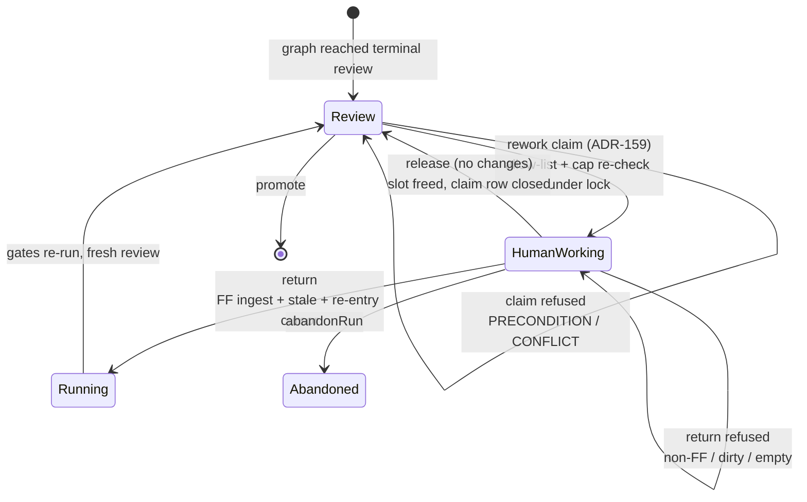
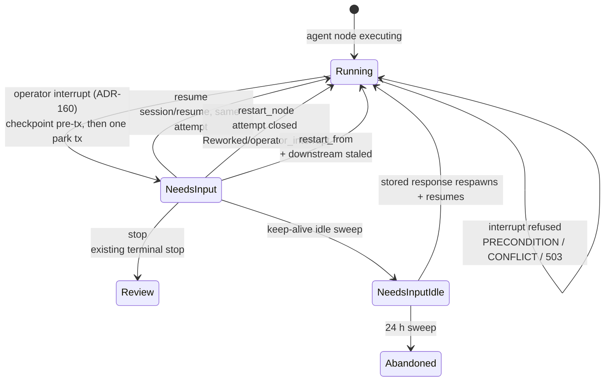
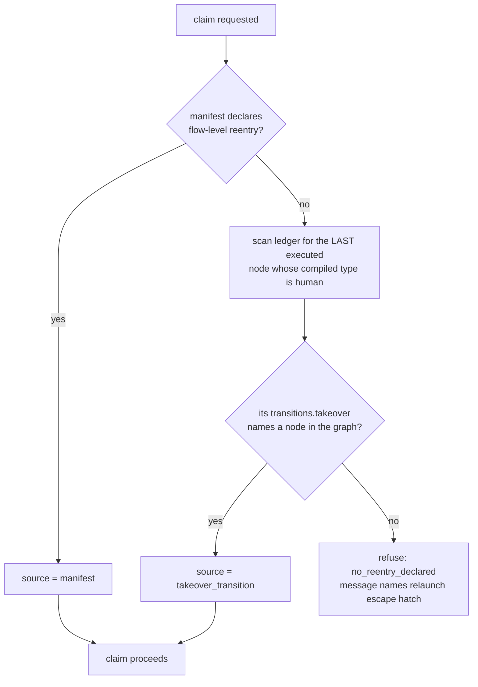
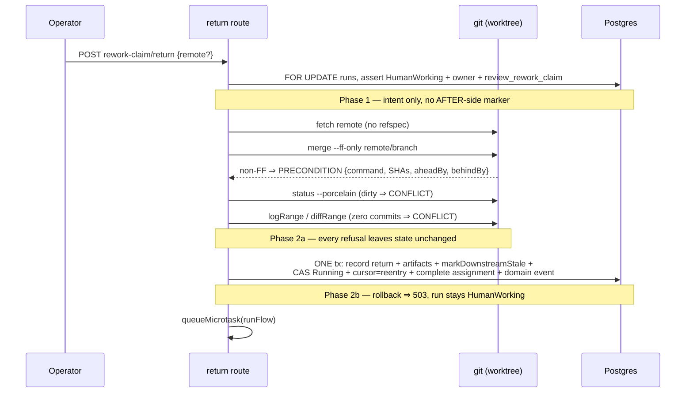
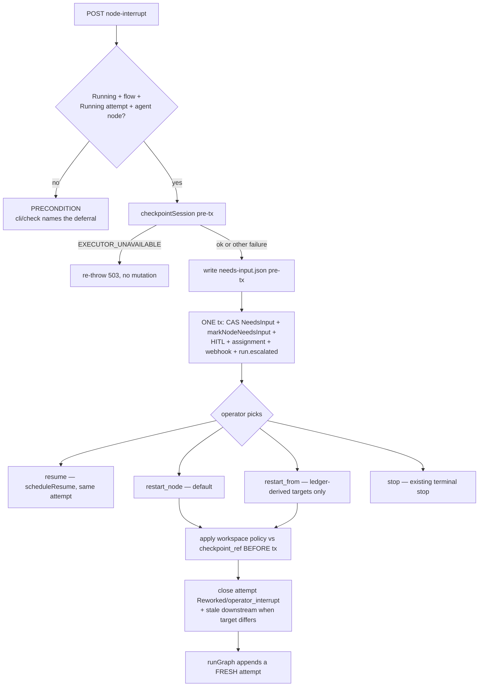

# Run continuation domain

> **Status: Feature A (ADR-159) Implemented; Feature B (ADR-160) Designed.**
> The rework claim — eligibility, claim/return/release, fast-forward-only
> ingest, re-entry resolution, the owner carve-out, and the claim/return domain
> events (migration `0125`) — is shipped. The operator node interrupt lands in
> Phases 3–4 and stays tagged `(Designed)` below until then.

## Purpose

**Run continuation** covers the two operator-initiated ways to put an already-
launched flow run back under the graph's control after it has left the agent's
hands. **(A) Rework claim** (Implemented — [ADR-159](../decisions.md#adr-159-review-run-rework-claim-with-fast-forward-only-handoff-round-trip))
takes a run that reached `Review`, hands its existing worktree to a human, ingests
whatever they push back by fast-forward only, and re-enters the graph at a
server-resolved node so the flow's own gates re-validate the new commits.
**(B) Node interrupt** (Designed — [ADR-160](../decisions.md#adr-160-operator-node-interrupt-with-corrective-restart))
pauses one live agent node mid-turn and offers a corrective restart. The domain
boundary is the operator's re-entry into a run's own graph: eligibility, the claim
ledger row, the fast-forward ingest, re-entry resolution, the interrupt option
matrix, and the accounting rules that keep both invisible to rework budgets and
correction metrics. It does **not** cover the `NeedsInput`-parked reviewer handoff
([`manual-takeover.md`](manual-takeover.md) — ADR-030, Implemented), branch
rebase/merge onto a moved target ([`branch-sync.md`](branch-sync.md) — ADR-141,
Implemented), promotion ([`readiness.md`](readiness.md)), or workspace removal
([`workbench-lifecycle.md`](workbench-lifecycle.md)).

## Domain entities

- **Rework claim** (Implemented) — a run transition `Review → HumanWorking`
  (`runs.status`). Session-less; **acquires** a concurrency slot, because
  `countLiveRuns` counts `Running|NeedsInput|HumanWorking` and `Review` is
  slot-free.
- **Claim attempt row** (Implemented) — a takeover-shaped `node_attempts` row
  appended at the **last executed node**, carrying `owner_user_id` and
  `decision='review_rework_claim'`. That `decision` value is the only thing
  distinguishing it from an ADR-030 takeover row. Persisted in
  [`db/runs-domain.md`](../db/runs-domain.md).
- **Re-entry node** (Implemented) — the graph node the run resumes at, resolved
  server-side by the ordered chain in *Process flows*. Never operator-chosen.
- **Flow-level `reentry` field** (Implemented) — an optional manifest key beside
  `nodes`, engine floor `3.5.0`, compile-validated against the graph. Compile-time
  only; never persisted to a DB column. See [`flow-dsl.md`](../flow-dsl.md).
- **Node interrupt request** (Designed) — a `hitl_requests` row with
  `kind='node_interrupt'` plus its `assignments` row with
  `action_kind='node_interrupt'`. Neither column has a DB CHECK; both enums live
  in the Drizzle `text(..., { enum: [...] })` type.
- **Operator restart attempt** (Designed) — a `node_attempts` row closed
  `Reworked` with `decision='operator_interrupt'`. Excluded from
  `rework.maxLoops` accounting and from both Observatory correction counters.
- **Domain events** (Implemented for ADR-159; ADR-160 reuses `run.escalated`) — `run.rework_claimed` and `run.rework_returned`
  (migration `0125` extends `domain_events_kind_check` to 13 kinds). The interrupt
  reuses the existing `run.escalated` with `reason='node_interrupt'`. See
  [`domain-events.md`](domain-events.md).

## State machine

Feature A — the rework claim round-trip (Implemented):

Feature B — the soft node interrupt (Designed):

## Process flows

Re-entry resolution — ordered, server-state only (Implemented). It is ledger-derived
because `runGraph` writes `current_step_id: null` on reaching `Review`:

Return — two-phase commit, all git reads and refusals before any ledger write
(Implemented):

Node interrupt and its option matrix (Designed). The option set is server-owned
and delivered on the existing `availableOptions` channel:

## Expectations

- A rework claim MUST be admitted only when `runs.status='Review'`,
  `run_kind='flow'`, `parent_run_id IS NULL`, `workspace_mode <> 'shared'`, the
  run is not a launched evaluation participant, and the workspace exists with
  `removed_at IS NULL`; any status not named here is refused by default. *(Implemented)*
- The claim MUST re-check the global concurrency cap inside the claim transaction
  under the run-row lock and return `MaisterError("CONFLICT")` when full; it MUST
  NEVER queue the run as `Pending`. *(Implemented)*
- The `Review → HumanWorking` CAS MUST commit before the claim row insert, so a
  concurrent loser is refused at the CAS and never reaches the
  `UNIQUE(run_id, node_id, attempt)` violation. *(Implemented)*
- The re-entry node MUST be resolved from server state only — manifest `reentry`,
  else the last executed `human` node's compiled `transitions.takeover`, else
  refuse — and MUST NEVER be accepted from the request body. *(Implemented)*
- While `runs.status='HumanWorking'`, `exportBranch` MUST be available to the
  actor matching `owner_user_id` and to no one else; every other lifecycle action
  MUST stay refused with `human-owned`. *(Implemented)*
- Return ingest MUST be fetch plus `merge --ff-only`; divergence MUST refuse
  `MaisterError("PRECONDITION")` and leave branch, ledger, and `runs.status`
  unchanged, and a missing remote or absent upstream MUST be a no-op success. *(Implemented)*
- Return MUST write no AFTER-side marker until `recordTakeoverReturn`, the
  artifacts, `markDownstreamStale`, the `Running` CAS, and the re-entry cursor all
  commit in one transaction; a rollback MUST surface
  `MaisterError("EXECUTOR_UNAVAILABLE")` with the run still `HumanWorking`. *(Implemented)*
- `markDownstreamStale` MUST select, per node, the latest `node_attempts` row with
  `owner_user_id IS NULL`, so a claim row NEVER shields a node's real last
  execution from gate staling — for every caller, unconditionally. *(Implemented)*
- Release without changes MUST return the run to `Review` (never `NeedsInput`),
  close the claim row, and free the slot via `promoteNextPending`. *(Implemented)*
- A node interrupt MUST be admitted only on a `Running` flow run whose current node
  has a `status='Running'` attempt and is `ai_coding | judge | orchestrator`;
  `cli` and `check` MUST refuse `MaisterError("PRECONDITION")`. *(Designed)*
- `restart_from` targets MUST be ledger-derived — nodes with at least one prior
  attempt in this run — and a target with no prior attempt MUST be refused; the
  operator correction MUST reach the agent as a fenced prompt append, never through
  `commentsVar` and never through Mustache. *(Designed)*
- `node_attempts` rows closed with `decision='operator_interrupt'` MUST be excluded
  from the `rework.maxLoops` effective count and from **both** Observatory
  counters, and MUST be bounded per run by `MAISTER_MAX_OPERATOR_RESTARTS`. *(Designed)*

## Edge cases

Refusal matrix — each row is phrased as the allow-list the code uses (Designed):

| Condition | Code | HTTP | Surface |
| --- | --- | --- | --- |
| `runs.status` not in `{Review}` at claim | `PRECONDITION` | 409 | claim |
| `run_kind` not in `{flow}` | `PRECONDITION` | 409 | claim — message names branch sync / relaunch |
| `parent_run_id` set (orchestrator child) | `PRECONDITION` | 409 | claim — protects `SETTLED_RUN_STATUSES` |
| `workspace_mode='shared'` / launched evaluation lineage | `PRECONDITION` | 409 | claim |
| workspace absent or `removed_at` set | `PRECONDITION` | 409 | claim |
| re-entry unresolved | `PRECONDITION` | 409 | claim — message names relaunch |
| concurrency cap full | `CONFLICT` | 409 | claim — never `Pending` |
| `Review → HumanWorking` CAS lost | `CONFLICT` | 409 | claim |
| actor is not `owner_user_id` | `UNAUTHORIZED` | 403 | return / release |
| claim is an ADR-030 takeover, not `review_rework_claim` | `PRECONDITION` | 409 | return — use the M11b route |
| `remote` not in the `listRemotes()` allow-list | `PRECONDITION` | 409 | return |
| branch not fast-forwardable | `PRECONDITION` | 409 | return — carries `{command, localSha, remoteSha, aheadBy, behindBy, instructions[]}` |
| worktree dirty / zero-commit return | `CONFLICT` | 409 | return — no ledger write |
| return ledger tx failed | `EXECUTOR_UNAVAILABLE` | 503 | return — retryable, still `HumanWorking` |
| `reentry` below engine floor `3.5.0` or naming an unknown node | `CONFIG` | 400 | manifest compile |
| interrupt admission term unmet (`cli`/`check` names the deferral) | `PRECONDITION` | 409 | node-interrupt |
| `Running → NeedsInput` CAS lost to node completion | `CONFLICT` | 409 | node-interrupt |
| `checkpointSession` undeliverable | `EXECUTOR_UNAVAILABLE` | 503 | node-interrupt — re-thrown, no mutation |
| machine/agent actor answering `node_interrupt` | `UNAUTHORIZED` | 403 | `respondToHitl` chokepoint |
| `restart_from` target has no prior attempt in this run | `PRECONDITION` | 409 | hitl respond — no forward skips |
| `MAISTER_MAX_OPERATOR_RESTARTS` reached | `CONFLICT` | 409 | hitl respond |

Crash windows — accepted residuals, each recovered rather than prevented (Designed):

| Window | Durable state | Recovery |
| --- | --- | --- |
| **CA1** claim tx committed, response lost | `HumanWorking`, open claim row | None needed — the claim is the durable intent; a retry loses the CAS → `CONFLICT`. |
| **CA2** fetch/FF done, ledger tx not started | `HumanWorking`, worktree advanced | Idempotent — the FF is a no-op on retry; the operator re-clicks Return. |
| **CA3** return committed, `runFlow` never dispatched | `Running`, cursor at re-entry, gates `stale` | The existing `runTakeoverReturnRecoverySweep` covers it unchanged; its predicate is agnostic to the takeover row's own node. |
| **CA4** partial ledger write | impossible | All return writes are ONE transaction; rollback ⇒ `EXECUTOR_UNAVAILABLE` 503. |
| **CB1** checkpoint delivered, park tx not committed | `Running`, agent SIGTERMed | `needs-input.json` unlinked in the catch; the runner's `STEP_CHECKPOINTED` path parks on the same state. |
| **CB2** checkpoint `EXECUTOR_UNAVAILABLE` | no mutation | Re-thrown 503; run stays `Running`. No split-brain. |
| **CB3** restart recorded, `runFlow` not dispatched | `NeedsInput`, attempt `Reworked` | The HITL already-delivered self-heal branch re-drives `scheduleResume`. |
| **CB4** workspace policy applied, ledger tx not committed | worktree rewound | Idempotent — re-deciding re-applies against the same `checkpoint_ref`. |
| **CB5** interrupted run idled then abandoned at 24 h | terminal | Inherited `hook_trip` behaviour; both sweeper passes include `node_interrupt`. |

Degradations that are not refusals (Designed): a `checkpoint_ref` missing at
restart time degrades to workspace policy `keep` with a WARN and is never guessed;
gates staled by a return move through the ordinary `gate_results` lifecycle and
throw nothing.

## Linked artifacts

- **ADRs** — [ADR-159](../decisions.md#adr-159-review-run-rework-claim-with-fast-forward-only-handoff-round-trip),
  [ADR-160](../decisions.md#adr-160-operator-node-interrupt-with-corrective-restart);
  precedents [ADR-030](../decisions.md#adr-030-manual-takeover-as-a-local-worktree-handoff-humanworking-status)
  manual takeover, [ADR-141](../decisions.md#adr-141-branch-sync-with-ai-conflict-resolver-and-reopen) branch sync,
  [ADR-086](../decisions.md#adr-086-domain-event-outbox-as-the-shared-trigger-bus) domain events.
- **Spec** — `.ai-factory/specs/run-continuation-controls.spec.md` (REQ / AC / test-id matrix).
- **Analytics** — [`runs.md`](runs.md), [`manual-takeover.md`](manual-takeover.md),
  [`hitl.md`](hitl.md), [`workbench-lifecycle.md`](workbench-lifecycle.md),
  [`flow-graph.md`](flow-graph.md), [`domain-events.md`](domain-events.md),
  [`branch-sync.md`](branch-sync.md).
- **API** — [`api/web.openapi.yaml`](../api/web.openapi.yaml) (`run-continuation` tag),
  [`api/async/web-runs.asyncapi.yaml`](../api/async/web-runs.asyncapi.yaml),
  [`api/async/outbound-webhooks.asyncapi.yaml`](../api/async/outbound-webhooks.asyncapi.yaml).
- **DB** — [`database-schema.md`](../database-schema.md), [`db/domain-events.md`](../db/domain-events.md),
  [`db/runs-domain.md`](../db/runs-domain.md); migration `0125`.
- **DSL** — [`flow-dsl.md`](../flow-dsl.md), `web/lib/config.schema.ts`,
  `web/lib/flows/flow-dsl-grammar.ts`.
- **Errors** — [`error-taxonomy.md`](../error-taxonomy.md) (no new code; cell entries only).
